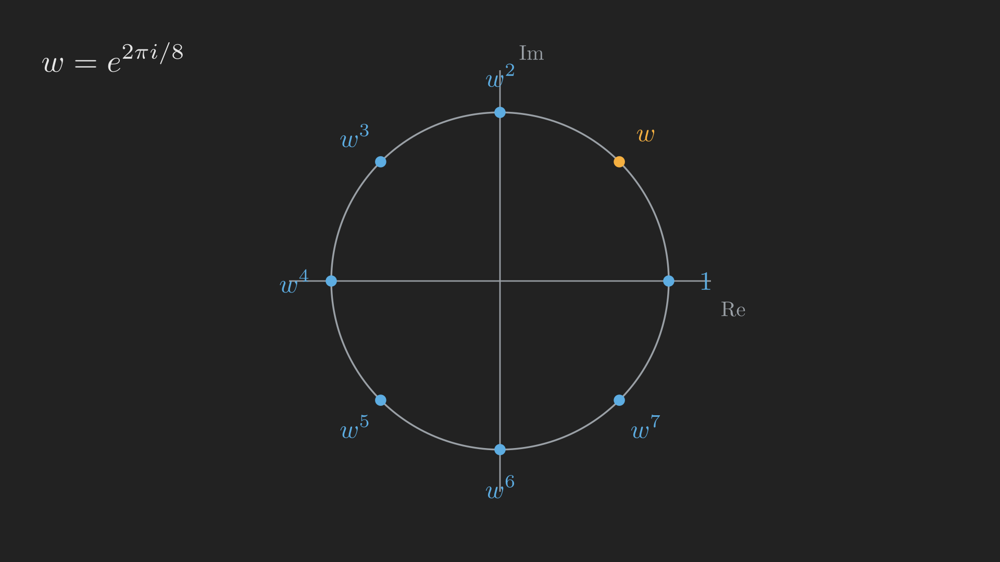
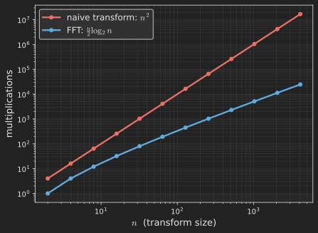

# Introduction

In [Part 13](../symmetric-and-positive-definite-matrices/index.qmd) we celebrated symmetric matrices: real eigenvalues, orthogonal eigenvectors, the clean decomposition $\vb{A} = \vb{Q}\boldsymbol{\Lambda}\vb{Q}^{\intercal}$. Every matrix in that story had real entries. But some of the most useful matrices in science and engineering, the ones describing rotations, oscillations, and signals, are far more natural to write with complex numbers. The moment we let entries be complex, two of our most trusted tools need a small but crucial upgrade.

The dot product is the first casualty. For real vectors, the length of $\vb{x}$ comes from $\vb{x}^{\intercal}\vb{x}$, a sum of squares. For a complex vector that sum can be zero or even negative for nonzero vectors, which would be a disaster for a notion of "length". The fix is to conjugate one of the factors, and that single change ripples outward: the transpose becomes the **conjugate transpose**, "symmetric" becomes **Hermitian**, and "orthogonal" becomes **unitary**.

With those upgraded tools in hand, we will meet the single most important complex matrix in applied mathematics, the **Fourier matrix**, whose columns are perfectly orthogonal and made of nothing but powers of a single complex number. And then we will see the structural miracle hidden inside it: a recursive factorization that turns an $n^2$ computation into an $n \log n$ one. That algorithm, the **Fast Fourier Transform**, is quietly running every time you stream audio, compress an image, or take a photo.

## Where we are

```{mermaid}
%%| fig-align: center
flowchart LR
    subgraph ACT1["Act I: Solving Ax = b"]
        P1["1. Geometry"] --> P2["2. Elimination & LU"] --> P3["3. Column Space & Nullspace"] --> P4["4. Rank & Complete Solution"]
    end
    subgraph ACT2["Act II: Structure & Orthogonality"]
        P5["5. Basis & Four Subspaces"] --> P6["6. Graphs & Networks"] --> P7["7. Projections"] --> P8["8. Least Squares & QR"] --> P9["9. Determinants"]
    end
    subgraph ACT3["Act III: Eigenvalues & Beyond"]
        P10["10. Eigenvalues"] --> P11["11. Diagonalization & ODEs"] --> P12["12. Markov & Fourier"] --> P13["13. Positive Definite"] --> P14["14. Complex & FFT"] --> P15["15. Jordan Form"] --> P16["16. SVD"] --> P17["17. Transformations"] --> P18["18. Pseudoinverse"]
    end
    ACT1 --> ACT2 --> ACT3

    style P14 fill:#10a37f,color:#fff
```

# Length, the complex way

Recall that a complex number $z = a + bi$ has a conjugate $\bar{z} = a - bi$, and the product $z\bar{z} = a^2 + b^2 = \lvert z \rvert^2$ is its squared magnitude, a real, nonnegative number. That is the clue for how to measure complex vectors.

If we naively used $\vb{z}^{\intercal}\vb{z}$ for a complex vector $\vb{z}$, we would be adding up $z_k^2$, not $\lvert z_k \rvert^2$, and the answer could be complex or negative. To get a real, nonnegative length we must conjugate one factor. Define the **conjugate transpose** of $\vb{z}$, written $\vb{z}^{H}$ (read "z Hermitian"), as the transpose with every entry conjugated. Then

$$
\vb{z}^{H}\vb{z} = \sum_k \bar{z}_k z_k = \sum_k \lvert z_k \rvert^2 = \lVert \vb{z} \rVert^2 \geq 0,
$$

a genuine squared length. The same upgrade defines the complex inner product of two vectors as $\vb{y}^{H}\vb{x}$, and two complex vectors are **orthogonal** when $\vb{y}^{H}\vb{x} = 0$. Everywhere a real transpose $\vb{x}^{\intercal}$ used to appear, the complex world writes the conjugate transpose $\vb{x}^{H}$ instead.

# Hermitian and unitary: the complex versions of symmetric and orthogonal

Once the transpose is upgraded, the two special families from earlier posts upgrade with it.

A matrix is **Hermitian** when it equals its own conjugate transpose,

$$
\vb{A}^{H} = \vb{A}.
$$

This is the complex cousin of a symmetric matrix, and it inherits the best property of the spectral theorem: a Hermitian matrix has **real eigenvalues** and orthogonal eigenvectors, even though its entries are complex. (The diagonal entries of a Hermitian matrix must themselves be real, since they equal their own conjugates.)

A matrix is **unitary** when its columns are orthonormal under the complex inner product, which we write compactly as

$$
\vb{Q}^{H}\vb{Q} = \vb{I}.
$$

This is the complex cousin of an orthogonal matrix. A unitary matrix preserves complex length, $\lVert \vb{Q}\vb{x} \rVert = \lVert \vb{x} \rVert$, just as an orthogonal matrix preserves real length, so multiplying by it is a rigid motion in complex space. These are exactly the right tools for the matrix we are about to meet.

# The Fourier matrix

The $n \times n$ **Fourier matrix** $\vb{F}_n$ is built from a single complex number, the primitive $n$-th root of unity

$$
w = e^{2\pi i / n},
$$

a point on the unit circle that, when raised to higher and higher powers, marches around the circle in $n$ equal steps and returns to $1$ after a full loop ($w^n = 1$). The entry of $\vb{F}_n$ in row $j$, column $k$ (counting rows and columns from $0$) is simply

$$
\left(\vb{F}_n\right)_{jk} = w^{jk}.
$$

@fig-roots_of_unity shows these powers of $w$ sitting at equal angles around the unit circle. They are the raw material the whole matrix is made of.

{#fig-roots_of_unity fig-align="center" width=60%}

Take $n = 4$, where $w = e^{2\pi i / 4} = e^{i\pi/2} = i$. Filling in $w^{jk}$ and using $i^2 = -1$, $i^3 = -i$, $i^4 = 1$, the matrix is

$$
\vb{F}_4 =
\begin{bmatrix}
  1 & 1 & 1 & 1 \\
  1 & i & -1 & -i \\
  1 & -1 & 1 & -1 \\
  1 & -i & -1 & i
\end{bmatrix}.
$$

Now the payoff of all that conjugate-transpose machinery: **the columns of $\vb{F}_n$ are orthogonal** under the complex inner product. Any two distinct columns satisfy $\vb{f}_j^{H}\vb{f}_k = 0$, and each column has squared length $n$. In matrix form $\vb{F}_n^{H}\vb{F}_n = n\vb{I}$, which means $\tfrac{1}{\sqrt{n}}\vb{F}_n$ is **unitary**. (For $n = 4$, each column has length $2$, so $\tfrac{1}{2}\vb{F}_4$ is unitary.) Because $\vb{F}_n$ is built from an orthogonal basis, multiplying a vector by it, the *discrete Fourier transform*, just re-expresses that vector in the basis of pure frequencies. That is why the Fourier matrix is the engine of all signal processing: it changes a signal from "values over time" to "amounts of each frequency".

# The Fast Fourier Transform: the structural miracle

Multiplying an $n$-dimensional vector by a full $n \times n$ matrix normally costs about $n^2$ multiplications, one for every entry. For a high-resolution signal with $n$ in the millions, $n^2$ is astronomically expensive. The reason the Fourier transform is usable at all is that $\vb{F}_n$ is not just any matrix: its rigid structure of powers of $w$ lets it be **factored**, and the factorization slashes the cost.

The key identity, the heart of the Fast Fourier Transform, expresses $\vb{F}_n$ in terms of *two copies of the half-size matrix* $\vb{F}_{n/2}$:

$$
\vb{F}_n =
\begin{bmatrix} \vb{I} & \vb{D} \\ \vb{I} & -\vb{D} \end{bmatrix}
\begin{bmatrix} \vb{F}_{n/2} & \vb{0} \\ \vb{0} & \vb{F}_{n/2} \end{bmatrix}
\vb{P}.
$$

The three factors each do one cheap job. The permutation $\vb{P}$ on the right reorders the input to put the even-indexed entries first and the odd-indexed entries second. The middle factor applies the half-size Fourier transform to each of those two halves. The left factor recombines them, using a diagonal matrix $\vb{D} = \mathrm{diag}\left(1, w, w^2, \dots, w^{n/2 - 1}\right)$ of "twiddle factors" to twist the odd half before adding and subtracting. The remarkable part is that a size-$n$ transform now costs two size-$\tfrac{n}{2}$ transforms plus a little bookkeeping.

But why stop at one step? Each $\vb{F}_{n/2}$ splits into two copies of $\vb{F}_{n/4}$, and those split again, all the way down. @fig-fft_recursion traces the recursion for $n = 64$: one $\vb{F}_{64}$ becomes two $\vb{F}_{32}$, then four $\vb{F}_{16}$, and so on until the transforms are trivially small.

```{dot}
//| label: fig-fft_recursion
//| fig-cap: "The FFT recursion: each Fourier transform splits into two half-size transforms, down through log-base-2 of n levels. Following the tree from the top is the Fast Fourier Transform."
digraph fft {
  bgcolor="transparent"
  node [fontcolor="#e6e6e6", style=filled, color="#e6e6e6", fillcolor="#333333", fontname="Helvetica", shape=box]
  edge [color="#e6e6e6", fontcolor="#e6e6e6"]
  graph [fontcolor="#e6e6e6", fontname="Helvetica", ranksep=0.55, nodesep=0.35]

  F64 [label="F (size 64)", fillcolor="#1f3a4d"]
  F32a [label="F (size 32)"]
  F32b [label="F (size 32)"]
  F16a [label="F (16)"]
  F16b [label="F (16)"]
  F16c [label="F (16)"]
  F16d [label="F (16)"]
  d1 [label="...", shape=plaintext, fillcolor="transparent"]
  d2 [label="...", shape=plaintext, fillcolor="transparent"]
  d3 [label="...", shape=plaintext, fillcolor="transparent"]
  d4 [label="...", shape=plaintext, fillcolor="transparent"]
  base [label="size-1 transforms (do nothing)", fillcolor="#1f3a4d"]

  F64 -> F32a
  F64 -> F32b
  F32a -> F16a
  F32a -> F16b
  F32b -> F16c
  F32b -> F16d
  F16a -> d1
  F16b -> d2
  F16c -> d3
  F16d -> d4
  d1 -> base
  d2 -> base
  d3 -> base
  d4 -> base
}
```

Counting the work, there are $\log_2 n$ levels of recursion, and each level does about $\tfrac{n}{2}$ multiplications (one diagonal $\vb{D}$ pass). The total is about

$$
\frac{n}{2} \log_2 n
$$

multiplications, compared with $n^2$ for the naive matrix multiply. The gap is staggering. For $n = 64$ the FFT needs roughly $\tfrac{64}{2} \cdot 6 = 192$ multiplications instead of $64^2 = 4096$. For $n = 2^{20}$ (about a million), $n^2$ is around $10^{12}$ while $\tfrac{n}{2}\log_2 n$ is only about $10^7$, a hundred-thousand-fold saving. @fig-fft_cost shows the two curves diverging.

{#fig-fft_cost fig-align="center" width=70%}

That single factorization, exposing $\vb{F}_n$ as a product of a sparse recombination matrix, two half-size transforms, and a permutation, is one of the most consequential ideas in computation. It is linear algebra paying for the digital world.

# Where we are, and where we go next

Let us take stock. Allowing complex entries cost us almost nothing and bought us a great deal:

- Length and orthogonality upgrade by conjugating one factor: $\vb{z}^{H}\vb{z} = \lVert \vb{z} \rVert^2$, and orthogonality is $\vb{y}^{H}\vb{x} = 0$.
- **Hermitian** ($\vb{A}^{H} = \vb{A}$) is the complex symmetric, with real eigenvalues; **unitary** ($\vb{Q}^{H}\vb{Q} = \vb{I}$) is the complex orthogonal, preserving length.
- The **Fourier matrix** $\vb{F}_n$ has orthogonal columns made of powers of $w = e^{2\pi i / n}$, so $\tfrac{1}{\sqrt{n}}\vb{F}_n$ is unitary.
- Its recursive factorization is the **FFT**, cutting the cost from $n^2$ to $\tfrac{n}{2}\log_2 n$.

We have now seen the best-case decompositions: symmetric and Hermitian matrices break apart perfectly into orthogonal eigenvectors. But back in Part 11 we flagged a danger: some matrices do not have enough eigenvectors to be diagonalized at all. It is time to face those matrices honestly. What is the closest thing to a diagonal form when diagonalization is simply impossible? The answer is the **Jordan form**, and the idea of **similar matrices** that frames it, which is where Part 15 takes us.
