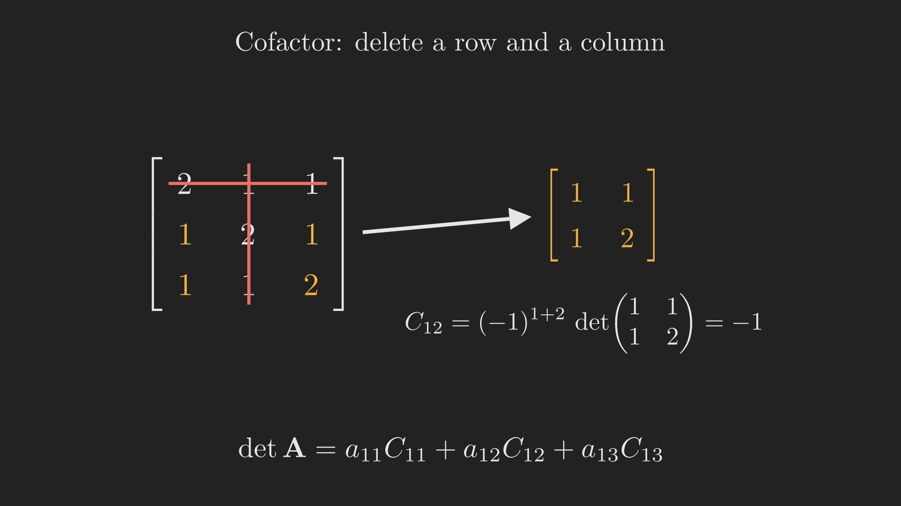
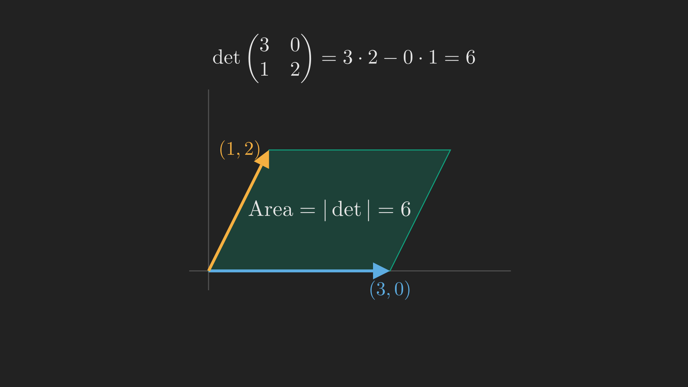

# Introduction

All through [Act II](../basis-dimension-and-the-four-subspaces/index.qmd) one question kept resurfacing: is a matrix invertible or not? It decided whether $\vb{A}\vb{x} = \vb{b}$ had a unique solution, whether columns were independent, whether $\vb{A}^{\intercal}\vb{A}$ could be inverted in [least squares](../least-squares-and-gram-schmidt/index.qmd). Wouldn't it be wonderful to have a single number, computed from the entries of $\vb{A}$, that is zero exactly when $\vb{A}$ is singular and nonzero exactly when it is invertible?

That number is the **determinant**, written $\det \vb{A}$ or $\left| \vb{A} \right|$. It packs an astonishing amount of information into one scalar. In this post we build it from scratch, not by memorizing a formula, but by insisting on three simple properties and letting everything else follow. We will get a computational formula, a beautiful geometric meaning (the determinant is a volume), and the tool we need to launch the second great theme of the course: eigenvalues.

## Where we are

```{mermaid}
%%| fig-align: center
flowchart LR
    subgraph ACT1["Act I: Solving Ax = b"]
        P1["1. Geometry"] --> P2["2. Elimination & LU"] --> P3["3. Column Space & Nullspace"] --> P4["4. Rank & Complete Solution"]
    end
    subgraph ACT2["Act II: Structure & Orthogonality"]
        P5["5. Basis & Four Subspaces"] --> P6["6. Graphs & Networks"] --> P7["7. Projections"] --> P8["8. Least Squares & QR"] --> P9["9. Determinants"]
    end
    subgraph ACT3["Act III: Eigenvalues & Beyond"]
        P10["10. Eigenvalues"] --> P11["11. Diagonalization & ODEs"] --> P12["12. Markov & Fourier"] --> P13["13. Positive Definite"] --> P14["14. Complex & FFT"] --> P15["15. Jordan Form"] --> P16["16. SVD"] --> P17["17. Transformations"] --> P18["18. Pseudoinverse"]
    end
    ACT1 --> ACT2 --> ACT3

    style P9 fill:#10a37f,color:#fff
```

We are at the final stop of Act II. The determinant is both a capstone for everything about solving and a springboard into eigenvalues, which open Act III.

# Three rules that define everything

Instead of starting from a formula and hoping it means something, we do the reverse. We write down three properties we *insist* the determinant must have, and then discover that these three pin it down completely. For now think of the determinant as a function of the rows of a square matrix.

**Rule 1: the determinant of the identity is 1.**
$$
\det \vb{I} = 1.
$$

**Rule 2: swapping two rows reverses the sign.** Exchange any two rows of $\vb{A}$ and the determinant changes sign. (Already this tells us a permutation matrix has determinant $+1$ or $-1$ depending on whether it takes an even or odd number of swaps to build.)

**Rule 3: the determinant is linear in each row separately.** This has two parts. If you multiply a single row by a number $t$, the determinant multiplies by $t$. And if a single row is written as a sum, the determinant splits accordingly:
$$
\begin{vmatrix} t a & t b \\ c & d \end{vmatrix} = t\begin{vmatrix} a & b \\ c & d \end{vmatrix},
\qquad
\begin{vmatrix} a + a' & b + b' \\ c & d \end{vmatrix}
= \begin{vmatrix} a & b \\ c & d \end{vmatrix} + \begin{vmatrix} a' & b' \\ c & d \end{vmatrix}.
$$
Linearity applies to one row at a time, with the other rows held fixed. It does *not* say $\det\left(\vb{A} + \vb{B}\right) = \det \vb{A} + \det \vb{B}$, which is false in general.

That is the entire definition. Everything else about determinants is a consequence of these three rules.

# What the rules force

A handful of consequences follow almost immediately, and together they make determinants computable.

**Two equal rows give determinant zero.** Swap the two equal rows: by Rule 2 the determinant flips sign, but the matrix is unchanged, so $\det \vb{A} = -\det \vb{A}$, which forces $\det \vb{A} = 0$. This is the seed of the connection to singularity: equal rows are about as dependent as rows can be.

**Subtracting a multiple of one row from another does not change the determinant.** This is the elimination step we have used since [Part 2](../elimination-inverses-and-lu-factorization/index.qmd). It follows from Rules 3 and the previous fact. The payoff is enormous: elimination, which we already trust, leaves the determinant untouched.

**A row of zeros gives determinant zero**, and **a triangular matrix has determinant equal to the product of its diagonal entries.** Combining these with the previous point gives the practical recipe: eliminate $\vb{A}$ down to an upper-triangular $\vb{U}$ (the determinant does not change, apart from a sign flip for each row swap), then read off the product of the pivots.

$$
\det \vb{A} = \pm\left(\text{product of the pivots}\right).
$$

This already ties the determinant to invertibility. Recall from Part 2 that a matrix is invertible exactly when elimination produces a full set of nonzero pivots. So $\det \vb{A} \neq 0$ precisely when $\vb{A}$ is invertible, and $\det \vb{A} = 0$ precisely when it is singular. Our wish is granted.

Two more properties round out the toolkit, and we will lean on both in later posts:

$$
\det\left(\vb{A}\vb{B}\right) = \left(\det \vb{A}\right)\left(\det \vb{B}\right),
\qquad
\det\left(\vb{A}^{\intercal}\right) = \det \vb{A}.
$$

The product rule is the workhorse; for example it instantly gives $\det\left(\vb{A}^{-1}\right) = 1 / \det \vb{A}$. And because the transpose leaves the determinant unchanged, every rule we stated for rows holds equally for columns.

@tbl-det_properties collects the properties in one place.

::: {.tbl tbl-colwidths="auto"}
| Property | Statement |
|:---|:---|
| Identity | $\det \vb{I} = 1$ |
| Row swap | exchanging two rows flips the sign |
| Linear in each row | scaling a row scales $\det$; a summed row splits $\det$ |
| Equal rows | two equal rows give $\det = 0$ |
| Elimination | subtracting a multiple of one row from another leaves $\det$ unchanged |
| Triangular | $\det$ equals the product of the diagonal entries |
| Product | $\det\left(\vb{A}\vb{B}\right) = \det\vb{A} \, \det\vb{B}$ |
| Transpose | $\det\left(\vb{A}^{\intercal}\right) = \det\vb{A}$ |
| Invertibility | $\det\vb{A} \neq 0 \iff \vb{A}$ is invertible |

: The determinant, from three rules to their consequences. {#tbl-det_properties style="width:80%; margin:auto;"}
:::

# The big formula and cofactors

Eliminating to find a determinant is efficient, but it hides the structure. There is also an explicit formula. For a $2 \times 2$ matrix, applying the three rules carefully produces the formula you already know:

$$
\det \begin{bmatrix} a & b \\ c & d \end{bmatrix} = ad - bc.
$$

For an $n \times n$ matrix the same reasoning gives the **big formula**: a sum over all $n!$ ways of choosing one entry from each row and each column, every term carrying a $+$ or $-$ sign according to whether that choice is an even or odd permutation. With $n!$ terms it is monstrous to use directly (a $10 \times 10$ matrix has over three million terms), but it is the honest definition behind everything.

The practical middle ground is **cofactor expansion**, which breaks an $n \times n$ determinant into smaller ones. The **minor** $M_{ij}$ is the determinant of the $\left(n-1\right) \times \left(n-1\right)$ matrix left after deleting row $i$ and column $j$. The **cofactor** attaches a sign:
$$
C_{ij} = \left(-1\right)^{i+j} M_{ij}.
$$
The checkerboard of signs $\left(-1\right)^{i+j}$ starts with $+$ in the top-left corner and alternates. @fig-cofactor shows the idea: to use the entry $a_{ij}$, you cross out its row and column and take the determinant of what remains.

{#fig-cofactor fig-align="center" width=92%}

Expanding along any row (or column) gives the determinant:
$$
\det \vb{A} = a_{i1} C_{i1} + a_{i2} C_{i2} + \cdots + a_{in} C_{in}.
$$

Let us put it to work on a symmetric $3 \times 3$ matrix we will meet again in later posts:
$$
\vb{A} = \begin{bmatrix} 2 & 1 & 1 \\ 1 & 2 & 1 \\ 1 & 1 & 2 \end{bmatrix}.
$$
Expanding across the first row,
$$
\det \vb{A}
= 2\begin{vmatrix} 2 & 1 \\ 1 & 2 \end{vmatrix}
- 1\begin{vmatrix} 1 & 1 \\ 1 & 2 \end{vmatrix}
+ 1\begin{vmatrix} 1 & 2 \\ 1 & 1 \end{vmatrix}
= 2\left(3\right) - 1\left(1\right) + 1\left(-1\right) = 4.
$$
As a check, elimination turns $\vb{A}$ into an upper-triangular matrix with pivots $2$, $\tfrac{3}{2}$, $\tfrac{4}{3}$, whose product is $2 \cdot \tfrac{3}{2} \cdot \tfrac{4}{3} = 4$. The two methods agree, as they must.

# What the determinant means: volume

Numbers are more memorable when they mean something geometric, and the determinant has a beautiful meaning. Take the rows of a $2 \times 2$ matrix as two vectors in the plane. They span a parallelogram, and

$$
\text{area of the parallelogram} = \left| \det \vb{A} \right|.
$$

@fig-det_volume shows it for the vectors $\left(3, 0\right)$ and $\left(1, 2\right)$: the parallelogram they span has area $\left| 3 \cdot 2 - 0 \cdot 1 \right| = 6$. The sign of the determinant even carries information, namely the orientation (whether the second vector is counterclockwise or clockwise from the first).

{#fig-det_volume fig-align="center" width=80%}

The same statement holds in every dimension: in $\mathbb{R}^3$ the three rows span a parallelepiped (a slanted box) whose volume is $\left| \det \vb{A} \right|$, and so on. This is exactly why a singular matrix has $\det = 0$: if the rows are dependent, the box they span is flat, squashed into a lower dimension, and a flat box has zero volume. Invertibility, independence, and nonzero volume are three faces of the same fact.

# Two classic payoffs

The determinant gives clean (if not always fast) formulas for two things we have computed by elimination.

**The inverse.** Assemble the cofactors into a matrix $\vb{C}$, transpose it, and divide by the determinant:
$$
\vb{A}^{-1} = \frac{1}{\det \vb{A}}\, \vb{C}^{\intercal}.
$$
The transpose of the cofactor matrix is called the adjugate. The formula makes the role of the determinant vivid: when $\det \vb{A} = 0$ we are dividing by zero, which is the algebra refusing to invert a singular matrix.

**Cramer's rule.** The solution of $\vb{A}\vb{x} = \vb{b}$ has each component given by a ratio of determinants:
$$
x_j = \frac{\det \vb{B}_j}{\det \vb{A}},
$$
where $\vb{B}_j$ is $\vb{A}$ with its $j$-th column replaced by $\vb{b}$. It is a gorgeous formula and a terrible way to actually solve large systems (elimination is far faster), but it shows how completely the determinant controls the solution.

# Where we are, and where we go next

We set out wanting a single number that detects invertibility, and the determinant delivered far more:

- Three rules ($\det \vb{I} = 1$, sign flip on row swap, linearity in each row) define it, and everything else follows, including $\det \vb{A} \neq 0 \iff \vb{A}$ is invertible.
- It can be computed by elimination (product of pivots), by the big formula ($n!$ signed terms), or by cofactor expansion (recursion into minors).
- Geometrically it is a signed volume, which is why dependent rows, collapsing the box flat, give determinant zero.
- It yields closed forms for the inverse (via cofactors) and for solutions (Cramer's rule).

There is one more use of the determinant that towers over the rest, and it is the reason this post sits where it does. Consider the equation $\det\left(\vb{A} - \lambda \vb{I}\right) = 0$. For most numbers $\lambda$ the matrix $\vb{A} - \lambda \vb{I}$ is invertible, so its determinant is nonzero. But for special values of $\lambda$ it becomes singular, and at those values something remarkable happens: there is a nonzero vector $\vb{x}$ that $\vb{A}$ merely stretches, $\vb{A}\vb{x} = \lambda \vb{x}$, without changing its direction. Those special numbers are the **eigenvalues**, those special directions the **eigenvectors**, and they are the gateway to the entire second half of linear algebra. That is where Part 10 begins.
