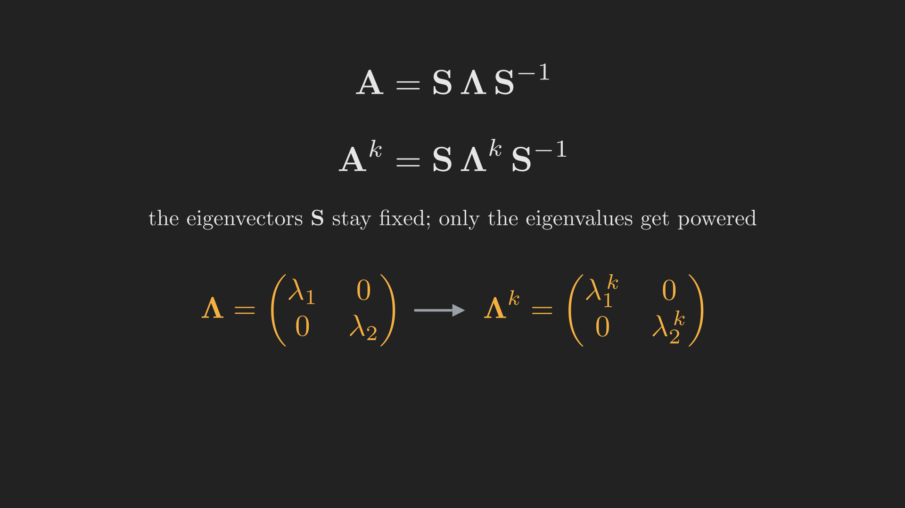

# Introduction

In [Part 10](../eigenvalues-and-eigenvectors/index.qmd) we found the special directions of a matrix: the eigenvectors, which $\vb{A}$ only stretches by their eigenvalues. That is pretty, but what is it *for*? Here is the payoff. Suppose you need $\vb{A}^{100}$, or you need to solve a coupled system of differential equations $\tfrac{d\vb{u}}{dt} = \vb{A}\vb{u}$. Done head-on, both are miserable. But in the coordinate system built from the eigenvectors, the matrix becomes diagonal, and diagonal matrices are effortless: you raise a diagonal matrix to the hundredth power one entry at a time.

This post is about that change of coordinates, called **diagonalization**, and the two huge problems it cracks open: taking powers of a matrix (which solves difference equations like the Fibonacci sequence) and exponentiating a matrix (which solves differential equations). The eigenvectors are the keys; this is where they start unlocking doors.

## Where we are

```{mermaid}
%%| fig-align: center
flowchart LR
    subgraph ACT1["Act I: Solving Ax = b"]
        P1["1. Geometry"] --> P2["2. Elimination & LU"] --> P3["3. Column Space & Nullspace"] --> P4["4. Rank & Complete Solution"]
    end
    subgraph ACT2["Act II: Structure & Orthogonality"]
        P5["5. Basis & Four Subspaces"] --> P6["6. Graphs & Networks"] --> P7["7. Projections"] --> P8["8. Least Squares & QR"] --> P9["9. Determinants"]
    end
    subgraph ACT3["Act III: Eigenvalues & Beyond"]
        P10["10. Eigenvalues"] --> P11["11. Diagonalization & ODEs"] --> P12["12. Markov & Fourier"] --> P13["13. Positive Definite"] --> P14["14. Complex & FFT"] --> P15["15. Jordan Form"] --> P16["16. SVD"] --> P17["17. Transformations"] --> P18["18. Pseudoinverse"]
    end
    ACT1 --> ACT2 --> ACT3

    style P11 fill:#10a37f,color:#fff
```

# Diagonalization: putting the eigenvectors to work

Suppose $\vb{A}$ is $n \times n$ and has $n$ independent eigenvectors $\vb{x}_1, \dots, \vb{x}_n$ with eigenvalues $\lambda_1, \dots, \lambda_n$ (from Part 10, this is guaranteed when the eigenvalues are distinct). Stack the eigenvectors as the columns of a matrix $\vb{S}$, and put the eigenvalues on the diagonal of a matrix $\boldsymbol{\Lambda}$. Because $\vb{A}\vb{x}_i = \lambda_i \vb{x}_i$ for each column, multiplying $\vb{A}$ by $\vb{S}$ scales each column by its eigenvalue:
$$
\vb{A}\vb{S} = \vb{S}\boldsymbol{\Lambda}.
$$
Since the eigenvectors are independent, $\vb{S}$ is invertible, and we can rearrange this into the **diagonalization** of $\vb{A}$:
$$
\vb{A} = \vb{S}\boldsymbol{\Lambda}\vb{S}^{-1},
\qquad
\boldsymbol{\Lambda} = \vb{S}^{-1}\vb{A}\vb{S}.
$$
Read it as a recipe with three steps: $\vb{S}^{-1}$ rewrites a vector in eigenvector coordinates, $\boldsymbol{\Lambda}$ simply scales each coordinate, and $\vb{S}$ translates back. In the right coordinates, $\vb{A}$ does nothing but stretch along axes.

The reason this is so useful is what it does to powers. Watch the middle collapse:
$$
\vb{A}^2 = \left(\vb{S}\boldsymbol{\Lambda}\vb{S}^{-1}\right)\left(\vb{S}\boldsymbol{\Lambda}\vb{S}^{-1}\right)
= \vb{S}\boldsymbol{\Lambda}\left(\vb{S}^{-1}\vb{S}\right)\boldsymbol{\Lambda}\vb{S}^{-1}
= \vb{S}\boldsymbol{\Lambda}^2\vb{S}^{-1}.
$$
The inner $\vb{S}^{-1}\vb{S}$ cancels. Repeating the argument,
$$
\vb{A}^k = \vb{S}\boldsymbol{\Lambda}^k\vb{S}^{-1},
$$
and $\boldsymbol{\Lambda}^k$ is just the diagonal matrix of $\lambda_i^k$. @fig-diagonalization shows the structure. The eigenvectors never change as we take powers; only the eigenvalues get raised to the power. A problem that looked like a hundred matrix multiplications becomes a hundred *number* multiplications.

{#fig-diagonalization fig-align="center" width=90%}

This immediately tells us about long-term behavior. If we follow a sequence $\vb{u}_{k+1} = \vb{A}\vb{u}_k$, then $\vb{u}_k = \vb{A}^k \vb{u}_0$, and writing $\vb{u}_0$ in eigenvector coordinates as $\vb{u}_0 = c_1 \vb{x}_1 + \cdots + c_n \vb{x}_n$ gives
$$
\vb{u}_k = c_1 \lambda_1^k \vb{x}_1 + \cdots + c_n \lambda_n^k \vb{x}_n.
$$
Each eigenvector component just gets multiplied by its eigenvalue every step. The whole sequence is governed by the eigenvalues: components with $\left|\lambda\right| > 1$ blow up, those with $\left|\lambda\right| < 1$ die out, and the largest $\left|\lambda\right|$ eventually dominates.

# Fibonacci, cracked

The classic illustration is the Fibonacci sequence $0, 1, 1, 2, 3, 5, 8, 13, \dots$, where each term is the sum of the two before it: $F_{k+2} = F_{k+1} + F_k$. How fast does it grow, and is there a formula? Eigenvalues answer both.

The trick is to make the recurrence one step of a matrix. Let $\vb{u}_k = \left(F_{k+1}, F_k\right)$. Then
$$
\vb{u}_{k+1} = \begin{bmatrix} F_{k+2} \\ F_{k+1} \end{bmatrix}
= \begin{bmatrix} 1 & 1 \\ 1 & 0 \end{bmatrix}\begin{bmatrix} F_{k+1} \\ F_k \end{bmatrix}
= \vb{A}\vb{u}_k,
\qquad
\vb{A} = \begin{bmatrix} 1 & 1 \\ 1 & 0 \end{bmatrix}.
$$
The eigenvalues of $\vb{A}$ come from $\det\left(\vb{A} - \lambda \vb{I}\right) = \lambda^2 - \lambda - 1 = 0$, giving
$$
\lambda_1 = \frac{1 + \sqrt{5}}{2} \approx 1.618,
\qquad
\lambda_2 = \frac{1 - \sqrt{5}}{2} \approx -0.618.
$$
The first is the golden ratio. Since $\vb{u}_k = c_1 \lambda_1^k \vb{x}_1 + c_2 \lambda_2^k \vb{x}_2$ and $\left|\lambda_2\right| < 1$, the second term shrinks to nothing while the first dominates. So for large $k$ the Fibonacci numbers grow like $\lambda_1^k$: each one is about $1.618$ times the last. @fig-fibonacci shows the exact integers tracking the pure exponential $\lambda_1^k / \sqrt{5}$ almost immediately. The eigenvalue did not just describe the growth rate; it *is* the growth rate.

{#fig-fibonacci fig-align="center" width=80%}

# From powers to exponentials: differential equations

Difference equations step in discrete time. Differential equations flow in continuous time. Consider a coupled system
$$
\frac{d\vb{u}}{dt} = \vb{A}\vb{u},
$$
which couples the components of $\vb{u}$ together through $\vb{A}$. Diagonalization decouples them. Writing $\vb{u}\left(t\right) = c_1 e^{\lambda_1 t} \vb{x}_1 + \cdots + c_n e^{\lambda_n t} \vb{x}_n$, each eigenvector component evolves on its own as a simple exponential $e^{\lambda t}$, with the constants $c_i$ fixed by the initial condition $\vb{u}\left(0\right)$. Compactly, this is the **matrix exponential**
$$
e^{\vb{A}t} = \vb{S}\, e^{\boldsymbol{\Lambda}t}\, \vb{S}^{-1},
\qquad
\vb{u}\left(t\right) = e^{\vb{A}t}\,\vb{u}\left(0\right),
$$
where $e^{\boldsymbol{\Lambda}t}$ is diagonal with entries $e^{\lambda_i t}$. (The matrix exponential is defined by the same power series as the ordinary one, $e^{\vb{A}t} = \vb{I} + \vb{A}t + \tfrac{1}{2}\left(\vb{A}t\right)^2 + \cdots$, and diagonalizing collapses that series to the clean form above.)

Take a concrete example with a steady state. Let
$$
\vb{A} = \begin{bmatrix} -2 & 1 \\ 2 & -1 \end{bmatrix},
$$
whose eigenvalues are $\lambda_1 = 0$ and $\lambda_2 = -3$ (check: trace $-3 = 0 + \left(-3\right)$, determinant $0 = 0 \cdot \left(-3\right)$). The eigenvectors are $\vb{x}_1 = \left(1, 2\right)$ for $\lambda_1 = 0$ and $\vb{x}_2 = \left(1, -1\right)$ for $\lambda_2 = -3$. Starting from $\vb{u}\left(0\right) = \left(1, 0\right)$, matching coordinates gives $c_1 = \tfrac{1}{3}$ and $c_2 = \tfrac{2}{3}$, so
$$
\vb{u}\left(t\right) = \tfrac{1}{3} e^{0 \cdot t}\begin{bmatrix} 1 \\ 2 \end{bmatrix} + \tfrac{2}{3} e^{-3t}\begin{bmatrix} 1 \\ -1 \end{bmatrix}.
$$
The $e^{-3t}$ term decays to zero, leaving the steady state $\tfrac{1}{3}\left(1, 2\right) = \left(\tfrac{1}{3}, \tfrac{2}{3}\right)$. The eigenvalue $\lambda = 0$ is exactly the one that survives.

# Stability: two different rules

Notice that "what survives" depends on whether we are stepping ($\vb{A}^k$) or flowing ($e^{\vb{A}t}$), and the two have different stability rules. For **difference equations**, $\lambda^k \to 0$ when $\left|\lambda\right| < 1$, so the sequence settles down exactly when every eigenvalue lies *inside the unit circle*. For **differential equations**, $e^{\lambda t} \to 0$ when the real part of $\lambda$ is negative, so the flow decays exactly when every eigenvalue lies in the *left half* of the complex plane. @fig-stability draws the two safe regions side by side.

{#fig-stability fig-align="center" width=98%}

Eigenvalue $0$ is the boundary case in both worlds: $\lambda = 0$ gives $\lambda^k = 0$ for $k \geq 1$ in the discrete picture, but $e^{0 \cdot t} = 1$ in the continuous one, which is exactly why our example above settled to a nonzero steady state rather than collapsing to the origin.

# Where we are, and where we go next

Eigenvalues stopped being a definition and became a tool:

- **Diagonalization** $\vb{A} = \vb{S}\boldsymbol{\Lambda}\vb{S}^{-1}$ rewrites a matrix in eigenvector coordinates, where it is just a diagonal scaling.
- That makes **powers** trivial: $\vb{A}^k = \vb{S}\boldsymbol{\Lambda}^k\vb{S}^{-1}$, which solved Fibonacci and showed the dominant eigenvalue sets the growth rate.
- The continuous analogue, the **matrix exponential** $e^{\vb{A}t} = \vb{S}e^{\boldsymbol{\Lambda}t}\vb{S}^{-1}$, decouples and solves $\tfrac{d\vb{u}}{dt} = \vb{A}\vb{u}$.
- **Stability** depends on the eigenvalues: inside the unit circle for stepping, in the left half-plane for flowing.

All of this assumed we *could* diagonalize, that the eigenvectors were independent. There is a beautiful family of matrices where that is not just possible but automatic, and where the eigenvalues are guaranteed real and the eigenvectors guaranteed perpendicular: the **symmetric** matrices. Before we get to their full story, the next post looks at two gorgeous applications of eigenvalues that lean on exactly this machinery: **Markov matrices**, which model populations settling into a steady state, and **Fourier series**, which expand functions in an orthonormal basis. That is Part 12.
