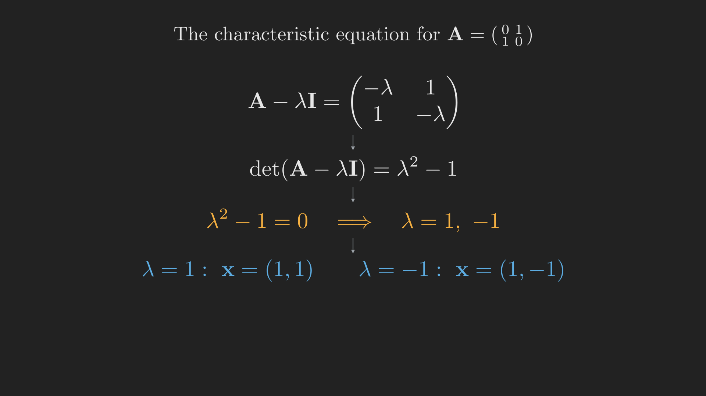

# Introduction

We closed [Part 9](../determinants/index.qmd) with a tantalizing equation, $\det\left(\vb{A} - \lambda \vb{I}\right) = 0$, and a promise. For most numbers $\lambda$ the matrix $\vb{A} - \lambda \vb{I}$ is invertible. But at a few special values it turns singular, and at exactly those values there is a nonzero vector $\vb{x}$ that the matrix only *stretches*, never *turns*:
$$
\vb{A}\vb{x} = \lambda \vb{x}.
$$

Until now we have treated a matrix as a machine for solving $\vb{A}\vb{x} = \vb{b}$. This post changes the question entirely. We stop asking "what input gives this output?" and start asking "are there inputs that come out pointing the same way they went in?" Those inputs are the **eigenvectors**, and the stretching factors are the **eigenvalues**. They reveal the hidden axes along which a matrix acts simply, and they will carry us through the rest of the course: powers of matrices, differential equations, Markov chains, the SVD, all of it runs on eigenvalues.

## Where we are

```{mermaid}
%%| fig-align: center
flowchart LR
    subgraph ACT1["Act I: Solving Ax = b"]
        P1["1. Geometry"] --> P2["2. Elimination & LU"] --> P3["3. Column Space & Nullspace"] --> P4["4. Rank & Complete Solution"]
    end
    subgraph ACT2["Act II: Structure & Orthogonality"]
        P5["5. Basis & Four Subspaces"] --> P6["6. Graphs & Networks"] --> P7["7. Projections"] --> P8["8. Least Squares & QR"] --> P9["9. Determinants"]
    end
    subgraph ACT3["Act III: Eigenvalues & Beyond"]
        P10["10. Eigenvalues"] --> P11["11. Diagonalization & ODEs"] --> P12["12. Markov & Fourier"] --> P13["13. Positive Definite"] --> P14["14. Complex & FFT"] --> P15["15. Jordan Form"] --> P16["16. SVD"] --> P17["17. Transformations"] --> P18["18. Pseudoinverse"]
    end
    ACT1 --> ACT2 --> ACT3

    style P10 fill:#10a37f,color:#fff
```

This is the first stop of Act III, and the engine for nearly everything that follows.

# The special directions

Picture a matrix $\vb{A}$ as a transformation of the plane: feed in a vector, get back a (usually) rotated and rescaled vector. Most input vectors come out pointing somewhere new. But some lucky directions are left alone except for stretching. A vector $\vb{x} \neq \vb{0}$ is an **eigenvector** of $\vb{A}$ if
$$
\vb{A}\vb{x} = \lambda \vb{x}
$$
for some number $\lambda$, its **eigenvalue**. The output lies on the same line as the input; only its length (and possibly its sign) changes.

@fig-eigen_action makes this visible. As an input vector $\vb{x}$ sweeps around the unit circle, its image $\vb{A}\vb{x}$ traces an ellipse. For most positions $\vb{A}\vb{x}$ points in a different direction from $\vb{x}$. But along two special lines, the eigenvector directions, the image stays perfectly aligned with the input, stretched by the eigenvalue.

![As $\mathbf{x}$ sweeps the unit circle, $\mathbf{A}\mathbf{x}$ traces an ellipse and generally points a new way. Along the eigenvector directions (dashed) the image stays on the same line, stretched by the eigenvalue. Here $\mathbf{A} = \left[\begin{smallmatrix}2&1\\1&2\end{smallmatrix}\right]$, with eigenvalues $3$ and $1$.](images/eigen_action.mp4){#fig-eigen_action}



# Finding eigenvalues: the characteristic equation

How do we find these directions when we cannot just see them? Rewrite the defining equation by moving everything to one side:
$$
\vb{A}\vb{x} = \lambda \vb{x}
\quad\Longleftrightarrow\quad
\left(\vb{A} - \lambda \vb{I}\right)\vb{x} = \vb{0}.
$$
We want a *nonzero* $\vb{x}$ solving this. From [Part 3](../vector-spaces-column-space-and-nullspace/index.qmd) we know a homogeneous system has a nonzero solution exactly when the matrix has a nontrivial nullspace, that is, exactly when $\vb{A} - \lambda \vb{I}$ is **singular**. And from [Part 9](../determinants/index.qmd) we know singular means determinant zero. So the eigenvalues are precisely the solutions of the **characteristic equation**:
$$
\det\left(\vb{A} - \lambda \vb{I}\right) = 0.
$$

This is the master recipe: first solve the characteristic equation for the eigenvalues $\lambda$, then, for each one, find the nullspace of $\vb{A} - \lambda \vb{I}$ to get the eigenvectors. @fig-char_equation lays out the pipeline on a concrete matrix.

{#fig-char_equation fig-align="center" width=95%}

Let us run it on the swap matrix $\vb{A} = \left[\begin{smallmatrix} 0 & 1 \\ 1 & 0 \end{smallmatrix}\right]$, which exchanges the two coordinates. Then
$$
\vb{A} - \lambda \vb{I} = \begin{bmatrix} -\lambda & 1 \\ 1 & -\lambda \end{bmatrix},
\qquad
\det\left(\vb{A} - \lambda \vb{I}\right) = \lambda^2 - 1 = 0,
$$
so the eigenvalues are $\lambda_1 = 1$ and $\lambda_2 = -1$. For $\lambda = 1$, the nullspace of $\left[\begin{smallmatrix} -1 & 1 \\ 1 & -1 \end{smallmatrix}\right]$ is spanned by $\left(1, 1\right)$: the swap leaves a vector with equal entries untouched. For $\lambda = -1$, the nullspace of $\left[\begin{smallmatrix} 1 & 1 \\ 1 & 1 \end{smallmatrix}\right]$ is spanned by $\left(1, -1\right)$: swapping the entries of $\left(1, -1\right)$ flips its sign. Both directions are exactly the ones the swap acts on simply.

# Two shortcuts: trace and determinant

Before solving anything, two quick checks come for free and catch most arithmetic mistakes. The sum of the eigenvalues equals the **trace** (the sum of the diagonal entries), and the product of the eigenvalues equals the **determinant**:
$$
\lambda_1 + \lambda_2 + \cdots + \lambda_n = \operatorname{tr} \vb{A},
\qquad
\lambda_1 \lambda_2 \cdots \lambda_n = \det \vb{A}.
$$
For the swap matrix, the trace is $0 = 1 + \left(-1\right)$ and the determinant is $-1 = \left(1\right)\left(-1\right)$. Both check out. In the $2 \times 2$ case these two facts alone often hand you the eigenvalues without forming the polynomial.

@tbl-eigen_examples gathers several matrices worth knowing by heart. Notice how the eigenvalues read off the geometry: a projection keeps what is in its subspace ($\lambda = 1$) and annihilates what is perpendicular ($\lambda = 0$); the swap reflects, giving $\pm 1$.

::: {.tbl tbl-colwidths="auto"}
| Matrix | Action | Eigenvalues | Eigenvectors |
|:---:|:---|:---:|:---:|
| $\left[\begin{smallmatrix} 2 & 1 \\ 1 & 2 \end{smallmatrix}\right]$ | symmetric stretch | $3,\ 1$ | $\left(1,1\right),\ \left(1,-1\right)$ |
| $\left[\begin{smallmatrix} 0 & 1 \\ 1 & 0 \end{smallmatrix}\right]$ | swap / reflection | $1,\ -1$ | $\left(1,1\right),\ \left(1,-1\right)$ |
| $\left[\begin{smallmatrix} 0.5 & 0.5 \\ 0.5 & 0.5 \end{smallmatrix}\right]$ | projection onto a line | $1,\ 0$ | $\left(1,1\right),\ \left(1,-1\right)$ |
| $\left[\begin{smallmatrix} 0 & -1 \\ 1 & 0 \end{smallmatrix}\right]$ | $90^{\circ}$ rotation | $i,\ -i$ | complex |

: Matrices whose eigenvalues you can almost see. {#tbl-eigen_examples style="width:80%; margin:auto;"}
:::

# When eigenvalues misbehave

The recipe always produces a characteristic polynomial, but its roots can be awkward in two ways, and both matter later.

**Complex eigenvalues.** Consider the $90^{\circ}$ rotation $\vb{A} = \left[\begin{smallmatrix} 0 & -1 \\ 1 & 0 \end{smallmatrix}\right]$. Its characteristic equation is $\lambda^2 + 1 = 0$, whose roots are $\lambda = \pm i$. This is the algebra being honest: a rotation turns *every* real direction, so there is no real eigenvector. The eigenvalues escape into the complex numbers, and we will need them there when we study oscillations and the Fourier matrix.

**Repeated eigenvalues with too few eigenvectors.** Take $\vb{A} = \left[\begin{smallmatrix} 3 & 1 \\ 0 & 3 \end{smallmatrix}\right]$. Being triangular, its eigenvalues are its diagonal entries: $\lambda = 3$, twice. But the nullspace of $\vb{A} - 3\vb{I} = \left[\begin{smallmatrix} 0 & 1 \\ 0 & 0 \end{smallmatrix}\right]$ is only one-dimensional, spanned by $\left(1, 0\right)$. There is just *one* independent eigenvector where we might have hoped for two. Such a matrix is called **defective**, and it is the source of real trouble in the next post, because it cannot be fully broken apart along eigenvector directions.

Most matrices, happily, are not defective: when the $n$ eigenvalues are distinct, there are $n$ independent eigenvectors, and the matrix can be completely understood through them. That is the case we exploit next.

# Where we are, and where we go next

We have opened the second great theme of linear algebra:

- An **eigenvector** is a direction the matrix only stretches, with stretch factor its **eigenvalue**: $\vb{A}\vb{x} = \lambda \vb{x}$.
- Eigenvalues are the roots of the **characteristic equation** $\det\left(\vb{A} - \lambda \vb{I}\right) = 0$; each eigenvector is then a nullspace vector of $\vb{A} - \lambda \vb{I}$.
- The eigenvalues sum to the trace and multiply to the determinant.
- They can be complex (rotations) or come up short in number (defective matrices).

Knowing the eigenvectors is like being handed the natural coordinate axes of a matrix, the directions along which it does nothing but scale. In those coordinates the matrix becomes diagonal, and diagonal matrices are trivial to raise to powers, to exponentiate, to iterate. That single idea, **diagonalization**, turns hard problems like "compute $\vb{A}^{100}$" or "solve $\tfrac{d\vb{u}}{dt} = \vb{A}\vb{u}$" into easy ones. It also cracks the Fibonacci sequence wide open. That is Part 11.
