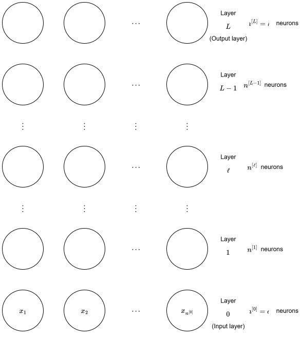
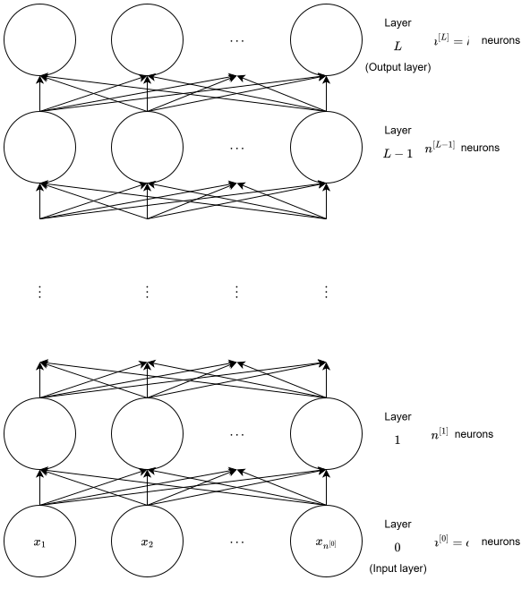
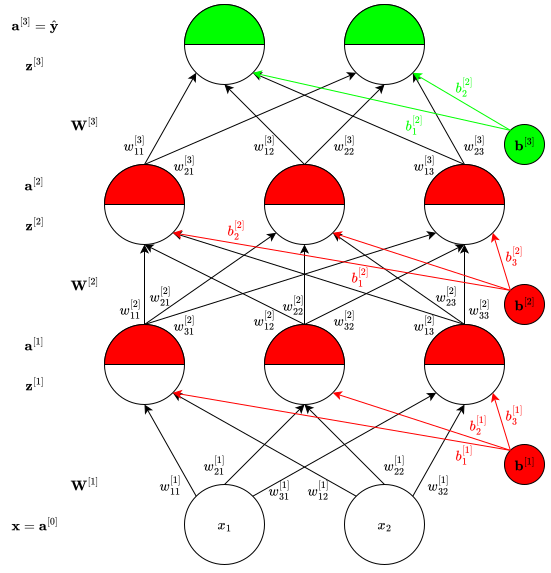

# Introduction

In [Network of Sigmoid Neurons](../network-of-sigmoid-neurons/index.qmd) blog post, we saw that a multilayer network of sigmoid neurons with a single hidden layer can be used to approximate any continuous function to any desired precision. Let us now generalize this construction further by allowing more layers and allowing other activation functions as well. Let us first discuss some notation.

# Notation

The neural network input is a $d$-dimensional vector which we denote using $\mathbf{x}$ ($\mathbf{x} \in \mathbb{R}^d$). For notational consistency, $d$ is replaced with $n^{[0]}$, i.e.,

$$
n^{[0]} = d.
$$

In other words, each input has $n^{[0]}$ features, i.e.,

$$
\mathbf{x} =
\begin{bmatrix}
  x_1\\
  x_2\\
  \vdots\\
  x_{n^{[0]}}
\end{bmatrix}.
$$

We put each of these inputs as a neuron in a layer and call this layer the **input layer**. The network contains $L - 1$ **hidden layers** and one **output layer**, which makes a total of $L$ layers. The input layer is considered as the $0$-th layer. So, the notation $n^{[0]}$ makes sense as it stands for the number of neurons in the input layer, or the $0$-th layer.

As discussed in the previous paragraph, the input layer (or the $0$-th layer) contains $n^{[0]}$ neurons, one corresponding to every input. The first hidden layer contains $n^{[1]}$ neurons, the second contains $n^{[2]}$ neurons, and so on till the last hidden layer which contains $n^{[L-1]}$ neurons. The output layer contains $n^{[L]} = k$ neurons (say, corresponding to $k$ classes). The notation till now is shown in @fig-notation_1.

{#fig-notation_1 fig-align="center" width=100% .invert}

Now, the input to each neuron of a particular layer are the outputs of all the neurons from the previous layer. Adding these inputs to @fig-notation_1 gives us @fig-notation_2.

{#fig-notation_2 fig-align="center" width=100% .invert}

As we can see, these inputs are visualized as connections in @fig-notation_2. Further, these inputs are also weighted. So, each of these arrows going into a neuron of a particular layer has a weight (or strength) associated with it. In other words, there is a vector of weights associated with each neuron. To simplify the diagram, let us only look at a particular $i$-th neuron of some layer $\mathscr{l}$.

Next, each neuron, say the $i$-th neuron, in a particular layer $\mathscr{l}$ can be split into two parts: **pre-activation** denoted using $z_{i}^{[\mathscr{l}]}$, and the **activation** denoted using $a_{i}^{[\mathscr{l}]}$ ($i \in 1, 2, \dots, n^{[\mathscr{l}]}$ and $\mathscr{l} \in \{1, 2, \dots, L\}$). *Each* of these pre-activations $z_{i}^{[\mathscr{l}]}$'s is a weighted sum of *all* the activations of the previous layer, i.e., $a_{i}^{[\mathscr{l} - 1]}$'s, and a bias. Putting all the pre-activations of a particular layer $\mathscr{l}$, i.e., $z_{i}^{[\mathscr{l}]}$'s, inside a vector gives us the pre-activation vector for this layer, and putting all the activations of this layer, i.e., $a_{i}^{[\mathscr{l}]}$'s, inside a vector gives us the activation vector for this layer. In other words,

$$
\mathbf{z}^{[\mathscr{l}]} =
\begin{bmatrix}
    z^{[\mathscr{l}]}_{1}\\
    z^{[\mathscr{l}]}_{2}\\
    \vdots\\
    z^{[\mathscr{l}]}_{n^{[\mathscr{l}]}}
\end{bmatrix},
\quad
\mathbf{a}^{[\mathscr{l}]} =
\begin{bmatrix}
    a^{[\mathscr{l}]}_{1}\\
    a^{[\mathscr{l}]}_{2}\\
    \vdots\\
    a^{[\mathscr{l}]}_{n^{[\mathscr{l}]}}
\end{bmatrix},
$$

where $\mathscr{l} \in \{1, 2, \dots, L\}$. We will discuss how both these vectors is calculated in a bit. The activation of the output layer is simply the output of the network, i.e.,

$$
\mathbf{a}^{[L]} = \hat{\mathbf{y}} = \hat{f}(\mathbf{x}).
$$

Similarly, the activation of the input layer is just the input vector, i.e.,

$$
\mathbf{a}^{[0]} = \mathbf{x}.
$$

<!-- Next, each neuron in a particular layer $\mathscr{l}$ can be split into two parts: **pre-activation** denoted using $\mathbf{z}^{[\mathscr{l}]}$, and the **activation** denoted using $\mathbf{a}^{[\mathscr{l}]}$ ($\mathscr{l} \in \{1, 2, \dots, L\}$). The pre-activation of any layer $\mathscr{l}$, i.e., $\mathbf{z}^{[\mathscr{l}]}$, is a *vector* whose elements are computed as a weighted sum of the activations from the previous layer, i.e., $\mathbf{a}^{[\mathscr{l}-1]}$, plus a bias. Similarly, the activation of any layer $\mathscr{l}$, i.e., $\mathbf{a}^{[\mathscr{l}]}$, is a *vector* containing outputs from all the neurons of this layer $\mathscr{l}$. We will discuss how both these vectors is calculated in a bit. The elements in both these vectors are denoted as

$$
\mathbf{z}^{[\mathscr{l}]} =
\begin{bmatrix}
    z^{[\mathscr{l}]}_{1}\\
    z^{[\mathscr{l}]}_{2}\\
    \vdots\\
    z^{[\mathscr{l}]}_{n^{[\mathscr{l} - 1]}}
\end{bmatrix},
\quad
\mathbf{a}^{[\mathscr{l}]} =
\begin{bmatrix}
    a^{[\mathscr{l}]}_{1}\\
    a^{[\mathscr{l}]}_{2}\\
    \vdots\\
    a^{[\mathscr{l}]}_{n^{[\mathscr{l}]}}
\end{bmatrix},
$$

where $\mathscr{l} \in \{1, 2, \dots, L\}$. The activation of the output layer is simply the output of the network, i.e.,

$$
\mathbf{a}^{[L]} = \hat{\mathbf{y}} = \hat{f}(\mathbf{x}).
$$

Similarly, the activation of the input layer is just the input vector, i.e.,

$$
\mathbf{a}^{[0]} = \mathbf{x}.
$$ -->

Next, *each* neuron in a particular layer $\mathscr{l}$ has connections going into it from *all* neurons of the previous layer $\mathscr{l} - 1$. Each of these connections has a weight associated with it. Consider the example of the first hidden layer, or the first layer (i.e., $\mathscr{l} = 1$). Each neuron in this layer has inputs from all neurons of the input layer, and there are $n^{[1]}$ neurons in this first layer and $n^{[0]}$ neurons in the input layer (or the zeroth layer). Hence, there are $n^{[1]} \times n^{[0]}$ weights between the zeroth and the first layer. These are the weights corresponding to the first layer ($\mathscr{l} = 1$). We put all these weights inside a matrix $\mathbf{W}^{[1]}$ with dimensions $n^{[1]} \times n^{[0]}$, i.e., $\mathbf{W}^{[1]} \in \mathbb{R}^{n^{[1]} \times n^{[0]}}$. This is the **weights matrix** of the first layer (hence the superscript). The individual elements inside this weights matrix are written as

$$
\mathbf{W}^{[1]} =
\begin{bmatrix}
    w_{11}^{[1]} & w_{12}^{[1]} & \cdots & w_{1(n^{[0]})}^{[1]}\\
    w_{21}^{[1]} & w_{22}^{[1]} & \cdots & w_{2(n^{[0]})}^{[1]}\\
    \vdots & \vdots & \ddots & \vdots\\
    w_{(n^{[1]})1}^{[1]} & w_{(n^{[1]})2}^{[1]} & \cdots & w_{n^{[1]} n^{[0]}}^{[1]}
\end{bmatrix}.
$$

The notation $w_{ij}^{[1]}$ here means the weight corresponding to the connection between the $j$-th neuron in the previous (which, in this case, is the zeroth or the input) layer to the $i$-th neuron in the current (which, in this case, is the first) layer.

Also, each neuron in the first layer also has a bias associated with it. We put all these biases inside a vector $\mathbf{b}^{[1]} \in \mathbb{R}^{n^{[1]}}$, which is the **bias vector** for the first layer. The individual elements inside this bias vector are written as

$$
\mathbf{b}^{[1]} =
\begin{bmatrix}
    b_1^{[1]}\\
    b_2^{[1]}\\
    \vdots\\
    b_{n^{[1]}}^{[1]}
\end{bmatrix}.
$$

The notation $b_{i}^{[1]}$ here means the bias element corresponding to the $i$-th neuron in the current (which, in this case, is the first) layer.

More generally, the weights matrix of the $\mathscr{l}$-th layer is denoted as $\mathbf{W}^{[\mathscr{l}]} \in \mathbb{R}^{n^{[\mathscr{l}]} \times n^{[\mathscr{l}-1]}}$, and the bias vector of the same $\mathscr{l}$-th layer is denoted as $\mathbf{b}^{[\mathscr{l}]} \in \mathbb{R}^{n^{[\mathscr{l}]}}$. Both of these can be expanded as

$$
\mathbf{W}^{[\mathscr{l}]} =
\begin{bmatrix}
    w_{11}^{[\mathscr{l}]} & w_{12}^{[\mathscr{l}]} & \cdots & w_{1(n^{[\mathscr{l}-1]})}^{[\mathscr{l}]}\\
    w_{21}^{[\mathscr{l}]} & w_{22}^{[\mathscr{l}]} & \cdots & w_{2(n^{[\mathscr{l}-1]})}^{[\mathscr{l}]}\\
    \vdots & \vdots & \ddots & \vdots\\
    w_{(n^{[\mathscr{l}]})1}^{[\mathscr{l}]} & w_{(n^{[\mathscr{l}]})2}^{[\mathscr{l}]} & \cdots & w_{n^{[\mathscr{l}]} n^{[\mathscr{l}-1]}}^{[\mathscr{l}]}
\end{bmatrix},
$$ {#eq-general_weights_matrix}

and

$$
\mathbf{b}^{[\mathscr{l}]} =
\begin{bmatrix}
    b_1^{[\mathscr{l}]}\\
    b_2^{[\mathscr{l}]}\\
    \vdots\\
    b_{n^{[\mathscr{l}]}}^{[\mathscr{l}]}
\end{bmatrix}.
$$ {#eq-general_bias_vector}

Again, $w_{ij}^{[\mathscr{l}]}$ means the weight corresponding to the connection between the $j$-th neuron in layer $\mathscr{l}-1$ to the $i$-th neuron in layer $\mathscr{l}$, and $b_i^{[\mathscr{l}]}$ means the bias element corresponding to the $i$-th neuron in layer $\mathscr{l}$.

This entire notation discussion is summarized in @fig-notation_nn for a 3-layer (i.e., $L = 3$) neural network with, $n^{[0]} = 2$, $n^{[1]} = 3$, $n^{[2]} = 3$, and $n^{[3]} = k = 2$.

{#fig-notation_nn fig-align="center" width=100% .invert}

The pre-activation at layer $\mathscr{l}$ is given by

$$
\mathbf{z}^{[\mathscr{l}]} = \mathbf{W}^{[\mathscr{l}]} \mathbf{a}^{[\mathscr{l} - 1]} + \mathbf{b}^{[\mathscr{l}]},
$$ {#eq-pre_activation_at_layer_l}

which can be expanded as

$$
\begin{bmatrix}
    z^{[\mathscr{l}]}_{1}\\
    z^{[\mathscr{l}]}_{2}\\
    \vdots\\
    z^{[\mathscr{l}]}_{n^{[\mathscr{l}]}}
\end{bmatrix} =
\begin{bmatrix}
    w_{11}^{[\mathscr{l}]} & w_{12}^{[\mathscr{l}]} & \cdots & w_{1(n^{[\mathscr{l}-1]})}^{[\mathscr{l}]}\\
    w_{21}^{[\mathscr{l}]} & w_{22}^{[\mathscr{l}]} & \cdots & w_{2(n^{[\mathscr{l}-1]})}^{[\mathscr{l}]}\\
    \vdots & \vdots & \ddots & \vdots\\
    w_{(n^{[\mathscr{l}]})1}^{[\mathscr{l}]} & w_{(n^{[\mathscr{l}]})2}^{[\mathscr{l}]} & \cdots & w_{n^{[\mathscr{l}]} n^{[\mathscr{l}-1]}}^{[\mathscr{l}]}
\end{bmatrix}
\begin{bmatrix}
    a^{[\mathscr{l}-1]}_{1}\\
    a^{[\mathscr{l}-1]}_{2}\\
    \vdots\\
    a^{[\mathscr{l}-1]}_{n^{[\mathscr{l} - 1]}}
\end{bmatrix}
+
\begin{bmatrix}
    b_1^{[\mathscr{l}]}\\
    b_2^{[\mathscr{l}]}\\
    \vdots\\
    b_{n^{[\mathscr{l}]}}^{[\mathscr{l}]}
\end{bmatrix}.
$$ {#eq-pre_activation_at_layer_l_expanded}

We can see that the dimensions of the matrices are compatible, i.e.,

$$
\mathbb{R}^{n^{[\mathscr{l}]} \times 1} = \left(\mathbb{R}^{n^{[\mathscr{l}]} \times n^{[\mathscr{l}-1]}} \times \mathbb{R}^{n^{[\mathscr{l}-1]} \times 1} \right) + \mathbb{R}^{n^{[\mathscr{l}]} \times 1}.
$$

Next, the activation at layer $\mathscr{l}$ is given by

$$
\mathbf{a}^{[\mathscr{l}]} = g\left(\mathbf{z}^{[\mathscr{l}]}\right),
$$ {#eq-activation_at_layer_l}

where $g$ is a function that acts on each element of the pre-activation $\mathbf{z}^{[\mathscr{l}]}$. So, this can be expanded as

$$
\begin{bmatrix}
    a^{[\mathscr{l}]}_1\\
    a^{[\mathscr{l}]}_2\\
    \vdots\\
    a^{[\mathscr{l}]}_{n^{[\mathscr{l}]}}
\end{bmatrix} =
\begin{bmatrix}
    g\left(z^{[\mathscr{l}]}_1\right)\\
    g\left(z^{[\mathscr{l}]}_2\right)\\
    \vdots\\
    g\left(z^{[\mathscr{l}]}_{n^{[\mathscr{l}]}}\right)
\end{bmatrix}.
$$ {#eq-activation_at_layer_l_expanded}

The function $g$ is called the **activation function**. Some examples of activation function are the logistic function, $\tanh$, linear, etc.

The activation at the output layer is given by

$$
\hat{\mathbf{y}} = f(\mathbf{x}) = \mathbf{a}^{[L]} = O\left(\mathbf{z}^{[L]}\right),
$$ {#eq-activation_at_the_output_layer}

where $O$ is the output activation function. Some examples of the output activation function are softmax, linear, logistic, etc. The reason the output activation function is denoted using a different symbol is that depending upon the problem some activation functions will not be allowed here. For instance, if the output of the problem is a real number, then using the sigmoid activation function will not give good results as it is bounded between $0$ and $1$. So, the activation function at the hidden layers and the activation function at the output layer is not necessarily the same.

## Supervised Machine Learning Setup

Let us now write the same supervised machine learning setup using this new notation.

> 🚧 **Work in Progress:** This blog post is currently being written. Some sections are complete, while others are still under construction. Feel free to explore and check back later for updates!

# Acknowledgment

I have referred to the YouTube playlists [@iitm-deep-learning-playlist; @nptel-deep-learning-playlist] while writing this blog post.
