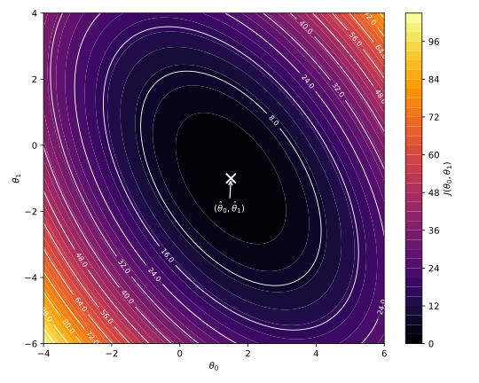
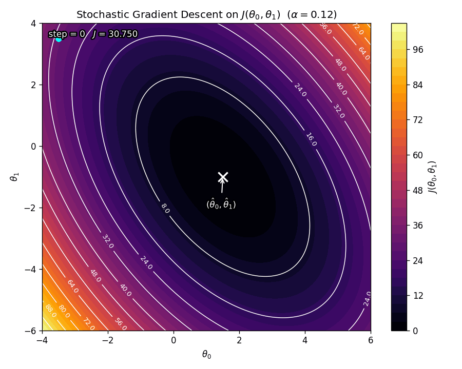

# Introduction

We will now start with supervised learning and discuss the first supervised learning algorithm: linear regression.

## Supervised Learning

Recall from the [ML introduction blog post](../introduction-to-machine-learning/index.qmd#supervised-learning) that the **supervised learning** paradigm of ML involves having input-output pairs in the training data. Each data point corresponds to a particular input-output pair. We show the ML algorithm the input and its corresponding correct output and let it *learn* the correct relationship between them such that when a new input that the algorithm has not seen before is shown to it, it produces the correct output. So, we are *supervising* the algorithm's learning. More technically, supervised learning amounts to learning the correct input to output, i.e., $\vb{X} \mapsto \vb{y}$, mapping present in the training data. We will discuss what exactly "learning" means later in this post.

Please note the following basic notation:

- $\vb{X}$: All the inputs $\vb{x}_i$ (put in rows) are collectively denoted using this matrix. This is also called the **design matrix**.
- $\vb{y}$: All the corresponding outputs $y_i$ are collectively denoted using this vector called the **output vector** (assuming that there is exactly one output for every input).
- $n$: Number of **input-output pairs** (also known as **data points**, **observations**, **examples**, etc.) in the training set.
- $d$: Number of **features** of each input. This is also referred to as the **dimension** of each input.
- $\vb{x}_i$: The **input** of the $i$th example. Notice that from the previous bullet point we can say that $\vb{x}_i \in \mathbb{R}^d$, where $i \in \{1, 2, \dots, n\}$.
- $y_i$: The **output** of the $i$th example. Recall that for regression $y_i \in \mathbb{R}$, whereas for a $k$-class classification $y_i \in \{1, 2, \dots, k\}$.
- $\hat{y}_i$: The **prediction** (or the **estimate**) of the output of the $i$th example.
- $\left(\vb{x}_i, y_i\right)$: The $i$th **example** (also known **data point**, **observation**, etc.).

Consider the following house price example of supervised learning in which we are interested in learning the mapping between the features of the house (input) and its price (output). Another way to put it is, we want to create a model that predicts the price of the house (output) given its features (input).

It is common knowledge that house prices are largely dependent on the area of the house. Generally, larger the area of the house, the more expensive it is. So, we can consider the area of the house as the input $x$ and its price as the output $y$ (note that in this case I did not use a bold font for $x$ because we just have area as the input, i.e., $d = 1$). We can collect this data and put it in the form of a table, as shown in @tbl-house_prices.

::: {.tbl tbl-colwidths="auto"}
| Area (sq ft) | Price ($) |
|:------------:|:---------:|
| 2104 | 399,900 |
| 1600 | 329,900 |
| 2400 | 369,000 |
| 1416 | 232,000 |
| 3000 | 539,900 |
| ⋮    | ⋮       |

: A few observations from the data we collected. {#tbl-house_prices style="width:30%; margin:auto;"}
:::

We can see that this table shows us a mapping between the input and the output. We want to learn this mapping. To visualize it, we can plot this data to get a scatter plot which is shown in @fig-house_prices.

{#fig-house_prices fig-align="center" width=65% .invert}

Each point on this scatter plot represents one particular row of @tbl-house_prices, i.e., one particular $\left(x, y\right)$ example. So, learning the area-price mapping of @tbl-house_prices amounts to learning some function $h$, known as **hypothesis**, between $x$ and $y$ such that

$$
h(x) \approx y.
$$

In other words, we want to learn a hypothesis $h$ whose prediction of the price ($h(x)$) is as close to the actual price ($y$) as possible. Clearly, this is a regression problem (refer to the regression definition [here](../introduction-to-machine-learning/index.qmd#regression)).

## Big Picture of Supervised Learning

The big picture of supervised learning is that we provide some training data (or training set) $\left\{\vb{x}_i, y_i\right\}_{i=1}^{n}$ to a particular learning algorithm. This algorithm learns a hypothesis $h$ using the training data (i.e., it learns the input-output mapping). This hypothesis can now take a new input $\vb{x}_t$ which is not in the training set and give a prediction $\hat{y}_t$ which is as close to the actual value $y_t$ as possible. This big picture is shown in @fig-supervised_learning_big_picture.

{#fig-supervised_learning_big_picture fig-align="center" width=45% .invert}

So, using different kinds of supervised learning algorithms just amount to adding restrictions on what family of functions can be used as the hypothesis $h$. But the big picture of supervised learning remains the same.

Further, though we have trained the algorithm (or the model) on the training set, we hope that it will generalize well to the test set, i.e., the examples that the model has not seen during training.

# Linear Regression

Consider that we have inputs as $\vb{x} \in \mathbb{R}^{d}$, their corresponding outputs as $y \in \mathbb{R}$, and we have $n$ such examples (also known as data points, observations, input-output pairs, etc.).

::: {.callout-note title="Notation Clarification"}
Throughout this section, $\vb{x}$ and $y$ denote a *generic* input-output pair, with $\vb{x} \in \mathbb{R}^d$ and $y \in \mathbb{R}$. The training dataset consists of $n$ observed examples $\{(\vb{x}_i, y_i)\}_{i=1}^n$, where each $(\vb{x}_i, y_i)$ is a realization of $(\vb{x}, y)$. This convention allows us to define the hypothesis function $h(\vb{x})$ independently of any particular data point.

You may think of $\vb{x}$ and $y$ in the same way that we think of the variables $x$ and $y$ when labeling the axes of a plot: they represent *generic coordinates*, while specific points plotted on the graph correspond to the indexed observations $(\vb{x}_i, y_i)$.
:::

Recall that we want a hypothesis $h$ such that

$$
\hat{y} = h(\vb{x}) \approx y,
$$ {#eq-goal_of_supervised_learning}

i.e., the prediction $\hat{y}$ done by the hypothesis is as close to the true output $y$ as possible. The **linear regression** algorithm (or model) simply restricts the family of functions that can be used as this hypothesis $h$ to *linear functions*. So, in linear regression, the hypothesis is linear, and is denoted as

$$
\hat{y} = h_{\boldsymbol{\uptheta}} (\vb{x}) = \theta_0 + \theta_1 x_1 + \theta_2 x_2 + \cdots + \theta_d x_d = \theta_0 + \sum_{j=1}^{d} \theta_j x_j,
$$ {#eq-linear_hypothesis}

where $\boldsymbol{\uptheta} \in \mathbb{R}^{d+1}$ is the vector of **parameters** (also called **weights**) denoted as

$$
\boldsymbol{\uptheta} =
\begin{bmatrix}
    \theta_0\\
    \theta_1\\
    \theta_2\\
    \vdots\\
    \theta_d
\end{bmatrix}.
$$

The goal of linear regression is to find the best possible parameter vector $\boldsymbol{\uptheta}$ such that @eq-goal_of_supervised_learning is satisfied. In other words, the goal is to find the best parameters $\boldsymbol{\uptheta}$ such that the predicted output $\hat{y} = h_{\boldsymbol{\uptheta}} (\vb{x})$ is as close to the true output $y$ as possible. Once these parameters are found, we say that the learning process of linear regression algorithm is complete.

Also, notice that every possible value of $\boldsymbol{\uptheta}$ gives us a different linear hypothesis. Hence $\boldsymbol{\uptheta}$ is added as the subscript to $h$ as it helps us identify which particular linear hypothesis it is.

We can also include a term $x_0 = 1$ and write @eq-linear_hypothesis as

$$
\hat{y} = h_{\boldsymbol{\uptheta}} (\vb{x}) = \theta_0 x_0 + \theta_1 x_1 + \cdots + \theta_d x_d = \sum_{j=0}^{d} \theta_j x_j = \boldsymbol{\uptheta}^{\intercal} \vb{x}
$$ {#eq-linear_hypothesis_convenient}

Including $x_0 = 1$ is just adopting a convention that we add one more feature to the space of input features whose value is always $1$. Hence, in this convention, $\vb{x} \in \mathbb{R}^{d+1}$.

$\theta_0$ is called the **intercept term** and $x_0$ is simply the input corresponding to this intercept term. This convention is widely adopted mostly for notational convenience which is evident by looking at the difference between @eq-linear_hypothesis and @eq-linear_hypothesis_convenient (the latter just has a dot product on the right!).

# Cost Function

How do we know which particular linear hypothesis is the best? The best should make sure that the predicted output $\hat{y}$ is as close to the true output $y$ as possible. Further, the predicted output is dependent on the vector of parameters $\boldsymbol{\uptheta}$. But how do we differentiate between these parameters? Here is where the cost function comes into picture. The **cost function**, denoted using $J(\boldsymbol{\uptheta})$, quantifies how good a particular vector of parameters is. The value of this cost function is optimum for the best choice of the parameters.

## Squared Error

In linear regression, the most commonly used cost function is the **squared error**, also known as **least squares**. What it does is the following. It finds the square of the difference between the predicted output $\hat{y}$ ($=h_{\boldsymbol{\uptheta}} \left(\vb{x}\right)=\boldsymbol{\uptheta}^{\intercal} \vb{x}$) and the true output $y$ for all the examples in the data, and then sums it up, i.e.,

$$
J(\boldsymbol{\uptheta}) = \frac{1}{2} \sum_{i=1}^{n} \left( \hat{y}_i - y_i \right)^2 = \frac{1}{2} \sum_{i=1}^{n} \left( h_{\boldsymbol{\uptheta}} \left(\vb{x}_i\right) - y_i \right)^2 = \frac{1}{2} \sum_{i=1}^{n} \left( \boldsymbol{\uptheta}^{\intercal} \vb{x}_i - y_i \right)^2.
$$ {#eq-squared_error}

This essentially gives us a measure of how different the predicted output $\hat{y}$ is from the true output $y$ for each example in the data. Which means that the lower the squared error $J(\boldsymbol{\uptheta})$, the better the prediction, the better the parameters $\boldsymbol{\uptheta}$, and hence the better the hypothesis $h_{\boldsymbol{\uptheta}}$.

Hence, the goal now is to find some $\hat{\boldsymbol{\uptheta}}$ that minimizes the cost function $J(\boldsymbol{\uptheta})$, i.e.,

$$
\hat{\boldsymbol{\uptheta}} = \arg \min_{\boldsymbol{\uptheta}} J(\boldsymbol{\uptheta}).
$$ {#eq-optimizing_cost_function}

For the squared error, this is

$$
\hat{\boldsymbol{\uptheta}} = \arg \min_{\boldsymbol{\uptheta}} \sum_{i=1}^{n} \left( h_{\boldsymbol{\uptheta}} \left(\vb{x}_i\right) - y_i \right)^2 = \arg \min_{\boldsymbol{\uptheta}} \sum_{i=1}^{n} \left( \boldsymbol{\uptheta}^{\intercal} \vb{x}_i - y_i \right)^2.
$$ {#eq-optimizing_squared_error}

Once this $\hat{\boldsymbol{\uptheta}}$ is found, we say that linear regression has learnt from the data. Notice that I have removed the $\frac{1}{2}$ as it does not play a role in the minimization process. So the value of $\hat{\boldsymbol{\uptheta}}$ with or without the $\frac{1}{2}$ will be the same.

# Optimizing the Cost Function (How an Algorithm "Learns")

There are algorithms that are used to optimize the cost function. In terms of the squared error cost function, we say that these algorithms minimize it. It is this optimization process that actually can be called as the learning process of the algorithm. In other words, optimization process is the method using which an algorithm learns. Let us discuss one such method.

## Gradient Descent

As evident from the notation, the cost function $J(\boldsymbol{\uptheta})$ depends on the parameters $\boldsymbol{\uptheta}$, i.e., $\theta_0$, $\theta_1$, ..., $\theta_d$. In other words, changing the value of these parameters will change the value of the cost function. So, optimizing the cost function amounts to finding one particular parameter vector $\hat{\boldsymbol{\uptheta}}$, i.e., one particular combination of the parameters $\theta_0=\hat{\theta}_0$, $\theta_1=\hat{\theta}_1$, ..., $\theta_d=\hat{\theta}_d$, for which the cost function has the optimum value $J(\hat{\boldsymbol{\uptheta}})$. In terms of the squared error, this means finding one particular parameter vector for which the squared error has the minimum value.

Let us take an example in which $\boldsymbol{\uptheta} \in \mathbb{R}^{2}$, i.e., there are only two parameters $\theta_0$ and $\theta_1$. Further, consider that the cost function has a bowl shape with respect to these parameters with a single minimum at $(\hat{\theta}_0, \hat{\theta}_1)$. The contour plot of this cost function is shown in @fig-cost_contour_plot.

{#fig-cost_contour_plot fig-align="center" width=85% .invert}

Note that we do not know this minimum $(\hat{\theta}_0, \hat{\theta}_1)$. The goal of gradient descent is to find it. What gradient descent does is the following:

1. It first initializes the values of the parameters $\boldsymbol{\uptheta}$. Usually this is random initialization or zero initialization.
2. Then, it repeatedly updates the values of each of these parameters (indexed using $j$) simultaneously via
    $$
    \theta_j = \theta_j - \alpha \pdv{J(\boldsymbol{\uptheta})}{\theta_j},
    $$ {#eq-gradient_descent_scalar_notation}
   
   until convergence (i.e., until the values of the parameters are not changing much with each further step).

Here, $\alpha$ is called the **learning rate**. In vector notation, @eq-gradient_descent_scalar_notation is written as

$$
\boldsymbol{\uptheta} = \boldsymbol{\uptheta} - \alpha \nabla_{\boldsymbol{\uptheta}} J(\boldsymbol{\uptheta})
$$ {#eq-gradient_descent_vector_notation}

So, the gradient descent algorithm is the following.

::: {#alg-gradient_descent}
<pre class="pseudocode">
\begin{algorithm}
\caption{Gradient Descent}
\begin{algorithmic}
\REQUIRE Cost function $J(\boldsymbol{\uptheta})$, learning rate $\alpha$
\ENSURE Parameters $\hat{\boldsymbol{\uptheta}}$

\STATE Initialize $\boldsymbol{\uptheta}$ (e.g., zeros or randomly)
\REPEAT
  \STATE $\boldsymbol{\uptheta} \leftarrow \boldsymbol{\uptheta} - \alpha \nabla_{\boldsymbol{\uptheta}} J(\boldsymbol{\uptheta})$
\UNTIL{convergence}
\RETURN $\boldsymbol{\uptheta}$
\end{algorithmic}
\end{algorithm}
</pre>
:::

Recall that the gradient of any function gives the direction of the *instantaneous steepest ascent* of that function. As the gradient of $J(\boldsymbol{\uptheta})$ is subtracted from the value of $\boldsymbol{\uptheta}$ at each iteration, gradient descent (@eq-gradient_descent_vector_notation) repeatedly takes a step in the direction of the *instantaneous steepest descent* of $J(\boldsymbol{\uptheta})$. The stride of these steps is controlled by the learning rate $\alpha$. @fig-gradient_descent_animation shows the animation of gradient descent for the cost function example considered in @fig-cost_contour_plot.

{#fig-gradient_descent_animation fig-align="center" width=85% .invert}

There is no principled way to pick a particular best value of $\alpha$. In practice, it is determined by experimenting with multiple values. However, we want to pick a small $\alpha$ such that the cost at the next step is lower as compared to the cost at the current step, i.e., we want

$$
J(\boldsymbol{\uptheta})^{(i+1)} < J(\boldsymbol{\uptheta})^{(i)}.
$$

If we pick an $\alpha$ that is too large, then gradient descent will diverge away from the minimum, as is shown in @fig-gradient_descent_divergence_animation.

{#fig-gradient_descent_divergence_animation fig-align="center" width=85% .invert}

### Convergence Criteria in Gradient Descent

There are many convergence criteria that are used in practice for gradient descent. Some of them are the following.

#### Parameters have stopped changing

Gradient descent gives us the parameters $\boldsymbol{\uptheta}$ at each iteration (step). We can say that gradient descent has converged if the norm of the difference of parameter vectors between two consecutive steps is smaller than a pre-defined very small threshold, i.e.,

$$
\norm{\boldsymbol{\uptheta}^{(i+1)} - \boldsymbol{\uptheta}^{(i)}} < \varepsilon,
$$

where $\varepsilon$ is some small positive pre-defined constant.

#### Cost has stopped decreasing

Gradient descent, with an appropriate $\alpha$, makes sure that the cost decreases with each iteration. We can say that gradient descent has converged if absolute difference of the cost between two consecutive iterations is smaller than a pre-defined very small threshold, i.e.,

$$
\left| J(\boldsymbol{\uptheta}^{(i+1)}) - J(\boldsymbol{\uptheta}^{(i)}) \right| < \varepsilon,
$$

where $\varepsilon$ is, again, some small positive pre-defined constant.

#### Gradient is too small

Gradient descent helps us find the optimum (minimum or maximum) value of the cost function. The gradient at such points is in principle zero. So, we can, in practice, say that gradient descent has converged if the norm of the gradient at a particular iteration is smaller than a pre-defined very small threshold, i.e.,

$$
\norm{\nabla_{\boldsymbol{\uptheta}} J(\boldsymbol{\uptheta}^{(i)})} < \varepsilon,
$$

where $\varepsilon$ is, again, some small positive pre-defined constant.

### Gradient Descent on Squared Error

Let us apply gradient descent on the squared error cost function. In other words, we substitute @eq-squared_error in @eq-gradient_descent_vector_notation to get

$$
\begin{align*}
\boldsymbol{\uptheta} &= \boldsymbol{\uptheta} - \alpha \nabla_{\boldsymbol{\uptheta}} J(\boldsymbol{\uptheta})\\
&= \boldsymbol{\uptheta} - \alpha \nabla_{\boldsymbol{\uptheta}} \left( \frac{1}{2} \sum_{i=1}^{n} \left( \hat{y}_i - y_i \right)^2 \right)\\
&= \boldsymbol{\uptheta} - \alpha \nabla_{\boldsymbol{\uptheta}} \left( \frac{1}{2} \sum_{i=1}^{n} \left( h_{\boldsymbol{\uptheta}} \left(\vb{x}_i\right) - y_i \right)^2 \right)\\
&= \boldsymbol{\uptheta} - \alpha \nabla_{\boldsymbol{\uptheta}} \left( \frac{1}{2} \sum_{i=1}^{n} \left( \boldsymbol{\uptheta}^{\intercal} \vb{x}_i - y_i \right)^2 \right).
\end{align*}
$$

Using the fact that the gradient of a sum is the sum of gradients, we can write this as

$$
\boldsymbol{\uptheta} = \boldsymbol{\uptheta} - \alpha \left( \frac{1}{2} \sum_{i=1}^{n} 2\left( \boldsymbol{\uptheta}^{\intercal} \vb{x}_i - y_i \right) \vb{x}_i \right).
$$

Finally, this becomes

$$
\boldsymbol{\uptheta} = \boldsymbol{\uptheta} - \alpha \left( \sum_{i=1}^{n} \left( \boldsymbol{\uptheta}^{\intercal} \vb{x}_i - y_i \right) \vb{x}_i \right).
$$ {#eq-gradient_descent_squared_error}

This is the gradient descent update rule for the squared error cost function, which is usually used in linear regression.

## Stochastic Gradient Descent

Have a look at the gradient descent update rule for squared error cost function, i.e., @eq-gradient_descent_squared_error. We can see that to take a single step in the direction of the steepest descent, we need to iterate over all the $n$ training examples. This can become unfeasibly expensive if $n$ is too large. This is what motivates stochastic gradient descent, which is a variant of the vanilla gradient descent. **Stochastic gradient descent** carries out the update for *one random data point* per iteration, as opposed to the vanilla gradient descent that carries out the update for *all* the data points per iteration. Also, note that the vanilla gradient descent is also known as **batch gradient descent**.

So, the stochastic gradient descent update rule for a general cost function is the following:

$$
\boldsymbol{\uptheta} = \boldsymbol{\uptheta} - \alpha \nabla_{\boldsymbol{\uptheta}} \tilde{J}(\boldsymbol{\uptheta}),
$$ {#eq-stochastic_gradient_descent_vector_notation}

where $\tilde{J}(\boldsymbol{\uptheta})$ is the cost function evaluated over a *single data point sampled uniformly at random* from the training set. In literature, this $\tilde{J}(\boldsymbol{\uptheta})$ is sometimes also called the **loss function**.

### Stochastic Gradient Descent on Squared Error

The squared error cost function for stochastic gradient descent is the squared error (@eq-squared_error) evaluated at a single data point $\left(\vb{x}_k, y_k\right)$ sampled uniformly at random from the training set is given by

$$
\tilde{J}(\boldsymbol{\uptheta}) = \frac{1}{2} \left( \hat{y}_k - y_k \right)^2 = \frac{1}{2} \left( h_{\boldsymbol{\uptheta}} \left(\vb{x}_k\right) - y_k \right)^2 = \frac{1}{2} \left( \boldsymbol{\uptheta}^{\intercal} \vb{x}_k - y_k \right)^2
$$ {#eq-squared_error_loss}

This is also known as the **squared error loss function**. Substituting this in @eq-stochastic_gradient_descent_vector_notation gives

$$
\begin{align*}
\boldsymbol{\uptheta} &= \boldsymbol{\uptheta} - \alpha \nabla_{\boldsymbol{\uptheta}} \frac{1}{2} \left( \boldsymbol{\uptheta}^{\intercal} \vb{x}_k - y_k \right)^2\\
&= \boldsymbol{\uptheta} - \alpha \left( \frac{1}{2} \times 2 \left( \boldsymbol{\uptheta}^{\intercal} \vb{x}_k - y_k \right) \vb{x}_k \right).
\end{align*}
$$

Solving this, we get the stochastic gradient descent update rule for squared error as

$$
\boldsymbol{\uptheta} = \boldsymbol{\uptheta} - \alpha \left( \left( \boldsymbol{\uptheta}^{\intercal} \vb{x}_k - y_k \right) \vb{x}_k \right).
$$ {#eq-stochastic_gradient_descent_squared_error}

@fig-stochastic_gradient_descent_animation shows the animation of stochastic gradient descent for the cost function example considered in @fig-cost_contour_plot.

{#fig-stochastic_gradient_descent_animation fig-align="center" width=85% .invert}

The reason the path in @fig-stochastic_gradient_descent_animation looks a bit erratic is that stochastic gradient descent is not taking steps using the gradient of the true cost function $J(\boldsymbol{\uptheta})$ that is shown in the contour plot. Instead, at each step it samples a single data point $\left( \vb{x}_k, y_k \right)$ uniformly at random and computes the gradient of the single-example cost $\tilde{J}(\boldsymbol{\uptheta})$ (i.e., the loss) corresponding to that data point. Since a different data point is typically sampled at every iteration, the function whose gradient is being used is effectively changing from step to step. Hence, the "direction of steepest descent" is not computed for the same surface at every update, but for a randomly changing proxy surface, which introduces noise in the update direction. Over many iterations these noisy gradients point *on average* in the correct direction (towards the minimum of $J(\boldsymbol{\uptheta})$), but any single step can deviate from the smooth downhill direction, which is precisely what produces the zig-zag / jittery trajectory seen in the animation.

Also, the number of steps needed to reach the minimum (or the optimum in general) using stochastic gradient descent is generally more compared to batch gradient descent. However, the computational cost of the former is significantly less compared to the latter, making it a worthy sacrifice.

There is also another variant of gradient descent called the **mini-batch gradient descent**, for which the proxy cost function is evaluated over a smaller batch of $n_b$ data points, where

$$
n < n_b < 1.
$$

So this variant lies in between the batch gradient descent and stochastic gradient descent.

# The Normal Equations

Gradient descent gives one way of minimizing $J$. Let's discuss a second way of doing so, this time performing the minimization explicitly and without resorting to an iterative algorithm. In this method, we will minimize $J$ by explicitly taking its derivatives with respect to the $\theta_j$'s, and setting them to zero. We begin by re-writing $J$ in matrix-vectorial notation. Given a training set, we define the **design matrix** $\vb{X}$ that contains the input vectors of all the training examples in its rows, i.e.,

$$
\vb{X} \in \mathbb{R}^{n\times (d+1)} =
\begin{bmatrix}
  \leftarrow & \vb{x}_1^{\intercal} & \rightarrow\\
  \leftarrow & \vb{x}_2^{\intercal} & \rightarrow\\
   & \vdots & \\
  \leftarrow & \vb{x}_n^{\intercal} & \rightarrow
\end{bmatrix}.
$$

Also, let $\vb{y}$ be the $n$-dimensional vector containing the outputs of all the corresponding inputs in $\vb{X}$, i.e.,

$$
\vb{y} \in \mathbb{R}^n=
\begin{bmatrix}
  y_1\\
  y_2\\
  \vdots\\
  y_n
\end{bmatrix}.
$$

Further, we also know that $\boldsymbol{\uptheta}$ is the vector containing all the parameters, i.e.,

$$
\boldsymbol{\uptheta} \in \mathbb{R}^{d+1}=
\begin{bmatrix}
  \theta_0\\
  \theta_1\\
  \vdots\\
  \theta_{d}
\end{bmatrix}.
$$

Now, notice the following carefully. We can write

$$
\begin{align*}
\vb{X} \boldsymbol{\uptheta} - \vb{y} &=
\begin{bmatrix}
  \leftarrow & \vb{x}_1^{\intercal} & \rightarrow\\
  \leftarrow & \vb{x}_2^{\intercal} & \rightarrow\\
   & \vdots & \\
  \leftarrow & \vb{x}_n^{\intercal} & \rightarrow
\end{bmatrix}
\begin{bmatrix}
  \theta_0\\
  \theta_1\\
  \vdots\\
  \theta_{d}
\end{bmatrix} -
\begin{bmatrix}
  y_1\\
  y_2\\
  \vdots\\
  y_n
\end{bmatrix}\\
&=
\begin{bmatrix}
  \vb{x}_1^{\intercal} \boldsymbol{\uptheta}\\
  \vb{x}_2^{\intercal} \boldsymbol{\uptheta}\\
  \vdots\\
  \vb{x}_n^{\intercal} \boldsymbol{\uptheta}
\end{bmatrix} -
\begin{bmatrix}
  y_1\\
  y_2\\
  \vdots\\
  y_n
\end{bmatrix}.
\end{align*}
$$

So, we get

$$
\vb{X} \boldsymbol{\uptheta} - \vb{y} =
\begin{bmatrix}
  \vb{x}_1^{\intercal} \boldsymbol{\uptheta} - y_1\\
  \vb{x}_2^{\intercal} \boldsymbol{\uptheta} - y_2\\
  \vdots\\
  \vb{x}_n^{\intercal} \boldsymbol{\uptheta} - y_n
\end{bmatrix}.
$$

Now, notice that we can write

$$
\begin{align*}
\frac{1}{2} \left(\vb{X} \boldsymbol{\uptheta} - \vb{y}\right)^{\intercal} \left(\vb{X} \boldsymbol{\uptheta} - \vb{y}\right) &= \frac{1}{2}
\begin{bmatrix}
  \vb{x}_1^{\intercal} \boldsymbol{\uptheta} - y_1 & \vb{x}_2^{\intercal} \boldsymbol{\uptheta} - y_2 & \cdots & \vb{x}_n^{\intercal} \boldsymbol{\uptheta} - y_n
\end{bmatrix}
\begin{bmatrix}
  \vb{x}_1^{\intercal} \boldsymbol{\uptheta} - y_1\\
  \vb{x}_2^{\intercal} \boldsymbol{\uptheta} - y_2\\
  \vdots\\
  \vb{x}_n^{\intercal} \boldsymbol{\uptheta} - y_n
\end{bmatrix}\\
&= \frac{1}{2} \left( \left( \vb{x}_1^{\intercal} \boldsymbol{\uptheta} - y_1 \right)^2 + \left( \vb{x}_2^{\intercal} \boldsymbol{\uptheta} - y_2 \right)^2 + \cdots + \left( \vb{x}_n^{\intercal} \boldsymbol{\uptheta} - y_n \right)^2 \right)\\
&= \frac{1}{2} \sum_{i=1}^{n} \left( \vb{x}_i^{\intercal} \boldsymbol{\uptheta} - y_i \right)^2\\
&= J(\boldsymbol{\uptheta}).
\end{align*}
$$

So, we can write squared error in terms of the design matrix and the vector containing all the outputs (i.e., in terms of the training data) as

$$
J(\boldsymbol{\uptheta}) = \frac{1}{2} \left(\vb{X} \boldsymbol{\uptheta} - \vb{y}\right)^{\intercal} \left(\vb{X} \boldsymbol{\uptheta} - \vb{y}\right).
$$ {#eq-squared_error_design_matrix_vector_notation}

Recall that we want to find the parameter vector $\hat{\boldsymbol{\uptheta}}$ that minimizes $J$, i.e., we want to solve @eq-optimizing_cost_function. We can do that by simply solving for $\boldsymbol{\uptheta}$ that puts the gradient of @eq-squared_error_design_matrix_vector_notation to zero. Let us do that.

$$
\begin{align*}
  \nabla_{\boldsymbol{\uptheta}} J(\boldsymbol{\uptheta}) &= 0\\
  \implies \nabla_{\boldsymbol{\uptheta}} \left( \frac{1}{2} \left(\vb{X} \boldsymbol{\uptheta} - \vb{y}\right)^{\intercal} \left(\vb{X} \boldsymbol{\uptheta} - \vb{y}\right) \right) &= 0\\
  \implies \frac{1}{2} \nabla_{\boldsymbol{\uptheta}} \left( \left(\vb{X} \boldsymbol{\uptheta} \right)^{\intercal} \vb{X} \boldsymbol{\uptheta} - \left(\vb{X} \boldsymbol{\uptheta} \right)^{\intercal} \vb{y} - \vb{y}^{\intercal} \left(\vb{X} \boldsymbol{\uptheta} \right) + \vb{y}^{\intercal} \vb{y} \right) &= 0\\
  \implies \frac{1}{2} \nabla_{\boldsymbol{\uptheta}} \left( \boldsymbol{\uptheta}^{\intercal} \left( \vb{X}^{\intercal} \vb{X} \right) \boldsymbol{\uptheta} - \vb{y}^{\intercal} \left( \vb{X}\boldsymbol{\uptheta} \right) - \vb{y}^{\intercal} \left( \vb{X}\boldsymbol{\uptheta} \right)  + \vb{y}^{\intercal} \vb{y} \right) &= 0\\
  \implies \frac{1}{2} \nabla_{\boldsymbol{\uptheta}} \left( \boldsymbol{\uptheta}^{\intercal} \left( \vb{X}^{\intercal} \vb{X} \right) \boldsymbol{\uptheta} - 2 \vb{y}^{\intercal} \left( \vb{X}\boldsymbol{\uptheta} \right)  + \vb{y}^{\intercal} \vb{y} \right) &= 0\\
  \implies \frac{1}{2} \nabla_{\boldsymbol{\uptheta}} \left( \boldsymbol{\uptheta}^{\intercal} \left( \vb{X}^{\intercal} \vb{X} \right) \boldsymbol{\uptheta} - 2 \left( \vb{X}^{\intercal} \vb{y} \right)^{\intercal} \boldsymbol{\uptheta} + \vb{y}^{\intercal} \vb{y} \right) &= 0\\
  \implies \frac{1}{2} \left( 2 \vb{X}^{\intercal} \vb{X} \boldsymbol{\uptheta} - 2\vb{X}^{\intercal} \vb{y} \right) &= 0\\
  \implies \vb{X}^{\intercal} \vb{X} \boldsymbol{\uptheta} - \vb{X}^{\intercal} \vb{y} &= 0
\end{align*}
$$

This gives us the **normal equations**, i.e.,

$$
\vb{X}^{\intercal} \vb{X} \boldsymbol{\uptheta} = \vb{X}^{\intercal} \vb{y}.
$$

Solving this for $\boldsymbol{\uptheta}$ gives the value of $\boldsymbol{\uptheta}$ that minimizes the squared error cost $J(\boldsymbol{\uptheta})$ in closed form, which is

$$
\hat{\boldsymbol{\uptheta}} = \left( \vb{X}^{\intercal} \vb{X} \right)^{-1} \vb{X}^{\intercal} \vb{y}.
$$ {#eq-squared_error_closed_form_solution}

Hence, as long as $\vb{X}^{\intercal} \vb{X}$ is invertible, we can find the best parameter vector $\hat{\boldsymbol{\uptheta}}$ in closed form. Linear regression is one of the only examples of machine learning algorithms that can be solved exactly, i.e., a closed form solution of the best parameters exist.

## Geometric Perspective of the Normal Equations

Consider the example shown in @tbl-house_prices. We can write the design matrix and the output vector for the data in this table as:

$$
\vb{X} =
\begin{bmatrix}
  1 & 2140\\
  1 & 1600\\
  1 & 2400\\
  \vdots & \vdots
\end{bmatrix}
, \quad
\vb{y} =
\begin{bmatrix}
  399900\\
  329900\\
  369000\\
  \vdots
\end{bmatrix}.
$$

(Note that the first column of $\vb{X}$ corresponds to the added extra feature $x_0$ whose value is always $1$. This was explained while writing @eq-linear_hypothesis_convenient.) So, finding the best parameters $\theta_0$ and $\theta_1$ is essentially solving the following system of linear equations:

$$
\begin{align*}
  \theta_0 + 2140\theta_1 &= 399900\\
  \theta_0 + 1600\theta_1 &= 329900\\
  \theta_0 + 2400\theta_1 &= 369000\\
  &\vdots
\end{align*}
$$

This system can be written in matrix-vector notation as

$$
\begin{bmatrix}
  1 & 2140\\
  1 & 1600\\
  1 & 2400\\
  \vdots & \vdots
\end{bmatrix}
\begin{bmatrix}
  \theta_0\\
  \theta_1
\end{bmatrix}
=
\begin{bmatrix}
  399900\\
  329900\\
  369000\\
  \vdots
\end{bmatrix},
$$

i.e.,

$$
\vb{X} \boldsymbol{\uptheta} = \vb{y}.
$$ {#eq-linear_regression_linear_system_of_equations_notation}

Generalizing this, we can say that given any training data with $\vb{X} \in \mathbb{R}^{n\times (d+1)}$ and $\vb{y} \in \mathbb{R}^n$, the goal of linear regression is to find $\boldsymbol{\uptheta} \in \mathbb{R}^{d+1}$ that solves the system of equations given by @eq-linear_regression_linear_system_of_equations_notation.

However, this system does not have a solution. If it did, all the data points would have passed through a single straight line. But they clearly don't (see @fig-house_prices). In other words, we cannot find an exact combination of parameters $\theta_0, \theta_1, \dots, \theta_d$ that simultaneously solve all the equations in the system of equations given by @eq-linear_regression_linear_system_of_equations_notation. So, we in some sense want to find the "best possible" parameters $\hat{\boldsymbol{\uptheta}}$ that solve it.

To understand what I mean by "best possible parameters", we would have to go into what @eq-linear_regression_linear_system_of_equations_notation means geometrically. Recall from linear algebra that any matrix is a linear transformation (a function) that takes in a vector as input and outputs a vector in its column space. Mathematically, we say that if

$$
\vb{X} \in \mathbb{R}^{n\times (d+1)},
$$

then

$$
\vb{X}: \mathbb{R}^{d+1} \mapsto \mathbb{R}^{n}.
$$

So, for any vector $\boldsymbol{\uptheta} \in \mathbb{R}^{d+1}$,

$$
\vb{X} \boldsymbol{\uptheta} \in \mathcal{C} (\vb{X}) \subseteq \mathbb{R}^{n}.
$$

So what we mean when we say that @eq-linear_regression_linear_system_of_equations_notation has no solution is that the output vector $\vb{y}$ is not in the column space of $\vb{X}$. In other words, for this equation, we have the LHS as $\mathcal{C} (\vb{X})$, whereas the RHS $\vb{y} \notin \mathcal{C} (\vb{X})$.

<!-- $$
\begin{bmatrix}
  x_{10} & x_{11} & \cdots & x_{1d}\\
  x_{20} & x_{21} & \cdots & x_{2d}\\
  \vdots & \vdots & \ddots & \vdots\\
  x_{n0} & x_{n1} & \cdots & x_{nd}
\end{bmatrix}
\begin{bmatrix}
  \theta_0\\
  \theta_1\\
  \vdots\\
  \theta_d
\end{bmatrix}
=
\begin{bmatrix}
  y_1\\
  y_2\\
  \vdots\\
  y_n
\end{bmatrix}.
$$ {#eq-linear_regression_linear_system_of_equations_notation_expanded}

The LHS of this equation is just a matrix multiplication between $\vb{X}$ and $\boldsymbol{\uptheta}$, which can be thought of as a linear combination of the columns of $\vb{X}$, i.e.,

$$
\text{LHS} =
\begin{bmatrix}
  x_{10} & x_{11} & \cdots & x_{1d}\\
  x_{20} & x_{21} & \cdots & x_{2d}\\
  \vdots & \vdots & \ddots & \vdots\\
  x_{n0} & x_{n1} & \cdots & x_{nd}
\end{bmatrix}
\begin{bmatrix}
  \theta_0\\
  \theta_1\\
  \vdots\\
  \theta_d
\end{bmatrix}
=
\theta_0
\begin{bmatrix}
  x_{10}\\
  x_{20}\\
  \vdots\\
  x_{n0}
\end{bmatrix} +
\theta_1
\begin{bmatrix}
  x_{11}\\
  x_{21}\\
  \vdots\\
  x_{n1}
\end{bmatrix} + \cdots +
\theta_d
\begin{bmatrix}
  x_{1d}\\
  x_{2d}\\
  \vdots\\
  x_{nd}
\end{bmatrix}
$$ -->

# The Probabilistic Interpretation

When faced with a regression problem, why might linear regression, and specifically why might the squared error cost function $J$, be a reasonable choice? We will now give a set of probabilistic assumptions, under which regression by minimizing squared error is derived as a very natural algorithm.

Let us assume that the outputs and their corresponding inputs are related via

$$
y_i = \boldsymbol{\uptheta}^{\intercal} \vb{x}_i + \varepsilon_i,
$$ {#eq-input_output_relation_assumption}

where $\varepsilon_i$ is an **error term** that captures either unmodeled effects (such as if there are some features very pertinent to predicting housing price, but that we'd left out of the regression), or random noise. Let is further assume that

$$
\varepsilon_i \overset{\text{i.i.d.}}{\sim} \mathcal{N}\left(0, \sigma^2\right),
$$ {#eq-noise_iid_normal}

i.e., $\varepsilon_i$ are distributed IID (independently and identically distributed) according to a Gaussian distribution (also called a Normal distribution) with mean zero and some constant variance $\sigma^2$. In other words, the density of $\varepsilon_i$ is given by

$$
p\left( \varepsilon_i \right) = \frac{1}{\sigma\sqrt{2\pi}} \exp\left( - \frac{\left(\varepsilon_i\right)^2}{2 \sigma^2} \right).
$$

Now, from @eq-input_output_relation_assumption and @eq-noise_iid_normal, we can write

$$
y_i - \boldsymbol{\uptheta}^{\intercal} \vb{x}_i \overset{\text{i.i.d.}}{\sim} \mathcal{N}\left(0, \sigma^2\right)
\implies y_i \mid \vb{x}_i \overset{\text{i.i.d.}}{\sim} \mathcal{N}\left(\boldsymbol{\uptheta}^{\intercal} \vb{x}_i, \sigma^2\right).
$$ {#eq-output_distribution}

This means that we can write the density of $y_i$ as

$$
p\left(y_i \mid \vb{x}_i; \boldsymbol{\uptheta}\right) = \frac{1}{\sigma \sqrt{2\pi}} \exp \left( - \frac{\left( y_i - \boldsymbol{\uptheta}^{\intercal} \vb{x}_i \right)^2}{2 \sigma^2} \right).
$$

The notation "$p\left(y_i \mid \vb{x}_i; \boldsymbol{\uptheta}\right)$" indicates that this is the distribution of $y_i$ given $\vb{x}_i$ and parameterized by $\boldsymbol{\uptheta}$.

Now, we are given the data $\left(\vb{x}_i, y_i\right)$. In other words, we are given the design matrix $\vb{X}$ and the vector $\vb{y}$ that contains all the outputs corresponding to the inputs in $\vb{X}$. The unknown parameters are present in $\boldsymbol{\uptheta}$. The probability of the data we have is given by $p\left( \vb{y} \mid \vb{X} ; \boldsymbol{\uptheta} \right)$. This quantity is typically viewed a function of $\vb{y}$ (and perhaps $\vb{X}$) for a fixed value of $\boldsymbol{\uptheta}$. When we wish to explicitly view this as a function of $\boldsymbol{\uptheta}$, we will instead call it the **likelihood** function:

$$
L\left(\boldsymbol{\uptheta}\right) = L\left( \boldsymbol{\uptheta}; \vb{X}, \vb{y} \right) = p\left( \vb{y} \mid \vb{X} ; \boldsymbol{\uptheta} \right).
$$

Recall that we assumed $\varepsilon_i$'s to be independent which is what gave @eq-output_distribution. And it is clear from this Equation that the $y_i$'s given their corresponding $\vb{x}$'s are also independent. So, we can write the probability of the data (which is the same as $L\left(\boldsymbol{\uptheta}\right)$) as a sequence of products thanks to the "and rule" or probability, i.e.,

$$
\begin{align*}
L\left(\boldsymbol{\uptheta}\right) &= p\left( \vb{y} \mid \vb{X} ; \boldsymbol{\uptheta} \right)\\
&= p\left( y_1 \mid \vb{x}_1 ; \boldsymbol{\uptheta} \right) \times p\left( y_2 \mid \vb{x}_2 ; \boldsymbol{\uptheta} \right) \times \cdots \times p\left( y_n \mid \vb{x}_n ; \boldsymbol{\uptheta} \right)\\
&= \prod_{i=1}^{n} p\left( y_i \mid \vb{x}_i ; \boldsymbol{\uptheta} \right)\\
&= \prod_{i=1}^{n} \frac{1}{\sigma \sqrt{2\pi}} \exp \left( - \frac{\left( y_i - \boldsymbol{\uptheta}^{\intercal} \vb{x}_i \right)^2}{2 \sigma^2} \right).
\end{align*}
$$

Now, given this probabilistic model relating the outputs $y_i$'s to their corresponding inputs $\vb{x}_i$'s, a resonable way of choosing the best guess of the parameters $\boldsymbol{\uptheta}$, according to the principal of **maximum likelihood**, is to choose $\boldsymbol{\uptheta}$ so as to make the given data as highly probable as possible. In other words, we should choose $\boldsymbol{\uptheta}$ to maximize the likelihood $L\left(\boldsymbol{\uptheta}\right)$.

Further, note that if a particular parameter vector $\boldsymbol{\uptheta}$ maximizes $L\left(\boldsymbol{\uptheta}\right)$, then the same $\boldsymbol{\uptheta}$ will also maximize any strictly increasing function of $L\left(\boldsymbol{\uptheta}\right)$. Hence, we will maximize the logarithm of the likelihood, which is popularly known as the **log likelihood** and is denoted as $\ell \left(\boldsymbol{\uptheta}\right)$. This significantly simplifies the derivation. So, the log likelihood is given by

$$
\begin{align*}
\ell (\boldsymbol{\uptheta}) &= \log L(\boldsymbol{\uptheta})\\
&= \log \left[ \prod_{i=1}^{n} \frac{1}{\sigma \sqrt{2\pi}} \exp \left( - \frac{\left( y_i - \boldsymbol{\uptheta}^{\intercal} \vb{x}_i \right)^2}{2 \sigma^2} \right) \right]\\
&= \sum_{i=1}^{n} \log \left[ \frac{1}{\sigma \sqrt{2\pi}} \exp \left( - \frac{\left( y_i - \boldsymbol{\uptheta}^{\intercal} \vb{x}_i \right)^2}{2 \sigma^2} \right) \right]\\
&= n \log \left( \frac{1}{\sigma \sqrt{2 \pi}} \right) - \frac{1}{2 \sigma^2} \sum_{i=1}^{n} \left( y_i - \boldsymbol{\uptheta}^{\intercal} \vb{x}_i \right)^2\\
&= n \log \left( \frac{1}{\sigma \sqrt{2 \pi}} \right) - \frac{1}{\sigma^2} \left( \frac{1}{2} \sum_{i=1}^{n} \left( y_i - \boldsymbol{\uptheta}^{\intercal} \vb{x}_i \right)^2 \right)
\end{align*}
$$

We can see that maximizing the LHS $\ell (\boldsymbol{\uptheta})$ is the same as *minimizing* the term,

$$
\frac{1}{2} \sum_{i=1}^{n} \left( y_i - \boldsymbol{\uptheta}^{\intercal} \vb{x}_i \right)^2,
$$

on the RHS. Also, notice that this term is the same as the squared error cost function given by @eq-squared_error. In other words,

$$
\hat{\boldsymbol{\uptheta}} = \arg \max_{\boldsymbol{\uptheta}} \ell (\boldsymbol{\uptheta}) = \arg \min_{\boldsymbol{\uptheta}} J (\boldsymbol{\uptheta}).
$$

# Acknowledgment

I have referred to the @stanford_cs229_ml_youtube YouTube playlist while writing this blog post. This playlist closely follows the material presented in @ng_cs229_notes.
