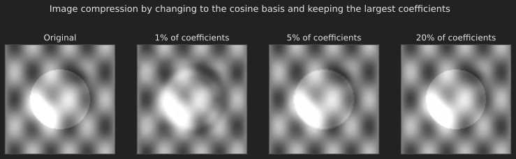

# Introduction

The [last post](../the-singular-value-decomposition/index.qmd) ended on a provocative note. The SVD showed that a matrix becomes pure scaling if you write it in the right basis, the orthonormal directions $\vb{v}_i$ and $\vb{u}_i$. That suggests the numbers inside a matrix are not sacred; they are an accident of the basis we happened to use. A matrix that looks complicated in one basis can look diagonal in another, even though it is doing the very same thing to vectors.

This post finally confronts the idea we have been circling since Part 1: a matrix is not the fundamental object. The fundamental object is a **linear transformation**, a rule that moves vectors around, and a matrix is just its shadow, the particular numbers you get after committing to a basis. Once we see this clearly, two things fall into place. First, the formula $\vb{B} = \vb{M}^{-1}\vb{A}\vb{M}$ that kept appearing (in [Part 15](../similar-matrices-and-jordan-form/index.qmd) as "similarity") turns out to be nothing more than the same transformation rewritten in a new basis. Second, the practical art of **choosing a good basis** becomes a powerful tool, and we will watch it compress an image.

## Where we are

```{mermaid}
%%| fig-align: center
flowchart LR
    subgraph ACT1["Act I: Solving Ax = b"]
        P1["1. Geometry"] --> P2["2. Elimination & LU"] --> P3["3. Column Space & Nullspace"] --> P4["4. Rank & Complete Solution"]
    end
    subgraph ACT2["Act II: Structure & Orthogonality"]
        P5["5. Basis & Four Subspaces"] --> P6["6. Graphs & Networks"] --> P7["7. Projections"] --> P8["8. Least Squares & QR"] --> P9["9. Determinants"]
    end
    subgraph ACT3["Act III: Eigenvalues & Beyond"]
        P10["10. Eigenvalues"] --> P11["11. Diagonalization & ODEs"] --> P12["12. Markov & Fourier"] --> P13["13. Positive Definite"] --> P14["14. Complex & FFT"] --> P15["15. Jordan Form"] --> P16["16. SVD"] --> P17["17. Transformations"] --> P18["18. Pseudoinverse"]
    end
    ACT1 --> ACT2 --> ACT3

    style P17 fill:#10a37f,color:#fff
```

# What is a linear transformation?

A **linear transformation** is a rule $T$ that takes a vector and returns a vector, obeying just two requirements: it respects addition and scaling. In one line,

$$
T\left(c\,\vb{v} + d\,\vb{w}\right) = c\,T\left(\vb{v}\right) + d\,T\left(\vb{w}\right)
$$

for all vectors $\vb{v}, \vb{w}$ and all numbers $c, d$. That single condition is enormously restrictive in a useful way. Rotating the plane is a linear transformation. Reflecting it, projecting it onto a line, stretching it: all linear. So is the derivative, which takes a polynomial and returns its slope function. What is *not* linear: shifting every vector by a fixed amount (that moves the origin, and $T\left(\vb{0}\right)$ must be $\vb{0}$ for a linear map), or squaring coordinates.

The defining property has a beautiful consequence. Suppose we know what $T$ does to a basis $\vb{v}_1, \dots, \vb{v}_n$. Any vector $\vb{x}$ is some combination $\vb{x} = c_1\vb{v}_1 + \cdots + c_n\vb{v}_n$, and linearity then forces

$$
T\left(\vb{x}\right) = c_1\,T\left(\vb{v}_1\right) + \cdots + c_n\,T\left(\vb{v}_n\right).
$$

So a linear transformation is *completely determined by what it does to a basis*. This is the hinge on which everything turns. The animation below shows the idea made visible: a transformation acts on every point of a "house" shape at once, and a rotation, a shear, and a stretch are all just linear maps applied to the same coordinates.



# From transformation to matrix: choose a basis

If $T$ is determined by what it does to a basis, we can record all of that information in a matrix. Here is the construction. Pick a basis $\vb{v}_1, \dots, \vb{v}_n$ for the input space and a basis $\vb{w}_1, \dots, \vb{w}_m$ for the output space. Apply $T$ to each input basis vector, and write the result in terms of the output basis. The coordinates you get become the columns of a matrix $\vb{A}$:

> the $j$-th column of $\vb{A}$ is $T\left(\vb{v}_j\right)$, expressed in the output basis.

That matrix is the representation of $T$ in those bases. Multiplying $\vb{A}$ by a coordinate vector reproduces exactly the action of $T$. The matrix and the transformation are two descriptions of the same thing, with the basis as the dictionary between them.

A clean example makes this concrete: the derivative, viewed as a linear transformation. Take the input space to be quadratics, with basis $\left\{1, x, x^2\right\}$, and the output space to be linear polynomials, with basis $\left\{1, x\right\}$. The derivative does

$$
T\left(1\right) = 0, \qquad T\left(x\right) = 1, \qquad T\left(x^2\right) = 2x.
$$

Writing each result in the output basis $\left\{1, x\right\}$ gives the coordinate columns $\left(0,0\right)$, $\left(1,0\right)$, and $\left(0,2\right)$. So the derivative *is* the matrix

$$
\vb{A} = \begin{bmatrix} 0 & 1 & 0 \\ 0 & 0 & 2 \end{bmatrix}.
$$

Differentiating $c_1 + c_2 x + c_3 x^2$ is now just matrix multiplication: $\vb{A}\left(c_1, c_2, c_3\right)^{\intercal} = \left(c_2, 2c_3\right)$, which reads back as $c_2 + 2c_3 x$. Calculus, encoded in a matrix. The point is general: every linear transformation between finite-dimensional spaces becomes a matrix once you fix the bases.

# Changing the basis changes the matrix

Now the central question. The *same* transformation, written in two different bases, gives two different matrices. How are they related?

Let $\vb{A}$ be the matrix of $T$ in one basis. Let $\vb{M}$ be the **change-of-basis matrix**, whose columns are the new basis vectors written in the old coordinates, so that old coordinates and new coordinates are related by $\vb{x}_{\text{old}} = \vb{M}\,\vb{x}_{\text{new}}$. To find the matrix $\vb{B}$ of the same $T$ in the new basis, we trace a round trip: convert new coordinates to old with $\vb{M}$, apply $\vb{A}$, then convert back to new with $\vb{M}^{-1}$. That is

$$
\vb{B} = \vb{M}^{-1}\vb{A}\vb{M}.
$$ {#eq-change_of_basis}

This is exactly the **similarity** relation from [Part 15](../similar-matrices-and-jordan-form/index.qmd). Now we can see what it always meant: similar matrices are not mysteriously related cousins; they are the very same transformation, photographed from two different coordinate systems. That is why they share eigenvalues, traces, and determinants: those are properties of the transformation itself, not of any one basis.

And it explains, at last, what diagonalization was really doing. Take $\vb{A} = \left[\begin{smallmatrix} 2 & 1 \\ 1 & 2 \end{smallmatrix}\right]$, whose eigenvectors are $\left(1, 1\right)$ and $\left(1, -1\right)$. Choose those eigenvectors as the new basis, so the change-of-basis matrix is $\vb{M} = \left[\begin{smallmatrix} 1 & 1 \\ 1 & -1 \end{smallmatrix}\right]$. Then

$$
\vb{B} = \vb{M}^{-1}\vb{A}\vb{M} = \begin{bmatrix} 3 & 0 \\ 0 & 1 \end{bmatrix}.
$$

In the eigenvector basis, the transformation is diagonal: it simply scales the first new axis by $3$ and the second by $1$. Diagonalization is the search for the basis in which a transformation is as simple as it can possibly be. The SVD did the same thing with two bases instead of one.

# The payoff: choosing a basis to compress an image

If the right basis can turn a tangled matrix into a diagonal one, perhaps the right basis can turn a complicated *signal* into a few important numbers. This is the entire idea behind image compression, and it is a direct application of changing basis.

A grayscale image is just a big array of pixel intensities, that is, a vector in a very high-dimensional space, written in the "pixel basis" (one basis vector per pixel). The pixel basis is a terrible basis for storage: neighboring pixels are highly correlated, so the information is spread thinly across thousands of numbers. But if we re-express the image in a basis of smooth oscillating patterns, the **cosine basis** that the JPEG standard uses, almost all the energy concentrates into a handful of low-frequency coefficients. The rest are nearly zero and can be thrown away. Throwing away small coefficients in a well-chosen basis is *lossy compression*.

@fig-compression shows this in action on a small grayscale image. We transform it into the cosine basis, keep only the largest few percent of the coefficients, and transform back. Even keeping a small fraction, the reconstruction is faithful, because the discarded coefficients carried almost no energy.

{#fig-compression fig-align="center" width=100%}

The lesson is the one this whole post has been building toward. The image never changed; only our description of it did. A wise change of basis exposed the structure that the pixel basis hid. Whether the goal is to diagonalize a matrix, to solve a differential equation, or to compress a photograph, the recurring move of linear algebra is: find the basis in which the problem becomes simple.

# Where we are, and where we go next

Let us take stock. We have finally said what a matrix is:

- A **linear transformation** respects addition and scaling, and is completely determined by what it does to a basis.
- Choosing input and output bases turns the transformation into a **matrix**, whose columns are the images of the input basis vectors.
- Changing the basis transforms the matrix by $\vb{B} = \vb{M}^{-1}\vb{A}\vb{M}$, which is exactly **similarity**. Diagonalization and the SVD are the search for a basis that makes the transformation simple.
- Choosing a good basis is a practical superpower: it is how images are compressed.

We have now seen, from many angles, that a matrix is invertible only when its transformation loses no information, when nothing in the input is crushed to zero and every output can be reached. But most matrices are not like that. Rectangular matrices, rank-deficient matrices, the matrices of real data: they have nontrivial null spaces and unreachable targets, and no honest inverse. And yet we constantly need to "undo" them as best we can, exactly as we did when we solved least squares. The final post of the series builds the tool that does this for *every* matrix, the pseudoinverse, and uses it to tie the whole journey back to the question we asked on the very first page.
