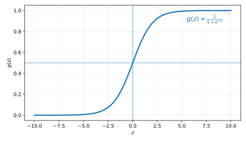

# Introduction

We will now study a classification algorithm called logistic regression. Recall from the [ML introduction blog post](../introduction-to-machine-learning/index.qmd#classification) that **classification** is a type of supervised learning paradigm in which the output of each data point is categorical, i.e., $y_i \in \{1, 2, \dots, k\}$ for all $i \in \{1, 2, \dots, n\}$. For now, we will focus on **binary classification** in which the output can take only two values which we denote as $y_i \in \{0, 1\}$. This is like a yes-no output. For instance, the task can be to classify whether an email is spam or not (the output) given its features (input). This is the reason why the outputs in classification problems are also known as **labels** of the corresponding inputs. Also, most of what we study here will also generalize to the multi-class classification scenario.

# Notation

- $\vb{X} \in \mathbb{R}^{n\times (d+1)}$: All the inputs $\vb{x}_i$ (put in rows) are collectively denoted using this **design matrix**.
- $\vb{y} \in \mathbb{R}^{n}$: All the corresponding outputs $y_i \in \{0, 1\}$ are collectively denoted using this **output vector**.
- All the examples (also known as data points, observations, etc.) for which $y_i = 1$ are called the **positive examples**, and all the examples for which $y_i = 0$ are called the **negative examples**.

# Hypothesis

Recall from the [big picture of supervised learning](../linear-regression/index.qmd#big-picture-of-supervised-learning) that using different kinds of supervised learning algorithms just amount to adding restrictions on what family of functions can be used as the hypothesis $h$. In linear regression, this hypothesis is a linear hypothesis denoted with $h_{\boldsymbol{\uptheta}}(\vb{x})$.

We could approach the classification problem ignoring the fact that $y$ is discrete-valued, and use our old linear regression algorithm to try to predict $y$ given $\vb{x}$. However, it is easy to construct examples where this method performs very poorly. Intuitively, it also doesn't make sense for $h_{\boldsymbol{\uptheta}} (\vb{x})$ to take values larger than $1$ or smaller than $0$ when we know that $y \in \{0, 1\}$.

To fix this, let us change the form of our hypothesis $h_{\boldsymbol{\uptheta}} (\vb{x})$ to

$$
h_{\boldsymbol{\uptheta}} (\vb{x}) = g \left( \boldsymbol{\uptheta}^{\intercal} \vb{x} \right) = \frac{1}{1 + e^{- \boldsymbol{\uptheta}^{\intercal} \vb{x}}},
$$

where

$$
g(z) = \frac{1}{1 + e^{-z}}
$$ {#eq-logistic_function}

is called the **logistic function** or the **sigmoid function**. @fig-sigmoid shows the plot of the logistic function.

{#fig-sigmoid fig-align="center" width=70% .invert}

The extremes of this function are

$$
\lim_{z \to \infty} g(z) = 1, \quad \lim_{z \to -\infty} g(z) = 0.
$$

# Acknowledgment

I have referred to the @stanford_cs229_ml_youtube YouTube playlist while writing this blog post. This playlist closely follows the material presented in @ng_cs229_notes.
