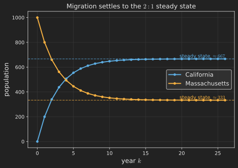

# Introduction

In [Part 11](../diagonalization-powers-and-differential-equations/index.qmd) we learned that the eigenvalues of a matrix govern long-term behavior: take a sequence $\vb{u}_{k+1} = \vb{A}\vb{u}_k$ and the eigenvalues decide what grows, what decays, and what survives. This post puts that machinery to work on two famous applications that look unrelated but rest on the same two pillars, eigenvalues and orthogonality.

The first is **Markov matrices**, the matrices behind random transitions: populations moving between cities, web surfers clicking between pages, weather drifting between states. They have a built-in eigenvalue of exactly $1$, and that single fact explains why such systems settle into a stable steady state. The second is **Fourier series**, where we expand a function as a sum of sines and cosines. That turns out to be the same idea as writing a vector in an orthonormal basis, the projection idea from [Part 7](../orthogonality-and-projections/index.qmd), stretched from finite dimensions to infinite ones.

## Where we are

```{mermaid}
%%| fig-align: center
flowchart LR
    subgraph ACT1["Act I: Solving Ax = b"]
        P1["1. Geometry"] --> P2["2. Elimination & LU"] --> P3["3. Column Space & Nullspace"] --> P4["4. Rank & Complete Solution"]
    end
    subgraph ACT2["Act II: Structure & Orthogonality"]
        P5["5. Basis & Four Subspaces"] --> P6["6. Graphs & Networks"] --> P7["7. Projections"] --> P8["8. Least Squares & QR"] --> P9["9. Determinants"]
    end
    subgraph ACT3["Act III: Eigenvalues & Beyond"]
        P10["10. Eigenvalues"] --> P11["11. Diagonalization & ODEs"] --> P12["12. Markov & Fourier"] --> P13["13. Positive Definite"] --> P14["14. Complex & FFT"] --> P15["15. Jordan Form"] --> P16["16. SVD"] --> P17["17. Transformations"] --> P18["18. Pseudoinverse"]
    end
    ACT1 --> ACT2 --> ACT3

    style P12 fill:#10a37f,color:#fff
```

# Markov matrices: transitions that settle down

A **Markov matrix** is a square matrix with two features: every entry is greater than or equal to zero, and every column adds up to $1$. The entries are probabilities or proportions, and the columns summing to $1$ says that whatever leaves one state has to arrive somewhere, nothing is created or lost.

Let us make it concrete. Imagine people moving between two states, California and Massachusetts. Each year, $90\%$ of Californians stay and $10\%$ leave for Massachusetts, while $80\%$ of the Massachusetts residents stay and $20\%$ move to California. @fig-markov_states draws the flow.

```{mermaid}
%%| fig-align: center
%%| label: fig-markov_states
%%| fig-cap: "A two-state Markov chain. Each arrow is the fraction moving along it per year; the fractions leaving each state sum to one."
flowchart LR
    CA["California"] -->|"0.9"| CA
    CA -->|"0.1"| MA["Massachusetts"]
    MA -->|"0.2"| CA
    MA -->|"0.8"| MA
```

If $\vb{u}_k = \left(\text{California population},\ \text{Massachusetts population}\right)$ after $k$ years, then one year's migration is the matrix step
$$
\vb{u}_{k+1} = \vb{A}\vb{u}_k,
\qquad
\vb{A} = \begin{bmatrix} 0.9 & 0.2 \\ 0.1 & 0.8 \end{bmatrix}.
$$
Each column sums to $1$, so $\vb{A}$ is Markov. The total population never changes, which is the clue to its most important property.

## Why there is always an eigenvalue of 1

Here is the key fact: **every Markov matrix has $\lambda = 1$ as an eigenvalue.** The reason is short and elegant. If every column of $\vb{A}$ sums to $1$, then every column of $\vb{A} - \vb{I}$ sums to $0$. That means the rows of $\vb{A} - \vb{I}$ add up to the zero row, so the rows are dependent, so $\vb{A} - \vb{I}$ is singular. A singular $\vb{A} - \vb{I}$ is exactly the statement $\det\left(\vb{A} - 1 \cdot \vb{I}\right) = 0$, that is, $\lambda = 1$ is an eigenvalue. (All the other eigenvalues of a Markov matrix satisfy $\left|\lambda\right| \leq 1$, so nothing blows up.)

For our matrix, the eigenvalues are $\lambda_1 = 1$ and $\lambda_2 = 0.7$ (their sum is the trace $1.7$ and their product is the determinant $0.9 \cdot 0.8 - 0.2 \cdot 0.1 = 0.7$). The eigenvector for $\lambda_1 = 1$ comes from the nullspace of $\vb{A} - \vb{I} = \left[\begin{smallmatrix} -0.1 & 0.2 \\ 0.1 & -0.2 \end{smallmatrix}\right]$, which is spanned by $\left(2, 1\right)$. That eigenvector is the **steady state**: a population split in the ratio $2 : 1$ is left completely unchanged by the migration.

## Convergence to the steady state

Now use the Part 11 picture. Writing the start $\vb{u}_0$ in eigenvector coordinates, $\vb{u}_0 = c_1 \left(2, 1\right) + c_2 \left(1, -1\right)$, the state after $k$ years is
$$
\vb{u}_k = c_1 \, 1^k \begin{bmatrix} 2 \\ 1 \end{bmatrix} + c_2 \, \left(0.7\right)^k \begin{bmatrix} 1 \\ -1 \end{bmatrix}.
$$
The eigenvalue $1$ holds its term fixed; the eigenvalue $0.7$ sends its term to zero. So *no matter where we start*, the population converges to the steady-state direction $\left(2, 1\right)$. @fig-markov_convergence shows this for a start of everyone in Massachusetts, $\vb{u}_0 = \left(0, 1000\right)$: the populations slide year by year to $\left(\tfrac{2}{3}, \tfrac{1}{3}\right)$ of the total, that is, about $667$ in California and $333$ in Massachusetts. The $\lambda = 1$ eigenvalue is precisely what makes a stable equilibrium exist, and the second eigenvalue sets how fast we get there.

{#fig-markov_convergence fig-align="center" width=85%}

# Fourier series: orthonormal bases for functions

Now a leap that, at first, sounds like a different subject entirely, but is the same linear algebra. Recall from [Part 7](../orthogonality-and-projections/index.qmd) that if $\vb{q}_1, \dots, \vb{q}_n$ is an **orthonormal basis** (perpendicular unit vectors), then any vector $\vb{v}$ has a beautifully simple expansion:
$$
\vb{v} = c_1 \vb{q}_1 + \cdots + c_n \vb{q}_n,
\qquad
c_i = \vb{q}_i^{\intercal}\vb{v}.
$$
Each coordinate is just a dot product with a basis vector, no system to solve, because the basis is orthonormal. **Fourier series take this exact idea and apply it to functions instead of vectors.**

A periodic function $f\left(x\right)$ is expanded not in finitely many vectors but in an infinite orthonormal-style basis of sines and cosines:
$$
f\left(x\right) = a_0 + a_1 \cos x + b_1 \sin x + a_2 \cos 2x + b_2 \sin 2x + \cdots .
$$
For this to be the same idea, we need a notion of "dot product" for functions. It is the integral of their product:
$$
\left\langle f, g \right\rangle = \int_0^{2\pi} f\left(x\right) g\left(x\right) \, \dd{x}.
$$
With this inner product, the sines and cosines are **orthogonal**: the integral of $\cos\left(mx\right)\cos\left(nx\right)$ over a full period is zero whenever $m \neq n$, and likewise for the other pairings. They are the infinite-dimensional cousins of perpendicular axes. @fig-fourier_basis lays the analogy side by side.

{#fig-fourier_basis fig-align="center" width=95%}

Because the basis is orthogonal, each coefficient is found the same way as $c_i = \vb{q}_i^{\intercal}\vb{v}$: project $f$ onto the corresponding basis function. Concretely,
$$
a_n = \frac{1}{\pi}\int_0^{2\pi} f\left(x\right)\cos\left(nx\right)\,\dd{x},
\qquad
b_n = \frac{1}{\pi}\int_0^{2\pi} f\left(x\right)\sin\left(nx\right)\,\dd{x}.
$$
The integral picks out "how much of $\cos nx$ is in $f$", exactly as a dot product picks out how much of $\vb{q}_i$ is in $\vb{v}$. The orthogonality is what makes the coefficients independent: each one can be computed on its own, without untangling it from the others. Fourier analysis, the workhorse of signal processing, audio, and image compression, is at heart the projection formula from Part 7, carried into the space of functions.

# Where we are, and where we go next

Two applications, one toolkit:

- A **Markov matrix** (nonnegative entries, columns summing to $1$) always has eigenvalue $\lambda = 1$, because $\vb{A} - \vb{I}$ has dependent rows. Its eigenvector is the **steady state**, and every starting distribution converges to it, with the second eigenvalue setting the speed.
- **Fourier series** expand a function in the orthogonal basis of sines and cosines. With the integral as an inner product, each coefficient is a projection, the infinite-dimensional version of $c_i = \vb{q}_i^{\intercal}\vb{v}$.

Both stories quietly relied on a recurring miracle: nice matrices have orthogonal eigenvectors and well-behaved (here, real and bounded) eigenvalues. That is not an accident. There is a special class of matrices, the **symmetric** matrices, for which this is guaranteed: their eigenvalues are always real and their eigenvectors always perpendicular. They are the best-behaved matrices in all of linear algebra, and they bring with them the crucial idea of **positive definiteness**, the matrix version of a function curving upward into a bowl. That is Part 13, and it is where the geometry of optimization begins.
