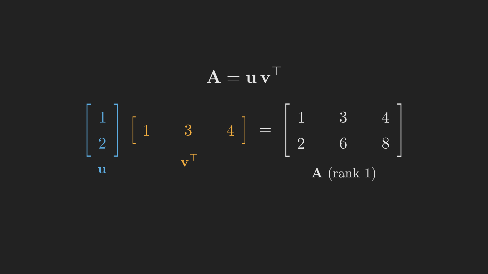

# Introduction

In [Part 5](../basis-dimension-and-the-four-subspaces/index.qmd) we made independence, basis, and dimension precise, and assembled the four fundamental subspaces into one picture. That picture is the skeleton of Act II. Before we add the flesh of orthogonality to it in the next post, this post stretches our new vocabulary in two directions that look unrelated but are not.

First, nothing about "vector space" required the vectors to be lists of numbers. Whole matrices can be added and scaled, so they form a vector space too, with its own bases and dimensions. So can functions. Recognizing this widens linear algebra from a tool for solving $\vb{A}\vb{x} = \vb{b}$ into a language for an enormous range of problems.

Second, the abstract subspaces from Part 5 describe startlingly concrete things. We will build the incidence matrix of a small electrical network and watch all four subspaces show up as physical facts: constant voltages, conservation of current, and loops in the circuit. By the end, a famous formula of Euler relating nodes, edges, and loops will fall out of linear algebra almost for free.

## Where we are

```{mermaid}
%%| fig-align: center
flowchart LR
    subgraph ACT1["Act I: Solving Ax = b"]
        P1["1. Geometry"] --> P2["2. Elimination & LU"] --> P3["3. Column Space & Nullspace"] --> P4["4. Rank & Complete Solution"]
    end
    subgraph ACT2["Act II: Structure & Orthogonality"]
        P5["5. Basis & Four Subspaces"] --> P6["6. Graphs & Networks"] --> P7["7. Projections"] --> P8["8. Least Squares & QR"] --> P9["9. Determinants"]
    end
    subgraph ACT3["Act III: Eigenvalues & Beyond"]
        P10["10. Eigenvalues"] --> P11["11. Diagonalization & ODEs"] --> P12["12. Markov & Fourier"] --> P13["13. Positive Definite"] --> P14["14. Complex & FFT"] --> P15["15. Jordan Form"] --> P16["16. SVD"] --> P17["17. Transformations"] --> P18["18. Pseudoinverse"]
    end
    ACT1 --> ACT2 --> ACT3

    style P6 fill:#10a37f,color:#fff
```

# Spaces that are not made of column vectors

A vector space, recall, is anything closed under addition and scalar multiplication. The collection of all $3 \times 3$ matrices satisfies this perfectly: add two such matrices and you get a $3 \times 3$ matrix; scale one and you get a $3 \times 3$ matrix. So this collection, call it $\mathcal{M}$, is a vector space, and we can ask all our usual questions of it. What is a basis? The nine matrices that have a single $1$ in one position and zeros elsewhere clearly span $\mathcal{M}$ and are independent, so

$$
\dim \mathcal{M} = 9.
$$

Inside $\mathcal{M}$ sit familiar subspaces. The **symmetric** matrices ($\vb{A}^{\intercal} = \vb{A}$) form a subspace: a symmetric matrix is pinned down by its $3$ diagonal entries and $3$ above-diagonal entries, so its dimension is $6$. The **upper triangular** matrices also form a subspace of dimension $6$ (the six entries on and above the diagonal). Their intersection, matrices that are both symmetric and upper triangular, can only be **diagonal**, a subspace of dimension $3$. @tbl-matrix_spaces summarizes them.

::: {.tbl tbl-colwidths="auto"}
| Subspace of $\mathcal{M}$ | Dimension | What pins a member down |
|:---|:---:|:---|
| All $3 \times 3$ matrices | $9$ | all nine entries |
| Symmetric ($\vb{A}^{\intercal} = \vb{A}$) | $6$ | $3$ diagonal $+$ $3$ above-diagonal entries |
| Upper triangular | $6$ | the $6$ entries on and above the diagonal |
| Diagonal ($=$ symmetric $\cap$ upper triangular) | $3$ | the $3$ diagonal entries |

: Subspaces of the space of $3 \times 3$ matrices. {#tbl-matrix_spaces style="width:85%; margin:auto;"}
:::

There is a neat counting law lurking here. For two subspaces $\mathcal{S}$ and $\mathcal{U}$,

$$
\dim\left(\mathcal{S} \cap \mathcal{U}\right) + \dim\left(\mathcal{S} + \mathcal{U}\right) = \dim \mathcal{S} + \dim \mathcal{U},
$$

where $\mathcal{S} + \mathcal{U}$ means all sums of a vector from each. Take $\mathcal{S}$ symmetric and $\mathcal{U}$ upper triangular: the law reads $3 + \dim\left(\mathcal{S} + \mathcal{U}\right) = 6 + 6$, so $\dim\left(\mathcal{S} + \mathcal{U}\right) = 9$. The symmetric and upper triangular matrices together span *all* of $\mathcal{M}$, which makes sense: any matrix can be split into a symmetric part plus a (strictly upper, plus diagonal) triangular adjustment.

The same widening applies to functions. The solutions of the differential equation $y'' + y = 0$ are all combinations $c_1 \cos x + c_2 \sin x$. They form a vector space (sums and scalings of solutions are solutions), with basis $\left\{\cos x, \sin x\right\}$ and dimension $2$. The phrase "second-order equation, two arbitrary constants" is really the statement "this solution space has dimension $2$". Linear algebra quietly governs differential equations too, a theme we will pick up in Part 11.

# Rank-one matrices: the atoms

Among all matrices, the simplest interesting ones have rank $1$. A **rank-one matrix** is a single column times a single row, $\vb{u}\vb{v}^{\intercal}$. For example, with $\vb{u} = \left(1, 2\right)$ and $\vb{v} = \left(1, 3, 4\right)$,

$$
\vb{u}\vb{v}^{\intercal}
= \begin{bmatrix} 1 \\ 2 \end{bmatrix}
\begin{bmatrix} 1 & 3 & 4 \end{bmatrix}
= \begin{bmatrix} 1 & 3 & 4 \\ 2 & 6 & 8 \end{bmatrix}.
$$

Every column of this matrix is a multiple of $\vb{u}$, so the column space is just the line through $\vb{u}$: the rank is $1$. @fig-rank_one shows the structure. Rank-one matrices matter because they are the building blocks of all matrices: **every matrix of rank $r$ can be written as a sum of $r$ rank-one matrices**. We are seeing the first hint of a decomposition that will become the climax of the whole series, the singular value decomposition in Part 16, which writes any matrix as a sum of rank-one pieces ordered by importance.

{#fig-rank_one fig-align="center" width=75%}

(Note that the rank-one matrices do *not* form a subspace: add two of them and you usually get a rank-two matrix. They are atoms, not a space.)

# A real application: graphs and networks

Now for the concrete payoff. Picture a small network: four nodes wired together by five directed edges, like an electrical circuit or a web of connections. @fig-graph shows it.

```{dot}
//| label: fig-graph
//| fig-cap: "A directed graph with 4 nodes and 5 edges. Each edge has a chosen direction (an arrow), which fixes the sign convention for the incidence matrix."
digraph G {
  bgcolor="transparent"
  rankdir=LR
  node [shape=circle, fontcolor="#e6e6e6", style=filled, color="#e6e6e6", fillcolor="#333333", fontname="Helvetica"]
  edge [color="#e6e6e6", fontcolor="#5dade2", fontname="Helvetica"]
  graph [fontcolor="#e6e6e6", fontname="Helvetica"]
  1 -> 2 [label="e1"]
  2 -> 3 [label="e2"]
  1 -> 3 [label="e3"]
  1 -> 4 [label="e4"]
  3 -> 4 [label="e5"]
}
```

We record this graph in its **incidence matrix** $\vb{A}$: one row per edge, one column per node. Each edge leaves a $-1$ in the column of the node it starts at and a $+1$ in the column of the node it ends at. Our five edges give a $5 \times 4$ matrix:

$$
\vb{A} =
\begin{bmatrix}
  -1 & 1 & 0 & 0 \\
   0 & -1 & 1 & 0 \\
  -1 & 0 & 1 & 0 \\
  -1 & 0 & 0 & 1 \\
   0 & 0 & -1 & 1
\end{bmatrix}
\begin{array}{l}
  \ \leftarrow e_1 \\ \ \leftarrow e_2 \\ \ \leftarrow e_3 \\ \ \leftarrow e_4 \\ \ \leftarrow e_5
\end{array}.
$$

Here is why this matrix is worth building. Put a number $x_i$ at each node, think of it as a voltage. Then $\vb{A}\vb{x}$ computes, for every edge, the *difference* in voltage across that edge (end minus start). The matrix $\vb{A}$ is a discrete difference operator. With this reading, the four fundamental subspaces become physical.

**The nullspace $N(\vb{A})$: constant voltages.** When is $\vb{A}\vb{x} = \vb{0}$, that is, when are all the edge differences zero? Exactly when every node has the same voltage. So the nullspace is the line of constant vectors, spanned by $\left(1, 1, 1, 1\right)$, and it has dimension $1$. That means the rank is $r = n - 1 = 3$. (Grounding the circuit, fixing one node's voltage, is precisely removing this one degree of freedom.)

**The left nullspace $N(\vb{A}^{\intercal})$: loops.** The transpose equation $\vb{A}^{\intercal}\vb{y} = \vb{0}$ has a beautiful meaning. If $y_j$ is the current flowing along edge $j$, then $\vb{A}^{\intercal}\vb{y} = \vb{0}$ says that at every node, the current in equals the current out. This is **Kirchhoff's Current Law**, conservation of charge. Its solutions are the currents that circulate around *loops* of the graph. Our graph has two independent loops (for instance $e_1, e_2$ and back along $e_3$; and $e_3, e_5$ and back along $e_4$), so the left nullspace has dimension $m - r = 5 - 3 = 2$.

The column space ($\dim r = 3$) and row space ($\dim r = 3$) fill out the rest of the big picture. The point is that we did not invent these subspaces for this circuit; they are the same four spaces every matrix has, now wearing the clothes of voltages, currents, and loops.

## Euler's formula for free

Count the dimensions we just found. The number of nodes is $n$. The dimension of the nullspace (constant voltages) is $1$. The number of independent loops is the dimension of the left nullspace, $m - r = m - \left(n - 1\right)$. Rearrange:

$$
\left(\text{nodes}\right) - \left(\text{edges}\right) + \left(\text{loops}\right)
= n - m + \left(m - n + 1\right) = 1.
$$

For our graph, $4 - 5 + 2 = 1$. This is **Euler's formula**, one of the oldest results in topology, and here it drops out of nothing more than counting the dimensions of two subspaces. That is the kind of leverage the four-subspaces picture gives you.

# Where we are, and where we go next

We spent this post widening and grounding the ideas from Part 5:

- Vector spaces include spaces of **matrices** (the $3 \times 3$ matrices have dimension $9$, with symmetric, triangular, and diagonal subspaces) and spaces of **functions** (the solutions of $y'' + y = 0$ have dimension $2$).
- **Rank-one matrices** $\vb{u}\vb{v}^{\intercal}$ are the atoms from which every matrix is built, foreshadowing the SVD.
- The **incidence matrix** of a graph turns the four fundamental subspaces into physical statements: constant voltages (nullspace), Kirchhoff's Current Law and loops (left nullspace). Euler's formula falls out of the dimension count.

Twice now, in the big picture of Part 5 and in the circuit just above, we have drawn or claimed that certain subspaces sit at *right angles* to each other: the nullspace perpendicular to the row space, the left nullspace perpendicular to the column space. We have been writing checks that the word "perpendicular" cannot yet cash, because we have not said what it means for vectors, let alone whole subspaces, to be orthogonal. Part 7 finally defines orthogonality, proves those right angles are real, and uses them to solve a problem we could not touch before: what to do when $\vb{A}\vb{x} = \vb{b}$ has no solution at all.
