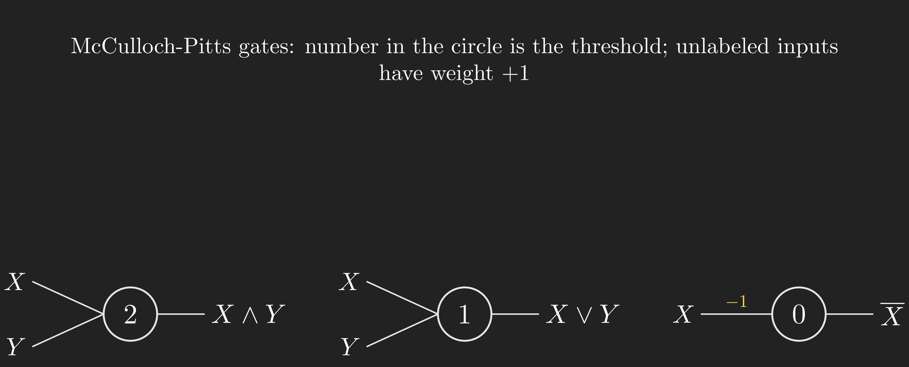
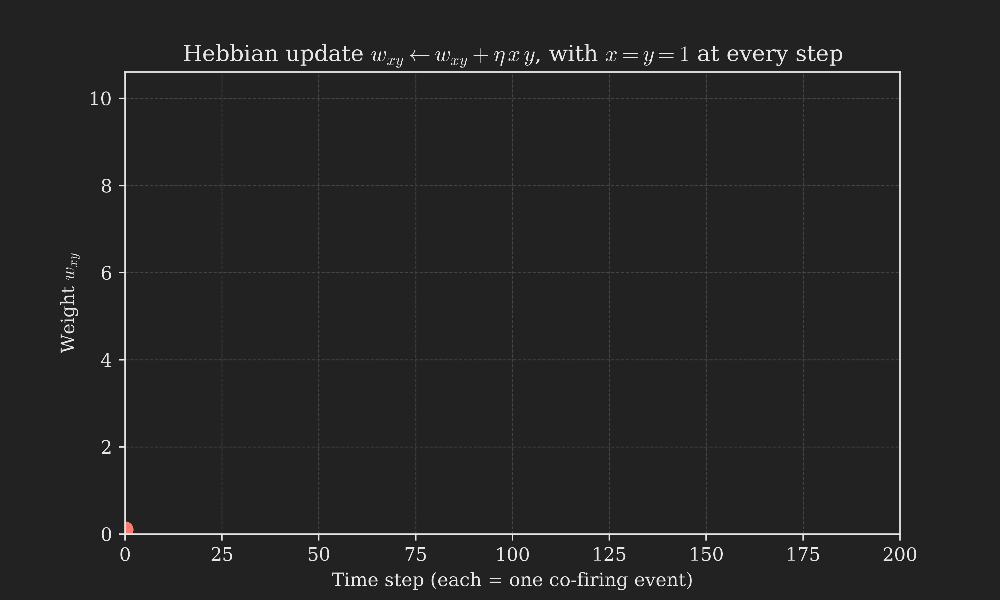
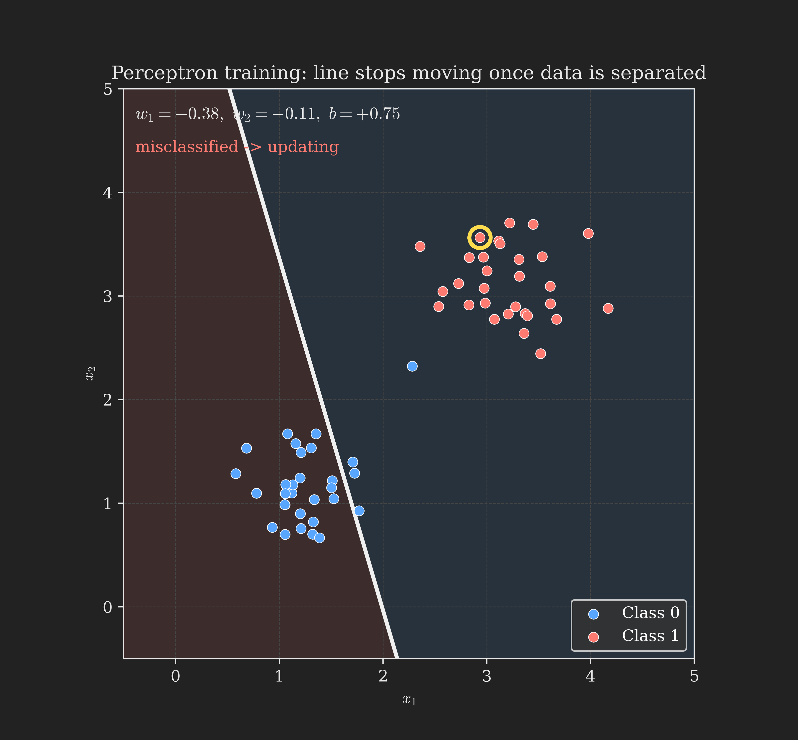
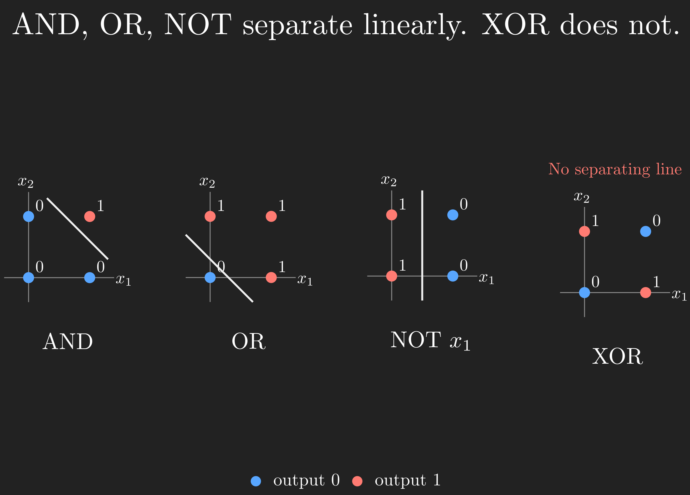
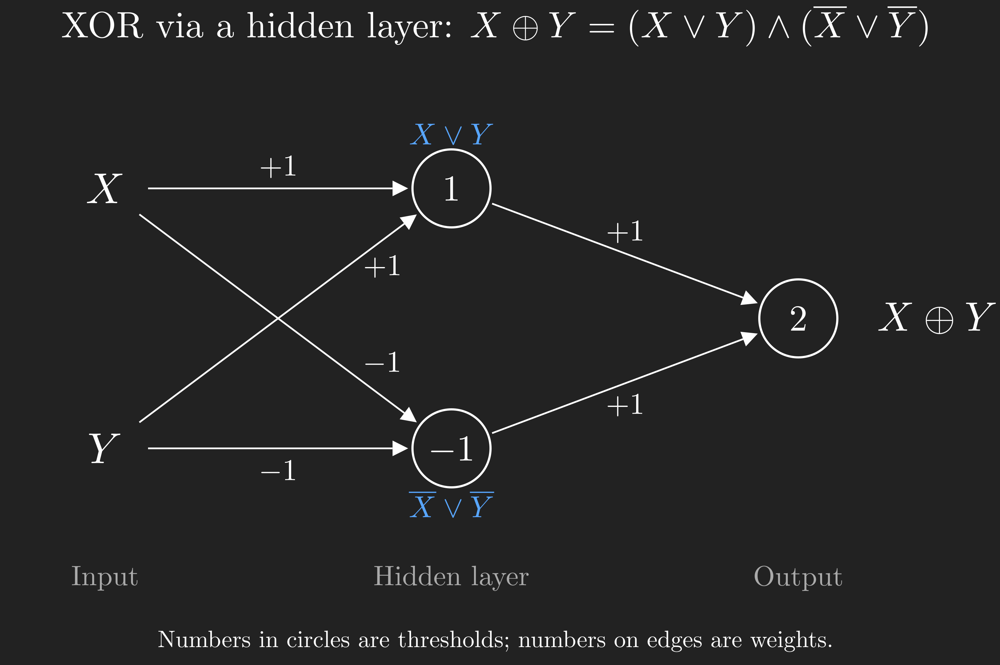
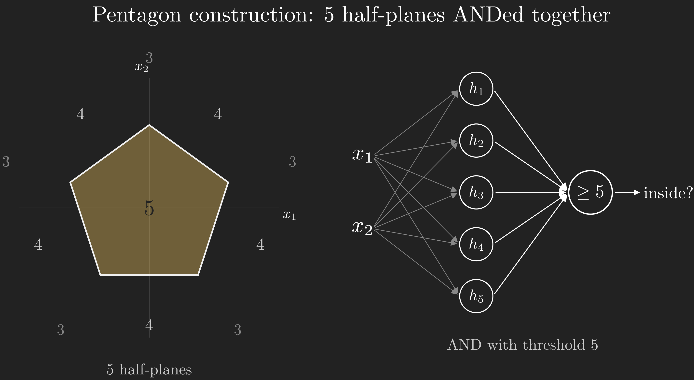
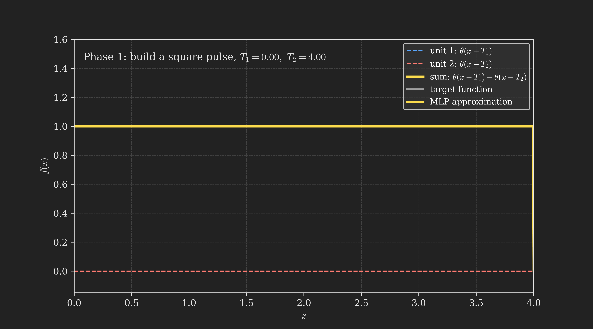

This post is the first in a series of lecture notes following along with Carnegie Mellon University's course 11-785, *Introduction to Deep Learning*, taught by Bhiksha Raj [@cmu_11785_dl_youtube]. The series is meant to be read like detailed lecture notes, expanding on what is said in class with extra context, derivations, and visuals where they help. We start where Bhiksha starts: with the history of the idea.

# What is in the box?

Look at what neural networks can do today.

In 2016, Microsoft's speech recognition system surpassed human transcribers on a standard benchmark, ending a problem we had been chipping away at since the 1950s. That same year, Google switched its translation system to a neural architecture and the output went from being a punchline (translate to Spanish, translate back, watch the sentence become unrecognisable) to something professional translators began using as a first cut. AlphaGo beat Lee Sedol at Go, a game with $10^{160}$ possible board positions, far more than chess's $10^{120}$, and a game most experts thought computers would not crack for another decade. And the first neural image-captioning systems, also that year, looked at a photograph and produced sentences like "a man in a black shirt is playing a guitar."

Fast-forward to today. Tell a modern multimodal model "describe this picture of my room" and it will tell you about the water stains on the ceiling, the posters on the wall, the clutter on the desk, the comforter on the bed, and which of these things is the most concerning. We routinely ask language models to prove mathematical theorems that are not in any textbook, and they often succeed. None of this looked plausible thirty years ago.

All of these systems are neural networks. From the outside, a neural network looks like a black box: you feed it something, it gives you something back. A voice signal goes in, a transcription comes out. An image goes in, a caption comes out. A board position goes in, a move comes out. So the obvious question is the one we will spend this entire post answering:

**What is in the box?**

To get a sense of where this post is headed, here is the journey we will take. Each box on the path is a question that needed to be answered, and each arrow is the answer that motivated the next question.

```{mermaid}
%%| fig-align: center
flowchart TD
    A["What's in the box?"] --> B["Look at the brain"]
    B --> C["The brain is a network of neurons<br/>(connectionism)"]
    C --> D["What's a single unit?<br/>(McCulloch-Pitts)"]
    D --> E["How does a unit learn?<br/>(Hebb, Rosenblatt)"]
    E --> F["A single unit is too weak<br/>(XOR is impossible)"]
    F --> G["Network many units together<br/>(multi-layer perceptron)"]
    G --> H["MLPs can compute<br/>any Boolean function"]
    G --> I["MLPs can carve<br/>any decision boundary"]
    G --> J["MLPs can approximate<br/>any function"]
    H --> K["The box is an MLP"]
    I --> K
    J --> K
```

The destination is the boxed claim at the bottom: whatever is in the box, an MLP can in principle do its job. Let's earn that claim.

# Looking inward, the brain as a clue

If we want to build something that can learn, recognise patterns, and reason, the most successful example of such a system is sitting inside our own skulls. So a reasonable first move is to look at how the brain seems to work and try to imitate it. People have been doing this for a very long time.

The earliest serious model of cognition is **associationism**, an idea that runs from Plato through Aristotle, the British empiricists like Hume and Hartley, and on to Pavlov. The claim is simple: the mind learns by forming associations between things that occur together. You see lightning, then you hear thunder; after enough repetitions, the sight of lightning makes you anticipate thunder, and the sound of thunder makes you suspect lightning has just struck somewhere. Aristotle, in particular, proposed four "laws" governing how associations form:

1. **Contiguity.** Things that occur close together in space or time get linked.
2. **Frequency.** The more often two things co-occur, the stronger the link.
3. **Similarity.** Similar things trigger thoughts of one another.
4. **Contrast.** Opposites trigger one another.

This is one of the very few places in this post where I will use a list rather than prose, because Aristotle's four laws are quite literally a numbered list and it would be strange to disguise them as a paragraph.

Associationism is a remarkably durable idea. A huge fraction of what modern machine learning does is, at heart, learning associations between inputs and outputs. But the philosophers who proposed it left one critical question unanswered. **Where are these associations stored?** They have to live somewhere physical for the mind to be able to call them up. And how, mechanically, are they stored? Without an answer to that, we have a theory of the mind without a theory of the brain.

# The connectionist hypothesis

By the mid-1800s, microscopy had advanced enough that biologists realised the brain is a vast mesh of interconnected cells, which would later be named neurons. Each neuron sends signals to many others, and receives signals from many others. So whatever the brain is doing, the cells themselves are clearly the actors and the network of connections between them is the stage.

In 1873, the Scottish philosopher **Alexander Bain** put together what is, with hindsight, the first artificial neural network [@bain1873mind]. His proposal was that information lives **in the connections** between neurons. He drew small diagrams of three-input, three-output networks where different combinations of inputs would activate different combinations of outputs, and he even proposed a mechanism by which connections strengthen with repeated co-activation, predicting Hebbian learning by more than 70 years. His doubt was scale: in 1873 he calculated that learning a couple of hundred thousand "acquisitions" would require around a million neurons and five billion connections, and he eventually decided the brain was simply too small for that. He recanted his ideas late in life. We now know he was wrong about the scale: the human brain has roughly 80 billion neurons and 100 trillion connections. He had the right idea and the wrong inventory.

This view, that mental computation is a property of the network of connections rather than of any individual element, is called **connectionism**. It has been the guiding metaphor of neural networks ever since.

Connectionism is interesting in part because it is so different from how the computer in front of you actually works. A standard computer follows the **von Neumann (or Princeton) architecture**: there is a central processor that executes instructions, and there is a separate memory that holds both the program and the data. The same physical processor can run any program by reading different instructions out of memory. A neural network does not work that way at all. The "program" is not stored in some memory that the network reads from; the program *is* the network, encoded in which units are connected to which others and with what strengths. To change the program, you would have to change the wiring. The two architectures look like this:

```{mermaid}
%%| fig-align: center
flowchart LR
    subgraph VN["Von Neumann machine"]
      direction TB
      P["Processor"] <--> M["Memory<br/>(program + data)"]
    end
    subgraph NN["Neural network"]
      direction TB
      N["Network<br/>(program lives in the connections)"]
    end
```

This is also why we don't actually build neural networks in hardware (mostly): we simulate them on conventional computers, because conventional computers can be reprogrammed by editing their memory while a hardwired neural network would need a new chip every time the connections change.

::: {.callout-tip collapse="true"}
## Poll 1, check yourself

**Q1.** Who first proposed connectionism?

(a) Aristotle (b) Alexander Bain (c) David Hartley (d) Alan Turing

**Q2.** Roughly how many connections exist between neurons in the human brain?

(a) 1 million (b) 5 billion (c) 80 billion (d) 100 trillion

::: {.callout-note collapse="true"}
## Answers

**A1:** (b) Alexander Bain, in 1873.

**A2:** (d) 100 trillion. There are around 80 billion neurons (option c is the neuron count, not the connection count).
:::
:::

So the brain is a connectionist machine. We have committed to building artificial systems with the same flavour: many simple processing elements wired together, with all the knowledge living in the wiring. The next question is the obvious one: what are the simple processing elements?

# What is a single unit?

To answer that, we need to look briefly at a real neuron.

```{mermaid}
%%| fig-align: center
flowchart LR
    D["Dendrites<br/>(inputs from other neurons)"] --> S["Soma<br/>(cell body, sums inputs)"]
    S --> A["Axon<br/>(output to other neurons)"]
```

Signals come into the neuron through its **dendrites** and are summed up in the cell body, the **soma**. If the accumulated signal is strong enough, the neuron fires, and the resulting pulse travels out along its single **axon** to the dendrites of other neurons. So as a first approximation, a neuron is a unit that receives many weighted inputs, sums them, and fires if the sum is large enough.

That is exactly the model proposed by **Warren McCulloch and Walter Pitts** in 1943 [@mcculloch1943logical]. McCulloch was a neurophysiologist; Pitts was a homeless self-taught logician who showed up at McCulloch's door and ended up co-authoring one of the foundational papers of artificial intelligence at the age of 20. Their model treats each neuron as a binary unit performing **threshold logic**: it has a set of incoming connections, some excitatory and some inhibitory, and it fires (outputs 1) if the total excitatory input is above some threshold, unless any inhibitory input is active, in which case the neuron is forced to stay silent regardless.

With this single ingredient you can already build Boolean gates. AND, OR, and NOT are easy to express as small networks of McCulloch-Pitts neurons by choosing weights and thresholds appropriately, and any Boolean function at all can be assembled from these. The figure below sketches the simplest cases, with the weight on each input edge and the threshold inside each circle.

{#fig-mcp_gates fig-align="center" width=90%}

The McCulloch-Pitts model can even reproduce non-trivial perceptual phenomena. Touch something cold very briefly and your first sensation is one of warmth; only if your finger stays in contact does the cold sensation register. McCulloch and Pitts showed how a small network with appropriate inhibitory connections can produce exactly this pattern, with one transient input firing the "heat" output and a sustained input firing the "cold" output instead.

So we have units. We can wire them up. We can build any Boolean function we like in principle. But there is a glaring missing piece. McCulloch and Pitts told us **how a network with the right weights would behave**, but not **how the right weights would ever come to exist**. There is no learning rule. The weights are simply assumed to be set, by some unspecified means, to whatever they need to be.

That is the next question.

# How does a unit learn?

The first concrete proposal for how a network might adjust its own connections came from the Canadian psychologist **Donald Hebb** in his 1949 book *The Organization of Behavior* [@hebb1949organization]. Hebb's idea, in a sentence often quoted in neuroscience and machine learning textbooks alike, is that **neurons that fire together wire together**. More carefully:

> When an axon of cell A is near enough to excite a cell B and repeatedly or persistently takes part in firing it, some growth process or metabolic change takes place in one or both cells such that A's efficiency, as one of the cells firing B, is increased. (Hebb, 1949)

Translated into a mathematical update rule, if $x$ is the firing of the input neuron and $y$ is the firing of the output neuron, then the connection strength $w_{xy}$ between them changes according to

$$
w_{xy} \leftarrow w_{xy} + \eta\, x\, y,
$$ {#eq-hebb}

where $\eta > 0$ is a small learning rate. Each time both neurons fire together, the connection grows by a small amount; if either is silent, nothing happens.

Equation @eq-hebb is the great-grandparent of essentially every learning rule in modern machine learning. But it has a serious problem on its own. There is no mechanism for a connection to ever weaken. Stronger connections fire more reliably, which makes them grow stronger still, which makes them fire even more reliably. Without competition or decay, weights grow without bound until they saturate, at which point the network has lost all of its discriminative ability. The animation below makes this concrete: under repeated co-firing, the weight $w_{xy}$ just keeps climbing.



Various fixes were proposed over the following decades, including weight normalisation schemes like Sanger's generalized Hebbian rule, but the more important development came from a different direction.

::: {.callout-tip collapse="true"}
## Poll 2, check yourself

Hebbian learning is...

(a) Fundamentally stable, since stronger connections enforce themselves
(b) Fundamentally unstable, since there is no reduction in weights
(c) Fundamentally stable, since learning is unbounded
(d) Fundamentally unstable, since weights compete for adjustment

::: {.callout-note collapse="true"}
## Answer

**(b)**. Without any mechanism for weights to decrease or compete, every co-firing event makes the connection stronger, and the weight grows without bound until it saturates.
:::
:::

# Rosenblatt's perceptron

In 1958, the psychologist **Frank Rosenblatt** introduced the **perceptron**, a model that combined the McCulloch-Pitts threshold neuron with a learning rule that actually worked [@rosenblatt1958perceptron].

Rosenblatt's full proposal was inspired by the visual system. Sensors on a "retina" feed into association cells (the $A_1$ layer), those feed into a second association layer ($A_2$), and finally into response cells. There are even feedback connections from the response cells back to the association cells to enforce mutual exclusivity between outputs. It is a rich model, and most of it has been simplified away in modern usage. What we now call a perceptron is the stripped-down core: a single threshold unit that takes a fixed-size input, computes a weighted sum, and fires if the sum crosses a threshold.

Concretely, a perceptron with inputs $x_1, x_2, \dots, x_d$ and weights $w_1, w_2, \dots, w_d$ computes

$$
y = \begin{cases} 1 & \text{if } \sum_{i=1}^{d} w_i x_i \geq T \\ 0 & \text{otherwise.} \end{cases}
$$ {#eq-perceptron}

It is more convenient to fold the threshold into the weighted sum by defining a **bias** $b = -T$ and writing the firing condition as $\sum_i w_i x_i + b \geq 0$. The function $\sum_i w_i x_i + b$ is called an **affine** function of the inputs. (A linear function would be $\sum_i w_i x_i$, with no constant term. An affine function adds the constant $b$. The distinction matters, as we will see in the next section.)

Rosenblatt's contribution was not just the model but the learning rule that goes with it. If the perceptron's output on input $\mathbf{x}$ is $y(\mathbf{x})$ and the desired output is $d(\mathbf{x})$, the weights are updated according to

$$
\mathbf{w} \leftarrow \mathbf{w} + \eta\, \bigl(d(\mathbf{x}) - y(\mathbf{x})\bigr)\, \mathbf{x}.
$$ {#eq-perceptron_update}

This looks a lot like the Hebbian rule from @eq-hebb, but with a critical difference: instead of multiplying the input by the output, we multiply it by the **error**, the gap between what the perceptron should have produced and what it did produce. If the perceptron is right, $d(\mathbf{x}) - y(\mathbf{x}) = 0$ and nothing changes. If it is wrong, the weights move in the direction that would have fixed the mistake. Rosenblatt proved that for any dataset whose two classes are **linearly separable**, this rule converges to a perfect classifier in finite time.

This was a sensation. The 1958 New York Times described the perceptron as "the embryo of an electronic computer that the Navy expects will be able to walk, talk, see, write, reproduce itself, and be conscious of its existence." The Tulsa Oklahoma Times went with "Frankenstein monster designed by Navy that thinks." The hype, as we will see in a moment, did not survive contact with reality.

Let's pause and orient ourselves on the roadmap before pushing on. We have introduced the unit (McCulloch-Pitts), the first attempt at learning (Hebb), and the first model that actually trains (Rosenblatt). We are about to discover that a single perceptron, however cleverly trained, has a fundamental limit.

```{mermaid}
%%| fig-align: center
flowchart TD
    A["What's in the box?"] --> B["Look at the brain"]
    B --> C["Connectionism"]
    C --> D["McCulloch-Pitts unit"]
    D --> E["Hebb / Rosenblatt learning"]
    E --> F["XOR crisis (next)"]
    F --> G["MLP"]
    G --> H["Universal claims"]
    style E fill:#1f6feb,stroke:#58a6ff,color:#fff
```

# From Boolean to real-valued inputs

So far we have implicitly been thinking of inputs as Boolean: each $x_i$ is either 0 or 1, fired or not. But Rosenblatt's perceptron does not require that. The weighted sum $\sum_i w_i x_i + b$ is well-defined for any real numbers, so we can feed in pixel intensities, audio samples, or sensor readings just as easily as we can feed in Boolean truth values.

What does the perceptron compute when its inputs are real? It computes a yes-or-no answer based on which side of a hyperplane the input falls. The set of points where $\sum_i w_i x_i + b = 0$ is a **hyperplane** in $\mathbb{R}^d$ (a line in 2D, a plane in 3D, a $d-1$ dimensional surface in general). The perceptron outputs 1 on one side of this hyperplane and 0 on the other. In other words, **a perceptron is a linear classifier**, and learning the perceptron's weights is the same as searching for a separating hyperplane between two classes of points.

The animation below shows the actual perceptron learning algorithm running on a 2D dataset. Each frame shows one training example being checked. If the example is correctly classified, the line stays still and the algorithm moves on to the next example. If it is misclassified, the weights are updated according to @eq-perceptron_update and the line jumps. Once a full pass through the data finds zero misclassifications, the algorithm halts and the line is the separator we wanted.



This is a good moment to internalise something subtle about the perceptron algorithm: it does not optimise any explicit measure of "how good" the line is. It only updates when it sees a misclassification, and it stops the moment all training examples are correctly classified. So it converges to *some* separating line, but not to the *best* one in any margin-maximising sense. The line you see at the end is whichever separator the algorithm happened to land on, which depends on the order in which examples are presented.

The connection to Boolean gates suddenly looks geometric. Place the four corners of the unit square at the points $(0,0), (0,1), (1,0), (1,1)$. The AND function is 1 only at $(1,1)$ and 0 at the other three corners; we can implement it by drawing a line that puts $(1,1)$ on one side and the other three corners on the other. The OR function is 0 only at $(0,0)$ and 1 elsewhere; another line. NOT$(x_1)$ ignores $x_2$ and just splits the square vertically. All three are linearly separable, so a single perceptron can learn each of them.

{#fig-and_or_xor fig-align="center" width=90%}

The figure also shows the function we cannot do. **XOR** is 1 at $(0,1)$ and $(1,0)$ but 0 at $(0,0)$ and $(1,1)$. The two "1" corners are diagonally opposite, and the two "0" corners are diagonally opposite. There is no straight line that separates one diagonal pair from the other. So XOR is not linearly separable, and a single perceptron, no matter how it is trained, can never compute it.

This is the wall that the first wave of perceptron research crashed into. Marvin Minsky and Seymour Papert's 1969 book *Perceptrons* [@minsky1969introduction] is often credited (or blamed) for ending it. They did not actually claim perceptrons were useless; they pointed out, rigorously, that single-layer threshold networks have specific computational limits, of which XOR is just the most famous example. But the funding climate at the time was such that this rigorous critique combined with the gap between Rosenblatt's hype and reality was enough to send neural network research into a long winter. The way out of the winter would turn out to be obvious in retrospect.

# Multi-layer perceptrons rescue everything

If one perceptron is too weak, network them.

The XOR function is not linearly separable, but it can be written as a **combination** of functions that are. Specifically, $X \oplus Y = (X \lor Y) \land (\overline{X} \lor \overline{Y})$. The first clause is OR, the second clause is NAND, both linearly separable. Build one perceptron that computes $X \lor Y$, another that computes $\overline{X} \lor \overline{Y}$, and feed both of their outputs into a third perceptron that ANDs them. That third perceptron now computes XOR.

{#fig-xor_mlp fig-align="center" width=80%}

The intermediate units in this network do not directly produce the final output and they do not directly receive the input; they sit in between. We call them **hidden units**, and the layer they form is the **hidden layer**. Not because they are hidden in any mysterious sense, but because we are not interested in their values for their own sake. We only care about the final output, and the hidden units exist to make the right output computable. A network with at least one hidden layer is called a **multi-layer perceptron**, or **MLP**.

This single trick (compose perceptrons by feeding the outputs of some into the inputs of others) is enormously powerful. Let's see just how powerful by going back to the geometric picture in the input plane.

A single perceptron carves the input space into two half-planes. Two perceptrons combined can carve out the intersection of two half-planes (a wedge), or the union of two half-planes (most of the plane, with a wedge missing). With five perceptrons, each carving one side of a pentagon, a sixth perceptron whose threshold is 5 can fire only when **all five** of the underlying perceptrons fire, that is, only when the input lies inside the pentagon.

{#fig-pentagon fig-align="center" width=100%}

You can keep going. To carve out two disjoint pentagons, build the pentagon network twice and OR the two outputs with one more perceptron. To carve out a complicated curved shape, approximate it with many small polytopes, build each as above, and OR them. There is nothing special about the pentagon; the construction works for any region you can approximate by a union of convex polytopes, which is to say, any region at all if you are willing to use enough units.

That is the punchline: **MLPs are universal classifiers**. Given any decision boundary, however complicated, there is some MLP that captures it to arbitrary precision. The boundary could be the silhouette of a horse, or the region in $\mathbb{R}^{784}$ corresponding to handwritten digit images that look like a "2" rather than any other digit. (MNIST images are 28-by-28 grayscale pixels, which is 784 numbers per image; a "2 vs. not-2" classifier is just a network that fires inside the right region of $\mathbb{R}^{784}$.) An MLP can in principle learn it.

::: {.callout-tip collapse="true"}
## Poll 3, check yourself

How many threshold-activation perceptrons are needed to model a hexagonal decision region (a region bounded by a six-sided polygon) over a 2D input space?

(a) 6  (b) 7  (c) 12  (d) 13

::: {.callout-note collapse="true"}
## Answer

**(b) 7**. Six perceptrons each implement one side of the hexagon (one half-plane each), and a seventh perceptron with threshold 6 ANDs them together so the network fires only inside the hexagon, where all six side-perceptrons fire simultaneously.
:::
:::

A small Python implementation makes the universal-classifier construction concrete. Here is a single perceptron, written in NumPy, classifying points by which side of a 2D hyperplane they fall on:

```python
import numpy as np

def perceptron(x, w, b):
    """A single threshold-activation perceptron."""
    return 1 if np.dot(w, x) + b >= 0 else 0

# A perceptron that fires above the line x_1 + x_2 = 1
w = np.array([1.0, 1.0])
b = -1.0

print(perceptron(np.array([0.0, 0.0]), w, b))  # 0, below the line
print(perceptron(np.array([1.0, 1.0]), w, b))  # 1, above the line
```

Stacking these perceptrons into the pentagon-style construction is just a matter of running several with different `w` and `b`, then feeding their outputs into another perceptron whose threshold is the count of incoming "1"s required (5 for the pentagon, 6 for the hexagon, and so on). Bhiksha defers all the questions about how we would actually **learn** these weights from data to later lectures; for now we are only making a statement about what an MLP can in principle represent, not about how to find the right weights.

# From classifiers to function approximators

So MLPs are universal classifiers: they can implement any Boolean function of any number of inputs, including over real-valued inputs interpreted as decision regions. But classification is not the only thing we want from a neural network. Sometimes the output is not a yes-or-no but a real number: the price of a house, the temperature tomorrow, the next sample of a waveform. Can MLPs also approximate continuous-valued functions of their inputs?

Yes, and the construction is delightful. Consider an MLP with one real-valued input $x$ and one real-valued output $y$. Take two threshold units. Give the first one a weight of 1 on $x$ and a threshold $T_1$, so it fires (outputs 1) precisely when $x \geq T_1$. Give the second one a weight of 1 on $x$ and a threshold $T_2 > T_1$, so it fires when $x \geq T_2$. Now sum the outputs of these two units with weights $+1$ and $-1$ respectively. What does the resulting function of $x$ look like?

For $x < T_1$, both units are off, the sum is 0. For $T_1 \leq x < T_2$, the first unit is on and the second is off, the sum is $1 - 0 = 1$. For $x \geq T_2$, both units are on, the sum is $1 - 1 = 0$ again. The result is a **square pulse** of height 1 between $T_1$ and $T_2$, and zero elsewhere. With three units (the two threshold units plus the summing output), an MLP can produce a localised bump of arbitrary width and position on the real line.

And once we can build localised bumps, we can build anything. Chop up the input domain into many small intervals, build a square pulse on each interval, scale each pulse by the average value of the target function on that interval, and sum them all up. The result is a piecewise-constant approximation to the target function, and we can make the approximation as accurate as we like by making the intervals narrow enough.



That is the punchline of universal approximation: **MLPs are universal function approximators**. Give us any continuous function and any precision $\epsilon > 0$, and we can build an MLP whose output stays within $\epsilon$ of the true function everywhere on a bounded domain. The argument generalises straightforwardly from one input to any number of inputs: instead of building one-dimensional pulses, you build multi-dimensional pulses (using the pentagon-style construction in input space), assign each one a height equal to the average value of the target on its region, and sum them up.

There is one caveat worth flagging. The construction we just walked through can require an enormous number of units, and it does not tell us how to **train** an MLP, only that an appropriate MLP exists in principle. The story of how to actually find good weights for a given task, what kinds of activation functions other than the threshold work better in practice, and how depth changes the picture, are all questions for future lectures.

::: {.callout-tip collapse="true"}
## Poll 4, check yourself

How many neurons with sinusoidal activation $y = \sin(z)$ are needed to precisely model the scalar function $y = \cos(2x)$?

(a) 3  (b) $\lfloor \pi/2 \rfloor$ or $\lceil \pi/2 \rceil$  (c) infinite  (d) none of the above

::: {.callout-note collapse="true"}
## Answer

**(d) none of the above**. The correct answer is **just one**. Recall the trigonometric identity $\cos(2x) = \sin\left(2x + \frac{\pi}{2}\right)$. So a single sinusoidal neuron with weight $w = 2$ on the input and bias $b = \pi/2$ outputs exactly $\cos(2x)$. The threshold activation is what forced us to use many units to build pulses; with a different activation, the same function might need only one unit. Bhiksha's lesson here is that the threshold activation is convenient for the universal-approximation argument but not the only choice, and different activations buy you different tradeoffs.
:::
:::

# Closing the loop

Let's come back to the question we opened with. What is in the box?

We started with a battery of black-box AI systems and asked what kind of machinery could possibly produce that behaviour. We followed the historical thread from Plato's associationism through Bain's connectionism, into the biology of the neuron, through McCulloch and Pitts's threshold logic, Hebb's learning rule, Rosenblatt's perceptron, the XOR crisis, and the multi-layer perceptron. And we ended with three statements that together form the in-principle answer to our opening question:

```{mermaid}
%%| fig-align: center
flowchart TD
    A["What's in the box?"] --> B["Look at the brain"]
    B --> C["Connectionism"]
    C --> D["McCulloch-Pitts unit"]
    D --> E["Hebb / Rosenblatt learning"]
    E --> F["XOR crisis"]
    F --> G["MLP"]
    G --> H["Universal Boolean machine"]
    G --> I["Universal classifier"]
    G --> J["Universal function approximator"]
    H --> K["The box is an MLP"]
    I --> K
    J --> K
    style K fill:#1f6feb,stroke:#58a6ff,color:#fff
```

An MLP can compute any Boolean function. An MLP can carve out any decision boundary in input space. An MLP can approximate any continuous function to any desired precision. So whatever functional relationship the box implements, mapping voice to transcription, image to caption, board state to move, there is, in principle, an MLP that does it.

There is more that MLPs can do that we have not even touched. If you allow loops in the network (so a unit's output can become an input to a unit earlier in the network, possibly even itself, at the next time step), you get networks that can store and recall patterns over time. Lawrence Kubie suggested as early as 1930 that closed loops in the central nervous system might explain memory; modern recurrent networks formalise the idea. MLPs can also be used to represent probability distributions over their inputs, both prior distributions and posteriors conditioned on other variables. And once you can represent a distribution, you can sample from it, which is how neural networks learn to **generate** new images, text, or audio. We will get to all of these in later posts.

# What's next

The claim that MLPs are universal is in-principle. It says nothing about how big the MLP needs to be (could be impractically large), how to find the right weights (we have not given any training algorithm beyond the single-perceptron delta rule), or which activation functions are best in practice (we have only used the threshold). The next lecture in the series digs into all three questions, especially the question of **depth**: why are deep networks so much more powerful than wide-but-shallow ones? It turns out that the universal-approximation result hides a great deal of nuance about how the size of the network depends on the function being approximated.

We will pick that up in the next post.
