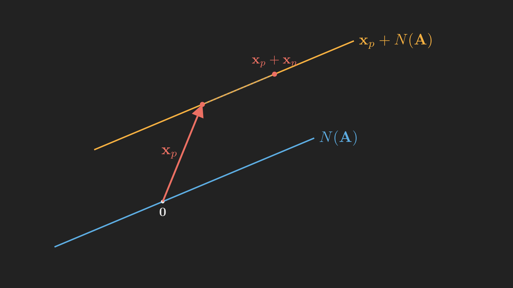

# Introduction

In [Part 3](../vector-spaces-column-space-and-nullspace/index.qmd) we made the leap from equations to spaces and met the two that matter most: the column space $C(\vb{A})$, the set of reachable right-hand sides, and the nullspace $N(\vb{A})$, the set of solutions to $\vb{A}\vb{x} = \vb{0}$. But we found them by *staring*: we happened to notice that one column was the sum of two others and read the nullspace off that observation. For a $50 \times 50$ matrix there is nothing to stare at.

This post fixes that. We already trust elimination from [Part 2](../elimination-inverses-and-lu-factorization/index.qmd); here we push it just a little further and it becomes a complete solver. It will compute the entire nullspace for us, it will produce one particular solution to $\vb{A}\vb{x} = \vb{b}$, and combining those two gives *every* solution. Along the way a single integer, the **rank**, will emerge as the quantity that decides the whole story: whether a solution exists, and whether it is unique. By the end, the vague phrase "the system is solvable" will become a precise, mechanical check.

## Where we are

```{mermaid}
%%| fig-align: center
flowchart LR
    subgraph ACT1["Act I: Solving Ax = b"]
        P1["1. Geometry"] --> P2["2. Elimination & LU"] --> P3["3. Column Space & Nullspace"] --> P4["4. Rank & Complete Solution"]
    end
    subgraph ACT2["Act II: Structure & Orthogonality"]
        P5["5. Basis & Four Subspaces"] --> P6["6. Graphs & Networks"] --> P7["7. Projections"] --> P8["8. Least Squares & QR"] --> P9["9. Determinants"]
    end
    subgraph ACT3["Act III: Eigenvalues & Beyond"]
        P10["10. Eigenvalues"] --> P11["11. Diagonalization & ODEs"] --> P12["12. Markov & Fourier"] --> P13["13. Positive Definite"] --> P14["14. Complex & FFT"] --> P15["15. Jordan Form"] --> P16["16. SVD"] --> P17["17. Transformations"] --> P18["18. Pseudoinverse"]
    end
    ACT1 --> ACT2 --> ACT3

    style P4 fill:#10a37f,color:#fff
```

We are at the last stop in Act I. After this, solving $\vb{A}\vb{x} = \vb{b}$ holds no more mysteries, and we can move on to the deeper structure of the spaces themselves.

# A system worth solving

Let us work with a matrix that is deliberately not square and deliberately redundant, so that all the interesting behavior shows up:

$$
\vb{A} =
\begin{bmatrix}
  1 & 2 & 2 & 2 \\
  2 & 4 & 6 & 8 \\
  3 & 6 & 8 & 10
\end{bmatrix}.
$$

This is $3$ equations in $4$ unknowns. With more unknowns than equations, we should expect room to maneuver, that is, many solutions rather than one. Let us first understand the homogeneous problem $\vb{A}\vb{x} = \vb{0}$, because its solutions are the key to everything else.

# Solving Ax = 0: pivots, free variables, and special solutions

We run elimination exactly as before, but now we are not chasing a single answer; we are after the *structure* of all solutions. (Since the right-hand side of $\vb{A}\vb{x} = \vb{0}$ stays zero under every row operation, we do not even need to carry it along.)

Eliminate downward. Subtract $2$ times row $1$ from row $2$, and $3$ times row $1$ from row $3$:

$$
\begin{bmatrix}
  1 & 2 & 2 & 2 \\
  2 & 4 & 6 & 8 \\
  3 & 6 & 8 & 10
\end{bmatrix}
\longrightarrow
\begin{bmatrix}
  1 & 2 & 2 & 2 \\
  0 & 0 & 2 & 4 \\
  0 & 0 & 2 & 4
\end{bmatrix}.
$$

The first pivot is the $1$ in the top-left corner. Now look at the second column for the next pivot: the entry below the first pivot is $0$, and so is everything beneath it in that column. There is no pivot available in column $2$. So we move right to column $3$, where we find a usable $2$; that is our second pivot. Finish by subtracting row $2$ from row $3$:

$$
\longrightarrow
\underbrace{\begin{bmatrix}
  \boxed{1} & 2 & 2 & 2 \\
  0 & 0 & \boxed{2} & 4 \\
  0 & 0 & 0 & 0
\end{bmatrix}}_{\vb{U}}.
$$

This staircase-shaped matrix is the **echelon form** $\vb{U}$. Two things deserve names.

The **pivot columns** are the columns that ended up containing a pivot, here columns $1$ and $3$. The other columns, $2$ and $4$, are the **free columns**. The number of pivots is the single most important number attached to a matrix: it is the **rank**, written $r$. Our matrix has rank $r = 2$.

Correspondingly, the unknowns split in two. The unknowns sitting in pivot columns ($x_1$ and $x_3$) are the **pivot variables**; the ones in free columns ($x_2$ and $x_4$) are the **free variables**. The name is the whole idea: we are *free* to assign the free variables any values we like, and then the pivot variables are forced. With $n = 4$ unknowns and $r = 2$ pivots, there are $n - r = 2$ free variables, which is exactly the amount of freedom in the solution.

How do we turn that freedom into actual solution vectors? We build one **special solution** per free variable, using the simplest possible choices. For each free variable in turn, set that one free variable to $1$, set the other free variables to $0$, and solve for the pivot variables. The echelon equations $\vb{U}\vb{x} = \vb{0}$ read

$$
\begin{align*}
  x_1 + 2x_2 + 2x_3 + 2x_4 &= 0,\\
  2x_3 + 4x_4 &= 0.
\end{align*}
$$

**Free variable $x_2$ active** ($x_2 = 1$, $x_4 = 0$): the second equation gives $x_3 = 0$, and the first gives $x_1 = -2$. That is the special solution $\vb{s}_1 = \left(-2, 1, 0, 0\right)$.

**Free variable $x_4$ active** ($x_2 = 0$, $x_4 = 1$): the second equation gives $x_3 = -2$, and the first gives $x_1 = -2(-2) - 2 = 2$. That is $\vb{s}_2 = \left(2, 0, -2, 1\right)$.

Every solution of $\vb{A}\vb{x} = \vb{0}$ is a combination of these two:

$$
N(\vb{A}) = \left\{\, c_1 \vb{s}_1 + c_2 \vb{s}_2 \;:\; c_1, c_2 \in \mathbb{R} \,\right\}.
$$

The nullspace is two-dimensional, a plane through the origin sitting inside $\mathbb{R}^4$, and we produced a basis for it mechanically, no staring required. Notice the headline fact, true for every matrix:

$$
\dim N(\vb{A}) = n - r.
$$

## Reduced row echelon form: the tidiest version

We can polish $\vb{U}$ one step further. Divide each pivot row by its pivot to make every pivot equal to $1$, then use each pivot to clear the entries *above* it as well as below. The result is the **reduced row echelon form** $\vb{R}$ (what software calls `rref`). For our matrix:

$$
\vb{U} =
\begin{bmatrix} 1 & 2 & 2 & 2 \\ 0 & 0 & 2 & 4 \\ 0 & 0 & 0 & 0 \end{bmatrix}
\longrightarrow
\vb{R} =
\begin{bmatrix} 1 & 2 & 0 & -2 \\ 0 & 0 & 1 & 2 \\ 0 & 0 & 0 & 0 \end{bmatrix}.
$$

The beauty of $\vb{R}$ is that the special solutions can be read straight off it: the numbers in the free columns (here the $2$ and the $-2$ in column $2$, and the $-2$ and $2$ in column $4$, after a sign flip) are precisely the pivot-variable entries of the special solutions. The reduced form is elimination's final, cleanest statement of the same information.

We now understand $\vb{A}\vb{x} = \vb{0}$ completely. The natural next question, the one we have been building toward since Part 1, is what happens when the right-hand side is not zero.

# Solving Ax = b: the complete solution

Return to the full problem $\vb{A}\vb{x} = \vb{b}$ for a genuine right-hand side. We will use

$$
\vb{b} = \begin{bmatrix} 1 \\ 6 \\ 7 \end{bmatrix},
$$

and this time we carry $\vb{b}$ along as an extra column. Running the same elimination on $\left[\vb{A} \mid \vb{b}\right]$ turns the right-hand side into

$$
\left[\begin{array}{cccc|c}
  1 & 2 & 2 & 2 & 1 \\
  2 & 4 & 6 & 8 & 6 \\
  3 & 6 & 8 & 10 & 7
\end{array}\right]
\longrightarrow
\left[\begin{array}{cccc|c}
  1 & 2 & 0 & -2 & -3 \\
  0 & 0 & 1 & 2 & 2 \\
  0 & 0 & 0 & 0 & 0
\end{array}\right].
$$

Look at the last row. On the left it is all zeros, and on the right it is also zero. That is the system telling us it is *consistent*: the equation "$0 = 0$" is harmless. (Had the right-hand side of that row come out nonzero, we would have had "$0 = \text{something nonzero}$", a contradiction, and there would be no solution at all. This is the solvability condition $\vb{b} \in C(\vb{A})$ from Part 3, now appearing automatically as a zero row.)

**A particular solution.** The fastest way to one solution is to set all the free variables to zero. With $x_2 = x_4 = 0$, the reduced equations are $x_1 = -3$ and $x_3 = 2$, giving

$$
\vb{x}_p = \left(-3, 0, 2, 0\right).
$$

You can check directly that $\vb{A}\vb{x}_p = \left(1, 6, 7\right) = \vb{b}$.

**The complete solution.** Here is the key move. If $\vb{x}_p$ solves $\vb{A}\vb{x} = \vb{b}$ and $\vb{x}_n$ is *any* vector in the nullspace, then

$$
\vb{A}\left(\vb{x}_p + \vb{x}_n\right) = \vb{A}\vb{x}_p + \vb{A}\vb{x}_n = \vb{b} + \vb{0} = \vb{b},
$$

so $\vb{x}_p + \vb{x}_n$ is a solution too. And every solution arises this way (if $\vb{x}$ and $\vb{x}_p$ both solve the system, their difference solves the homogeneous one, so it lives in the nullspace). The complete solution is therefore one particular solution plus the entire nullspace:

$$
\vb{x} = \vb{x}_p + \vb{x}_n
= \begin{bmatrix} -3 \\ 0 \\ 2 \\ 0 \end{bmatrix}
+ c_1 \begin{bmatrix} -2 \\ 1 \\ 0 \\ 0 \end{bmatrix}
+ c_2 \begin{bmatrix} 2 \\ 0 \\ -2 \\ 1 \end{bmatrix},
\qquad c_1, c_2 \in \mathbb{R}.
$$

@fig-complete_solution shows what this looks like geometrically (drawn with a one-dimensional nullspace, so it fits on the page). The nullspace is a flat space through the origin. The solution set is that same flat space, *shifted* so that it passes through $\vb{x}_p$ instead of through the origin. It is parallel to the nullspace but lifted off it. A shifted subspace like this is called an *affine* space; the crucial point is that the solution set of $\vb{A}\vb{x} = \vb{b}$ is almost never a subspace itself (it usually misses the origin), but it is always a parallel copy of one.

{#fig-complete_solution fig-align="center" width=80%}

The whole procedure, from a matrix to its complete solution, is summarized in @fig-solver_flow.

```{mermaid}
%%| fig-align: center
%%| label: fig-solver_flow
%%| fig-cap: "The complete-solution recipe: elimination splits the unknowns into pivot and free variables, special solutions build the nullspace, a particular solution handles the right-hand side, and the two combine."
flowchart TB
    A["Eliminate [A | b] to reduced row echelon form"] --> B["Identify pivot columns and free columns"]
    B --> C["Set all free variables to 0,<br/>solve for a particular solution xp"]
    B --> D["Set one free variable to 1, the rest to 0,<br/>solve: one special solution each"]
    D --> E["Special solutions span the nullspace"]
    C --> F["Complete solution:<br/>xp plus any nullspace vector"]
    E --> F
```

# Rank decides everything

Step back and notice that nothing above depended on the particular numbers; it depended only on the rank $r$ compared with the number of rows $m$ and columns $n$. The rank is the master variable. There are four cases, laid out in @tbl-rank_cases, and they cover every possible matrix. (To keep the reduced forms tidy, the table assumes the pivot columns come first; in general they can be interspersed, but the counts are the same. Here $\vb{I}$ is an identity block and $\vb{F}$ collects the free-column entries.)

::: {.tbl tbl-colwidths="auto"}
| Case | When | Reduced form $\vb{R}$ | Solutions to $\vb{A}\vb{x} = \vb{b}$ |
|:---|:---:|:---:|:---|
| Full rank, square | $r = m = n$ | $\vb{R} = \vb{I}$ | exactly one, for every $\vb{b}$ |
| Full column rank | $r = n < m$ | $\vb{R} = \left[\begin{smallmatrix} \vb{I} \\ \vb{0} \end{smallmatrix}\right]$ | zero or one |
| Full row rank | $r = m < n$ | $\vb{R} = \left[\begin{smallmatrix} \vb{I} & \vb{F} \end{smallmatrix}\right]$ | infinitely many, for every $\vb{b}$ |
| General | $r < m,\ r < n$ | $\vb{R} = \left[\begin{smallmatrix} \vb{I} & \vb{F} \\ \vb{0} & \vb{0} \end{smallmatrix}\right]$ | zero or infinitely many |

: How rank governs the number of solutions. {#tbl-rank_cases style="width:90%; margin:auto;"}
:::

Two of these cases are worth a sentence each, because they capture the intuition. **Full column rank** ($r = n$) means no free variables, so the nullspace is just $\left\{\vb{0}\right\}$ and there is *at most one* solution; this is the situation we will want in Part 8 when we fit a line to data and need the answer to be unique. **Full row rank** ($r = m$) means no zero rows ever appear, so the system is solvable for *every* $\vb{b}$. Our worked example was the general case ($r = 2 < m = 3$ and $r = 2 < n = 4$): it had free variables and a zero row, so for a consistent $\vb{b}$ it had infinitely many solutions, exactly as the bottom row of the table predicts.

# Where we are, and where we go next

Act I is essentially complete. We can now take any system $\vb{A}\vb{x} = \vb{b}$ and, by elimination alone, produce its entire solution set:

- Elimination sorts the unknowns into **pivot variables** and **free variables**, and the number of pivots is the **rank** $r$.
- The **special solutions**, one per free variable, form a basis for the nullspace, whose dimension is $n - r$.
- The **complete solution** is a single particular solution plus the whole nullspace, a flat space shifted off the origin.
- The **rank**, compared against $m$ and $n$, decides existence and uniqueness through the four cases of @tbl-rank_cases.

We have leaned hard on words like "dimension", "basis", and "independent" while using them only informally. We said the nullspace has dimension $n - r$ and that the special solutions form a basis for it, but we never pinned down what a basis really is or why every basis of a space has the same size. Those ideas are the foundation the whole subject quietly rests on, and making them precise pays off immediately: it reveals that the rank we have been computing secretly measures *four* spaces at once, not two. That is the four fundamental subspaces, and it is where Part 5 begins, opening Act II.
