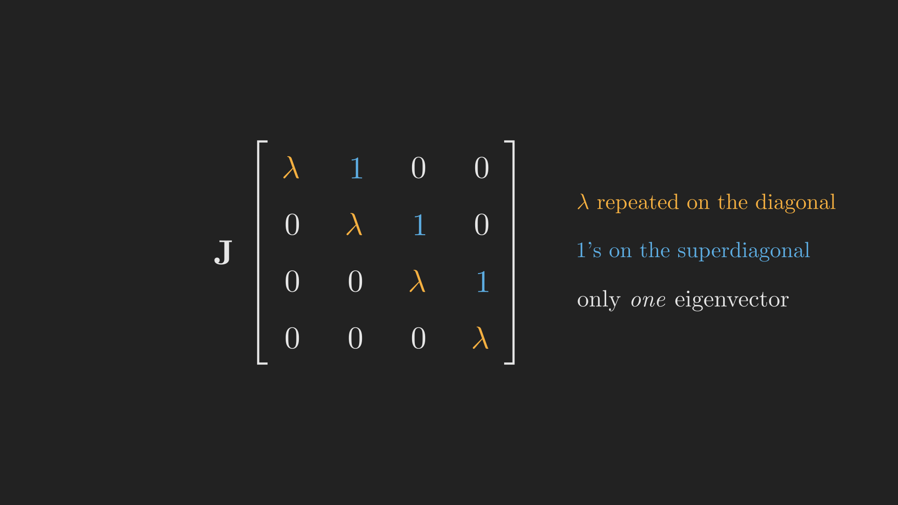

# Introduction

In [Part 14](../complex-matrices-and-the-fft/index.qmd) we saw the cleanest decompositions of all: Hermitian and symmetric matrices fall apart into orthogonal eigenvectors with no friction whatsoever. But way back in [Part 11](../diagonalization-powers-and-differential-equations/index.qmd) we flagged an awkward truth and then walked past it. Diagonalization, $\vb{A} = \vb{S}\boldsymbol{\Lambda}\vb{S}^{-1}$, needs the eigenvectors of $\vb{A}$ to fill up the whole space. Most matrices oblige. But some, the ones with a repeated eigenvalue that is short on eigenvectors, simply do not have enough, and for them diagonalization is impossible.

This post faces those matrices honestly. To do that we first need a bigger idea than diagonalization: the notion of **similar** matrices, two matrices that, despite looking different, represent the same underlying transformation seen in different coordinate systems. Similar matrices share their most important fingerprint, their eigenvalues. Diagonalization, it turns out, is just the lucky case where a matrix is similar to a diagonal one. And when that luck runs out, the best we can do is the **Jordan form**: as close to diagonal as the matrix will allow, with a precise accounting of exactly how far short it falls.

## Where we are

```{mermaid}
%%| fig-align: center
flowchart LR
    subgraph ACT1["Act I: Solving Ax = b"]
        P1["1. Geometry"] --> P2["2. Elimination & LU"] --> P3["3. Column Space & Nullspace"] --> P4["4. Rank & Complete Solution"]
    end
    subgraph ACT2["Act II: Structure & Orthogonality"]
        P5["5. Basis & Four Subspaces"] --> P6["6. Graphs & Networks"] --> P7["7. Projections"] --> P8["8. Least Squares & QR"] --> P9["9. Determinants"]
    end
    subgraph ACT3["Act III: Eigenvalues & Beyond"]
        P10["10. Eigenvalues"] --> P11["11. Diagonalization & ODEs"] --> P12["12. Markov & Fourier"] --> P13["13. Positive Definite"] --> P14["14. Complex & FFT"] --> P15["15. Jordan Form"] --> P16["16. SVD"] --> P17["17. Transformations"] --> P18["18. Pseudoinverse"]
    end
    ACT1 --> ACT2 --> ACT3

    style P15 fill:#10a37f,color:#fff
```

# Similar matrices: the same transformation in different clothes

Two square matrices $\vb{A}$ and $\vb{B}$ are called **similar** when they are related by

$$
\vb{B} = \vb{M}^{-1}\vb{A}\vb{M}
$$

for some invertible matrix $\vb{M}$. The right way to read this is not as a formula but as a change of viewpoint: $\vb{A}$ and $\vb{B}$ are the same linear transformation described in two different bases, and $\vb{M}$ is the dictionary translating between those bases. (We will make that "change of basis" reading fully precise in Part 17; for now the formula is enough.)

The single most important fact about similar matrices is that **they share the same eigenvalues**. Here is the one-line reason. If $\vb{A}\vb{x} = \lambda\vb{x}$, then setting $\vb{y} = \vb{M}^{-1}\vb{x}$,

$$
\vb{B}\vb{y} = \vb{M}^{-1}\vb{A}\vb{M}\vb{M}^{-1}\vb{x} = \vb{M}^{-1}\vb{A}\vb{x} = \vb{M}^{-1}\left(\lambda\vb{x}\right) = \lambda\,\vb{M}^{-1}\vb{x} = \lambda\vb{y}.
$$

So $\lambda$ is an eigenvalue of $\vb{B}$ too, with the eigenvector simply translated by $\vb{M}^{-1}$. The eigenvalues survive the change of coordinates untouched; only the eigenvectors get relabeled. (The trace and determinant, being the sum and product of the eigenvalues, are therefore shared as well.)

Let us see it concretely. Take the symmetric matrix from Part 13,

$$
\vb{A} = \begin{bmatrix} 2 & 1 \\ 1 & 2 \end{bmatrix},
$$

with eigenvalues $3$ and $1$. Pick any invertible $\vb{M}$, say $\vb{M} = \left[\begin{smallmatrix} 1 & 0 \\ 1 & 1 \end{smallmatrix}\right]$, and compute $\vb{B} = \vb{M}^{-1}\vb{A}\vb{M}$:

$$
\vb{B} = \begin{bmatrix} 1 & 0 \\ -1 & 1 \end{bmatrix}
\begin{bmatrix} 2 & 1 \\ 1 & 2 \end{bmatrix}
\begin{bmatrix} 1 & 0 \\ 1 & 1 \end{bmatrix}
= \begin{bmatrix} 3 & 1 \\ 0 & 1 \end{bmatrix}.
$$

This $\vb{B}$ looks nothing like $\vb{A}$: it is not symmetric, and its off-diagonal pattern is different. Yet its eigenvalues are still $3$ and $1$ (read them off the diagonal of a triangular matrix), its trace is still $4$, and its determinant is still $3$. The whole family of matrices reachable from $\vb{A}$ by every possible $\vb{M}$ is a "similarity class", and every member carries the same eigenvalues like a passport.

# Diagonalization is just the best-looking member of the family

Seen this way, diagonalization is nothing exotic. When a matrix $\vb{A}$ has a full set of independent eigenvectors, we collect them into the matrix $\vb{S}$ and the formula

$$
\vb{S}^{-1}\vb{A}\vb{S} = \boldsymbol{\Lambda}
$$

says exactly that $\vb{A}$ is **similar to the diagonal matrix $\boldsymbol{\Lambda}$** of its eigenvalues, with $\vb{M} = \vb{S}$. The diagonal matrix is the cleanest, most revealing member of the similarity class, the representative in which the transformation is just "stretch along each axis". Diagonalizing a matrix means finding the basis (the eigenvectors) in which it looks that simple.

So the question "can $\vb{A}$ be diagonalized?" becomes "is $\vb{A}$ similar to a diagonal matrix?" And the answer is yes exactly when $\vb{A}$ has enough independent eigenvectors to fill the space. The interesting matrices are the ones where it does not.

# When diagonalization fails

Repeated eigenvalues are where the trouble can start, but a repeat alone is not the problem. Compare two matrices that both have the eigenvalue $4$ twice.

The first is $4\vb{I} = \left[\begin{smallmatrix} 4 & 0 \\ 0 & 4 \end{smallmatrix}\right]$. It is already diagonal, and it has two independent eigenvectors (every vector is an eigenvector). It is perfectly diagonalizable. In fact it is similar only to *itself*: for any invertible $\vb{M}$, $\vb{M}^{-1}\left(4\vb{I}\right)\vb{M} = 4\,\vb{M}^{-1}\vb{M} = 4\vb{I}$. Its similarity class has exactly one member.

The second is

$$
\vb{J} = \begin{bmatrix} 4 & 1 \\ 0 & 4 \end{bmatrix}.
$$

It also has the eigenvalue $4$ twice (the diagonal of a triangular matrix), but now look for its eigenvectors. Solving $\left(\vb{J} - 4\vb{I}\right)\vb{x} = \vb{0}$ means

$$
\begin{bmatrix} 0 & 1 \\ 0 & 0 \end{bmatrix}\vb{x} = \vb{0},
$$

which forces the second component of $\vb{x}$ to be zero and leaves the first free. Every eigenvector is a multiple of $\left(1, 0\right)$: there is only **one** independent eigenvector, not two. With a missing eigenvector, $\vb{J}$ cannot be diagonalized. And because $4\vb{I}$ is similar only to itself, $\vb{J}$ is certainly not similar to $4\vb{I}$, even though they share both eigenvalues. Eigenvalues alone do not determine a similarity class; the number of eigenvectors matters too.

# The Jordan form: as close to diagonal as possible

If a matrix cannot be diagonalized, what is the best we can do? The answer is the **Jordan form**, which says every square matrix is similar to a nearly diagonal matrix built from blocks. The basic building block is the **Jordan block**: a square piece with a single eigenvalue $\lambda$ repeated down the diagonal and $1$'s on the superdiagonal just above it, zeros everywhere else. @fig-jordan_block shows a $4 \times 4$ block.

{#fig-jordan_block fig-align="center" width=55%}

The defining feature of a Jordan block is that, no matter its size, it has exactly **one** eigenvector. The $1$'s on the superdiagonal are precisely the obstruction to diagonalization: they are what is left over when there are not enough eigenvectors to go around. Our matrix $\vb{J} = \left[\begin{smallmatrix} 4 & 1 \\ 0 & 4 \end{smallmatrix}\right]$ is a single $2 \times 2$ Jordan block.

The general **Jordan form theorem** says: every square matrix is similar to a block-diagonal matrix whose blocks are Jordan blocks. Stacking Jordan blocks $\vb{J}_1, \vb{J}_2, \dots$ along the diagonal gives the Jordan matrix

$$
\vb{J} =
\begin{bmatrix}
  \vb{J}_1 & & \\
  & \vb{J}_2 & \\
  & & \ddots
\end{bmatrix},
$$

and $\vb{A} = \vb{M}\vb{J}\vb{M}^{-1}$ for some invertible $\vb{M}$. A diagonalizable matrix is just the special case where every block has size $1$ (no superdiagonal $1$'s at all), recovering $\boldsymbol{\Lambda}$.

The crucial bookkeeping rule is this:

$$
\text{number of Jordan blocks} = \text{number of independent eigenvectors}.
$$

Each block donates exactly one eigenvector, so counting blocks counts eigenvectors. A matrix is diagonalizable precisely when it has as many blocks as its size, that is, when every block is $1 \times 1$.

# Block structure is the real fingerprint

The Jordan form refines our understanding of when two matrices are similar. Eigenvalues are necessary but not sufficient; what truly pins down a similarity class is the full pattern of Jordan blocks, their eigenvalues *and* their sizes. @tbl-jordan_structures makes this concrete with three matrices that all have the eigenvalue $0$ four times (so identical eigenvalues, identical trace, identical determinant) yet are pairwise non-similar because their block structures differ.

::: {.tbl tbl-colwidths="auto"}
| Block sizes for eigenvalue $0$ | Number of blocks | Independent eigenvectors | Diagonalizable? |
|:---:|:---:|:---:|:---:|
| $1, 1, 1, 1$ | $4$ | $4$ | yes (it is the zero matrix) |
| $2, 1, 1$ | $3$ | $3$ | no |
| $2, 2$ | $2$ | $2$ | no |
| $3, 1$ | $2$ | $2$ | no |
| $4$ | $1$ | $1$ | no |

: Five different $4 \times 4$ matrices, all with eigenvalue $0$ repeated four times, distinguished only by their Jordan block structure. Same eigenvalues, different similarity classes. {#tbl-jordan_structures style="width:85%; margin:auto;"}
:::

Two of these rows, $2, 2$ and $3, 1$, even have the same number of blocks (two eigenvectors each) yet are still not similar, because the block *sizes* differ. The Jordan structure is the complete fingerprint of a similarity class.

::: {.callout-note}
## A practical warning

Beautiful as it is, the Jordan form is numerically treacherous. Whether an eigenvalue is "really" repeated, and whether a tiny off-diagonal entry is "really" a $1$ or just rounding noise, are questions that floating-point arithmetic cannot answer reliably. A microscopic perturbation can collapse a Jordan block into separate eigenvalues. For this reason the Jordan form is a prized theoretical tool but is almost never computed in practice. The decomposition that *is* computed, because it exists for every matrix and is perfectly stable, is the one waiting in the next post.
:::

# Where we are, and where we go next

Let us take stock. We have organized all square matrices by the company they keep:

- Matrices are **similar** ($\vb{B} = \vb{M}^{-1}\vb{A}\vb{M}$) when they represent one transformation in different bases; similar matrices share eigenvalues, trace, and determinant.
- **Diagonalization** is the special case of being similar to a diagonal matrix, possible exactly when there are enough independent eigenvectors.
- When eigenvectors are missing, the **Jordan form** is the closest substitute: a block-diagonal matrix of Jordan blocks, one eigenvector per block, with the block structure serving as the true fingerprint of a similarity class.

The Jordan form is the end of the road for eigenvalue-based decompositions, and it leaves us in an uncomfortable place: it only applies to square matrices, and even then it is fragile. We have spent this whole act assuming square matrices and chasing eigenvectors. What about rectangular matrices, which have no eigenvalues at all? Is there a single decomposition that works for *every* matrix, square or rectangular, full rank or deficient, and is numerically rock-solid? There is, and it may be the most important factorization in all of applied linear algebra: the **Singular Value Decomposition**. That is Part 16, and it is where the whole story has been heading.
