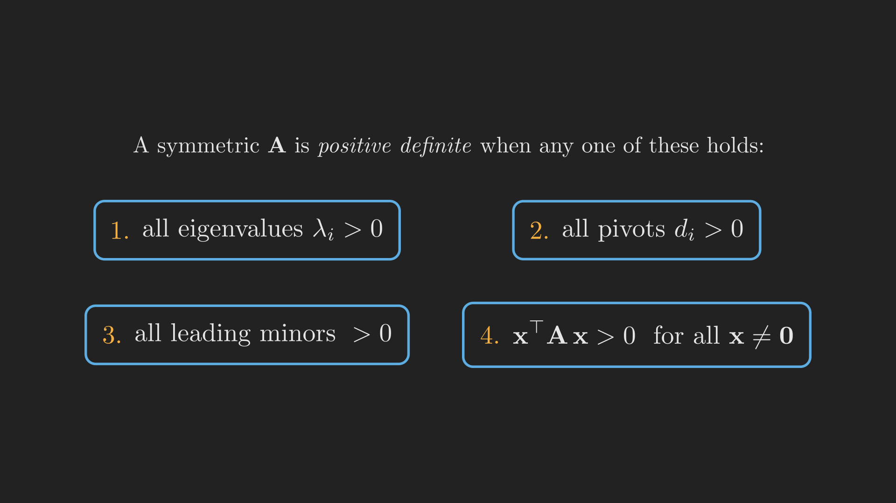
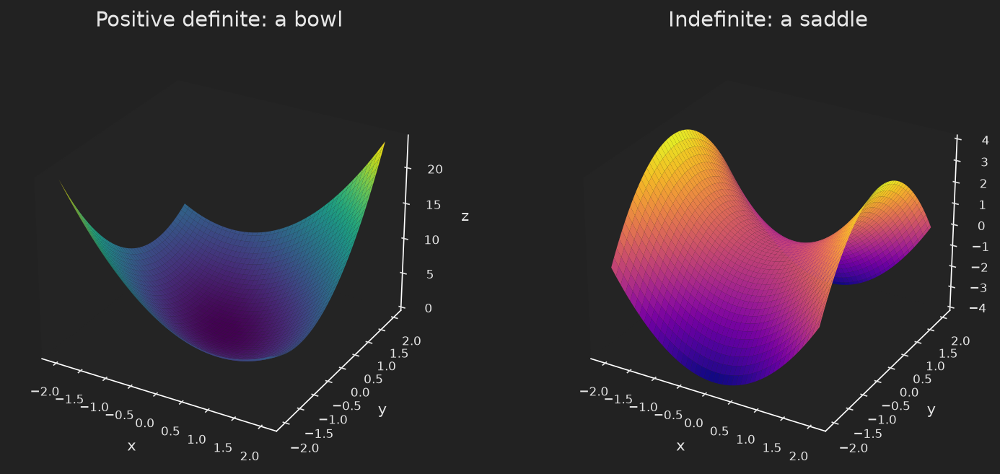

# Introduction

In [Part 12](../markov-matrices-and-fourier-series/index.qmd) we saw eigenvalues forecast the long-run behavior of a system, and we leaned on orthonormal bases to expand a vector cleanly into independent pieces. Both threads, eigenvalues and orthogonality, now come together in the most important family of matrices in all of applied mathematics: the **symmetric** matrices, the ones that satisfy $\vb{A} = \vb{A}^{\intercal}$.

Why should a single symmetry condition matter so much? Because it forces two things to be true at once, things that for a general matrix come only with luck: the eigenvalues are all **real**, and the eigenvectors can be chosen **orthogonal**. That is the cleanest possible structure a matrix can have. And inside the symmetric family lives an even more special class, the **positive definite** matrices, whose eigenvalues are not merely real but strictly positive. These are the matrices that show up whenever we minimize something: a positive definite matrix is the multivariable version of a positive second derivative, the signature of a function curving up into a bowl with a single lowest point. That is exactly why they are the heartbeat of optimization, statistics, and the least squares we met in [Part 8](../least-squares-and-gram-schmidt/index.qmd).

This post does three things. It states and explains the spectral theorem for symmetric matrices. It gives four equivalent tests for positive definiteness and shows why they agree. And it ties the algebra to a picture you can see: the difference between a bowl and a saddle.

## Where we are

```{mermaid}
%%| fig-align: center
flowchart LR
    subgraph ACT1["Act I: Solving Ax = b"]
        P1["1. Geometry"] --> P2["2. Elimination & LU"] --> P3["3. Column Space & Nullspace"] --> P4["4. Rank & Complete Solution"]
    end
    subgraph ACT2["Act II: Structure & Orthogonality"]
        P5["5. Basis & Four Subspaces"] --> P6["6. Graphs & Networks"] --> P7["7. Projections"] --> P8["8. Least Squares & QR"] --> P9["9. Determinants"]
    end
    subgraph ACT3["Act III: Eigenvalues & Beyond"]
        P10["10. Eigenvalues"] --> P11["11. Diagonalization & ODEs"] --> P12["12. Markov & Fourier"] --> P13["13. Positive Definite"] --> P14["14. Complex & FFT"] --> P15["15. Jordan Form"] --> P16["16. SVD"] --> P17["17. Transformations"] --> P18["18. Pseudoinverse"]
    end
    ACT1 --> ACT2 --> ACT3

    style P13 fill:#10a37f,color:#fff
```

# The spectral theorem: symmetry buys you everything

For a general matrix, [Part 11](../diagonalization-powers-and-differential-equations/index.qmd) gave us diagonalization $\vb{A} = \vb{S}\boldsymbol{\Lambda}\vb{S}^{-1}$, where the columns of $\vb{S}$ are eigenvectors. But the eigenvalues could be complex, the eigenvectors could be skewed at awkward angles, and $\vb{S}$ could be hard to invert. Symmetry sweeps all of that away.

::: {.callout-note}
## The spectral theorem

If $\vb{A}$ is real and symmetric ($\vb{A} = \vb{A}^{\intercal}$), then its eigenvalues are all real, and its eigenvectors can be chosen to be orthonormal. Consequently $\vb{A}$ can be written as

$$
\vb{A} = \vb{Q}\boldsymbol{\Lambda}\vb{Q}^{\intercal},
$$

where $\boldsymbol{\Lambda}$ is the diagonal matrix of (real) eigenvalues and $\vb{Q}$ is an **orthogonal** matrix ($\vb{Q}^{\intercal}\vb{Q} = \vb{I}$) whose columns are the orthonormal eigenvectors.
:::

Notice how much nicer $\vb{Q}\boldsymbol{\Lambda}\vb{Q}^{\intercal}$ is than $\vb{S}\boldsymbol{\Lambda}\vb{S}^{-1}$. Because $\vb{Q}$ is orthogonal, its inverse is just its transpose (we saw this for orthogonal matrices in Part 8), so the awkward $\vb{S}^{-1}$ becomes a free transpose $\vb{Q}^{\intercal}$. This factorization is so central it has several names: the spectral decomposition, or the principal axis theorem.

Let us see it on a small example. Take the symmetric matrix

$$
\vb{A} = \begin{bmatrix} 2 & 1 \\ 1 & 2 \end{bmatrix}.
$$

Its eigenvalues come from the trace and determinant (a shortcut from Part 10): the trace is $4$ and the determinant is $3$, so the eigenvalues satisfy $\lambda^2 - 4\lambda + 3 = 0$, giving $\lambda_1 = 3$ and $\lambda_2 = 1$. Both real, as promised. The eigenvectors are $\vb{q}_1 = \tfrac{1}{\sqrt{2}}\left(1, 1\right)$ for $\lambda_1 = 3$ and $\vb{q}_2 = \tfrac{1}{\sqrt{2}}\left(1, -1\right)$ for $\lambda_2 = 1$. Compute their dot product: $\tfrac{1}{2}\left(1 \cdot 1 + 1 \cdot \left(-1\right)\right) = 0$. They are perpendicular, exactly as the theorem guarantees, even though we never arranged for it.

There is a quick way to feel *why* the eigenvectors must be orthogonal. Take two eigenvectors $\vb{x}$ and $\vb{y}$ with different eigenvalues $\lambda \neq \mu$. Then, using $\vb{A} = \vb{A}^{\intercal}$,

$$
\lambda\, \vb{x}^{\intercal}\vb{y} = \left(\vb{A}\vb{x}\right)^{\intercal}\vb{y} = \vb{x}^{\intercal}\vb{A}^{\intercal}\vb{y} = \vb{x}^{\intercal}\vb{A}\vb{y} = \mu\, \vb{x}^{\intercal}\vb{y}.
$$

So $\left(\lambda - \mu\right)\vb{x}^{\intercal}\vb{y} = 0$, and since $\lambda \neq \mu$, we must have $\vb{x}^{\intercal}\vb{y} = 0$. The symmetry of $\vb{A}$ is the only thing that made the middle step work.

# Positive definiteness: when the energy is always positive

The spectral theorem tells us symmetric matrices have real eigenvalues. The positive definite matrices are the symmetric matrices whose eigenvalues are all strictly positive. That sounds like a narrow technical condition, but it has a beautiful physical reading in terms of **energy**.

For any symmetric matrix $\vb{A}$ and any vector $\vb{x}$, the number

$$
\vb{x}^{\intercal}\vb{A}\vb{x}
$$

is a single scalar called the **quadratic form**. (For $\vb{A} = \left[\begin{smallmatrix} a & b \\ b & c \end{smallmatrix}\right]$ and $\vb{x} = \left(x, y\right)$, it works out to $a x^2 + 2b xy + c y^2$.) We call $\vb{A}$ **positive definite** when this quadratic form is strictly positive for every nonzero $\vb{x}$:

$$
\vb{x}^{\intercal}\vb{A}\vb{x} > 0 \quad \text{for all } \vb{x} \neq \vb{0}.
$$

The remarkable fact is that this energy condition is the same as the eigenvalue condition, and the same as two other tests we can check by hand without ever finding an eigenvalue. They are all equivalent, summarized in @fig-pd_tests.

{#fig-pd_tests fig-align="center" width=95%}

Let us see all four agree on a concrete case. Consider the family

$$
\vb{A}_c = \begin{bmatrix} 2 & 6 \\ 6 & c \end{bmatrix},
$$

and watch what happens as we tune $c$.

**Take $c = 20$.** The leading minors (the determinants of the top-left $1 \times 1$ and $2 \times 2$ blocks) are $2$ and $2 \cdot 20 - 6 \cdot 6 = 4$, both positive. The pivots from elimination are $2$ and $20 - \tfrac{6 \cdot 6}{2} = 2$, both positive. The eigenvalues (trace $22$, determinant $4$) are about $0.18$ and $21.8$, both positive. And the energy, as we will see by completing the square, is always positive. All four tests say the same thing: $\vb{A}_{20}$ is positive definite.

**Take $c = 18$.** Now the determinant is $2 \cdot 18 - 36 = 0$. The matrix is singular: one eigenvalue has dropped to $0$ (the eigenvalues are $0$ and $20$), the second pivot has dropped to $0$, and the energy $\vb{x}^{\intercal}\vb{A}\vb{x}$ can now equal zero for a nonzero $\vb{x}$. This is the boundary case, called **positive semidefinite**: the energy is never negative, but it can be zero. Push $c$ below $18$ and the matrix becomes indefinite, with one positive and one negative eigenvalue.

Notice the pattern across all four tests: they switch from "positive" to "zero" to "negative" together. That is not a coincidence. For a symmetric matrix the *signs* of the pivots always match the *signs* of the eigenvalues (a fact called Sylvester's law of inertia), which is why the cheap test (pivots, no eigenvalue computation needed) is as trustworthy as the expensive one.

# Completing the square: where the pivots come from

The link between the pivots and the energy is not magic; it is the algebraic act of completing the square, the same trick from high school, now done with a matrix. Take $\vb{A}_{20}$ and write out its energy:

$$
\vb{x}^{\intercal}\vb{A}_{20}\vb{x} = 2x^2 + 12xy + 20y^2.
$$

Group the $x$ terms and complete the square:

$$
2x^2 + 12xy + 20y^2 = 2\left(x + 3y\right)^2 + 2y^2.
$$

(Expand $2\left(x+3y\right)^2 = 2x^2 + 12xy + 18y^2$ and add $2y^2$ to recover the original.) Look at the two numbers sitting outside the squares: they are $2$ and $2$, exactly the **pivots** of $\vb{A}_{20}$. The energy is a sum of squares with the pivots as coefficients. If both pivots are positive, the energy is a sum of positive things and can only be zero when both squared terms vanish, that is, when $\vb{x} = \vb{0}$. That is positive definiteness, made visible.

Run the same computation for $c = 18$ and the second coefficient collapses: $2x^2 + 12xy + 18y^2 = 2\left(x + 3y\right)^2 + 0 \cdot y^2$. The energy is now zero along the whole line $x + 3y = 0$, which is precisely the semidefinite boundary. Completing the square is just elimination in disguise, and the pivots it exposes are the verdict on definiteness.

For a slightly bigger example where the hand tests really earn their keep, the tridiagonal matrix

$$
\vb{A} = \begin{bmatrix} 2 & -1 & 0 \\ -1 & 2 & -1 \\ 0 & -1 & 2 \end{bmatrix}
$$

has leading minors $2$, $3$, $4$ (all positive) and pivots $2$, $\tfrac{3}{2}$, $\tfrac{4}{3}$ (all positive), so it is positive definite, without our ever solving the cubic characteristic equation. (Its eigenvalues happen to be $2 - \sqrt{2}$, $2$, and $2 + \sqrt{2}$, all positive, confirming the verdict.) This matrix, by the way, is not a toy: it is the discrete second-derivative operator, the backbone of countless physics and engineering models.

# The picture: bowls and saddles

Quadratic forms are worth seeing, not just computing. Plot $z = \vb{x}^{\intercal}\vb{A}\vb{x}$ as a surface over the $\left(x, y\right)$ plane and the definiteness of $\vb{A}$ becomes the *shape* of the surface, shown in @fig-bowl_saddle.

- If $\vb{A}$ is **positive definite**, the surface is a **bowl** opening upward, with its single lowest point at the origin. Every direction you walk from the center goes uphill. This is the multivariable version of "the second derivative is positive, so it is a minimum".
- If $\vb{A}$ is **indefinite** (mixed-sign eigenvalues), the surface is a **saddle**: uphill along some directions, downhill along others. The origin is a critical point but neither a maximum nor a minimum.

{#fig-bowl_saddle fig-align="center" width=100%}

This is the bridge to optimization. When we minimize a smooth function of many variables, the matrix of its second derivatives (the Hessian) plays the role of $\vb{A}$. A critical point is a genuine minimum exactly when that Hessian is positive definite, that is, exactly when the local landscape is a bowl rather than a saddle. The eigenvectors of $\vb{A}$ point along the principal axes of the bowl, and the eigenvalues tell you how steeply it curves in each of those directions.

# Why $\vb{A}^{\intercal}\vb{A}$ is the matrix that keeps appearing

We can finally close a loop left open back in Part 8. The normal equations for least squares were built around the matrix $\vb{A}^{\intercal}\vb{A}$, and we noted in Part 3 that this product is always symmetric. Now we can say more: $\vb{A}^{\intercal}\vb{A}$ is always positive *semidefinite*, and it is positive *definite* exactly when $\vb{A}$ has full column rank.

The reason is a one-line energy computation. For any $\vb{x}$,

$$
\vb{x}^{\intercal}\left(\vb{A}^{\intercal}\vb{A}\right)\vb{x} = \left(\vb{A}\vb{x}\right)^{\intercal}\left(\vb{A}\vb{x}\right) = \lVert \vb{A}\vb{x} \rVert^2 \geq 0.
$$

The energy is a squared length, so it can never be negative. And it is zero only when $\vb{A}\vb{x} = \vb{0}$. If $\vb{A}$ has independent columns, the only solution to $\vb{A}\vb{x} = \vb{0}$ is $\vb{x} = \vb{0}$ (the nullspace is trivial, from Part 4), so the energy is strictly positive for every nonzero $\vb{x}$, and $\vb{A}^{\intercal}\vb{A}$ is positive definite. That positive definiteness is precisely what guarantees the normal equations have a unique solution: the least squares problem is solvable and well-posed exactly when $\vb{A}^{\intercal}\vb{A}$ is the well-behaved, bowl-shaped kind of matrix we have been studying.

# Where we are, and where we go next

Let us take stock. We have isolated the best-behaved matrices in linear algebra and learned to recognize them:

- A **symmetric** matrix has real eigenvalues and orthonormal eigenvectors, captured by the spectral theorem $\vb{A} = \vb{Q}\boldsymbol{\Lambda}\vb{Q}^{\intercal}$.
- A symmetric matrix is **positive definite** when its energy $\vb{x}^{\intercal}\vb{A}\vb{x}$ is always positive, equivalently when all eigenvalues, all pivots, or all leading minors are positive (@fig-pd_tests).
- Completing the square writes the energy as a sum of squares with the pivots as coefficients, and the geometry is a **bowl** (definite) versus a **saddle** (indefinite).
- The recurring matrix $\vb{A}^{\intercal}\vb{A}$ is positive definite exactly when $\vb{A}$ has full column rank, which is what makes least squares work.

So far every matrix we have decomposed has had real entries. But the cleanest way to understand rotations, vibrations, and signals is to allow **complex** numbers, and the moment we do, the transpose $\vb{A}^{\intercal}$ has to be upgraded to the conjugate transpose $\vb{A}^{H}$, "symmetric" becomes "Hermitian", and "orthogonal" becomes "unitary". That small upgrade unlocks one of the most important matrices ever written down, the Fourier matrix, and the algorithm that made the digital world possible, the Fast Fourier Transform. That is Part 14.
