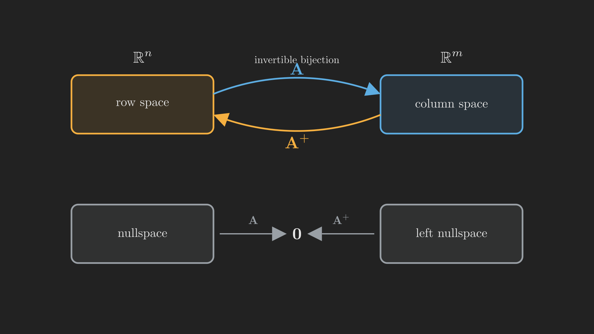

# Introduction

We have arrived at the last stop. Over seventeen posts we built linear algebra from a single question, and along the way the word "inverse" kept appearing with an asterisk. A matrix has a true, two-sided inverse only when it is square and full rank. But the matrices that matter most in practice are rarely so well behaved. Data matrices are tall and thin. Underdetermined systems are short and wide. Rank-deficient matrices crush whole directions to zero. None of these has an inverse in the strict sense, and yet we constantly need to run them backwards, to recover the input that produced an output, or the best approximation when no exact input exists.

This final post builds the tool that inverts the uninvertible. We will start with the two halfway houses, the **left inverse** and the **right inverse**, that work when a matrix is full rank in one direction. Then we will construct the **pseudoinverse** $\vb{A}^{+}$, which exists for absolutely every matrix and is the natural and honest answer to "undo $\vb{A}$ as well as it can be undone." The SVD from [Part 16](../the-singular-value-decomposition/index.qmd) makes it almost effortless. And then, because this is the end, we will climb back to the very first page of the series and see how far we have come.

## Where we are

```{mermaid}
%%| fig-align: center
flowchart LR
    subgraph ACT1["Act I: Solving Ax = b"]
        P1["1. Geometry"] --> P2["2. Elimination & LU"] --> P3["3. Column Space & Nullspace"] --> P4["4. Rank & Complete Solution"]
    end
    subgraph ACT2["Act II: Structure & Orthogonality"]
        P5["5. Basis & Four Subspaces"] --> P6["6. Graphs & Networks"] --> P7["7. Projections"] --> P8["8. Least Squares & QR"] --> P9["9. Determinants"]
    end
    subgraph ACT3["Act III: Eigenvalues & Beyond"]
        P10["10. Eigenvalues"] --> P11["11. Diagonalization & ODEs"] --> P12["12. Markov & Fourier"] --> P13["13. Positive Definite"] --> P14["14. Complex & FFT"] --> P15["15. Jordan Form"] --> P16["16. SVD"] --> P17["17. Transformations"] --> P18["18. Pseudoinverse"]
    end
    ACT1 --> ACT2 --> ACT3

    style P18 fill:#10a37f,color:#fff
```

# Why a true inverse is so demanding

Recall from [Part 4](../rank-and-the-complete-solution/index.qmd) what a two-sided inverse requires. For $\vb{A}^{-1}$ to exist, $\vb{A}\vb{x} = \vb{b}$ must have exactly one solution for every $\vb{b}$: a solution must always exist (the columns reach every target, so the column space is all of the output space), and it must be unique (nothing is crushed, so the nullspace is just $\left\{\vb{0}\right\}$). Both at once means $\vb{A}$ is square and full rank. A nontrivial nullspace destroys uniqueness; a column space smaller than the whole output space destroys existence. Either failing kills the inverse.

But often only one of the two failures happens, and then we can still do something useful. That is where one-sided inverses come in.

# Left and right inverses

Suppose $\vb{A}$ has **full column rank** ($r = n$, more rows than columns, tall and thin). Then its nullspace is just $\left\{\vb{0}\right\}$, so it never crushes anything, but its columns may not reach every target. In this case $\vb{A}^{\intercal}\vb{A}$ is a small invertible $n \times n$ matrix (we met this fact in [Part 13](../symmetric-and-positive-definite-matrices/index.qmd)), and the matrix

$$
\vb{A}^{-1}_{\text{left}} = \left(\vb{A}^{\intercal}\vb{A}\right)^{-1}\vb{A}^{\intercal}
$$

satisfies $\vb{A}^{-1}_{\text{left}}\vb{A} = \vb{I}_n$. It inverts $\vb{A}$ from the left. You have seen this matrix before without the name: it is exactly the least squares operator from [Part 8](../least-squares-and-gram-schmidt/index.qmd). Applied to $\vb{b}$, it returns the $\vb{x}$ that best explains the data.

A small example makes it concrete. For the tall matrix

$$
\vb{A} = \begin{bmatrix} 1 & 0 \\ 0 & 1 \\ 1 & 1 \end{bmatrix}, \qquad
\vb{A}^{\intercal}\vb{A} = \begin{bmatrix} 2 & 1 \\ 1 & 2 \end{bmatrix}, \qquad
\vb{A}^{-1}_{\text{left}} = \frac{1}{3}\begin{bmatrix} 2 & -1 & 1 \\ -1 & 2 & 1 \end{bmatrix},
$$

and you can check that $\vb{A}^{-1}_{\text{left}}\vb{A} = \vb{I}_2$. Note it does *not* work from the other side: $\vb{A}\,\vb{A}^{-1}_{\text{left}}$ is a $3 \times 3$ matrix that cannot be the identity, because $\vb{A}$'s column space is only a plane in $\mathbb{R}^3$. (That product is, in fact, the projection onto the column space, the very projection matrix from [Part 7](../orthogonality-and-projections/index.qmd).)

The mirror-image situation is **full row rank** ($r = m$, short and wide). Now $\vb{A}$ reaches every target but crushes a nullspace, so solutions exist but are not unique. Here $\vb{A}\vb{A}^{\intercal}$ is invertible and the **right inverse**

$$
\vb{A}^{-1}_{\text{right}} = \vb{A}^{\intercal}\left(\vb{A}\vb{A}^{\intercal}\right)^{-1}
$$

satisfies $\vb{A}\,\vb{A}^{-1}_{\text{right}} = \vb{I}_m$. @tbl-inverses collects the four cases, organized by how the rank compares with the dimensions.

::: {.tbl tbl-colwidths="auto"}
| Situation | Rank | Inverse that exists | Identity it gives |
|:---|:---:|:---|:---:|
| Square, full rank | $r = m = n$ | two-sided $\vb{A}^{-1}$ | $\vb{A}^{-1}\vb{A} = \vb{A}\vb{A}^{-1} = \vb{I}$ |
| Tall, full column rank | $r = n < m$ | left $\left(\vb{A}^{\intercal}\vb{A}\right)^{-1}\vb{A}^{\intercal}$ | $\vb{A}^{-1}_{\text{left}}\vb{A} = \vb{I}_n$ |
| Wide, full row rank | $r = m < n$ | right $\vb{A}^{\intercal}\left(\vb{A}\vb{A}^{\intercal}\right)^{-1}$ | $\vb{A}\,\vb{A}^{-1}_{\text{right}} = \vb{I}_m$ |
| General | $r < m,\ r < n$ | pseudoinverse $\vb{A}^{+}$ | $\vb{A}^{+}\vb{A}, \vb{A}\vb{A}^{+}$ are projections |

: Inverses by rank. Each one-sided inverse is a special case of the pseudoinverse. {#tbl-inverses style="width:95%; margin:auto;"}
:::

The bottom row is the general case, where the matrix fails in *both* directions at once: it crushes a nullspace and misses part of the output space. No one-sided inverse exists. For this, and in fact for all the cases above as special instances, we need the pseudoinverse.

# The pseudoinverse, built from the SVD

The right way to think about $\vb{A}$ is the lesson of [Part 16](../the-singular-value-decomposition/index.qmd): as a map from the row space to the column space, it is perfectly invertible. It is a clean, one-to-one correspondence that scales the $i$-th row-space direction $\vb{v}_i$ into the $i$-th column-space direction $\vb{u}_i$ by the singular value $\sigma_i$. The only reason $\vb{A}$ is not invertible is the leftover null spaces hanging off the sides. So the natural "best inverse" should simply *reverse the invertible part and ignore the rest*: send $\vb{u}_i$ back to $\vb{v}_i$, dividing by $\sigma_i$, and send everything in the left nullspace to zero.

The SVD writes this down immediately. If $\vb{A} = \vb{U}\boldsymbol{\Sigma}\vb{V}^{\intercal}$, the **pseudoinverse** is

$$
\vb{A}^{+} = \vb{V}\boldsymbol{\Sigma}^{+}\vb{U}^{\intercal},
$$ {#eq-pinv}

where $\boldsymbol{\Sigma}^{+}$ is built from $\boldsymbol{\Sigma}$ by inverting each nonzero singular value, $\sigma_i \mapsto 1/\sigma_i$, leaving the zeros as zeros, and transposing the shape. That single rule, "invert what you can, leave the rest at zero", is the whole definition. @fig-pseudoinverse shows the geometry: $\vb{A}$ maps the row space onto the column space and kills the nullspace; $\vb{A}^{+}$ maps the column space back onto the row space and kills the left nullspace.

{#fig-pseudoinverse fig-align="center" width=95%}

Because $\vb{A}^{+}$ only ever inverts the row-space-to-column-space correspondence, the two products are not the identity but the *projections* onto those subspaces:

$$
\vb{A}^{+}\vb{A} = \text{projection onto the row space}, \qquad \vb{A}\vb{A}^{+} = \text{projection onto the column space}.
$$

When $\vb{A}$ happens to be full rank, one of these projections becomes the full identity and $\vb{A}^{+}$ collapses to the appropriate one-sided inverse, and if $\vb{A}$ is square and full rank, to $\vb{A}^{-1}$ itself. The pseudoinverse contains all the earlier inverses as special cases.

Let us see it on the rank-one matrix from last time, $\vb{A} = \left[\begin{smallmatrix} 4 & 3 \\ 8 & 6 \end{smallmatrix}\right]$, which had the single singular value $\sigma_1 = \sqrt{125}$, with $\vb{v}_1 = \left(4, 3\right)/5$ and $\vb{u}_1 = \left(1, 2\right)/\sqrt{5}$. Using @eq-pinv with $\boldsymbol{\Sigma}^{+} = \text{diag}\left(1/\sqrt{125}, 0\right)$,

$$
\vb{A}^{+} = \frac{1}{\sigma_1}\vb{v}_1\vb{u}_1^{\intercal} = \frac{1}{25}\begin{bmatrix} 0.8 & 1.6 \\ 0.6 & 1.2 \end{bmatrix}.
$$

The two products come out as honest projections, not identities:

$$
\vb{A}\vb{A}^{+} = \frac{1}{5}\begin{bmatrix} 1 & 2 \\ 2 & 4 \end{bmatrix} \ \text{(onto the column space } \left(1,2\right)\text{)}, \qquad
\vb{A}^{+}\vb{A} = \begin{bmatrix} 0.64 & 0.48 \\ 0.48 & 0.36 \end{bmatrix} \ \text{(onto the row space } \left(4,3\right)\text{)}.
$$

The pseudoinverse cannot resurrect the information $\vb{A}$ destroyed in its nullspace, no inverse could, but it faithfully reverses everything that survived. That is the best any inverse can do, and it is exactly what least squares quietly relied on all along.

# Closing the loop: back to the first page

This is the end of the series, so let us return to where we started. In [Part 1](../../published/the-geometry-of-linear-equations/index.qmd) we set up a tiny puzzle about the price of coffee and muffins and noticed that solving $\vb{A}\vb{x} = \vb{b}$ has two readings: the row picture, where lines cross, and the column picture, where we ask *which combinations of the columns can reach the target $\vb{b}$*. That single question, which targets are reachable, turned out to be the seed of the entire subject. Look how far it grew.

- To decide reachability we needed the **column space**, and to measure non-uniqueness the **nullspace** (Parts 3 to 5). Reachability and uniqueness became questions about four subspaces and one number, the **rank**.
- Solving the system systematically was **elimination**, which we discovered was secretly the factorization $\vb{A} = \vb{L}\vb{U}$ (Part 2).
- When no exact solution existed, we did not give up; we found the closest one by **projection** and **least squares** (Parts 7 to 8), the first time we "inverted" a non-invertible matrix.
- **Eigenvalues** (Parts 10 to 12) revealed how a matrix behaves when applied over and over, taming powers, differential equations, and Markov chains by finding the basis in which the matrix is diagonal.
- That theme, *the right basis makes everything simple*, reached its peak in the **SVD** (Part 16), which works for every matrix, and in the realization that a matrix is really a **linear transformation** wearing the clothes of a chosen basis (Part 17).
- And today the **pseudoinverse** answered the reachability question in full generality: for any $\vb{b}$ at all, $\vb{A}^{+}\vb{b}$ returns the best possible input, reaching $\vb{b}$ exactly when it lies in the column space and giving the closest approach otherwise.

The recurring melody of the whole series was this: a matrix is a map between spaces, and almost every question about it, solvability, uniqueness, stability, approximation, is answered by understanding its four fundamental subspaces and choosing the basis that fits them. The coffee-and-muffin question "can the columns reach $\vb{b}$?" was the first note of that melody, and the pseudoinverse is the last.

If you want to see these tools put to work in machine learning, where least squares, eigenvalues, and the SVD show up constantly, the companion post [Linear Algebra for Machine Learning](../../published/linear-algebra-for-ml/index.qmd) is a good next step. But for the foundations, this is the whole climb, from two lines crossing on a sheet of graph paper to a factorization that underlies modern computation. Thank you for walking the trail. I hope linear algebra now looks less like a bag of tricks and more like the single, coherent story it has always been.
