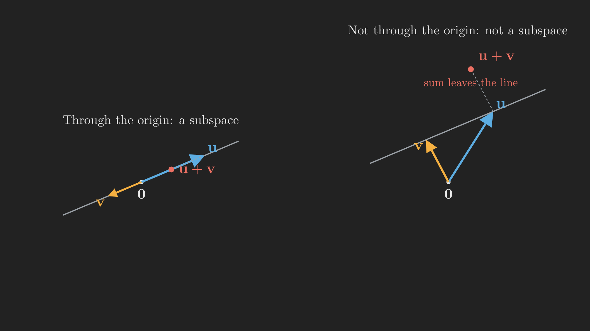
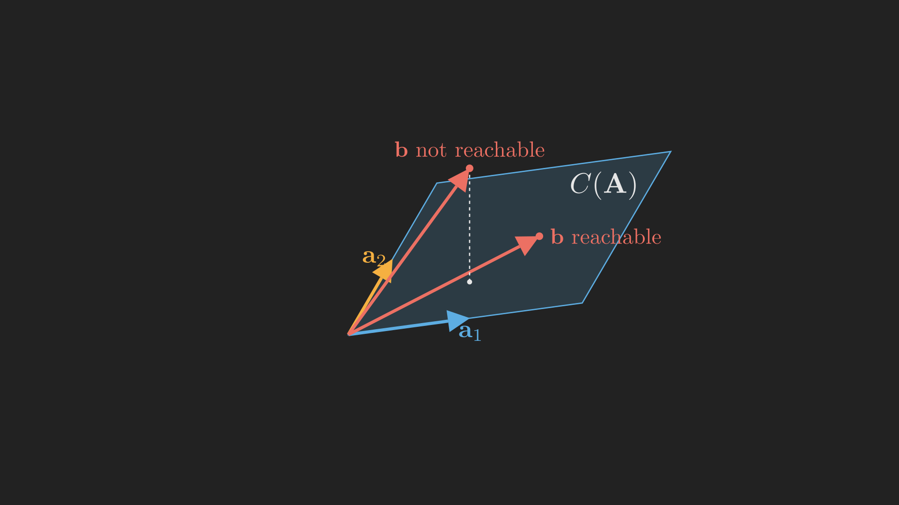

# Introduction

In [Part 2](../elimination-inverses-and-lu-factorization/index.qmd) we built elimination into a reliable algorithm and discovered that solving $\vb{A}\vb{x} = \vb{b}$ is really the factorization $\vb{A} = \vb{L}\vb{U}$. Throughout, one quantity kept quietly deciding everything: the **pivots**. When all the pivots were present, the system had exactly one solution. We ended by asking an uncomfortable question. What if a pivot is genuinely missing, not because of an unlucky row ordering, but because one row (or column) is truly a combination of the others?

To answer that, we have to change how we think. Up to now we have treated $\vb{A}\vb{x} = \vb{b}$ as a list of separate equations. In this post we stop looking at individual equations and start looking at *spaces*: the space of all the right-hand sides we could possibly reach, and the space of all solutions to $\vb{A}\vb{x} = \vb{0}$. These two spaces, the **column space** and the **nullspace**, are the real subject matter of linear algebra, and they will be our companions for the rest of Act I and well beyond.

Before we get there, we have one small debt to pay from Part 2. We promised to explain the row swaps in $\vb{P}\vb{A} = \vb{L}\vb{U}$. Doing that introduces two ideas we need anyway, transposes and permutations, so let us start there and then make the leap to spaces.

## Where we are

```{mermaid}
%%| fig-align: center
flowchart LR
    subgraph ACT1["Act I: Solving Ax = b"]
        P1["1. Geometry"] --> P2["2. Elimination & LU"] --> P3["3. Column Space & Nullspace"] --> P4["4. Rank & Complete Solution"]
    end
    subgraph ACT2["Act II: Structure & Orthogonality"]
        P5["5. Basis & Four Subspaces"] --> P6["6. Graphs & Networks"] --> P7["7. Projections"] --> P8["8. Least Squares & QR"] --> P9["9. Determinants"]
    end
    subgraph ACT3["Act III: Eigenvalues & Beyond"]
        P10["10. Eigenvalues"] --> P11["11. Diagonalization & ODEs"] --> P12["12. Markov & Fourier"] --> P13["13. Positive Definite"] --> P14["14. Complex & FFT"] --> P15["15. Jordan Form"] --> P16["16. SVD"] --> P17["17. Transformations"] --> P18["18. Pseudoinverse"]
    end
    ACT1 --> ACT2 --> ACT3

    style P3 fill:#10a37f,color:#fff
```

# Tidying up: transposes and permutations

## The transpose

The **transpose** of a matrix $\vb{A}$, written $\vb{A}^{\intercal}$, is what you get by flipping it across its diagonal: rows become columns and columns become rows. The entry in row $i$, column $j$ of $\vb{A}$ moves to row $j$, column $i$ of $\vb{A}^{\intercal}$. For example,

$$
\vb{A} =
\begin{bmatrix} 1 & 2 & 4 \\ 3 & 3 & 1 \end{bmatrix}
\qquad\Longrightarrow\qquad
\vb{A}^{\intercal} =
\begin{bmatrix} 1 & 3 \\ 2 & 3 \\ 4 & 1 \end{bmatrix}.
$$

(This is also why, throughout the series, a column vector $\vb{x}$ written sideways as a row is denoted $\vb{x}^{\intercal}$.) A matrix that equals its own transpose, $\vb{A}^{\intercal} = \vb{A}$, is called **symmetric**. Symmetric matrices are special enough that two entire later posts are about them, so it is worth noticing how naturally they appear. Take *any* matrix $\vb{R}$, rectangular or not, and form $\vb{R}^{\intercal}\vb{R}$. This product is always symmetric, because

$$
\left(\vb{R}^{\intercal}\vb{R}\right)^{\intercal} = \vb{R}^{\intercal}\left(\vb{R}^{\intercal}\right)^{\intercal} = \vb{R}^{\intercal}\vb{R}.
$$

(Here we used the rule that transposing a product reverses the order, $\left(\vb{A}\vb{B}\right)^{\intercal} = \vb{B}^{\intercal}\vb{A}^{\intercal}$, the same order-reversal we saw for inverses.) Keep $\vb{R}^{\intercal}\vb{R}$ in the back of your mind; it will be the star of the least squares story in Part 8.

## Permutations

A **permutation matrix** $\vb{P}$ is the identity matrix with its rows reordered. Multiplying by one simply shuffles rows. For instance,

$$
\vb{P} =
\begin{bmatrix} 0 & 1 & 0 \\ 1 & 0 & 0 \\ 0 & 0 & 1 \end{bmatrix}
$$

swaps the first two rows of whatever it multiplies. These are exactly the matrices we needed in Part 2: when a zero turns up in a pivot position, we multiply by a permutation to swap in a row with a nonzero entry, and the general factorization becomes $\vb{P}\vb{A} = \vb{L}\vb{U}$.

Permutation matrices have a delightful property. Since shuffling rows and then shuffling them back returns you to the start, the inverse of a permutation is just its transpose:

$$
\vb{P}^{\intercal}\vb{P} = \vb{I}, \qquad \text{so} \qquad \vb{P}^{-1} = \vb{P}^{\intercal}.
$$

That makes permutations the simplest members of a family we will care about a lot later, the *orthogonal* matrices. For now, our debt is paid: permutations handle the row swaps, and we can move on to the main event.

# From equations to spaces

Here is the shift in thinking. Instead of asking "what are the numbers $x$, $y$, $z$ that solve these equations?", we ask "what is the *set* of all right-hand sides we can produce, and what is the *set* of all solutions to the homogeneous problem?". Sets like these are not arbitrary; they have structure. They are **vector spaces**. So we need to say precisely what a vector space, and a useful piece of one, actually is.

## Vector spaces and subspaces

A **vector space** is a collection of vectors that is closed under the two operations we have been using all along: adding two vectors, and scaling a vector by a number. "Closed" means you can never escape: add two vectors in the space and the result is still in the space; scale a vector in the space and the result is still in the space. The whole of $\mathbb{R}^n$, all vectors with $n$ real entries, is the example to keep in mind.

Most of the time we care not about all of $\mathbb{R}^n$, but about a smaller space sitting inside it. A **subspace** is a subset of a vector space that is itself a vector space, that is, a subset that is still closed under addition and scalar multiplication. There is one immediate consequence worth stating on its own: every subspace must contain the zero vector. (Scale any vector in the subspace by $0$; closure forces $\vb{0}$ to be inside.) So a subspace is, intuitively, a flat sheet through the origin: a line through the origin, a plane through the origin, all of $\mathbb{R}^n$, or just the single point $\left\{\vb{0}\right\}$.

The "through the origin" part is not decoration; it is the whole test. @fig-subspace_closure makes the point. A line through the origin is a subspace: add any two vectors on it and the sum is still on it. A line that misses the origin is *not* a subspace: it fails to contain $\vb{0}$, and adding two of its vectors lands you off the line. Closure is a strict requirement, and a single counterexample breaks it.

{#fig-subspace_closure fig-align="center" width=95%}

The three conditions a candidate subset $\mathcal{S}$ must satisfy to be a subspace are collected in @tbl-subspace_test.

::: {.tbl tbl-colwidths="auto"}
| Condition | What it says |
|:---|:---|
| Contains $\vb{0}$ | The zero vector is in $\mathcal{S}$. |
| Closed under addition | If $\vb{u}$ and $\vb{v}$ are in $\mathcal{S}$, then $\vb{u} + \vb{v}$ is in $\mathcal{S}$. |
| Closed under scaling | If $\vb{u}$ is in $\mathcal{S}$ and $c$ is any number, then $c\,\vb{u}$ is in $\mathcal{S}$. |

: The subspace test. A subset is a subspace exactly when all three hold (the first follows from the third, but it is the quickest sanity check). {#tbl-subspace_test style="width:75%; margin:auto;"}
:::

With the language in place, we can finally name the two spaces that live inside every matrix.

# The column space: which targets can we reach?

Back in Part 1 we found, hiding in the column picture, the question that drives the subject: as the weights range over all values, which targets $\vb{b}$ can the columns of $\vb{A}$ combine to reach? That set of reachable targets now gets a name.

The **column space** of $\vb{A}$, written $C(\vb{A})$, is the set of all linear combinations of the columns of $\vb{A}$. Equivalently, it is the set of all vectors $\vb{b}$ for which $\vb{A}\vb{x} = \vb{b}$ has a solution, because $\vb{A}\vb{x}$ is precisely a combination of the columns. It is a subspace: combinations of columns can be added and scaled and you still have a combination of columns, so closure holds automatically.

Let us see it on a concrete matrix. Take

$$
\vb{A} =
\begin{bmatrix}
  1 & 1 & 2 \\
  1 & 2 & 3 \\
  1 & 3 & 4
\end{bmatrix},
$$

whose three columns are $\vb{a}_1 = \left(1, 1, 1\right)$, $\vb{a}_2 = \left(1, 2, 3\right)$, and $\vb{a}_3 = \left(2, 3, 4\right)$, all living in $\mathbb{R}^3$. Notice the third column is the sum of the first two: $\vb{a}_3 = \vb{a}_1 + \vb{a}_2$. So the third column adds nothing new; any combination of all three is already a combination of just $\vb{a}_1$ and $\vb{a}_2$. Those two point in genuinely different directions, and all their combinations sweep out a single flat **plane through the origin** in $\mathbb{R}^3$. That plane is the column space $C(\vb{A})$.

@fig-column_space shows it. The shaded plane is $C(\vb{A})$, spanned by $\vb{a}_1$ and $\vb{a}_2$. A target $\vb{b}$ that lies in the plane is reachable, there is a combination of columns that builds it. A target $\vb{b}$ that pokes out of the plane is unreachable, no combination of the columns will ever leave the plane.

{#fig-column_space fig-align="center" width=80%}

This picture lets us restate solvability in one clean line:

$$
\vb{A}\vb{x} = \vb{b} \ \text{has a solution} \quad\Longleftrightarrow\quad \vb{b} \in C(\vb{A}).
$$

For our matrix, a little algebra shows the plane is exactly the set of vectors $\left(b_1, b_2, b_3\right)$ with $b_1 - 2b_2 + b_3 = 0$. So $\vb{b} = \left(2, 3, 4\right)$ is reachable (indeed $2 - 6 + 4 = 0$, and in fact $\vb{b} = \vb{a}_3$), while $\vb{b} = \left(1, 0, 0\right)$ is not ($1 - 0 + 0 \neq 0$). The column space turns the vague worry "maybe some right-hand sides have no solution" into a precise, checkable condition.

# The nullspace: all the ways to reach zero

The column space lives on the output side, among the targets $\vb{b}$. There is an equally important space on the input side, among the solutions $\vb{x}$. It comes from the special problem where the target is zero.

The **nullspace** of $\vb{A}$, written $N(\vb{A})$, is the set of all solutions $\vb{x}$ to

$$
\vb{A}\vb{x} = \vb{0}.
$$

It is always a subspace of the input space: if $\vb{A}\vb{u} = \vb{0}$ and $\vb{A}\vb{v} = \vb{0}$, then $\vb{A}\left(\vb{u} + \vb{v}\right) = \vb{0}$ and $\vb{A}\left(c\vb{u}\right) = \vb{0}$ as well, so sums and scalings of solutions are still solutions. And it always contains at least $\vb{x} = \vb{0}$, the trivial solution.

The interesting question is whether it contains anything *else*. For our matrix it does, and we can spot it from the column relationship we already noticed. Because $\vb{a}_1 + \vb{a}_2 - \vb{a}_3 = \vb{0}$, the combination with weights $\left(1, 1, -1\right)$ produces the zero vector:

$$
\vb{A}\begin{bmatrix} 1 \\ 1 \\ -1 \end{bmatrix}
= 1\,\vb{a}_1 + 1\,\vb{a}_2 + (-1)\,\vb{a}_3
= \vb{0}.
$$

So $\left(1, 1, -1\right)$ is in the nullspace, and so is every multiple of it. The nullspace of this $\vb{A}$ is the **line through the origin** in the direction $\left(1, 1, -1\right)$, a one-dimensional subspace of $\mathbb{R}^3$.

A nonzero nullspace is exactly the "missing pivot" situation from Part 2 wearing new clothes. The redundant third column is what costs us a pivot, and that same redundancy is what fills the nullspace with more than just $\vb{0}$. The nullspace also tells us about uniqueness of solutions: if $\vb{x}_p$ solves $\vb{A}\vb{x} = \vb{b}$, then so does $\vb{x}_p + \vb{n}$ for any $\vb{n}$ in the nullspace, since $\vb{A}\left(\vb{x}_p + \vb{n}\right) = \vb{b} + \vb{0} = \vb{b}$. A nonzero nullspace means a solvable system has infinitely many solutions, not one. We will make that precise next time.

# Where we are, and where we go next

Let us take stock. We have made the central shift of the whole subject, from equations to spaces:

- A **vector space** is closed under addition and scaling; a **subspace** is a flat piece through the origin (the subspace test in @tbl-subspace_test).
- The **column space** $C(\vb{A})$ is all combinations of the columns, equivalently all reachable targets. Solvability is the crisp statement $\vb{b} \in C(\vb{A})$.
- The **nullspace** $N(\vb{A})$ is all solutions of $\vb{A}\vb{x} = \vb{0}$. Whether it is just $\left\{\vb{0}\right\}$ or something bigger decides whether solutions are unique.

But notice how we found these spaces: by *inspection*. We eyeballed that $\vb{a}_3 = \vb{a}_1 + \vb{a}_2$ and read the nullspace off that lucky observation. That will not do for a $50 \times 50$ matrix, any more than reading a crossing point off a graph did in Part 1. We need a systematic procedure that, given any $\vb{A}$, computes its nullspace and the complete set of solutions to $\vb{A}\vb{x} = \vb{b}$, and a single number, the **rank**, that ties it all together. Elimination, which we already trust, turns out to do exactly this once we push it a little further. That is the work of Part 4.
