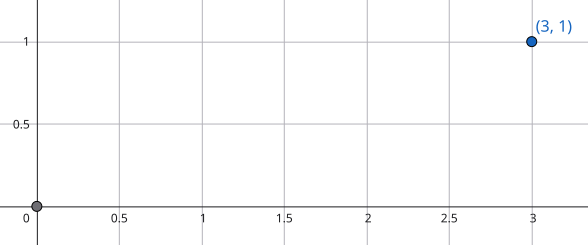
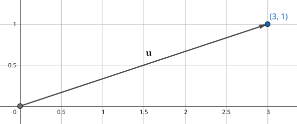

# Introduction

Linear algebra is all about vectors and matrices. These are its fundamental objects. We will denote any general vector using a lowercase, bold, and non-italic font, e.g., $\mathbf{v}$. Further, we will denote any general matrix using an uppercase, bold, and non-italic font, e.g., $\mathbf{M}$.

## Vectors

### Definition

A **vector** is an *ordered* list of numbers (or more specifically, scalars). The number of numbers in this ordered list is the **dimension** or the **size** of that vector. For instance, the following vector $\mathbf{v}$ is a 2-dimensional vector:

$$
\mathbf{v} =
\begin{bmatrix}
  v_1\\
  v_2
\end{bmatrix}
=
\begin{bmatrix}
  1\\
  3
\end{bmatrix}.
$$

As this is a 2-dimensional vector, we write $\mathrm{dim}(\mathbf{v}) = 2$. Further, we can see that the individual entries inside the vector $\mathbf{v}$ are denoted using $v_i$, where $i \in \{1, \dots, \mathrm{dim}(\mathbf{v})\}$ is the **index**. An $n$-dimensional vector is sometimes also known as an **$n$-vector**.

### Equal Vectors

Two vectors $\mathbf{v}$ and $\mathbf{w}$ of the *same size* are *equal* if $v_i = w_i$ for all $i$. In other words, we can write

$$
\mathbf{v} = \mathbf{w}
$$

if and only if their size is the same, i.e., $\mathrm{dim}(\mathbf{v}) = \mathrm{dim}(\mathbf{w})$, and all their entries are the same.

### Zero Vector

A **zero vector** is a vector that has all its entries as $0$, and is denoted as $\mathbf{0}$, or $\mathbf{0}_n$ ($n$ is its dimension). For example, the following is a zero vector of size $3$:

$$
\mathbf{0}_3 =
\begin{bmatrix}
0\\
0\\
0
\end{bmatrix}.
$$

### Ones Vector

Just like the zero vector, a **ones vector** is a vector that has all its entries as $1$, and is denoted as $\mathbf{1}$, or $\mathbf{1}_n$ ($n$ is its dimension). For example, the following is a ones vector of size $3$:

$$
\mathbf{1}_3 =
\begin{bmatrix}
1\\
1\\
1
\end{bmatrix}.
$$

### Unit Vector

A (standard) **unit vector** is a vector that has all its entries as $0$ except one whose value is $1$. The $i$-th unit vector (of size $n$) is the unit vector with the $i$-th element as $1$, and is denoted as $\mathbf{e}_i$. For instance, the vectors
$$
\mathbf{e}_1 =
\begin{bmatrix}
1\\
0\\
0
\end{bmatrix}, \quad
\mathbf{e}_2 =
\begin{bmatrix}
0\\
1\\
0
\end{bmatrix}, \quad
\mathbf{e}_3 =
\begin{bmatrix}
0\\
0\\
1
\end{bmatrix}
$$

are three unit vectors of size $3$.

### Sparse Vector

A vector is said to be **sparse** if *many* of its entries are zeros. The zero vector is the sparsest possible vector as it has no non-zero entries. Unit vectors are sparse as the have only one non-zero entry.

### Examples

Vectors are widely used in the real world as a part of the definition of many quantities. The following are few:

- Location and displacement:
  - A $2$-dimensional vector can be used to represent a position or a location on a $2$-dimensional space. This is shown in @fig-vector_location.

  {#fig-vector_location fig-align="center" width=70 .invert%}

  - Similarly, a $2$-D vector can also be used to represent displacement on a $2$-dimensional space, which is shown in @fig-displacement.

  {#fig-displacement fig-align="center" width=70 .invert%}

- Colors on a computer screen:
  - Colors on a computer screen are generally indicated using three numbers between $0$ to $255$, which indicate the intensity of the red pixel, the green pixel, and the blue pixel, respectively. This is known as the RGB value of a particular pixel. For instance, a pure red pixel is denoted as
  $$
  \begin{bmatrix}
    255\\
    0\\
    0
  \end{bmatrix}.
  $$

> 🚧 **Work in Progress:** This blog post is currently being written. Some sections are complete, while others are still under construction. Feel free to explore and check back later for updates!

# Acknowledgment

I have referred to books [@Strang2023IntroductionLinearAlgebra; @BoydVandenberghe2018_IntroAppliedLinearAlgebra], and to the YouTube playlists [@MIT18.06SCLinearAlgebra2011; @StanfordENGR108AppliedLinearAlgebra] while writing this blog post.
