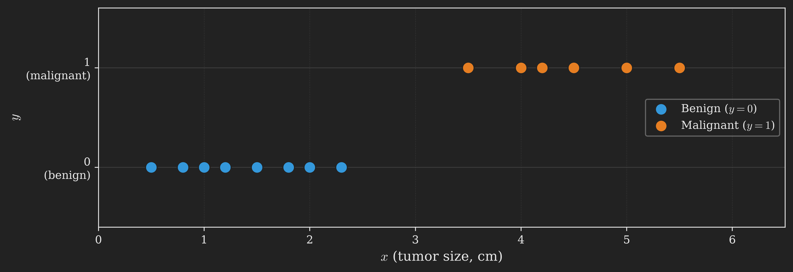
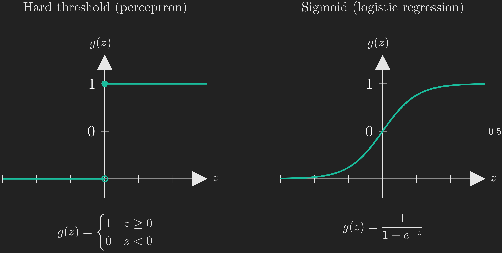
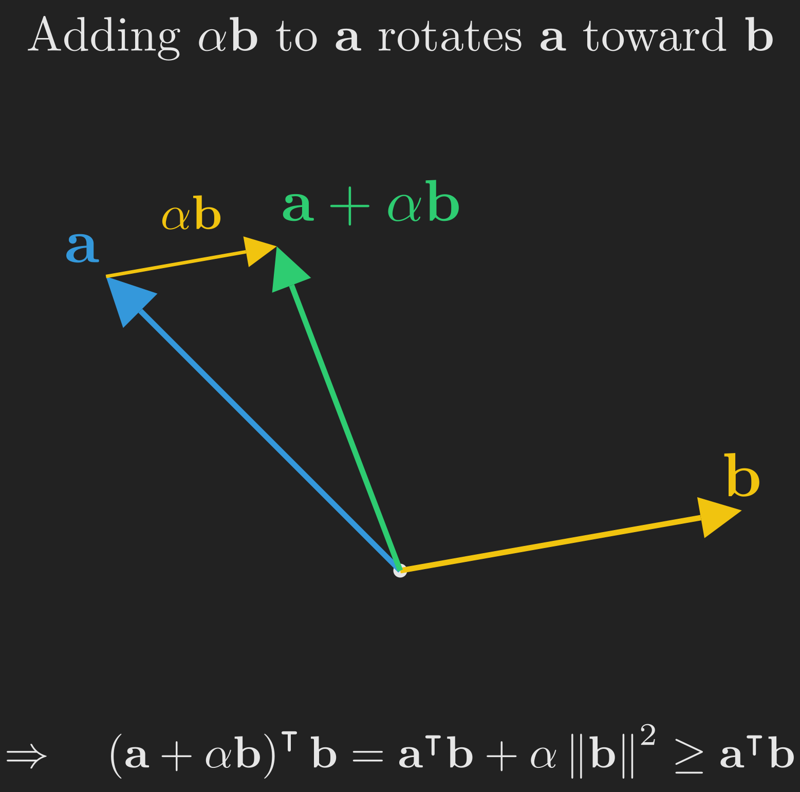
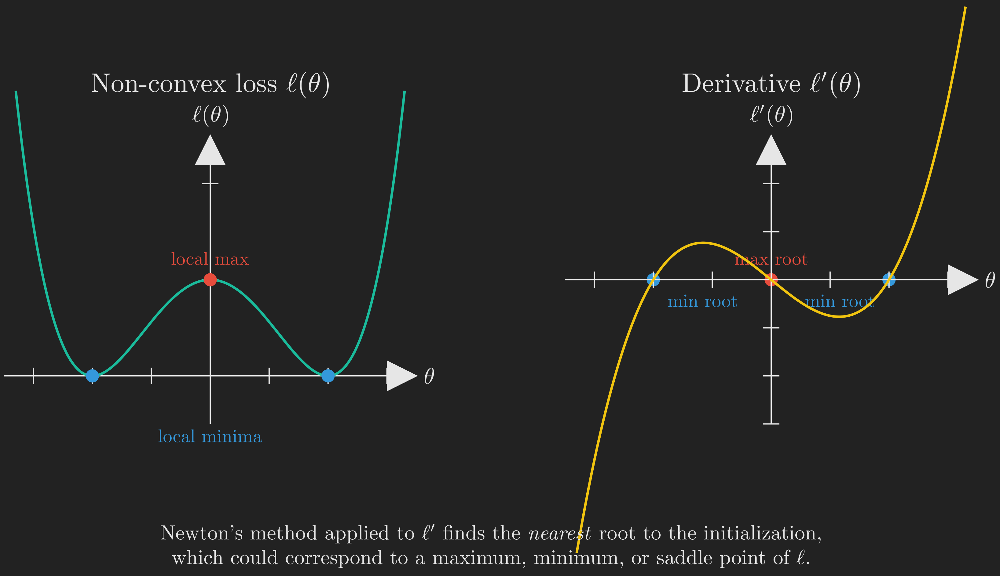
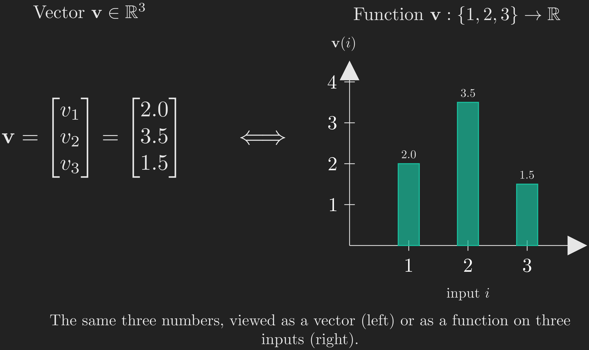

# Where We Left Off

In the [linear regression post](../linear-regression/index.qmd), we built a complete framework for predicting a continuous output from a vector of features. We defined a hypothesis $h_{\boldsymbol{\uptheta}}\left(\vb{x}\right) = \boldsymbol{\uptheta}^{\intercal}\vb{x}$, a cost function $J\left(\boldsymbol{\uptheta}\right)$ measuring squared error, and two strategies (gradient descent and the normal equations) for finding the parameters $\boldsymbol{\uptheta}$ that minimize the cost. We even saw that the squared error cost is not arbitrary: it falls out of a maximum likelihood argument when we assume the output is the linear prediction plus Gaussian noise.

That post answered the question "how much?": given the features of a house, how many dollars is it worth? This post answers a different kind of question, "which kind?": is this tumor malignant or benign, is this email spam or not, will this loan default or not? The output is no longer a number on a continuous scale; it is one of two labels.

Here is the thread that will hold the whole post together. Separating two classes means **drawing a boundary** between them, and almost everything we do will be a way of drawing that boundary a little more intelligently. We will draw it three times. First with a tool we already have (linear regression), and watch it fail. Then with a hard rule (the **perceptron**). Then with a smooth, probabilistic rule (**logistic regression**), which not only draws the boundary but tells us how *confident* it is on either side. Along the way we will pick up **Newton's method**, a faster way to find that boundary, and close with a short, optional appendix that reframes what a function "is," a perspective that will pay dividends when we later study kernels and Gaussian processes.

This post is largely based on the treatment in @ng_cs229_notes and the accompanying lecture series [@stanford_cs229_ml_youtube]. Where additional context is helpful, we draw on standard references in the field [@bishop2006pattern; @hastie2009elements].

Here is the journey we are about to take.

```{mermaid}
%%| fig-align: center
flowchart TB
    A["<b>1. The Problem</b><br/>Tumor size and<br/>malignancy"]
    B["<b>2. The Naive Attempt</b><br/>Why linear regression<br/>fails for classification"]
    C["<b>3. The Perceptron</b><br/>Hard threshold,<br/>geometric update"]
    D["<b>4. Logistic Regression</b><br/>Soft threshold,<br/>probabilities, MLE"]
    E["<b>5. The Two Boundaries</b><br/>Hard cut vs<br/>probability field"]
    F["<b>6. Newton's Method</b><br/>A faster optimizer<br/>using curvature"]
    G["<b>7. Discriminative vs Generative</b><br/>A quick foreshadowing"]
    H["<b>8. Wrapping Up</b><br/>Full picture and<br/>what comes next"]
    I["<b>Appendix</b><br/>Functions as<br/>infinite-dimensional vectors"]
    A --> B --> C --> D --> E --> F --> G --> H --> I

    style A fill:#1e8449,color:#fff,stroke:#fff
    style E fill:#1f6f8b,color:#fff,stroke:#fff
    style H fill:#b9770e,color:#fff,stroke:#fff
    style I fill:#5a3a78,color:#fff,stroke:#fff
```

We will start with a concrete example you can visualize, build intuition with pencil-and-paper reasoning, and only *then* introduce the math. Every formula will earn its place by solving a problem you already feel.

# The Problem: Is the Tumor Malignant?

Suppose you are building a screening tool to help diagnose tumors. For each tumor in your training set, you have one piece of information:

- $x$: the size of the tumor in cm.

For each tumor, you also have a label $y$, which is $1$ if the tumor was malignant and $0$ if it was benign. (In machine learning terminology, $1$ is the **positive class** and $0$ is the **negative class**.) A handful of observations might look like the following.

::: {.tbl tbl-colwidths="auto"}
| $x$ (tumor size, cm) | $y$ (malignant?) |
|:--------------------:|:----------------:|
| 0.5 | 0 |
| 1.0 | 0 |
| 1.5 | 0 |
| 2.0 | 0 |
| 3.5 | 1 |
| 4.5 | 1 |
| 5.0 | 1 |
| ⋮   | ⋮ |

: A few rows from a toy tumor dataset. {#tbl-tumor_dataset style="width:40%; margin:auto;"}
:::

If we plot these points on a number line with $x$ as the horizontal axis and color them by class, we get a picture like @fig-tumor_scatter. Smaller tumors (blue) tend to be benign; larger tumors (orange) tend to be malignant.

{#fig-tumor_scatter fig-align="center" width=100%}

A clear pattern emerges: there is some threshold along the size axis below which tumors tend to be benign and above which they tend to be malignant. A new tumor with size $x$ should be classified by checking which side of the threshold it falls on. That threshold is our first **decision boundary**, and notice its shape: with a single feature, the boundary is just a **point** on the size axis. Hold on to that observation. As we add features, the boundary will grow from a point into a line, and watching it grow is one of the through-lines of this post.

This is a supervised learning problem just like linear regression, but with one crucial difference: the output $y$ is no longer a continuous real number. It is a *discrete* label, taking only the values $0$ or $1$. This makes the problem a **binary classification** problem. (When $y$ can take more than two discrete values, we get **multi-class classification**, which we will save for a future post.)

How do we build a model for this? Let us start by trying the only tool we currently have.

# The Naive Attempt: Just Use Linear Regression?

We could ignore the fact that $y$ is discrete and just throw linear regression at the problem. Treat $y \in \{0, 1\}$ as a continuous output, fit a line $h_{\boldsymbol{\uptheta}}\left(x\right) = \theta_0 + \theta_1 x$ to the data, and at test time use the rule "predict malignant if $h_{\boldsymbol{\uptheta}}\left(x\right) \geq 0.5$, otherwise predict benign." The decision boundary is then wherever the fitted line crosses $0.5$.

This works embarrassingly well on simple datasets, which is the trap. Look at the left panel of @fig-linear_regression_fails. We fit linear regression to the data, draw the resulting line, and threshold at $0.5$. The decision boundary (the $x$ value at which the line crosses $0.5$) sits cleanly between the benign and malignant clusters, and every training point is correctly classified.

Now look at the right panel, where we have added a single very obvious malignant tumor: one much larger than any seen before, definitely malignant. We refit linear regression on the new dataset. The fitted line tilts to reduce the squared error contribution from the far-right point (which was being predicted way below $1$ before), and as a consequence the line becomes flatter and its $0.5$ crossing shifts to the right. Some of the original malignant tumors (the ones near the old boundary) are now to the *left* of the new boundary, meaning the model now classifies them as benign. They are misclassified, even though nothing changed about them.

{#fig-linear_regression_fails fig-align="center" width=100%}

What went wrong? Our boundary turned out to be **fragile**: a single far-away point dragged it across some of our data. The root cause is that linear regression is trying to minimize squared error, treating the labels $0$ and $1$ as if they were heights on a continuous scale. A point labeled $1$ that lies "very far on the malignant side" is treated as an embarrassingly large prediction error (because the line predicts something much less than $1$ there), even though it is in fact a *clearer* example of malignancy, not a worse one. The model bends over backwards to reduce that error and ends up hurting itself elsewhere.

There is also a more fundamental conceptual issue. The hypothesis $\boldsymbol{\uptheta}^{\intercal}\vb{x}$ can take any real value, ranging over $\left(-\infty, +\infty\right)$. But we know in advance that $y \in \{0, 1\}$. It does not make sense for a hypothesis to predict $h_{\boldsymbol{\uptheta}}\left(\vb{x}\right) = -3.7$ or $h_{\boldsymbol{\uptheta}}\left(\vb{x}\right) = 12.4$. We need to constrain the output to live in $\{0, 1\}$ (or at least somewhere bounded, like $\left[0, 1\right]$).

The natural fix is to compose the linear function $\boldsymbol{\uptheta}^{\intercal}\vb{x}$ with a **squashing function** that maps real numbers to $\{0, 1\}$ (or to $\left[0, 1\right]$). Since the squashed output is bounded, no single far-out point can pull the score the way it pulled the linear regression line: once a score is past the saturation region, pushing it further does almost nothing to the prediction. The boundary stops being fragile. The simplest squashing function is a hard step: output $1$ if the input is non-negative, $0$ otherwise. That choice gives us our first real classification algorithm.

# The Perceptron: The First Idea That Works

The **perceptron**, proposed by @rosenblatt1958perceptron in the 1950s, was once thought to be a rough mathematical model of how individual neurons in the brain process information. It is rarely used in practice today (we will see why shortly), but it is so simple and so geometrically clean that it remains a perfect place to build intuition for how classification algorithms draw their boundaries.

## The Hypothesis

Recall that in linear regression, the hypothesis, which gives the prediction, was given by

$$
\hat{y} = h_{\boldsymbol{\uptheta}}\left(\vb{x}\right) = \boldsymbol{\uptheta}^{\intercal} \vb{x}.
$$

In the perceptron, the hypothesis is

$$
h_{\boldsymbol{\uptheta}}\left(\vb{x}\right) = g \left(\boldsymbol{\uptheta}^{\intercal} \vb{x}\right),
$$

where $g$ is the **threshold function**

$$
g\left(z\right) =
\begin{cases}
  1, & \text{if } z \geq 0,\\
  0, & \text{if } z < 0.
\end{cases}
$$ {#eq-perceptron_threshold}

In words: compute the linear score $\boldsymbol{\uptheta}^{\intercal}\vb{x}$ (a real number between $-\infty$ and $+\infty$), and then squash it to $0$ or $1$ depending on whether it is non-negative. The function $g$ looks like a hard step, as shown on the left panel of @fig-step_vs_sigmoid. (The right panel shows the sigmoid function, which we will meet later when we discuss logistic regression. Keep an eye on it for now; the visual contrast will be the whole point when we put the two boundaries side by side.)

{#fig-step_vs_sigmoid fig-align="center" width=85%}

::: {.callout-note title="Notation: $x$ vs. $\\vb{x}$"}
For the tumor example we have a single feature $x$, so it might seem strange to use bold $\vb{x}$ everywhere. We do this because the algorithms below work with feature *vectors* in general, and we want to emphasize the vector structure. Following the convention from the [previous post](../linear-regression/index.qmd), $\vb{x}$ always includes a leading "intercept" coordinate $x_0 = 1$, so for the tumor example $\vb{x} = \left(1, x\right)^{\intercal} \in \mathbb{R}^2$ and $\boldsymbol{\uptheta} = \left(\theta_0, \theta_1\right)^{\intercal} \in \mathbb{R}^2$. This way $\boldsymbol{\uptheta}^{\intercal}\vb{x} = \theta_0 + \theta_1 x$ as expected.
:::

## The Update Rule

How do we learn $\boldsymbol{\uptheta}$? The perceptron is a **streaming algorithm**: it processes one training example at a time, updates the parameters, and moves on. The update rule, given an example $\left(\vb{x}_i, y_i\right)$, is

$$
\boldsymbol{\uptheta} = \boldsymbol{\uptheta} + \alpha \left(y_i - h_{\boldsymbol{\uptheta}} \left(\vb{x}_i\right)\right) \vb{x}_i,
$$ {#eq-perceptron_update}

where $\alpha > 0$ is the learning rate. Take a moment to compare @eq-perceptron_update with the stochastic gradient descent rule for linear regression we derived in the [previous post](../linear-regression/index.qmd):

$$
\begin{align*}
\boldsymbol{\uptheta} &= \boldsymbol{\uptheta} - \alpha \left(\boldsymbol{\uptheta}^{\intercal}\vb{x}_k - y_k\right) \vb{x}_k \\
                      &= \boldsymbol{\uptheta} + \alpha \left(y_k - \boldsymbol{\uptheta}^{\intercal}\vb{x}_k\right) \vb{x}_k.
\end{align*}
$$

The two rules look identical, except that linear regression uses $\boldsymbol{\uptheta}^{\intercal}\vb{x}_i$ as the prediction while the perceptron uses $g \left(\boldsymbol{\uptheta}^{\intercal}\vb{x}_i\right)$. This cosmetic similarity is misleading: the perceptron is a fundamentally different algorithm, and this update rule is *not* derived from minimizing any obvious cost function. (In fact, it is hard to derive the perceptron from a maximum likelihood argument at all, which is one of the reasons it fell out of favor.)

So why does the rule work? The answer is best seen geometrically, in terms of what it does to the boundary.

## Geometric Intuition

To build geometric intuition, let us briefly step away from the tumor dataset and think about $\vb{x}$ and $\boldsymbol{\uptheta}$ as abstract vectors in $\mathbb{R}^2$. (The intuition we develop here applies to any number of dimensions; we use $\mathbb{R}^2$ purely so we can draw pictures.) Imagine each $\vb{x}$ might encode two features of an example, perhaps two measurements of a tumor or two features of an email; the algorithm's behavior does not depend on what those features mean.

We make two key observations.

**Observation 1: $\boldsymbol{\uptheta}$ is perpendicular to the decision boundary.**

The perceptron predicts $1$ when $\boldsymbol{\uptheta}^{\intercal}\vb{x} \geq 0$ and $0$ otherwise. So the **decision boundary** is the set of points where $\boldsymbol{\uptheta}^{\intercal}\vb{x} = 0$. Geometrically, this is the hyperplane through the origin perpendicular to $\boldsymbol{\uptheta}$. (Why? Because $\boldsymbol{\uptheta}^{\intercal}\vb{x} = 0$ means the dot product of $\boldsymbol{\uptheta}$ with $\vb{x}$ is zero, which means $\boldsymbol{\uptheta}$ and $\vb{x}$ are perpendicular.) Points on one side of this hyperplane have $\boldsymbol{\uptheta}^{\intercal}\vb{x} > 0$ (predicted as positive), and points on the other side have $\boldsymbol{\uptheta}^{\intercal}\vb{x} < 0$ (predicted as negative). The vector $\boldsymbol{\uptheta}$ itself points into the positive half-space. @fig-decision_boundary_geometry illustrates this.

![The decision boundary is the line where $\boldsymbol{\uptheta}^{\intercal}\vb{x} = 0$, which is the hyperplane through the origin perpendicular to $\boldsymbol{\uptheta}$. The vector $\boldsymbol{\uptheta}$ itself points into the positive half-space (orange tint, where $\boldsymbol{\uptheta}^{\intercal}\vb{x} > 0$); the other half-space (blue tint) is where $\boldsymbol{\uptheta}^{\intercal}\vb{x} < 0$. A sample point $\vb{x}$ on the positive side has $\boldsymbol{\uptheta}^{\intercal}\vb{x} > 0$; a sample point $\vb{x}'$ on the negative side has $\boldsymbol{\uptheta}^{\intercal}\vb{x}' < 0$.](images/decision_boundary_geometry.png){#fig-decision_boundary_geometry fig-align="center" width=80%}

This is exactly the "line" form of the boundary we promised at the very start. With one feature the boundary was a point; with two features it is a line, and $\boldsymbol{\uptheta}$ is the arrow perpendicular to it. (The figure draws the boundary through the origin because here $\vb{x}$ has no intercept term. Once we restore the intercept $\theta_0$, the same line simply slides off the origin to wherever the data needs it. We will see that concretely when we compare the two boundaries on real data.)

**Observation 2: To make a dot product bigger, add a small piece of one vector to the other.**

Suppose we have two vectors $\vb{a}$ and $\vb{b}$ at an obtuse angle, so that $\vb{a}^{\intercal}\vb{b} < 0$, and we want to make $\vb{a}^{\intercal}\vb{b}$ larger (more positive). One easy trick: replace $\vb{a}$ with $\vb{a} + \alpha \vb{b}$ for some small $\alpha > 0$. Then

$$
\left(\vb{a} + \alpha \vb{b}\right)^{\intercal}\vb{b} = \vb{a}^{\intercal}\vb{b} + \alpha \vb{b}^{\intercal}\vb{b} = \vb{a}^{\intercal}\vb{b} + \alpha \left\Vert \vb{b} \right\Vert^2.
$$

Since $\left\Vert \vb{b} \right\Vert^2$ is always non-negative, the new dot product is at least as large as the old one. Geometrically, adding $\alpha \vb{b}$ to $\vb{a}$ rotates $\vb{a}$ slightly toward $\vb{b}$, making the angle between them smaller and the dot product bigger. The reverse trick (subtracting) shrinks the dot product. This is illustrated in @fig-dot_product_intuition.

{#fig-dot_product_intuition fig-align="center" width=40%}

**Putting them together.** Now look at the perceptron update rule again:

$$
\boldsymbol{\uptheta} = \boldsymbol{\uptheta} + \alpha \left(y_i - h_{\boldsymbol{\uptheta}} \left(\vb{x}_i\right)\right) \vb{x}_i.
$$

There are exactly four cases, corresponding to the four combinations of true label $y_i$ and predicted label $h_{\boldsymbol{\uptheta}} \left(\vb{x}_i\right)$:

- **Correct, $y_i = 1$ and $h_{\boldsymbol{\uptheta}} \left(\vb{x}_i\right) = 1$:**
  - The factor $\left(y_i - h_{\boldsymbol{\uptheta}} \left(\vb{x}_i\right)\right)$ is zero, so $\boldsymbol{\uptheta}$ is unchanged. No work to do.
- **Correct, $y_i = 0$ and $h_{\boldsymbol{\uptheta}} \left(\vb{x}_i\right) = 0$:**
  - The factor $\left(y_i - h_{\boldsymbol{\uptheta}} \left(\vb{x}_i\right)\right)$ is again zero, so $\boldsymbol{\uptheta}$ is again unchanged.
- **Incorrect, $y_i = 1$ but $h_{\boldsymbol{\uptheta}} \left(\vb{x}_i\right) = 0$:**
  - The factor $\left(y_i - h_{\boldsymbol{\uptheta}} \left(\vb{x}_i\right)\right)$ is $+1$, so we update $\boldsymbol{\uptheta} = \boldsymbol{\uptheta} + \alpha \vb{x}_i$. This adds a piece of $\vb{x}_i$ to $\boldsymbol{\uptheta}$, which by Observation 2 makes $\boldsymbol{\uptheta}^{\intercal}\vb{x}_i$ larger. The next time we see this example, $\boldsymbol{\uptheta}^{\intercal}\vb{x}_i$ will be more likely to be non-negative, and the prediction more likely to be $1$. Good.
- **Incorrect, $y_i = 0$ but $h_{\boldsymbol{\uptheta}} \left(\vb{x}_i\right) = 1$:**
  - The factor $\left(y_i - h_{\boldsymbol{\uptheta}} \left(\vb{x}_i\right)\right)$ is $-1$, so $\boldsymbol{\uptheta} = \boldsymbol{\uptheta} - \alpha \vb{x}_i$. This shrinks $\boldsymbol{\uptheta}^{\intercal}\vb{x}_i$, making the prediction more likely to flip to $0$. Also good.

So the perceptron rotates its $\boldsymbol{\uptheta}$ vector (and equivalently, its decision boundary) toward correctly classifying any example it currently misclassifies. To see this in action, let us run the algorithm from a deliberately bad starting point and watch what happens.

@fig-perceptron_full_training shows the perceptron training on a synthetic 2D dataset with two linearly-separable classes, initialized with $\boldsymbol{\uptheta}^{\left(0\right)}$ pointing in *exactly the wrong direction*, opposite to the natural separating direction. With this initialization, every training example is initially misclassified (every point gets a red ring in the first frame, and notice that the orange data points sit in the blue "predicted negative" half-space and vice versa, the algorithm has it completely backwards). At each step, the algorithm visits one example (yellow ring), checks the prediction against the true label, and if they disagree, applies the update rule. Watch how the boundary swings progressively through the data and finally snaps into a separating configuration.

::: {#fig-perceptron_full_training}


The perceptron training on a synthetic linearly-separable 2D dataset, starting from a parameter vector $\boldsymbol{\uptheta}^{\left(0\right)}$ that points in exactly the opposite of the correct direction. The vector $\boldsymbol{\uptheta}$ (in green) is always perpendicular to the decision boundary (in white). Misclassified examples have red rings; the example currently being visited has a yellow ring. The first three updates are shown at slow pacing so the per-step mechanics are clear; the remaining updates are shown at faster pacing. After about a dozen updates, the boundary has rotated all the way around to a separating configuration, and subsequent visits confirm convergence (no more updates).
:::

There is a beautiful theoretical result here: if your training data is **linearly separable** (i.e., there exists a hyperplane that perfectly separates the two classes), then the perceptron is guaranteed to find such a hyperplane in a finite number of updates [@novikoff1962convergence]. The catch is, of course, that real data is rarely linearly separable, in which case the perceptron will keep oscillating forever without converging. We will come back to this weakness, and *see* it contrasted against logistic regression, when we put the two boundaries side by side.

## A Useful Side Observation

If we initialize $\boldsymbol{\uptheta} = \vb{0}$ and apply the perceptron update over and over, then $\boldsymbol{\uptheta}$ at any point during training is a sum of scaled training examples:

$$
\boldsymbol{\uptheta} = \sum_{i \in M} c_i \vb{x}_i,
$$

where $M$ is the set of misclassified examples encountered so far and each $c_i \in \{+\alpha, -\alpha\}$ depending on which way we pushed. So the parameter vector lives in the span of the (misclassified) training examples. This observation, surprisingly, is the seed of the **kernel trick** that powers support vector machines, but that is a story for another post.

## Why We Don't Use the Perceptron in Practice

The perceptron has two big shortcomings, and both are really complaints about the *kind* of boundary it draws:

1. **No probabilities.** It only outputs hard $0$ or $1$ predictions. But often we want to know how *confident* the model is. A tumor that scores $\boldsymbol{\uptheta}^{\intercal}\vb{x} = 0.01$ should not be treated with the same confidence as one scoring $\boldsymbol{\uptheta}^{\intercal}\vb{x} = 50$, even though both yield prediction $1$.
2. **No graceful learning from "almost right" examples.** Because the prediction is hard $0$ or $1$, the update is either applied at full strength (wrong example) or not at all (right example, even by a hair). There is no notion of "this example was almost wrong, let me adjust slightly."

The fix is wonderfully simple: replace the hard step function $g$ with a smooth, continuous function that ranges from $0$ to $1$ but transitions smoothly between them. That single change gives us logistic regression and unlocks a probabilistic interpretation, a principled cost function via maximum likelihood, and a graceful update rule. Let us go there now. (And once both classifiers are on the table, we will put their boundaries side by side and watch exactly what that one change buys us.)

```{mermaid}
%%| fig-align: center
flowchart TB
    A["<b>1. The Problem</b><br/>Tumor size and<br/>malignancy"]
    B["<b>2. The Naive Attempt</b><br/>Why linear regression<br/>fails for classification"]
    C["<b>3. The Perceptron</b><br/>Hard threshold,<br/>geometric update"]
    D["<b>4. Logistic Regression</b><br/>Soft threshold,<br/>probabilities, MLE"]
    E["<b>5. The Two Boundaries</b><br/>Hard cut vs<br/>probability field"]
    F["<b>6. Newton's Method</b><br/>A faster optimizer<br/>using curvature"]
    G["<b>7. Discriminative vs Generative</b><br/>A quick foreshadowing"]
    H["<b>8. Wrapping Up</b><br/>Full picture and<br/>what comes next"]
    I["<b>Appendix</b><br/>Functions as<br/>infinite-dimensional vectors"]
    A --> B --> C --> D --> E --> F --> G --> H --> I

    style A fill:#555,color:#fff,stroke:#aaa
    style B fill:#555,color:#fff,stroke:#aaa
    style C fill:#555,color:#fff,stroke:#aaa
    style D fill:#1e8449,color:#fff,stroke:#fff
    style E fill:#444,color:#aaa,stroke:#666
    style F fill:#444,color:#aaa,stroke:#666
    style G fill:#444,color:#aaa,stroke:#666
    style H fill:#444,color:#aaa,stroke:#666
    style I fill:#444,color:#aaa,stroke:#666
```

# Logistic Regression: From Hard to Soft

If logistic regression is anything to go by, the saying "do not let perfect be the enemy of good" should perhaps be "do not let hard be the enemy of soft." It is one of the most widely used algorithms in applied machine learning, and according to many practitioners [@hastie2009elements], it should usually be the first thing you try on a new classification problem. Let us see why.

## The Sigmoid Function

The logistic regression hypothesis has the same shape as the perceptron's,

$$
h_{\boldsymbol{\uptheta}}\left(\vb{x}\right) = g \left(\boldsymbol{\uptheta}^{\intercal} \vb{x}\right),
$$

but the squashing function $g$ is now the **logistic function** (also called the **sigmoid**):

$$
g\left(z\right) = \frac{1}{1 + e^{-z}}.
$$ {#eq-sigmoid}

The sigmoid was already shown on the right panel of @fig-step_vs_sigmoid. Notice the following properties:

- $g\left(z\right) \to 0$ as $z \to -\infty$.
- $g\left(z\right) \to 1$ as $z \to +\infty$.
- $g\left(0\right) = \frac{1}{1 + 1} = \frac{1}{2}$.
- $g$ is smooth and strictly increasing.

So the sigmoid is a **soft version** of the perceptron's hard step: it transitions smoothly from $0$ to $1$ around $z = 0$, rather than jumping discontinuously. This smoothness is the key, and it is also exactly what will turn the perceptron's hard half-spaces into logistic regression's graded probability field once we compare the two.

A natural question: why this particular function and not some other smooth function that goes from $0$ to $1$? For now, take it as given. We will see in a future post on generalized linear models that the sigmoid arises *naturally* from a more fundamental principle, the assumption that $y \mid \vb{x}$ follows a Bernoulli distribution.

Here is a small but useful identity we will need in a moment. The derivative of the sigmoid has a clean closed form:

$$
\begin{align*}
g'\!\left(z\right) &= \dv{z}\left(\frac{1}{1 + e^{-z}}\right)\\
&= \frac{e^{-z}}{\left(1 + e^{-z}\right)^2}\\
&= \frac{1}{1 + e^{-z}} \cdot \frac{e^{-z}}{1 + e^{-z}}\\
&= \frac{1}{1 + e^{-z}} \cdot \left(1 - \frac{1}{1 + e^{-z}}\right)\\
&= g\left(z\right) \left(1 - g\left(z\right)\right).
\end{align*}
$$ {#eq-sigmoid_derivative}

So $g'\!\left(z\right) = g\left(z\right) \left(1 - g\left(z\right)\right)$. We will use this when we compute gradients.

## Outputs as Probabilities

Because $h_{\boldsymbol{\uptheta}}\left(\vb{x}\right) = g \left(\boldsymbol{\uptheta}^{\intercal}\vb{x}\right)$ always lies in $\left(0, 1\right)$, we can interpret it as a probability. Specifically, we model the conditional distribution of $y$ given $\vb{x}$ as

$$
\begin{align*}
\mathrm{P} \left(y = 1 \mid \vb{x}; \boldsymbol{\uptheta}\right) &= h_{\boldsymbol{\uptheta}}\left(\vb{x}\right),\\
\mathrm{P} \left(y = 0 \mid \vb{x}; \boldsymbol{\uptheta}\right) &= 1 - h_{\boldsymbol{\uptheta}}\left(\vb{x}\right).
\end{align*}
$$ {#eq-bernoulli_model}

This says that, given $\vb{x}$, the label $y$ follows a $\text{Bernoulli} \left(h_{\boldsymbol{\uptheta}}\left(\vb{x}\right)\right)$ distribution. The hypothesis output is the **probability that the label is $1$**.

For the tumor example, this means: given a tumor of size $x$, the model outputs a single number between $0$ and $1$ that we interpret as the probability the tumor is malignant. Small tumors get probabilities near $0$, large tumors get probabilities near $1$, and tumors right at the decision boundary get exactly $0.5$. @fig-probability_interpretation visualizes this: the fitted sigmoid curve passes right through the data, hugging $y = 0$ on the benign side and $y = 1$ on the malignant side, with the smooth transition zone capturing genuine uncertainty near the boundary.

{#fig-probability_interpretation fig-align="center" width=100%}

A subtle but important point: logistic regression is a **probability machine**, not a classifier per se. Given a new tumor, it outputs a number like $0.83$ ("83% chance of malignancy"). To turn this into an actual prediction, we choose a threshold (typically $0.5$): if $h_{\boldsymbol{\uptheta}}\left(\vb{x}\right) \geq 0.5$, predict malignant; otherwise, predict benign. The decision boundary is the set of points where the probability is exactly $0.5$. Different thresholds give different prediction policies (you might want a *lower* threshold for high-stakes decisions like cancer screening, where false negatives are catastrophic, even at the cost of more false positives). We will mostly use the $0.5$ default in this post.

We can write @eq-bernoulli_model more compactly as a single expression that handles both cases:

$$
p \left(y \mid \vb{x}; \boldsymbol{\uptheta}\right) = \left(h_{\boldsymbol{\uptheta}}\left(\vb{x}\right)\right)^y \left(1 - h_{\boldsymbol{\uptheta}}\left(\vb{x}\right)\right)^{1 - y}.
$$ {#eq-bernoulli_compact}

Plug in $y = 1$: the second factor becomes $\left(\cdot\right)^0 = 1$ and we get $h_{\boldsymbol{\uptheta}}\left(\vb{x}\right)$. Plug in $y = 0$: the first factor becomes $1$ and we get $1 - h_{\boldsymbol{\uptheta}}\left(\vb{x}\right)$. So @eq-bernoulli_compact is just a slick mathematical "if-else" that produces the right probability for either label.

## The Likelihood Function

Now we have a probabilistic model, just like we did for linear regression. We can apply the same machinery. Assume the $n$ training examples are drawn independently. The **likelihood** of the parameters is the joint probability of all the labels given all the inputs:

$$
\begin{align*}
L\left(\boldsymbol{\uptheta}\right) &= p \left(\vb{y} \mid \vb{X}; \boldsymbol{\uptheta}\right)\\
&= \prod_{i=1}^{n} p \left(y_i \mid \vb{x}_i; \boldsymbol{\uptheta}\right)\\
&= \prod_{i=1}^{n} \left(h_{\boldsymbol{\uptheta}} \left(\vb{x}_i\right)\right)^{y_i} \left(1 - h_{\boldsymbol{\uptheta}} \left(\vb{x}_i\right)\right)^{1 - y_i}.
\end{align*}
$$

::: {.callout-tip title="Why $p \left(y \mid \vb{x}\right)$ and not $p \left(y, \vb{x}\right)$?"}
Notice that we are modeling the *conditional* distribution of $y$ given $\vb{x}$, not the joint distribution of $\left(y, \vb{x}\right)$. This is a deliberate choice. At test time, we will be given an $\vb{x}$ and asked to predict $y$, so we only ever need $p \left(y \mid \vb{x}\right)$. Algorithms that take this approach are called **discriminative**. Algorithms that instead model the joint distribution $p \left(y, \vb{x}\right) = p \left(\vb{x} \mid y\right) \cdot p \left(y\right)$ are called **generative**. We will return to this distinction near the end of this post and explore generative algorithms in a future post.
:::

As before, products are awkward. Take the log to turn the product into a sum. Following the convention from @ng_cs229_notes, we will denote the log-likelihood by $\ell\left(\boldsymbol{\uptheta}\right)$:

$$
\begin{align*}
\ell\left(\boldsymbol{\uptheta}\right) &= \log L\left(\boldsymbol{\uptheta}\right)\\
&= \sum_{i=1}^{n} \log\left[\left(h_{\boldsymbol{\uptheta}} \left(\vb{x}_i\right)\right)^{y_i} \left(1 - h_{\boldsymbol{\uptheta}} \left(\vb{x}_i\right)\right)^{1 - y_i}\right]\\
&= \sum_{i=1}^{n} \left[y_i \log h_{\boldsymbol{\uptheta}} \left(\vb{x}_i\right) + \left(1 - y_i\right) \log \left(1 - h_{\boldsymbol{\uptheta}} \left(\vb{x}_i\right)\right)\right].
\end{align*}
$$ {#eq-logistic_log_likelihood}

This is the **log-likelihood for logistic regression**. To find the best $\boldsymbol{\uptheta}$, we want to *maximize* it. Equivalently, we can minimize $-\ell\left(\boldsymbol{\uptheta}\right)$, which in the machine learning literature is often called the **cross-entropy loss** or the **logistic loss**. Throughout this post we will work with the log-likelihood and maximize it; just remember that the negation gives a minimization problem if you prefer that framing.

Unlike the linear regression case, there is *no closed-form solution* to maximizing @eq-logistic_log_likelihood. We have to use an iterative optimization algorithm. Let us derive the update rule.

## The Update Rule

::: {.callout-tip title="Foreshadowing the Punchline"}
We are about to do a few lines of calculus to derive the gradient of the log-likelihood. The astonishing punchline is that the resulting update rule looks **identical** to the one we derived for linear regression and the one we wrote down for the perceptron. Three different algorithms, three different stories, the same update rule. This is a hint of a much deeper structure (generalized linear models) that we will explore in a future post.
:::

We want to compute the partial derivative of $\ell\left(\boldsymbol{\uptheta}\right)$ with respect to $\theta_j$. Recall that

$$
\ell \left(\boldsymbol{\uptheta}\right) = \sum_{i=1}^{n} \left[y_i \log g \left(\boldsymbol{\uptheta}^{\intercal}\vb{x}_i\right) + \left(1 - y_i\right) \log \left(1 - g \left(\boldsymbol{\uptheta}^{\intercal}\vb{x}_i\right)\right)\right].
$$

The partial derivative passes through the sum, so we can differentiate term by term and add the results. Applying the chain rule to the $i$-th term,

$$
\begin{align*}
\pdv{\ell \left(\boldsymbol{\uptheta}\right)}{\theta_j} &= \sum_{i=1}^{n} \left(\frac{y_i}{g \left(\boldsymbol{\uptheta}^{\intercal}\vb{x}_i\right)} - \frac{1 - y_i}{1 - g \left(\boldsymbol{\uptheta}^{\intercal}\vb{x}_i\right)}\right) \cdot g'\! \left(\boldsymbol{\uptheta}^{\intercal}\vb{x}_i\right) \cdot \pdv{\theta_j} \left(\boldsymbol{\uptheta}^{\intercal}\vb{x}_i\right)\\
&= \sum_{i=1}^{n} \left(\frac{y_i}{g \left(\boldsymbol{\uptheta}^{\intercal}\vb{x}_i\right)} - \frac{1 - y_i}{1 - g \left(\boldsymbol{\uptheta}^{\intercal}\vb{x}_i\right)}\right) \cdot g'\! \left(\boldsymbol{\uptheta}^{\intercal}\vb{x}_i\right) \cdot x_{ij}.
\end{align*}
$$

Now we use the sigmoid identity from @eq-sigmoid_derivative, $g'\!\left(z\right) = g\left(z\right) \left(1 - g\left(z\right)\right)$, applied to each summand:

$$
\pdv{\ell \left(\boldsymbol{\uptheta}\right)}{\theta_j} = \sum_{i=1}^{n} \left(\frac{y_i}{g \left(\boldsymbol{\uptheta}^{\intercal}\vb{x}_i\right)} - \frac{1 - y_i}{1 - g \left(\boldsymbol{\uptheta}^{\intercal}\vb{x}_i\right)}\right) g \left(\boldsymbol{\uptheta}^{\intercal}\vb{x}_i\right) \left(1 - g \left(\boldsymbol{\uptheta}^{\intercal}\vb{x}_i\right)\right) x_{ij}.
$$

Inside each summand, distribute and simplify. The first term gives $y_i \left(1 - g \left(\boldsymbol{\uptheta}^{\intercal}\vb{x}_i\right)\right) x_{ij}$, and the second gives $- \left(1 - y_i\right) g \left(\boldsymbol{\uptheta}^{\intercal}\vb{x}_i\right) x_{ij}$. Adding inside the sum,

$$
\begin{align*}
\pdv{\ell \left(\boldsymbol{\uptheta}\right)}{\theta_j} &= \sum_{i=1}^{n} \left[y_i - y_i \, g \left(\boldsymbol{\uptheta}^{\intercal}\vb{x}_i\right) - g \left(\boldsymbol{\uptheta}^{\intercal}\vb{x}_i\right) + y_i \, g \left(\boldsymbol{\uptheta}^{\intercal}\vb{x}_i\right)\right] x_{ij}\\
&= \sum_{i=1}^{n} \left[y_i - g \left(\boldsymbol{\uptheta}^{\intercal}\vb{x}_i\right)\right] x_{ij}\\
&= \sum_{i=1}^{n} \left[y_i - h_{\boldsymbol{\uptheta}} \left(\vb{x}_i\right)\right] x_{ij}.
\end{align*}
$$

So the partial derivative of the full log-likelihood with respect to $\theta_j$ is

$$
\pdv{\ell \left(\boldsymbol{\uptheta}\right)}{\theta_j} = \sum_{i=1}^{n} \left(y_i - h_{\boldsymbol{\uptheta}} \left(\vb{x}_i\right)\right) x_{ij}.
$$ {#eq-logistic_partial_derivative}

The **batch gradient ascent** update rule (we use ascent because we are *maximizing* the log-likelihood, not minimizing a cost) follows directly:

$$
\theta_j = \theta_j + \alpha \pdv{\ell \left(\boldsymbol{\uptheta}\right)}{\theta_j}, \quad \text{for all } j = 0, 1, \dots, d.
$$

Substituting @eq-logistic_partial_derivative, this gives:

$$
\theta_j = \theta_j + \alpha \sum_{i=1}^{n} \left(y_i - h_{\boldsymbol{\uptheta}} \left(\vb{x}_i\right)\right) x_{ij}, \quad \text{for all } j = 0, 1, \dots, d,
$$ {#eq-logistic_batch_update}

or in vector form,

$$
\boldsymbol{\uptheta} = \boldsymbol{\uptheta} + \alpha \sum_{i=1}^{n} \left(y_i - h_{\boldsymbol{\uptheta}} \left(\vb{x}_i\right)\right) \vb{x}_i.
$$ {#eq-logistic_batch_update_vector}

If instead of using the full sum at every step we pick a single example $\left(\vb{x}_i, y_i\right)$ at random and apply just its contribution, we get the **stochastic gradient ascent** update rule:

$$
\theta_j = \theta_j + \alpha \left(y_i - h_{\boldsymbol{\uptheta}} \left(\vb{x}_i\right)\right) x_{ij}, \quad \text{for all } j = 0, 1, \dots, d,
$$ {#eq-logistic_sgd_update}

or in vector form,

$$
\boldsymbol{\uptheta} = \boldsymbol{\uptheta} + \alpha \left(y_i - h_{\boldsymbol{\uptheta}} \left(\vb{x}_i\right)\right) \vb{x}_i.
$$ {#eq-logistic_sgd_update_vector}

This is the same update rule as the perceptron and (up to a sign convention because we are maximizing rather than minimizing) the same as linear regression. The only thing that changed is what $h_{\boldsymbol{\uptheta}} \left(\vb{x}_i\right)$ means.

::: {.callout-note title="Why is the update rule the same?"}
The fact that linear regression, the perceptron, and logistic regression all share this update rule is not a coincidence. All three are special cases of a broader family called **generalized linear models (GLMs)**, where the choice of distribution for $y \mid \vb{x}$ (Gaussian for linear regression, Bernoulli for logistic regression) determines the form of $h_{\boldsymbol{\uptheta}}$, but the maximum likelihood gradient always reduces to a sum of terms of the form $\left(y_i - h_{\boldsymbol{\uptheta}} \left(\vb{x}_i\right)\right) \vb{x}_i$. We will derive this in a future post.
:::

Comparing the perceptron update with the logistic regression update is illuminating, and it is the algebraic shadow of the visual difference we will see in @fig-boundary_comparison. In the perceptron, $h_{\boldsymbol{\uptheta}} \left(\vb{x}_i\right)$ is either $0$ or $1$, so the factor $\left(y_i - h_{\boldsymbol{\uptheta}} \left(\vb{x}_i\right)\right)$ is either $0$ (correct) or $\pm 1$ (incorrect). The update either does nothing or moves at full strength. In logistic regression, $h_{\boldsymbol{\uptheta}} \left(\vb{x}_i\right) \in \left(0, 1\right)$ takes any value strictly between $0$ and $1$, so the factor is a continuous quantity reflecting how *wrong* the prediction is. A barely-wrong example produces a tiny update; a confidently-wrong example produces a large one. This graceful, proportional learning is one of the reasons logistic regression works so much better in practice than the perceptron.

The same trade-offs between batch and stochastic apply here as in linear regression: batch (@eq-logistic_batch_update_vector) computes the true gradient at every step and gives smoother, more directly downhill movement, but each step is expensive ($\mathcal{O}\!\left(n\right)$ examples per update). Stochastic (@eq-logistic_sgd_update_vector) is much cheaper per step ($\mathcal{O}\!\left(1\right)$ examples) but the gradient direction is noisy because each individual example's contribution is only an *unbiased estimate* of the full gradient. In practice, stochastic gradient ascent (or its more common mini-batch cousin, which sums over a small subset of examples per update) is the default for large datasets.

## At Test Time

Once training is complete, we have a learned parameter vector $\hat{\boldsymbol{\uptheta}}$. Given a new tumor with feature vector $\vb{x}_{\text{new}}$, we compute

$$
h_{\hat{\boldsymbol{\uptheta}}} \left(\vb{x}_{\text{new}}\right) = \frac{1}{1 + e^{-\hat{\boldsymbol{\uptheta}}^{\intercal}\vb{x}_{\text{new}}}},
$$

which is the predicted probability that the tumor is malignant. To make a binary prediction, threshold:

$$
\hat{y} =
\begin{cases}
  1, & \text{if } h_{\hat{\boldsymbol{\uptheta}}} \left(\vb{x}_{\text{new}}\right) \geq 0.5,\\
  0, & \text{otherwise}.
\end{cases}
$$

We now have two complete classifiers in hand, the perceptron and logistic regression, both built on the same linear score $\boldsymbol{\uptheta}^{\intercal}\vb{x}$. We have *described*, in words and in algebra, how their boundaries differ. It is time to actually look at them.

```{mermaid}
%%| fig-align: center
flowchart TB
    A["<b>1. The Problem</b><br/>Tumor size and<br/>malignancy"]
    B["<b>2. The Naive Attempt</b><br/>Why linear regression<br/>fails for classification"]
    C["<b>3. The Perceptron</b><br/>Hard threshold,<br/>geometric update"]
    D["<b>4. Logistic Regression</b><br/>Soft threshold,<br/>probabilities, MLE"]
    E["<b>5. The Two Boundaries</b><br/>Hard cut vs<br/>probability field"]
    F["<b>6. Newton's Method</b><br/>A faster optimizer<br/>using curvature"]
    G["<b>7. Discriminative vs Generative</b><br/>A quick foreshadowing"]
    H["<b>8. Wrapping Up</b><br/>Full picture and<br/>what comes next"]
    I["<b>Appendix</b><br/>Functions as<br/>infinite-dimensional vectors"]
    A --> B --> C --> D --> E --> F --> G --> H --> I

    style A fill:#555,color:#fff,stroke:#aaa
    style B fill:#555,color:#fff,stroke:#aaa
    style C fill:#555,color:#fff,stroke:#aaa
    style D fill:#555,color:#fff,stroke:#aaa
    style E fill:#1e8449,color:#fff,stroke:#fff
    style F fill:#444,color:#aaa,stroke:#666
    style G fill:#444,color:#aaa,stroke:#666
    style H fill:#444,color:#aaa,stroke:#666
    style I fill:#444,color:#aaa,stroke:#666
```

# The Two Boundaries, Side by Side

Both the perceptron and logistic regression squash the same linear score $\boldsymbol{\uptheta}^{\intercal}\vb{x}$. The perceptron squashes with a hard step; logistic regression squashes with a smooth sigmoid. We have said, in words, that this makes one a hard classifier and the other a probability machine. But words are easy to nod along to and hard to truly absorb. In this section we put both boundaries on a scatter plot of actual data and watch them form. This is the payoff of everything we have built so far.

## The boundary in one dimension, then two

So far our tumor example has had a single feature, size, and we noted at the outset that with one feature the decision boundary is just a **point** on the size axis: tumors smaller than the threshold are called benign, larger ones malignant. The left panel of @fig-boundary_1d_vs_2d shows this. Both classifiers agree on the *kind* of object the boundary is (a point) but disagree on its character: the perceptron's decision is a hard step (yellow), jumping from $0$ to $1$ at the boundary, while logistic regression's is a smooth sigmoid (teal) that passes through $0.5$ there.

Real tumors, of course, are described by more than one number. Suppose we also record a measure of **cell-shape irregularity** (loosely, how far the cell nuclei deviate from a smooth, round, uniform shape, the kind of measurement that appears as "texture" or "uniformity of cell shape" in the classic Wisconsin breast-cancer data). Now each tumor is a point $\vb{x} = \left(x_1, x_2\right)$ in a plane, and the decision boundary, the set of points where $\boldsymbol{\uptheta}^{\intercal}\vb{x} = 0$, becomes a **line**. The right panel of @fig-boundary_1d_vs_2d shows the same dataset lifted into 2D: benign tumors cluster at small size and low irregularity (lower left), malignant ones at large size and high irregularity (upper right), and the boundary is the line separating the two half-planes.

{#fig-boundary_1d_vs_2d fig-align="center" width=100%}

This line is exactly the boundary we met abstractly in @fig-decision_boundary_geometry, now made concrete. The weight vector $\left(\theta_1, \theta_2\right)$ is perpendicular to the line, and the intercept $\theta_0$ slides the line off the origin so it can sit wherever the data needs it (which is why the boundary in @fig-boundary_1d_vs_2d does not pass through the origin, unlike the deliberately intercept-free picture in @fig-decision_boundary_geometry).

## Watching both boundaries form

Now for the real payoff. @fig-boundary_comparison runs both classifiers on the *same* 2D tumor dataset and animates each boundary forming, side by side. On the left, the perceptron; on the right, logistic regression. Watch the two panels together.

::: {#fig-boundary_comparison}


The perceptron (left) and logistic regression (right) drawing their boundaries on the same 2D tumor dataset (size and cell-shape irregularity). The perceptron paints two flat half-spaces and rotates the dividing line until no training point is misclassified (red rings mark current mistakes). Logistic regression paints a smooth probability field that sharpens as gradient ascent runs: the white line is the $P = 0.5$ boundary, and the dashed lines are the $P = 0.25$ and $P = 0.75$ level sets. Both end with the same kind of straight boundary, but only the right panel reports a *confidence* on each side.
:::

Three things are worth pausing on.

**Both boundaries are straight lines.** This is the family resemblance. Both classifiers compute the same linear score $\boldsymbol{\uptheta}^{\intercal}\vb{x}$ and split the plane along the line where that score is zero. Neither can draw a curved boundary (for that we would need to add nonlinear features or move to a different model). So in this sense the perceptron and logistic regression are cousins: same shape of boundary, different way of choosing and dressing it.

**The perceptron paints two flat regions.** Everything on one side is "malignant," everything on the other is "benign," with no shades in between. And notice *which* line it picks: it stops the instant the data is separated, so the boundary it lands on is just *some* separator, one of infinitely many, determined by the order it happened to visit the examples. A point sitting one millimeter inside malignant territory and a point sitting far inside it are treated identically. This is the "no probabilities" complaint from the perceptron section, made visible.

**Logistic regression paints a gradient.** The same straight boundary is there (the white $P = 0.5$ line), but now it is the center of a smooth field that runs from confident-benign (blue) to confident-malignant (orange). The parallel dashed level sets show that confidence grows steadily as you move away from the boundary: a tumor far into the orange region is not merely "malignant," it is "malignant with probability $0.99$." This is the extra thing the soft sigmoid bought us, the thing the perceptron's hard step threw away.

::: {.callout-note title="A subtlety: perfectly separable data and runaway confidence"}
The clean, well-separated clusters above hide an awkward quirk of logistic regression. On *perfectly* separable data, the maximum-likelihood weights do not converge to a finite value, they run off to infinity. The reason: once the data is separated, the model can always nudge the likelihood a little higher by scaling $\boldsymbol{\uptheta}$ up, which makes every correct prediction more confident, sharpening the sigmoid field toward a hard step. There is no finite "best" $\boldsymbol{\uptheta}$, only ever-larger ones. In practice we tame this with a touch of regularization (a small penalty on $\left\Vert \boldsymbol{\uptheta} \right\Vert$) or early stopping, which is exactly what keeps the probability field in @fig-boundary_comparison a smooth gradient rather than collapsing into a perceptron-style hard cut. See @bishop2006pattern and @hastie2009elements for the details.
:::

There is a nice symmetry hiding here. The perceptron is troubled by data that is *not* separable: as we noted when we introduced it, it never settles and oscillates forever. Logistic regression is troubled by data that is *too* separable: its weights run away. But logistic regression's trouble is mild and routinely fixed (a little regularization), while the perceptron's is fundamental. And on the messy, overlapping data of the real world, it is the perceptron's problem that actually bites, while logistic regression stays graceful, settling on a sensible boundary and honest probabilities. That, in one picture, is why logistic regression is so often the first thing practitioners reach for.

Let us take stock with the roadmap before we turn to making logistic regression fast.

```{mermaid}
%%| fig-align: center
flowchart TB
    A["<b>1. The Problem</b><br/>Tumor size and<br/>malignancy"]
    B["<b>2. The Naive Attempt</b><br/>Why linear regression<br/>fails for classification"]
    C["<b>3. The Perceptron</b><br/>Hard threshold,<br/>geometric update"]
    D["<b>4. Logistic Regression</b><br/>Soft threshold,<br/>probabilities, MLE"]
    E["<b>5. The Two Boundaries</b><br/>Hard cut vs<br/>probability field"]
    F["<b>6. Newton's Method</b><br/>A faster optimizer<br/>using curvature"]
    G["<b>7. Discriminative vs Generative</b><br/>A quick foreshadowing"]
    H["<b>8. Wrapping Up</b><br/>Full picture and<br/>what comes next"]
    I["<b>Appendix</b><br/>Functions as<br/>infinite-dimensional vectors"]
    A --> B --> C --> D --> E --> F --> G --> H --> I

    style A fill:#555,color:#fff,stroke:#aaa
    style B fill:#555,color:#fff,stroke:#aaa
    style C fill:#555,color:#fff,stroke:#aaa
    style D fill:#555,color:#fff,stroke:#aaa
    style E fill:#555,color:#fff,stroke:#aaa
    style F fill:#1e8449,color:#fff,stroke:#fff
    style G fill:#444,color:#aaa,stroke:#666
    style H fill:#444,color:#aaa,stroke:#666
    style I fill:#444,color:#aaa,stroke:#666
```

# Newton's Method: A Faster Optimizer

We now have logistic regression with a gradient ascent update rule. That update will find the boundary, but it can be slow, inching toward the maximum-likelihood $\boldsymbol{\uptheta}$ one small step at a time. There is another optimization algorithm, called **Newton's method**, that often converges much faster (in terms of number of iterations) by using *second-order* information about the function being optimized. It is what you will likely use to fit logistic regression in your homework if you are following CS229, and it is widely used in practice.

The idea takes a bit of setup, so let us build it from the ground up.

## Step 1: Newton's Method for Root Finding

Forget about logistic regression for a moment. Suppose I give you a function $f : \mathbb{R} \to \mathbb{R}$ and ask: at what value of $\theta$ does $f\left(\theta\right) = 0$? This is the **root finding** problem.

Newton's method solves it iteratively. Here is the recipe:

1. Start with some initial guess $\theta^{\left(0\right)}$. (We use the parenthesized superscript to denote the iteration number, so that we can reserve plain subscripts for vector components when we generalize to the vector case in Step 3.)
2. Compute $f\!\left(\theta^{\left(0\right)}\right)$ and the derivative $f'\!\left(\theta^{\left(0\right)}\right)$.
3. Approximate $f$ near $\theta^{\left(0\right)}$ by its **tangent line** at $\theta^{\left(0\right)}$. The tangent line is the best linear approximation to $f$ at that point.
4. Find where the tangent line crosses zero; call this $\theta^{\left(1\right)}$. This is the new guess.
5. Repeat from step 2 with $\theta^{\left(1\right)}$ in place of $\theta^{\left(0\right)}$.

The intuition is that finding a zero of a complicated curve is hard, but finding the zero of a straight line is easy (just solve a linear equation). So we replace the hard problem with a sequence of easy problems.

@fig-newton_root_finding shows this in action.

::: {#fig-newton_root_finding}


Newton's method for root finding. At each step, we draw the tangent line at the current guess, find where it crosses zero, and use that as the next guess. Starting from $\theta^{\left(0\right)} = 4.5$, the method rapidly approaches the true root at $\theta \approx 1.3$.
:::

To turn the recipe into a formula, we need the equation of the tangent line. The tangent line to $f$ at $\theta^{\left(t\right)}$ has slope $f'\!\left(\theta^{\left(t\right)}\right)$ and passes through $\left(\theta^{\left(t\right)}, f\!\left(\theta^{\left(t\right)}\right)\right)$, so its equation is

$$
y - f\!\left(\theta^{\left(t\right)}\right) = f'\!\left(\theta^{\left(t\right)}\right) \left(\theta - \theta^{\left(t\right)}\right).
$$

Setting $y = 0$ and solving for $\theta$ (which we will call $\theta^{\left(t+1\right)}$):

$$
0 - f\!\left(\theta^{\left(t\right)}\right) = f'\!\left(\theta^{\left(t\right)}\right) \left(\theta^{\left(t+1\right)} - \theta^{\left(t\right)}\right) \implies \theta^{\left(t+1\right)} = \theta^{\left(t\right)} - \frac{f\!\left(\theta^{\left(t\right)}\right)}{f'\!\left(\theta^{\left(t\right)}\right)}.
$$

So the **Newton update for root finding** is

$$
\theta^{\left(t+1\right)} = \theta^{\left(t\right)} - \frac{f\!\left(\theta^{\left(t\right)}\right)}{f'\!\left(\theta^{\left(t\right)}\right)}.
$$ {#eq-newton_root_finding}

## Step 2: From Root Finding to Maximization

We do not want to find roots of arbitrary functions. We want to *maximize* the log-likelihood $\ell \left(\theta\right)$. How do we connect these two problems?

Here is the key observation. At a maximum of $\ell$, the derivative $\ell'\!\left(\theta\right)$ is zero. So **maximizing $\ell$ is the same as finding a root of $\ell'$**. We can apply Newton's method to the function $f = \ell'$, getting the update rule

$$
\theta^{\left(t+1\right)} = \theta^{\left(t\right)} - \frac{\ell'\!\left(\theta^{\left(t\right)}\right)}{\ell''\!\left(\theta^{\left(t\right)}\right)}.
$$ {#eq-newton_maximize_scalar}

(If you wanted to *minimize* $\ell$ instead, the rule would look exactly the same; finding a root of $\ell'$ doesn't care whether the root is a minimum or a maximum.)

## Step 3: The Vector Version (Newton-Raphson)

Of course, $\boldsymbol{\uptheta}$ in logistic regression is not a scalar; it is a vector in $\mathbb{R}^{d+1}$. To generalize @eq-newton_maximize_scalar, we replace the scalar derivative $\ell'$ with the gradient $\nabla_{\boldsymbol{\uptheta}} \ell$, and the scalar second derivative $\ell''$ with the **Hessian matrix** $\vb{H}$, whose $\left(j, k\right)$-th entry is

$$
H_{jk} = \pdv{\ell\left(\boldsymbol{\uptheta}\right)}{\theta_j}{\theta_k}.
$$

The Hessian is a $\left(d+1\right) \times \left(d+1\right)$ matrix capturing the second-order curvature of $\ell$ in every pair of directions. The Newton update generalizes to

$$
\boldsymbol{\uptheta}^{\left(t+1\right)} = \boldsymbol{\uptheta}^{\left(t\right)} - \vb{H}^{-1} \nabla_{\boldsymbol{\uptheta}} \ell \left(\boldsymbol{\uptheta}^{\left(t\right)}\right).
$$ {#eq-newton_raphson}

This is called the **Newton-Raphson method**. Notice that the parenthesized superscript on $\boldsymbol{\uptheta}^{\left(t\right)}$ now plays the role that the subscript played in Steps 1 and 2: it is the iteration index. The plain subscript $\theta_j$ remains free to mean "the $j$-th component of $\boldsymbol{\uptheta}$," exactly as it did in the perceptron and logistic regression sections. We cannot literally divide a vector by a matrix, so the multidimensional analog of "divide by $\ell''$" is "multiply by $\vb{H}^{-1}$" (the matrix inverse). When applied specifically to maximizing the logistic regression log-likelihood, this method is also called **Fisher scoring**.

## Why Is Newton's Method Faster?

@fig-newton_vs_gd shows Newton's method and gradient descent racing to minimize the same convex 1D function. Newton's method, which uses curvature information, takes much larger and more directed steps and reaches the minimum in just a few iterations. Gradient descent, blind to curvature, takes many more small steps.

::: {#fig-newton_vs_gd}


Newton's method (left) vs gradient descent (right) on the same convex function. Newton uses curvature to take large, well-aimed steps and reaches the minimum in just a few iterations. Gradient descent takes many small steps along the slope.
:::

The intuition: gradient descent only knows the **slope** of the function (which way is downhill). Newton's method also knows the **curvature** (how fast the slope is changing), and it uses that information to estimate exactly how far to step. If the function is well-approximated by a quadratic near the optimum (which is true near most minima of smooth functions), Newton's method can effectively jump straight to the minimum in just a few iterations.

The price you pay is computational. Each iteration of Newton's method requires:

- Computing the gradient $\nabla_{\boldsymbol{\uptheta}} \ell$, which is $\mathcal{O} \left(d\right)$.
- Computing the Hessian $\vb{H}$, which is $\mathcal{O} \left(d^2\right)$.
- Inverting the Hessian (or solving a linear system), which is $\mathcal{O} \left(d^3\right)$.

Compared to gradient descent's $\mathcal{O} \left(d\right)$ per iteration, Newton's method is much more expensive per step. For low-dimensional problems ($d$ in the hundreds), Newton wins overall because it needs so few iterations. For high-dimensional problems ($d$ in the millions, like in deep learning), the $\mathcal{O} \left(d^3\right)$ Hessian inversion is prohibitive, and gradient descent (or its variants) dominates.

## A Caution About Non-Convex Functions

Newton's method finds **stationary points** of $\ell$, which are points where $\nabla \ell = \vb{0}$. A stationary point can be a minimum, a maximum, or a saddle point. For convex (or concave) functions, the only stationary point is the global optimum, so Newton's method is plug-and-play. For non-convex functions with multiple stationary points, Newton's method will converge to whichever stationary point is "nearest" to the initialization, and that point might be a local maximum, a saddle, or even a local minimum that is not the global one. @fig-newton_nonconvex_warning illustrates the issue.

{#fig-newton_nonconvex_warning fig-align="center" width=85%}

For logistic regression specifically, this is not an issue: the log-likelihood is concave (which is a deep and useful property of GLMs), so its only stationary point is the global maximum, and Newton's method is well-behaved. But you should keep this caveat in mind for more complex models.

# Discriminative vs Generative: A Quick Foreshadowing

Before we close, we want to plant a seed for a distinction that will become important in future posts. It is, once again, a statement about how we draw the boundary.

Logistic regression directly models $p \left(y \mid \vb{x}; \boldsymbol{\uptheta}\right)$, the conditional distribution of the label given the features. This kind of algorithm, which models the *conditional* distribution (or directly maps from $\vb{x}$ to $y$ as the perceptron does), is called a **discriminative** algorithm. It draws the boundary directly, without ever asking what each class "looks like."

A different family of algorithms instead models the *joint* distribution $p \left(\vb{x}, y\right) = p \left(\vb{x} \mid y\right) \cdot p \left(y\right)$. These are called **generative** algorithms because, in addition to classifying, they actually model how each class generates its features. Examples include Gaussian Discriminant Analysis (GDA) and Naive Bayes. They learn what benign and malignant tumors each look like, and the boundary emerges as a by-product of comparing the two.

The two families have different strengths. Generative models can be more data-efficient when their assumptions hold but are sensitive to model misspecification. Discriminative models like logistic regression are more robust because they make weaker assumptions [@hastie2009elements]. We will explore generative algorithms in detail in a future post; for now, just file this distinction away.

# Wrapping Up

Let us trace what we have done. It was, from start to finish, the story of a single object: the decision boundary, and how to draw it well.

We started with a fundamentally new problem: predicting a discrete label rather than a continuous number, which we framed as drawing a boundary between two classes. A naive attempt to use linear regression failed because (a) it ignored the discrete structure of $y$, and (b) the unbounded output $\boldsymbol{\uptheta}^{\intercal}\vb{x}$ does not match $y \in \{0, 1\}$, leaving us with a *fragile* boundary that a single far-away point could drag across our data. We needed to compose the linear function with a squashing function.

The first squashing function we tried was the hard threshold, which gave us the **perceptron**. Geometrically, the perceptron is beautifully simple: $\boldsymbol{\uptheta}$ is perpendicular to the decision boundary, and each misclassified example rotates $\boldsymbol{\uptheta}$ to push the boundary in the right direction. But the perceptron draws a *hard* boundary: no probabilistic interpretation, no graceful learning from "almost right" examples, and it is hard to derive from any principled cost function.

Replacing the hard threshold with a smooth one, the **sigmoid**, gave us **logistic regression**. The sigmoid lets us interpret the output as a probability, which in turn allowed us to model $y \mid \vb{x}$ as Bernoulli, write down a likelihood function, and apply maximum likelihood estimation to find $\boldsymbol{\uptheta}$. Stunningly, the resulting gradient ascent update rule is identical (up to a sign) to the one for linear regression and the perceptron. This is not a coincidence; it is a consequence of all three algorithms being instances of generalized linear models.

We then put the two boundaries **side by side** and watched them form on the same 2D tumor data (@fig-boundary_comparison). The perceptron's boundary was a hard cut into two flat half-spaces; logistic regression's was the same straight line, but wrapped in a smooth probability field that reports confidence on either side. That single picture is the clearest summary of what the soft sigmoid buys you over the hard step.

To fit logistic regression efficiently, we introduced **Newton's method**, an alternative to gradient ascent that uses second-order curvature information via the Hessian. Newton converges much faster in iterations but pays an $\mathcal{O} \left(d^3\right)$ cost per iteration to invert the Hessian. For low-to-medium dimensions, it is often the right choice; for high dimensions, gradient methods win.

Finally, we briefly distinguished **discriminative** algorithms (which model $p \left(y \mid \vb{x}\right)$, like logistic regression) from **generative** ones (which model $p \left(\vb{x}, y\right)$). This is a thread we will pull on in a future post.

```{mermaid}
%%| fig-align: center
flowchart TB
    A["<b>1. The Problem</b><br/>Tumor size and<br/>malignancy"]
    B["<b>2. The Naive Attempt</b><br/>Why linear regression<br/>fails for classification"]
    C["<b>3. The Perceptron</b><br/>Hard threshold,<br/>geometric update"]
    D["<b>4. Logistic Regression</b><br/>Soft threshold,<br/>probabilities, MLE"]
    E["<b>5. The Two Boundaries</b><br/>Hard cut vs<br/>probability field"]
    F["<b>6. Newton's Method</b><br/>A faster optimizer<br/>using curvature"]
    G["<b>7. Discriminative vs Generative</b><br/>A quick foreshadowing"]
    H["<b>8. Wrapping Up</b><br/>Full picture and<br/>what comes next"]
    I["<b>Appendix</b><br/>Functions as<br/>infinite-dimensional vectors"]
    A --> B --> C --> D --> E --> F --> G --> H --> I

    style A fill:#1e8449,color:#fff,stroke:#fff
    style B fill:#1e8449,color:#fff,stroke:#fff
    style C fill:#1e8449,color:#fff,stroke:#fff
    style D fill:#1e8449,color:#fff,stroke:#fff
    style E fill:#1e8449,color:#fff,stroke:#fff
    style F fill:#1e8449,color:#fff,stroke:#fff
    style G fill:#1e8449,color:#fff,stroke:#fff
    style H fill:#b9770e,color:#fff,stroke:#fff
    style I fill:#5a3a78,color:#fff,stroke:#fff
```

The recurring update rule $\boldsymbol{\uptheta} \leftarrow \boldsymbol{\uptheta} + \alpha \left(y - h_{\boldsymbol{\uptheta}} \left(\vb{x}\right)\right) \vb{x}$ across linear regression, the perceptron, and logistic regression is a strong hint of a deeper structure. In the next post, we will reveal that structure: the framework of **generalized linear models (GLMs)**, where the choice of distribution for $y \mid \vb{x}$ determines the choice of $h_{\boldsymbol{\uptheta}}$, and the same maximum likelihood machinery generates them all. The sigmoid will reveal itself as a *consequence* of the Bernoulli assumption, not an arbitrary choice.

# Appendix: A Different Way to Think About Functions

::: {.callout-warning title="Optional content"}
This appendix is optional. It introduces a perspective from functional analysis that we will not use in the rest of this post. It is included because the same perspective will become important in future posts on kernels, Gaussian processes, and gradient boosting. Skip it if you want to stay focused on the main classification narrative.
:::

In the lecture this post is based on, the instructor closed with a brief detour into functional analysis. The detour does not directly support anything we have just done, but it offers a powerful **change of perspective** on what a function "is," and that perspective will pay dividends later. The whole appendix can be summarized in one sentence:

> **A function is a point in an infinite-dimensional vector space.**

Take a moment to absorb that. It probably sounds wrong at first, because we tend to picture vectors as straight arrows and functions as wiggly curves. The two seem like very different objects. The goal of this appendix is to explain why they are not.

## From Vectors to Functions

Consider a vector $\vb{v} \in \mathbb{R}^3$:

$$
\vb{v} =
\begin{bmatrix}
  v_1\\
  v_2\\
  v_3
\end{bmatrix}.
$$

There are two equally valid ways to read this object. The usual way is geometric: $\vb{v}$ is an arrow in 3D space pointing from the origin to a particular point. But there is another way: $\vb{v}$ is a **function** whose domain is $\{1, 2, 3\}$ and whose value at input $i$ is $v_i$. That is, the vector $\vb{v}$ *is* the function $i \mapsto v_i$. From this point of view, the components of a vector are just the function values at the discrete inputs $1, 2, 3$.

@fig-vector_as_function visualizes this side by side: the same numbers $\left(v_1, v_2, v_3\right)$ are shown both as arrow components and as a 3-bar plot of a function defined on $\{1, 2, 3\}$.

{#fig-vector_as_function fig-align="center" width=80%}

Now, here is the leap. What if instead of a domain of three points, the domain has, say, $1000$ points? Then we have a $1000$-dimensional vector, equivalently a function defined on a $1000$-point set. What if the domain has *infinitely many* points (countably infinite, say $\mathbb{N}$)? Then we have an infinite-dimensional vector. What if the domain is $\mathbb{R}$, an *uncountably* infinite set?

Then we have a function $f : \mathbb{R} \to \mathbb{R}$.

So a function $f$ defined on $\mathbb{R}$ is, by exact analogy, a vector with one "component" $f\left(t\right)$ for each $t \in \mathbb{R}$. There are uncountably many components, but the construction is the same.

## A Table of Analogies

Once you accept this perspective, a host of familiar finite-dimensional concepts have natural infinite-dimensional analogs.

::: {.tbl tbl-colwidths="auto"}
| Finite-dimensional (vector) | Infinite-dimensional (function) |
|:---------------------------:|:-------------------------------:|
| Vector $\vb{v}$              | Function $f$                     |
| Index set $\{1, 2, \dots, d\}$ | Domain (e.g., $\mathbb{R}$)     |
| Component $v_i$               | Value $f\left(t\right)$          |
| Explicit listing $\left(v_1, \dots, v_d\right)$ | Symbolic rule $f\left(t\right) = \dots$ |
| Dot product $\vb{u}^{\intercal}\vb{v} = \sum_i u_i v_i$ | Inner product $\left\langle f, g \right\rangle = \int f\left(t\right) g\left(t\right) \dd{t}$ |
| Matrix $A$ with entries $A_{ij}$ | Kernel $K\left(s, t\right)$ |
| Matrix-vector product $\left(A\vb{v}\right)_i = \sum_j A_{ij} v_j$ | Integral transform $\left(K f\right)\left(s\right) = \int K\left(s, t\right) f\left(t\right) \dd{t}$ |
| Eigenvector: $A\vb{v} = \lambda \vb{v}$ | Eigenfunction: $\left(L f\right)\left(t\right) = \lambda f\left(t\right)$ |

: Finite-dimensional concepts and their infinite-dimensional analogs. {#tbl-vector_function_analogy style="width:90%; margin:auto;"}
:::

A few of these deserve a quick remark.

**Inner product as integral.** In a finite-dimensional space, the dot product is a sum of products of corresponding entries. In an infinite-dimensional space (with continuous domain), the sum becomes an integral. If $f$ is a probability density and $g\left(t\right) = t$, then the inner product $\left\langle f, g \right\rangle = \int t f\left(t\right) \dd{t}$ is exactly the expectation of a random variable with density $f$. So expectation, viewed this way, is just an inner product in function space.

**Matrices as kernels.** A matrix $A$ takes a vector and produces a vector; it is a linear operator on a finite-dimensional space. In infinite dimensions, a linear operator takes a function and produces a function. One common way to specify such an operator is via a **kernel** $K\left(s, t\right)$, with the action

$$
g\left(s\right) = \int K\left(s, t\right) f\left(t\right) \dd{t}.
$$

Different choices of $K$ recover familiar transforms. Setting $K\left(s, t\right) = e^{-st}$ gives the Laplace transform; setting $K\left(s, t\right) = e^{-i s t}$ gives the Fourier transform. Both are linear operators on function spaces, just like matrices on vector spaces.

**Eigenfunctions of the derivative.** Differentiation $D : f \mapsto f'\!$ is itself a linear operator on the space of (differentiable) functions. What are its eigenfunctions? We want $D f = \lambda f$, i.e., $f'\!\left(t\right) = \lambda f\left(t\right)$. Solving this differential equation gives $f\left(t\right) = e^{\lambda t}$. So the exponentials are the eigenfunctions of differentiation, with eigenvalue $\lambda$. This single observation is the seed of essentially all of Fourier analysis.

## Why This Matters

The point of this appendix is not to teach you functional analysis (that takes a year or more); it is to plant the seed that **functions can be treated as points in an infinite-dimensional space**. When we later study:

- **Kernel methods** (such as support vector machines with RBF kernels), where we will implicitly map data into infinite-dimensional feature spaces;
- **Gaussian processes**, where we will define probability distributions over *functions* rather than over vectors;
- **Gradient boosting**, where we will perform gradient descent in a space of functions;

this perspective will be the right one to lean on. For now, just remember the central image: a function as an infinite list of values, one per point in its domain. Vectors are the finite-domain case; functions are the limit.

# Acknowledgment

This post is based on the treatment in @ng_cs229_notes and the accompanying Stanford CS229 lecture series [@stanford_cs229_ml_youtube]. The probabilistic and discriminative-vs-generative framing draws on @bishop2006pattern and @hastie2009elements. The functional analysis appendix is inspired by the closing remarks of the lecture and follows the long tradition of viewing function spaces as the natural infinite-dimensional generalization of linear algebra [@MIT18.06SCLinearAlgebra2011].
