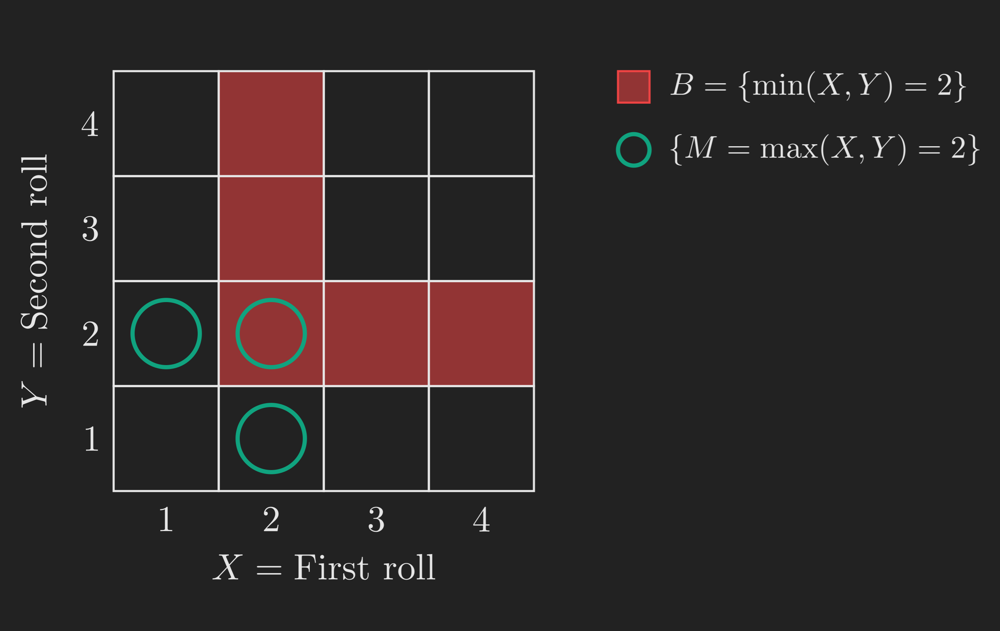
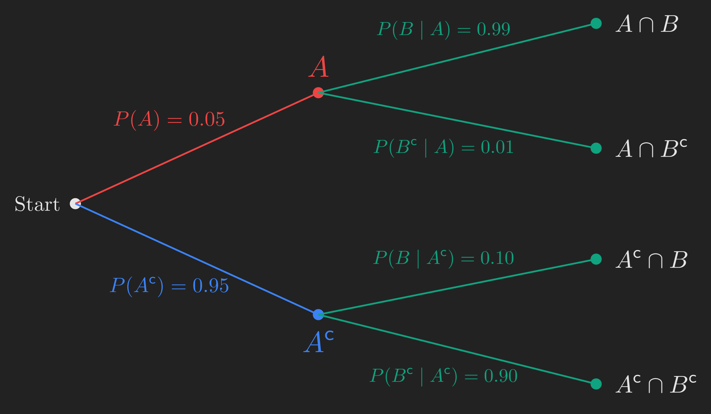
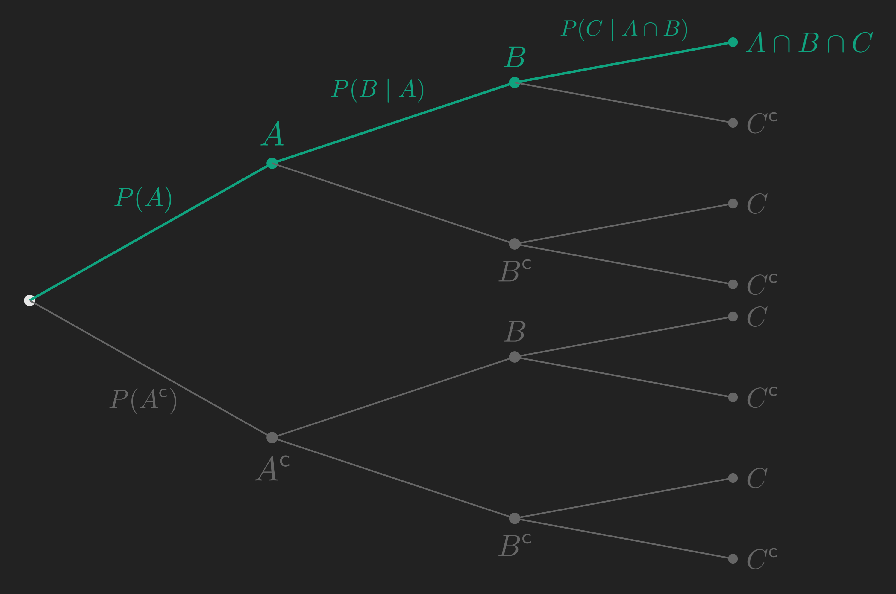
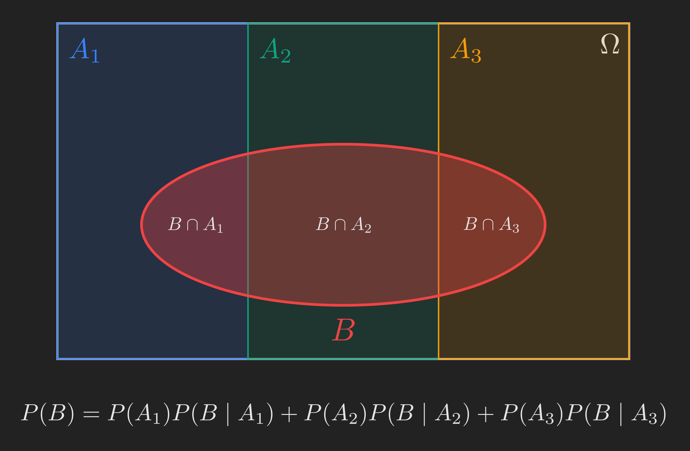

# Where We Left Off, And Where We're Headed

In the [last post](../probability-models-and-axioms/index.qmd), we built up a probability model from scratch. We picked a sample space (the set of all possible outcomes), we identified events (subsets of the sample space), and we assigned probabilities to those events using three axioms: non-negativity, normalization, and (countable) additivity for disjoint events.

That's a complete machinery for one particular state of knowledge. But here is the thing: real life rarely sits still. You set up your model, you write down your beliefs, and then someone tells you a new fact. Your phone buzzes with a severe weather alert and you wonder whether to cancel your hike. A medical test comes back positive and you wonder how worried to be. A radar fires and you wonder whether there is really a plane up there.

In each case, the question is the same. **What should our probabilities look like once we know something we did not know before?**

This post is about that question. We will define **conditional probability** carefully, build intuition for it on a tiny numerical example, and then unpack the three tools that fall out of it as natural consequences:

1. The **multiplication rule**, for finding the probability that several things happen together.
2. The **total probability theorem**, for finding the probability of an event when it can happen in many different ways.
3. **Bayes' rule**, for reasoning *backward* from an observation to its likely cause.

This is largely a walkthrough of Lecture 2 of MIT's 6.041 [@probabilistic-systems-analysis-applied-probability-playlist; @intro-to-probability-spring-2018-playlist] and Sections 1.3-1.4 of @bertsekas2008introduction. I will also pull in some examples and intuition from @blitzstein2019introduction where they help.

## The Roadmap

Before we set off, here is the trail we will be walking. The colored boxes branching off from the green definition node are the three tools, all of which sit on top of that same definition.

```{mermaid}
%%| fig-align: center
flowchart TD
    A["Lecture 1 recap<br/>sample space, events, axioms"] --> B["A new question:<br/>what if we learn something?"]
    B --> C["Conditional probability<br/>P(A | B) = P(A ∩ B) / P(B)"]
    C --> D["Tool 1: Multiplication rule<br/>probability of several things together"]
    C --> E["Tool 2: Total probability theorem<br/>probability of one event, many ways"]
    D --> F["Tool 3: Bayes' rule<br/>reasoning backward from effect to cause"]
    E --> F
    F --> G["Inference, learning from data,<br/>everything that comes next"]

    style C fill:#10a37f,color:#fff
    style D fill:#3b82f6,color:#fff
    style E fill:#3b82f6,color:#fff
    style F fill:#f59e0b,color:#fff
```

A small note on the path: notice that all three tools come from the same definition. That is the punchline of this post. Once you internalize what conditional probability *means*, the rest is bookkeeping.

::: {.callout-note collapse="true"}
## Sidebar: a subtle point from Lecture 1 worth pausing on

Last time we mentioned that the additivity axiom holds not just for two disjoint events but for any *sequence* (countably many) of disjoint events. The lecturer in 6.041 spent a few minutes on a beautiful little paradox to show why the word "sequence" matters. Here is the gist.

Take the unit square as your sample space, with probability equal to area. Every single point $(x, y)$ inside the square has area $0$, so $\mathrm{P}\left(\left\{(x, y)\right\}\right) = 0$. The whole unit square is the union of all its points. If we naively applied additivity, we would get

$$
1 = \mathrm{P}\left(\text{unit square}\right) = \sum_{(x, y)} \mathrm{P}\left(\left\{(x, y)\right\}\right) = \sum_{(x, y)} 0 = 0,
$$

which is nonsense.

The fix: the additivity axiom only applies to *countable* unions. The points in the unit square form an *uncountable* set, so we cannot list them as a sequence $A_1, A_2, A_3, \dots$. The axiom simply does not apply here, and there is no contradiction.

The takeaway is worth remembering: **zero probability does not mean impossible**. In continuous models, every individual outcome has probability zero, yet *some* individual outcome must occur whenever you run the experiment. Always expect the unexpected.

If you are comfortable taking this on faith, you can skip ahead.
:::

# Conditional Probability: Building the Intuition First

Let's not write any formulas yet. Let's just look at a picture.

Suppose our sample space contains three little pieces of probability mass, with values $3/6$, $2/6$, and $1/6$, as shown below. Everywhere else inside $\Omega$ has probability zero. We have an event $A$ (the red outline) that contains the leftmost two masses, and an event $B$ (the yellow outline) that contains the rightmost two masses. The middle mass, $2/6$, sits inside both $A$ and $B$, so it is exactly $A \cap B$.

{#fig-cond_prob_intuition fig-align="center" width=65%}

Initially, the probability of $B$ is $2/6 + 1/6 = 3/6 = 1/2$. The probability of $A$ is $3/6 + 2/6 = 5/6$. And the probability that *both* $A$ and $B$ happen, that is the probability of $A \cap B$, is $2/6$.

Now suppose someone walks up and tells you, "the outcome lies inside $B$." What should you believe now?

Let's think this through without a formula. You are now certain that $B$ occurred. So the probability of $B$ in your new world is $1$, not $1/2$. The old sample space outside $B$ is irrelevant; the new sample space is effectively $B$ itself.

Within $B$, there are two pieces of mass: one of size $2/6$ (which also lies inside $A$) and one of size $1/6$ (which lies outside $A$). Crucially, these two pieces still have the same *relative weights* as before. The first was twice as heavy as the second when we started, and that has not changed by us learning that we are inside $B$. We just need to rescale them so they add up to $1$.

So the new probabilities should be

$$
\frac{\frac{2}{6}}{\frac{2}{6} + \frac{1}{6}} = \frac{2}{3} \quad \text{and} \quad \frac{\frac{1}{6}}{\frac{2}{6} + \frac{1}{6}} = \frac{1}{3}.
$$

The first of these is the new probability that $A$ occurs, given that we know $B$ occurred. We write it as $\mathrm{P}(A \mid B) = 2/3$.

Notice what we did: we took the old probability of the overlap, $\mathrm{P}(A \cap B) = 2/6$, and divided by the old probability of $B$, $\mathrm{P}(B) = 3/6$. That is the formula. The intuition came first, the formula is just the bookkeeping.

## The Definition

Now we can write it down without it feeling sudden:

$$
\mathrm{P}(A \mid B) = \frac{\mathrm{P}(A \cap B)}{\mathrm{P}(B)},
$$ {#eq-conditional_probability_def}

and this is defined whenever $\mathrm{P}(B) > 0$. If $\mathrm{P}(B) = 0$, the conditional probability is simply undefined: it does not make sense to condition on an event that you believed could not happen.

Two things are worth highlighting before we move on.

**First, conditional probabilities are honest probabilities.** They satisfy all the same axioms as the original probability law: they are non-negative, $\mathrm{P}(\Omega \mid B) = 1$, and they are additive over disjoint events. When you condition on $B$, you get a *new* probability law on the same sample space (technically, a new probability law that puts all its mass inside $B$). That new law smells and tastes exactly like an ordinary probability law. So everything you know about probabilities still works after conditioning.

**Second, the definition has a nice frequentist reading.** If we ran the experiment many times, $\mathrm{P}(A \cap B)$ would be the fraction of trials where both $A$ and $B$ occurred, and $\mathrm{P}(B)$ would be the fraction where $B$ occurred. Their ratio is the fraction of $B$-trials in which $A$ also occurred. That is exactly what we mean by "the probability of $A$ given $B$": restrict your attention to the trials where $B$ happened, and ask how often $A$ happened among those.

## A Quick Warm-Up: Two Dice

Let's check our understanding on a small example before the bigger picture.

Roll a four-sided die twice. Let $X$ be the first roll and $Y$ the second. Assume all $16$ pairs $(X, Y)$ with $X, Y \in \{1, 2, 3, 4\}$ are equally likely, so each has probability $1/16$. Let $B$ be the event that $\min(X, Y) = 2$, and let $M = \max(X, Y)$.

The grid below shows the situation. Each cell of the grid is one outcome, $B$ is highlighted in one color, and we are about to ask about events involving $M$.

{#fig-dice_grid fig-align="center" width=80%}

What is $\mathrm{P}(M = 1 \mid B)$? If $\min(X, Y) = 2$, then both rolls are at least $2$, so the maximum is at least $2$, which means $M = 1$ is impossible. So $\mathrm{P}(M = 1 \mid B) = 0$.

What is $\mathrm{P}(M = 2 \mid B)$? Let's just use the definition. The event $\{M = 2\} \cap B$ means both $\min(X, Y) = 2$ and $\max(X, Y) = 2$, so both rolls are exactly $2$. That's a single outcome, so $\mathrm{P}(\{M = 2\} \cap B) = 1/16$. The event $B$ contains five outcomes: $(2, 2), (2, 3), (2, 4), (3, 2), (4, 2)$, so $\mathrm{P}(B) = 5/16$. Therefore

$$
\mathrm{P}(M = 2 \mid B) = \frac{1/16}{5/16} = \frac{1}{5}.
$$

Here is a shortcut that hints at a useful general principle. We started with a uniform distribution on the big sample space (every cell had probability $1/16$). When we conditioned on $B$, the five cells in $B$ were equally likely *before*, and conditioning preserves their relative weights, so they remain equally likely *after*. Each of the five cells in $B$ now has conditional probability $1/5$. We could have read the answer off in one step.

::: {.callout-tip}
## A useful general fact
If your original distribution is uniform on a finite sample space, then conditioning on any event $B$ gives you a uniform distribution on $B$. This is a small thing, but it saves time on a lot of problems.
:::

OK, the definition is clear, the dice example checks out. Now let's see why conditional probability matters beyond toy problems.

# A Real Example: The Radar and the Plane

Here is the scenario we will use for the rest of the post. There may or may not be an airplane flying overhead in some sector of the sky. From experience, the prior probability that a plane is up there is $5\%$. We have a radar pointed at that sector. The manufacturer tells us:

- If a plane is there, the radar registers a blip $99\%$ of the time, and misses it $1\%$ of the time.
- If no plane is there, the radar still fires a false alarm $10\%$ of the time, and stays silent $90\%$ of the time.

Let $A$ = "plane is there" and $B$ = "radar registers something." Then we have been told:

$$
\mathrm{P}(A) = 0.05, \quad \mathrm{P}(A^{\mathsf{c}}) = 0.95,
$$

and

$$
\mathrm{P}(B \mid A) = 0.99, \quad \mathrm{P}(B^{\mathsf{c}} \mid A) = 0.01, \quad \mathrm{P}(B \mid A^{\mathsf{c}}) = 0.10, \quad \mathrm{P}(B^{\mathsf{c}} \mid A^{\mathsf{c}}) = 0.90.
$$

Notice that the model is specified entirely in terms of conditional probabilities. We do not directly know $\mathrm{P}(B)$ or $\mathrm{P}(A \cap B)$. But we will see that we can compute everything we need from what we have.

A nice way to organize all this is a **probability tree**. Each level of the tree corresponds to one event. We branch left or right depending on whether it occurs, and we label each branch with the relevant conditional probability.

{#fig-radar_tree fig-align="center" width=90%}

The four leaves of the tree correspond to the four possible joint outcomes of "plane / no plane" and "radar fires / silent". We will now use this tree to do three things:

1. Find the probability of each leaf (this is the multiplication rule).
2. Find $\mathrm{P}(B)$, the probability the radar fires (this is the total probability theorem).
3. Find $\mathrm{P}(A \mid B)$, the probability there really is a plane *given* the radar fired (this is Bayes' rule).

Each of these will turn out to be a special case of a more general tool. We will use the radar example as the working illustration, then generalize.

# Tool 1: The Multiplication Rule

Look at the top branch of the tree, corresponding to "plane is there" and "radar fires". What is the probability of this joint event $A \cap B$?

We know $\mathrm{P}(A) = 0.05$, and we know that *given* $A$, the probability of $B$ is $\mathrm{P}(B \mid A) = 0.99$. The natural answer is to multiply:

$$
\mathrm{P}(A \cap B) = \mathrm{P}(A) \cdot \mathrm{P}(B \mid A) = 0.05 \times 0.99 = 0.0495.
$$

Why does this work? Just rearrange the definition of conditional probability. From @eq-conditional_probability_def we have $\mathrm{P}(B \mid A) = \mathrm{P}(A \cap B) / \mathrm{P}(A)$, so multiplying both sides by $\mathrm{P}(A)$ gives

$$
\mathrm{P}(A \cap B) = \mathrm{P}(A) \cdot \mathrm{P}(B \mid A).
$$ {#eq-multiplication_rule_two}

Frequentist reading: out of all trials, $5\%$ have a plane. Out of those plane-trials, $99\%$ also have the radar firing. So the fraction of trials where both happen is $5\% \times 99\% = 4.95\%$.

So to find the probability of any leaf in the tree, **multiply the probabilities along the branches that lead to it**. Easy.

## Generalizing to More Than Two Events

What if we have three events? Or four? The same idea works. For three events $A$, $B$, $C$:

$$
\mathrm{P}(A \cap B \cap C) = \mathrm{P}(A) \cdot \mathrm{P}(B \mid A) \cdot \mathrm{P}(C \mid A \cap B).
$$ {#eq-multiplication_rule_three}

The proof is just the two-event rule applied twice. Group the first two events and treat $A \cap B$ as a single event:

$$
\begin{align*}
  \mathrm{P}(A \cap B \cap C) &= \mathrm{P}((A \cap B) \cap C) \\
  &= \mathrm{P}(A \cap B) \cdot \mathrm{P}(C \mid A \cap B) \\
  &= \mathrm{P}(A) \cdot \mathrm{P}(B \mid A) \cdot \mathrm{P}(C \mid A \cap B).
\end{align*}
$$

In general, for $n$ events $A_1, A_2, \dots, A_n$:

$$
\begin{multline}
\mathrm{P}(A_1 \cap A_2 \cap \cdots \cap A_n) = \mathrm{P}(A_1) \cdot \mathrm{P}(A_2 \mid A_1) \cdot \mathrm{P}(A_3 \mid A_1 \cap A_2) \\\cdots \mathrm{P}(A_n \mid A_1 \cap \cdots \cap A_{n-1}).
\end{multline}
$$ {#eq-multiplication_rule_general}

This is sometimes called the **chain rule of probability**. Visually, it says: to find the probability of any leaf in a probability tree, multiply the conditional probabilities along the path from the root.

{#fig-multiplication_rule_general fig-align="center" width=90%}

We have our first tool. We can compute the probability of any leaf in any tree. But what if our event of interest is *not* a single leaf, but a collection of them? That is the next tool.

# Tool 2: The Total Probability Theorem

Now ask a different question: **what is $\mathrm{P}(B)$?** That is, what is the overall probability that the radar fires, ignoring whether or not a plane is up there?

The radar can fire in two distinct ways:

- The plane is there *and* the radar fires correctly. This contributes $\mathrm{P}(A \cap B) = 0.05 \times 0.99 = 0.0495$.
- The plane is *not* there *and* the radar fires falsely. This contributes $\mathrm{P}(A^{\mathsf{c}} \cap B) = 0.95 \times 0.10 = 0.095$.

These two scenarios are mutually exclusive (either the plane is there or it is not) and they are the only two ways for $B$ to happen. So by additivity:

$$
\mathrm{P}(B) = \mathrm{P}(A \cap B) + \mathrm{P}(A^{\mathsf{c}} \cap B) = 0.0495 + 0.095 = 0.1445.
$$

About $14\%$ of the time, the radar will fire. Now let's generalize.

## The General Statement

Suppose the sample space is partitioned into events $A_1, A_2, \dots, A_n$. "Partitioned" means the $A_i$'s are mutually exclusive ($A_i \cap A_j = \emptyset$ for $i \neq j$) and collectively exhaustive ($A_1 \cup A_2 \cup \cdots \cup A_n = \Omega$). Think of the $A_i$'s as a complete list of *scenarios*: in our radar example, "plane there" and "no plane" form a partition of size $2$. We could imagine a richer model with three scenarios: nothing in the sky, an airplane, or a flock of geese.

Now let $B$ be any event. Picture it as a region that cuts across the partition.

{#fig-total_probability_partition fig-align="center" width=75%}

The event $B$ is the disjoint union of $B \cap A_1$, $B \cap A_2$, $B \cap A_3$. So by additivity,

$$
\mathrm{P}(B) = \mathrm{P}(B \cap A_1) + \mathrm{P}(B \cap A_2) + \mathrm{P}(B \cap A_3),
$$

and applying the multiplication rule to each piece,

$$
\mathrm{P}(B) = \mathrm{P}(A_1) \mathrm{P}(B \mid A_1) + \mathrm{P}(A_2) \mathrm{P}(B \mid A_2) + \mathrm{P}(A_3) \mathrm{P}(B \mid A_3).
$$

In general, for a partition $A_1, A_2, \dots, A_n$:

$$
\mathrm{P}(B) = \sum_{i=1}^{n} \mathrm{P}(A_i) \mathrm{P}(B \mid A_i).
$$ {#eq-total_probability_theorem}

This is the **total probability theorem**. It is a divide-and-conquer formula: split the world into scenarios, compute the conditional probability of $B$ under each scenario, and average those conditional probabilities, weighted by how likely each scenario is.

A clean way to read this: $\mathrm{P}(B)$ is the **weighted average** of the conditional probabilities $\mathrm{P}(B \mid A_i)$, with weights $\mathrm{P}(A_i)$. (Notice that the weights sum to $1$ because the $A_i$'s form a partition, so this is a proper weighted average.) Special case: if the scenarios are equally likely, $\mathrm{P}(B)$ is just the plain average of $\mathrm{P}(B \mid A_1), \mathrm{P}(B \mid A_2), \dots, \mathrm{P}(B \mid A_n)$.

## A Quick Recap

Let's pause and reorient. Here is the roadmap with the parts we've covered marked in green.

```{mermaid}
%%| fig-align: center
flowchart TD
    A["Lecture 1 recap<br/>sample space, events, axioms"] --> B["A new question:<br/>what if we learn something?"]
    B --> C["Conditional probability<br/>P(A | B) = P(A ∩ B) / P(B)"]
    C --> D["Tool 1: Multiplication rule<br/>probability of several things together"]
    C --> E["Tool 2: Total probability theorem<br/>probability of one event, many ways"]
    D --> F["Tool 3: Bayes' rule<br/>reasoning backward from effect to cause"]
    E --> F
    F --> G["Inference, learning from data,<br/>everything that comes next"]

    style A fill:#10a37f,color:#fff
    style B fill:#10a37f,color:#fff
    style C fill:#10a37f,color:#fff
    style D fill:#10a37f,color:#fff
    style E fill:#10a37f,color:#fff
    style F fill:#3b82f6,color:#fff
    style G fill:#777,color:#fff
```

So far: we have a definition (conditional probability), and two tools that follow directly from it (multiplication rule, total probability). Both tools so far go in the *forward* direction: scenario implies event. We pick a scenario, we compute things from it.

But the most interesting probability questions usually go the other way. We don't get to observe the scenario directly; we observe an *effect*, and we want to figure out which scenario caused it. The radar fires, and we want to know if there is really a plane up there. The medical test is positive, and we want to know if the patient really has the disease. The phone's weather alert goes off, and we want to know how likely a storm really is.

That backward inference is what Bayes' rule is for.

# Tool 3: Bayes' Rule

Back to the radar. We've computed $\mathrm{P}(A) = 0.05$, $\mathrm{P}(A \cap B) = 0.0495$, and $\mathrm{P}(B) = 0.1445$. Now the interesting question:

> Given that the radar fired, what is the probability that there really is a plane up there?

That is $\mathrm{P}(A \mid B)$. Apply the definition directly:

$$
\mathrm{P}(A \mid B) = \frac{\mathrm{P}(A \cap B)}{\mathrm{P}(B)} = \frac{0.0495}{0.1445} \approx 0.34.
$$

About $34\%$. Pause on that. The radar's specs are great: $99\%$ true positive rate, only $10\%$ false positive rate. And yet, when the radar fires, the chance there is actually a plane up there is only $34\%$. The radar is more likely *wrong* than *right* in this case.

Why? Because **planes are rare**. In a random sample of trials, only $5\%$ have a plane. Of those, $99\%$ trigger the radar, so about $4.95\%$ of all trials are "plane and radar fires." But $95\%$ of all trials have *no* plane, and $10\%$ of those still trigger the radar, contributing $9.5\%$ of all trials as "no plane and radar fires." So when the radar fires, the false-alarm scenario is roughly twice as common as the true-positive scenario. The math just confirms what the relative frequencies suggest: about $4.95 / (4.95 + 9.5) \approx 0.34$.

The big lesson: when a positive test event is rare to begin with (a plane in the sky, a disease in the population), even a fairly accurate test can produce more false positives than true positives. Test reliability is not just about the test; it is about the test in combination with the **base rate** of what you're testing for.

::: {.callout-note collapse="true"}
## Sidebar: doctors get this wrong all the time

This is not a hypothetical concern. @gigerenzer2015calculated documents study after study where doctors, given the sensitivity, specificity, and prevalence of a condition, dramatically overstate the probability that a patient with a positive test result actually has the disease. The standard breast cancer screening example is roughly: prevalence about $1\%$, sensitivity about $90\%$, false positive rate about $9\%$. Plug those numbers into the calculation we just did and you find that a positive mammogram corresponds to about a $9\%$ chance of cancer, not $90\%$. Most physicians in the studies guessed somewhere between $70\%$ and $90\%$.

This is the same arithmetic as the radar problem. Same lesson. Different stakes.
:::

## The General Formula

We just used the definition of conditional probability twice:

$$
\mathrm{P}(A \mid B) = \frac{\mathrm{P}(A \cap B)}{\mathrm{P}(B)} = \frac{\mathrm{P}(A) \mathrm{P}(B \mid A)}{\mathrm{P}(B)}.
$$

The numerator came from the multiplication rule. The denominator we computed using the total probability theorem. Let's write the general version. Suppose the sample space is partitioned into scenarios $A_1, A_2, \dots, A_n$, we know the prior probabilities $\mathrm{P}(A_i)$ and the conditional probabilities $\mathrm{P}(B \mid A_i)$, and we observe that $B$ occurred. We want to know which scenario is most likely.

For each $i$:

$$
\mathrm{P}(A_i \mid B) = \frac{\mathrm{P}(A_i \cap B)}{\mathrm{P}(B)} = \frac{\mathrm{P}(A_i) \mathrm{P}(B \mid A_i)}{\sum_{j=1}^{n} \mathrm{P}(A_j) \mathrm{P}(B \mid A_j)}.
$$ {#eq-bayes_rule}

This is **Bayes' rule** [@bertsekas2008introduction; @blitzstein2019introduction]. The vocabulary that has grown around it is worth knowing:

- The $\mathrm{P}(A_i)$'s are called **prior probabilities**: what we believed about the scenarios *before* observing $B$.
- The $\mathrm{P}(B \mid A_i)$'s are called **likelihoods**: how probable the observation $B$ is, under each scenario.
- The $\mathrm{P}(A_i \mid B)$'s are called **posterior probabilities**: what we believe about the scenarios *after* observing $B$.

In the radar example, our prior was $\mathrm{P}(A) = 0.05$ (we thought there was a $5\%$ chance of a plane), and our posterior was $\mathrm{P}(A \mid B) = 0.34$ (after seeing the radar fire, we update to $34\%$). The observation moved us, but not as far as the radar's specs alone might have suggested.

## Why Bayes' Rule Matters

Take a step back. Bayes' rule **reverses the direction of conditioning**. Most of the time, what we have at hand is a *causal* model: we know how the world produces the observations we see. The world picks a scenario, and that scenario probabilistically produces an effect.

{#fig-bayes_rule_concept fig-align="center" width=80%}

What we usually care about is the *opposite* question. We see an effect (the radar firing, the test result, the sensor reading) and we want to know about the cause. Bayes' rule is the bridge. It takes the causal probabilities $\mathrm{P}(B \mid A_i)$, which we typically know from physics, biology, or engineering specs, and turns them into the inferential probabilities $\mathrm{P}(A_i \mid B)$, which are what we actually want for decision-making.

To make the belief update visceral, here is a short animation showing how the prior on "plane is there" ($5\%$) gets updated to the posterior ($34\%$) once the radar fires.

{#fig-bayes_belief_update fig-align="center" width=100%}

A bit of historical context for fun. The rule is named after Thomas Bayes, an 18th-century British minister and amateur mathematician who wrote a paper (published posthumously in 1763) addressing what was then a deep philosophical question: how can we learn from experience in a systematic way? Almost three centuries later, the answer he proposed is the foundation of nearly every inference procedure in modern statistics, machine learning, and AI [@blitzstein2019introduction].

# Wrapping Up

Let's close the loop. We started with a question: what should our probabilities look like once we know something we did not know before? We answered it with one definition (conditional probability) and three tools that all fall out of it.

```{mermaid}
%%| fig-align: center
flowchart TD
    A["Lecture 1 recap<br/>sample space, events, axioms"] --> B["A new question:<br/>what if we learn something?"]
    B --> C["Conditional probability<br/>P(A | B) = P(A ∩ B) / P(B)"]
    C --> D["Tool 1: Multiplication rule<br/>probability of several things together"]
    C --> E["Tool 2: Total probability theorem<br/>probability of one event, many ways"]
    D --> F["Tool 3: Bayes' rule<br/>reasoning backward from effect to cause"]
    E --> F
    F --> G["Inference, learning from data,<br/>everything that comes next"]

    style A fill:#10a37f,color:#fff
    style B fill:#10a37f,color:#fff
    style C fill:#10a37f,color:#fff
    style D fill:#10a37f,color:#fff
    style E fill:#10a37f,color:#fff
    style F fill:#10a37f,color:#fff
    style G fill:#10a37f,color:#fff
```

The key intuitions, in plain English:

- **Conditional probability** is the new probability law that applies once you learn something. It rescales the original law to live inside the event you've conditioned on.
- **The multiplication rule** says: to find the probability of several things happening together, walk down the probability tree and multiply along the branches.
- **The total probability theorem** says: to find the probability of one event that can happen in many ways, divide the world into scenarios and average the conditional probabilities, weighted by how likely each scenario is.
- **Bayes' rule** says: to reverse the direction of conditioning, combine the prior with the likelihood and renormalize. It is the formal answer to "I observed the effect; what was the cause?"

Going back to the opening hook: when your phone buzzes with a weather alert, what your brain is implicitly trying to do is Bayes' rule. The alert raises the posterior probability of a storm. *How much* it raises it depends on the prior (how often storms happen here this time of year) and the likelihood (how often the alert system fires falsely). If false alarms are common and storms are rare, you might rationally not cancel your hike. The radar problem and the weather alert problem are the same problem.

In the next post, we will look at a special situation that simplifies a lot of this: what happens when conditioning on $B$ does *not* change our beliefs about $A$? That is the idea of **independence**, and it turns out to be one of the most important and frequently misused concepts in all of probability.
