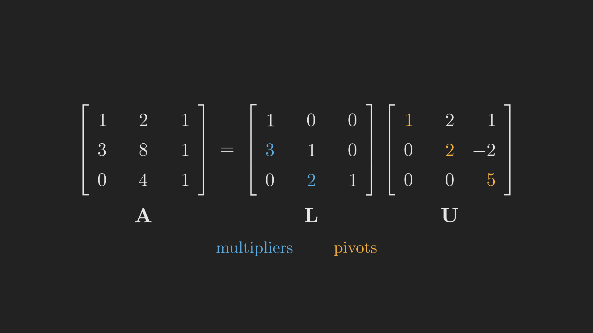
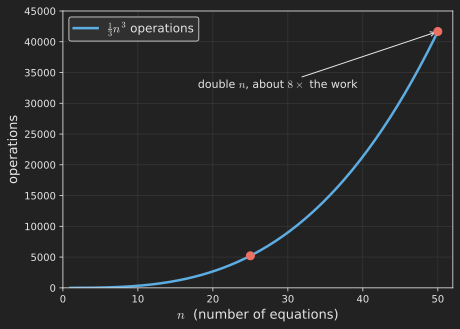

# Introduction

In [Part 1](../the-geometry-of-linear-equations/index.qmd) we met the central problem of the whole series, $\vb{A}\vb{x} = \vb{b}$, and looked at it through two lenses: the row picture (lines crossing) and the column picture (combining column vectors to reach a target). For a system of two equations in two unknowns, we found the answer by drawing a graph and reading off the crossing point.

That is charming, but it does not scale. Picture ten equations in ten unknowns. There is no graph paper for ten dimensions, and no eyeballing a crossing point. We need a procedure: a fixed sequence of arithmetic steps that solves *any* linear system, of any size, without ever drawing a picture. That procedure is **elimination**, and it is the workhorse that every piece of software quietly runs when it solves a linear system.

Here is the promise of this post. We will learn elimination on a concrete system, then make a discovery that is easy to miss: each elimination step is itself a matrix multiplication. Pulling on that thread leads us through the handful of ways to multiply matrices, to the *inverse* of a matrix (and the matrices that secretly have none), and to a clean and beautiful restatement of the whole process, the factorization $\vb{A} = \vb{L}\vb{U}$. We then tidy up two pieces that elimination quietly leaned on: the *permutations* that swap troublesome rows, and the *transpose* that flips a matrix onto its side. By the end, "solving a system" and "factoring a matrix" will look like two names for the same act. Like the rest of this series, the post follows Gilbert Strang's MIT 18.06 lectures [@MIT18.06SCLinearAlgebra2011] and his textbook *Introduction to Linear Algebra* [@Strang2023IntroductionLinearAlgebra].

## Where we are

```{mermaid}
%%| fig-align: center
flowchart LR
    subgraph ACT1["Act I: Solving Ax = b"]
        P1["1. Geometry"] --> P2["2. Elimination & LU"] --> P3["3. Column Space & Nullspace"] --> P4["4. Rank & Complete Solution"]
    end
    subgraph ACT2["Act II: Structure & Orthogonality"]
        P5["5. Basis & Four Subspaces"] --> P6["6. Graphs & Networks"] --> P7["7. Projections"] --> P8["8. Least Squares & QR"] --> P9["9. Determinants"]
    end
    subgraph ACT3["Act III: Eigenvalues & Beyond"]
        P10["10. Eigenvalues"] --> P11["11. Diagonalization & ODEs"] --> P12["12. Markov & Fourier"] --> P13["13. Positive Definite"] --> P14["14. Complex & FFT"] --> P15["15. Jordan Form"] --> P16["16. SVD"] --> P17["17. Transformations"] --> P18["18. Pseudoinverse"]
    end
    ACT1 --> ACT2 --> ACT3

    style P2 fill:#10a37f,color:#fff
```

We are at stop 2, still inside Act I, where the whole goal is to solve $\vb{A}\vb{x} = \vb{b}$ reliably.

Zooming in, here is the path this particular post takes. We begin with raw elimination and end at the transpose, and each step feeds the next.

```{mermaid}
%%| fig-align: center
flowchart TB
    A["Elimination to U"] --> B["Back-substitution"]
    B --> C["Multiplication:<br/>five ways"]
    C --> D["Elimination matrices E"]
    D --> E["Inverses &<br/>singular matrices"]
    E --> F["A = LU and A = LDU"]
    F --> G["Cost ~ n³/3"]
    G --> H["Permutations:<br/>PA = LU"]
    H --> I["Transpose &<br/>symmetry"]
```

# Elimination: a systematic recipe

Let us work with a slightly bigger system than last time, three equations in three unknowns:

$$
\begin{align*}
  x + 2y + z &= 2,\\
  3x + 8y + z &= 12,\\
  4y + z &= 2.
\end{align*}
$$

In matrix form $\vb{A}\vb{x} = \vb{b}$, this is

$$
\vb{A} =
\begin{bmatrix}
  1 & 2 & 1 \\
  3 & 8 & 1 \\
  0 & 4 & 1
\end{bmatrix},
\qquad
\vb{b} =
\begin{bmatrix} 2 \\ 12 \\ 2 \end{bmatrix}.
$$ {#eq-matrix_form}

The idea of elimination is to make the system progressively simpler by subtracting multiples of one equation from the others, until the last equation has just one unknown, the second-to-last has two, and so on. Then we solve from the bottom up. To keep the right-hand side in step with the left, we carry $\vb{b}$ along as an extra column, an *augmented matrix* $\left[\vb{A} \mid \vb{b}\right]$.

**Step 1: clear out the first column below the top-left corner.** The top-left entry, the boxed $1$, is our first *pivot*. We want zeros beneath it. The second row starts with $3$, so we subtract $3$ times the first row from the second row. The third row already starts with $0$, so it needs nothing.

$$
\left[\begin{array}{ccc|c}
  \boxed{1} & 2 & 1 & 2 \\
  3 & 8 & 1 & 12 \\
  0 & 4 & 1 & 2
\end{array}\right]
\xrightarrow{\;R_2 \,-\, 3R_1\;}
\left[\begin{array}{ccc|c}
  \boxed{1} & 2 & 1 & 2 \\
  0 & 2 & -2 & 6 \\
  0 & 4 & 1 & 2
\end{array}\right].
$$ {#eq-step_1_elimination}

**Step 2: clear out the second column below the new pivot.** The second pivot is the $2$ now sitting in the middle. The third row has a $4$ underneath it, so we subtract $\tfrac{4}{2} = 2$ times the second row from the third.

$$
\left[\begin{array}{ccc|c}
  \boxed{1} & 2 & 1 & 2 \\
  0 & \boxed{2} & -2 & 6 \\
  0 & 4 & 1 & 2
\end{array}\right]
\xrightarrow{\;R_3 \,-\, 2R_2\;}
\left[\begin{array}{ccc|c}
  \boxed{1} & 2 & 1 & 2 \\
  0 & \boxed{2} & -2 & 6 \\
  0 & 0 & \boxed{5} & -10
\end{array}\right].
$$ {#eq-step_2_elimination}

We are done eliminating. The left side is now **upper triangular**, meaning every entry below the diagonal is zero. We call it $\vb{U}$, and the three pivots sitting on its diagonal are $1$, $2$, and $5$:

$$
\vb{U} =
\begin{bmatrix}
  1 & 2 & 1 \\
  0 & 2 & -2 \\
  0 & 0 & 5
\end{bmatrix}.
$$ {#eq-matrix_U}

The pivots are worth pausing on. They are the entries we divide by, so they had better not be zero. For now all three pivots are nonzero, $1$, $2$, and $5$, which is exactly the signal that this system has one unique solution. (As a small bonus, their product $1 \times 2 \times 5 = 10$ is the *determinant* of $\vb{A}$, a number we will give its own post later in the series.)

But what if a zero does land in a pivot position? There are two very different cases, and telling them apart is the whole game:

- **Temporary trouble.** The zero is just an accident of ordering, and some row below has a nonzero entry in that column. We swap the two rows and carry on. (We will see exactly how a swap becomes a matrix, a *permutation*, later in this post.)
- **Permanent trouble.** Every row below also has a zero in that column, so no swap can rescue the pivot. The matrix then ends up with fewer pivots than rows, and, as we will see when we meet *singular* matrices, it has no inverse and the system loses its single unique solution.

For our matrix neither mishap occurs: all three pivots appear, so we sail straight through.

**Back-substitution.** The augmented matrix we just reached (@eq-step_2_elimination) is really a system of equations again, only a much friendlier one. Writing its three rows back out and lining up the unknowns, the upper-triangular system is

$$
\begin{array}{rcrcrcr}
  x & + & 2y & + &  z & = &  2, \\
    &   & 2y & - & 2z & = &  6, \\
    &   &    &   & 5z & = & -10.
\end{array}
$$ {#eq-upper_system}

The staircase in @eq-upper_system is the whole point. The top row still carries all three unknowns, the middle row has lost $x$, and the bottom row has only $z$ left. That shrinking is exactly what lets us solve the system from the bottom up, one unknown at a time.

Start at the bottom. The last row of @eq-upper_system says $5z = -10$, so

$$
z = -2.
$$

Move up to the middle row of @eq-upper_system, which says $2y - 2z = 6$. Substituting $z = -2$ turns it into $2y + 4 = 6$, so

$$
y = 1.
$$

Finally, climb to the top row of @eq-upper_system, which says $x + 2y + z = 2$. Substituting $y = 1$ and $z = -2$ turns it into $x + 2 - 2 = 2$, so

$$
x = 2.
$$

Collecting the three values, the solution is

$$
\left(x, y, z\right) = \left(2, 1, -2\right).
$$

@fig-elimination_flow summarizes the whole procedure as a flowchart. The forward pass marches down the pivots, turning $\vb{A}$ into $\vb{U}$; the backward pass climbs back up, peeling off one unknown per row.

```{mermaid}
%%| fig-align: center
%%| label: fig-elimination_flow
%%| fig-cap: "Elimination as an algorithm: a forward pass to an upper-triangular U, then back-substitution from the bottom up."
flowchart TB
    A["Start with the augmented matrix [A | b]"] --> B["Move to the next pivot on the diagonal"]
    B --> C{"Is the pivot zero?"}
    C -->|"yes"| D["Swap in a lower row with a nonzero entry there"]
    C -->|"no"| E["Subtract multiples of the pivot row to make zeros below the pivot"]
    D --> E
    E --> F{"Any pivots left below?"}
    F -->|"yes"| B
    F -->|"no"| G["Upper-triangular U reached"]
    G --> H["Back-substitute from the bottom row up"]
    H --> I["Read off the solution x"]
```

This works, it is mechanical, and a computer can run it on a million equations. But there is something deeper hiding in those "subtract a multiple of one row from another" steps. Let us look closer.

# Each elimination step is a matrix multiplication

Here is the realization that turns elimination from a hand procedure into algebra. Every step we just did, "subtract 3 times row 1 from row 2", can be performed by *multiplying on the left by a carefully chosen matrix*. To see how, we first need to know what it means to multiply two matrices.

## How to multiply two matrices

Everything that follows rests on this one operation, so let us slow down and look at it from every useful angle. There is more than one way to multiply two matrices; they all produce the same answer, and each is the *natural* way to think in some situation [@MIT18.06SCLinearAlgebra2011]. We will collect five of them. Throughout, we multiply an $m \times n$ matrix $\vb{A}$ by an $n \times p$ matrix $\vb{B}$ to get an $m \times p$ matrix $\vb{C}$, i.e.,

$$
\underbrace{\begin{bmatrix}
  c_{11} & c_{12} & \cdots & c_{1p}\\
  c_{21} & c_{22} & \cdots & c_{2p}\\
  \vdots & \vdots & c_{ij} & \vdots\\
  c_{m1} & c_{m2} & \cdots & c_{mp}
\end{bmatrix}}_{\vb{C}_{(m\times p)}}
=
\underbrace{\begin{bmatrix}
  a_{11} & a_{12} & \cdots & a_{1n}\\
  a_{21} & a_{22} & \cdots & a_{2n}\\
  \vdots & \vdots & a_{ik} & \vdots\\
  a_{m1} & a_{m2} & \cdots & a_{mn}
\end{bmatrix}}_{\vb{A}_{(m\times n)}}
\underbrace{\begin{bmatrix}
  b_{11} & b_{12} & \cdots & b_{1p}\\
  b_{21} & b_{22} & \cdots & b_{2p}\\
  \vdots & \vdots & b_{kj} & \vdots\\
  b_{n1} & b_{n2} & \cdots & b_{np}
\end{bmatrix}}_{\vb{B}_{(n\times p)}}.
$$ {#eq-C_equals_AB}

For this to even make sense, the number of columns of $\vb{A}$ must equal the number of rows of $\vb{B}$, which is the shared "$n$".

**The building block: a matrix times a vector.** In [Part 1](../the-geometry-of-linear-equations/index.qmd) we agreed that a matrix times a vector is a linear combination of the matrix's columns, with the entries of the vector telling us how much of each column to take:

$$
\begin{bmatrix} a & b \\ c & d \end{bmatrix}
\begin{bmatrix} x_1 \\ x_2 \end{bmatrix}
= x_1 \begin{bmatrix} a \\ c \end{bmatrix}
+ x_2 \begin{bmatrix} b \\ d \end{bmatrix}
= \begin{bmatrix} x_1 a + x_2 b \\ x_1 c + x_2 d \end{bmatrix}.
$$

The result is a single column vector. Keep this picture nearby; most of the five ways are just this idea applied cleverly.

### Way 1: one entry at a time (row dot column)

The most familiar rule builds $\vb{C}$ one number at a time. Have a look at @eq-C_equals_AB. The entry of $\vb{C}$ in row $i$, column $j$ is the *dot product* of row $i$ of $\vb{A}$ with column $j$ of $\vb{B}$:

$$
c_{ij} = \sum_{k=1}^{n} a_{ik} b_{kj}.
$$ {#eq-mult_entry}

In words, run along row $i$ of $\vb{A}$ and down column $j$ of $\vb{B}$, multiply the pairs, and add. For example, the entry $c_{34}$ draws on row $3$ of $\vb{A}$ and column $4$ of $\vb{B}$ alone, nothing else. This is the rule most of us learned first, and it is the one we reach for when we want to check just a single entry of a product by hand.

### Way 2: one column at a time

A matrix is nothing more than a row of column vectors standing side by side. Writing $\vb{B}$ as its columns $\vb{b}_1, \vb{b}_2, \dots, \vb{b}_p$,

$$
\vb{B} =
\begin{bmatrix}
  \uparrow & \uparrow & & \uparrow \\
  \vb{b}_1 & \vb{b}_2 & \cdots & \vb{b}_p \\
  \downarrow & \downarrow & & \downarrow
\end{bmatrix},
$$

we apply the building block once for each column. The $j$-th column of $\vb{C} = \vb{A}\vb{B}$ is simply $\vb{A}$ times the $j$-th column of $\vb{B}$:

$$
\vb{A}\vb{B} =
\underbrace{\begin{bmatrix}
  \uparrow & \uparrow & & \uparrow \\
  \vb{A}\vb{b}_1 & \vb{A}\vb{b}_2 & \cdots & \vb{A}\vb{b}_p \\
  \downarrow & \downarrow & & \downarrow
\end{bmatrix}}_{\vb{C}}.
$$ {#eq-mult_columns}

So **every column of $\vb{C}$ is a combination of the columns of $\vb{A}$**, and column $j$ of $\vb{B}$ holds the weights of that combination.

### Way 3: one row at a time

There is a mirror image of Way 2, and it is the one elimination will lean on. Reading the product by rows instead of columns, **row $i$ of $\vb{C} = \vb{A}\vb{B}$ is a linear combination of the rows of $\vb{B}$, with the entries in row $i$ of $\vb{A}$ serving as the weights**:

$$
\text{row } i \text{ of } \underbrace{\vb{A}\vb{B}}_{\vb{C}} = \left(\text{row } i \text{ of } \vb{A}\right) \vb{B}.
$$ {#eq-mult_rows}

Columns of the answer come from $\vb{A}$; rows of the answer come from $\vb{B}$. We will lean on this view in a moment, because "build a new row as a combination of the existing rows" is exactly what an elimination step does.

### Way 4: columns times rows (a sum of simple pieces)

Ways 2 and 3 multiplied a matrix by a vector. What if we go the other way and multiply a *column* by a *row*? A column of $\vb{A}$ is $m \times 1$ and a row of $\vb{B}$ is $1 \times p$, so their product is a full $m \times p$ matrix. For instance,

$$
\begin{bmatrix} 2 \\ 3 \\ 4 \end{bmatrix}
\begin{bmatrix} 1 & 6 \end{bmatrix}
=
\begin{bmatrix} 2 & 12 \\ 3 & 18 \\ 4 & 24 \end{bmatrix}.
$$

This is a very special matrix: every column is a multiple of $\left(2, 3, 4\right)$ and every row is a multiple of $\left(1, 6\right)$ (a "rank-one" matrix, a notion we will make precise in a later post). The fourth way says the whole product is a **sum of these simple pieces**, one for each shared index $k$:

$$
\vb{A}\vb{B} = \sum_{k=1}^{n} \left(\text{column } k \text{ of } \vb{A}\right)\left(\text{row } k \text{ of } \vb{B}\right).
$$ {#eq-mult_outer}

### Way 5: block by block

Finally, we can chop both matrices into rectangular **blocks** (as long as the splits line up) and multiply as if the blocks were ordinary entries:

$$
\begin{bmatrix} \vb{A}_1 & \vb{A}_2 \\ \vb{A}_3 & \vb{A}_4 \end{bmatrix}
\begin{bmatrix} \vb{B}_1 & \vb{B}_2 \\ \vb{B}_3 & \vb{B}_4 \end{bmatrix}
=
\begin{bmatrix} \vb{A}_1\vb{B}_1 + \vb{A}_2\vb{B}_3 & \vb{A}_1\vb{B}_2 + \vb{A}_2\vb{B}_4 \\ \vb{A}_3\vb{B}_1 + \vb{A}_4\vb{B}_3 & \vb{A}_3\vb{B}_2 + \vb{A}_4\vb{B}_4 \end{bmatrix}.
$$

The top-left block, for instance, is $\vb{A}_1\vb{B}_1 + \vb{A}_2\vb{B}_3$, exactly the "row of blocks times column of blocks" pattern from Way 1, just one level up. This is how large matrix multiplications are actually organized on real hardware: by working on sub-blocks that fit in fast memory.

### Five views, one product

@tbl-five_ways collects all five. They are not five different operations; they are five lenses on the same $\vb{C} = \vb{A}\vb{B}$, and across the series we will reach for whichever one makes the idea at hand clearest.

::: {.tbl tbl-colwidths="auto"}
| View | How you build $\vb{C} = \vb{A}\vb{B}$ | The picture |
|:--|:--|:--|
| Entry | $c_{ij} = \sum_k a_{ik} b_{kj}$ | each entry is a row-times-column dot product |
| Columns | column $j$ of $\vb{C}$ is $\vb{A}\,\left(\text{column } j \text{ of } \vb{B}\right)$ | columns of $\vb{C}$ combine the columns of $\vb{A}$ |
| Rows | row $i$ of $\vb{C}$ is $\left(\text{row } i \text{ of } \vb{A}\right)\,\vb{B}$ | rows of $\vb{C}$ combine the rows of $\vb{B}$ |
| Outer products | $\vb{C} = \sum_k \left(\text{col } k \text{ of } \vb{A}\right)\left(\text{row } k \text{ of } \vb{B}\right)$ | a sum of simple rank-one matrices |
| Blocks | multiply matching sub-blocks | the same rule, one level up |

: The five ways to multiply two matrices, all giving the same $\vb{C} = \vb{A}\vb{B}$. {#tbl-five_ways style="width:90%; margin:auto;"}
:::

### Back to elimination: the row view in action

Of the five, the one that turns elimination into algebra is Way 3, the row view (@eq-mult_rows). Let us watch it on a small example. To keep the arithmetic light, take just the top-left $2 \times 2$ corner of our system's matrix (@eq-matrix_form), together with a matrix $\vb{E}$ whose second row reads "$-3, 1$":

$$
\vb{A} = \begin{bmatrix} 1 & 2 \\ 3 & 8 \end{bmatrix},
\qquad
\vb{E} = \begin{bmatrix} 1 & 0 \\ -3 & 1 \end{bmatrix}.
$$

Row $1$ of $\vb{E}$ is $\left(1, 0\right)$, so row $1$ of $\vb{E}\vb{A}$ is $1 \cdot \left(1, 2\right) + 0 \cdot \left(3, 8\right) = \left(1, 2\right)$, the first row of $\vb{A}$ left untouched. Row $2$ of $\vb{E}$ is $\left(-3, 1\right)$, so row $2$ of $\vb{E}\vb{A}$ is $-3 \cdot \left(1, 2\right) + 1 \cdot \left(3, 8\right) = \left(0, 2\right)$. Stacking the two rows back together,

$$
\vb{E}\vb{A} =
\begin{bmatrix} 1 & 0 \\ -3 & 1 \end{bmatrix}
\begin{bmatrix} 1 & 2 \\ 3 & 8 \end{bmatrix}
= \begin{bmatrix} 1 & 2 \\ 0 & 2 \end{bmatrix}.
$$

Look at what happened to $\vb{A}$: its first row stayed put, and its second row became (old row $2$) minus $3$ times (row $1$). That is precisely an elimination step. Here is the punchline we will keep using: **combining the rows of a matrix according to a fixed recipe is the same as multiplying that matrix on the left by the matrix that stores the recipe.** The entire rest of the post, the elimination matrices, the inverse, and the factorization $\vb{A} = \vb{L}\vb{U}$, runs on this single idea.

## The elimination matrices

Recall that our system of equations is given by @eq-matrix_form, i.e.,

$$
\vb{A} =
\begin{bmatrix}
  1 & 2 & 1 \\
  3 & 8 & 1 \\
  0 & 4 & 1
\end{bmatrix},
\qquad
\vb{b} =
\begin{bmatrix} 2 \\ 12 \\ 2 \end{bmatrix}.
$$

Now, each step of the forward pass is carried out by its own **elimination matrix** (also called an *elementary matrix* in many textbooks), and every one is built from the identity in the same simple way. Recall the two moves we made by hand back in the elimination section: Step 1 was the row operation $R_2 - 3R_1$ (@eq-step_1_elimination), and Step 2 was $R_3 - 2R_2$ (@eq-step_2_elimination). We will now rebuild each of them as a single matrix and watch the two descriptions agree.

How do we find that matrix, without guessing? Way 3 of multiplication is exactly the right tool. It told us that **each row of the product $\vb{E}_{21}\vb{A}$ is one row of $\vb{E}_{21}$ acting on $\vb{A}$, picking out a combination of the rows of $\vb{A}$** (@eq-mult_rows). So we can build $\vb{E}_{21}$ one row at a time, just by asking what we want each output row to be. Picture $\vb{E}_{21}$ as three rows stacked on top of each other; each one, times $\vb{A}$, produces a single row of the answer.

We want the product to keep rows $1$ and $3$ of $\vb{A}$ and to replace row $2$ by "row $2$ minus $3$ times row $1$." Reading off the weights for each output row:

- Output **row 1** is just row $1$ of $\vb{A}$ left alone, the combination $1\cdot\left(\text{row }1\right) + 0\cdot\left(\text{row }2\right) + 0\cdot\left(\text{row }3\right)$. So the first row of $\vb{E}_{21}$ is $\left(1, 0, 0\right)$, exactly the identity's first row.
- Output **row 3** is row $3$ left alone, so by the same reasoning the third row of $\vb{E}_{21}$ is $\left(0, 0, 1\right)$.
- Output **row 2** is row $2$ minus $3$ times row $1$, the combination $-3\cdot\left(\text{row }1\right) + 1\cdot\left(\text{row }2\right) + 0\cdot\left(\text{row }3\right)$. So the second row of $\vb{E}_{21}$ is $\left(-3, 1, 0\right)$.

Stacking those three rows, the matrix builds itself:

$$
\vb{E}_{21} =
\begin{bmatrix}
  1 & 0 & 0 \\
  -3 & 1 & 0 \\
  0 & 0 & 1
\end{bmatrix}.
$$ {#eq-E_21}

Look at where the $-3$ landed: row $2$, column $1$, the $\left(2, 1\right)$ slot, which is exactly why we name the matrix $\vb{E}_{21}$. Its value is no accident either. Subtracting $3$ times row $1$ is the same as *adding* $-3$ times row $1$, and "how much of row $1$ to fold into the new row $2$" is precisely the weight that sits in column $1$ of that second row. So the multiplier $3$ from the hand step reappears as the $-3$ in the $\left(2, 1\right)$ position, its sign flipped because we are subtracting. In practice you can skip the row-by-row reasoning and just start from the identity and drop a single $-3$ into the $\left(2, 1\right)$ slot, but it is worth seeing once why that shortcut is right.

Placing the hand operation next to the multiplication, both land on the very same matrix:

:::: {.columns}
::: {.column width="48%"}
**Step 1, by hand:**

$$
\underbrace{\begin{bmatrix}
  1 & 2 & 1 \\
  3 & 8 & 1 \\
  0 & 4 & 1
\end{bmatrix}}_{\vb{A}} \xrightarrow{\;R_2 - 3R_1\;}
\begin{bmatrix}
  1 & 2 & 1 \\
  0 & 2 & -2 \\
  0 & 4 & 1
\end{bmatrix}
$$
:::
::: {.column width="4%"}
:::
::: {.column width="48%"}
**Step 1, as a multiplication:**

$$
\underbrace{\begin{bmatrix}
  1 & 0 & 0 \\
  -3 & 1 & 0 \\
  0 & 0 & 1
\end{bmatrix}}_{\vb{E}_{21}}
\underbrace{\begin{bmatrix}
  1 & 2 & 1 \\
  3 & 8 & 1 \\
  0 & 4 & 1
\end{bmatrix}}_\vb{A}
=
\underbrace{\begin{bmatrix}
  1 & 2 & 1 \\
  0 & 2 & -2 \\
  0 & 4 & 1
\end{bmatrix}}_{\vb{E}_{21} \vb{A}}
$$
:::
::::

The second step, "subtract $2$ times row $2$ from row $3$", is built the very same way. This time only output row $3$ changes, to row $3$ minus $2$ times row $2$, the combination $-2\cdot\left(\text{row }2\right) + 1\cdot\left(\text{row }3\right)$. That drops a $-2$ into row $3$, column $2$, and leaves every other row as in the identity:

$$
\vb{E}_{32} =
\begin{bmatrix}
  1 & 0 & 0 \\
  0 & 1 & 0 \\
  0 & -2 & 1
\end{bmatrix}.
$$ {#eq-E_32}

Left-multiplying the once-eliminated matrix by $\vb{E}_{32}$ clears the last entry below the diagonal, and again the hand step and the multiplication agree, this time landing on $\vb{U}$:

:::: {.columns}
::: {.column width="48%"}
**Step 2, by hand:**

$$
\begin{bmatrix}
  1 & 2 & 1 \\
  0 & 2 & -2 \\
  0 & 4 & 1
\end{bmatrix}
\xrightarrow{\;R_3 - 2R_2\;}
\underbrace{
\begin{bmatrix}
  1 & 2 & 1 \\
  0 & 2 & -2 \\
  0 & 0 & 5
\end{bmatrix}
}_{\vb{U}}
$$
:::
::: {.column width="4%"}
:::
::: {.column width="48%"}
**Step 2, as a multiplication:**

$$
\underbrace{
\begin{bmatrix}
  1 & 0 & 0 \\
  0 & 1 & 0 \\
  0 & -2 & 1
\end{bmatrix}
}_{\vb{E}_{32}}
\underbrace{
\begin{bmatrix}
  1 & 2 & 1 \\
  0 & 2 & -2 \\
  0 & 4 & 1
\end{bmatrix}
}_{\vb{E}_{21}\vb{A}}
=
\underbrace{
\begin{bmatrix}
  1 & 2 & 1 \\
  0 & 2 & -2 \\
  0 & 0 & 5
\end{bmatrix}
}_{\vb{U}}
$$
:::
::::

Applying first $\vb{E}_{21}$ and then $\vb{E}_{32}$ has carried $\vb{A}$ all the way to $\vb{U}$. Because matrix multiplication is associative, we can drop the parentheses and bundle the two steps into a single matrix $\vb{E} = \vb{E}_{32}\vb{E}_{21}$, so that $\vb{E}\vb{A} = \vb{U}$. In words: there is one matrix $\vb{E}$ that captures the entire forward pass of elimination. The whole hand procedure has become a single multiplication.

This is lovely, but $\vb{E}$ as written is a slightly awkward object (it mixes both steps together). The natural question is: can we *undo* elimination, and get back from $\vb{U}$ to $\vb{A}$? Answering that gives us the inverse, and then the clean factorization we are after.

# Undoing a matrix: the inverse

For an ordinary number like $3$, "undoing multiplication by $3$" means multiplying by $\tfrac{1}{3}$, because $\tfrac{1}{3}\cdot 3 = 1$. The matrix version is the same idea. The **inverse** of a square matrix $\vb{A}$, written $\vb{A}^{-1}$, is the matrix that satisfies

$$
\vb{A}^{-1}\vb{A} = \vb{I},
$$

where $\vb{I}$ is the identity matrix (the matrix that leaves every vector unchanged, the matrix analogue of the number $1$). Not every matrix has an inverse; the ones that do are exactly the *invertible*, or *nonsingular*, matrices we first ran into in [Part 1](../the-geometry-of-linear-equations/index.qmd), the ones whose columns can reach every target $\vb{b}$.

## When does a matrix have no inverse?

Before computing any inverses, we should ask which matrices even have one. To keep the pictures in the plane, we switch to small $2 \times 2$ examples for this part (our running $3 \times 3$ $\vb{A}$ steps aside for a moment). The cleanest way to understand success is to stare at a failure:

$$
\vb{A} = \begin{bmatrix} 1 & 3 \\ 2 & 6 \end{bmatrix}.
$$ {#eq-singular_matrix}

This matrix has no inverse, and there are two revealing ways to see why.

**The column picture.** Its columns, $\left(1, 2\right)$ and $\left(3, 6\right)$, are not independent: the second is exactly three times the first, so both lie on the *same line* through the origin (@fig-singular_vs_invertible, left). Every combination of them stays on that line. But Way 2 of multiplication (@eq-mult_columns) told us that the columns of any product $\vb{A}\vb{B}$ are combinations of the columns of $\vb{A}$. So whatever $\vb{B}$ we choose, $\vb{A}\vb{B}$ can only have columns on that one line, and the identity's first column $\left(1, 0\right)$ is not on it. We can never reach $\vb{A}\vb{B} = \vb{I}$, so no inverse exists.

**The $\vb{A}\vb{x} = \vb{0}$ picture (Strang's favorite).** Because the columns are dependent, some combination of them reaches zero. Taking $3$ of the first minus $1$ of the second gives the zero vector, that is, $\vb{A}\vb{x} = \vb{0}$ for the *nonzero* vector $\vb{x} = \left(3, -1\right)$:

$$
\begin{bmatrix} 1 & 3 \\ 2 & 6 \end{bmatrix}
\begin{bmatrix} 3 \\ -1 \end{bmatrix}
=
\begin{bmatrix} 0 \\ 0 \end{bmatrix}.
$$ {#eq-singular_nullvector}

That single fact is fatal to invertibility. Suppose an inverse $\vb{A}^{-1}$ existed; multiply both sides of $\vb{A}\vb{x} = \vb{0}$ on the left by it:

$$
\vb{A}^{-1}\vb{A}\vb{x} = \vb{A}^{-1}\vb{0}
\quad\Longrightarrow\quad
\vb{x} = \vb{0}.
$$

But $\vb{x} = \left(3, -1\right)$ is not zero, a contradiction. So no inverse can exist: once a nonzero vector has been sent to zero, nothing can bring it back. This gives a clean test: **a square matrix is invertible exactly when the only solution of $\vb{A}\vb{x} = \vb{0}$ is $\vb{x} = \vb{0}$.**

Contrast a matrix that *does* have an inverse. Change the bottom-right entry from $6$ to $1$:

$$
\vb{A} = \begin{bmatrix} 1 & 3 \\ 2 & 1 \end{bmatrix}.
$$ {#eq-invertible_matrix}

Now the columns $\left(1, 2\right)$ and $\left(3, 1\right)$ point in genuinely different directions (@fig-singular_vs_invertible, right): one climbs steeply, the other runs out almost flat. Their combinations sweep out the whole plane, every target is reachable, and the only way to land on zero is to take none of either column. This matrix is invertible, and a systematic way to compute any inverse is coming up next.

{#fig-singular_vs_invertible fig-align="center" width=95%}

For square matrices, one more convenience holds: a **left inverse** is automatically a **right inverse**. If a matrix $\vb{B}$ satisfies $\vb{B}\vb{A} = \vb{I}$ (a left inverse, sitting on the left of $\vb{A}$), then it also satisfies $\vb{A}\vb{B} = \vb{I}$ (a right inverse), so the two coincide. We rename $\vb{B}$ as $\vb{A}^{-1}$ and speak of *the* inverse, the single matrix that returns the identity from either side:

$$
\vb{A}^{-1}\vb{A} = \vb{A}\vb{A}^{-1} = \vb{I}.
$$

This is genuinely useful and, as Strang notes, not as easy to prove as it looks. (For rectangular matrices the two sides come apart: a left inverse need not be a right inverse, a story we save for the later post on the pseudoinverse.)

## Inverting an elimination matrix

Our elimination matrices are easy to invert, because undoing a row operation is itself a row operation. To undo "subtract $3$ times row $1$ from row $2$", you simply *add* $3$ times row $1$ back to row $2$. So the inverse of $\vb{E}_{21}$ just flips the sign of that off-diagonal entry:

$$
\vb{E}_{21} =
\begin{bmatrix} 1 & 0 & 0 \\ -3 & 1 & 0 \\ 0 & 0 & 1 \end{bmatrix},
\qquad
\vb{E}_{21}^{-1} =
\begin{bmatrix} 1 & 0 & 0 \\ 3 & 1 & 0 \\ 0 & 0 & 1 \end{bmatrix}.
$$ {#eq-E_21_inverse}

One rule about inverses will matter in a moment. When you invert a product, the order reverses:

$$
\left(\vb{A}\vb{B}\right)^{-1} = \vb{B}^{-1}\vb{A}^{-1}.
$$

The intuition is the same as taking off your shoes and socks: you put socks on first and shoes second, so to undo it you take the shoes off first and the socks second. To undo "$\vb{A}$ then $\vb{B}$" you undo $\vb{B}$ first, then $\vb{A}$.

## Computing an inverse by elimination: Gauss-Jordan

How do we find an inverse when the matrix is not a simple elimination matrix? Elimination does that job too. The trick is to solve $\vb{A}\vb{A}^{-1} = \vb{I}$ for the unknown matrix $\vb{A}^{-1}$ by running elimination on $\vb{A}$ with the identity carried along as the right-hand side. We write the augmented matrix $\left[\vb{A} \mid \vb{I}\right]$ and eliminate until the left block becomes $\vb{I}$; whatever the right block has turned into is $\vb{A}^{-1}$. This is the **Gauss-Jordan** method.

Let us run it on a small matrix chosen to keep the arithmetic clean (a different invertible $2 \times 2$ from the one in @eq-invertible_matrix, picked because its inverse comes out in whole numbers):

$$
\vb{A} = \begin{bmatrix} 1 & 3 \\ 2 & 7 \end{bmatrix}.
$$

Start with $\left[\vb{A} \mid \vb{I}\right]$ and eliminate downward (subtract $2$ times row $1$ from row $2$), then upward (subtract $3$ times the new row $2$ from row $1$):

$$
\left[\begin{array}{cc|cc}
  1 & 3 & 1 & 0 \\
  2 & 7 & 0 & 1
\end{array}\right]
\xrightarrow{\;R_2 - 2R_1\;}
\left[\begin{array}{cc|cc}
  1 & 3 & 1 & 0 \\
  0 & 1 & -2 & 1
\end{array}\right]
\xrightarrow{\;R_1 - 3R_2\;}
\left[\begin{array}{cc|cc}
  1 & 0 & 7 & -3 \\
  0 & 1 & -2 & 1
\end{array}\right].
$$

The left block is now the identity, so the right block is the inverse:

$$
\vb{A}^{-1} = \begin{bmatrix} 7 & -3 \\ -2 & 1 \end{bmatrix}.
$$

You can confirm $\vb{A}^{-1}\vb{A} = \vb{I}$ by direct multiplication. The same procedure works for any invertible matrix of any size; if the left block ever fails to reduce to $\vb{I}$ (a pivot goes missing), that is elimination telling you the matrix is singular and has no inverse.

We now have everything we need to state the punchline of the post.

# The payoff: A = LU

Recall that the forward pass of elimination gave us $\vb{E}\vb{A} = \vb{U}$, where $\vb{E} = \vb{E}_{32}\vb{E}_{21}$ bundled both steps. So, using @eq-E_21 and @eq-E_32, we get

$$
\vb{E} =
\underbrace{\begin{bmatrix}
  1 & 0 & 0 \\
  0 & 1 & 0 \\
  0 & -2 & 1
\end{bmatrix}}_{\vb{E}_{32}}
\underbrace{\begin{bmatrix}
  1 & 0 & 0 \\
  -3 & 1 & 0 \\
  0 & 0 & 1
\end{bmatrix}}_{\vb{E}_{21}}
=
\begin{bmatrix}
  1 & 0 & 0 \\
  -3 & 1 & 0 \\
  6 & -2 & 1
\end{bmatrix}.
$$ {#eq-E_bundle}

This means that $\vb{E}\vb{A} = \vb{U}$ is nothing but

$$
\underbrace{\begin{bmatrix}
  1 & 0 & 0 \\
  -3 & 1 & 0 \\
  6 & -2 & 1
\end{bmatrix}}_{\vb{E}}
\underbrace{\begin{bmatrix}
  1 & 2 & 1 \\
  3 & 8 & 1 \\
  0 & 4 & 1
\end{bmatrix}}_{\vb{A}}
=
\underbrace{\begin{bmatrix}
  1 & 2 & 1 \\
  0 & 2 & -2 \\
  0 & 0 & 5
\end{bmatrix}}_{\vb{U}}.
$$ {#eq-EA_equals_U}

Multiply both sides of @eq-EA_equals_U on the left by $\vb{E}^{-1}$ to move $\vb{E}$ to the other side:

$$
\vb{A} = \vb{E}^{-1}\vb{U}.
$$

Give the matrix $\vb{E}^{-1}$ the name $\vb{L}$. Then we have

$$
\vb{A} = \vb{L}\vb{U},
$$

a factorization of $\vb{A}$ into a **l**ower-triangular matrix $\vb{L}$ times an **u**pper-triangular matrix $\vb{U}$. Now here is the part that makes this more than a relabeling. Because $\vb{E} = \vb{E}_{32}\vb{E}_{21}$, the order-reversing rule gives $\vb{L} = \vb{E}^{-1} = \vb{E}_{21}^{-1}\vb{E}_{32}^{-1}$. Each of these inverses simply flips the sign of its own multiplier, so $\vb{E}_{21}^{-1}$ carries a $+3$ where $\vb{E}_{21}$ had a $-3$, and $\vb{E}_{32}^{-1}$ a $+2$ where $\vb{E}_{32}$ had a $-2$. Multiplying the two together, something clean happens: the multipliers drop straight into their natural slots, with no mixing and no sign flips:

$$
\vb{L} = \vb{E}_{21}^{-1}\vb{E}_{32}^{-1} =
\begin{bmatrix}
  1 & 0 & 0 \\
  3 & 1 & 0 \\
  0 & 0 & 1
\end{bmatrix}
\begin{bmatrix}
  1 & 0 & 0 \\
  0 & 1 & 0 \\
  0 & 2 & 1
\end{bmatrix}
=
\begin{bmatrix}
  1 & 0 & 0 \\
  3 & 1 & 0 \\
  0 & 2 & 1
\end{bmatrix}.
$$

The multiplier $3$ (which cleared row 2 using row 1) and the multiplier $2$ (which cleared row 3 using row 2) now sit in exactly the positions where they did their work. Physically, $\vb{L}$ is the matrix that rebuilds $\vb{A}$ from $\vb{U}$, undoing elimination one step at a time: where elimination subtracted $3$ times row $1$ from row $2$, $\vb{L}$ adds it back, and where it subtracted $2$ times row $2$ from row $3$, $\vb{L}$ adds that back too. This is why $\vb{L}$'s multipliers are positive while $\vb{E}_{21}$ and $\vb{E}_{32}$ carried negatives: it is the same reverse-operation logic that turned the $-3$ of $\vb{E}_{21}$ into the $+3$ of $\vb{E}_{21}^{-1}$ in @eq-E_21_inverse. Contrast the bundled forward matrix $\vb{E}$ in @eq-E_bundle, whose corner entry $6$ appeared because the two steps got mixed together; running elimination backward to build $\vb{L}$ sidesteps that mixing completely.

Putting it together, our original matrix factors as

$$
\underbrace{\begin{bmatrix} 1 & 2 & 1 \\ 3 & 8 & 1 \\ 0 & 4 & 1 \end{bmatrix}}_{\vb{A}}
=
\underbrace{\begin{bmatrix} 1 & 0 & 0 \\ 3 & 1 & 0 \\ 0 & 2 & 1 \end{bmatrix}}_{\vb{L}}
\;
\underbrace{\begin{bmatrix} 1 & 2 & 1 \\ 0 & 2 & -2 \\ 0 & 0 & 5 \end{bmatrix}}_{\vb{U}}.
$$ {#eq-LU_factorization}

@fig-a_equals_lu shows the same factorization with the meaningful entries highlighted: the multipliers living in $\vb{L}$ and the pivots living on the diagonal of $\vb{U}$.

{#fig-a_equals_lu fig-align="center" width=90%}

## One step further: A = LDU

The factorization @eq-LU_factorization has a small asymmetry: the lower factor $\vb{L}$ wears plain $1$'s on its diagonal, while the upper factor $\vb{U}$ carries the pivots $1, 2, 5$. We can make the two factors match by pulling those pivots out into a diagonal matrix $\vb{D}$ of their own. Dividing each row of $\vb{U}$ by its pivot splits $\vb{U}$ cleanly into pivots times a unit-diagonal upper triangle,

$$
\underbrace{\begin{bmatrix}
  1 & 2 & 1 \\
  0 & 2 & -2 \\
  0 & 0 & 5
\end{bmatrix}}_{\vb{U}}
=
\underbrace{\begin{bmatrix}
  1 & 0 & 0 \\
  0 & 2 & 0 \\
  0 & 0 & 5
\end{bmatrix}}_{\vb{D}}
\underbrace{\begin{bmatrix}
  1 & 2 & 1 \\
  0 & 1 & -1 \\
  0 & 0 & 1
\end{bmatrix}}_{\vb{U}'},
$$

where the pivots collect in $\vb{D}$ and what remains, $\vb{U}'$, has $1$'s down its diagonal. Substituting into $\vb{A} = \vb{L}\vb{U}$ gives the balanced three-factor form

$$
\underbrace{\begin{bmatrix} 1 & 2 & 1 \\ 3 & 8 & 1 \\ 0 & 4 & 1 \end{bmatrix}}_{\vb{A}}
=
\underbrace{\begin{bmatrix} 1 & 0 & 0 \\ 3 & 1 & 0 \\ 0 & 2 & 1 \end{bmatrix}}_{\vb{L}}
\underbrace{\begin{bmatrix} 1 & 0 & 0 \\ 0 & 2 & 0 \\ 0 & 0 & 5 \end{bmatrix}}_{\vb{D}}
\underbrace{\begin{bmatrix} 1 & 2 & 1 \\ 0 & 1 & -1 \\ 0 & 0 & 1 \end{bmatrix}}_{\vb{U}'}.
$$ {#eq-a_equals_ldu}

Now $\vb{L}$ and $\vb{U}'$ both have $1$'s on the diagonal, and every pivot lives in $\vb{D}$. People usually rename $\vb{U}'$ back to $\vb{U}$ and write this as $\vb{A} = \vb{L}\vb{D}\vb{U}$. Why bother? When $\vb{A}$ happens to be symmetric, the upper factor turns out to be the mirror image of the lower one, $\vb{U} = \vb{L}^{\intercal}$, and the factorization collapses to the elegant $\vb{A} = \vb{L}\vb{D}\vb{L}^{\intercal}$. We are not ready for that yet (it needs the *transpose*, which is coming), but it is exactly why separating out $\vb{D}$ earns its keep.

::: {.callout-note}
## Why factoring is the "real" output of elimination

It is tempting to think the solution $\left(2, 1, -2\right)$ was the point of all that work. But the solution depended on the particular right-hand side $\vb{b}$. The factorization $\vb{A} = \vb{L}\vb{U}$ depends only on $\vb{A}$. That means once you have paid for elimination once, you can solve $\vb{A}\vb{x} = \vb{b}$ for *any* new $\vb{b}$ cheaply: solve $\vb{L}\vb{c} = \vb{b}$ going forward, then $\vb{U}\vb{x} = \vb{c}$ going backward, each a quick triangular solve. This is why numerical libraries store the $\vb{L}\vb{U}$ factors of a matrix, not its inverse. Elimination is really a factoring machine.
:::

We have reached the summit of this post: any matrix that elimination can handle factors as $\vb{A} = \vb{L}\vb{U}$, or as $\vb{A} = \vb{L}\vb{D}\vb{U}$ once we pull out the pivots. Three shorter sections remain, each tidying up something elimination quietly relied on: how much the whole procedure *costs*, what to do when a pivot goes *missing* (permutations), and the *transpose*, which will finally let us talk about symmetry.

# The cost of elimination

Elimination is the workhorse behind almost every linear solve, so it is worth knowing how its effort grows with the size of the system. Take an $n \times n$ matrix with no helpful zeros. Clearing the first column means fixing up every row beneath the pivot, touching roughly all $n^2$ entries. The next pivot works on the leftover $\left(n-1\right) \times \left(n-1\right)$ block, costing about $\left(n-1\right)^2$; the one after that about $\left(n-2\right)^2$, and so on down to $1$. The forward pass therefore costs about

$$
n^2 + \left(n-1\right)^2 + \left(n-2\right)^2 + \cdots + 2^2 + 1^2 \approx \frac{1}{3}n^3
$$ {#eq-elimination_cost}

operations. (The sum of the first $n$ squares is close to the area under $x^2$ from $0$ to $n$, namely $\tfrac{1}{3}n^3$, which is where the one-third comes from.) Carrying a right-hand side $\vb{b}$ along and then back-substituting is far cheaper, only about $n^2$ per right-hand side. @fig-elimination_cost plots that $\tfrac{1}{3}n^3$ growth: double the number of equations and the work goes up roughly eightfold. This is the practical reason the $\vb{A} = \vb{L}\vb{U}$ viewpoint matters so much. You pay the steep $\tfrac{1}{3}n^3$ price once to factor $\vb{A}$, and then, as the callout above noted, every later right-hand side rides through at the cheap $n^2$ rate.

{#fig-elimination_cost fig-align="center" width=70%}

# Permutations: when rows must move

All along we assumed each pivot showed up nonzero. Back when we met the pivots, we flagged the fix for a zero pivot: swap in a lower row that has a nonzero entry in that column. It is time to make that swap precise, because a row swap, exactly like an elimination step, is secretly a matrix.

**A swap is a matrix.** To turn any row operation into a matrix, perform that operation on the identity. Swapping the two rows of the $2 \times 2$ identity gives a matrix $\vb{P}$ that swaps the two rows of whatever sits to its right:

$$
\vb{P} =
\begin{bmatrix} 0 & 1 \\ 1 & 0 \end{bmatrix},
\qquad
\vb{P}\begin{bmatrix} a & b \\ c & d \end{bmatrix}
= \begin{bmatrix} c & d \\ a & b \end{bmatrix}.
$$ {#eq-permutation_2x2}

This is Way 3 (the row view, @eq-mult_rows) at work once more: each row of the product is a row of $\vb{P}$ choosing a row of the matrix on the right. Put the very same $\vb{P}$ on the *other* side, and it swaps *columns* instead:

$$
\begin{bmatrix} a & b \\ c & d \end{bmatrix}
\begin{bmatrix} 0 & 1 \\ 1 & 0 \end{bmatrix}
= \begin{bmatrix} b & a \\ d & c \end{bmatrix}.
$$ {#eq-permutation_columns}

This time it is Way 2 (the column view, @eq-mult_columns) doing the work: each column of the product is a column of $\vb{P}$ choosing a column of the matrix on the left. The rule worth remembering is the contrast between the two: **row operations act from the left, column operations from the right.** Elimination is built entirely from row operations, which is why its matrices always multiply from the left.

**Permutation matrices in general.** A **permutation matrix** is the identity with its rows reordered (leaving them in place counts too, so $\vb{I}$ itself is one). Each one carries out a particular rearrangement of the rows. For $3 \times 3$ there are exactly six:

$$
\begin{bmatrix} 1&0&0 \\ 0&1&0 \\ 0&0&1 \end{bmatrix}\!,\;
\begin{bmatrix} 0&1&0 \\ 1&0&0 \\ 0&0&1 \end{bmatrix}\!,\;
\begin{bmatrix} 0&0&1 \\ 0&1&0 \\ 1&0&0 \end{bmatrix}\!,\;
\begin{bmatrix} 1&0&0 \\ 0&0&1 \\ 0&1&0 \end{bmatrix}\!,\;
\begin{bmatrix} 0&1&0 \\ 0&0&1 \\ 1&0&0 \end{bmatrix}\!,\;
\begin{bmatrix} 0&0&1 \\ 1&0&0 \\ 0&1&0 \end{bmatrix}\!.
$$ {#eq-six_permutations}

That count is no accident. To build a permutation you choose which of the $n$ rows goes on top ($n$ choices), then which of the remaining rows goes next ($n-1$ choices), and so on, giving

$$
n! = n\left(n-1\right)\left(n-2\right)\cdots 2 \cdot 1
$$ {#eq-n_factorial}

permutation matrices of size $n \times n$: six for $3 \times 3$, twenty-four for $4 \times 4$, a hundred and twenty for $5 \times 5$. They also form what mathematicians call a *group*: multiply two permutations and you get a third (more rearranging is still rearranging), and every permutation can be undone by another one.

**Undoing a swap, and a preview of the transpose.** How do you reverse a permutation? Perform the same swaps in reverse, which for a single swap just means doing it again. Remarkably, the inverse of any permutation matrix is its *transpose*, the diagonal flip we define in the next section:

$$
\vb{P}^{-1} = \vb{P}^{\intercal}, \qquad \text{equivalently} \qquad \vb{P}^{\intercal}\vb{P} = \vb{I}.
$$ {#eq-P_inverse_transpose}

You can already see it on the $2 \times 2$ swap in @eq-permutation_2x2: that $\vb{P}$ equals its own transpose, and $\vb{P}\vb{P} = \vb{I}$, so it is its own inverse.

**The general factorization.** With permutations in hand, we can state the factorization for *every* invertible matrix, including the awkward ones that need a row swap partway through elimination. Reorder the rows first, using a permutation $\vb{P}$ chosen to dodge the zero pivots, and the reordered matrix then factors cleanly:

$$
\vb{P}\vb{A} = \vb{L}\vb{U}.
$$ {#eq-PA_equals_LU}

For most matrices no swap is needed, so $\vb{P} = \vb{I}$ and we recover the plain $\vb{A} = \vb{L}\vb{U}$ of @eq-LU_factorization; the stubborn few are covered by @eq-PA_equals_LU. (Real software sets the bar even lower, swapping rows not only to avoid zero pivots but to avoid *small* ones, because dividing by a tiny pivot magnifies rounding error.)

# The transpose and symmetric matrices

We have now leaned on the word *transpose* twice without defining it, once for $\vb{A} = \vb{L}\vb{D}\vb{L}^{\intercal}$ and once for $\vb{P}^{-1} = \vb{P}^{\intercal}$. Here is the definition, and it is simple: the **transpose** $\vb{A}^{\intercal}$ flips a matrix across its main diagonal, turning rows into columns. The entry in row $i$, column $j$ of $\vb{A}^{\intercal}$ is the entry in row $j$, column $i$ of $\vb{A}$:

$$
\left(\vb{A}^{\intercal}\right)_{ij} = \vb{A}_{ji}.
$$ {#eq-transpose_def}

A tall matrix lies down on its side. For example,

$$
\vb{A} =
\begin{bmatrix} 1 & 2 \\ 4 & 3 \\ 3 & 1 \end{bmatrix}
\qquad\Longrightarrow\qquad
\vb{A}^{\intercal} =
\begin{bmatrix} 1 & 4 & 3 \\ 2 & 3 & 1 \end{bmatrix},
$$

a $3 \times 2$ matrix becoming a $2 \times 3$ one: the first column $\left(1, 4, 3\right)$ of $\vb{A}$ becomes the first row of $\vb{A}^{\intercal}$, and the second column becomes the second row. Transposing twice returns the original, $\left(\vb{A}^{\intercal}\right)^{\intercal} = \vb{A}$.

**Transpose of a product.** Like the inverse, the transpose of a product reverses the order:

$$
\left(\vb{A}\vb{B}\right)^{\intercal} = \vb{B}^{\intercal}\vb{A}^{\intercal}.
$$ {#eq-transpose_product}

Inverting and transposing can also be done in either order: $\left(\vb{A}^{\intercal}\right)^{-1} = \left(\vb{A}^{-1}\right)^{\intercal}$, which you get by transposing $\vb{A}^{-1}\vb{A} = \vb{I}$ and applying @eq-transpose_product. The product rule also closes the loop on permutations: since a permutation $\vb{P}$ has a single $1$ in each row and each column, $\vb{P}^{\intercal}\vb{P}$ pairs each such row with its matching column, dropping $1$'s exactly on the diagonal to give $\vb{I}$. That is precisely the claim $\vb{P}^{-1} = \vb{P}^{\intercal}$ from @eq-P_inverse_transpose.

**Symmetric matrices.** The most important matrices in all of linear algebra are the ones a transpose leaves unchanged. A matrix is **symmetric** when

$$
\vb{A}^{\intercal} = \vb{A},
$$ {#eq-symmetric_def}

meaning the entry at $\left(i, j\right)$ equals the entry at $\left(j, i\right)$: whatever sits above the diagonal is mirrored below it. For instance,

$$
\begin{bmatrix} 2 & 1 & 7 \\ 1 & 5 & 9 \\ 7 & 9 & 3 \end{bmatrix}
$$

is symmetric, its $1$, $7$, and $9$ above the diagonal each matched by a twin below.

**Where symmetric matrices come from: $\vb{A}^{\intercal}\vb{A}$.** Here is the construction that makes symmetric matrices appear all over applied mathematics. Start with *any* matrix $\vb{R}$, square or rectangular, and form $\vb{R}^{\intercal}\vb{R}$. The result is always symmetric, and the proof is just two lines of the product rule @eq-transpose_product:

$$
\left(\vb{R}^{\intercal}\vb{R}\right)^{\intercal}
= \vb{R}^{\intercal}\left(\vb{R}^{\intercal}\right)^{\intercal}
= \vb{R}^{\intercal}\vb{R},
$$ {#eq-RtR_symmetric}

so $\vb{R}^{\intercal}\vb{R}$ equals its own transpose. A numerical check with a rectangular $\vb{R}$ confirms it:

$$
\vb{R} = \begin{bmatrix} 1 & 2 & 4 \\ 3 & 3 & 1 \end{bmatrix}
\qquad\Longrightarrow\qquad
\vb{R}^{\intercal}\vb{R} =
\begin{bmatrix} 10 & 11 & 7 \\ 11 & 13 & 11 \\ 7 & 11 & 17 \end{bmatrix},
$$

with the $11$'s and $7$'s landing symmetrically across the diagonal. This $\vb{R}^{\intercal}\vb{R}$ will be the star of a later post on least squares, where it is exactly the matrix that turns an unsolvable system into a solvable one.

# Where we are, and where we go next

Let us take stock of the whole climb. We started with a system we could no longer solve by drawing, and we built up a surprising amount of machinery:

- **Elimination** turns $\vb{A}$ into an upper-triangular $\vb{U}$ by subtracting multiples of pivot rows, and **back-substitution** reads off the solution.
- Every step of that process is a **matrix multiplication**. Pinning that down sent us through the **five ways to multiply matrices** (@tbl-five_ways) and on to the **inverse**, including a clean test for when an inverse fails to exist: a nonzero $\vb{x}$ with $\vb{A}\vb{x} = \vb{0}$.
- Bundling and undoing the elimination steps revealed the factorization $\vb{A} = \vb{L}\vb{U}$ (@eq-LU_factorization), and its balanced cousin $\vb{A} = \vb{L}\vb{D}\vb{U}$, with the multipliers sitting in $\vb{L}$ and the pivots in $\vb{U}$. Solving a system and factoring its matrix are the same act, and it costs about $\tfrac{1}{3}n^3$ to do once.
- Finally we tidied up the two pieces elimination leaned on: **permutations** $\vb{P}$ for the fully general $\vb{P}\vb{A} = \vb{L}\vb{U}$, and the **transpose**, which gave us symmetric matrices and the all-important $\vb{R}^{\intercal}\vb{R}$.

Notice what kept quietly mattering all the way through: the **pivots**. Their count, and whether any went missing, told us whether the system had a single unique solution. In our $3 \times 3$ example all three pivots were present, and we got exactly one answer. But the singular $2 \times 2$ matrix (@eq-singular_matrix) showed the other face of the story: when a pivot is genuinely missing, not from an unlucky ordering but because one row is really a combination of the others, the matrix has a nonzero $\vb{x}$ with $\vb{A}\vb{x} = \vb{0}$ and the tidy "one unique solution" breaks down. Understanding that situation forces us to stop thinking about individual equations and start thinking about *spaces*: the space of all reachable right-hand sides, and the space of all solutions to $\vb{A}\vb{x} = \vb{0}$. Those two spaces, the **column space** and the **nullspace**, are where we go in Part 3.
