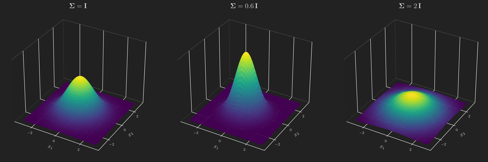
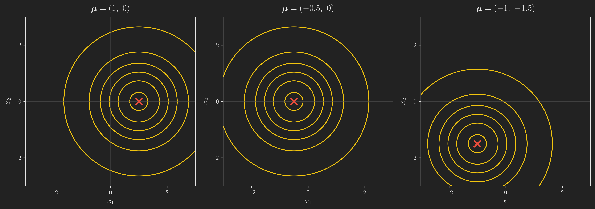
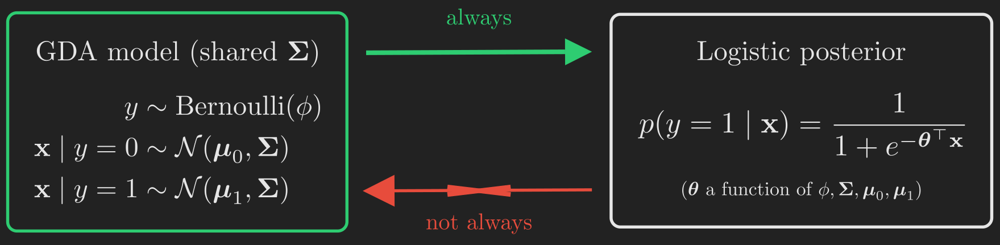
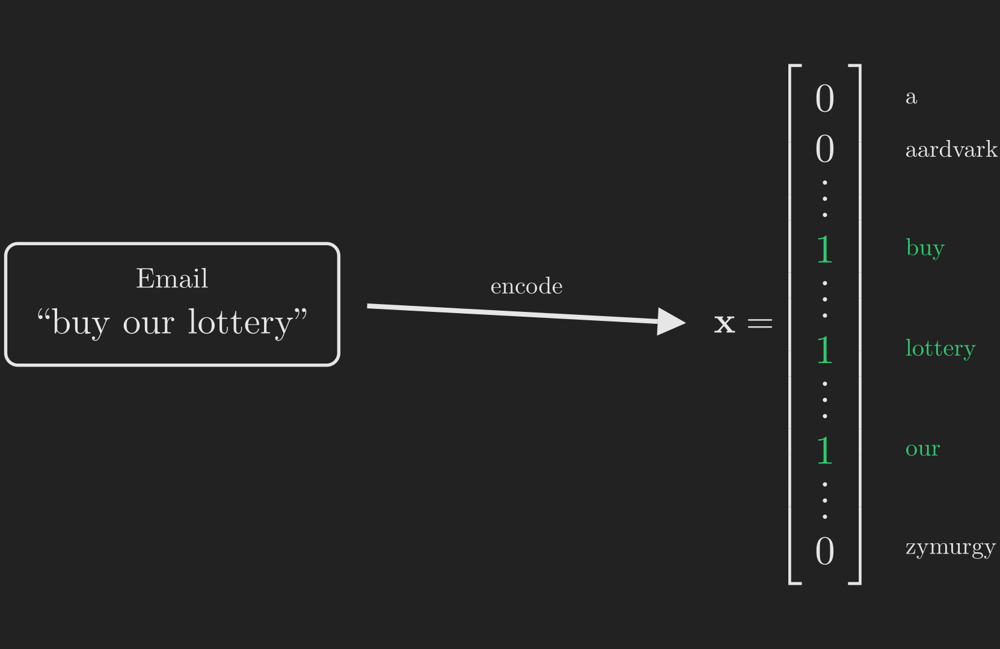

# Where We Left Off

Every learning algorithm we have built so far shares a hidden habit. In the [linear regression post](../linear-regression/index.qmd), we predicted a continuous number by modeling $y \mid \vb{x} \sim \mathcal{N}\left(\mu, \sigma^2\right)$. In the [classification post](../classification-perceptron-logistic-regression/index.qmd), we predicted a yes-or-no label by modeling $y \mid \vb{x} \sim \operatorname{Bernoulli}\left(\phi\right)$ and squashing $\boldsymbol{\uptheta}^{\intercal}\vb{x}$ through a sigmoid. And in the [generalized linear models post](../exponential-family-and-generalized-linear-models/index.qmd), we saw that both are special cases of one family, all built by modeling $p\left(y \mid \vb{x}\right)$, the distribution of the label *given* the features.

That habit has a name. An algorithm that models $p\left(y \mid \vb{x}\right)$ directly, or that maps straight from $\vb{x}$ to a label as the perceptron does, is called a **discriminative** algorithm. It stares at the features and asks a single question: which side of the boundary are you on?

The classification post ended by planting a seed: there is a completely different way to classify, one that never asks that question directly. This post grows that seed into two full algorithms. Here is the one idea that holds everything together:

> Instead of learning to tell the classes apart, learn what each class *looks like*, and let Bayes' rule turn that knowledge into a decision.

Algorithms built this way are called **generative** algorithms, and we will meet the two most important ones: **Gaussian discriminant analysis (GDA)** for continuous features, and **Naive Bayes** for discrete ones. Along the way we will need the multivariate Gaussian, we will discover a surprising bridge back to logistic regression, and we will fix a subtle but fatal bug with a classic trick called **Laplace smoothing**.

This post is largely based on the treatment in @ng_cs229_notes and the accompanying lecture series [@stanford_cs229_ml_youtube]. For the comparison between generative and discriminative models we draw on @hastie2009elements and @bishop2006pattern, and for the Naive Bayes text-classification material on @mitchell1997machine and @mccallum1998comparison.

Here is the trail we are about to walk.

```{mermaid}
%%| label: fig-roadmap
%%| fig-align: center
%%| fig-cap: "The journey of this post, from two ways of thinking about classification to two complete generative algorithms."
flowchart TB
    A["<b>1. Two Mindsets</b><br/>Critic vs artist:<br/>discriminative vs generative"]
    B["<b>2. The Recipe</b><br/>Bayes' rule turns<br/>a painter into a judge"]
    C["<b>3. The Multivariate Gaussian</b><br/>The building block<br/>for continuous features"]
    D["<b>4. GDA</b><br/>The model, the fit,<br/>and the straight boundary"]
    E["<b>5. GDA vs Logistic</b><br/>Stronger assumptions<br/>vs robustness"]
    F["<b>6. Naive Bayes</b><br/>Discrete features<br/>and the spam filter"]
    G["<b>7. Laplace Smoothing</b><br/>Fixing the<br/>zero-probability trap"]
    H["<b>8. Event Models</b><br/>Bernoulli vs<br/>Multinomial"]
    I["<b>9. Wrapping Up</b><br/>Two algorithms,<br/>one recipe"]
    A --> B --> C --> D --> E --> F --> G --> H --> I

    style A fill:#1e8449,color:#fff,stroke:#fff
    style E fill:#1f6f8b,color:#fff,stroke:#fff
    style H fill:#1f6f8b,color:#fff,stroke:#fff
    style I fill:#b9770e,color:#fff,stroke:#fff
```

As always, we start with something concrete and intuitive, then let the math grow out of it. Let us begin with the change in mindset, because everything else follows from it.

# Two Mindsets: The Critic and the Artist

Suppose you want to tell elephants ($y = 1$) from dogs ($y = 0$) based on some measured features of an animal, say its weight and its height.

A discriminative algorithm like logistic regression attacks this head-on. It looks at all the animals at once and searches for a line (a decision boundary) that best separates the elephants from the dogs. To classify a new animal, it just checks which side of the line the animal falls on. You can think of this algorithm as a **critic**: it never needs to know what a typical elephant actually looks like, it only needs to know where the dividing line is.

A generative algorithm approaches the same problem from a completely different angle. First, it looks only at the elephants and builds a model of what elephants look like. Then it looks only at the dogs and builds a separate model of what dogs look like. To classify a new animal, it asks: does this animal look more like the elephants I studied, or more like the dogs? You can think of this algorithm as an **artist**: to recognize a thing, it first learns to *paint* a typical example of it.

@fig-critic_artist shows the two directions of reasoning side by side. The critic runs left to right, from features to label. The artist runs the other way, from a class to the features that class tends to produce, and then uses Bayes' rule (which we will unpack next) to answer the classification question.

```{mermaid}
%%| label: fig-critic_artist
%%| fig-align: center
%%| fig-cap: "Two ways to model the same classification problem. The discriminative critic models the label given the features. The generative artist models the features each class produces, then flips the arrow with Bayes' rule."
flowchart LR
    subgraph DISC["Discriminative: the critic"]
        direction LR
        X1["Features x"] --> P1["p(y | x)<br/>modeled directly"] --> Y1["Label y"]
    end
    subgraph GEN["Generative: the artist"]
        direction LR
        Y2["Class y"] --> P2["p(x | y) and p(y)<br/>what each class looks like"] --> X2["Features x"]
        P2 -.->|"Bayes' rule"| B["p(y | x)"]
    end

    style DISC fill:#1f2a30,color:#e6e6e6,stroke:#1f6f8b
    style GEN fill:#1f2a1f,color:#e6e6e6,stroke:#1e8449
```

Let us make the artist's vocabulary precise. A generative model needs two ingredients:

- $p\left(\vb{x} \mid y\right)$, the distribution of the features *within* each class. This is the "what does a dog look like" and "what does an elephant look like" model. For $y = 0$ it describes dogs; for $y = 1$ it describes elephants.
- $p\left(y\right)$, called the **class prior**. This is simply the fraction of examples in each class, before we look at a single feature. If a third of the animals in your dataset are elephants, then $p\left(y = 1\right) = 1/3$.

Multiplying these together gives the **joint distribution** $p\left(\vb{x}, y\right) = p\left(\vb{x} \mid y\right) \; p\left(y\right)$, which is often called simply "the model." This is the crucial contrast with discriminative learning: a discriminative model only ever learns the conditional $p\left(y \mid \vb{x}\right)$, whereas a generative model learns the full joint $p\left(\vb{x}, y\right)$. That is strictly more information, and it is why generative modeling is, in general, the harder task. But it also buys us the ability to *generate* new examples, and, as we are about to see, to classify.

# The Recipe: Bayes' Rule Turns a Painter Into a Judge

We have an artist who can tell us $p\left(\vb{x} \mid y\right)$ and $p\left(y\right)$. But classification asks the *reverse* question: given the features $\vb{x}$ of a new animal, what is the probability it is an elephant, $p\left(y = 1 \mid \vb{x}\right)$? The arrow points the wrong way. Turning it around is exactly what **Bayes' rule** does:

$$
\underbrace{p\left(y \mid \vb{x}\right)}_{\text{posterior}} = \frac{\overbrace{p\left(\vb{x} \mid y\right)}^{\text{class model}} \; \overbrace{p\left(y\right)}^{\text{prior}}}{\underbrace{p\left(\vb{x}\right)}_{\text{evidence}}}.
$$ {#eq-bayes_rule}

The quantity $p\left(y \mid \vb{x}\right)$ is called the **posterior**: our belief about the class *after* seeing the features. The denominator $p\left(\vb{x}\right)$ is the overall probability of encountering these features at all, and by the total probability theorem it is built from the very same pieces we already have:

$$
p\left(\vb{x}\right) = p\left(\vb{x} \mid y = 0\right) \; p\left(y = 0\right) + p\left(\vb{x} \mid y = 1\right) \; p\left(y = 1\right).
$$ {#eq-total_probability}

So everything on the right-hand side of @eq-bayes_rule is something the artist can supply. (If Bayes' rule and the total probability theorem feel rusty, the [conditional probability post](../conditional-probability-multiplication-rule-total-probability-bayes-rule/index.qmd) walks through both from scratch.)

Here is a lovely simplification. When all we want is a *prediction*, that is, to decide whether $y = 0$ or $y = 1$ is more likely, we do not actually need the denominator at all. The prediction is whichever class has the larger posterior:

$$
\hat{y} = \operatorname*{arg\,max}_{y} \; p\left(y \mid \vb{x}\right) = \operatorname*{arg\,max}_{y} \; \frac{p\left(\vb{x} \mid y\right) \; p\left(y\right)}{p\left(\vb{x}\right)} = \operatorname*{arg\,max}_{y} \; p\left(\vb{x} \mid y\right) \; p\left(y\right).
$$ {#eq-argmax}

The denominator $p\left(\vb{x}\right)$ disappears in the last step because it is the *same positive constant* whether we plug in $y = 0$ or $y = 1$: dividing both candidates by the same number cannot change which one is larger. So to classify, we compare $p\left(\vb{x} \mid y = 1\right) \; p\left(y = 1\right)$ against $p\left(\vb{x} \mid y = 0\right) \; p\left(y = 0\right)$ and pick the winner. (We would only need to compute the denominator if we wanted the actual probability, say $0.83$ rather than just "class $1$".)

This recipe, model $p\left(\vb{x} \mid y\right)$ and $p\left(y\right)$, then classify with @eq-argmax, is shared by *every* generative algorithm in this post. The only thing that changes from one algorithm to the next is the choice of $p\left(\vb{x} \mid y\right)$. When the features are continuous, the natural choice is a Gaussian, and that gives us GDA. So our first job is to get comfortable with the multivariate Gaussian.

# The Multivariate Gaussian: A Bell in Many Dimensions

You already know the one-dimensional Gaussian: the familiar bell curve, pinned down by a mean $\mu$ (where it is centered) and a variance $\sigma^2$ (how wide it is). The **multivariate Gaussian** is its generalization to a vector-valued input $\vb{x} \in \mathbb{R}^d$. It is parameterized by a **mean vector** $\boldsymbol{\upmu} \in \mathbb{R}^d$ and a **covariance matrix** $\vb{\Sigma} \in \mathbb{R}^{d \times d}$ (which is symmetric and positive semi-definite), and its density is

$$
p\left(\vb{x}; \boldsymbol{\upmu}, \vb{\Sigma}\right) = \frac{1}{\left(2\pi\right)^{d/2} \left|\vb{\Sigma}\right|^{1/2}} \exp\left(-\frac{1}{2}\left(\vb{x} - \boldsymbol{\upmu}\right)^{\intercal} \vb{\Sigma}^{-1} \left(\vb{x} - \boldsymbol{\upmu}\right)\right),
$$ {#eq-mvn_density}

where $\left|\vb{\Sigma}\right|$ denotes the determinant of $\vb{\Sigma}$. We write $\vb{x} \sim \mathcal{N}\left(\boldsymbol{\upmu}, \vb{\Sigma}\right)$. Do not let the formula intimidate you; for our purposes only two facts matter, and both match your intuition from the 1D case. The mean vector is the center of the bell,

$$
\mathbb{E}\left[\vb{x}\right] = \boldsymbol{\upmu},
$$

and the covariance matrix is exactly the covariance of the random vector,

$$
\operatorname{Cov}\left(\vb{x}\right) = \mathbb{E}\left[\left(\vb{x} - \boldsymbol{\upmu}\right)\left(\vb{x} - \boldsymbol{\upmu}\right)^{\intercal}\right] = \vb{\Sigma}.
$$

The mean says *where* the bump sits; the covariance says *what shape* it has. Let us build intuition for both by looking at pictures in $d = 2$ dimensions, where we can actually see the density.

First, the covariance controls the **spread**. If we keep the bell centered at the origin and scale the covariance matrix, the bump gets taller and tighter as $\vb{\Sigma}$ shrinks, and shorter and more spread out as $\vb{\Sigma}$ grows. @fig-gaussian_spread_3d shows three surfaces, all with mean $\boldsymbol{\upmu} = \vb{0}$ and covariance

$$
\vb{\Sigma} = \begin{bmatrix} 1 & 0 \\ 0 & 1 \end{bmatrix}, \qquad \vb{\Sigma} = \begin{bmatrix} 0.6 & 0 \\ 0 & 0.6 \end{bmatrix}, \qquad \vb{\Sigma} = \begin{bmatrix} 2 & 0 \\ 0 & 2 \end{bmatrix},
$$

from left to right (that is, $\vb{\Sigma} = \vb{I}$, then $0.6\,\vb{I}$, then $2\,\vb{I}$). (The case $\boldsymbol{\upmu} = \vb{0}$, $\vb{\Sigma} = \vb{I}$ is special enough to have its own name: the **standard normal**.)

{#fig-gaussian_spread_3d fig-align="center" width=100%}

The off-diagonal entries of $\vb{\Sigma}$ control the **orientation**, that is, how the two coordinates are correlated. Surfaces are hard to compare precisely, so from here on we look down from directly above at the **contour lines** (the level sets of the density), which show the elliptical footprint of the bell. @fig-gaussian_covariance_gallery uses four zero-mean Gaussians with unit variances and covariances

$$
\vb{\Sigma} = \begin{bmatrix} 1 & 0 \\ 0 & 1 \end{bmatrix}, \qquad \begin{bmatrix} 1 & 0.5 \\ 0.5 & 1 \end{bmatrix}, \qquad \begin{bmatrix} 1 & 0.8 \\ 0.8 & 1 \end{bmatrix}, \qquad \begin{bmatrix} 1 & -0.8 \\ -0.8 & 1 \end{bmatrix},
$$

from left to right. The left panel has zero off-diagonal entries, so the contours are perfect circles: the two coordinates are uncorrelated. As we increase the off-diagonal entry toward $+0.8$, the ellipses stretch and tilt along the $45^{\circ}$ line $x_1 = x_2$ (large $x_1$ tends to come with large $x_2$). A negative off-diagonal entry tilts them the other way, along $x_1 = -x_2$.

{#fig-gaussian_covariance_gallery fig-align="center" width=100%}

Finally, and most simply, the mean vector just slides the whole bump around the plane without changing its shape. @fig-gaussian_mean_gallery fixes $\vb{\Sigma} = \vb{I}$ (so every bell is circular) and moves $\boldsymbol{\upmu}$ to the three locations

$$
\boldsymbol{\upmu} = \begin{bmatrix} 1 \\ 0 \end{bmatrix}, \qquad \boldsymbol{\upmu} = \begin{bmatrix} -0.5 \\ 0 \end{bmatrix}, \qquad \boldsymbol{\upmu} = \begin{bmatrix} -1 \\ -1.5 \end{bmatrix},
$$

from left to right. The red cross marks the center each time.

{#fig-gaussian_mean_gallery fig-align="center" width=100%}

That is the whole toolkit: **mean = center, covariance = shape and orientation**. We now have exactly what we need to describe "what a class looks like" when its features are continuous. Let us assemble the model.

# Gaussian Discriminant Analysis

## The Model as a Story

GDA makes one modeling commitment: within each class, the features follow a multivariate Gaussian. The cleanest way to state a generative model is as a **data-generating process**, a little recipe for how a single labeled example $\left(\vb{x}, y\right)$ comes into existence:

$$
\begin{align*}
y &\sim \operatorname{Bernoulli}\left(\phi\right),\\
\vb{x} \mid y = 0 &\sim \mathcal{N}\left(\boldsymbol{\upmu}_0, \vb{\Sigma}\right),\\
\vb{x} \mid y = 1 &\sim \mathcal{N}\left(\boldsymbol{\upmu}_1, \vb{\Sigma}\right).
\end{align*}
$$ {#eq-gda_model}

Read it top to bottom as a story. First, flip a (biased) coin with $p\left(y = 1\right) = \phi$ to decide the class. If the coin says dog ($y = 0$), draw the animal's features from a Gaussian centered at $\boldsymbol{\upmu}_0$. If it says elephant ($y = 1$), draw them from a Gaussian centered at $\boldsymbol{\upmu}_1$. Notice the deliberate choice hiding in @eq-gda_model: the two classes have *different means* $\boldsymbol{\upmu}_0$ and $\boldsymbol{\upmu}_1$ but *share a single covariance* $\vb{\Sigma}$. That shared covariance will turn out to matter enormously, and we will come back to exactly why. Written out as densities (each conditional density is a multivariate Gaussian, @eq-mvn_density), the model is

$$
\begin{align*}
p\left(y\right) &= \phi^{y}\left(1 - \phi\right)^{1 - y},\\
p\left(\vb{x} \mid y = 0\right) &= \frac{1}{\left(2\pi\right)^{d/2}\left|\vb{\Sigma}\right|^{1/2}} \exp\left(-\frac{1}{2}\left(\vb{x} - \boldsymbol{\upmu}_0\right)^{\intercal}\vb{\Sigma}^{-1}\left(\vb{x} - \boldsymbol{\upmu}_0\right)\right),\\
p\left(\vb{x} \mid y = 1\right) &= \frac{1}{\left(2\pi\right)^{d/2}\left|\vb{\Sigma}\right|^{1/2}} \exp\left(-\frac{1}{2}\left(\vb{x} - \boldsymbol{\upmu}_1\right)^{\intercal}\vb{\Sigma}^{-1}\left(\vb{x} - \boldsymbol{\upmu}_1\right)\right).
\end{align*}
$$ {#eq-gda_densities}

The parameters we need to learn are the prior $\phi$, the two means $\boldsymbol{\upmu}_0$ and $\boldsymbol{\upmu}_1$, and the shared covariance $\vb{\Sigma}$.

## Fitting by Maximum Likelihood

To fit the parameters we use maximum likelihood, exactly as we did for linear and logistic regression. But here is the defining difference between generative and discriminative learning, and it is worth seeing the two objectives right next to each other.

:::: {.columns}
::: {.column width="48%"}
**Discriminative (what we did before):**

$$
\prod_{i=1}^{n} p\left(y_i \mid \vb{x}_i; \boldsymbol{\uptheta}\right)
$$
:::
::: {.column width="4%"}
:::
::: {.column width="48%"}
**Generative (what we do now):**

$$
\prod_{i=1}^{n} p\left(\vb{x}_i, y_i; \phi, \boldsymbol{\upmu}_0, \boldsymbol{\upmu}_1, \vb{\Sigma}\right)
$$
:::
::::

A discriminative model maximizes the probability of the labels given the features. A generative model maximizes the probability of the features *and* the labels together, the full joint. Let us build that objective step by step.

Because the $n$ training examples are drawn independently, the probability of the whole dataset is the product of the per-example joint densities. Viewed as a function of the parameters, this product is the **likelihood**:

$$
L\left(\phi, \boldsymbol{\upmu}_0, \boldsymbol{\upmu}_1, \vb{\Sigma}\right) = \prod_{i=1}^{n} p\left(\vb{x}_i, y_i; \phi, \boldsymbol{\upmu}_0, \boldsymbol{\upmu}_1, \vb{\Sigma}\right).
$$

Each joint factors into the two pieces our model actually specifies. The chain rule of probability gives $p\left(\vb{x}_i, y_i\right) = p\left(\vb{x}_i \mid y_i\right) \; p\left(y_i\right)$, where the first factor is one of the two Gaussians (governed by $\boldsymbol{\upmu}_0, \boldsymbol{\upmu}_1, \vb{\Sigma}$) and the second is the Bernoulli prior (governed by $\phi$). So

$$
\begin{align*}
L\left(\phi, \boldsymbol{\upmu}_0, \boldsymbol{\upmu}_1, \vb{\Sigma}\right) &= \prod_{i=1}^{n} p\left(\vb{x}_i, y_i; \phi, \boldsymbol{\upmu}_0, \boldsymbol{\upmu}_1, \vb{\Sigma}\right)\\
&= \prod_{i=1}^{n} p\left(\vb{x}_i \mid y_i; \boldsymbol{\upmu}_0, \boldsymbol{\upmu}_1, \vb{\Sigma}\right) \; p\left(y_i; \phi\right).
\end{align*}
$$

A product of many small densities is awkward to differentiate and numerically unstable. The standard remedy is to maximize the *logarithm* of the likelihood instead. Since $\log$ is strictly increasing, it does not move the location of the maximum, but it does turn the product into a sum. This gives the **log-likelihood**:

$$
\ell\left(\phi, \boldsymbol{\upmu}_0, \boldsymbol{\upmu}_1, \vb{\Sigma}\right) = \log \left(\prod_{i=1}^{n} p\left(\vb{x}_i \mid y_i; \boldsymbol{\upmu}_0, \boldsymbol{\upmu}_1, \vb{\Sigma}\right) \; p\left(y_i; \phi\right)\right).
$$ {#eq-gda_loglik}

Turning the log of a product into a sum of logs, and separating the two factors, @eq-gda_loglik becomes

$$
\ell = \underbrace{\sum_{i=1}^{n} \log p\left(y_i; \phi\right)}_{\text{depends only on } \phi} \; + \; \underbrace{\sum_{i=1}^{n} \log p\left(\vb{x}_i \mid y_i; \boldsymbol{\upmu}_0, \boldsymbol{\upmu}_1, \vb{\Sigma}\right)}_{\text{depends only on } \boldsymbol{\upmu}_0,\, \boldsymbol{\upmu}_1,\, \vb{\Sigma}}.
$$ {#eq-gda_loglik_split}

That split is the key to the whole maximization: the prior parameter $\phi$ lives entirely in the left sum, and the Gaussian parameters live entirely in the right sum, so we can optimize each group on its own.

## Maximizing the Log-Likelihood

We now maximize @eq-gda_loglik_split one parameter at a time. The payoff, worth stating up front, is that each estimate turns out to be exactly the intuitive "count and average" quantity you would have guessed. It helps to name two counts, using the **indicator function** $\mathbf{1}\left\{\cdot\right\}$ (equal to $1$ when its condition holds and $0$ otherwise):

$$
n_1 = \sum_{i=1}^{n} \mathbf{1}\left\{y_i = 1\right\} \quad(\text{number of elephants}), \qquad n_0 = \sum_{i=1}^{n} \mathbf{1}\left\{y_i = 0\right\} \quad(\text{number of dogs}),
$$

with $n_0 + n_1 = n$. We will also use a few standard matrix-calculus facts, collected here so that every step below stands on its own.

::: {.callout-note title="Matrix-calculus facts we will use"}
For a symmetric matrix $\vb{A}$, vectors $\vb{a}$, a square matrix $\vb{M}$, and a symmetric positive-definite $\vb{\Sigma}$ (see the [linear algebra post](../linear-algebra-for-ml/index.qmd) for the underlying matrix-calculus toolkit):

$$
\begin{aligned}
\boldsymbol{\nabla}_{\boldsymbol{\upmu}} \left(\vb{a} - \boldsymbol{\upmu}\right)^{\intercal} \vb{A} \left(\vb{a} - \boldsymbol{\upmu}\right) &= -2\,\vb{A}\left(\vb{a} - \boldsymbol{\upmu}\right), &\qquad
\vb{a}^{\intercal} \vb{M} \vb{a} &= \operatorname{tr}\left(\vb{M}\,\vb{a}\,\vb{a}^{\intercal}\right),\\[1ex]
\boldsymbol{\nabla}_{\vb{\Sigma}} \log\left|\vb{\Sigma}\right| &= \vb{\Sigma}^{-1}, &\qquad
\boldsymbol{\nabla}_{\vb{\Sigma}} \operatorname{tr}\left(\vb{\Sigma}^{-1}\vb{M}\right) &= -\vb{\Sigma}^{-1}\vb{M}\,\vb{\Sigma}^{-1}.
\end{aligned}
$$ {#eq-matrix_calculus}

The top-right identity just says that a scalar equals its own trace, rearranged by the cyclic property of the trace.
:::

### The prior $\phi$

Only the left sum of @eq-gda_loglik_split depends on $\phi$. Substituting $p\left(y_i; \phi\right) = \phi^{y_i}\left(1 - \phi\right)^{1 - y_i}$ and taking logs term by term,

$$
\begin{align*}
\sum_{i=1}^{n} \log p\left(y_i; \phi\right) &= \sum_{i=1}^{n} \left[ y_i \log\phi + \left(1 - y_i\right)\log\left(1 - \phi\right) \right]\\
&= n_1 \log\phi + n_0 \log\left(1 - \phi\right),
\end{align*}
$$

where we used $\sum_i y_i = n_1$ and $\sum_i \left(1 - y_i\right) = n_0$. Differentiating and setting to zero,

$$
\dv{\phi}\left[ n_1 \log\phi + n_0 \log\left(1 - \phi\right) \right] = \frac{n_1}{\phi} - \frac{n_0}{1 - \phi} = 0.
$$

Cross-multiplying gives $n_1\left(1 - \phi\right) = n_0\,\phi$, so $n_1 = \left(n_0 + n_1\right)\phi = n\phi$, and therefore

$$
\phi = \frac{n_1}{n} = \frac{1}{n}\sum_{i=1}^{n} \mathbf{1}\left\{y_i = 1\right\}.
$$

The prior is just the fraction of examples that are elephants, exactly as intuition demanded.

### The means $\boldsymbol{\upmu}_0$ and $\boldsymbol{\upmu}_1$

Only the right sum of @eq-gda_loglik_split depends on the means. Substituting the Gaussian density from @eq-gda_densities and then simplifying with $\log\left(ab\right) = \log a + \log b$ and $\log e^{z} = z$,

$$
\begin{aligned}
\log p\left(\vb{x}_i \mid y_i\right) &= \log\left[ \frac{1}{\left(2\pi\right)^{d/2}\left|\vb{\Sigma}\right|^{1/2}} \exp\left(-\frac{1}{2}\left(\vb{x}_i - \boldsymbol{\upmu}_{y_i}\right)^{\intercal}\vb{\Sigma}^{-1}\left(\vb{x}_i - \boldsymbol{\upmu}_{y_i}\right)\right) \right]\\[1ex]
&= -\frac{d}{2}\log\left(2\pi\right) - \frac{1}{2}\log\left|\vb{\Sigma}\right| - \frac{1}{2}\left(\vb{x}_i - \boldsymbol{\upmu}_{y_i}\right)^{\intercal}\vb{\Sigma}^{-1}\left(\vb{x}_i - \boldsymbol{\upmu}_{y_i}\right),
\end{aligned}
$$

and only the last term involves a mean. The vector $\boldsymbol{\upmu}_1$ appears only in the examples with $y_i = 1$ (those are the ones whose class mean $\boldsymbol{\upmu}_{y_i}$ is $\boldsymbol{\upmu}_1$). Applying the first identity in @eq-matrix_calculus with $\vb{A} = \vb{\Sigma}^{-1}$,

$$
\boldsymbol{\nabla}_{\boldsymbol{\upmu}_1} \ell = -\frac{1}{2}\sum_{i \,:\, y_i = 1} \boldsymbol{\nabla}_{\boldsymbol{\upmu}_1}\left(\vb{x}_i - \boldsymbol{\upmu}_1\right)^{\intercal}\vb{\Sigma}^{-1}\left(\vb{x}_i - \boldsymbol{\upmu}_1\right) = \sum_{i \,:\, y_i = 1} \vb{\Sigma}^{-1}\left(\vb{x}_i - \boldsymbol{\upmu}_1\right).
$$

Setting this to $\vb{0}$ and left-multiplying by $\vb{\Sigma}$ (which is invertible) leaves $\sum_{i \,:\, y_i = 1}\left(\vb{x}_i - \boldsymbol{\upmu}_1\right) = \vb{0}$, i.e. $\sum_{i \,:\, y_i = 1}\vb{x}_i = n_1 \boldsymbol{\upmu}_1$. Hence

$$
\boldsymbol{\upmu}_1 = \frac{\sum_{i \,:\, y_i = 1}\vb{x}_i}{n_1} = \frac{\sum_{i=1}^{n} \mathbf{1}\left\{y_i = 1\right\}\vb{x}_i}{\sum_{i=1}^{n} \mathbf{1}\left\{y_i = 1\right\}},
$$

and the identical argument over the $y_i = 0$ examples gives $\boldsymbol{\upmu}_0 = \dfrac{\sum_{i=1}^{n} \mathbf{1}\left\{y_i = 0\right\}\vb{x}_i}{\sum_{i=1}^{n} \mathbf{1}\left\{y_i = 0\right\}}$. Each mean is simply the average of its own class's feature vectors.

### The covariance $\vb{\Sigma}$

Collecting the $\vb{\Sigma}$-dependent terms from the right sum,

$$
\begin{multline*}
\ell_{\vb{\Sigma}} = \sum_{i=1}^{n} \left[ -\frac{1}{2}\log\left|\vb{\Sigma}\right| - \frac{1}{2}\left(\vb{x}_i - \boldsymbol{\upmu}_{y_i}\right)^{\intercal}\vb{\Sigma}^{-1}\left(\vb{x}_i - \boldsymbol{\upmu}_{y_i}\right) \right]\\
= -\frac{n}{2}\log\left|\vb{\Sigma}\right| - \frac{1}{2}\sum_{i=1}^{n} \left(\vb{x}_i - \boldsymbol{\upmu}_{y_i}\right)^{\intercal}\vb{\Sigma}^{-1}\left(\vb{x}_i - \boldsymbol{\upmu}_{y_i}\right).
\end{multline*}
$$

Each quadratic form is a scalar, so it equals its own trace. Using the trace identity $\vb{a}^{\intercal}\vb{M}\vb{a} = \operatorname{tr}\left(\vb{M}\vb{a}\vb{a}^{\intercal}\right)$ from @eq-matrix_calculus with $\vb{M} = \vb{\Sigma}^{-1}$ and $\vb{a} = \vb{x}_i - \boldsymbol{\upmu}_{y_i}$, and defining the **scatter matrix**

$$
\vb{S} = \sum_{i=1}^{n} \left(\vb{x}_i - \boldsymbol{\upmu}_{y_i}\right)\left(\vb{x}_i - \boldsymbol{\upmu}_{y_i}\right)^{\intercal},
$$

the sum of quadratic forms collapses to $\sum_{i=1}^{n}\left(\vb{x}_i - \boldsymbol{\upmu}_{y_i}\right)^{\intercal}\vb{\Sigma}^{-1}\left(\vb{x}_i - \boldsymbol{\upmu}_{y_i}\right) = \operatorname{tr}\left(\vb{\Sigma}^{-1}\vb{S}\right)$, so

$$
\ell_{\vb{\Sigma}} = -\frac{n}{2}\log\left|\vb{\Sigma}\right| - \frac{1}{2}\operatorname{tr}\left(\vb{\Sigma}^{-1}\vb{S}\right).
$$

Applying the last two identities in @eq-matrix_calculus (treating $\vb{\Sigma}$ as an unconstrained matrix; the stationary point comes out symmetric, as it must),

$$
\boldsymbol{\nabla}_{\vb{\Sigma}}\,\ell_{\vb{\Sigma}} = -\frac{n}{2}\vb{\Sigma}^{-1} - \frac{1}{2}\left(-\vb{\Sigma}^{-1}\vb{S}\,\vb{\Sigma}^{-1}\right) = -\frac{n}{2}\vb{\Sigma}^{-1} + \frac{1}{2}\vb{\Sigma}^{-1}\vb{S}\,\vb{\Sigma}^{-1}.
$$

Set this to the zero matrix. Multiplying on the left by $\vb{\Sigma}$ and then on the right by $\vb{\Sigma}$ clears every inverse and leaves $-\frac{n}{2}\vb{\Sigma} + \frac{1}{2}\vb{S} = \vb{0}$, so

$$
\vb{\Sigma} = \frac{1}{n}\vb{S} = \frac{1}{n}\sum_{i=1}^{n}\left(\vb{x}_i - \boldsymbol{\upmu}_{y_i}\right)\left(\vb{x}_i - \boldsymbol{\upmu}_{y_i}\right)^{\intercal}.
$$

Because each example is measured against *its own* class mean $\boldsymbol{\upmu}_{y_i}$ before the outer products are averaged, this is a single **pooled** covariance shared by both classes.

### Collecting the results

Putting the four estimates in one place:

$$
\begin{align*}
\phi &= \frac{1}{n}\sum_{i=1}^{n} \mathbf{1}\left\{y_i = 1\right\},\\[1ex]
\boldsymbol{\upmu}_0 &= \frac{\sum_{i=1}^{n} \mathbf{1}\left\{y_i = 0\right\}\vb{x}_i}{\sum_{i=1}^{n} \mathbf{1}\left\{y_i = 0\right\}},\\[1ex]
\boldsymbol{\upmu}_1 &= \frac{\sum_{i=1}^{n} \mathbf{1}\left\{y_i = 1\right\}\vb{x}_i}{\sum_{i=1}^{n} \mathbf{1}\left\{y_i = 1\right\}},\\[1ex]
\vb{\Sigma} &= \frac{1}{n}\sum_{i=1}^{n} \left(\vb{x}_i - \boldsymbol{\upmu}_{y_i}\right)\left(\vb{x}_i - \boldsymbol{\upmu}_{y_i}\right)^{\intercal}.
\end{align*}
$$ {#eq-gda_mle}

Every one of these is something you already know how to compute:

- $\phi$ is the fraction of training examples that are elephants ($y = 1$), the class prior estimated by counting.
- $\boldsymbol{\upmu}_0$ is the average feature vector among the dogs, and $\boldsymbol{\upmu}_1$ the average among the elephants.
- $\vb{\Sigma}$ is the shared spread: subtract from each example *its own* class mean, form the outer product, and average over all $n$ examples. Because both classes feed one common $\vb{\Sigma}$, the two fitted Gaussians end up with the same shape.

## The Picture: Two Bells and a Straight Line

Now we can see what GDA actually does. @fig-gda_decision_boundary shows a two-feature training set of dogs and elephants (feature $x_1$ standing in for weight, $x_2$ for height, both on a common standardized scale). We fit the GDA parameters with @eq-gda_mle and overlay two things: the contour families of the two fitted Gaussians, and the decision boundary.

{#fig-gda_decision_boundary fig-align="center" width=75%}

Look closely at the two contour families. They are the same shape and the same orientation, just shifted to different centers. That is the shared covariance $\vb{\Sigma}$ made visible: it fixes the shape once, and both classes wear it. The dashed line is the decision boundary, the set of points where the two classes are exactly tied, $p\left(y = 1 \mid \vb{x}\right) = 0.5$. On one side we predict elephant, on the other dog. To classify a new animal, GDA does not consult a boundary it drew on purpose; it asks which bell the animal sits deeper inside, and the boundary is simply where that comparison flips.

## Why Is the Boundary Straight?

The boundary in @fig-gda_decision_boundary is a straight line, and that is not an accident: it is a direct consequence of the shared covariance. The boundary is where the two classes are equally probable, and taking logs, that is where

$$
\log p\left(\vb{x} \mid y = 1\right) + \log p\left(y = 1\right) = \log p\left(\vb{x} \mid y = 0\right) + \log p\left(y = 0\right).
$$ {#eq-boundary_condition}

Each log-density contains a quadratic term $-\tfrac{1}{2}\left(\vb{x} - \boldsymbol{\upmu}_c\right)^{\intercal}\vb{\Sigma}^{-1}\left(\vb{x} - \boldsymbol{\upmu}_c\right)$. When both classes use the *same* $\vb{\Sigma}$, the purely quadratic part $\vb{x}^{\intercal}\vb{\Sigma}^{-1}\vb{x}$ is identical on both sides and cancels, leaving an equation that is *linear* in $\vb{x}$. A linear equation carves out a straight line (in higher dimensions, a flat hyperplane).

If instead we let each class keep its own covariance $\vb{\Sigma}_0 \neq \vb{\Sigma}_1$, the quadratic terms no longer match and do not cancel, and the boundary bends into a quadratic curve. That variant is a real algorithm too, called **quadratic discriminant analysis**. The curve even reveals which class is tighter: the smaller-covariance class has a tall but fast-decaying density, so it wins only in a compact region near its mean, while the more spread-out class, with its heavier tails, wins everywhere else. Since the boundary is where the two densities are equal, it therefore closes *around* the smaller-covariance class as an ellipse. @fig-gda_linear_vs_quadratic puts the two side by side.

{#fig-gda_linear_vs_quadratic fig-align="center" width=100%}

::: {.callout-note title="Why share the covariance at all?"}
Sharing one $\vb{\Sigma}$ is a modeling choice, and it has two justifications. Statistically, it uses fewer parameters (one covariance matrix instead of two), so we can estimate it more reliably from limited data. Conceptually, it is what makes the boundary linear, which, as the next section reveals, lines GDA up beautifully with logistic regression. If you have plenty of data and reason to believe the classes genuinely have different shapes, quadratic discriminant analysis is the more flexible choice.
:::

A straight-line boundary should feel familiar. We drew one before, with logistic regression. That resemblance is not a coincidence, and chasing it down tells us something deep about when to use GDA at all.

# GDA vs Logistic Regression

## A Hidden Sigmoid

Take the GDA model and, instead of asking for a hard prediction, work out the full posterior $p\left(y = 1 \mid \vb{x}\right)$ as a function of $\vb{x}$. Start from Bayes' rule and divide the numerator and denominator by the numerator itself:

$$
\begin{align*}
p\left(y = 1 \mid \vb{x}\right) &= \frac{p\left(\vb{x} \mid y = 1\right) \; p\left(y = 1\right)}{p\left(\vb{x} \mid y = 1\right) \; p\left(y = 1\right) + p\left(\vb{x} \mid y = 0\right) \; p\left(y = 0\right)}\\[1em]
&= \frac{1}{1 + \dfrac{p\left(\vb{x} \mid y = 0\right) \; p\left(y = 0\right)}{p\left(\vb{x} \mid y = 1\right) \; p\left(y = 1\right)}}.
\end{align*}
$$

This already has the shape $1 / \left(1 + \text{something}\right)$ of a sigmoid; the whole job is to show that "something" is $\exp\left(-\boldsymbol{\uptheta}^{\intercal}\vb{x}\right)$. Substitute the priors $p\left(y = 1\right) = \phi$ and $p\left(y = 0\right) = 1 - \phi$, together with the two Gaussian densities from @eq-gda_densities. Because both classes share the covariance $\vb{\Sigma}$, the normalizing constants $\frac{1}{\left(2\pi\right)^{d/2}\left|\vb{\Sigma}\right|^{1/2}}$ are identical and cancel in the ratio, leaving only the exponentials:

$$
\frac{p\left(\vb{x} \mid y = 0\right) \; p\left(y = 0\right)}{p\left(\vb{x} \mid y = 1\right) \; p\left(y = 1\right)} = \frac{1 - \phi}{\phi}\,\exp\left(-\frac{1}{2}\left(\vb{x} - \boldsymbol{\upmu}_0\right)^{\intercal}\vb{\Sigma}^{-1}\left(\vb{x} - \boldsymbol{\upmu}_0\right) + \frac{1}{2}\left(\vb{x} - \boldsymbol{\upmu}_1\right)^{\intercal}\vb{\Sigma}^{-1}\left(\vb{x} - \boldsymbol{\upmu}_1\right)\right).
$$

Now expand the two quadratic forms. Each one is

$$
\left(\vb{x} - \boldsymbol{\upmu}_c\right)^{\intercal}\vb{\Sigma}^{-1}\left(\vb{x} - \boldsymbol{\upmu}_c\right) = \vb{x}^{\intercal}\vb{\Sigma}^{-1}\vb{x} - 2\boldsymbol{\upmu}_c^{\intercal}\vb{\Sigma}^{-1}\vb{x} + \boldsymbol{\upmu}_c^{\intercal}\vb{\Sigma}^{-1}\boldsymbol{\upmu}_c,
$$

where we are using $\vb{x}^{\intercal}\vb{\Sigma}^{-1}\boldsymbol{\upmu}_c = \boldsymbol{\upmu}_c^{\intercal}\vb{\Sigma}^{-1}\vb{x}$, since $\vb{\Sigma}^{-1}$ is symmetric. The $\vb{x}^{\intercal}\vb{\Sigma}^{-1}\vb{x}$ pieces carry opposite signs and cancel, exactly as they did for the decision boundary in @eq-boundary_condition, and what remains is *linear* in $\vb{x}$:

$$
\begin{multline*}
-\frac{1}{2}\left(\vb{x} - \boldsymbol{\upmu}_0\right)^{\intercal}\vb{\Sigma}^{-1}\left(\vb{x} - \boldsymbol{\upmu}_0\right) + \frac{1}{2}\left(\vb{x} - \boldsymbol{\upmu}_1\right)^{\intercal}\vb{\Sigma}^{-1}\left(\vb{x} - \boldsymbol{\upmu}_1\right)\\
= \left(\boldsymbol{\upmu}_0 - \boldsymbol{\upmu}_1\right)^{\intercal}\vb{\Sigma}^{-1}\vb{x} + \frac{1}{2}\boldsymbol{\upmu}_1^{\intercal}\vb{\Sigma}^{-1}\boldsymbol{\upmu}_1 - \frac{1}{2}\boldsymbol{\upmu}_0^{\intercal}\vb{\Sigma}^{-1}\boldsymbol{\upmu}_0.
\end{multline*}
$$

Writing the prior ratio as $\frac{1 - \phi}{\phi} = \exp\left(\log\frac{1 - \phi}{\phi}\right)$ and folding it into the exponent, the whole ratio collapses to $\exp\left(-\left(\vb{w}^{\intercal}\vb{x} + b\right)\right)$, where

$$
\vb{w} = \vb{\Sigma}^{-1}\left(\boldsymbol{\upmu}_1 - \boldsymbol{\upmu}_0\right), \qquad b = \frac{1}{2}\boldsymbol{\upmu}_0^{\intercal}\vb{\Sigma}^{-1}\boldsymbol{\upmu}_0 - \frac{1}{2}\boldsymbol{\upmu}_1^{\intercal}\vb{\Sigma}^{-1}\boldsymbol{\upmu}_1 + \log\frac{\phi}{1 - \phi}.
$$ {#eq-gda_theta}

(The signs flip because moving the linear term from the numerator's ratio into $-\left(\vb{w}^{\intercal}\vb{x} + b\right)$ negates it, and $-\log\frac{1 - \phi}{\phi} = \log\frac{\phi}{1 - \phi}$.) Substituting this back into the $1/\left(1 + \cdots\right)$ expression,

$$
p\left(y = 1 \mid \vb{x}\right) = \frac{1}{1 + \exp\left(-\left(\vb{w}^{\intercal}\vb{x} + b\right)\right)}.
$$

Finally, absorb the intercept $b$ by appending a constant coordinate $x_0 = 1$ to $\vb{x}$ and setting $\boldsymbol{\uptheta} = \left(b, \vb{w}\right)$, so that $\boldsymbol{\uptheta}^{\intercal}\vb{x} = \vb{w}^{\intercal}\vb{x} + b$. This gives the promised form:

$$
p\left(y = 1 \mid \vb{x}; \phi, \vb{\Sigma}, \boldsymbol{\upmu}_0, \boldsymbol{\upmu}_1\right) = \frac{1}{1 + \exp\left(-\boldsymbol{\uptheta}^{\intercal}\vb{x}\right)},
$$ {#eq-gda_sigmoid}

where $\boldsymbol{\uptheta}$ is a fixed function of the GDA parameters $\phi, \vb{\Sigma}, \boldsymbol{\upmu}_0, \boldsymbol{\upmu}_1$ (through the $\vb{w}$ and $b$ of @eq-gda_theta). That right-hand side is *exactly* the sigmoid of logistic regression. So a GDA model with shared covariance, viewed through the lens of its posterior, *is* a logistic regression model.

But, and this is the subtle and important part, the implication only runs one way. @fig-gda_to_logistic captures it.

{#fig-gda_to_logistic fig-align="center" width=90%}

If $p\left(\vb{x} \mid y\right)$ is a shared-covariance Gaussian, then $p\left(y = 1 \mid \vb{x}\right)$ is necessarily a sigmoid. The converse is false: a sigmoid posterior can arise from many different feature distributions, not just Gaussian ones. GDA assumes something specific and strong about the data (the features are Gaussian within each class); logistic regression assumes only the weaker thing (the posterior happens to be a sigmoid).

## Stronger Assumptions vs More Robustness

This asymmetry is the whole story of when to prefer one over the other, and it is a classic bias-variance style tradeoff [@hastie2009elements].

Because GDA assumes more, it gets more in return *when the assumption is right*. If the data really are Gaussian within each class, GDA is **asymptotically efficient**: in the limit of large training sets, no algorithm estimates $p\left(y \mid \vb{x}\right)$ more accurately. In practice this means GDA tends to need *less* data to reach a given accuracy. It is squeezing extra mileage out of a correct assumption.

Because logistic regression assumes less, it is far more **robust** when the assumption is wrong. There are many feature distributions, not just the Gaussian, that lead to a sigmoid posterior. For instance, if the features within each class were Poisson-distributed rather than Gaussian, the posterior would still be a sigmoid, so logistic regression would still fit it well, whereas GDA (busy forcing Gaussian bells onto non-Gaussian data) could go wrong in unpredictable ways.

The practical takeaway, and the reason logistic regression is used far more often in practice:

- **GDA:** stronger assumptions, more data-efficient when those assumptions hold (at least approximately).
- **Logistic regression:** weaker assumptions, more robust to model misspecification, and usually the safer default.

When the data are clearly non-Gaussian, logistic regression will typically win in the large-data limit. When you have good reason to trust the Gaussian assumption and limited data, GDA can be the better bet.

Let us take stock before switching gears. @fig-recap_gda highlights how far we have come: we have the generative recipe and one complete algorithm built on it.

```{mermaid}
%%| label: fig-recap_gda
%%| fig-align: center
%%| fig-cap: "Where we are. The mindset, the recipe, and the entire GDA story are behind us. Next we swap continuous features for discrete ones."
flowchart TB
    A["<b>1. Two Mindsets</b>"]
    B["<b>2. The Recipe</b>"]
    C["<b>3. Multivariate Gaussian</b>"]
    D["<b>4. GDA</b>"]
    E["<b>5. GDA vs Logistic</b>"]
    F["<b>6. Naive Bayes</b><br/>you are here next"]
    G["<b>7. Laplace Smoothing</b>"]
    H["<b>8. Event Models</b>"]
    A --> B --> C --> D --> E --> F --> G --> H

    style A fill:#1e8449,color:#fff,stroke:#fff
    style B fill:#1e8449,color:#fff,stroke:#fff
    style C fill:#1e8449,color:#fff,stroke:#fff
    style D fill:#1e8449,color:#fff,stroke:#fff
    style E fill:#1e8449,color:#fff,stroke:#fff
    style F fill:#b9770e,color:#fff,stroke:#fff
```

GDA needed continuous features to fit Gaussians to. But many of the most important classification problems have features that are not continuous at all. The clearest example is text, and it is where our second generative algorithm was born.

# Naive Bayes: Generative Learning for Discrete Features

## The Spam Filter and Its Features

Consider building an email spam filter. We want to classify each message as spam ($y = 1$) or not spam ($y = 0$). The input is a piece of text, which is not a point in $\mathbb{R}^d$, so Gaussians are the wrong tool. We need a way to turn a message into features, and then a generative model for those (discrete) features.

The standard encoding is a **multi-hot vector** over a fixed **vocabulary**. Fix a dictionary of words. Represent an email by a vector $\vb{x}$ with one entry per vocabulary word, where $x_j = 1$ if word $j$ appears in the email and $x_j = 0$ if it does not. @fig-feature_vector shows the short email "buy our lottery" turned into such a vector.

{#fig-feature_vector fig-align="center" width=80%}

So $\vb{x} \in \left\{0, 1\right\}^d$, where $d$ is the size of the vocabulary. Now we want a generative model, which means we must model $p\left(\vb{x} \mid y\right)$: the distribution of these 0/1 vectors within the spam class and within the non-spam class. And here we hit a wall.

## The Wall: Too Many Parameters

Suppose the vocabulary has $d = 50000$ words. Then $\vb{x}$ is a $50000$-dimensional binary vector, so it can take $2^{50000}$ possible values. If we tried to model $p\left(\vb{x} \mid y\right)$ as a completely general distribution over these outcomes, we would need to specify a probability for each one, that is, a parameter vector with $2^{50000} - 1$ entries. That is astronomically more parameters than we could ever hope to estimate. Modeling the joint behavior of all the words at once is hopeless.

## The Naive Bayes Assumption

To make progress we make one bold, and frankly unrealistic, simplifying assumption. We assume that, *given the class* $y$, the presence of each word is independent of the presence of every other word. This is the **Naive Bayes assumption**, and it is a statement of **conditional independence**.

It is worth being careful about what this does and does not say, because conditional independence is a subtle idea. Two features $x_j$ and $x_k$ are (unconditionally) **independent** if knowing one tells you nothing about the other:

$$
p\left(x_j\right) = p\left(x_j \mid x_k\right).
$$ {#eq-independence}

They are **conditionally independent given $y$** if, *once you already know the class*, knowing one tells you nothing more about the other:

$$
p\left(x_j \mid y\right) = p\left(x_j \mid y, x_k\right).
$$ {#eq-cond_independence}

Equations @eq-independence and @eq-cond_independence are different claims, and neither implies the other. (The [independence post](../independence-when-one-event-tells-you-nothing-about-another/index.qmd) unpacks this distinction in detail.) The Naive Bayes assumption is the second one: for example, if word $2087$ is "buy" and word $39831$ is "price," we assume that *once we know an email is spam*, learning that "buy" appears tells us nothing extra about whether "price" appears. In reality "buy" and "price" surely tend to co-occur in spam, so the assumption is false. But it is a spectacularly *useful* falsehood, and the resulting algorithm works well on a wide range of problems.

Why is it useful? Because it collapses that impossible $2^{50000}$-parameter joint into a simple product. Applying the chain rule of probability and then the conditional independence assumption,

$$
\begin{align*}
p\left(x_1, \ldots, x_d \mid y\right) &= p\left(x_1 \mid y\right) \; p\left(x_2 \mid y, x_1\right) \cdots p\left(x_d \mid y, x_1, \ldots, x_{d-1}\right)\\
&= p\left(x_1 \mid y\right) \; p\left(x_2 \mid y\right) \cdots p\left(x_d \mid y\right)\\
&= \prod_{j=1}^{d} p\left(x_j \mid y\right).
\end{align*}
$$ {#eq-nb_factorization}

The first line is always true (it is just the chain rule). The second line is where the assumption does its work, dropping all the conditioning on other words. Instead of one gigantic joint distribution, we now have $d$ small ones, each a single coin flip: what is the probability that word $j$ appears, given the class?

## Parameters and Their Fit

The model is parameterized by, for each word $j$, the probability it appears in spam and in non-spam, plus the class prior:

$$
\phi_{j \mid y = 1} = p\left(x_j = 1 \mid y = 1\right), \quad \phi_{j \mid y = 0} = p\left(x_j = 1 \mid y = 0\right), \quad \phi_y = p\left(y = 1\right).
$$

Given a training set $\left\{\left(\vb{x}_i, y_i\right)\right\}_{i=1}^{n}$, we again write down the joint likelihood and maximize it. The maximum likelihood estimates are, once more, exactly the counting quantities you would guess:

$$
\begin{align*}
\phi_{j \mid y = 1} &= \frac{\sum_{i=1}^{n} \mathbf{1}\left\{x_{ij} = 1 \wedge y_i = 1\right\}}{\sum_{i=1}^{n} \mathbf{1}\left\{y_i = 1\right\}},\\[1ex]
\phi_{j \mid y = 0} &= \frac{\sum_{i=1}^{n} \mathbf{1}\left\{x_{ij} = 1 \wedge y_i = 0\right\}}{\sum_{i=1}^{n} \mathbf{1}\left\{y_i = 0\right\}},\\[1ex]
\phi_y &= \frac{\sum_{i=1}^{n} \mathbf{1}\left\{y_i = 1\right\}}{n}.
\end{align*}
$$ {#eq-nb_mle}

Here $\wedge$ means "and." Read $\phi_{j \mid y = 1}$ aloud: among all the spam emails, what fraction contain word $j$? The numerator counts the spam emails in which word $j$ appears; the denominator counts all the spam emails. That is the entire fit: scan the training set and tally fractions.

To classify a new email, we convert it to its feature vector and apply Bayes' rule from @eq-bayes_rule, expanding the denominator by total probability (@eq-total_probability) and using the factorization @eq-nb_factorization for each class model:

$$
p\left(y = 1 \mid \vb{x}\right) = \frac{\left(\prod_{j=1}^{d} p\left(x_j \mid y = 1\right)\right) p\left(y = 1\right)}{\left(\prod_{j=1}^{d} p\left(x_j \mid y = 1\right)\right) p\left(y = 1\right) + \left(\prod_{j=1}^{d} p\left(x_j \mid y = 0\right)\right) p\left(y = 0\right)},
$$ {#eq-nb_prediction}

and predict whichever class has the higher posterior. (You might worry that many words are uninformative, like "the" and "of." They are, but they do little harm: a word with no discriminative power contributes roughly the same factor to both classes, so its effect largely cancels in the comparison. The words that carry signal are the ones that tilt the product.)

This is a complete, working classifier. But there is a lurking bug that can make it fail catastrophically, and fixing it is the next step.

# Laplace Smoothing: Never Bet on Zero

## The Zero-Probability Trap

Imagine your training set of emails never once contained the word "aardvark," in either spam or non-spam. When you estimate its parameters with @eq-nb_mle, both numerators are zero, so

$$
\phi_{\text{aardvark} \mid y = 1} = 0 \quad \text{and} \quad \phi_{\text{aardvark} \mid y = 0} = 0.
$$

The model has concluded that "aardvark" appears with probability zero in *both* classes. Now a new email arrives containing "aardvark." When we compute the posterior with @eq-nb_prediction, every product $\prod_j p\left(x_j \mid y\right)$ contains the factor $p\left(x_{\text{aardvark}} \mid y\right) = 0$, so both the numerator and denominator collapse to zero:

$$
p\left(y = 1 \mid \vb{x}\right) = \frac{0}{0 + 0} = \frac{0}{0}.
$$

The classifier is now dividing zero by zero. It has no idea what to predict, and a single never-before-seen word has broken it entirely.

The deeper lesson is a statistical one: **it is a bad idea to estimate the probability of an event as exactly zero just because you have not happened to see it yet.** Your finite training set is not the whole world. Just because you have not seen an aardvark-mentioning email does not mean such an email is impossible.

## Laplace's Fix

The remedy is a classic, and it traces back to Laplace himself, who asked a charming question: given that the sun has risen every day for all of recorded history, what is the probability it rises tomorrow? Naive maximum likelihood, having seen only successes, answers exactly $1$, a suspiciously overconfident claim about a future no one has observed.

The fix is to pretend you have already seen a little bit of everything before the data arrives. Concretely, for a discrete quantity $z$ taking one of $k$ values, whose maximum likelihood estimate is $\phi_j = \frac{1}{n}\sum_{i=1}^{n}\mathbf{1}\left\{z_i = j\right\}$, **Laplace smoothing** replaces it with

$$
\phi_j = \frac{1 + \sum_{i=1}^{n}\mathbf{1}\left\{z_i = j\right\}}{k + n}.
$$ {#eq-laplace_general}

We added $1$ to every numerator and $k$ to the denominator, as if we had seen each of the $k$ outcomes once already before collecting any real data. Two things are worth checking. First, the estimates still form a valid distribution: they sum to $1$ over the $k$ outcomes (add up the numerators, $k + \sum_j \left(\text{counts}\right) = k + n$, which is the denominator). Second, and crucially, none of them can ever be exactly zero. The zero-probability trap is gone.

A coin-flip picture makes the effect vivid. Suppose a coin lands heads $n$ times in a row. Maximum likelihood declares $p\left(\text{heads}\right) = n/n = 1$ for every $n$, and $p\left(\text{tails}\right) = 0$: total certainty from possibly very little evidence. Laplace smoothing, starting each count at $1$, instead gives $p\left(\text{heads}\right) = \frac{n + 1}{n + 2}$, which climbs toward $1$ as evidence accumulates but never quite reaches it, and $p\left(\text{tails}\right) = \frac{1}{n + 2}$, which shrinks toward $0$ but never hits it. @fig-laplace_smoothing shows the difference.

{#fig-laplace_smoothing fig-align="center" width=100%}

Applying @eq-laplace_general to the Naive Bayes parameters, where each word is a binary event (so $k = 2$), gives

$$
\begin{align*}
\phi_{j \mid y = 1} &= \frac{1 + \sum_{i=1}^{n}\mathbf{1}\left\{x_{ij} = 1 \wedge y_i = 1\right\}}{2 + \sum_{i=1}^{n}\mathbf{1}\left\{y_i = 1\right\}},\\[1ex]
\phi_{j \mid y = 0} &= \frac{1 + \sum_{i=1}^{n}\mathbf{1}\left\{x_{ij} = 1 \wedge y_i = 0\right\}}{2 + \sum_{i=1}^{n}\mathbf{1}\left\{y_i = 0\right\}}.
\end{align*}
$$ {#eq-nb_laplace}

Now "aardvark" gets a small but nonzero probability in each class, the $0/0$ disaster never happens, and in practice the classifier works noticeably better. (We usually do not bother smoothing $\phi_y$, since with a healthy mix of spam and non-spam it is already far from zero.)

::: {.callout-note title="A deeper justification (optional)"}
Laplace smoothing is not just a hack. If you are familiar with Bayesian statistics, adding these pseudo-counts is exactly what you get by placing a uniform (Beta, or more generally Dirichlet) prior on the parameters and taking the posterior mean. Under reasonable conditions it can even be shown to be an optimal estimator. If none of that is familiar, no matter: the counting recipe stands on its own. The connection is explored further in standard NLP references [@jurafsky2009speech].
:::

We now have a robust Naive Bayes classifier. But for text specifically, there is a refinement that does even better, and it comes from rethinking what generative story we are telling about how an email is written.

# Event Models: Bernoulli vs Multinomial

## Two Stories for How an Email Is Written

The version of Naive Bayes we just built is, in the text-classification world, called the **Bernoulli event model** (or multivariate Bernoulli model). Its implicit generative story is this: to produce an email, the sender first decides spam or not (from the class prior), then walks through the *entire dictionary* and, for each word independently, flips a coin to decide whether to include it. The features record only presence or absence, one Bernoulli per vocabulary word. The probability of a message is $p\left(y\right)\prod_{j=1}^{d} p\left(x_j \mid y\right)$.

There is a different, and for text often better, story called the **multinomial event model**. Here the features change meaning entirely. Instead of a fixed-length presence vector, we let $x_j$ denote the *identity of the $j$-th word* in the email. So $x_j$ takes a value in $\left\{1, \ldots, \left|V\right|\right\}$ (an index into the vocabulary $V$), and an email of $d$ words is a sequence $\left(x_1, x_2, \ldots, x_d\right)$ whose length $d$ varies from email to email. The generative story: decide spam or not, then write the email one word at a time, each word drawn independently from a single distribution over the vocabulary (the same distribution regardless of position). The message probability is again $p\left(y\right)\prod_{j=1}^{d} p\left(x_j \mid y\right)$, but now each factor is a *multinomial* draw over the whole vocabulary, not a per-word Bernoulli.

## The Key Difference: Presence vs Counts

The cleanest way to feel the difference is to encode one email both ways. Take the spam email "buy this watch this watch." @fig-bernoulli_vs_multinomial shows the two encodings.

{#fig-bernoulli_vs_multinomial fig-align="center" width=70%}

The Bernoulli model records "watch" as a single $1$: present or not, counted once. The multinomial model records "watch" as $2$: it counts every occurrence. In short, **the Bernoulli model asks in what fraction of messages a word appears; the multinomial model asks how frequently a word appears across all the text.** For documents where word frequency carries signal (and for text, it usually does), the multinomial model captures more of the picture. This comparison is the subject of a well-known study by @mccallum1998comparison, which found the multinomial model generally superior for text classification.

## Fitting the Multinomial Model

For a training set where email $i$ has $d_i$ words, maximizing the likelihood gives estimates that, once again, are natural counts:

$$
\begin{align*}
\phi_{k \mid y = 1} &= \frac{\sum_{i=1}^{n}\sum_{j=1}^{d_i} \mathbf{1}\left\{x_{ij} = k \wedge y_i = 1\right\}}{\sum_{i=1}^{n} \mathbf{1}\left\{y_i = 1\right\} d_i},\\[1ex]
\phi_{k \mid y = 0} &= \frac{\sum_{i=1}^{n}\sum_{j=1}^{d_i} \mathbf{1}\left\{x_{ij} = k \wedge y_i = 0\right\}}{\sum_{i=1}^{n} \mathbf{1}\left\{y_i = 0\right\} d_i}.
\end{align*}
$$ {#eq-multinomial_mle}

Read $\phi_{k \mid y = 1}$ as: out of all the words across all spam emails, what fraction are the vocabulary word $k$? The numerator counts every occurrence of word $k$ in spam (summing over messages $i$ and over word positions $j$ within each message); the denominator counts the total number of words in all spam emails.

The same zero-probability trap lurks here, so we apply Laplace smoothing to the counts in @eq-multinomial_mle again. The only change from the Bernoulli-model smoothing in @eq-nb_laplace is the denominator correction: because each word position now has $\left|V\right|$ possible outcomes (any vocabulary word), we add $1$ to each numerator and $\left|V\right|$ to each denominator:

$$
\begin{align*}
\phi_{k \mid y = 1} &= \frac{1 + \sum_{i=1}^{n}\sum_{j=1}^{d_i} \mathbf{1}\left\{x_{ij} = k \wedge y_i = 1\right\}}{\left|V\right| + \sum_{i=1}^{n} \mathbf{1}\left\{y_i = 1\right\} d_i},\\[1ex]
\phi_{k \mid y = 0} &= \frac{1 + \sum_{i=1}^{n}\sum_{j=1}^{d_i} \mathbf{1}\left\{x_{ij} = k \wedge y_i = 0\right\}}{\left|V\right| + \sum_{i=1}^{n} \mathbf{1}\left\{y_i = 0\right\} d_i}.
\end{align*}
$$ {#eq-multinomial_laplace}

## What About Continuous Features Again?

One last practical note ties the two halves of this post together. Naive Bayes was built for discrete features, and GDA for continuous ones. But nothing stops us from *discretizing* a continuous feature and handing it to Naive Bayes. If a feature like living area is originally continuous, we can bucket it into a handful of bins and treat the bin index as a discrete feature, as in @tbl-discretize.

::: {.tbl tbl-colwidths="auto"}
| Living area (sq. ft.) | $< 400$ | 400-800 | 800-1200 | 1200-1600 | $> 1600$ |
|:---:|:---:|:---:|:---:|:---:|:---:|
| Discrete value $x_j$ | 1 | 2 | 3 | 4 | 5 |

: Discretizing a continuous feature into buckets so it can be used with Naive Bayes. A house of 890 sq. ft. would get $x_j = 3$. {#tbl-discretize style="width:90%; margin:auto;"}
:::

A house of $890$ square feet lands in bucket $3$. When the continuous features are not well described by a Gaussian, discretizing them and using Naive Bayes can outperform forcing GDA's Gaussian assumption onto data that does not fit it. This is the same robustness theme we saw with logistic regression, wearing different clothes.

# Wrapping Up

Step back and the whole post collapses into a single sentence: **model what each class looks like, then let Bayes' rule classify.** Everything we did was a variation on that one recipe.

We began by contrasting two mindsets. The discriminative critic models $p\left(y \mid \vb{x}\right)$ and draws the boundary directly. The generative artist models $p\left(\vb{x} \mid y\right)$ and $p\left(y\right)$, learns what each class looks like, and recovers the boundary through Bayes' rule, discarding the denominator whenever it only needs a prediction.

We then filled in that recipe twice:

- For **continuous features**, we chose a Gaussian for $p\left(\vb{x} \mid y\right)$ and got **GDA**. With a shared covariance the two class-Gaussians share a shape, the boundary comes out straight, and the posterior is secretly a sigmoid (@eq-gda_sigmoid). That last fact revealed GDA as a stronger-assumption cousin of logistic regression: more data-efficient when the Gaussian assumption holds, less robust when it does not.
- For **discrete features**, we chose per-feature Bernoullis and, via the conditional-independence Naive Bayes assumption, got **Naive Bayes**. We patched its fatal zero-probability bug with **Laplace smoothing**, and then sharpened it for text with the **multinomial event model** (@eq-multinomial_laplace), which counts word frequencies rather than mere presence.

The contrast between the two families is worth keeping in one place.

::: {.tbl tbl-colwidths="auto"}
| | Discriminative (e.g., logistic regression) | Generative (GDA, Naive Bayes) |
|:--|:--|:--|
| What it models | $p\left(y \mid \vb{x}\right)$ directly | $p\left(\vb{x} \mid y\right)$ and $p\left(y\right)$, then Bayes' rule |
| What it learns | the boundary between classes | what each class looks like |
| Assumptions | weaker | stronger |
| Data efficiency | needs more data | needs less *when assumptions hold* |
| Robustness | robust to misspecification | sensitive to misspecification |
| Bonus ability | none | can generate new examples |

: Generative and discriminative learning at a glance. {#tbl-gen_vs_disc style="width:100%; margin:auto;"}
:::

```{mermaid}
%%| label: fig-recap_final
%%| fig-align: center
%%| fig-cap: "The full arc of the post: one generative recipe, realized as two algorithms, one for continuous features and one for discrete."
flowchart TB
    A["<b>The generative recipe</b><br/>Model p(x | y) and p(y),<br/>classify with Bayes' rule"]
    B["<b>Continuous features</b><br/>Gaussian p(x | y)"]
    C["<b>Discrete features</b><br/>Bernoulli / Multinomial<br/>p(x | y)"]
    D["<b>GDA</b><br/>Shared covariance,<br/>straight boundary,<br/>secretly logistic"]
    E["<b>Naive Bayes</b><br/>Conditional independence,<br/>Laplace smoothing,<br/>event models"]
    A --> B --> D
    A --> C --> E

    style A fill:#b9770e,color:#fff,stroke:#fff
    style D fill:#1f6f8b,color:#fff,stroke:#fff
    style E fill:#1e8449,color:#fff,stroke:#fff
```

Both algorithms are, despite their strong assumptions, remarkably effective and easy to implement. Naive Bayes in particular is often an excellent "first thing to try" on a new classification problem, precisely because it is so simple and so fast to fit.

Where next? We have now built classifiers that draw straight boundaries in two very different ways. A natural question is whether we can draw the *best possible* straight boundary, the one that sits as far as possible from both classes, and whether we can bend it into curves without paying the full price of quadratic models. That is the story of **support vector machines** and the **kernel trick**, which we will take up in a future post.

# Acknowledgment

This post is based on the treatment in @ng_cs229_notes and the accompanying Stanford CS229 lecture series [@stanford_cs229_ml_youtube]. The generative-versus-discriminative framing and the discussion of asymptotic efficiency draw on @hastie2009elements and @bishop2006pattern. The Naive Bayes and text-classification material follows @mitchell1997machine, the comparison of event models follows @mccallum1998comparison, and the treatment of Laplace smoothing in the language-modeling context follows @jurafsky2009speech.
