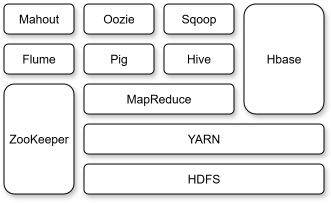

# Introduction

A lot of problems arise while dealing with massive amounts of data. The data can be "massive" in terms of at least one of the 5 V's, which are: Volume, Velocity, Variety, Veracity, and Value. A very effective way to deal with these problems is to use a number of clusters in a distributed way, i.e., a multi-node setup. This helps in carrying out tasks, like data storing and processing, more quickly through parallelization. **Hadoop** is an open source framework designed to handle such massive amounts of data in a distributed and scalable way. Although Hadoop is less commonly used in the industry today, understanding it is crucial to understand the newer technologies which replaced it, e.g., Spark.

The Hadoop distributed file system, introduced by @shvachko2010hadoop, was inspired by the Google file system that was introduced by @ghemawat2003google. The basic idea is to connect many readily available and inexpensive machines, also known as *commodity hardware*, together in a cluster to share and process the data. Hadoop is a framework that helps in doing this.

# Properties of Hadoop

Some major properties of Hadoop are the following:

- **Scalability**:
  - Hadoop can scale horizontally. In other words, we can, in principle, add as many machines as we like to a Hadoop cluster.
- **Fault tolerance**:
  - To deal with faults, i.e., machine failure, Hadoop maintains copies of the data, also known as replicas. Thus, even if a machine fails, the data remains available through replicas.
- **Distributed processing**:
  - Hadoop can process the data where it is stored. Instead of moving the data close to where the processing happens, Hadoop instead moves the processing closer to where the data is stored. This improves the overall efficiency of the system.
- **Cost effectiveness**:
  - As mentioned earlier, Hadoop uses commodity hardware which makes it highly cost effective.
- **Open source**:
  - Hadoop is free to use and modify, under the Apache license.

It was majorly due to these properties that Hadoop was widely adopted.

# Hadoop Ecosystem

The Hadoop ecosystem is a collection of open source projects, tools, and components that work together to store, process, and analyze large amounts of data. Some components were present in Hadoop when it was introduced, while some were added later. Some of these components that I will discuss are shown in @fig-hadoop-components.

{#fig-hadoop-components fig-align="center" width=50% .invert}

## Hadoop Distributed File System (HDFS)

HDFS was inspired by the Google file system (GFS). HDFS provides distributed storage for massive data.

## MapReduce

The Hadoop MapReduce was inspired by the Google MapReduce which was introduced by @dean2008mapreduce. It helps in processing massive data by dividing the entire processing task into smaller tasks that can run in parallel. Today, Spark is more commonly used instead of MapReduce.

## Yet Another Resource Negotiator (YARN)

Before YARN was introduced, MapReduce used to handle all the resources corresponding to a job. YARN decouples the resource management from the application execution.

HDFS, MapReduce, and YARN are available by default in every Hadoop installation. These are the core components. The components I will mention after these were added later by others.

## Hive

Hive, introduced by @thusoo2009hive, is a query engine. It is *not* a database. Earlier, anyone wanting to carry out any preprocessing task on the data was required to implement it in the form of MapReduce in Java, which was difficult. Hive gives us a SQL like query engine, allowing us to avoid Java interaction but retaining the performance of MapReduce. So, Hive abstracts MapReduce by translating SQL queries into MapReduce jobs.

## Pig

Pig allows us to work with the data in a high-level scripting language called Pig Latin. This was introduced by @olston2008pig. Just like Hive, Pig also abstracts MapReduce, but over Pig Latin instead of SQL.

## Sqoop

Traditionally, data is stored in relational databases like Oracle, MySQL, etc. Sqoop facilitates import/export between Hadoop and these relational databases.

## Oozie

Oozie, introduced by @islam2012oozie, is, again, an abstraction over MapReduce that helps in scheduling and automating complex workflows using XML files.

## HBase

HBase, inspired by Google Bigtable which was introduced by @chang2008bigtable, is a columnar NoSQL database that allows real-time reads and writes on HDFS.

## Mahout

Mahout is a machine learning framework that allows us to implement machine learning algorithms on the stored data.

## Flume

The use case for Flume is real-time data streaming. It is a messaging queue that helps in retrieving the data in real-time. For instance, it can collect logs or event data from various sources and deliver them to Hadoop or Hive. It is used for real time analytics and monitoring, and can also be used for data ingestion.

## ZooKeeper

ZooKeeper, introduced by @hunt2010zookeeper, coordinates the distributed system to maintain consistency across all the machines. This is critical for ensuring reliability in Hadoop clusters.

## Summary

The functionalities and the components implementing those functionalities are the following:

- Storage:
  - HDFS, HBase
- Processing:
  - MapReduce, Pig, Hive, Spark
- Data ingestion:
  - Flume, Sqoop
- Coordination:
  - ZooKeeper
- Workflow management:
  - Oozie
- Machine Learning:
  - Mahout

# Two More Properties of Hadoop

Another two important properties of Hadoop are the following:

- Hadoop is a loosely coupled framework:
  - In other words, individual components like Hive, Pig, or Mahout can be added or removed without affecting the core functionalities of HDFS and YARN.
- Hadoop is easily integrable:
  - Hadoop can be integrated with both big data tools like Spark and traditional technologies like relational databases.

Many of the components that I mentioned above have been replaced by others. For example, Spark is used instead of MapReduce, Kubernetes can be used instead of YARN, Snowflake can be used instead of Hive, Airflow can be used for scheduling, etc. However, the former form the building blocks of the latter.
