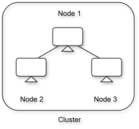
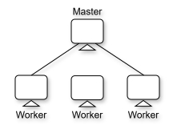
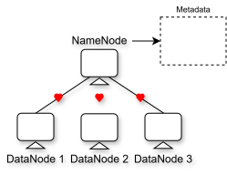
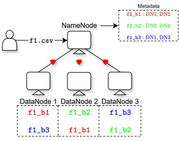
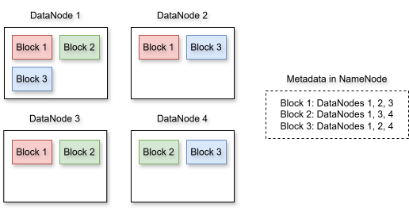
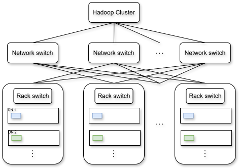
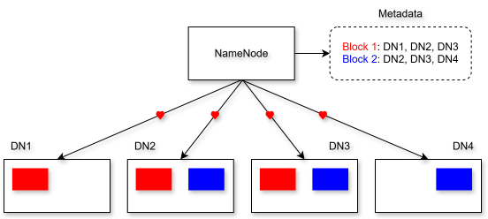
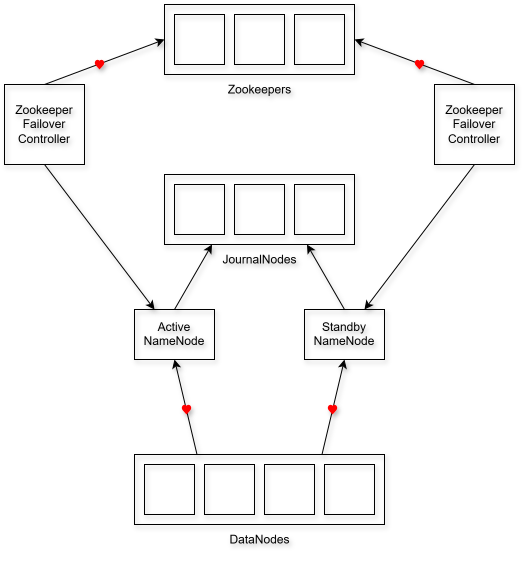
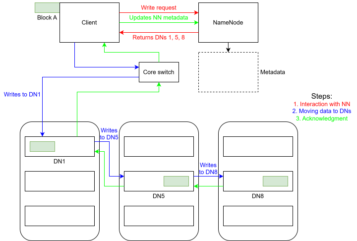
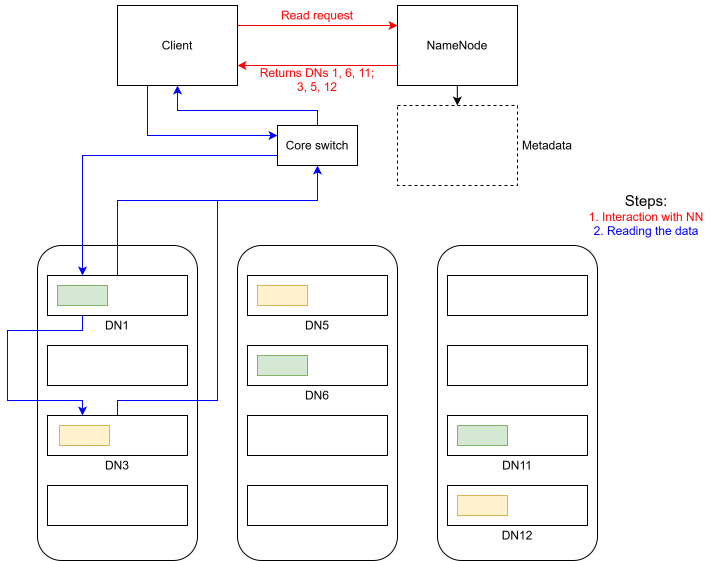

# Introduction

**Hadoop Distributed File System (HDFS)** is a key component of the Hadoop ecosystem. It is designed to store and manage large-scale dataset across a distributed environment, making it highly scalable and fault tolerant. Unlike traditional file systems, HDFS is optimized for big data, where the files are massive and need to be processed efficiently.

# Some Basic Terminologies

Before diving deeper, let us clarify some basic terms that are ubiquitous in Hadoop.

## File System

**A File System (FS)** is nothing but a data structure an operating system (OS) uses to manage files on a storage device. It is a layer between the software (OS) and the hardware (HDD). How files are stored will depend on which FS is being used. A few examples are the following.

- Linux:
  - It uses the ext FS. This FS is very efficient for servers and applications that require speed and security.
- Windows:
  - The newer Windows computers use NTFS, whereas the older ones used the FAT32 FS. These FS's are very user friendly as they support a graphical user interface.
- Mac OS:
  - It uses APFS.
- Hadoop:
  - As discussed earlier, this has HDFS. A special property of HDFS is that it is distributed.

The same machine can have multiple FS's, and the data can be exchanged between them. For instance, we can plug in a thumb drive with an NTFS into a Linux machine with an ext FS. We will later also see that multiple Linux machines can be connected together with Hadoop installed for distributed computing. In this case, the machines have ext as well as HDFS.

## Block

A **block** is the smallest unit of data storage in an FS. Whenever a file is stored, it is not stored as a single file in the hard drive. It is divided into blocks. This is done for efficient storage and retrieval of the data in the files. The block sizes are different for different FS's. For instance, in a Windows system with NTFS, the block size is 4 KB. So, NTFS will store a 10 KB file in 3 blocks. In HDFS, the default block size 128 MB. The block size is significantly large in HDFS because it is designed to work with big data.

## Types of File System

### Standalone

In a **standalone FS**, e.g., ext, NTFS, etc., files are stored and managed in a single machine. For instance, if multiple NTFS Windows computers are connected, files are stored in one machine only.

### Distributed

In a **distributed FS**, e.g., HDFS, files are shared across multiple machines in a cluster. This makes the system highly scalable as more machines can be added later to increase the storage indefinitely.

## Clusters and Nodes

@fig-cluster-and_node makes the difference between a cluster and a node very clear.

{#fig-cluster-and_node fig-align="center" width=35% .invert}

Each machine is a **node**, and a **cluster** is a connection of machines.

## Process and Daemon Process

A **process** is just a program in execution, whereas a **daemon process** is a background process that runs without any user intervention. In Hadoop, many daemon processes are run to make sure that the machines know their role. This will become more clear as we dive deeper into the architecture.

## Metadata

**Metadata** is data about data. For instance, an image of a dog contains data (in the form of pixels) about that dog. Along with this data, the image will also have metadata like the size of the image, date of creation, date of modification, permissions, file format, etc.

## Replication

As the name suggests, **replication** is making copies of the data to ensure fault tolerance. So, even if the data is deleted, we can restore it using its replica.

# Why HDFS?

Consider the analogy of a library and a librarian. The librarian has to manage the library that contains thousands of books. Storing all the books in a single room will lead to space and accessibility issues. A better approach, obviously, is to distribute the books across multiple rooms and having an assistant for each room who is aware of the location of all the books in that room. Further, as a library has multiple copies of the same books, it is a good idea to not store all the copies of a particular book in a single room. This will help retain all the books even if all the books in a particular room are permanently damaged, or are unavailable. This is the essence of HDFS.

- It distributes data across multiple nodes.
- It replicates the data to ensure fault tolerance.
- It provides efficient access for big data processing.

# HDFS Architecture

Understanding HDFS is crucial as it is a building block towards other big data distributed storage technologies. We have a cluster of nodes with a Hadoop setup. In distributed computing, we have a *master-worker architecture*. We need to specify which machine is playing the role of the master, and which machines are playing the role of workers (however this is trivially done now-a-days while using any cloud providers). Once the roles are specified, all the workers are connected to the master as opposed to being connected to themselves. @fig-master-worker illustrates this.

{#fig-master-worker fig-align="center" width=35% .invert}

As the nodes have ext as well as HDFS, both Linux and Hadoop commands will work on them. However, Linux commands run on a particular node will only run on that node, whereas Hadoop commands can run on all the nodes together.

Note that in HDFS, the master node is called the **NameNode** and the worker node is called the **DataNode**. The NameNode is like a central control room that is aware of where all the data is stored, but it itself does not store any data. In other words, the NameNode actually contains the metadata. This metadata contains information like which DataNode is storing which data, etc. The NameNode keeps this metadata updated using the **heartbeat signals** sent by the DataNodes to the NameNode periodically. These signals are just a way used by the DataNodes to give updates to the NameNode. The updated illustration is shown in @fig-namenode_datanode_metadata_heartbeat.

{#fig-namenode_datanode_metadata_heartbeat fig-align="center" width=40% .invert}

Now, consider a scenario in which a user sends a file $\texttt{f1.csv}$ of size 300 MB to be saved in this HDFS. Recall that the block size in HDFS is 128 MB. Also, consider that the replication factor is 2. So, this file will first be divided into 3 blocks, say $\texttt{f1\_b1}$ (128 MB), $\texttt{f1\_b2}$ (128 MB), and $\texttt{f1\_b3}$ (44 MB). These blocks are then placed in different DataNodes. Further, as the replication factor is 2, one copy of each of these blocks are also stored in the DataNodes making sure that no two DataNodes have the same blocks. Finally, the information about which block is stored in which DataNode is passed onto the NameNode via the heartbeat and is stored in its metadata. @fig-storing_f1 shows this.

{#fig-storing_f1 fig-align="center" width=55% .invert}

@tbl-namenode-vs-datanode summarizes the difference between NameNode and DataNode.

| Aspect           | NameNode                                                                                     | DataNode                                                                                      |
|:-----------------|:---------------------------------------------------------------------------------------------|:---------------------------------------------------------------------------------------------|
| **Definition**   | The master node in the HDFS architecture. It manages metadata and file system namespace.      | The worker nodes in HDFS. They store the actual file data in blocks.                         |
| **Purpose**      | Keeps track of file locations, file metadata, and directory structure (but does not store data). | Responsible for storing, retrieving, and replicating data blocks.                            |
| **Role**         | **Coordinator**: It directs how files are stored and accessed across DataNodes.               | **Executor**: It performs read and write operations as instructed by the NameNode.           |
| **Data Stored**  | Metadata (e.g., file names, permissions, and locations of data blocks).                       | Actual data split into blocks.                                                               |
| **Dependency**   | HDFS cannot function without a NameNode. It is the single point of failure.                   | HDFS can function with one or more DataNodes, and their failure does not stop the system.    |
| **Communication**| Communicates with clients for file operations and with DataNodes to track block statuses.     | Communicates with the NameNode for block operations and periodically sends heartbeat signals.|
| **Fault Tolerance** | Does not store redundant copies (replication is for data blocks only).                      | Handles fault tolerance through block replication across multiple DataNodes.                 |
| **Processes**    | Maintains and updates the file system namespace dynamically.                                  | Regularly reports to the NameNode with block reports and health checks.                      |
| **Example Role** | Acts like **a manager in a library**, knowing the exact shelf (DataNode) where a book (block) is stored. | Acts like **the shelves in the library**, holding and managing the physical books (blocks).  |

: Comparison between NameNode and DataNode in HDFS. {#tbl-namenode-vs-datanode style="width:100%; margin:auto;"}

# Blocks in HDFS

A **block** is the smallest unit of storage in HDFS. Each file stored in HDFS is divided into blocks, which are then distributed across multiple DataNodes. As mentioned earlier, the default block size in HDFS is 128 MB, which is huge as compared to block sizes in other file systems. A benefit of this large block size is that the NameNode has less metadata to manage. This is because a larger block size means lesser blocks will be needed to store a file, which in turn means lesser information to store as metadata. Hence, large block size makes storing larger files more efficient. This also helps in distributed storage and computation.

It is possible to change the block size in HDFS. However this block size of 128 MB is like a sweet spot that is chosen carefully taking into consideration use cases for big data. For instance, if we bring down this block size to 1 MB, storing a 500 MB file will now take 500 blocks as opposed to 4 blocks when the block size was 128 MB. Further, these 500 blocks will also be replicated due to the replication factor. This will result in a huge amount of metadata that the NameNode will have to handle. But on the positive side, having more blocks will help with increase in parallelism that will improve the efficiency of processing. Also, decreasing the block size will also result in lesser space wastage inside the blocks. However, the huge amount of metadata may choke the NameNode.

On the other hand, we can also increase the block size. If we increase the block size, it will decrease the parallelism leading to decreased efficiency of processing. Say we increased it from 128 MB to 512 MB. So, a 1 GB file that used to need 8 blocks earlier will now need only 2 blocks. So, although the NameNode now has to manage less amount of metadata, the data processing efficiency is now decreased considerably.

# Replication Factor in HDFS

DataNodes in HDFS are susceptible to failures. In fact, HDFS is designed in such a way that cheap commodity hardware is used to store the data. So, it is crucial to make DataNodes fault tolerant such that the data present in the failed DataNodes is never lost. This is done by replicating the data (or the data blocks to be precise) across different DataNodes. The default replication factor is 3, i.e., 3 replicas of a particular block will be stored (one is the original and the remaining two are copies). This means that if 1 GB of data is to be stored on HDFS, it will occupy 3 GB of space. Though this introduces data redundancy, it also ensures that the data is available even if nodes containing two of the blocks fail.

Let us take an example. Say we have 300 MB of data and a total of 4 DataNodes in HDFS. Considering the default block size, this data will require 3 blocks (without replication). We will consider the default replication factor of 3. @fig-replication_factor illustrates how the data is stored in blocks inside each DataNode by ensuring the replication factor of 3 is met.

{#fig-replication_factor fig-align="center" width=85% .invert}

As we can see, even if one of the DataNodes fail, all the blocks are still recoverable. One more thing to observe is that the blocks are distributed uniformly across multiple DataNodes. A particular DataNode will never contain all the replicas of a particular block, the reason being if that particular DataNode fails then those corresponding blocks are lost.

# Rack Awareness in HDFS

In practice, a large number of DataNodes and NameNodes are stored in data centers. DataNodes are stored in racks, and these racks are kept side by side. All the DataNodes inside the same rack are connected directly via a cable, whereas DataNodes in different racks are connected to each other via a network switch. @fig-data_center shows a data center with racks and nodes inside each rack.

{#fig-data_center fig-align="center" width=85%}

So, a **rack** is a collection of DataNodes that are physically close together, often in the same network switch. The **rack awareness** algorithm ensures that the replicas are distributed across DataNodes in different racks, and not just any different DataNodes. @fig-rack_awareness shows an illustration of how this is done.

{#fig-rack_awareness fig-align="center" width=85% .invert}

As we can see, all the blocks are distributed not only in different DataNodes, but also in the DataNodes of different racks. This ensures that even if DataNodes of a particular rack are not accessible, all the data blocks are still available, which enhances the fault tolerance of the cluster. Further, this also optimizes the network traffic by dividing the load efficiently.

# DataNode Failures

## Temporary Failure

A **temporary failure** of a DataNode occurs when the DataNode is unavailable due to some transient or minor issues like network outage, software crash, node reboot for maintenance, etc. Consider a scenario in which we have 4 DataNodes and a NameNode. Two types of blocks are stored in the DataNodes with a replication factor of 3. The DataNodes are in constant connection with the NameNode and they periodically send it the heartbeat signals and the block report (i.e., information about the blocks stored in that particular DataNode). Both of these are verified by the NameNode using its Metadata. This entire scenario is shown in @fig-dn_temp_failure_1.

{#fig-dn_temp_failure_1 fig-align="center" width=85% .invert}

Now if one of the DataNodes becomes unavailable, then Hadoop handles temporary failure in the following steps:

1. **Detection**: If a DataNode stops sending heartbeat signals to the NameNode, then after a certain specified period (which is mostly taken as 10.5 minutes) the NameNode marks it as temporarily unavailable.
2. **Replication**: The NameNode, through the metadata, is aware which blocks were present on the DataNode that has become temporarily unavailable. The NameNode marks these blocks as under-replicated and makes their copies on the remaining healthy DataNodes such that the replication factor is maintained.
3. **Recovery**: Once the temporarily unavailable DataNode recovers, it resumes sending the heartbeat signal and the block report back to the NameNode. The NameNode then compares this with its metadata and deletes the extra replica of the blocks to maintain the replication factor. The metadata is also dynamically updated reflecting this change to maintain consistency.

All of this happens behind the scenes, i.e., the user or the client will not see any difference in terms of data availability if any of the DataNode becomes temporarily unavailable.

## Permanent Failure

A **permanent failure** of a DataNode occurs when that DataNode is permanently lost due to, e.g., hardware failure, disk corruption, decommissioning of a DataNode, etc. Again, consider the same scenario as shown in @fig-dn_temp_failure_1. The following steps are followed in case of a permanent failure:

1. **Detection**: The NameNode marks a DataNode to be permanently failed if its temporary failure stage is prolonged to more than 10.5 minutes. The blocks that were present inside this DataNode are now considered to be permanently lost.
2. **Replication**: As the blocks that were inside the permanently failed DataNode are now under-represented, the NameNode creates their copies on the remaining healthy DataNodes to maintain the replication factor, updates its metadata reflecting this change, and then removes the references from the metadata to the failed DataNode. So the metadata now is completely free of the failed DataNode.
3. **Recovery**: If the permanently failed DataNode now comes back to life, it is not trusted and the NameNode treats its blocks as stale. It then removes these blocks (which is not a problem since these blocks are already replicated in the previous step) to avoid inconsistency with the metadata and reintegrates this DataNode into the system as a fresh DataNode.

@tbl-datanode-failure-types summarizes the DataNode failure scenarios.

| Aspect                     | Temporary Failure                                                                 | Permanent Failure                                                                 |
|:---------------------------|:----------------------------------------------------------------------------------|:----------------------------------------------------------------------------------|
| **Failure Cause**          | Network issues, software crashes, or reboots.                                     | Hardware failures, disk corruption, or decommissioning.                           |
| **Detection**              | DataNode stops sending heartbeat signals; marked as temporarily unavailable.      | DataNode stops sending heartbeat signals for an extended period; marked as dead.  |
| **Replication Trigger**    | Blocks on the failed DataNode are marked as "under-replicated," and new replicas are created. | Blocks on the failed DataNode are treated as lost, and new replicas are created. |
| **Returning DataNode Behavior** | Sends a block report to the NameNode. Excess replicas are deleted to restore the replication factor. | Returning DataNode is not trusted. Its blocks are treated as stale and eventually cleaned up. |
| **Metadata Updates**       | Metadata dynamically updates to include new replicas and remove excess copies.     | Metadata permanently removes blocks from the failed DataNode and updates mappings for new replicas. |
| **Library Analogy**        | A locked bookshelf temporarily restricts access. Extra copies are reconciled when it becomes available. | A destroyed bookshelf is permanently removed from the catalog, and its books are replaced elsewhere. |

: Comparison of temporary and permanent DataNode failures in HDFS. {#tbl-datanode-failure-types style="width:100%; margin:auto;"}

HDFS makes sure that the following points are satisfied during DataNode failure:

- HDFS handles failures gracefully. In other words, any client or application using the data present in HDFS will not get affected in terms of data availability when a DataNode fails.
- Metadata is the backbone of HDFS. Hence, it has to be kept consistent and updated with respect to each and every change happening in the positioning of the blocks relative to the DataNodes.
- The replication factor is strictly maintained. This is crucial because it is this replication factor that makes sure that the data is not lost when a DataNode fails.

# NameNode Failure

The NameNode is a single point of failure as it manages the metadata which is the backbone of HDFS and namespace of the file system. Hence, it is even more crucial to handle its failure. There are two ways using which HDFS handles NameNode failure. Let us discuss about them.

## Secondary NameNode

The **secondary NameNode** is a helper node that addresses the checkpointing and size management of the primary NameNode. To understand this, let us discuss in more detail about the NameNode. The NameNode stores metadata about the FS, i.e., which files exist, where blocks are stored (paths), permissions, etc. This metadata is kept in:

- FsImage, which is a snapshot of the FS at a point in time,
- Edit Logs, which are a sequence of changes (like "create file", "delete file", etc.) since the last snapshot.

So, whenever the NameNode restarts, edit logs are applied on top of the FsImage to get the snapshot of where the FS was at that point in time. However, over time, the edit logs grow very large, which slows down the NameNode startup as it has to now replay every single change from the log. The secondary NameNode prevents the edit logs from becoming too large by periodically merging them into a new FsImage. This is checkpointing. Now when the NameNode restarts, as this new FsImage is already available from the secondary NameNode, it will take very little time to startup. Further, as the secondary NameNode creates these checkpoints periodically, it prevents the edit logs from growing in size indefinitely. This is how size management is addressed.

Note that secondary NameNode is *not* a failover mechanism. It *cannot* take place of the NameNode when the NameNode fails. It is a mechanism to optimize the startup of the NameNode in case of NameNode failure. So, secondary NameNode is not a high-availability mechanism. It is just a helper that speeds up the starting process of the NameNode. However, when the NameNode is down, HDFS will also be down. So, this mechanism works fine if we can afford downtimes. But the NameNode is still a single point of failure.

## Standby NameNode

The standby NameNode is part of the HDFS High Availability (HA) architecture. It is a hot backup of the active NameNode (the master) that keeps an up-to-date copy of the FS metadata in memory so it can take over immediately if the active NameNode fails. So, the active NameNode is now no longer a single point of failure. The standby NameNode is in constant connection with the active NameNode. So, this is a seamless failover mechanism ensuring no data loss and minimum downtime.

@tbl-secondary-vs-standby-nn summarizes the difference between secondary NameNode and standby NameNode.

| Aspect                | Secondary NameNode                                   | Standby NameNode                                                   |
|:----------------------|:-----------------------------------------------------|:-------------------------------------------------------------------|
| **Role**              | Helper for checkpointing and edits log management.   | Hot backup for Active NameNode, enabling seamless failover.        |
| **High Availability** | Does not provide HA; cannot replace the NameNode.    | Ensures HA by taking over the Active NameNode’s role on failure.   |
| **Synchronization**   | No continuous synchronization; works periodically.   | Continuously synchronized with the Active NameNode.                |
| **Failover Capability** | Not capable of failover; only provides updated fsimage. | Fully capable of taking over in case of Active NameNode failure.   |
| **Introduced In**     | Hadoop 1.x                                           | Hadoop 2.x                                                         |

: Comparison between Secondary NameNode and Standby NameNode. {#tbl-secondary-vs-standby-nn style="width:100%; margin:auto;"}

# HDFS High Availability (HA) Architecture

The High Availability (HA) architecture of HDFS ensures the continuous operation of the Hadoop cluster even if the active NameNode fails. We have already discussed about the standby NameNode. The DataNodes send heartbeat signals to both the active and the standby NameNodes so that both are up-to-date. The active and the standby NameNodes are connected to each other via the **JournalNodes**. These JournalNodes maintain a shared edit log that keeps both the NameNode synchronized.

Now how is the active NameNode failure detected so that failure rectification is triggered? This is done using **Zookeeper**. As the active NameNode does not send heartbeat signals, the Zookeeper failover controllers monitor the health of the NameNodes and give updates to the Zookeeper via heartbeat signals. It is the Zookeeper that coordinates which of the two NameNodes will become the active NameNode. Further, there are multiple Zookeepers (leader-follower architecture) to make the system tolerant to Zookeeper failure.

@fig-HA_architecture shows this architecture.

{#fig-HA_architecture fig-align="center" width=75% .invert}

This architecture ensures high availability, which results in minimal downtime. Both of these are critical for a production grade cluster. @tbl-hdfs-ha-summary gives a summary.

| Component             | Role                                                         | Explanation                                                                 |
|:----------------------|:-------------------------------------------------------------|:----------------------------------------------------------------------------|
| **Active NameNode**   | Main controller managing HDFS namespace and block information. | Handles all client operations like file creation, deletion, and metadata management. |
| **Standby NameNode**  | Hot backup of the Active NameNode, ready to take over during failure. | Synchronizes its state with the Active NameNode using edit logs stored in JournalNodes. |
| **DataNodes**         | Store actual data blocks and handle data read/write operations. | Send regular block reports to both Active and Standby NameNodes.            |
| **JournalNodes**      | Maintain a shared edit log that keeps both NameNodes synchronized. | Facilitate consistent updates to the Standby NameNode to ensure it has the latest changes in the HDFS namespace. |
| **Zookeeper**         | Coordinates failover and prevents split-brain scenarios.       | Monitors NameNode states and triggers leader election during failover.      |
| **FailoverController**| Monitors the health of NameNodes and initiates failover.       | Works with Zookeeper to perform automatic failover when the Active NameNode is unresponsive. |
| **Heartbeat Mechanism** | Periodic signals exchanged between components to check health. | Ensures timely detection of failures in NameNodes or DataNodes.             |
| **Block Reports**     | Periodic reports from DataNodes to NameNodes about stored blocks. | Ensures both Active and Standby NameNodes have accurate information about the location of data blocks in the cluster. |
| **Clients**           | Users or applications interacting with the Hadoop cluster.     | Access HDFS files through the Active NameNode. Failover is transparent to clients, ensuring uninterrupted service. |

: HDFS high availability components, their roles, and explanations. {#tbl-hdfs-ha-summary style="width:100%; margin:auto;"}

To increase the availability further, we can also have two standby NameNodes for critical use cases.

# Write Request in HDFS

Say we want to send (or write) a data block "A" to a HDFS cluster. The block is written by following these steps:

1. **Interact with the NameNode:**
    - We know that the NameNode has all the metadata that contains information about which blocks are stored in which DataNodes. So, the client sends a write request to the NameNode.
    - The NameNode does some internal checks, e.g., checking the space it has, the DataNodes that can be used to write the data, rack awareness, etc.
    - Once these checks are satisfied, the NameNode returns to the client the DataNodes in which the data can be written. Say it returns the DataNodes 1, 5, and 8 (i.e., their IP addresses). Note that it returned 3 DataNodes because the default replication factor is 3.
2. **Moving the data to the DataNodes:**
    - Once the NameNode returns the DataNodes in which the data can be written, its job is done. It won't play any role from now onwards.
    - The client now directly connects with the core switch that is connected to the racks containing the DataNodes.
    - The client first will write the block "A" to DataNode 1. Once this write is complete, DataNode 1 forwards the write request to the next DataNode in line, which is DataNode 5. Similarly, DataNode 5 then forwards this write request to the next DataNode in line, which is DataNode 8.
    - So the block to be written flows in the order: Client → Core switch → DataNode 1 → DataNode 5 → DataNode 8.
3. **Write acknowledgment:**
    - This is the acknowledgment given by the DataNodes to the client that the data block has been written successfully.
    - The order in which this acknowledgment is returned is: DataNode 8 → DataNode 5 → DataNode 1 → Core switch → Client.
    - Once the client receives this acknowledgment, it informs the NameNode that the write operation was successful.
    - The NameNode then updates the metadata making sure that it is consistent with the write operation performed.

These steps are shown in @fig-write_request.

{#fig-write_request fig-align="center" width=100% .invert}

## Fault Tolerance and Failure Handling

### DataNode Failure During Write

If a DataNode, say DataNode 8, fails to write the data block, then this will be reflected in the acknowledgment it returns to the client. The NameNode will receive the same from the client, and it would be reflected in the metadata that the block that was to be written is under-replicated. The NameNode then returns a new DataNode, say DataNode 9, on which the client can write the data block. The same whole write process is now initiated again, but only for DataNode 9.

### Client Failure During Write

Say the client faced some trouble, like internet failure. Partially written blocks are marked as corrupt in the DataNode, and they are cleaned up by the NameNode during regular maintenance.

### Network / Rack Failure

This comes under the DataNode failures that we have already covered, i.e., temporary failure and permanent failure.

### NameNode Failure

Again, we have discussed this in the NameNode failure section and the HA section.

### DataNode Failure

Again, we have discussed this in DataNode failure section.

# Read Request in HDFS

Read request is significantly easier as compared to the write request as there is no acknowledgment involved. The steps are the following:

1. **Interact with the NameNode:**
    - The client sends a read request to the NameNode.
    - The NameNode checks for all the relevant permissions, and returns the IP addresses of the DataNodes that contain the blocks (data) the client wants to read. Say the client sent a read request to read two blocks, and the NameNode returns DataNodes 1, 6, and 11 for the first block; and 3, 5, and 11 for the second block.
    - Recall that DataNodes 1, 6, and 11 contain the same first block and 3, 5, and 11 contain the same second block. The reason NameNode returned 6 DataNodes is because the default replication factor is 3. We do not need to read the data from all the copies of the blocks.
    - The client decides which DataNodes it wants to access depending upon the geography of where the DataNodes and the corresponding racks are located, speed, etc. All of this is handled internally.
2. **Reading the data:**
    - Once the client decides which DataNodes it wants to access to read the data, it reads those particular blocks via the core switch. Say the client decided to access DataNode 1 and 3. It will first read DataNode 1 and then DataNode 3.
    - If for some reason the client is not able to access a particular DataNode, it will automatically go to the next DataNode containing the replica of the corresponding block.

These steps are shown in @fig-read_request.

{#fig-read_request fig-align="center" width=100% .invert}

As we can see, there is no acknowledgment or updation of the metadata in the NameNode. Again, these steps taking place in the backend will be invisible to the client.
