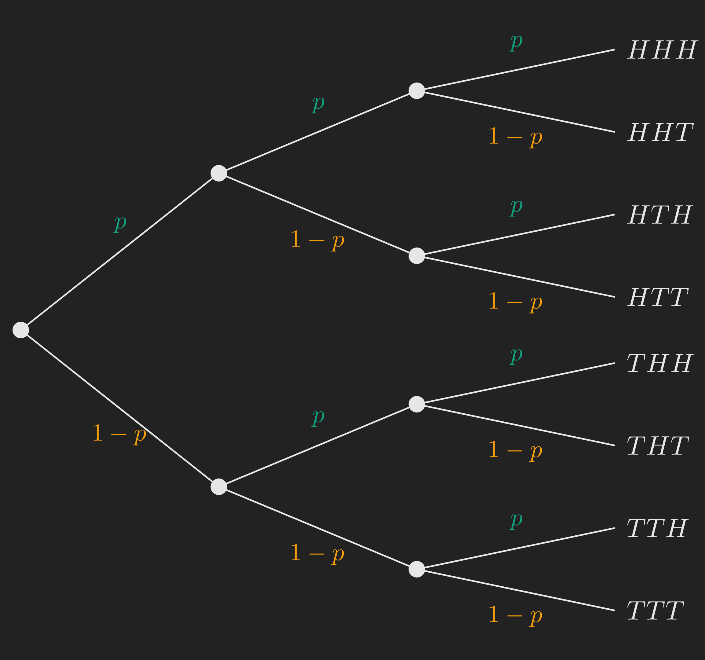
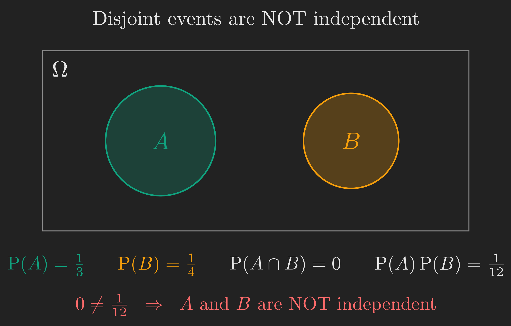
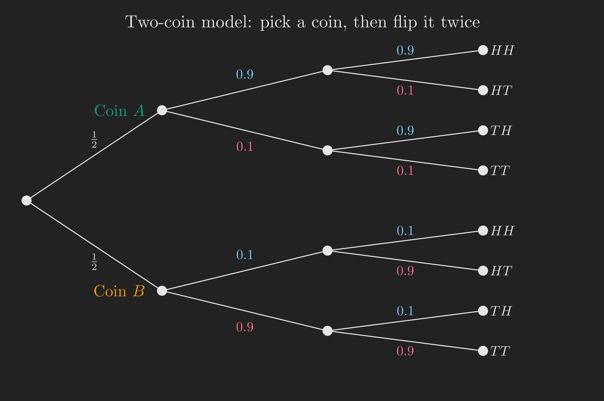
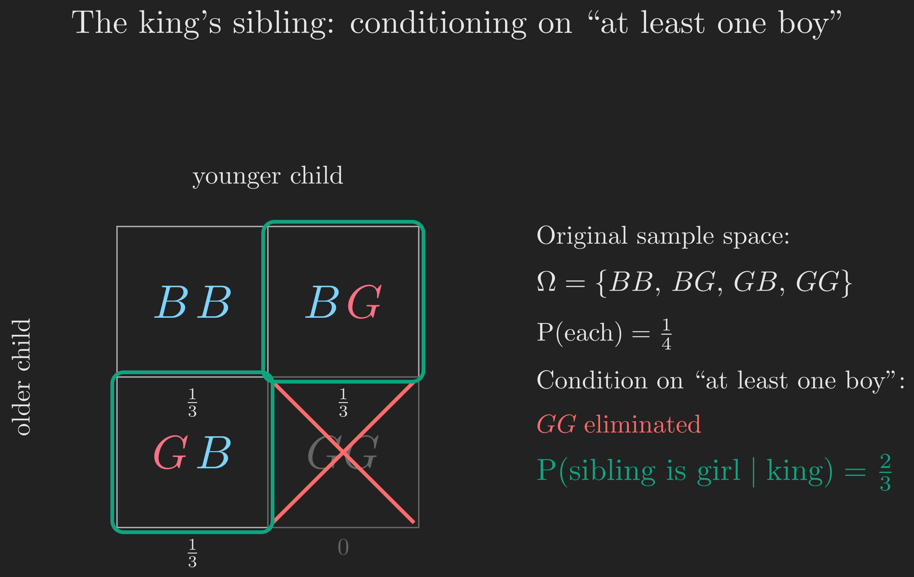

This post is the third entry in a probability and statistics series following the MIT OpenCourseWare lectures by Professor John Tsitsiklis [@probabilistic-systems-analysis-applied-probability-playlist; @intro-to-probability-spring-2018-playlist], with the corresponding chapter from @bertsekas2008introduction as the textbook companion. The previous post covered conditional probability, the multiplication rule, the total probability theorem, and Bayes' rule. Today we focus on a single new concept that turns out to be remarkably subtle: **independence**.

# Where We Are, and Where We're Going

Last time we discovered that learning a piece of information can dramatically change our probability assessments. If somebody tells us that an event $B$ occurred, we transport ourselves to a smaller sample space and rescale all probabilities accordingly. The new probabilities are written $\mathrm{P}(A \mid B)$.

But here is a natural follow-up question. Sometimes the information we receive is just useless noise. If I flip a coin in New York today and you flip a coin in Tokyo tomorrow, learning my outcome shouldn't change your beliefs about yours one bit. Surely we deserve a precise mathematical name for that situation? That name is **independence**.

This sounds easy. It is not. Independence is one of the trickiest concepts in elementary probability because it traps people in three common ways:

1. They confuse independence with disjointness.
2. They forget that conditioning can destroy independence (and sometimes create it).
3. They confuse pairwise independence with the stronger property of independence of a whole collection of events.

We are going to walk through all three traps carefully, on examples small enough to hold in your head. Here is the journey.

```{mermaid}
%%| fig-align: center
flowchart TD
    A["Warmup<br/>3 tosses of a biased coin"] --> B["Spotting the special feature<br/>information that doesn't help"]
    B --> C["Defining independence<br/>P(A and B) = P(A) P(B)"]
    C --> D["Trap 1<br/>independence is NOT disjointness"]
    D --> E["Trap 2<br/>conditioning can change independence"]
    E --> F["Independence of many events"]
    F --> G["Trap 3<br/>pairwise independence is weaker"]
    G --> H["Closing puzzle<br/>The king's sibling"]
    H --> I["What we learned"]

    style C fill:#10a37f,color:#fff
    style H fill:#f59e0b,color:#fff
```

The two highlighted boxes are the conceptual heart of the post: the formal definition we will land on, and the puzzle we'll use to test our understanding at the end.

# A Warmup: Three Tosses of a Biased Coin

Before we introduce anything new, let's flex the three skills we built last time, because we'll need them today: the multiplication rule, the total probability theorem, and Bayes' rule.

Suppose we have a biased coin with $\mathrm{P}(H) = p$ and $\mathrm{P}(T) = 1 - p$, and we toss it three times. The whole experiment, all three tosses, is one big experiment. Its sample space consists of strings of length three over $\{H, T\}$, so there are $2^3 = 8$ possible outcomes: $HHH$, $HHT$, $HTH$, $HTT$, $THH$, $THT$, $TTH$, $TTT$.

A picture is much clearer than a list. We draw the outcomes as leaves of a binary tree, where each level corresponds to one toss.

{#fig-three_toss_tree fig-align="center" width=70%}

A subtle but important point about this tree. The label $p$ on the branch from the root is just $\mathrm{P}(\text{toss 1 is } H)$, easy. But the label $p$ on a branch deeper in the tree is actually a *conditional* probability, namely the probability that this toss is $H$ given everything that happened on the path so far. The reason every branch in our tree carries the same number $p$ is precisely because we are assuming that each toss "behaves the same" no matter what happened before. We will make that assumption mathematically respectable in just a moment, when we define independence.

## Skill 1: The Multiplication Rule

What is $\mathrm{P}(THT)$, the probability that we get tails, heads, tails in that order?

We follow the path that leads to the leaf $THT$ and multiply the conditional probabilities along it:

$$
\mathrm{P}(THT) = (1 - p) \cdot p \cdot (1 - p) = p \left(1 - p\right)^2.
$$

This is just the multiplication rule applied repeatedly:

$$
\mathrm{P}(A \cap B \cap C) = \mathrm{P}(A) \cdot \mathrm{P}(B \mid A) \cdot \mathrm{P}(C \mid A \cap B).
$$

## Skill 2: The Total Probability Theorem

What is the probability that we get exactly one head in the three tosses? Call this event $E_1$. It can happen in three different ways: $HTT$, $THT$, $TTH$. These three outcomes are disjoint, so:

$$
\mathrm{P}(E_1) = \mathrm{P}(HTT) + \mathrm{P}(THT) + \mathrm{P}(TTH).
$$

By the multiplication rule, each of these three outcomes has the same probability $p (1 - p)^2$. (Convince yourself by tracing each path on the tree.) So

$$
\mathrm{P}(E_1) = 3 p \left(1 - p\right)^2.
$$

## Skill 3: Bayes' Rule

Now suppose somebody tells us "exactly one of the three tosses came up heads." Given that, what is the probability that the very first toss was the head?

By symmetry, the head is equally likely to have appeared in any of the three positions, so the answer should be $1/3$. Let's verify with the formal definition:

$$
\mathrm{P}(\text{toss 1 is } H \mid E_1) = \frac{\mathrm{P}(\text{toss 1 is } H \,\cap\, E_1)}{\mathrm{P}(E_1)}.
$$

The numerator is the probability of the event "first toss is $H$ AND exactly one head appears." If the first toss is $H$ and there is exactly one head, then the other two tosses must both be $T$. So the numerator is just $\mathrm{P}(HTT) = p (1 - p)^2$. Plugging in:

$$
\mathrm{P}(\text{toss 1 is } H \mid E_1) = \frac{p \left(1 - p\right)^2}{3 p \left(1 - p\right)^2} = \frac{1}{3}.
$$

Intuition confirmed. We're warmed up.

# Spotting the Special Feature

Now look back at the tree. Stare at it for a moment. There is something special going on that we glossed over.

What is $\mathrm{P}(\text{toss 2 is } H)$? Without any extra information, it is $p$.

What is $\mathrm{P}(\text{toss 2 is } H \mid \text{toss 1 is } H)$? Reading off the tree, it's still $p$.

What is $\mathrm{P}(\text{toss 2 is } H \mid \text{toss 1 is } T)$? Again $p$.

So whether I tell you the result of toss 1, or I don't, your belief about toss 2 doesn't change. The information about toss 1 is *useless* for predicting toss 2. This is the property we want to capture mathematically.

Intuitively, two events are independent if knowing one of them gives you no information about the other. When you flip a coin in your kitchen and a colleague flips one in another country, the physical processes are unrelated, so the outcomes should be independent. That kind of physical separation is the most common source of independence in practice [@bertsekas2008introduction Chapter 1].

# Defining Independence

Let's translate the intuition into a definition. A first attempt:

::: {.callout-note}
## First attempt at a definition
Two events $A$ and $B$ are **independent** if $\mathrm{P}(B \mid A) = \mathrm{P}(B)$.

In words: telling you that $A$ occurred does not change your assessment of how likely $B$ is.
:::

This is a fine definition, but it has a small technical wart. Conditional probabilities $\mathrm{P}(B \mid A)$ are only defined when $\mathrm{P}(A) > 0$. So the definition above doesn't tell us anything about events with zero probability. We can patch this by using the multiplication rule.

Recall $\mathrm{P}(A \cap B) = \mathrm{P}(A) \cdot \mathrm{P}(B \mid A)$. If $\mathrm{P}(B \mid A) = \mathrm{P}(B)$, this becomes $\mathrm{P}(A \cap B) = \mathrm{P}(A) \cdot \mathrm{P}(B)$. This rewriting is the standard, cleaner definition.

::: {.callout-tip}
## The definition we'll actually use
Two events $A$ and $B$ are **independent** if

$$
\mathrm{P}(A \cap B) = \mathrm{P}(A) \cdot \mathrm{P}(B).
$$
:::

This definition has three things going for it:

1. It's symmetric in $A$ and $B$, just like the intuitive notion.
2. It works even when $\mathrm{P}(A) = 0$ or $\mathrm{P}(B) = 0$. (In fact, an event with zero probability is independent of every other event, since both sides of the equation are zero. That feels weird at first, but it's harmless.)
3. When $\mathrm{P}(A) > 0$, it implies the intuitive form $\mathrm{P}(B \mid A) = \mathrm{P}(B)$.

You can think of this as a *numerical check*. To verify whether $A$ and $B$ are independent, compute the three numbers $\mathrm{P}(A)$, $\mathrm{P}(B)$, $\mathrm{P}(A \cap B)$, and check whether the last equals the product of the first two.

Now let's confront the first major confusion that trips people up.

# Trap 1: Independence Is NOT Disjointness

Here is a Venn diagram I bet you've drawn many times. Two non-overlapping circles inside a rectangle.

{#fig-independence_vs_disjointness fig-align="center" width=70%}

The picture might tempt you to say "$A$ and $B$ are separate, so they should be independent." Resist this temptation. Disjoint events are *maximally dependent*, not independent.

Here's why. Suppose $\mathrm{P}(A) = 1/3$ and $\mathrm{P}(B) = 1/4$, and the two events are disjoint. Then:

- $\mathrm{P}(A \cap B) = 0$ because there's nothing in the overlap.
- $\mathrm{P}(A) \cdot \mathrm{P}(B) = \frac{1}{3} \cdot \frac{1}{4} = \frac{1}{12}$.

These are not equal, so $A$ and $B$ are *not* independent.

The intuition makes this even clearer. If I tell you "$A$ occurred," you immediately know that $B$ did *not* occur, because $A$ and $B$ have no overlap. That is a huge amount of information about $B$. Disjoint events are like Siamese twins joined at the hip: knowing one event's status pins down the other.

::: {.callout-warning}
## Common mistake
Drawing a Venn diagram is rarely enough to decide independence. Independence is a *numerical* condition. You need actual probabilities for the events, then you check whether $\mathrm{P}(A \cap B) = \mathrm{P}(A) \cdot \mathrm{P}(B)$.
:::

We're now ready for the second, deeper trap.

# Trap 2: Conditioning Can Change Independence

We've defined independence in the original probability model. But last time we learned that once we condition on some event $C$, we live in a new probability law $\mathrm{P}(\,\cdot\, \mid C)$. Inside that conditional universe, we can ask the same question: are $A$ and $B$ independent?

::: {.callout-note}
## Conditional independence
$A$ and $B$ are **conditionally independent given $C$** if

$$
\mathrm{P}(A \cap B \mid C) = \mathrm{P}(A \mid C) \cdot \mathrm{P}(B \mid C).
$$

It's just independence applied inside the conditional probability law $\mathrm{P}(\,\cdot\, \mid C)$.
:::

The natural question is: does independence in the original model imply conditional independence given $C$? And vice versa? The answer to both is **no**, and the failure cases are illuminating.

## (a) Independence Can Be Destroyed by Conditioning

Suppose we have events $A$ and $B$ that are independent in the original model. Now we are told that some other event $C$ occurred. Inside the conditional universe, $A$ and $B$ might no longer be independent.

A clean way to see this: imagine $A$ and $B$ are arranged so they overlap, and let $C$ be a region that intersects $A$ and $B$ in disjoint pieces. Then inside $C$, the parts of $A$ and $B$ don't overlap at all, so they become disjoint conditionally. And we just learned that disjoint events with positive probability are not independent. So conditioning on $C$ can *destroy* independence.

## (b) Independence Can Be Created by Conditioning

This direction is more interesting and shows up everywhere in real applications. The idea: events that are dependent in the original model might become independent once we condition on the right thing.

Here's the lecture's example. Imagine two badly biased coins.

- Coin $A$: $\mathrm{P}(H \mid \text{coin } A) = 0.9$.
- Coin $B$: $\mathrm{P}(H \mid \text{coin } B) = 0.1$.

I pick one coin at random, each with probability $1/2$, and then I flip the chosen coin many times. The flips of the *chosen* coin are physically independent of each other.

{#fig-two_coin_tree fig-align="center" width=100%}

Here is the question. Are the coin tosses independent in the *overall* (unconditional) model?

Let's check. What is $\mathrm{P}(\text{toss 11 is } H)$? By the total probability theorem:

$$
\mathrm{P}(\text{toss 11 is } H) = \frac{1}{2} \cdot 0.9 + \frac{1}{2} \cdot 0.1 = 0.5.
$$

The biases cancel out. So unconditionally, each toss is heads with probability $1/2$.

Now, what is $\mathrm{P}(\text{toss 11 is } H \mid \text{first 10 tosses were all heads})$?

If you saw 10 heads in a row, you would become very suspicious that you're flipping coin $A$. The probability of 10 heads in a row from coin $A$ is $0.9^{10} \approx 0.349$, while from coin $B$ it is $0.1^{10} \approx 10^{-10}$. The ratio is enormous: 10 consecutive heads makes coin $A$ overwhelmingly more plausible. Once you're nearly certain it's coin $A$, your prediction for toss 11 jumps from $0.5$ to about $0.9$.

So $\mathrm{P}(\text{toss 11 is } H \mid \text{first 10 are } H) \approx 0.9 \neq 0.5 = \mathrm{P}(\text{toss 11 is } H)$. The tosses are *not* independent in the overall model. The choice of coin creates a hidden link between them.

But! Conditional on which coin we chose, the tosses *are* independent. So:

::: {.callout-tip}
## A counterintuitive truth
The coin tosses are **conditionally independent given the coin**, but **not independent unconditionally**.

The unconditional dependence is created by the latent variable (which coin), and conditioning on that variable removes it. This pattern, hidden variables creating apparent dependence, is at the heart of much of statistical modeling, including Bayesian inference and graphical models [@blitzstein2019introduction Chapter 2].
:::

## Let's Verify This with a Simulation

Words and formulas are great, but seeing this play out in code makes it concrete. Let's simulate the two-coin experiment many times and check both claims empirically.

```{python}
#| fig-align: center
import numpy as np
import matplotlib.pyplot as plt

plt.style.use('dark_background')
rng = np.random.default_rng(seed=42)

n_experiments = 100_000
n_tosses = 11

# Step 1: Pick a coin uniformly at random for each experiment
coin_choice = rng.integers(0, 2, size=n_experiments)  # 0 -> Coin A, 1 -> Coin B
p_heads = np.where(coin_choice == 0, 0.9, 0.1)        # bias of the chosen coin

# Step 2: Generate 11 tosses for each experiment, given the chosen coin
tosses = (rng.random((n_experiments, n_tosses)) < p_heads[:, None]).astype(int)

# Unconditional probability that toss 11 is heads
p_unconditional = tosses[:, 10].mean()

# Conditional probability that toss 11 is heads, given the first 10 were all heads
mask_first_10_all_heads = tosses[:, :10].sum(axis=1) == 10
p_conditional = tosses[mask_first_10_all_heads, 10].mean()

# Conditional probability of heads on toss 11, GIVEN we know it's coin A
p_given_coin_A = tosses[coin_choice == 0, 10].mean()

print(f"Total experiments simulated: {n_experiments:,}")
print(f"Experiments where first 10 tosses were all heads: {mask_first_10_all_heads.sum():,}")
print()
print(f"P(toss 11 = H)                          ~ {p_unconditional:.4f}  (theory: 0.5)")
print(f"P(toss 11 = H | first 10 were heads)    ~ {p_conditional:.4f}  (theory: ~0.9)")
print(f"P(toss 11 = H | coin A)                 ~ {p_given_coin_A:.4f}  (theory: 0.9)")
```

The unconditional probability sits near $0.5$, but once we condition on "first 10 were heads," it jumps to roughly $0.9$. The tosses are not independent overall. Yet if we condition on the coin itself (the third printout), we recover exactly $0.9$, the bias of coin $A$, regardless of any history of tosses. That last number not budging based on history is exactly conditional independence in action.

Let's also visualize how confidence in "this is coin $A$" grows as we observe more heads in a row.

```{python}
#| fig-align: center
# For each k from 0 to 15, compute P(coin A | first k tosses were all heads)
ks = np.arange(0, 16)
p_A_given_k_heads = []
for k in ks:
    if k == 0:
        p_A_given_k_heads.append(0.5)
        continue
    # Bayes: P(A | k heads) = P(k heads | A) P(A) / P(k heads)
    num = (0.9 ** k) * 0.5
    den = (0.9 ** k) * 0.5 + (0.1 ** k) * 0.5
    p_A_given_k_heads.append(num / den)

fig, ax = plt.subplots(figsize=(7, 4))
ax.plot(ks, p_A_given_k_heads, marker='o', color='#10a37f', linewidth=2)
ax.axhline(0.5, color='#888', linestyle='--', alpha=0.6, label='Prior P(coin A) = 0.5')
ax.set_xlabel('Number of consecutive heads observed')
ax.set_ylabel('P(coin A | observation)')
ax.set_title('Posterior belief that we picked coin A')
ax.set_ylim(0, 1.05)
ax.legend()
ax.grid(alpha=0.3)
plt.tight_layout()
plt.show()
```

By the time we've seen 5 heads in a row, we're already over 99% sure it's coin $A$. After 10, it's a near-certainty. This is exactly the inference our brains do (informally) when somebody flips heads "way too many times in a row." We update our belief about *which kind of coin* we're holding, and that updated belief drives our prediction for the next toss.

# Independence of Many Events

We've defined independence for a *pair* of events. But often we want to talk about a collection: "these 10 coin tosses are all independent of each other." How do we extend the definition?

Intuitively, the answer is the same as before: information about some events should give us no information about the others. But translating this cleanly into math takes a moment of care.

::: {.callout-tip}
## Independence of a collection of events
Events $A_1, A_2, \dots, A_n$ are **(mutually) independent** if for every choice of distinct indices $i_1, i_2, \dots, i_k$ from $\{1, 2, \dots, n\}$,

$$
\mathrm{P}\left(A_{i_1} \cap A_{i_2} \cap \cdots \cap A_{i_k}\right) = \mathrm{P}\left(A_{i_1}\right) \cdot \mathrm{P}\left(A_{i_2}\right) \cdots \mathrm{P}\left(A_{i_k}\right).
$$

That is, the probability of any intersection of any subset of these events factors into the product of individual probabilities.
:::

For three events $A_1, A_2, A_3$, the definition demands four equalities:

$$
\begin{align*}
  \mathrm{P}(A_1 \cap A_2) &= \mathrm{P}(A_1) \cdot \mathrm{P}(A_2),\\
  \mathrm{P}(A_1 \cap A_3) &= \mathrm{P}(A_1) \cdot \mathrm{P}(A_3),\\
  \mathrm{P}(A_2 \cap A_3) &= \mathrm{P}(A_2) \cdot \mathrm{P}(A_3),\\
  \mathrm{P}(A_1 \cap A_2 \cap A_3) &= \mathrm{P}(A_1) \cdot \mathrm{P}(A_2) \cdot \mathrm{P}(A_3).
\end{align*}
$$

The first three are exactly the statement "every pair is independent." But the fourth, the three-way intersection, is *not* implied by the first three. That is the next trap.

# Trap 3: Pairwise Independence Is Weaker Than Independence

Here is an example that drives the point home. Take two flips of a fair coin. The four outcomes $HH$, $HT$, $TH$, $TT$ each have probability $1/4$.

{#fig-pairwise_independence fig-align="center" width=85%}

Define three events:

- $A$: the first toss is $H$, so $A = \{HH, HT\}$.
- $B$: the second toss is $H$, so $B = \{HH, TH\}$.
- $C$: the two tosses give the same result, so $C = \{HH, TT\}$.

Each of these events has probability $1/2$. Now let's check pairwise independence:

$$
\mathrm{P}(A \cap B) = \mathrm{P}(\{HH\}) = \frac{1}{4} = \frac{1}{2} \cdot \frac{1}{2} = \mathrm{P}(A) \cdot \mathrm{P}(B). \checkmark
$$

$$
\mathrm{P}(A \cap C) = \mathrm{P}(\{HH\}) = \frac{1}{4} = \frac{1}{2} \cdot \frac{1}{2} = \mathrm{P}(A) \cdot \mathrm{P}(C). \checkmark
$$

$$
\mathrm{P}(B \cap C) = \mathrm{P}(\{HH\}) = \frac{1}{4} = \frac{1}{2} \cdot \frac{1}{2} = \mathrm{P}(B) \cdot \mathrm{P}(C). \checkmark
$$

So all three pairs are independent. Now check the triple:

$$
\mathrm{P}(A \cap B \cap C) = \mathrm{P}(\{HH\}) = \frac{1}{4}.
$$

But $\mathrm{P}(A) \cdot \mathrm{P}(B) \cdot \mathrm{P}(C) = \frac{1}{2} \cdot \frac{1}{2} \cdot \frac{1}{2} = \frac{1}{8}$.

These are not equal, so the three events are *not* mutually independent.

The intuition is that any single event ($A$, $B$, or $C$ alone) gives no information about either of the others. But once you know *two* of them, you've pinned down the third completely. If I tell you the first toss was $H$ and the second toss was $H$, then I've told you that $C$ occurred (the tosses agree). The event $C$ becomes certain, even though knowing just $A$ alone (or just $B$ alone) gives you no help in predicting $C$.

::: {.callout-note}
## The takeaway
**Pairwise independence does not imply mutual independence.** The full definition requires the factorization to hold for every subcollection, not just every pair.
:::

# Mini-Recap

We've covered a lot of ground. Let's pause and take stock.

```{mermaid}
%%| fig-align: center
flowchart LR
    A["Independence<br/>P(A and B) = P(A) P(B)"] --> B["NOT the same as<br/>disjointness"]
    A --> C["Conditioning can<br/>create or destroy it"]
    A --> D["For a collection,<br/>requires factorization<br/>over every subset"]
    D --> E["Pairwise is<br/>strictly weaker"]

    style A fill:#10a37f,color:#fff
```

We have a clean definition, three traps, and a sense for why each trap is real. Time for the payoff: a famous puzzle that uses everything we've built.

# Closing Puzzle: The King's Sibling

Here is a problem that has appeared in many textbooks:

> *Consider one of those anachronistic kingdoms where boys take precedence over girls, so that if there's a son, he becomes king (even if he has older sisters). The royal family has two children, and we know there is a king. What is the probability that the king's sibling is female?*

For genetics, assume each child is independently a boy or a girl with probability $1/2$ each.

## The Naive Answer

The king is a child. His sibling is another child. Different children's sexes are independent. So the sibling is a girl with probability $1/2$.

This is the naive answer. It feels right. It is also (arguably) wrong.

## The "Formal" Answer

Let's set up the model carefully. The royal family has exactly two children, so the original sample space, before any conditioning, is

$$
\Omega = \{BB, BG, GB, GG\},
$$

where the first letter is the older child, and each outcome has probability $1/4$.

Now: "we know there is a king" means at least one of the two children is a boy. That eliminates $GG$. We are left with the conditional sample space:

$$
\Omega' = \{BB, BG, GB\},
$$

each outcome having conditional probability $1/3$.

{#fig-kings_sibling fig-align="center" width=80%}

In how many of these three outcomes is "the king's sibling a girl"? Looking at $\Omega'$:

- $BB$: both children are boys, so the sibling is a boy.
- $BG$: there's one boy (the king) and one girl (the sibling).
- $GB$: same situation, one boy and one girl, just born in the opposite order.

So in 2 out of 3 conditional outcomes, the sibling is a girl. The "formal" answer is

$$
\mathrm{P}(\text{sibling is a girl} \mid \text{at least one boy}) = \frac{2}{3}.
$$

This is a famous counterintuitive result, and it's the answer most textbooks endorse.

## But Wait: The Hidden Assumptions

Here's the twist. The answer $2/3$ depends on a modeling assumption we never stated explicitly: **the royal family decided to have exactly two children, no more, no less, and then we observed the result.**

Suppose the family had instead followed the strategy "keep having children until we get a boy, then stop." Under this rule, the only way to have ended up with exactly two children is if the first was a girl and the second was a boy. So the sibling is *certainly* a girl. The probability is $1$.

Or imagine an even darker scenario where, in this kingdom, kings traditionally eliminate any brothers to secure the throne. Then "the king has a sibling" implies the sibling is not a male claimant, so the sibling is a girl with probability $1$ again [@blitzstein2019introduction].

::: {.callout-warning}
## Loose problems require careful modeling
Probability problems stated in words often hide assumptions about the underlying random process. The same observation, "we see a king," can correspond to very different probability models depending on *how* the observation came about. Always make your modeling assumptions explicit before computing.
:::

This is the deepest lesson of the entire post. Independence, conditional probability, all of these tools are extremely powerful, but they only give correct answers when applied to the *right model*. And the right model isn't always obvious from a problem statement.

# What We Learned

Let's revisit our roadmap, and trace the full journey.

```{mermaid}
%%| fig-align: center
flowchart TD
    A["Warmup<br/>3 tosses of a biased coin"] --> B["Spotting the special feature<br/>information that doesn't help"]
    B --> C["Defining independence<br/>P(A and B) = P(A) P(B)"]
    C --> D["Trap 1<br/>independence is NOT disjointness"]
    D --> E["Trap 2<br/>conditioning can change independence"]
    E --> F["Independence of many events"]
    F --> G["Trap 3<br/>pairwise independence is weaker"]
    G --> H["Closing puzzle<br/>The king's sibling"]
    H --> I["What we learned"]

    style A fill:#444,color:#fff
    style B fill:#444,color:#fff
    style C fill:#444,color:#fff
    style D fill:#444,color:#fff
    style E fill:#444,color:#fff
    style F fill:#444,color:#fff
    style G fill:#444,color:#fff
    style H fill:#444,color:#fff
    style I fill:#10a37f,color:#fff
```

## The Story

We started with a tree diagram for three coin tosses and noticed that the conditional probability of heads on toss 2 was the same regardless of toss 1. That observation, that information about one event doesn't change our beliefs about another, became the intuition for independence. We codified it as the numerical condition $\mathrm{P}(A \cap B) = \mathrm{P}(A) \cdot \mathrm{P}(B)$, partly because it's symmetric and partly because it gracefully handles zero-probability events.

Then we navigated three traps. Independence is *not* disjointness; in fact disjoint events are maximally dependent. Conditioning on a third event can both destroy independence (when it forces previously-overlapping events to be disjoint) and create it (when an apparently-shared dependence is actually mediated by a hidden variable, like which of two coins is being flipped). And independence of a collection of events demands more than pairwise independence: it requires the factorization to hold for every subcollection.

Finally, the king's sibling puzzle showed that even with all these tools mastered, the answer to a probability question depends on the model you choose, and the natural-language statement of a problem rarely pins down a unique model. That ambiguity is not a bug in probability; it's a feature of the real world, and recognizing it is what separates careful probabilistic reasoning from sloppy intuition.

## Where We Go Next

In the next post, we'll start counting. Many problems in probability boil down to counting how many outcomes satisfy some condition divided by how many are possible in total, and that turns out to be its own art form. We'll meet permutations, combinations, the binomial coefficient, and a handful of beautiful tricks for taming combinatorial explosions.
