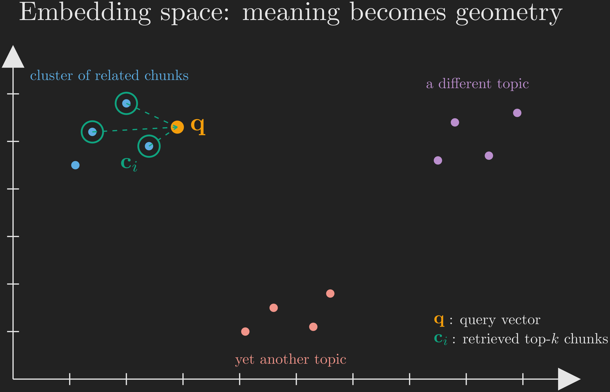

Imagine you are the single smartest student your school has ever produced. You have read an astonishing amount: textbooks, encyclopedias, novels, code, news archives, the lot. Now you are sitting an exam. Three things make this exam hard, and none of them are about how clever you are.

- First, it is a *closed-book* exam. You may only use what is already in your head.
- Second, everything you read was read *before a certain date*. The exam asks about an event from last week. You have no idea, because the world kept turning after you stopped reading.
- Third, some questions are about your school's private internal rulebook, a document you have never been allowed to see.

How do you cope? On the questions you know, you shine. On the recent event, you have nothing. On the questions about the rulebook, you do something dangerous: rather than say "I don't know," you write a fluent, confident, plausible-sounding answer that happens to be completely made up. And nowhere on your paper do you cite a single page or source, because everything came from memory and memory does not come with footnotes.

This is not a story about a student. This is the exact situation a Large Language Model (LLM) is in every time you talk to it. Hold on to this image, because the entire post is going to be about giving this brilliant-but-stuck student a way out. By the end, we will have turned the closed-book exam into an open-book one, with a sharp librarian who hands our student exactly the right pages for each question. That librarian is Retrieval Augmented Generation, or RAG.

We are going to invent RAG from scratch. We will not start from the answer; we will start from the problems, feel the pain of each one, try the obvious fixes, watch them fall short, and let RAG emerge as the thing we would have built anyway. Throughout, we are staying in overview mode. Later posts in this series go deep into each component; this one is the map of the whole territory.

Here is that map (@fig-roadmap).

```{mermaid}
%%| label: fig-roadmap
%%| fig-cap: "The roadmap for this post: why RAG matters, what RAG is, how it works, and where it breaks."
%%| fig-align: center
flowchart TD
    A["<b>Why RAG?</b><br/>The four problems<br/>with LLMs"] --> B["<b>What is RAG?</b><br/>Retrieval +<br/>Augmentation +<br/>Generation"]
    B --> C["<b>How RAG works</b><br/>The pipeline,<br/>end to end"]
    C --> D["<b>When RAG breaks</b><br/>Retriever vs<br/>generator failure"]
```

We will walk this trail top to bottom. First we earn the *why* by understanding what an LLM can and cannot do. Then we define the *what*, decomposing the three words in "Retrieval Augmented Generation." Then the *how*, where we build the pipeline box by box. Finally, the honest part: where RAG still breaks. Let's start walking.

# Why is RAG Important?

## A Quick Refresher on LLMs

You probably remember November 2022, when OpenAI launched ChatGPT. It surprised almost everyone. You could ask it about technology, coding, finance, healthcare, almost any domain, and it would answer quickly and fluently, as if a knowledgeable person were typing back to you. It was one of the first broadly reliable chatbots built on deep learning.

Where did that ability come from? ChatGPT was powered by a GPT model, which is built on the *transformer* architecture, a deep learning model whose defining feature is the *self-attention* mechanism [@vaswani2017attention]. In one sentence, self-attention lets the model weigh how much each word in a piece of text should pay attention to every other word, which is how it learns the inherent patterns of a language. But architecture alone does not make a model smart. What you train it on matters just as much.

These models are called *Large Language Models* for three concrete reasons, and it is worth slowing down on each:

- **Language** because they are trained on language, that is, on enormous amounts of text. From that text the model picks up grammar, syntax, semantics, common phrasing, and a great deal of world knowledge. This acquired skill is called Natural Language Understanding (NLU). Once the model has it, it can generate brand-new text by following the patterns it learned, which is where its *generative* ability comes from.
- **Large** because these models have billions, sometimes trillions, of parameters. Parameters are just the weights and biases of the network.
- **Model** because, underneath everything, it is a deep learning model.

Now connect this back to our exam student. The training process, called *pre-training*, is the student doing all their reading. The text comes from a vast slice of the internet: articles, books, web pages, blog posts, code repositories, and more. It is so massive that pre-training can run for weeks or months, and it is enormously expensive in compute, specialized expertise, storage, infrastructure, and energy.

Here is the crucial question: once the student has done all that reading, where does the knowledge *live*? It lives in the parameters. The weights and biases are the student's memory. They encode the grammar, the syntax, the semantics, the common phrases, and the general world knowledge. We call this the model's *parametric knowledge*: everything it knows purely from having been trained. Remember this term, because the entire post hinges on its limits.

One more thing about how this student actually answers. Despite all that sophistication, the core operation of an LLM is shockingly simple: predict the next word. An LLM is a next-word predictor. You give it some text (a *prompt*), and it predicts the single most likely next word. Then it does something recursive: it appends its own prediction to the input and feeds the whole thing back in to predict the *next* next word, over and over, until it predicts a special "end" signal.

A small concrete loop makes this vivid; @fig-next-word-loop traces it. Suppose the prompt is "Hello my name is Sushrut and I am ".

```{mermaid}
%%| label: fig-next-word-loop
%%| fig-cap: "The recursive next-word prediction loop. Each prediction is appended to the input and fed back in, until the model predicts a STOP signal."
%%| fig-align: center
flowchart TD
    P0["Hello my name is<br/>Sushrut and I am ___"] --> M1["LLM predicts: <b>23</b>"]
    M1 --> P1["...Sushrut and I am 23 ___"]
    P1 --> M2["LLM predicts: <b>years</b>"]
    M2 --> P2["...I am 23 years ___"]
    P2 --> M3["LLM predicts: <b>old</b>"]
    M3 --> Dots["... and so on, until<br/>the LLM predicts STOP"]
```

This is exactly why ChatGPT's output streams in word by word: you are watching the loop run. The takeaway is that an LLM's single job is to continue the prompt as fluently and plausibly as it can. Keep that word "plausibly" in mind; it is going to come back and bite us.

After pre-training, we serve the model to users. A user sends a prompt, the model generates a response, and this prompt-in, response-out process is called *inference*. Inference is exam day. And it is on exam day that our users started noticing problems. Four of them, specifically.

## Four Problems in LLMs

Each of these four problems is one of the three difficulties from our opening exam, made precise. @fig-four-problems shows them at a glance before we take them one at a time.

```{mermaid}
%%| label: fig-four-problems
%%| fig-cap: "The four problems that afflict an LLM relying on parametric knowledge alone."
%%| fig-align: center
mindmap
  root)"Four problems<br/>with LLMs"(
    ("1. Knowledge Cutoff<br/>frozen in time")
    ("2. Hallucination<br/>confident but false")
    ("3. No Source Attribution<br/>no footnotes")
    ("4. No Private Data<br/>never saw the rulebook")
```

### Problem 1: Knowledge Cutoff

Recall that pre-training is the student's reading phase, and it uses a fixed, static snapshot of internet data. To see why this matters, remember how you train any plain artificial neural network. You decide on an architecture (this is done before training), initialize the weights (often randomly), and then run a training loop with four steps repeated over and over:

1. **Forward propagation:** using the current weights, make a prediction.
2. **Loss calculation:** measure how wrong that prediction was.
3. **Backpropagation:** compute the gradient of every parameter with respect to that loss.
4. **Weight update:** nudge every parameter using those gradients.

After the loop finishes, you evaluate. Pre-training an LLM is the very same four-step loop, just at staggering scale, which is what makes it take weeks to months. And just as you do not swap out the dataset midway through training a small network, the LLM's training data does not change during pre-training. It is frozen.

Let's make this concrete with a timeline (@fig-knowledge-cutoff). Suppose we start pre-training in August 2025 on data collected up to July 2025. The model is huge, so training runs for months and finishes in December 2025. After careful testing, we deploy it to the public in February 2026. Everything looks great, until a user asks about something that happened in September 2025 and the model draws a blank.

```{mermaid}
%%| label: fig-knowledge-cutoff
%%| fig-cap: "The knowledge cutoff dramatized. The model never sees anything after the July 2025 data snapshot, so it cannot answer questions about later events."
%%| fig-align: center
flowchart TD
    A["<b>July 2025</b><br/>Data snapshot taken<br/>(everything after this<br/>is invisible)"] --> B["<b>August 2025</b><br/>Pre-training begins"]
    B --> C["<b>December 2025</b><br/>Pre-training ends<br/>(months of compute)"]
    C --> D["<b>February 2026</b><br/>Model deployed<br/>to the public"]
    D --> E["<b>User asks about<br/>Sept 2025</b><br/>Model has no idea;<br/>it never read that far"]
    style E fill:#c0392b,color:#fff
```

The model simply never read anything past July 2025. This is the **knowledge cutoff**. A tempting naive fix is "just retrain the model every day so it is always current." But we just saw that pre-training takes weeks to months and costs a fortune, so daily retraining is not remotely feasible. Every LLM has a knowledge cutoff date baked in. The model is, in a real sense, frozen in time, and using its parameters alone it cannot reach recent information.

### Problem 2: Hallucination

Hallucination is the exam student bluffing. The model produces false information, but it produces it with total confidence and complete fluency, so it *looks* legitimate while being, underneath, garbage [@ji2023survey].

A painfully common example: you are working on a cutting-edge research problem and you spot a gap in your knowledge, so you ask an LLM whether any papers address it. The model may cheerfully invent a paper that does not exist, complete with a plausible abstract, and even quote a sentence from this nonexistent paper. In every such case it is confidently generating false information.

Why does this happen? Go back to what the model fundamentally does. It acquired Natural Language Understanding, which means it generates text that *continues the prompt plausibly*. Plausibility is the target, not truth. If you ask a question, the model will generate a fluent continuation whether or not a true answer is available to it, because fluency is the only thing it was optimized for. So we say a model is **hallucinating** when it produces plausible-sounding but false information with confidence. (This is the "plausibly" from earlier coming back to bite us, exactly as promised.)

### Problem 3: No Source Attribution

When the model answers, it does not tell you *where* the answer came from. There are no citations, no page numbers, no "according to." This is the exam student again: every answer is from memory, and memory does not arrive with footnotes.

The deeper reason is that the text used during pre-training does not carry its sources along with it, because for the next-word prediction task, the source is irrelevant. The model learns the *content* of the internet but throws away the *provenance*. So an LLM cannot verify or trace where a given piece of its output came from.

### Problem 4: No Private Data Access

Now suppose you ask the model about a specific policy at the company you work for. It cannot help you, because it was never trained on your company's internal documents. Pre-training data does not include private or proprietary material. The model can only answer from what is stored in its parameters, that is, from its parametric knowledge, and your company rulebook was never in there. This is the third difficulty from our opening exam, the private rulebook you were never shown. An LLM cannot access proprietary documents.

## The Shared Root Cause

Step back and look at the four problems together. Three of them, knowledge cutoff, private data access, and hallucination, share a single root cause: **the pre-training dataset is static, and we cannot update it on the fly during training.** The student's reading is finished and we cannot make them read more without redoing the whole expensive process.

So the natural move is: if we cannot change what is *in* the student's head, can we hand them something *on exam day*? Can we give the model external knowledge at inference time, beyond its parametric knowledge?

The same logic rescues the source attribution problem. The reason the model cannot cite sources is that there is no source information in its parametric knowledge. (The original draft of this section once said there *is* such information; that was a slip. There is *no* provenance stored, which is precisely the problem.) If we attach external knowledge *that carries its sources with it*, the model can pass those sources along.

This gives us a single unifying idea. The parametric knowledge plus any external knowledge we hand the model is together called the model's **context**. In plain terms, the context is everything the model currently has to work with: what it remembers, plus what we just put on its desk.

Is adding external knowledge the only way out? Not quite. Before we commit to it, let's look at what a sensible beginner would try first.

## What a Beginner Would Try First

### Attempt 1: Prompt Engineering and In-Context Learning

The simplest possible idea: just put the external knowledge directly into the prompt. This is **prompt engineering**.

Consider private data again, in miniature. A user named Sushrut asks the model "What is my name?" The model cannot answer; it has never met Sushrut. But suppose the conversation went like this instead. Sushrut first says "Hi, my name is Sushrut," the model replies "Hello Sushrut, how can I help?", and then Sushrut asks "What is my name?", and crucially, this time the *entire chat history* is included in the prompt sent to the model. Now the model can answer, because the answer is sitting right there in its context.

This ability, where the model figures out how to respond using the context you provide rather than something it memorized in training, is called **in-context learning** (ICL) [@brown2020language]. The model did not learn the fact "this user is Sushrut" during training. It learned it at inference time, from the context. In practice the model first reaches for its parametric knowledge, and when that comes up short, it leans on the context you supplied.

The appeal of prompt engineering is obvious: it is fast and simple. Just put what the model needs into the prompt.

### Attempt 2: Fine-Tuning

A heavier alternative is **fine-tuning**: you retrain the model, but only a small, carefully chosen subset of its parameters, on your own custom data. Techniques here include PEFT, LoRA [@hu2021lora], and QLoRA [@dettmers2023qlora]. One important nuance: fine-tuning is usually *not* the right tool for adding new knowledge. It is mostly used to change the *style* of the responses, how the model talks, which is why it shows up in domains like healthcare and law where the precise register of the language matters.

Fine-tuning's drawbacks are real. It still demands meaningful compute (far less than pre-training, but far from free) and genuine expertise. It is nowhere near as simple as prompt engineering and ICL.

So in-context learning looks like the winner. Just hand the model everything it needs in the prompt and let ICL do the rest. Except there is a catch, and it is the catch that forces RAG into existence.

### The Catch: We Cannot Just Dump Everything In

Go back to the open-book exam, and this time take "open book" literally: you dump every textbook you own onto the desk for each question. Two things go wrong, and both have direct LLM analogues.

First, there is a hard limit on how much you can put in front of the model at once, called the **context window**. This exists *because* of the transformer's attention mechanism: the longer the input, the harder it becomes for attention to track relationships among all the words. Some models have a context window of around 200,000 tokens (a rough rule of thumb is about 1.3 tokens per word, or 3 tokens for every 4 words), and some large ones reach a million tokens. Whatever the number, the prompt cannot exceed it. You cannot pour a 10,000-page legal corpus into a window that holds a few hundred pages.

Second, even if everything *fit*, you would not want to fill the whole window, because of the **lost in the middle** problem [@liu2023lost]. LLMs pay the most attention to the beginning and the end of a long prompt and tend to neglect the middle. If you crammed 1,000 pages of context in, the model might effectively ignore the middle 700, and the answer you needed could be sitting right in that neglected middle.

So here is the tension we have built up to. We know external knowledge is the cure. We know ICL is how the model uses it. But we *cannot* hand the model everything, because the desk is too small and the student ignores the middle of a giant pile. We need to hand it only the *relevant* pages for each question.

That is the entire idea: store all the external knowledge in one place, and for each query, dynamically pull out only the small, relevant subset and put *that* into the context. We need a way to filter. That filtering machine, roughly, is Retrieval Augmented Generation.

Let's take stock before we name it properly (@fig-recap-why).

```{mermaid}
%%| label: fig-recap-why
%%| fig-cap: "Where we stand after Part 1: the *why* is settled, and we are about to define the *what*."
%%| fig-align: center
flowchart TD
    A["<b>Why RAG? &check;</b><br/>Four problems,<br/>one root cause:<br/>static parametric<br/>knowledge"] --> B["<b>What is RAG?</b><br/>(we are here)"]
    B --> C["<b>How RAG works</b>"]
    C --> D["<b>When RAG breaks</b>"]
    style A fill:#10a37f,color:#fff
    style B fill:#f59e0b,color:#000
```

We have earned the *why*: four problems, one shared root cause, and a clear requirement, namely, feed the model only the relevant external knowledge at inference time, within its context window. Now we give that requirement a name and a shape.

# What Exactly is RAG?

Our four problems were knowledge cutoff, hallucination, no source attribution, and no private data access. Our diagnosis was that in-context learning, fed a *filtered* context that fits comfortably inside the context window, is the cure. **Retrieval Augmented Generation** (RAG) is the system that delivers exactly that [@lewis2020retrieval]. Let's decompose the three words, using our librarian image as the guide.

- **Generation** is the easy one. The "generation" is just the LLM doing what it does best: using its generative ability to write the final answer. Our student still writes the exam answer; we are only changing what is on their desk.
- **Retrieval** is the librarian at work. We store all of our external knowledge in a database. When a user asks a question, the query first goes to this database, which searches for the stored knowledge most *similar* to the query, pulls it out, and hands it over. This is the dynamic filtering we said we needed. The database is smart: it returns only what is relevant to *this* query, and "relevant" means semantically similar, that is, similar in *meaning*, not just matching keywords. The results even come ranked, most similar at the top, least similar at the bottom, which lets us filter further by simply taking the top few.
- **Augmentation** is what we do with what the librarian hands us. To "augment" is to enhance. We take the top handful of retrieved pieces of knowledge and use them to *enhance* the user's original prompt, exactly the ICL idea from before. So the prompt that finally reaches the LLM is the user's question *plus* the relevant external knowledge the database filtered out for this specific query. This step of stitching the retrieved knowledge onto the user's prompt is called **context assembly**. The LLM then runs in-context learning over this augmented prompt and produces an answer that takes the retrieved knowledge into account.

Notice the elegance: because retrieval returns only a *few* relevant pieces, the context window stays comfortably unfilled, which sidesteps both the size limit and the lost-in-the-middle problem at the same time.

But I have been waving my hands at one word: *similar*. How does a database measure whether a chunk of text is "similar in meaning" to a query? That single question is the hinge of the whole "how," and it is where we turn next.

# How Does RAG Work?

We will build RAG one component at a time, then assemble them into the full pipeline, then trace a single query all the way through. @fig-rag-pipeline is the punchline diagram we are working toward. Do not worry about understanding every box yet; the rest of this section is just us walking each one.

```{mermaid}
%%| label: fig-rag-pipeline
%%| fig-cap: "The full RAG pipeline. Indexing (top) is done once, offline; the query path (bottom) runs for every user question."
%%| fig-align: center
flowchart TB
    subgraph Indexing["Indexing (done offline)"]
        direction TB
        KS["Knowledge Source<br/>PDF, docx, csv, ..."] --> DL["Document Loader<br/>parse + metadata"]
        DL --> CH["Chunking<br/>split into small pieces"]
        CH --> EM1["Embedder Model<br/>text to vector"]
        EM1 --> VS[("Vector Store /<br/>Knowledge Base")]
    end
    subgraph Query["Query (every user question)"]
        direction TB
        Q["User Query"] --> EM2["Embedder Model<br/>(the same one)"]
        EM2 --> SS["Similarity Search<br/>find top-k chunks"]
        SS --> AUG["Context Assembly<br/>augment the prompt"]
        AUG --> LLM["LLM<br/>(generation)"]
        LLM --> ANS["Grounded Answer"]
    end
    VS -.retrieve.-> SS
    Q -.original query.-> AUG
```

Notice the two zones. The top, **indexing**, is work we do *once*, offline, to prepare our knowledge. The bottom, **query**, runs *every time* a user asks something. Keep that split in mind; it explains a lot of the design choices below. Let's meet the components.

## Components of RAG

### Knowledge Source

First, a careful distinction: the *knowledge source* and the *knowledge base* are not the same thing. The knowledge base is a database, which we will reach shortly. The **knowledge source** is the raw external knowledge itself: everything we have that might help answer a user's questions. It can come in many formats: PDF, CSV, DOCX, TXT, Markdown, HTML, and even multimodal formats like MP4, MKV, and MP3. In our company-policy example, every internal document the company owns is the knowledge source.

A RAG pipeline first needs to extract the actual text content out of these documents, and the component that does this is the **document loader**. A good document loader does more than slurp bytes into RAM; it *parses* the content, reading it while preserving the document's structure. Because different formats have different structure, there is a different loader type per format: a PDF loader, a CSV loader, a DOCX loader, and so on. Loaders also capture the **metadata** attached to each document: its name, size, type, file path, creation date, and more. That metadata is going to matter a great deal when we want to cite sources.

### Chunking

After the loader has the parsed content of the knowledge source, we hit a problem. A single document can be enormous, say 100 pages. **Chunking** is the step that breaks the knowledge source into small pieces. If we chunk page by page, a 100-page PDF becomes 100 chunks. It is as though one huge document is split into 100 small documents, each carrying its own slice of text and its own metadata.

Why bother? Here is the reason, and it is worth stating now even though it will fully land in a moment: if we *did not* chunk, the next step would turn the entire 100-page document into a single representation, and you cannot filter "the relevant part" out of a single blob. Chunking is what makes fine-grained retrieval possible. Hold that thought.

### Embedding

Now the central trick. **Embedding** converts text into numbers, specifically into a *vector* (a list of numbers), so that a machine can compute with it. You may know classical NLP techniques that also turn text into numbers, like bag-of-words or TF-IDF. Embedding is different in one decisive way: it uses a deep learning model, and that model captures the *semantic meaning* of the text. It cares about underlying meaning and intent, not exact keyword matches. The resulting vector *is* a numerical fingerprint of meaning, and this is precisely the "similarity in meaning" we promised the retriever would use.

So an **embedder model** takes each chunk and produces a vector that encodes that chunk's meaning. One chunk, one vector. An important property: every embedder model outputs vectors of a *fixed* dimension. If the model emits 128-dimensional vectors, then a one-sentence chunk and a one-page chunk both come out as 128-dimensional vectors. The length of the input does not change the length of the output.

Now we can finally see *why* "similar in meaning" is something a computer can measure. Once every chunk is a point in the same vector space, semantically similar chunks land close together, and a query (once embedded the same way) lands near the chunks that mean the same thing. @fig-embedding-space shows the idea: chunk vectors scattered in space, clustered by meaning, with a query vector dropping in and its nearest neighbors, the top-$k$, circled.

{#fig-embedding-space fig-align="center" width=80%}

With meaning now living in geometry, retrieval becomes a search for nearby points. But where do all these vectors live, and who actually does the searching? That is the knowledge base.

### Knowledge Base

Recall *why* we are loading, chunking, and embedding in the first place: we have, say, a 100-page document, and we want the LLM to answer questions about it. The LLM never saw this document in training, so its contents are not in the model's parametric knowledge, which is exactly why we are using ICL and RAG.

Now notice that those three steps, loading, chunking, and embedding, are slow *and* repetitive. If the 100-page document is fixed, it would be wasteful to redo all three every single time a user asks a question. So in practice we do them once, up front (this is the offline *indexing* zone from @fig-rag-pipeline), and we *store* all the resulting embedding vectors. Then, whenever a user asks something, we can compute similarities efficiently without redoing the heavy lifting.

The database that stores these vectors is called a **vector store** or **vector database**, and once it is populated, it is what we have been calling the **knowledge base**. It behaves like any other database; we can run the usual create, read, update, and delete operations on it, which means we can keep it current.

Critically, we do not store *only* the vectors. Alongside each vector we also store the original chunk text and that chunk's metadata. Here is why each of those three pieces earns its place:

- The **vector** is what we search over for similarity.
- The **chunk text** is what we will actually feed to the LLM, since the model reads text, not vectors.
- The **metadata** tells us where the chunk came from, which is how RAG solves the source attribution problem.

### Retriever, Augmentation, and the Generator

Now the query zone. A user's query arrives as text, but the knowledge base holds vectors. So we run the query through the *same* embedder model used during indexing, producing a **query vector** of the same dimension as everything in the store. (It must be the same model, otherwise the query vector and the chunk vectors would not live in a comparable space.)

The **retriever** then computes a similarity score between the query vector and every chunk vector in the store. This score can be distance-based, for example Euclidean distance, where smaller distance means more similar. It takes the top-$k$ most similar chunks (here $k$ is a hyperparameter you choose) and pulls back their text and metadata. The retrieved chunk text is then appended to the user's original query to form the final **augmented prompt**, which is handed to the LLM. The LLM generates the answer.

One more piece is essential, and it directly fights hallucination. We add a **guardrail** instruction into the prompt: the LLM must *not* answer if the answer is not supported by the retrieved context. If the augmented prompt does not actually contain the answer, the model should decline rather than bluff. When this whole pipeline works, the model's answer is *grounded* in the knowledge base rather than conjured from thin air.

## Revisiting the Four Problems

We started this whole journey to fix four specific problems. Let's check our work by walking each one and asking, honestly, did RAG solve it? This table is our recap.

::: {.tbl tbl-colwidths="auto"}
| Problem | The old situation (LLM alone) | How RAG addresses it |
|:--|:--|:--|
| Knowledge cutoff | Frozen at the pre-training date | Add post-cutoff information to the knowledge base; the model retrieves it at inference |
| Hallucination | Answers are merely plausible, not grounded | Answers are grounded in retrieved facts, plus a guardrail to decline when unsupported |
| No source attribution | No provenance in parametric knowledge | Metadata stored with each chunk carries the source through to the answer |
| No private data access | Never trained on proprietary documents | Private documents become the knowledge base; the model retrieves from them |
: How RAG addresses each of the four LLM problems. {#tbl-four-problems style="width:90%; margin:auto;"}
:::

Walking through @tbl-four-problems in words:

1. **Knowledge cutoff** is solved by simply adding information about post-cutoff events to the knowledge base. The model no longer needs to have read it during training; it retrieves it on demand.
2. **Hallucination** is sharply reduced. The model hallucinates when it lacks grounding; RAG grounds the response in retrieved facts, and the guardrail tells it to decline when the context does not contain the answer.
3. **No source attribution** is solved because the vector store keeps each chunk's metadata, and metadata carries the source. The answer can now point back to where it came from.
4. **No private data access** is solved directly: we hand the model private data as the knowledge base, so users can ask questions about their own proprietary documents.

That is a clean sweep of the four problems we set out to fix. But it would be dishonest to stop here and pretend RAG always works. It does not. Knowing *how* it fails is what separates someone who has read about RAG from someone who can actually build one.

# When RAG Breaks

RAG is a chain, and a chain breaks at a link. There are two links, so there are two characteristic failure modes. Looking back at our pipeline, one failure lives in the retrieval half and one lives in the generation half, as @fig-rag-failures shows.

```{mermaid}
%%| label: fig-rag-failures
%%| fig-cap: "The two failure modes of a RAG system, located on the pipeline: retriever failure (wrong chunks) and generator failure (right chunks, wrong answer)."
%%| fig-align: center
flowchart TD
    Q["User Query"] --> R["Retriever"]
    R --> A["Augmented Prompt"]
    A --> G["LLM Generator"]
    G --> ANS["Answer"]
    R -. "<b>Retriever failure</b><br/>wrong chunks pulled" .-> R
    G -. "<b>Generator failure</b><br/>right chunks, wrong answer" .-> G
    style R fill:#c0392b,color:#fff
    style G fill:#c0392b,color:#fff
```

## Retriever Failure

In a **retriever failure**, the retriever pulls back chunks that are not actually the relevant ones. The context handed to the LLM is, in effect, the wrong pages, so the answer is wrong even if the LLM does everything else perfectly. Retriever failures usually trace back to how the knowledge base was built and how the embedder model behaves, for instance, poor chunking or an embedder that does not capture the meaning well. As the machine learning saying goes: garbage in, garbage out. If the assembled context is garbage, the answer will be too.

## Generator Failure

In a **generator failure**, the retriever did its job, the correct chunks are sitting in the context, but the LLM still produces an answer that is not fully accurate. The in-context learning broke down. Maybe the model misread the user's query, or maybe it failed to connect the right chunk to the question. Generator failures usually trace back to the choice and quality of the LLM itself.

The useful mental model is a relay race. The retriever runs the first leg and hands off to the generator. Drop the baton on either leg and the race is lost, even if the other runner was flawless. When you debug a RAG system, your first question is always: which leg dropped the baton?

# Where We've Been, and Where We're Going

Let's return to the exam hall where we started. We walked in as the brilliant-but-stuck student: closed-book, frozen at a cutoff date, prone to confident bluffing, unable to cite a source, and locked out of any private rulebook. We have now walked all the way to a student who, for each question, gets handed exactly the right few pages by a fast, semantically aware librarian, who is told to answer only from those pages and to say "I don't know" otherwise.

Tracing the full arc (@fig-recap-final): we identified four problems and saw they share one root cause, a static parametric memory. We tried prompt engineering and fine-tuning, and discovered that in-context learning is the right idea but that we cannot simply dump everything into the context window. That forced us to invent a filter, which we named RAG, and decoded as retrieval (the librarian), augmentation (enhancing the prompt with what the librarian found), and generation (the student writing the answer). We built the pipeline component by component, indexing once and querying many times, confirmed it addresses all four original problems, and then looked squarely at its two failure modes.

```{mermaid}
%%| label: fig-recap-final
%%| fig-cap: "The completed journey: all four stages of the roadmap, done."
%%| fig-align: center
flowchart TD
    A["<b>Why RAG? &check;</b>"] --> B["<b>What is RAG? &check;</b>"]
    B --> C["<b>How RAG works &check;</b>"]
    C --> D["<b>When RAG breaks &check;</b>"]
    style A fill:#10a37f,color:#fff
    style B fill:#10a37f,color:#fff
    style C fill:#10a37f,color:#fff
    style D fill:#10a37f,color:#fff
```

This was the map of the whole territory, deliberately at altitude. Every box we drew hides a world of detail, and that detail is the rest of this series. Coming up: how to chunk well (it is far subtler than "one page per chunk"), how embedder models actually turn meaning into geometry, what makes a good vector database and how similarity search scales, smarter retrieval strategies that go beyond plain top-$k$, and how to *evaluate* a RAG system so you can tell a retriever failure from a generator failure with data rather than guesswork.

For now, the one-sentence version to carry forward: RAG turns a closed-book exam into an open-book one with a great librarian, so the model answers from the right facts instead of from memory alone.
