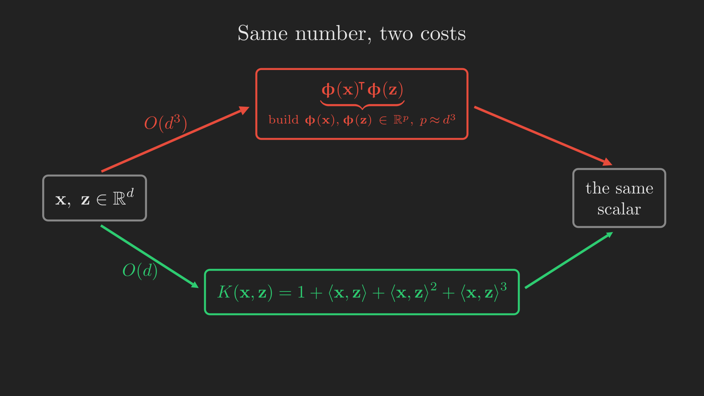

# Where We Left Off

In the [linear regression post](../linear-regression/index.qmd), we built our very first supervised learning algorithm: fit a straight line (or a flat hyperplane) to data. It was simple, it had a clean closed-form solution, and it worked. But it carried a quiet limitation that we mostly glossed over: it can only ever fit *straight* things. A line for one input, a plane for two, a flat hyperplane for many. Real relationships curve.

We did sneak in one escape hatch. To fit a curved trend, we can invent new inputs, like $x^2$ and $x^3$, and hand those to the same old linear machinery. The fit *looks* curved in the original variable even though the model is still linear in the (expanded) inputs. That trick was powerful, but it left an awkward question hanging in the air: how many new inputs should we add? Ten? A thousand? Could we, in some wild fantasy, add *infinitely many*?

This post takes that fantasy seriously. We will see that with an idea called the **kernel trick**, we really can work in feature spaces so enormous, even infinite-dimensional, that we could never write down a single feature vector on a computer, and yet still train and predict efficiently. Along the way, the humble inner product will turn out to be the secret hero of the whole story.

This post is largely based on the treatment in @ng_cs229_notes and the accompanying lecture [@stanford_cs229_ml_youtube]. Where a deeper or alternative treatment helps, we lean on the standard references @hastie2009elements, @bishop2006pattern, and the kernel-methods monograph @scholkopf2002learning.

## A concrete itch: a curve a line cannot fit

Let us make the limitation concrete. Suppose we are predicting the price $y$ of a house from a single number $x$, its living area. We collect a handful of houses and plot them. The trend is not a straight line: prices rise, level off, dip, and rise again as area grows. @fig-linear_vs_cubic_fit shows what happens when we try.

{#fig-linear_vs_cubic_fit fig-align="center" width=100%}

The straight line on the left is doing its honest best, and it is still terrible, because a line simply has no way to bend. The cubic on the right tracks the data. So how do we fit that cubic using the linear regression we already know? That is where our journey begins.

## The roadmap

Before we set off, here is the whole trail on one map. We start from the "add polynomial features" idea, watch it run into a computational wall, and then discover the kernel trick that tears the wall down. @fig-roadmap sketches the path.

```{mermaid}
%%| label: fig-roadmap
%%| fig-cap: "The journey of this post: from feature maps, into a computational wall, and out the other side via the kernel trick, ending at Mercer's theorem and the broad reach of kernels."
%%| fig-align: center
flowchart TD
    A["Linear models fit only straight lines"] --> B["Feature maps: x becomes ϕ(x)"]
    B --> C["LMS with features: just plug in ϕ(x)"]
    C --> D["Problem: ϕ(x) blows up to about d³"]
    D --> E["Insight: θ is always a combo of the data"]
    E --> F["Rewrite the algorithm with a kernel K(x, z)"]
    F --> G["ϕ vanishes: the kernelized algorithm"]
    G --> H["Kernels as similarity; Mercer's theorem"]
    H --> I["The reach of the kernel trick; on to SVMs"]

    style D fill:#c0392b,color:#fff
    style F fill:#2471a3,color:#fff
    style G fill:#1e8449,color:#fff
```

Two boxes are highlighted because they are the emotional beats of the story: the red one (the wall) and the blue and green ones (the trick that gets us past it). Keep them in the back of your mind.

# Feature Maps

Let us formalize the "invent new inputs" idea. Fitting a cubic

$$
y = \theta_3 x^3 + \theta_2 x^2 + \theta_1 x + \theta_0
$$

feels nonlinear, but watch what happens if we bundle the powers of $x$ into a single vector. Define a function $\boldsymbol{\upphi} : \mathbb{R} \to \mathbb{R}^4$ by

$$
\boldsymbol{\upphi}(x) =
\begin{bmatrix}
  1 \\ x \\ x^2 \\ x^3
\end{bmatrix} \in \mathbb{R}^4,
$$ {#eq-feature_map_cubic}

and collect the coefficients into $\boldsymbol{\uptheta} \in \mathbb{R}^4$, where

$$
\boldsymbol{\uptheta} =
\begin{bmatrix}
  \theta_0 \\ \theta_1 \\ \theta_2 \\ \theta_3
\end{bmatrix}.
$$

Then the cubic is just a dot product:

$$
\theta_3 x^3 + \theta_2 x^2 + \theta_1 x + \theta_0
=
\begin{bmatrix} \theta_0 & \theta_1 & \theta_2 & \theta_3 \end{bmatrix}
\begin{bmatrix} 1 \\ x \\ x^2 \\ x^3 \end{bmatrix}
= \boldsymbol{\uptheta}^{\intercal} \boldsymbol{\upphi}(x).
$$ {#eq-cubic_as_linear}

Read @eq-cubic_as_linear slowly, because it is the hinge of everything that follows. A cubic in $x$ is a *linear* function of the new quantities $\boldsymbol{\upphi}(x)$. The nonlinearity did not disappear; it got absorbed into the inputs. The model on top is as linear as ever.

This deserves some vocabulary, and it is vocabulary we will use for the rest of the post:

- The original input $x$ (the living area) is called the **attributes** of the problem.
- The transformed quantities $\boldsymbol{\upphi}(x) = \begin{bmatrix} 1 & x & x^2 & x^3 \end{bmatrix}^{\intercal}$ are called the **features**.
- The function $\boldsymbol{\upphi}$ that turns attributes into features is called a **feature map**.

(Different authors sometimes swap these words around, so if you read elsewhere and the terminology feels flipped, do not panic. Within this post, attributes go in, features come out.)

Nothing forces the attributes to be one-dimensional. In general, a feature map is a function

$$
\boldsymbol{\upphi} : \mathbb{R}^d \to \mathbb{R}^p,
$$

taking a $d$-dimensional attribute vector $\vb{x}$ to a $p$-dimensional feature vector $\boldsymbol{\upphi}(\vb{x})$. For the cubic example we had $d = 1$ and $p = 4$. In a moment we will let $p$ get frighteningly large.

::: {.callout-note}
## An intuition worth building: why higher dimensions help

Feature maps help with classification too, and there the payoff is easy to *see*. Imagine two classes in a plane: an inner blob near the origin and an outer ring around it (think of the blue and red points below). No straight line can separate them; a line always leaves some of the ring on the same side as the blob.

Now apply the feature map

$$
\boldsymbol{\upphi}
\left(
  \begin{bmatrix}
    x_1\\
    x_2
  \end{bmatrix}
\right) =
\begin{bmatrix}
x_1\\
x_2\\
x_1^2 + x_2^2
\end{bmatrix},
$$

which gives every point a third coordinate equal to its squared distance from the origin. The inner blob, being close to the origin, stays low; the outer ring shoots up. In this lifted 3D space a perfectly *flat* plane slides between the two classes. @fig-feature_map_lift animates exactly this lift.

{#fig-feature_map_lift fig-align="center" width=85%}

The moral, which holds for regression just as much as classification: a well-chosen feature map can turn a problem that is hopeless for a linear model into one a linear model handles with ease. This is a sidebar to build intuition; our main derivation below stays with regression. If the picture already convinced you that "more features = more power," you can carry that feeling forward and read on.
:::

# LMS With Features

Having a feature map is one thing; training with it is another. Happily, the training changes almost nothing. Recall from the [linear regression post](../linear-regression/index.qmd) that the batch gradient descent update for ordinary least squares, fitting $h_{\boldsymbol{\uptheta}}(\vb{x}) = \boldsymbol{\uptheta}^{\intercal}\vb{x}$, is

$$
\boldsymbol{\uptheta} := \boldsymbol{\uptheta} + \alpha \sum_{i=1}^{n} \left( y_i - \boldsymbol{\uptheta}^{\intercal} \vb{x}_i \right) \vb{x}_i,
$$ {#eq-bgd_original}

where $\alpha$ is the learning rate and the sum runs over all $n$ training examples. To fit $\boldsymbol{\uptheta}^{\intercal}\boldsymbol{\upphi}(\vb{x})$ instead, we do the laziest possible thing: replace every $\vb{x}_i$ by its feature vector $\boldsymbol{\upphi}(\vb{x}_i)$. The update becomes

$$
\boldsymbol{\uptheta} := \boldsymbol{\uptheta} + \alpha \sum_{i=1}^{n} \left( y_i - \boldsymbol{\uptheta}^{\intercal} \boldsymbol{\upphi}(\vb{x}_i) \right) \boldsymbol{\upphi}(\vb{x}_i).
$$ {#eq-bgd_features}

The stochastic (one-example-at-a-time) version is the same idea with the sum stripped away:

$$
\boldsymbol{\uptheta} := \boldsymbol{\uptheta} + \alpha \left( y_i - \boldsymbol{\uptheta}^{\intercal} \boldsymbol{\upphi}(\vb{x}_i) \right) \boldsymbol{\upphi}(\vb{x}_i).
$$ {#eq-sgd_features}

The only real difference between @eq-bgd_original and @eq-bgd_features hides in the dimensions. In ordinary least squares, $\boldsymbol{\uptheta} \in \mathbb{R}^d$, one weight per attribute. With features, $\boldsymbol{\uptheta} \in \mathbb{R}^p$, one weight per *feature*. As long as $p$ is modest, we are done: this is a complete, working algorithm. The trouble starts when $p$ is not modest.

# When Features Explode

Here is where the story hits its wall. The cubic feature map for a single attribute was harmless: four features. But suppose our attributes are genuinely high-dimensional, $\vb{x} \in \mathbb{R}^d$, and we want the model to see all interactions up to degree three. Then the feature vector must contain every monomial of degree at most three:

$$
\boldsymbol{\upphi}(\vb{x}) =
\begin{bmatrix}
1 \\ x_1 \\ x_2 \\ \vdots \\ x_1^2 \\ x_1 x_2 \\ x_1 x_3 \\ \vdots \\ x_1^3 \\ x_1^2 x_2 \\ \vdots
\end{bmatrix}.
$$ {#eq-phi_monomials}

Counting the constant, the $d$ linear terms, the $d^2$ quadratic terms, and the $d^3$ cubic terms, the feature vector has about $1 + d + d^2 + d^3$ entries, which is of order $d^3$.

Let us feel how bad that is. Take $d = 1000$, a perfectly ordinary size. Then $p \approx d^3 = 10^9$. Every single gradient descent update in @eq-bgd_features must build, store, and dot with vectors of a *billion* numbers. Compare that to ordinary least squares in @eq-bgd_original, where each update touches vectors of length $d = 1000$. We just made every step roughly $d^2 = 10^6$, a million, times slower, and we blew up our memory by the same factor. And all of that cost bought us nothing conceptually new; we merely chose a richer feature space.

It is tempting to conclude that this cost is simply unavoidable. After all, $\boldsymbol{\uptheta}$ itself lives in $\mathbb{R}^p$ with $p \approx d^3$; surely we have to store all billion of its entries and update every one of them?

That intuition is exactly what the next three sections will demolish. The punchline, worth previewing so you know why we are about to do some algebra: we will never store $\boldsymbol{\uptheta}$ at all.

# The Kernel Trick, Step 1: $\boldsymbol{\uptheta}$ Lives in the Span of the Data

The first crack in the wall is an observation so simple it is almost invisible. Suppose we start gradient descent from $\boldsymbol{\uptheta} = \vb{0}$. Then at *every* iteration, $\boldsymbol{\uptheta}$ is a linear combination of the feature vectors of the training points:

$$
\boldsymbol{\uptheta} = \sum_{i=1}^{n} \beta_i \, \boldsymbol{\upphi}(\vb{x}_i),
$$ {#eq-theta_as_beta}

for some scalars $\beta_1, \ldots, \beta_n$. Not one weight per feature, but one weight per *training example*.

Why is this true? By induction. At initialization, $\boldsymbol{\uptheta} = \vb{0} = \sum_{i=1}^{n} 0 \cdot \boldsymbol{\upphi}(\vb{x}_i)$, so the claim holds with all $\beta_i = 0$. Now suppose it holds at some step, that is, $\boldsymbol{\uptheta} = \sum_{i=1}^{n} \beta_i \, \boldsymbol{\upphi}(\vb{x}_i)$. Plug this into the update @eq-bgd_features and collect terms:

$$
\begin{align*}
\boldsymbol{\uptheta}
&:= \boldsymbol{\uptheta} + \alpha \sum_{i=1}^{n} \left( y_i - \boldsymbol{\uptheta}^{\intercal} \boldsymbol{\upphi}(\vb{x}_i) \right) \boldsymbol{\upphi}(\vb{x}_i) \\
&= \sum_{i=1}^{n} \beta_i \, \boldsymbol{\upphi}(\vb{x}_i) + \alpha \sum_{i=1}^{n} \left( y_i - \boldsymbol{\uptheta}^{\intercal} \boldsymbol{\upphi}(\vb{x}_i) \right) \boldsymbol{\upphi}(\vb{x}_i) \\
&= \sum_{i=1}^{n} \underbrace{\left( \beta_i + \alpha \left( y_i - \boldsymbol{\uptheta}^{\intercal} \boldsymbol{\upphi}(\vb{x}_i) \right) \right)}_{\text{new } \beta_i} \boldsymbol{\upphi}(\vb{x}_i).
\end{align*}
$$

The updated $\boldsymbol{\uptheta}$ is *again* a linear combination of the same $n$ feature vectors, just with new coefficients. The induction goes through. So no matter how gigantic $p$ is, and no matter how long we run gradient descent, $\boldsymbol{\uptheta}$ never escapes the span of the $n$ feature vectors $\boldsymbol{\upphi}(\vb{x}_1), \ldots, \boldsymbol{\upphi}(\vb{x}_n)$.

This suggests a change of bookkeeping. Instead of tracking the $p$-dimensional vector $\boldsymbol{\uptheta}$, track the $n$ coefficients $\boldsymbol{\upbeta} = \begin{bmatrix} \beta_1 & \cdots & \beta_n \end{bmatrix}^{\intercal}$. @fig-theta_vs_beta_duality shows the two representations side by side, and why the swap is such a bargain.

{#fig-theta_vs_beta_duality fig-align="center" width=85%}

This is our first genuine win. We have traded a potentially infinite object for a finite one. But a nagging worry remains: the update for the new $\beta_i$ still mentions the old $\boldsymbol{\uptheta}$ through the term $\boldsymbol{\uptheta}^{\intercal}\boldsymbol{\upphi}(\vb{x}_i)$. We have not actually gotten rid of $\boldsymbol{\uptheta}$ yet; we have only promised to. Let us make good on the promise.

# The Kernel Trick, Step 2: Rewrite Everything With the $\beta$'s

From the induction above, the coefficient update is

$$
\beta_i := \beta_i + \alpha \left( y_i - \boldsymbol{\uptheta}^{\intercal} \boldsymbol{\upphi}(\vb{x}_i) \right).
$$ {#eq-beta_update}

The offending term is $\boldsymbol{\uptheta}^{\intercal}\boldsymbol{\upphi}(\vb{x}_i)$. But we now know how to expand $\boldsymbol{\uptheta}$: it is $\sum_{j=1}^{n} \beta_j \, \boldsymbol{\upphi}(\vb{x}_j)$. Substituting that in,

$$
\forall\, i \in \{1, \ldots, n\}, \quad
\beta_i := \beta_i + \alpha \left( y_i - \sum_{j=1}^{n} \beta_j \, \boldsymbol{\upphi}(\vb{x}_j)^{\intercal} \boldsymbol{\upphi}(\vb{x}_i) \right).
$$ {#eq-beta_update_kernel}

Look at what is left. The high-dimensional $\boldsymbol{\uptheta}$ is gone. The features $\boldsymbol{\upphi}$ appear only inside the quantity $\boldsymbol{\upphi}(\vb{x}_j)^{\intercal}\boldsymbol{\upphi}(\vb{x}_i)$, the **inner product** of two feature vectors. To emphasize that it is an inner product, we write it with angle brackets,

$$
\left\langle \boldsymbol{\upphi}(\vb{x}_j), \boldsymbol{\upphi}(\vb{x}_i) \right\rangle \triangleq \boldsymbol{\upphi}(\vb{x}_j)^{\intercal} \boldsymbol{\upphi}(\vb{x}_i),
$$

and @eq-beta_update_kernel becomes an algorithm that updates $\boldsymbol{\upbeta}$ using nothing but these inner products.

This is real progress, but honesty compels a worry: each iteration seems to need $\left\langle \boldsymbol{\upphi}(\vb{x}_j), \boldsymbol{\upphi}(\vb{x}_i) \right\rangle$ for every pair $(i, j)$, and each such inner product is a dot product of two length-$p$ vectors, costing $O(p) \approx O(d^3)$. Have we really saved anything, or just moved the cost around? Two observations rescue us:

- **First, the inner products never change.** They depend only on the training data, not on $\boldsymbol{\upbeta}$. The examples sit still while $\boldsymbol{\upbeta}$ evolves. So we can compute all $n^2$ pairwise inner products *once*, before the loop starts, and reuse them on every iteration. That amortizes their cost across all $T$ iterations instead of paying it every step.
- **Second, and this is the magic, each inner product can often be computed without ever building $\boldsymbol{\upphi}$.** That is the content of the next section, and it is where the wall finally falls.

# The Kernel Trick, Step 3: Inner Products on the Cheap

Take our degree-$\leq 3$ monomial feature map from @eq-phi_monomials and, instead of building the two billion-entry vectors $\boldsymbol{\upphi}(\vb{x})$ and $\boldsymbol{\upphi}(\vb{z})$ and dotting them, let us just expand the inner product by hand and see if it simplifies:

$$
\begin{align*}
\left\langle \boldsymbol{\upphi}(\vb{x}), \boldsymbol{\upphi}(\vb{z}) \right\rangle
&= 1 + \sum_{j=1}^{d} x_j z_j + \sum_{j,k=1}^{d} x_j x_k z_j z_k + \sum_{j,k,l=1}^{d} x_j x_k x_l z_j z_k z_l \\
&= 1 + \left( \sum_{j=1}^{d} x_j z_j \right) + \left( \sum_{j=1}^{d} x_j z_j \right)^{2} + \left( \sum_{j=1}^{d} x_j z_j \right)^{3} \\
\therefore \left\langle \boldsymbol{\upphi}(\vb{x}), \boldsymbol{\upphi}(\vb{z}) \right\rangle &= 1 + \left\langle \vb{x}, \vb{z} \right\rangle + \left\langle \vb{x}, \vb{z} \right\rangle^{2} + \left\langle \vb{x}, \vb{z} \right\rangle^{3}.
\end{align*}
$$ {#eq-kernel_poly3}

Stare at @eq-kernel_poly3 for a second, because it is genuinely startling. The inner product of two *billion-dimensional* feature vectors equals a tiny formula built from $\left\langle \vb{x}, \vb{z} \right\rangle$, the inner product of the two *original* $d$-dimensional attribute vectors. The middle step is where the collapse happens: the sum over pairs $(j,k)$ factors into the square of a single sum, and the sum over triples $(j,k,l)$ factors into a cube, because $\left(\sum_j a_j\right)^2 = \sum_{j,k} a_j a_k$ and similarly for the cube.

The computational consequence is dramatic. To evaluate @eq-kernel_poly3 we compute $\left\langle \vb{x}, \vb{z} \right\rangle$ in $O(d)$ time, then square it, cube it, and add: a constant amount of extra work. Total cost $O(d)$, not $O(d^3)$. We get the exact same number the explicit computation would have given, at a millionth of the price. @fig-kernel_trick_schematic contrasts the two routes.

{#fig-kernel_trick_schematic fig-align="center" width=100%}

This cheap-to-evaluate stand-in for the feature inner product is important enough to get a name and a symbol. We define the **kernel** corresponding to a feature map $\boldsymbol{\upphi}$ as the function $K : \mathcal{X} \times \mathcal{X} \to \mathbb{R}$ given by

$$
K(\vb{x}, \vb{z}) \triangleq \left\langle \boldsymbol{\upphi}(\vb{x}), \boldsymbol{\upphi}(\vb{z}) \right\rangle,
$$ {#eq-kernel_def}

where $\mathcal{X}$ is the space the attributes live in (for our running example, $\mathcal{X} = \mathbb{R}^d$). For the degree-$\leq 3$ map, @eq-kernel_poly3 tells us $K(\vb{x}, \vb{z}) = 1 + \left\langle \vb{x}, \vb{z} \right\rangle + \left\langle \vb{x}, \vb{z} \right\rangle^{2} + \left\langle \vb{x}, \vb{z} \right\rangle^{3}$.

# The Kernelized Algorithm

We now have all the pieces. Let us assemble them into a clean procedure. Define the $n \times n$ **kernel matrix** (also called the Gram matrix) $\vb{K}$ by $K_{ij} = K(\vb{x}_i, \vb{x}_j)$. Precompute it once. Then iterate the coefficient update, which per coordinate reads

$$
\forall\, i \in \{1, \ldots, n\}, \quad \beta_i := \beta_i + \alpha \left( y_i - \sum_{j=1}^{n} \beta_j K_{ij} \right),
$$ {#eq-beta_final}

and which, written in one line for the whole vector $\boldsymbol{\upbeta}$ at once, is

$$
\boldsymbol{\upbeta} := \boldsymbol{\upbeta} + \alpha \left( \vb{y} - \vb{K} \boldsymbol{\upbeta} \right).
$$ {#eq-beta_vector}

Here $\vb{y} = \begin{bmatrix} y_1 & \cdots & y_n \end{bmatrix}^{\intercal}$ stacks the targets. @alg-kernelized_lms lays out the full method.

::: {#alg-kernelized_lms}
<pre class="pseudocode">
\begin{algorithm}
\caption{Kernelized LMS via batch gradient descent}
\begin{algorithmic}
\INPUT Examples $\vb{x}_1, \ldots, \vb{x}_n$ with targets $y_1, \ldots, y_n$; kernel $K$; learning rate $\alpha$; iterations $T$
\OUTPUT Coefficient vector $\boldsymbol{\upbeta} \in \mathbb{R}^n$
\STATE Precompute the kernel matrix $K_{ij} \leftarrow K(\vb{x}_i, \vb{x}_j)$ for all $i, j \in \{1, \ldots, n\}$
\STATE $\boldsymbol{\upbeta} \leftarrow \vb{0}$
\FOR{$t = 1$ \TO $T$}
    \STATE $\boldsymbol{\upbeta} \leftarrow \boldsymbol{\upbeta} + \alpha \left( \vb{y} - \vb{K} \boldsymbol{\upbeta} \right)$
\ENDFOR
\RETURN $\boldsymbol{\upbeta}$
\end{algorithmic}
\end{algorithm}
</pre>
:::

Each iteration of @alg-kernelized_lms is a single matrix-vector product, $O(n^2)$ work, with no reference to $p$ anywhere. Building the kernel matrix up front costs $n^2$ kernel evaluations, and each of those is $O(d)$ thanks to the shortcut. The dreaded $d^3$ never appears.

What about prediction? Once training gives us $\boldsymbol{\upbeta}$, the prediction on a fresh test point $\vb{x}_{\text{test}}$ is

$$
\begin{align*}
h_{\boldsymbol{\uptheta}}(\vb{x}_{\text{test}})
&= \boldsymbol{\uptheta}^{\intercal} \boldsymbol{\upphi}(\vb{x}_{\text{test}})\\
&= \sum_{i=1}^{n} \beta_i \, \boldsymbol{\upphi}(\vb{x}_i)^{\intercal} \boldsymbol{\upphi}(\vb{x}_{\text{test}})\\
\therefore h_{\boldsymbol{\uptheta}}(\vb{x}_{\text{test}}) &= \sum_{i=1}^{n} \beta_i \, K(\vb{x}_i, \vb{x}_{\text{test}}),
\end{align*}
$$ {#eq-predict_kernel}

again expressed purely through the kernel. Take a moment to appreciate what @eq-beta_vector and @eq-predict_kernel have in common:

::: {.callout-important}
## The one observation that makes it all work

Neither training (@eq-beta_vector) nor prediction (@eq-predict_kernel) contains $\boldsymbol{\upphi}(\vb{x})$ anywhere. The feature map has completely vanished. Every place it *would* have appeared, it appears only as a kernel value $K(\cdot, \cdot)$, a single number we know how to compute cheaply. This is why we can afford feature spaces we could never even write down.
:::

There is, however, no free lunch, and it is only fair to name the price. In ordinary linear regression, once we learned $\boldsymbol{\uptheta}$ we could throw the training set away; a new prediction needed only the vector $\boldsymbol{\uptheta}$. The kernelized version cannot do that. Look again at @eq-predict_kernel: to predict on $\vb{x}_{\text{test}}$ we must evaluate $K(\vb{x}_i, \vb{x}_{\text{test}})$ against *every* training point $\vb{x}_i$. So we are forced to carry the entire training set with us to test time.

This is the characteristic trade of kernel methods. We gave up the compact parameter vector $\boldsymbol{\uptheta}$, and in exchange we must remember the data. For small and medium datasets this is a fine bargain. For truly massive datasets it becomes a real bottleneck, which is one reason methods like deep neural networks, whose cost does not grow with the number of stored examples, tend to take over at large scale. (There is a partial escape: some kernel methods, notably the support vector machine we turn to next, learn a $\boldsymbol{\upbeta}$ that is mostly zeros, so only a handful of examples, the "support vectors," need to be kept.)

## A quick recap before we change perspective

Let us pause at the clearing and look at the map. @fig-roadmap-recap marks how far we have come.

```{mermaid}
%%| label: fig-roadmap-recap
%%| fig-cap: "Where we are now. We have crossed the wall: the kernelized algorithm trains and predicts without ever touching the feature map. Next we stop deriving kernels from feature maps and start choosing them directly."
%%| fig-align: center
flowchart TD
    A["Feature maps: x becomes ϕ(x)"] --> B["Plug into gradient descent"]
    B --> C["Wall: ϕ(x) is about d³"]
    C --> D["θ is a combo of the data"]
    D --> E["Rewrite with kernel K(x, z)"]
    E --> F["Done: ϕ has vanished"]
    F --> G["Next: choose K directly, without ϕ"]

    style F fill:#1e8449,color:#fff
    style G fill:#2471a3,color:#fff
```

So far we started from a feature map $\boldsymbol{\upphi}$ and *derived* its kernel. But the algorithm we ended up with, @alg-kernelized_lms, never uses $\boldsymbol{\upphi}$ at all; it only ever calls $K$. That raises a delicious possibility: what if we forget feature maps entirely and just *choose a kernel* directly? That inversion is the subject of the rest of the post.

# Kernels as Similarity

If we are going to pick kernels straight out of the air, it helps to have some intuition for what a kernel *means*. Here is a useful (if imperfect) way to think about it. Since $K(\vb{x}, \vb{z}) = \left\langle \boldsymbol{\upphi}(\vb{x}), \boldsymbol{\upphi}(\vb{z}) \right\rangle$ is an inner product, and inner products are large for vectors pointing the same way and small (or negative) for vectors pointing apart, we can read $K(\vb{x}, \vb{z})$ as a measure of **how similar** $\vb{x}$ and $\vb{z}$ are. Similar inputs, large kernel value; dissimilar inputs, small kernel value.

This flips the design process into something intuitive. Rather than asking "what features should I engineer?", we ask "what does it mean for two of my inputs to be similar?", and encode that answer as a kernel. A famous and enormously useful choice is the **Gaussian kernel** (also called the radial basis function or squared-exponential kernel):

$$
K(\vb{x}, \vb{z}) = \exp\left( -\frac{\left\| \vb{x} - \vb{z} \right\|^{2}}{2 \sigma^{2}} \right).
$$ {#eq-gaussian_kernel}

When $\vb{x}$ and $\vb{z}$ are close, $\left\| \vb{x} - \vb{z} \right\| \approx 0$ and $K \approx 1$: maximal similarity. When they are far apart, the exponent is a large negative number and $K \approx 0$: negligible similarity. The bandwidth $\sigma$ sets how quickly "similar" fades into "unrelated." @fig-gaussian_kernel_similarity shows both the resulting kernel matrix and the decay.

![Left: the kernel matrix $K_{ij} = K(\vb{x}_i, \vb{x}_j)$ for the Gaussian kernel on a set of sorted 1D points. It is bright ($\approx 1$) on the diagonal (every point is maximally similar to itself) and fades to dark ($\approx 0$) as points get farther apart, giving the banded structure of a similarity matrix. Right: the kernel value as a function of the distance $\left\| \vb{x} - \vb{z} \right\|$, for three bandwidths $\sigma$. Every curve starts at 1 for identical points and decays toward 0; a larger $\sigma$ means a wider notion of "close."](images/gaussian_kernel_similarity.png){#fig-gaussian_kernel_similarity fig-align="center" width=100%}

::: {.callout-warning}
## Handle this intuition with care

The "kernel = similarity" picture is a helpful mental model, not a theorem. There are similarity-looking functions that are not valid kernels, and valid kernels whose values can be negative and so do not behave like a naive similarity score. Treat similarity as the *inspiration* for choosing a kernel, then *verify* validity with the test we develop below. If you have met [locally weighted regression](../linear-regression/index.qmd), you have seen a different "weight by closeness" idea; it is a cousin in spirit, but not the same construction as a kernel, so resist the urge to conflate them.
:::

Two things about the Gaussian kernel are worth flagging now and will land fully in the next sections. It is trivially cheap to evaluate, one distance computation and one exponential, and yet, if you tried to write down the feature map $\boldsymbol{\upphi}$ it secretly corresponds to, you would find it has *infinitely many* dimensions. We are computing inner products in an infinite-dimensional space in constant time. That is the whole promise of kernels, delivered.

# A Gallery of Kernels

Let us collect a few concrete kernels and, for each, connect the compact formula back to an explicit feature map so the correspondence in @eq-kernel_def feels real rather than magical.

**The quadratic kernel.** Take $\vb{x}, \vb{z} \in \mathbb{R}^d$ and consider

$$
K(\vb{x}, \vb{z}) = \left( \vb{x}^{\intercal} \vb{z} \right)^{2}.
$$ {#eq-kernel_square}

Expanding the square,

$$
K(\vb{x}, \vb{z})
= \left( \sum_{j=1}^{d} x_j z_j \right) \left( \sum_{k=1}^{d} x_k z_k \right)
= \sum_{j,k=1}^{d} (x_j x_k)(z_j z_k),
$$

which is exactly $\left\langle \boldsymbol{\upphi}(\vb{x}), \boldsymbol{\upphi}(\vb{z}) \right\rangle$ for the feature map that lists every product $x_j x_k$. Written out for $d = 3$,

$$
\boldsymbol{\upphi}(\vb{x}) =
\begin{bmatrix}
x_1 x_1\\
x_1 x_2\\
x_1 x_3\\
x_2 x_1\\
x_2 x_2\\
x_2 x_3\\
x_3 x_1\\
x_3 x_2\\
x_3 x_3
\end{bmatrix}.
$$

Building this $\boldsymbol{\upphi}(\vb{x})$ takes $O(d^2)$ work, but evaluating $K$ through @eq-kernel_square takes only $O(d)$: compute $\vb{x}^{\intercal}\vb{z}$, then square. The shortcut again.

**The inhomogeneous quadratic kernel.** A close relative adds a constant before squaring:

$$
K(\vb{x}, \vb{z}) = \left( \vb{x}^{\intercal} \vb{z} + c \right)^{2}
= \sum_{j,k=1}^{d} (x_j x_k)(z_j z_k) + \sum_{j=1}^{d} \left( \sqrt{2c}\, x_j \right)\left( \sqrt{2c}\, z_j \right) + c^{2}.
$$

Matching the three groups of terms, its feature map (again shown for $d = 3$) keeps the same second-order products $x_j x_k$ and adds the first-order terms $\sqrt{2c}\, x_j$ and a constant $c$:

$$
\boldsymbol{\upphi}(\vb{x}) =
\begin{bmatrix}
x_1 x_1\\
x_1 x_2\\
x_1 x_3\\
x_2 x_1\\
x_2 x_2\\
x_2 x_3\\
x_3 x_1\\
x_3 x_2\\
x_3 x_3\\
\sqrt{2c}\, x_1\\
\sqrt{2c}\, x_2\\
\sqrt{2c}\, x_3\\
c
\end{bmatrix}.
$$

The parameter $c \geq 0$ tunes how much weight the model puts on the first-order (linear) terms relative to the second-order (interaction) terms.

**The general polynomial kernel.** Pushing the pattern, the kernel

$$
K(\vb{x}, \vb{z}) = \left( \vb{x}^{\intercal} \vb{z} + c \right)^{k}
$$

corresponds to a feature space of all monomials up to degree $k$, which has $\binom{d + k}{k}$ dimensions, on the order of $d^k$. And still, computing $K$ costs only $O(d)$. We never build the $d^k$-dimensional vector.

@tbl-kernel_gallery gathers these, plus the linear and Gaussian kernels, in one place.

::: {.tbl tbl-colwidths="auto"}
| Kernel | $K(\vb{x}, \vb{z})$ | Feature-space dimension | Cost to evaluate |
|:-------|:-------------------:|:-----------------------:|:----------------:|
| Linear | $\vb{x}^{\intercal}\vb{z}$ | $d$ | $O(d)$ |
| Polynomial (degree $k$) | $\left(\vb{x}^{\intercal}\vb{z} + c\right)^{k}$ | $\binom{d+k}{k} \sim d^{k}$ | $O(d)$ |
| Gaussian (RBF) | $\exp\!\left(-\left\|\vb{x}-\vb{z}\right\|^{2} / 2\sigma^{2}\right)$ | infinite | $O(d)$ |

: A few standard kernels, the feature space each secretly maps into, and how cheap each is to compute. The last column is the whole point: the cost stays $O(d)$ no matter how large, or infinite, the feature space grows. {#tbl-kernel_gallery style="width:100%; margin:auto;"}
:::

# Which Functions Are Valid Kernels? Mercer's Theorem

We have been cavalier. We said "just choose a kernel," but not every function $K(\vb{x}, \vb{z})$ you scribble down is a legal kernel. To be legal, it must equal $\left\langle \boldsymbol{\upphi}(\vb{x}), \boldsymbol{\upphi}(\vb{z}) \right\rangle$ for *some* feature map $\boldsymbol{\upphi}$; otherwise the whole derivation that justified @alg-kernelized_lms collapses. So the crucial question is:

> Given a function $K(\cdot, \cdot)$, how can we tell whether some feature map $\boldsymbol{\upphi}$ exists with $K(\vb{x}, \vb{z}) = \boldsymbol{\upphi}(\vb{x})^{\intercal}\boldsymbol{\upphi}(\vb{z})$, *without* having to construct $\boldsymbol{\upphi}$ by hand?

The beauty of the answer is that we never need to exhibit $\boldsymbol{\upphi}$; we only need to know it *exists*. Let us first find properties every valid kernel must have, then learn that those properties are also enough.

## Necessary Conditions

Suppose $K$ is valid, so $K(\vb{x}, \vb{z}) = \boldsymbol{\upphi}(\vb{x})^{\intercal}\boldsymbol{\upphi}(\vb{z})$. Pick any finite set of points $\left\{ \vb{x}_1, \ldots, \vb{x}_n \right\}$ (not necessarily the training set, any points at all) and form the kernel matrix $\vb{K}$ with $K_{ij} = K(\vb{x}_i, \vb{x}_j)$. Two properties follow immediately.

- *Symmetry.* Since an inner product does not care about the order of its arguments,

  $$
  \begin{align*}
  K_{ij} &= \boldsymbol{\upphi}(\vb{x}_i)^{\intercal}\boldsymbol{\upphi}(\vb{x}_j)\\
  &= \boldsymbol{\upphi}(\vb{x}_j)^{\intercal}\boldsymbol{\upphi}(\vb{x}_i)\\
  &= K_{ji},
  \end{align*}
  $$

  so $\vb{K}$ is symmetric.
- *Positive semidefiniteness.* Let $\phi_k(\vb{x})$ denote the $k$-th coordinate of $\boldsymbol{\upphi}(\vb{x})$. For *any* vector $\vb{z} \in \mathbb{R}^n$,

  $$
  \begin{align*}
  \vb{z}^{\intercal} \vb{K} \vb{z}
  &= \sum_{i} \sum_{j} z_i K_{ij} z_j\\
  &= \sum_{i} \sum_{j} z_i \, \boldsymbol{\upphi}(\vb{x}_i)^{\intercal} \boldsymbol{\upphi}(\vb{x}_j) \, z_j \\
  &= \sum_{i} \sum_{j} z_i \left( \sum_{k} \phi_k(\vb{x}_i)\, \phi_k(\vb{x}_j) \right) z_j\\
  &= \sum_{k} \sum_{i} \sum_{j} \left( z_i \phi_k(\vb{x}_i) \right)\left( z_j \phi_k(\vb{x}_j) \right) \\
  &= \sum_{k} \left( \sum_{i} z_i \, \phi_k(\vb{x}_i) \right)^{2} \;\geq\; 0.
  \end{align*}
  $$ {#eq-psd_proof}

  The second-to-last equality uses the identity $\sum_{i,j} a_i a_j = \left( \sum_i a_i \right)^2$ with $a_i = z_i \phi_k(\vb{x}_i)$. Because $\vb{z}$ was arbitrary and the result is always a sum of squares, $\vb{K}$ is **positive semidefinite**. (Here $\vb{z}$ is an auxiliary vector used to probe the matrix; do not confuse it with an input point.)

So every valid kernel produces symmetric, positive semidefinite kernel matrices, on every finite set of points. The remarkable fact, due to Mercer, is that this necessary condition is also *sufficient*.

::: {.callout-tip}
## Mercer's theorem

Let $K : \mathbb{R}^d \times \mathbb{R}^d \to \mathbb{R}$ be given. Then $K$ is a valid (Mercer) kernel, meaning there exists a feature map $\boldsymbol{\upphi}$ with $K(\vb{x}, \vb{z}) = \boldsymbol{\upphi}(\vb{x})^{\intercal}\boldsymbol{\upphi}(\vb{z})$, **if and only if** for every finite collection $\left\{ \vb{x}_1, \ldots, \vb{x}_n \right\}$ (with $n < \infty$), the corresponding kernel matrix $\vb{K} \in \mathbb{R}^{n \times n}$ is symmetric and positive semidefinite.
:::

This is a genuinely powerful tool, because it lets us certify a kernel *without ever finding its feature map* [@scholkopf2002learning; @hastie2009elements]. We get two complementary ways to prove a candidate function $K$ is a kernel:

1. **Construct a feature map.** Exhibit an explicit $\boldsymbol{\upphi}$ with $K(\vb{x}, \vb{z}) = \boldsymbol{\upphi}(\vb{x})^{\intercal}\boldsymbol{\upphi}(\vb{z})$, as we did for the polynomial kernels above.
2. **Check symmetry and positive semidefiniteness.** Verify the Mercer condition directly, which is often far easier than hunting for $\boldsymbol{\upphi}$, especially for something like the Gaussian kernel whose feature map is infinite-dimensional.

A helpful way to picture Mercer's theorem: imagine the kernel $K$ as an (infinitely large) matrix, one entry $K(\vb{x}, \vb{z})$ for every pair of possible inputs. Choosing a finite set of points and forming $\vb{K}$ just extracts a finite submatrix of that infinite object. Mercer's condition says $K$ is a valid kernel exactly when *every* such finite submatrix is positive semidefinite, which is the natural way to say the infinite object is "positive semidefinite" all the way through.

# Why This Matters: The Reach of the Kernel Trick

It would be a shame to leave the impression that kernels are a party trick for polynomial regression. They are a general lever, and it is worth seeing how far it reaches.

**Recognizing handwritten digits.** Consider classifying $16 \times 16$-pixel images of handwritten digits, so each input is a raw $256$-dimensional vector of pixel intensities. Feeding those pixels to a support vector machine with a plain polynomial kernel $K(\vb{x}, \vb{z}) = \left( \vb{x}^{\intercal}\vb{z} \right)^k$ or a Gaussian kernel already achieves excellent accuracy [@scholkopf2002learning]. What makes this striking is that the model is handed *no* prior knowledge about vision, not even which pixels are neighbors, and still learns to read digits. The kernel silently manufactures a rich feature space of pixel interactions that the linear machinery on top can exploit.

**Comparing strings and proteins.** Suppose the inputs are not vectors but strings, say sequences of amino acids that fold into proteins, of *different lengths*. Hand-engineering a fixed feature vector for such objects is painful. But define $\boldsymbol{\upphi}(\vb{x})$ to count how many times each length-$k$ substring occurs in $\vb{x}$. For strings over the 26 letters, that is a $26^k$-dimensional vector, hopelessly large even for modest $k$ (already $26^4 \approx 460{,}000$). Yet the corresponding kernel $K(\vb{x}, \vb{z}) = \boldsymbol{\upphi}(\vb{x})^{\intercal}\boldsymbol{\upphi}(\vb{z})$ can be computed efficiently with dynamic-programming-style string-matching algorithms, so we work implicitly in that gigantic feature space while never building a single feature vector [@scholkopf2002learning].

**Kernelize almost anything.** The deepest point is a recipe. If you can write a learning algorithm so that inputs appear *only* through inner products $\left\langle \vb{x}, \vb{z} \right\rangle$, then replacing every such inner product with a kernel $K(\vb{x}, \vb{z})$ instantly upgrades the algorithm to work in the kernel's high-dimensional feature space, at no extra asymptotic cost. This "kernel trick" is not specific to regression:

- Apply it to the [perceptron](../classification-perceptron-logistic-regression/index.qmd) and you get the kernel perceptron.
- Apply it to the generalized linear models from the [exponential family and GLMs post](../exponential-family-and-generalized-linear-models/index.qmd), for instance logistic or Poisson regression, and you get their kernelized versions.
- It works for discriminative and generative models, and for supervised and unsupervised learning alike.

The kernel idea is, in short, a general-purpose amplifier for any inner-product-based algorithm [@bishop2006pattern].

# Conclusion: What We Gained, and Where We Go Next

Let us close the loop we opened with a curve that a straight line could not fit.

We started by noticing that a nonlinear fit is just a linear fit over cleverly chosen features, and we packaged that idea as a feature map $\boldsymbol{\upphi}$. Plugging $\boldsymbol{\upphi}$ into gradient descent was effortless, until the features exploded to $d^3$ (or worse) dimensions and threatened to make everything a million times slower. Then came the three-step rescue:

1. Started from $\boldsymbol{\uptheta} = \vb{0}$, the parameter $\boldsymbol{\uptheta}$ always stays a combination $\sum_i \beta_i \boldsymbol{\upphi}(\vb{x}_i)$ of the data, so we can track $n$ coefficients instead of $p$ weights.
2. Rewritten in terms of those coefficients, the algorithm touches the features only through inner products $\left\langle \boldsymbol{\upphi}(\vb{x}_i), \boldsymbol{\upphi}(\vb{x}_j) \right\rangle$.
3. Those inner products collapse into a cheap kernel $K(\vb{x}, \vb{z})$, so the feature map vanishes from both training and prediction.

The real prize is a *decoupling*. We separated the question of *what features to use* from the question of *how much it costs to compute*. Once decoupled, we could reach for feature spaces of astronomical or even infinite dimension, the Gaussian kernel's being literally infinite, and pay only $O(d)$ per kernel evaluation. Mercer's theorem then told us precisely which functions we are allowed to use as kernels: the symmetric, positive semidefinite ones.

The one cost we accepted along the way was memory: without a compact $\boldsymbol{\uptheta}$, we must keep the training data around to make predictions. That very concern sets up the next chapter. In the next post we turn to the **support vector machine**, an algorithm that not only pairs beautifully with kernels but also, through its notion of a *margin*, learns a coefficient vector $\boldsymbol{\upbeta}$ that is mostly zeros, so only a few "support vectors" need to be remembered. Kernels gave us the power to work in vast feature spaces; support vector machines will show us how to use that power to draw the best possible boundary.
