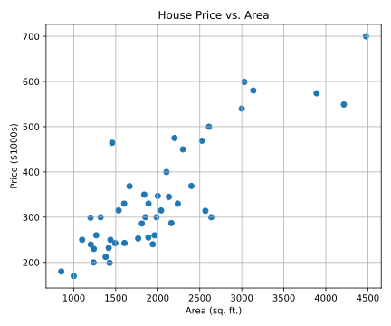
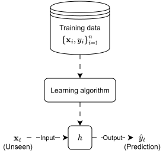
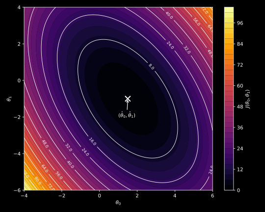
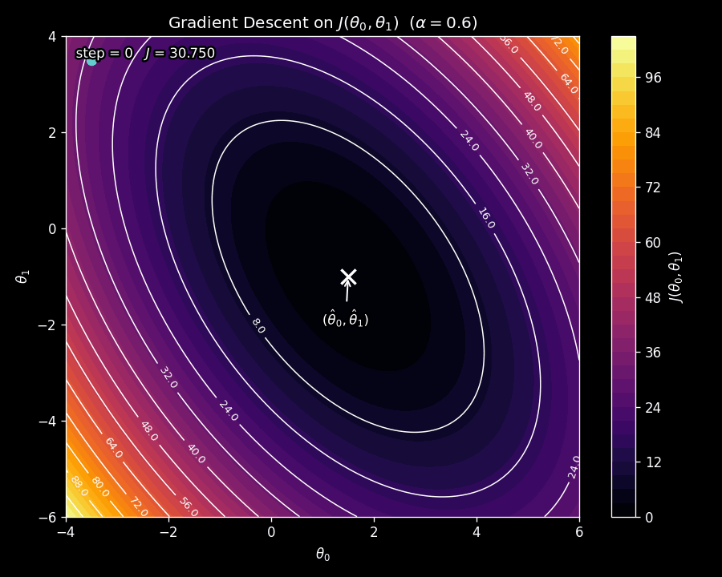

# Where We Left Off

In the [previous post](../introduction-to-machine-learning/index.qmd), we introduced the three major paradigms of machine learning and promised that our first deep dive would be into *linear regression*: the simplest supervised learning algorithm, and one of the most important. That post ended with a question: given a dataset of input-output pairs, how do we actually *build* a model that predicts well on new data? This post answers that question, from scratch.

This post is largely based on the treatment in @ng_cs229_notes and the accompanying lecture series [@stanford_cs229_ml_youtube]. Where additional context is helpful, we draw on standard references in the field.

Here is the roadmap of the journey we are about to take.

```{mermaid}
%%| fig-align: center
flowchart TB
    A["<b>1. The Problem</b><br/>House prices, scatter plot,<br/>eyeballing a line"]
    B["<b>2. Measuring Error</b><br/>How far is our line<br/>from the data?"]
    C["<b>3. The Linear Hypothesis</b><br/>Formalizing lines<br/>with parameters"]
    D["<b>4. The Cost Function</b><br/>Squared error:<br/>one number for goodness"]
    E["<b>5. Gradient Descent</b><br/>An iterative algorithm<br/>to find the best line"]
    F["<b>6. The Normal Equations</b><br/>A closed-form solution:<br/>no iteration needed"]
    G["<b>7. The Geometric View</b><br/>Linear regression<br/>as projection"]
    H["<b>8. Why Squared Error?</b><br/>The probabilistic<br/>interpretation"]
    I["<b>9. Wrapping Up</b><br/>Full picture and<br/>what comes next"]
    A --> B --> C --> D --> E --> F --> G --> H --> I

    style A fill:#1e8449,color:#fff,stroke:#fff
    style I fill:#b9770e,color:#fff,stroke:#fff
```

We will start with a concrete example you can visualize, build intuition with pencil-and-paper reasoning, and only *then* introduce the math. Every formula will earn its place by solving a problem you already feel.

# The Problem: Predicting House Prices

Suppose we have a dataset of houses from Portland, Oregon. For each house, we know its living area (in square feet) and its selling price (in thousands of dollars). A few of these observations are shown in @tbl-house_prices.

::: {.tbl tbl-colwidths="auto"}
| Area (sq ft) | Price ($1000s) |
|:------------:|:--------------:|
| 2104 | 400 |
| 1600 | 330 |
| 2400 | 369 |
| 1416 | 232 |
| 3000 | 540 |
| ⋮    | ⋮   |

: A few observations from the Portland housing data. {#tbl-house_prices style="width:30%; margin:auto;"}
:::

We can plot these data points on a scatter plot, with area on the horizontal axis and price on the vertical axis. The result is shown in @fig-house_prices.

{#fig-house_prices fig-align="center" width=65% .invert}

Looking at @fig-house_prices, a clear trend emerges: larger houses tend to cost more. The relationship is not perfect (houses of the same size can have different prices), but there is an unmistakable upward pattern. The question is: can we capture this pattern with a simple rule so that, given the area of a *new* house that is not in our dataset, we can predict its price?

This is a supervised learning problem. The input is the area of the house, the output is its price, and we want to learn the mapping between them. Since the output (price) is a continuous real number, this is specifically a *regression* problem. (Recall the definitions of supervised learning and regression from the [introduction post](../introduction-to-machine-learning/index.qmd#supervised-learning).)

## What a Beginner Would Try

Imagine you have printed @fig-house_prices on a piece of paper and you are holding a ruler. What would you do? You would probably try to draw a straight line through the cloud of points that "fits" the data as well as possible. You might rotate the ruler, slide it up or down, and eyeball the best position.

<!-- Manim visual: "trying_different_lines.py"
  This animation shows three candidate lines overlaid on the scatter plot.
  The first line is too steep, the second is too flat, and the third looks
  about right. The viewer sees that some lines are clearly better than others.
-->
::: {#fig-trying_different_lines}


Three candidate lines overlaid on the scatter plot. Some lines clearly fit the data better than others.
:::

Some lines are clearly terrible (a horizontal line at the top of the plot, for instance, would miss every point). Others look pretty good. But "looks pretty good" is not precise enough. To find the *best* line, we need a way to *measure* how good a given line is. That is what we tackle next.

# Measuring How Good a Line Is

Consider one particular candidate line drawn through our scatter plot. For each data point, there is a gap between where the line says the price should be and what the actual price is. We can visualize these gaps as vertical line segments connecting each data point to the line, as shown in @fig-residuals.

<!-- Manim visual: "visualizing_residuals.py"
  This animation shows a line pivoting through the scatter plot. The
  residuals and the total squared error update continuously as the line
  rotates. The line overshoots past the optimum so the error visibly
  rises, then returns to the optimum where the error is minimized.
-->
::: {#fig-residuals}


A line pivoting through the data. The dashed red segments are the residuals (prediction errors), and $J(\boldsymbol{\uptheta})$ is the total squared error. Watch how $J$ drops as the line approaches the best fit, rises when it overshoots, and settles at its minimum when the line returns to the optimal position.
:::

Watch @fig-residuals carefully. The line starts in a poor position (too flat), and the residuals are large. As the line rotates, the residuals shrink and the total squared error $J(\boldsymbol{\uptheta})$ drops steadily. When the line reaches the best-fit position, $J$ hits its minimum. But the animation does not stop there: the line *overshoots* past the optimum, and you can see the residuals grow again and $J$ climb back up. Finally, the line returns to the optimal position and $J$ settles at its lowest value. This makes an important point visually: the optimum is a specific position, and moving the line in *any* direction away from it (flatter or steeper) makes the fit worse.

Each of those dashed red segments measures how far off our prediction is for one particular house. If the line predicts a price of $350{,}000$ for a house that actually sold for $400{,}000$, the gap (or *error*) for that house is $400 - 350 = 50$ (in thousands of dollars).

We want a single number that summarizes how good the line is *overall*, across all data points. A natural idea is to add up all the individual errors. But there is a subtlety: some errors are positive (the line is below the true price) and some are negative (the line is above the true price). If we simply add them, positive and negative errors could cancel each other out, making a terrible line look deceptively good.

A clean fix is to *square* each error before adding them up. Squaring does two things: it makes every error positive, and it penalizes large errors more heavily than small ones (a miss of 100 contributes $100^2 = 10{,}000$, while a miss of 10 contributes only $10^2 = 100$). The result is a single number: the total squared error. The smaller this number, the better the line fits the data.

Let us make this concrete. Suppose we have five data points, and for a particular line, the individual errors (actual price minus predicted price) are:

$$
50, \quad -20, \quad 31, \quad -8, \quad 10.
$$

The total squared error is

$$
50^2 + \left(-20\right)^2 + 31^2 + \left(-8\right)^2 + 10^2 = 2500 + 400 + 961 + 64 + 100 = 4025.
$$

A different line that fits the data better might produce errors of

$$
12, \quad -5, \quad 8, \quad -3, \quad 4,
$$

giving a total squared error of

$$
12^2 + \left(-5\right)^2 + 8^2 + \left(-3\right)^2 + 4^2 = 144 + 25 + 64 + 9 + 16 = 258.
$$

The second line is clearly better: its total squared error is much smaller. We now have a precise, numerical criterion for comparing lines.

At this point, you might be wondering: "Why squared error and not, say, absolute error?" This is a great question. We will return to it in the [probabilistic interpretation section](#the-probabilistic-interpretation), where we show that squared error arises naturally from a specific (and reasonable) probabilistic assumption about the data. For now, let us take squared error as our measure of goodness and move on.

We now know *what* to measure. The next question is: what exactly is a "line," in mathematical terms? What knobs do we have to turn to change its position and slope? Answering this will let us state our goal precisely.

# The Linear Hypothesis

## Starting Simple: One Feature

In our house price example, we have a single input feature: area ($x$). A straight line through the scatter plot can be written as

$$
\hat{y} = \theta_0 + \theta_1 x,
$$ {#eq-line_one_feature}

where $\hat{y}$ is our predicted price, $\theta_0$ is the *intercept* (where the line crosses the vertical axis), and $\theta_1$ is the *slope* (how much the predicted price changes per unit increase in area). Together, $\theta_0$ and $\theta_1$ completely determine the line.

Every possible pair $\left(\theta_0, \theta_1\right)$ gives us a different line. The line that was "too steep" in @fig-trying_different_lines had a large $\theta_1$; the "too flat" one had a small $\theta_1$. Finding the best line means finding the best values of $\theta_0$ and $\theta_1$.

## The Big Picture of Supervised Learning

Before generalizing to more features, let us step back and see where our line-fitting exercise sits in the broader supervised learning framework. The big picture, introduced in the [previous post](../introduction-to-machine-learning/index.qmd), is the following: we feed training data to a learning algorithm, which produces a function $h$ (called the **hypothesis**). Given a new input, this hypothesis outputs a prediction. This flow is shown in @fig-supervised_learning_big_picture.

{#fig-supervised_learning_big_picture fig-align="center" width=45% .invert}

In linear regression, we are simply choosing the hypothesis $h$ to be a *linear function*. The learning algorithm's job is to find the best parameters $\left(\theta_0, \theta_1\right)$ for that linear function.

## Generalizing to Multiple Features

In reality, house prices depend on more than just area. They also depend on the number of bedrooms, the age of the house, the neighborhood, and so on. Suppose we have $d$ input features for each house, so that each input is a vector $\vb{x} \in \mathbb{R}^d$ with components $x_1, x_2, \dots, x_d$. The linear hypothesis generalizes naturally:

$$
\hat{y} = h_{\boldsymbol{\uptheta}}\left(\vb{x}\right) = \theta_0 + \theta_1 x_1 + \theta_2 x_2 + \cdots + \theta_d x_d = \theta_0 + \sum_{j=1}^{d} \theta_j x_j,
$$ {#eq-linear_hypothesis}

where $\boldsymbol{\uptheta} \in \mathbb{R}^{d+1}$ is the vector of **parameters** (also called **weights**):

$$
\boldsymbol{\uptheta} =
\begin{bmatrix}
    \theta_0\\
    \theta_1\\
    \theta_2\\
    \vdots\\
    \theta_d
\end{bmatrix}.
$$

Notice the subscript $\boldsymbol{\uptheta}$ on $h$. It reminds us that every different parameter vector gives a different hypothesis. The goal of linear regression is to find the parameter vector $\boldsymbol{\uptheta}$ that makes the hypothesis as accurate as possible.

::: {.callout-note title="Notation Clarification"}
Throughout this post, $\vb{x}$ and $y$ denote a *generic* input-output pair, with $\vb{x} \in \mathbb{R}^d$ and $y \in \mathbb{R}$. The training dataset consists of $n$ observed examples $\left\{\left(\vb{x}_i, y_i\right)\right\}_{i=1}^n$, where each $\left(\vb{x}_i, y_i\right)$ is a specific realization of $\left(\vb{x}, y\right)$. You can think of $\vb{x}$ and $y$ in the same way as the generic coordinates labeling the axes of a plot, while the indexed $\left(\vb{x}_i, y_i\right)$ are the specific points plotted on it.
:::

## The Intercept Convention

There is a small notational trick that makes life much easier. If we introduce a "dummy" feature $x_0 = 1$ for every data point, then @eq-linear_hypothesis can be written more compactly as

$$
\hat{y} = h_{\boldsymbol{\uptheta}}\left(\vb{x}\right) = \theta_0 x_0 + \theta_1 x_1 + \cdots + \theta_d x_d = \sum_{j=0}^{d} \theta_j x_j = \boldsymbol{\uptheta}^{\intercal} \vb{x}.
$$ {#eq-linear_hypothesis_convenient}

With this convention, $\vb{x} \in \mathbb{R}^{d+1}$ (it now includes the extra $x_0 = 1$ entry), and the hypothesis is simply a dot product. Compare @eq-linear_hypothesis with @eq-linear_hypothesis_convenient: the latter is much cleaner. This convention is standard, and we will use it from here on.

## Where We Stand

Let us take stock. We started by eyeballing lines on a scatter plot. We then quantified the idea of "a good fit" by measuring total squared error. We formalized what a "line" is: in one dimension it is $\theta_0 + \theta_1 x$; in $d$ dimensions it is $\boldsymbol{\uptheta}^{\intercal} \vb{x}$. We now need to do two things: (1) write down the squared error formally as a function of $\boldsymbol{\uptheta}$, and (2) find the $\boldsymbol{\uptheta}$ that makes it as small as possible. Let us begin with the first.

```{mermaid}
%%| fig-align: center
flowchart TB
    A["<b>1. The Problem</b><br/>House prices, scatter plot,<br/>eyeballing a line"]
    B["<b>2. Measuring Error</b><br/>How far is our line<br/>from the data?"]
    C["<b>3. The Linear Hypothesis</b><br/>Formalizing lines<br/>with parameters"]
    D["<b>4. The Cost Function</b><br/>Squared error:<br/>one number for goodness"]
    E["<b>5. Gradient Descent</b><br/>An iterative algorithm<br/>to find the best line"]
    F["<b>6. The Normal Equations</b><br/>A closed-form solution:<br/>no iteration needed"]
    G["<b>7. The Geometric View</b><br/>Linear regression<br/>as projection"]
    H["<b>8. Why Squared Error?</b><br/>The probabilistic<br/>interpretation"]
    I["<b>9. Wrapping Up</b><br/>Full picture and<br/>what comes next"]
    A --> B --> C --> D --> E --> F --> G --> H --> I

    style A fill:#555,color:#fff,stroke:#aaa
    style B fill:#555,color:#fff,stroke:#aaa
    style C fill:#555,color:#fff,stroke:#aaa
    style D fill:#1e8449,color:#fff,stroke:#fff
    style E fill:#444,color:#aaa,stroke:#666
    style F fill:#444,color:#aaa,stroke:#666
    style G fill:#444,color:#aaa,stroke:#666
    style H fill:#444,color:#aaa,stroke:#666
    style I fill:#444,color:#aaa,stroke:#666
```

# The Cost Function

We are looking for the parameter vector $\boldsymbol{\uptheta}$ that makes our predictions $\hat{y}_i = h_{\boldsymbol{\uptheta}}\left(\vb{x}_i\right)$ as close to the true outputs $y_i$ as possible, across all $n$ training examples. We already built the intuition: sum up the squared errors. Let us now write this formally.

## Squared Error

The **cost function** (also called the **squared error** or **least squares** cost) is defined as

$$
J\left(\boldsymbol{\uptheta}\right) = \frac{1}{2} \sum_{i=1}^{n} \left( \hat{y}_i - y_i \right)^2 = \frac{1}{2} \sum_{i=1}^{n} \left( h_{\boldsymbol{\uptheta}}\left(\vb{x}_i\right) - y_i \right)^2 = \frac{1}{2} \sum_{i=1}^{n} \left( \boldsymbol{\uptheta}^{\intercal} \vb{x}_i - y_i \right)^2.
$$ {#eq-squared_error}

You might notice the $\frac{1}{2}$ factor that we did not have in our earlier informal discussion. It is there purely for mathematical convenience: when we take the derivative of $J$ later, the 2 from the exponent will cancel with this $\frac{1}{2}$, keeping the algebra clean. It does not change which $\boldsymbol{\uptheta}$ minimizes $J$.

The cost function takes a parameter vector $\boldsymbol{\uptheta}$ as input and returns a single non-negative number. The smaller this number, the better the hypothesis $h_{\boldsymbol{\uptheta}}$ fits the training data. Our goal is therefore

$$
\hat{\boldsymbol{\uptheta}} = \arg \min_{\boldsymbol{\uptheta}} J\left(\boldsymbol{\uptheta}\right) = \arg \min_{\boldsymbol{\uptheta}} \frac{1}{2} \sum_{i=1}^{n} \left( \boldsymbol{\uptheta}^{\intercal} \vb{x}_i - y_i \right)^2.
$$ {#eq-optimizing_cost_function}

Once we find $\hat{\boldsymbol{\uptheta}}$, the learning is complete. The hypothesis $h_{\hat{\boldsymbol{\uptheta}}}$ is our trained linear regression model.

Now comes the crucial question: how do we actually *find* $\hat{\boldsymbol{\uptheta}}$? We will explore two very different strategies. The first is an iterative algorithm called gradient descent, which works for a wide class of problems beyond linear regression. The second is a direct, closed-form formula that is specific to the squared error cost. Let us start with gradient descent.

# Finding the Best Line: Gradient Descent {#sec-gradient-descent}

## The Idea

The cost function $J\left(\boldsymbol{\uptheta}\right)$ depends on the parameters $\theta_0, \theta_1, \dots, \theta_d$. Changing these parameters changes the value of $J$. We can think of $J$ as a *landscape*: each possible parameter vector $\boldsymbol{\uptheta}$ corresponds to a location in this landscape, and the "height" at that location is the cost. Our goal is to find the lowest point.

To build intuition, consider the case where we have just two parameters, $\theta_0$ and $\theta_1$. The cost function then defines a surface over the $\left(\theta_0, \theta_1\right)$ plane. For the squared error, this surface is shaped like a bowl: it curves upward in every direction from a single lowest point. We can visualize this bowl from above as a contour plot, where each contour line connects points with the same cost. The contour plot for our example is shown in @fig-cost_contour_plot.

{#fig-cost_contour_plot fig-align="center" width=85%}

We do not know where the minimum of this bowl is. **Gradient descent** is a strategy for finding it. The idea is simple:

1. Start at some initial point (an initial guess for $\boldsymbol{\uptheta}$).
2. Look around and figure out which direction goes *downhill* the fastest.
3. Take a step in that direction.
4. Repeat until you reach the bottom.

How do we determine the "downhill" direction? Recall from multivariable calculus that the *gradient* of a function at a point gives the direction of steepest *ascent*. So the direction of steepest *descent* is simply the negative of the gradient. At each step, we move $\boldsymbol{\uptheta}$ a little bit in the direction of $-\nabla_{\boldsymbol{\uptheta}} J\left(\boldsymbol{\uptheta}\right)$.

## The Update Rule

Formally, gradient descent starts with some initial $\boldsymbol{\uptheta}$ and repeatedly applies the update

$$
\theta_j = \theta_j - \alpha \pdv{J\left(\boldsymbol{\uptheta}\right)}{\theta_j},
$$ {#eq-gradient_descent_scalar_notation}

for all $j = 0, 1, \dots, d$ simultaneously. Here, $\alpha > 0$ is the **learning rate**, which controls how large each step is. In vector notation, @eq-gradient_descent_scalar_notation becomes

$$
\boldsymbol{\uptheta} = \boldsymbol{\uptheta} - \alpha \nabla_{\boldsymbol{\uptheta}} J\left(\boldsymbol{\uptheta}\right).
$$ {#eq-gradient_descent_vector_notation}

We can write this as a formal algorithm:

::: {#alg-gradient_descent}
<pre class="pseudocode">
\begin{algorithm}
\caption{Gradient Descent}
\begin{algorithmic}
\REQUIRE Cost function $J(\boldsymbol{\uptheta})$, learning rate $\alpha$
\ENSURE Parameters $\hat{\boldsymbol{\uptheta}}$
\STATE Initialize $\boldsymbol{\uptheta}$ (e.g., zeros or randomly)
\REPEAT
  \STATE $\boldsymbol{\uptheta} \leftarrow \boldsymbol{\uptheta} - \alpha \nabla_{\boldsymbol{\uptheta}} J(\boldsymbol{\uptheta})$
\UNTIL{convergence}
\RETURN $\boldsymbol{\uptheta}$
\end{algorithmic}
\end{algorithm}
</pre>
:::

<script>
  pseudocode.renderClass("pseudocode", { lineNumber: true });
</script>

@fig-gradient_descent_animation shows gradient descent in action on the contour plot from @fig-cost_contour_plot. Watch how the parameter vector starts at an initial point and takes steps that curve toward the minimum, following the steepest downhill path at each iteration.

{#fig-gradient_descent_animation fig-align="center" width=85%}

## The Role of the Learning Rate

The learning rate $\alpha$ is a critical choice. If $\alpha$ is too small, gradient descent will crawl toward the minimum, taking many tiny steps. If $\alpha$ is too large, the steps will overshoot the minimum, and the cost may actually *increase* at each step, causing gradient descent to diverge. This is illustrated in @fig-gradient_descent_divergence_animation.

{#fig-gradient_descent_divergence_animation fig-align="center" width=85%}

We want to choose $\alpha$ small enough that the cost decreases at each step, i.e.,

$$
J\left(\boldsymbol{\uptheta}^{(i+1)}\right) < J\left(\boldsymbol{\uptheta}^{(i)}\right),
$$

where the superscript $\left(i\right)$ denotes the iteration number. In practice, $\alpha$ is found by experimenting with several values.

## When Has Gradient Descent Converged?

The algorithm says "repeat until convergence," but what does convergence mean in practice? There are several common criteria.

**The parameters have stopped changing.** If the norm of the change in the parameter vector between two consecutive steps is smaller than a pre-defined threshold $\varepsilon$, we declare convergence:

$$
\norm{\boldsymbol{\uptheta}^{(i+1)} - \boldsymbol{\uptheta}^{(i)}} < \varepsilon.
$$

**The cost has stopped decreasing.** If the absolute change in cost between two consecutive steps is smaller than a threshold:

$$
\left| J\left(\boldsymbol{\uptheta}^{(i+1)}\right) - J\left(\boldsymbol{\uptheta}^{(i)}\right) \right| < \varepsilon.
$$

**The gradient is near zero.** Since the gradient at a minimum is zero in principle, we can check whether the gradient norm is small enough:

$$
\norm{\nabla_{\boldsymbol{\uptheta}} J\left(\boldsymbol{\uptheta}^{(i)}\right)} < \varepsilon.
$$

In each case, $\varepsilon$ is a small positive constant chosen by the practitioner.

## Gradient Descent on Squared Error

We are about to work through a short derivation. The payoff is the concrete update rule that tells gradient descent exactly how to adjust the parameters at each step when the cost function is squared error. Let us substitute @eq-squared_error into @eq-gradient_descent_vector_notation.

$$
\begin{align*}
\boldsymbol{\uptheta} &= \boldsymbol{\uptheta} - \alpha \nabla_{\boldsymbol{\uptheta}} J\left(\boldsymbol{\uptheta}\right)\\
&= \boldsymbol{\uptheta} - \alpha \nabla_{\boldsymbol{\uptheta}} \left( \frac{1}{2} \sum_{i=1}^{n} \left( \boldsymbol{\uptheta}^{\intercal} \vb{x}_i - y_i \right)^2 \right).
\end{align*}
$$

Since the gradient of a sum is the sum of gradients, and using the chain rule to differentiate $\left(\boldsymbol{\uptheta}^{\intercal} \vb{x}_i - y_i\right)^2$ with respect to $\boldsymbol{\uptheta}$, this becomes

$$
\boldsymbol{\uptheta} = \boldsymbol{\uptheta} - \alpha \left( \frac{1}{2} \sum_{i=1}^{n} 2 \left( \boldsymbol{\uptheta}^{\intercal} \vb{x}_i - y_i \right) \vb{x}_i \right).
$$

The $\frac{1}{2}$ and the $2$ cancel, giving us the **batch gradient descent update rule for squared error**:

$$
\boldsymbol{\uptheta} = \boldsymbol{\uptheta} - \alpha \sum_{i=1}^{n} \left( \boldsymbol{\uptheta}^{\intercal} \vb{x}_i - y_i \right) \vb{x}_i.
$$ {#eq-gradient_descent_squared_error}

Look at the term $\left(\boldsymbol{\uptheta}^{\intercal} \vb{x}_i - y_i\right)$. This is the prediction error for the $i$th example. The update is proportional to this error: when the prediction is close to the true value, the adjustment is small; when the prediction is far off, the adjustment is large. This property is known in the literature as the **LMS (Least Mean Squares)** update rule or the **Widrow-Hoff** learning rule [@ng_cs229_notes], and it is quite intuitive: fix the parameters more aggressively where the model is most wrong.

Notice also that every step requires a pass over *all* $n$ training examples (because of the sum). This version of gradient descent is therefore called **batch gradient descent**. When $n$ is large, this can be expensive. This motivates a cheaper alternative.

## Stochastic Gradient Descent

What if, instead of computing the gradient using *all* $n$ examples, we computed it using just *one* randomly chosen example? The gradient we get will be noisier (since it is based on a single data point), but each step is much cheaper to compute. Over many steps, these noisy gradients point in the right direction *on average*, and the algorithm still converges to a good solution.

This idea gives us **stochastic gradient descent (SGD)**. At each step, we sample a single training example $\left(\vb{x}_k, y_k\right)$ uniformly at random and update:

$$
\boldsymbol{\uptheta} = \boldsymbol{\uptheta} - \alpha \nabla_{\boldsymbol{\uptheta}} \tilde{J}\left(\boldsymbol{\uptheta}\right),
$$ {#eq-stochastic_gradient_descent_vector_notation}

where $\tilde{J}\left(\boldsymbol{\uptheta}\right)$ is the cost evaluated on that single example (sometimes called the **loss function**):

$$
\tilde{J}\left(\boldsymbol{\uptheta}\right) = \frac{1}{2} \left( \boldsymbol{\uptheta}^{\intercal} \vb{x}_k - y_k \right)^2.
$$ {#eq-squared_error_loss}

Working out the gradient (as we did for batch gradient descent, but now for a single example), the SGD update rule for squared error becomes

$$
\boldsymbol{\uptheta} = \boldsymbol{\uptheta} - \alpha \left( \boldsymbol{\uptheta}^{\intercal} \vb{x}_k - y_k \right) \vb{x}_k.
$$ {#eq-stochastic_gradient_descent_squared_error}

Compare this with @eq-gradient_descent_squared_error. The batch version sums over all $n$ examples; the stochastic version uses just one. The trade-off is clear: each SGD step is $n$ times cheaper, but the direction is noisier.

@fig-stochastic_gradient_descent_animation shows SGD on the same contour plot as before. Notice the erratic, zig-zagging path: because a different data point is sampled at each step, the gradient direction fluctuates. But the overall trajectory still moves toward the minimum.

{#fig-stochastic_gradient_descent_animation fig-align="center" width=85%}

Why does the path look so jittery? At each iteration, SGD does not compute the gradient of the true cost function $J\left(\boldsymbol{\uptheta}\right)$ (which is what the contour plot shows). Instead, it computes the gradient of $\tilde{J}\left(\boldsymbol{\uptheta}\right)$, the single-example loss. Since a different example is sampled each time, the function whose gradient is being used *changes from step to step*. This introduces noise in the update direction. Over many iterations, the noisy gradients average out and point toward the minimum, but any individual step can deviate from the smooth downhill direction of batch gradient descent.

::: {.callout-note title="Mini-Batch Gradient Descent"}
There is a natural middle ground between batch gradient descent (use all $n$ examples per step) and stochastic gradient descent (use $1$ example per step): **mini-batch gradient descent**, which uses a small batch of $n_b$ examples per step, where $1 < n_b < n$. In practice, mini-batch gradient descent is the most commonly used variant, as it balances computational efficiency with gradient quality. Typical mini-batch sizes are 32, 64, or 128.
:::

## Where We Stand

We have now covered one complete strategy for finding the best parameters: gradient descent (and its stochastic variant). The algorithm iteratively adjusts $\boldsymbol{\uptheta}$ in the direction that reduces the cost, step by step. But gradient descent is not the only way. For linear regression with the squared error cost, there is a remarkable shortcut: a formula that gives the optimal $\boldsymbol{\uptheta}$ *directly*, in one shot, with no iteration. That is what we explore next.

```{mermaid}
%%| fig-align: center
flowchart TB
    A["<b>1. The Problem</b><br/>House prices, scatter plot,<br/>eyeballing a line"]
    B["<b>2. Measuring Error</b><br/>How far is our line<br/>from the data?"]
    C["<b>3. The Linear Hypothesis</b><br/>Formalizing lines<br/>with parameters"]
    D["<b>4. The Cost Function</b><br/>Squared error:<br/>one number for goodness"]
    E["<b>5. Gradient Descent</b><br/>An iterative algorithm<br/>to find the best line"]
    F["<b>6. The Normal Equations</b><br/>A closed-form solution:<br/>no iteration needed"]
    G["<b>7. The Geometric View</b><br/>Linear regression<br/>as projection"]
    H["<b>8. Why Squared Error?</b><br/>The probabilistic<br/>interpretation"]
    I["<b>9. Wrapping Up</b><br/>Full picture and<br/>what comes next"]
    A --> B --> C --> D --> E --> F --> G --> H --> I

    style A fill:#555,color:#fff,stroke:#aaa
    style B fill:#555,color:#fff,stroke:#aaa
    style C fill:#555,color:#fff,stroke:#aaa
    style D fill:#555,color:#fff,stroke:#aaa
    style E fill:#555,color:#fff,stroke:#aaa
    style F fill:#1e8449,color:#fff,stroke:#fff
    style G fill:#444,color:#aaa,stroke:#666
    style H fill:#444,color:#aaa,stroke:#666
    style I fill:#444,color:#aaa,stroke:#666
```

# Finding the Best Line: The Normal Equations {#sec-normal-equations}

Gradient descent finds the minimum of $J$ by approaching it step by step. Can we find the minimum *directly*? For the squared error cost, the answer is yes. The idea is straightforward from calculus: to find the minimum of a function, take its derivative, set it to zero, and solve. The only complication is that we are working with vectors and matrices instead of single variables. The payoff, however, is a clean, closed-form formula for the optimal $\boldsymbol{\uptheta}$.

## Writing the Cost in Matrix Form

First, we need to express the cost function $J\left(\boldsymbol{\uptheta}\right)$ in matrix notation. Define the **design matrix** $\vb{X}$, which stacks the input vectors of all $n$ training examples as rows:

$$
\vb{X} \in \mathbb{R}^{n \times \left(d+1\right)} =
\begin{bmatrix}
  \leftarrow & \vb{x}_1^{\intercal} & \rightarrow\\
  \leftarrow & \vb{x}_2^{\intercal} & \rightarrow\\
   & \vdots & \\
  \leftarrow & \vb{x}_n^{\intercal} & \rightarrow
\end{bmatrix}.
$$

Also define $\vb{y} \in \mathbb{R}^n$ as the vector of all outputs, and recall that $\boldsymbol{\uptheta} \in \mathbb{R}^{d+1}$ is the parameter vector:

$$
\vb{y} =
\begin{bmatrix}
  y_1\\
  y_2\\
  \vdots\\
  y_n
\end{bmatrix}, \qquad
\boldsymbol{\uptheta} =
\begin{bmatrix}
  \theta_0\\
  \theta_1\\
  \vdots\\
  \theta_{d}
\end{bmatrix}.
$$

Now, observe what happens when we compute $\vb{X}\boldsymbol{\uptheta} - \vb{y}$:

$$
\vb{X}\boldsymbol{\uptheta} - \vb{y} =
\begin{bmatrix}
  \vb{x}_1^{\intercal} \boldsymbol{\uptheta}\\
  \vb{x}_2^{\intercal} \boldsymbol{\uptheta}\\
  \vdots\\
  \vb{x}_n^{\intercal} \boldsymbol{\uptheta}
\end{bmatrix} -
\begin{bmatrix}
  y_1\\
  y_2\\
  \vdots\\
  y_n
\end{bmatrix} =
\begin{bmatrix}
  \vb{x}_1^{\intercal} \boldsymbol{\uptheta} - y_1\\
  \vb{x}_2^{\intercal} \boldsymbol{\uptheta} - y_2\\
  \vdots\\
  \vb{x}_n^{\intercal} \boldsymbol{\uptheta} - y_n
\end{bmatrix}.
$$

This is a vector whose $i$th entry is the prediction error for the $i$th example. Using the fact that for any vector $\vb{z}$, the dot product $\vb{z}^{\intercal}\vb{z} = \sum_i z_i^2$, we can write

$$
\frac{1}{2} \left(\vb{X}\boldsymbol{\uptheta} - \vb{y}\right)^{\intercal} \left(\vb{X}\boldsymbol{\uptheta} - \vb{y}\right) = \frac{1}{2} \sum_{i=1}^{n} \left(\vb{x}_i^{\intercal}\boldsymbol{\uptheta} - y_i\right)^2 = J\left(\boldsymbol{\uptheta}\right).
$$

So the cost function in matrix form is

$$
J\left(\boldsymbol{\uptheta}\right) = \frac{1}{2} \left(\vb{X}\boldsymbol{\uptheta} - \vb{y}\right)^{\intercal} \left(\vb{X}\boldsymbol{\uptheta} - \vb{y}\right).
$$ {#eq-squared_error_matrix}

## Deriving the Closed-Form Solution

We now take the gradient of @eq-squared_error_matrix with respect to $\boldsymbol{\uptheta}$ and set it to zero. The algebra is a bit involved, so let us walk through it step by step.

::: {.callout-tip title="Foreshadowing the Payoff"}
The derivation below involves several lines of matrix calculus. If you want to take it on faith for now, the punchline is @eq-normal_equations_solution: a single formula that gives the optimal parameters directly. Feel free to skip ahead and come back to the derivation later.
:::

First, expand the product inside $J$:

$$
\begin{align*}
  \nabla_{\boldsymbol{\uptheta}} J\left(\boldsymbol{\uptheta}\right) &= 0\\
  \implies \nabla_{\boldsymbol{\uptheta}} \left( \frac{1}{2} \left(\vb{X}\boldsymbol{\uptheta} - \vb{y}\right)^{\intercal} \left(\vb{X}\boldsymbol{\uptheta} - \vb{y}\right) \right) &= 0\\
  \implies \frac{1}{2} \nabla_{\boldsymbol{\uptheta}} \left( \left(\vb{X}\boldsymbol{\uptheta}\right)^{\intercal} \vb{X}\boldsymbol{\uptheta} - \left(\vb{X}\boldsymbol{\uptheta}\right)^{\intercal} \vb{y} - \vb{y}^{\intercal} \left(\vb{X}\boldsymbol{\uptheta}\right) + \vb{y}^{\intercal}\vb{y} \right) &= 0\\
  \implies \frac{1}{2} \nabla_{\boldsymbol{\uptheta}} \left( \boldsymbol{\uptheta}^{\intercal} \left(\vb{X}^{\intercal}\vb{X}\right) \boldsymbol{\uptheta} - \vb{y}^{\intercal} \left(\vb{X}\boldsymbol{\uptheta}\right) - \vb{y}^{\intercal} \left(\vb{X}\boldsymbol{\uptheta}\right) + \vb{y}^{\intercal}\vb{y} \right) &= 0\\
  \implies \frac{1}{2} \nabla_{\boldsymbol{\uptheta}} \left( \boldsymbol{\uptheta}^{\intercal} \left(\vb{X}^{\intercal}\vb{X}\right) \boldsymbol{\uptheta} - 2\vb{y}^{\intercal} \left(\vb{X}\boldsymbol{\uptheta}\right) + \vb{y}^{\intercal}\vb{y} \right) &= 0\\
  \implies \frac{1}{2} \nabla_{\boldsymbol{\uptheta}} \left( \boldsymbol{\uptheta}^{\intercal} \left(\vb{X}^{\intercal}\vb{X}\right) \boldsymbol{\uptheta} - 2\left(\vb{X}^{\intercal}\vb{y}\right)^{\intercal} \boldsymbol{\uptheta} + \vb{y}^{\intercal}\vb{y} \right) &= 0.
\end{align*}
$$

In the fourth line, we used the fact that $\vb{a}^{\intercal}\vb{b} = \vb{b}^{\intercal}\vb{a}$ (for vectors), so $\left(\vb{X}\boldsymbol{\uptheta}\right)^{\intercal}\vb{y} = \vb{y}^{\intercal}\left(\vb{X}\boldsymbol{\uptheta}\right)$, which allowed us to combine the two middle terms. Now we apply two standard matrix calculus identities: $\nabla_{\vb{x}} \vb{b}^{\intercal}\vb{x} = \vb{b}$ and $\nabla_{\vb{x}} \vb{x}^{\intercal}\vb{A}\vb{x} = 2\vb{A}\vb{x}$ (when $\vb{A}$ is symmetric, which $\vb{X}^{\intercal}\vb{X}$ is). Also, $\vb{y}^{\intercal}\vb{y}$ is a constant with respect to $\boldsymbol{\uptheta}$, so its gradient is zero. This gives

$$
\begin{align*}
  \frac{1}{2} \left(2\vb{X}^{\intercal}\vb{X}\boldsymbol{\uptheta} - 2\vb{X}^{\intercal}\vb{y}\right) &= 0\\
  \implies \vb{X}^{\intercal}\vb{X}\boldsymbol{\uptheta} - \vb{X}^{\intercal}\vb{y} &= 0.
\end{align*}
$$

This gives us the **normal equations**:

$$
\vb{X}^{\intercal}\vb{X}\boldsymbol{\uptheta} = \vb{X}^{\intercal}\vb{y}.
$$

Solving for $\boldsymbol{\uptheta}$ (assuming $\vb{X}^{\intercal}\vb{X}$ is invertible), we get the closed-form solution:

$$
\hat{\boldsymbol{\uptheta}} = \left(\vb{X}^{\intercal}\vb{X}\right)^{-1} \vb{X}^{\intercal}\vb{y}.
$$ {#eq-normal_equations_solution}

This is a remarkable result. With one matrix computation, we get the exact optimal parameters. No iteration, no learning rate to tune, no convergence to worry about. Linear regression is one of the rare machine learning algorithms for which such a closed-form solution exists.

::: {.callout-note title="When Is the Inverse Well-Defined?"}
The formula @eq-normal_equations_solution requires $\vb{X}^{\intercal}\vb{X}$ to be invertible. This can fail if the number of linearly independent training examples is fewer than the number of features, or if the features themselves are linearly dependent (e.g., one feature is an exact multiple of another). In practice, these issues can be addressed with techniques like regularization, which we will discuss in a future post.
:::

We now have two complete methods for fitting a linear regression model: gradient descent (iterative) and the normal equations (closed-form). Both give us the same answer, the parameter vector $\hat{\boldsymbol{\uptheta}}$ that minimizes squared error.

The normal equations gave us a clean algebraic solution. But there is a beautiful *geometric* story hiding behind that algebra, one that explains *why* the formula looks the way it does and connects linear regression to a fundamental concept from linear algebra: projection. Let us explore that next.

# The Geometric Perspective: Linear Regression as Projection {#sec-geometric-perspective}

So far, we have derived the normal equations by taking derivatives and setting them to zero. The result, @eq-normal_equations_solution, works perfectly, but the derivation does not give much intuition for *why* the formula has the particular structure it does. In this section, we will arrive at the same formula from a completely different angle: geometry. The insight is that finding the best linear regression fit is the same as projecting a vector onto a subspace. This perspective is one of the most elegant ideas in all of applied mathematics. The treatment in this section is inspired by the beautiful explanation of least squares as projection in Prof. Gilbert Strang's linear algebra course [@MIT18.06SCLinearAlgebra2011].

## Setting the Stage

Recall our setup. We have the design matrix $\vb{X} \in \mathbb{R}^{n \times (d+1)}$, the parameter vector $\boldsymbol{\uptheta} \in \mathbb{R}^{d+1}$, and the output vector $\vb{y} \in \mathbb{R}^n$. The prediction vector is $\hat{\vb{y}} = \vb{X}\boldsymbol{\uptheta}$.

Now, here is the key observation. In a typical machine learning problem, we have far more training examples than features, i.e., $n \gg d + 1$. This means $\vb{X}$ is a "tall" matrix: many more rows than columns. What happens when we multiply such a matrix by *any* vector $\boldsymbol{\uptheta} \in \mathbb{R}^{d+1}$?

The result $\vb{X}\boldsymbol{\uptheta}$ is a vector in $\mathbb{R}^n$. But it is not just *any* vector in $\mathbb{R}^n$. We can write the multiplication out as

$$
\vb{X}\boldsymbol{\uptheta} = \theta_0 \vb{c}_0 + \theta_1 \vb{c}_1 + \cdots + \theta_d \vb{c}_d,
$$

where $\vb{c}_0, \vb{c}_1, \dots, \vb{c}_d$ are the columns of $\vb{X}$. In other words, $\vb{X}\boldsymbol{\uptheta}$ is a *linear combination* of the columns of $\vb{X}$. As we vary $\boldsymbol{\uptheta}$ over all possible values, the set of all vectors $\vb{X}\boldsymbol{\uptheta}$ traces out the **column space** of $\vb{X}$, which we denote $\text{Col}\left(\vb{X}\right)$.

If $\vb{X}$ has full column rank (i.e., its $d + 1$ columns are linearly independent, which is the typical case in practice), then $\text{Col}\left(\vb{X}\right)$ is a $\left(d+1\right)$-dimensional subspace of $\mathbb{R}^n$. Since $d + 1 \ll n$, this subspace is a tiny "slice" of the full $n$-dimensional space.

Here is the crucial point: every possible prediction vector $\hat{\vb{y}} = \vb{X}\boldsymbol{\uptheta}$ lives inside this $\left(d+1\right)$-dimensional subspace. No matter what value of $\boldsymbol{\uptheta}$ we choose, we cannot escape $\text{Col}\left(\vb{X}\right)$. Meanwhile, the true output vector $\vb{y}$ lives in the full $\mathbb{R}^n$ and, in general, does *not* lie inside $\text{Col}\left(\vb{X}\right)$. (If it did, we could fit the data perfectly with zero error, which almost never happens in practice.)

## The Problem, Geometrically

Our goal is to find the $\hat{\boldsymbol{\uptheta}}$ that makes $\hat{\vb{y}} = \vb{X}\hat{\boldsymbol{\uptheta}}$ as close to $\vb{y}$ as possible. "Close" here means minimizing $\norm{\hat{\vb{y}} - \vb{y}}^2$, which is exactly our squared error cost (up to the $\frac{1}{2}$ factor). Geometrically, we are asking: among all vectors in $\text{Col}\left(\vb{X}\right)$, which one is closest to $\vb{y}$?

This is a classic problem from linear algebra, and the answer is well known: the closest point in a subspace to a given point outside it is the **orthogonal projection** of that point onto the subspace.

Think about it in a familiar setting first. If you stand in a room and shine a flashlight straight down at the floor, the spot of light on the floor is the point on the floor (a 2D subspace) that is closest to the flashlight (a point in 3D space). The light beam goes straight down, perpendicular to the floor. That perpendicularity is what makes it the *closest* point; any other point on the floor would be farther away.

The same logic applies in $\mathbb{R}^n$. The closest vector in $\text{Col}\left(\vb{X}\right)$ to $\vb{y}$ is the orthogonal projection of $\vb{y}$ onto $\text{Col}\left(\vb{X}\right)$. And the defining property of an orthogonal projection is that the "error" (the residual vector $\vb{y} - \hat{\vb{y}}$) is perpendicular to the subspace.

<!-- Manim visual: "projection_2d.py"
  This animation shows a 2D perspective diagram of the column space as a
  parallelogram, with y above it, y_hat projected onto it, and the
  residual shown as perpendicular. The orthogonality equation appears
  at the end.
-->
::: {#fig-projection_diagram}


The geometric view: $\vb{y}$ (in $\mathbb{R}^n$) is projected orthogonally onto $\text{Col}\left(\vb{X}\right)$ (a lower-dimensional subspace). The projected vector $\hat{\vb{y}}$ is the closest point in the subspace to $\vb{y}$, and the residual $\vb{y} - \hat{\vb{y}}$ is perpendicular to the subspace.
:::

## Deriving the Solution from Orthogonality

Let us now turn the geometric insight into algebra. The orthogonal projection requires that the residual vector $\vb{y} - \hat{\vb{y}}$ be perpendicular to *every* vector in $\text{Col}\left(\vb{X}\right)$. Since every vector in $\text{Col}\left(\vb{X}\right)$ is a linear combination of the columns of $\vb{X}$, it suffices to require that the residual be perpendicular to each column individually. (You might be wondering why: if a vector is perpendicular to each basis vector of a subspace, it is perpendicular to every linear combination of them, and hence perpendicular to the entire subspace.)

The $j$th column of $\vb{X}$ is $\vb{c}_j$. Perpendicularity means the dot product is zero:

$$
\vb{c}_j^{\intercal} \left(\vb{y} - \vb{X}\hat{\boldsymbol{\uptheta}}\right) = 0, \quad \text{for all } j = 0, 1, \dots, d.
$$

We can stack all $d + 1$ of these conditions into a single matrix equation. Stacking the column vectors $\vb{c}_0^{\intercal}, \vb{c}_1^{\intercal}, \dots, \vb{c}_d^{\intercal}$ as rows gives us $\vb{X}^{\intercal}$. So the orthogonality condition becomes

$$
\vb{X}^{\intercal}\left(\vb{y} - \vb{X}\hat{\boldsymbol{\uptheta}}\right) = \vb{0}.
$$ {#eq-orthogonality_condition}

Expanding this:

$$
\vb{X}^{\intercal}\vb{y} - \vb{X}^{\intercal}\vb{X}\hat{\boldsymbol{\uptheta}} = \vb{0}.
$$

Rearranging:

$$
\vb{X}^{\intercal}\vb{X}\hat{\boldsymbol{\uptheta}} = \vb{X}^{\intercal}\vb{y}.
$$

These are the normal equations, the same ones we derived in @sec-normal-equations by setting the gradient to zero. And solving for $\hat{\boldsymbol{\uptheta}}$ (assuming $\vb{X}^{\intercal}\vb{X}$ is invertible) gives us the same closed-form solution:

$$
\hat{\boldsymbol{\uptheta}} = \left(\vb{X}^{\intercal}\vb{X}\right)^{-1}\vb{X}^{\intercal}\vb{y}.
$$

The formula is identical to @eq-normal_equations_solution, but we arrived at it through pure geometry rather than calculus. Two completely different paths lead to the same destination.

::: {.callout-note title="Why Are They Called the \"Normal\" Equations?"}
You might have noticed that we encountered the name "normal equations" earlier without explaining the word "normal." Now the reason is clear: in mathematics, "normal" means "perpendicular." The normal equations are precisely the conditions that make the residual perpendicular (normal) to the column space of $\vb{X}$. The name has nothing to do with the Gaussian (Normal) distribution.
:::

## The Projection Matrix

We can also express the projected prediction vector directly. Substituting $\hat{\boldsymbol{\uptheta}}$ back into $\hat{\vb{y}} = \vb{X}\hat{\boldsymbol{\uptheta}}$:

$$
\hat{\vb{y}} = \vb{X}\left(\vb{X}^{\intercal}\vb{X}\right)^{-1}\vb{X}^{\intercal}\vb{y} = \vb{P}\vb{y},
$$

where

$$
\vb{P} = \vb{X}\left(\vb{X}^{\intercal}\vb{X}\right)^{-1}\vb{X}^{\intercal}
$$ {#eq-projection_matrix}

is the **orthogonal projection matrix** onto $\text{Col}\left(\vb{X}\right)$. This matrix is sometimes called the **hat matrix** in statistics, because it "puts the hat on $\vb{y}$": it takes the observed outputs $\vb{y}$ and produces the fitted values $\hat{\vb{y}}$.

::: {.callout-tip title="A Satisfying Sanity Check"}
If $\vb{y}$ already lies in $\text{Col}\left(\vb{X}\right)$ (meaning the data can be fit perfectly), then projecting it should give back $\vb{y}$ itself. Indeed, $\vb{P}\vb{y} = \vb{y}$ in that case, because projecting a vector that is already in the subspace does nothing. Conversely, the residual $\vb{y} - \vb{P}\vb{y} = \vb{0}$, and the squared error is zero. This is exactly what we would expect.
:::

## Connecting the Two Derivations

Let us take a moment to appreciate what just happened. In @sec-normal-equations, we derived the normal equations by asking: "At what $\boldsymbol{\uptheta}$ does the gradient of $J$ vanish?" In this section, we derived the same equations by asking: "What $\hat{\vb{y}}$ in the column space of $\vb{X}$ is closest to $\vb{y}$?" The calculus approach and the geometric approach are two perspectives on the same underlying truth.

The geometric perspective also gives us deeper understanding of several things we noted earlier. The condition that $\vb{X}^{\intercal}\vb{X}$ must be invertible corresponds to $\vb{X}$ having full column rank, which means its columns span a proper $\left(d+1\right)$-dimensional subspace onto which we can project. If the columns of $\vb{X}$ are linearly dependent, the projection is not uniquely defined (there are infinitely many ways to write the same projected vector as a linear combination of the columns), and $\vb{X}^{\intercal}\vb{X}$ becomes singular. For a deeper treatment of projections and their connection to least squares, Prof.Strang's linear algebra lectures [@MIT18.06SCLinearAlgebra2011] are an excellent resource.

We have now seen linear regression from three perspectives: optimization (gradient descent), algebra (setting derivatives to zero), and geometry (projection). All three agree. With this rich understanding in hand, let us turn to our final question: *why* squared error? We chose it because it seemed reasonable, but is there a deeper justification? It turns out there is, and it comes from probability theory.

# The Probabilistic Interpretation {#the-probabilistic-interpretation}

So far, we have treated squared error as a reasonable but somewhat arbitrary choice of cost function. In this section, we will show that under a specific (and natural) set of probabilistic assumptions about the data, minimizing squared error is *exactly* the same as finding the most likely parameters given the data. In other words, squared error is not arbitrary at all; it emerges naturally from a probabilistic model.

## The Assumptions

Suppose the true relationship between the input $\vb{x}_i$ and the output $y_i$ is

$$
y_i = \boldsymbol{\uptheta}^{\intercal}\vb{x}_i + \varepsilon_i,
$$ {#eq-data_generating_process}

where $\varepsilon_i$ is an **error term** that captures everything our linear model does not account for: unmodeled features, measurement noise, inherent randomness, and so on. We make two assumptions about these error terms:

1. **Independent and identically distributed (IID):** each $\varepsilon_i$ is drawn independently from the same distribution.
2. **Gaussian (Normal) with mean zero:** $\varepsilon_i \overset{\text{i.i.d.}}{\sim} \mathcal{N}\left(0, \sigma^2\right)$, for some fixed variance $\sigma^2$.

In plain language: the errors are random, centered around zero (no systematic bias), have a fixed spread, and the error on one data point tells us nothing about the error on another.

The density of $\varepsilon_i$ is therefore

$$
p\left(\varepsilon_i\right) = \frac{1}{\sigma\sqrt{2\pi}} \exp\left(-\frac{\varepsilon_i^2}{2\sigma^2}\right).
$$

Since $\varepsilon_i = y_i - \boldsymbol{\uptheta}^{\intercal}\vb{x}_i$ (from @eq-data_generating_process), the distribution of $y_i$ given $\vb{x}_i$ is

$$
y_i \mid \vb{x}_i \overset{\text{i.i.d.}}{\sim} \mathcal{N}\left(\boldsymbol{\uptheta}^{\intercal}\vb{x}_i, \; \sigma^2\right).
$$ {#eq-output_distribution}

In other words, given the input $\vb{x}_i$, the output $y_i$ is normally distributed around the prediction $\boldsymbol{\uptheta}^{\intercal}\vb{x}_i$, with spread $\sigma^2$.

<!-- Manim visual: "gaussian_around_line.py"
  This animation shows a regression line through the scatter plot. At
  several positions along the line, a Gaussian bell curve is drawn
  perpendicular to the x-axis, centered on the line. The viewer sees
  that the data points are samples from these Gaussian distributions.
-->
::: {#fig-gaussian_around_line}


The probabilistic model: at each input $x$, the output $y$ is drawn from a Gaussian centered on the line $\boldsymbol{\uptheta}^{\intercal}\vb{x}$.
:::

We can write the density of $y_i$ given $\vb{x}_i$ and parameterized by $\boldsymbol{\uptheta}$ as

$$
p\left(y_i \mid \vb{x}_i ; \boldsymbol{\uptheta}\right) = \frac{1}{\sigma\sqrt{2\pi}} \exp\left(-\frac{\left(y_i - \boldsymbol{\uptheta}^{\intercal}\vb{x}_i\right)^2}{2\sigma^2}\right).
$$

(Note the semicolon before $\boldsymbol{\uptheta}$: we write $\boldsymbol{\uptheta}$ after a semicolon, not a comma, because $\boldsymbol{\uptheta}$ is a fixed parameter, not a random variable we are conditioning on.)

## The Likelihood Function

We are given the full training data: the design matrix $\vb{X}$ and the output vector $\vb{y}$. The probability of observing this data, viewed as a function of the unknown parameters $\boldsymbol{\uptheta}$, is called the **likelihood**:

$$
L\left(\boldsymbol{\uptheta}\right) = p\left(\vb{y} \mid \vb{X}; \boldsymbol{\uptheta}\right).
$$

Now, $p\left(\vb{y} \mid \vb{X}; \boldsymbol{\uptheta}\right)$ is the *joint* probability of observing all $n$ outputs $y_1, y_2, \dots, y_n$ together, given all $n$ inputs. Written out, this is

$$
L\left(\boldsymbol{\uptheta}\right) = p\left(y_1, y_2, \dots, y_n \mid \vb{x}_1, \vb{x}_2, \dots, \vb{x}_n; \boldsymbol{\uptheta}\right).
$$

How do we compute the joint probability of $n$ things happening together? In general, this can be complicated: the probability of one output might depend on what the other outputs are. But recall that we assumed the error terms $\varepsilon_i$ are *independent*. Since each $y_i$ is just $\boldsymbol{\uptheta}^{\intercal}\vb{x}_i + \varepsilon_i$ (a fixed quantity plus an independent random error), the $y_i$'s given their corresponding $\vb{x}_i$'s are also independent of each other. Knowing $y_1$ tells us nothing about $y_2$, and so on.

When events are independent, the probability of all of them happening together is simply the product of their individual probabilities. (This is sometimes called the "and rule" for independent events.) So the joint factors into a product of individual terms:

$$
L\left(\boldsymbol{\uptheta}\right) = p\left(y_1 \mid \vb{x}_1; \boldsymbol{\uptheta}\right) \times p\left(y_2 \mid \vb{x}_2; \boldsymbol{\uptheta}\right) \times \cdots \times p\left(y_n \mid \vb{x}_n; \boldsymbol{\uptheta}\right).
$$

In compact notation, this is

$$
L\left(\boldsymbol{\uptheta}\right) = \prod_{i=1}^{n} p\left(y_i \mid \vb{x}_i; \boldsymbol{\uptheta}\right).
$$

We already know the form of each individual term $p\left(y_i \mid \vb{x}_i; \boldsymbol{\uptheta}\right)$ from @eq-output_distribution. Substituting it in:

$$
L\left(\boldsymbol{\uptheta}\right) = \prod_{i=1}^{n} \frac{1}{\sigma\sqrt{2\pi}} \exp\left(-\frac{\left(y_i - \boldsymbol{\uptheta}^{\intercal}\vb{x}_i\right)^2}{2\sigma^2}\right).
$$

## Maximum Likelihood Estimation

The principle of **maximum likelihood** says: choose $\boldsymbol{\uptheta}$ to make the observed data as probable as possible. That is, we want

$$
\hat{\boldsymbol{\uptheta}} = \arg \max_{\boldsymbol{\uptheta}} L\left(\boldsymbol{\uptheta}\right).
$$

Products are awkward to work with, so we take the logarithm. Since $\log$ is strictly increasing, maximizing $L$ is the same as maximizing $\log L$. The **log-likelihood** is

$$
\begin{align*}
\ell\left(\boldsymbol{\uptheta}\right) &= \log L\left(\boldsymbol{\uptheta}\right)\\
&= \sum_{i=1}^{n} \log\left[\frac{1}{\sigma\sqrt{2\pi}} \exp\left(-\frac{\left(y_i - \boldsymbol{\uptheta}^{\intercal}\vb{x}_i\right)^2}{2\sigma^2}\right)\right]\\
&= n \log\left(\frac{1}{\sigma\sqrt{2\pi}}\right) - \frac{1}{2\sigma^2} \sum_{i=1}^{n} \left(y_i - \boldsymbol{\uptheta}^{\intercal}\vb{x}_i\right)^2.
\end{align*}
$$

Look at this expression carefully. The first term, $n \log\left(\frac{1}{\sigma\sqrt{2\pi}}\right)$, is a constant that does not depend on $\boldsymbol{\uptheta}$. The second term is $-\frac{1}{\sigma^2} \times \frac{1}{2} \sum_{i=1}^{n} \left(y_i - \boldsymbol{\uptheta}^{\intercal}\vb{x}_i\right)^2$. Since $\frac{1}{\sigma^2}$ is a positive constant, maximizing $\ell\left(\boldsymbol{\uptheta}\right)$ is the same as *minimizing*

$$
\frac{1}{2} \sum_{i=1}^{n} \left(y_i - \boldsymbol{\uptheta}^{\intercal}\vb{x}_i\right)^2.
$$

This is exactly $J\left(\boldsymbol{\uptheta}\right)$, our squared error cost function from @eq-squared_error. In other words,

$$
\hat{\boldsymbol{\uptheta}} = \arg \max_{\boldsymbol{\uptheta}} \ell\left(\boldsymbol{\uptheta}\right) = \arg \min_{\boldsymbol{\uptheta}} J\left(\boldsymbol{\uptheta}\right).
$$

The maximum likelihood estimate of $\boldsymbol{\uptheta}$ is exactly the same as the least squares estimate. Squared error is not an arbitrary choice; it is the *principled* choice under the assumption that the errors are Gaussian.

::: {.callout-note title="Does the Variance Matter?"}
Notice that the final result does not depend on $\sigma^2$. We would arrive at the same optimal $\boldsymbol{\uptheta}$ regardless of the noise variance. This is a useful property: we do not need to know (or estimate) $\sigma^2$ in order to fit the model.
:::

::: {.callout-note title="Is Squared Error the Only Reasonable Choice?"}
The Gaussian noise assumption is one justification for squared error, but it is not the only possible set of assumptions. Other distributional assumptions on $\varepsilon_i$ would lead to different cost functions. For example, a Laplace distribution on the errors would lead to minimizing *absolute* error instead of squared error. The probabilistic interpretation tells us *when* squared error is natural, not that it is always the only valid choice.
:::

# Wrapping Up

Let us step back and trace the path we have taken, starting from a printed scatter plot and a ruler.

We began with a concrete problem: predicting Portland house prices from their area. A beginner's approach was to eyeball a line through the data. To improve on eyeballing, we needed a way to *measure* how good a line is, which led us to the idea of summing squared errors. We then formalized what a "line" means mathematically (the linear hypothesis $h_{\boldsymbol{\uptheta}}\left(\vb{x}\right) = \boldsymbol{\uptheta}^{\intercal}\vb{x}$) and what "good" means (the cost function $J\left(\boldsymbol{\uptheta}\right)$). With these tools in hand, we explored two strategies for finding the best parameters: gradient descent, which walks downhill iteratively, and the normal equations, which give the answer in one shot. We then saw the same normal equations emerge from a completely different direction, geometry: finding the best fit is the same as projecting the output vector onto the column space of the design matrix. Finally, we discovered that the squared error cost is not arbitrary; it is the natural consequence of assuming Gaussian noise in the data, via maximum likelihood estimation.

```{mermaid}
%%| fig-align: center
flowchart TB
    A["<b>1. The Problem</b><br/>House prices, scatter plot,<br/>eyeballing a line"]
    B["<b>2. Measuring Error</b><br/>How far is our line<br/>from the data?"]
    C["<b>3. The Linear Hypothesis</b><br/>Formalizing lines<br/>with parameters"]
    D["<b>4. The Cost Function</b><br/>Squared error:<br/>one number for goodness"]
    E["<b>5. Gradient Descent</b><br/>An iterative algorithm<br/>to find the best line"]
    F["<b>6. The Normal Equations</b><br/>A closed-form solution:<br/>no iteration needed"]
    G["<b>7. The Geometric View</b><br/>Linear regression<br/>as projection"]
    H["<b>8. Why Squared Error?</b><br/>The probabilistic<br/>interpretation"]
    I["<b>9. Wrapping Up</b><br/>Full picture and<br/>what comes next"]
    A --> B --> C --> D --> E --> F --> G --> H --> I

    style A fill:#1e8449,color:#fff,stroke:#fff
    style B fill:#1e8449,color:#fff,stroke:#fff
    style C fill:#1e8449,color:#fff,stroke:#fff
    style D fill:#1e8449,color:#fff,stroke:#fff
    style E fill:#1e8449,color:#fff,stroke:#fff
    style F fill:#1e8449,color:#fff,stroke:#fff
    style G fill:#1e8449,color:#fff,stroke:#fff
    style H fill:#1e8449,color:#fff,stroke:#fff
    style I fill:#b9770e,color:#fff,stroke:#fff
```

Linear regression is the simplest supervised learning model, but the *framework* we built around it (cost function, gradient descent, maximum likelihood) is far more general. Nearly every supervised learning algorithm you will encounter follows the same pattern: define a hypothesis, define a cost, and optimize. What changes from algorithm to algorithm is the *form* of the hypothesis and sometimes the cost function. The optimization machinery (gradient descent and its variants) stays largely the same.

In the next post, we will extend this framework to classification, where the output is a category rather than a continuous number. The first classification algorithm we will study, logistic regression, will look surprisingly familiar: it is, in many ways, a close cousin of the linear regression model we built today.

# Acknowledgment

This post is based on the treatment in @ng_cs229_notes and the accompanying Stanford CS229 lecture series [@stanford_cs229_ml_youtube]. The geometric perspective on linear regression as projection is inspired by @MIT18.06SCLinearAlgebra2011.
