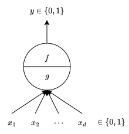
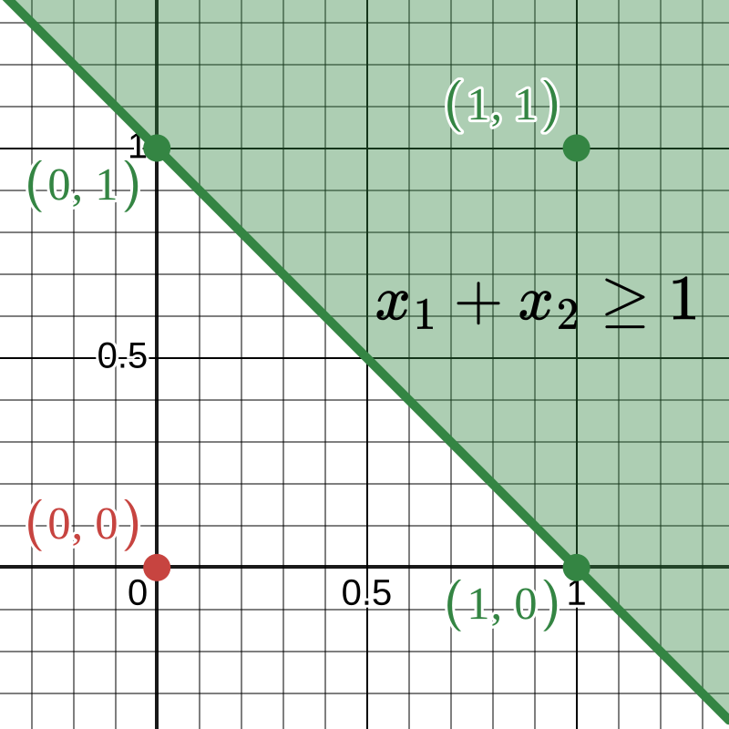

# Can a Machine "Think" Like a Brain Cell?

In 1943, neurophysiologist Warren McCulloch and logician Walter Pitts asked a deceptively simple question: what is the *simplest* mathematical gadget that behaves like a biological neuron? A real neuron receives electrical signals from its neighbors, and if the combined stimulation is strong enough, it "fires" and sends a signal of its own. If the stimulation is too weak, it stays silent. That is it: accumulate, compare to a threshold, fire or stay quiet.

McCulloch and Pitts stripped this idea down to its mathematical bones and proposed what is now called the **McCulloch-Pitts (MP) neuron** [@mcculloch1943logical]. Their model is the starting point for nearly every neural network that followed, so understanding it well is worth the effort. In this post, we will build the MP neuron from scratch, starting not with equations but with a question you have probably answered dozens of times: *should I watch this movie?*

# A Concrete Scenario: Should You Watch This Movie?

Imagine you are scrolling through a streaming service on a Friday evening. You stumble upon a movie you have never seen, and you need to make a quick yes-or-no decision: watch it or skip it. How do you decide?

Most people run through a mental checklist. Suppose yours looks like this:

::: {.tbl tbl-colwidths="auto"}
| Feature | Question |
|:-------:|:--------:|
| $x_1$ | Is the director Nolan? |
| $x_2$ | Is the genre Sci-Fi? |
| $x_3$ | Is the IMDB rating above 8? |

: Your mental checklist for deciding whether to watch a movie. {#tbl-movie_checklist style="width:50%; margin:auto;"}
:::

Each answer is binary: yes ($1$) or no ($0$). After running through the checklist, you mentally tally up the "yes" answers. If enough of them are positive, you hit play. If not, you keep scrolling.

Notice what is happening here. You are doing two things:

1. **Aggregating** your binary checks into a single number (the count of "yes" answers).
2. **Comparing** that number against a personal threshold.

A very easy-going viewer might watch anything that satisfies at least one check (threshold of $1$). A picky viewer might require all three checks to pass (threshold of $3$). The threshold models your personality.

This, in essence, is exactly what a McCulloch-Pitts neuron does. Let us now make this precise.

# Roadmap

Before we dive into the formalism, here is the journey we will take.

```{mermaid}
%%| fig-align: center
flowchart LR
    A["Concrete<br/>Example"] --> B["Formalizing<br/>the Model"]
    B --> C["Boolean<br/>Functions"]
    C --> D["Geometric<br/>Interpretation"]
    D --> E["Limitations<br/>and Next Steps"]

    style A fill:#10a37f,color:#fff
```

We are currently at the green node: we have the concrete movie example in hand. Next, we will translate it into mathematical notation. After that, we will see what kinds of logical functions this simple model can compute (and what it cannot). Finally, we will look at the model through a geometric lens, which will reveal both its elegance and its fundamental limitation.

# Formalizing the MP Neuron

## From Tallying to Summation

Let us go back to the movie scenario. We had three binary features $x_1$, $x_2$, and $x_3$. The "tally" of yes-answers is simply their sum:

$$
x_1 + x_2 + x_3.
$$

If we generalize to $d$ binary features, the tally becomes

$$
g\left(x_1, x_2, \dots, x_d\right) = x_1 + x_2 + \cdots + x_d = \sum_{j=1}^{d} x_j.
$$ {#eq-mp_neuron_aggregation}

Here, $g$ is the **aggregation function**. It takes all $d$ inputs and collapses them into a single number. Nothing fancy: just a sum.

## From "Enough Yes-Answers" to a Threshold

The decision ("watch or skip") is then a comparison of this sum against a threshold $\theta$:

$$
y = f\left(g\left(\vb{x}\right)\right) =
\begin{cases}
    1, & \text{if } g\left(\vb{x}\right) \geq \theta,\\
    0, & \text{if } g\left(\vb{x}\right) < \theta.
\end{cases}
$$ {#eq-mp_neuron_thresholding_logic}

Or, substituting @eq-mp_neuron_aggregation directly:

$$
y = f\left(x_1, x_2, \dots, x_d\right) =
\begin{cases}
    1, & \text{if } x_1 + x_2 + \cdots + x_d \geq \theta,\\
    0, & \text{if } x_1 + x_2 + \cdots + x_d < \theta.
\end{cases}
$$ {#eq-mp_neuron_thresholding_logic_simpler}

Here, $\vb{x}$ is the column vector of all inputs:

$$
\vb{x} =
\begin{bmatrix}
    x_1\\
    x_2\\
    \vdots\\
    x_d
\end{bmatrix}.
$$

That is the entire MP neuron: sum the inputs, compare to $\theta$, output $1$ or $0$. @fig-general_mp_neuron shows a diagram of this model.

{#fig-general_mp_neuron fig-align="center" width=40% .invert}

## Excitatory and Inhibitory Inputs

There is one more detail. In our movie example, all the features were "good things" (checks in favor of watching). But what if one of the features is a deal-breaker? For instance, suppose $x_4$ is "Does the movie contain spoilers for a show you haven't finished?" If $x_4 = 1$, you would skip the movie *no matter how many other checks pass*. This kind of input is called **inhibitory**: if *any* inhibitory input is $1$, the neuron's output is immediately $0$, regardless of the other inputs. All other (non-deal-breaker) inputs are called **excitatory**.

The following flowchart summarizes the complete decision process of an MP neuron.

```{mermaid}
%%| fig-align: center
flowchart TD
    A["Receive inputs<br/>x₁, x₂, ..., xd"] --> B{"Is any input<br/>inhibitory<br/>and equal to 1?"}
    B -- "Yes" --> C["Output y = 0"]
    B -- "No" --> D["Compute sum<br/>g(x) = x₁ + x₂ + ... + xd"]
    D --> E{"Is g(x) ≥ θ?"}
    E -- "Yes" --> F["Output y = 1"]
    E -- "No" --> G["Output y = 0"]
```

So the MP neuron operates in two stages. First, it checks for deal-breakers. If none are present, it proceeds to the aggregation and thresholding step described by @eq-mp_neuron_thresholding_logic_simpler.

## Checkpoint: Where Are We?

```{mermaid}
%%| fig-align: center
flowchart LR
    A["Concrete<br/>Example"] --> B["Formalizing<br/>the Model"]
    B --> C["Boolean<br/>Functions"]
    C --> D["Geometric<br/>Interpretation"]
    D --> E["Limitations<br/>and Next Steps"]

    style A fill:#555,color:#fff
    style B fill:#10a37f,color:#fff
```

Let us take stock. We started with a relatable scenario (deciding whether to watch a movie) and translated it into a precise mathematical model: the MP neuron. This model takes $d$ binary inputs, sums them up, and compares the sum to a threshold $\theta$. If any input is inhibitory and active, the output is forced to $0$. Otherwise, the output is $1$ when the sum meets or exceeds the threshold, and $0$ when it does not.

The natural next question is: what kinds of computations can this simple model perform? It turns out that the MP neuron can implement some of the most fundamental operations in logic. Let us see how.

# The MP Neuron in Action: Boolean Functions

A **Boolean function** is a function whose inputs and output are all binary ($0$ or $1$). The AND, OR, and NOT functions are the most basic examples, and every digital circuit is built from them. If the MP neuron can implement these, it is already surprisingly powerful for such a simple model.

## The AND Function

The AND function outputs $1$ only when *all* inputs are $1$. With three excitatory inputs, the truth table looks like this:

::: {.tbl tbl-colwidths="auto"}
| $x_1$ | $x_2$ | $x_3$ | $x_1 + x_2 + x_3$ | AND output |
|:------:|:------:|:------:|:------------------:|:----------:|
| 0 | 0 | 0 | 0 | 0 |
| 0 | 0 | 1 | 1 | 0 |
| 0 | 1 | 0 | 1 | 0 |
| 0 | 1 | 1 | 2 | 0 |
| 1 | 0 | 0 | 1 | 0 |
| 1 | 0 | 1 | 2 | 0 |
| 1 | 1 | 0 | 2 | 0 |
| 1 | 1 | 1 | 3 | 1 |

: Truth table for the AND function with three inputs. {#tbl-and_truth_table style="width:60%; margin:auto;"}
:::

Look at the sum column. The output should be $1$ only when the sum equals $3$ (the maximum possible). Every other sum ($0$, $1$, or $2$) should give an output of $0$. So we need a threshold $\theta$ such that sums of $3$ or more pass, and sums of $2$ or less fail. Setting $\theta = 3$ does exactly this:

$$
y = f\left(x_1, x_2, x_3\right) =
\begin{cases}
    1, & \text{if } x_1 + x_2 + x_3 \geq 3,\\
    0, & \text{if } x_1 + x_2 + x_3 < 3.
\end{cases}
$$

You can verify this against every row of @tbl-and_truth_table. In general, for $d$ inputs, the AND function requires $\theta = d$: the threshold equals the total number of inputs, so all of them must be $1$ for the sum to reach it.

## The OR Function

The OR function outputs $1$ when *at least one* input is $1$. Here is the truth table for three inputs:

::: {.tbl tbl-colwidths="auto"}
| $x_1$ | $x_2$ | $x_3$ | $x_1 + x_2 + x_3$ | OR output |
|:------:|:------:|:------:|:------------------:|:---------:|
| 0 | 0 | 0 | 0 | 0 |
| 0 | 0 | 1 | 1 | 1 |
| 0 | 1 | 0 | 1 | 1 |
| 0 | 1 | 1 | 2 | 1 |
| 1 | 0 | 0 | 1 | 1 |
| 1 | 0 | 1 | 2 | 1 |
| 1 | 1 | 0 | 2 | 1 |
| 1 | 1 | 1 | 3 | 1 |

: Truth table for the OR function with three inputs. {#tbl-or_truth_table style="width:60%; margin:auto;"}
:::

This time, the output should be $1$ whenever the sum is $1$ or more. The only row with output $0$ is the one where all inputs are $0$ (sum $= 0$). So we set $\theta = 1$:

$$
y = f\left(x_1, x_2, x_3\right) =
\begin{cases}
    1, & \text{if } x_1 + x_2 + x_3 \geq 1,\\
    0, & \text{if } x_1 + x_2 + x_3 < 1.
\end{cases}
$$

Again, you can check this against @tbl-or_truth_table. In general, the OR function always requires $\theta = 1$, regardless of the number of inputs.

## The NOT Function

The NOT function has a single input and flips it: $0$ becomes $1$, and $1$ becomes $0$. This is where the inhibitory mechanism comes in.

We treat the single input $x_1$ as **inhibitory**. Consider what happens in each case. If $x_1 = 1$, then because $x_1$ is inhibitory and active, the output is immediately $y = 0$. This is exactly what NOT should produce when the input is $1$. If $x_1 = 0$, no inhibitory input is active, so we proceed to the threshold check. Using @eq-mp_neuron_thresholding_logic_simpler with $d = 1$, we need $x_1 \geq \theta$ to output $1$. Since $x_1 = 0$, we need $0 \geq \theta$, which means $\theta$ must be $0$ (or negative). Setting $\theta = 0$ gives us:

$$
y = f\left(x_1\right) =
\begin{cases}
    1, & \text{if } x_1 \geq 0,\\
    0, & \text{if } x_1 < 0.
\end{cases}
$$

Since $x_1 = 0 \geq 0$, we get $y = 1$, which is the correct NOT output.

You might be wondering: "Wait, if $x_1 = 1$ and $\theta = 0$, wouldn't the threshold check also give $y = 1$?" Yes, it would, but the inhibitory check happens *first*. The threshold check in the equation above only applies when no inhibitory input is active. That two-stage process (check for deal-breakers first, then threshold) is what makes NOT work.

## Checkpoint: Where Are We?

```{mermaid}
%%| fig-align: center
flowchart LR
    A["Concrete<br/>Example"] --> B["Formalizing<br/>the Model"]
    B --> C["Boolean<br/>Functions"]
    C --> D["Geometric<br/>Interpretation"]
    D --> E["Limitations<br/>and Next Steps"]

    style A fill:#555,color:#fff
    style B fill:#555,color:#fff
    style C fill:#10a37f,color:#fff
```

So far, we have seen that the MP neuron can implement AND ($\theta = d$), OR ($\theta = 1$), and NOT (using an inhibitory input with $\theta = 0$). These are the three fundamental Boolean operations, and a single MP neuron handles each of them cleanly.

But this raises a deeper question: can the MP neuron implement *any* Boolean function? Or are there functions it simply cannot represent? To answer this, we need to look at what the MP neuron is doing from a geometric perspective. This is where things get really interesting.

# Seeing It Geometrically

## The Decision Boundary

Let us revisit the OR function, but with just two inputs ($d = 2$) so that we can plot things on a 2D plane. With $\theta = 1$, the MP neuron computes:

$$
y =
\begin{cases}
    1, & \text{if } x_1 + x_2 \geq 1,\\
    0, & \text{if } x_1 + x_2 < 1.
\end{cases}
$$

Since both inputs are binary, there are exactly four possible input points: $\left(0, 0\right)$, $\left(0, 1\right)$, $\left(1, 0\right)$, and $\left(1, 1\right)$. Let us evaluate each one:

::: {.tbl tbl-colwidths="auto"}
| $x_1$ | $x_2$ | $x_1 + x_2$ | $y$ (OR) |
|:------:|:------:|:----------:|:--------:|
| 0 | 0 | 0 | 0 |
| 0 | 1 | 1 | 1 |
| 1 | 0 | 1 | 1 |
| 1 | 1 | 2 | 1 |

: The 2-input OR function evaluated at all possible inputs. {#tbl-or_2_inputs style="width:50%; margin:auto;"}
:::

Now, the equation $x_1 + x_2 = 1$ defines a straight line on the 2D plane. This line is the **decision boundary**. Every point on or above this line (where $x_1 + x_2 \geq 1$) is classified as $1$, and every point below it (where $x_1 + x_2 < 1$) is classified as $0$. @fig-or_function_2_inputs_mp_neuron shows this.

{#fig-or_function_2_inputs_mp_neuron fig-align="center" width=40% .invert}

## How the Threshold Shapes the Boundary

The static figure above shows the decision boundary for one particular threshold ($\theta = 1$, the OR function). But what happens as we change $\theta$? The line $x_1 + x_2 = \theta$ shifts across the plane: a small $\theta$ places the boundary close to the origin (so most points fire), while a large $\theta$ pushes it far from the origin (so fewer points fire). The following animation shows this in action. Watch how the four input points change color (green for output $1$, red for output $0$) as the boundary sweeps from $\theta = 0$ to $\theta = 3$ and back.



At $\theta = 0$, every point satisfies the threshold and fires. At $\theta = 1$, we get the OR function (only $\left(0, 0\right)$ is red). At $\theta = 2$, we get the AND function (only $\left(1, 1\right)$ is green). And at $\theta = 3$, no point reaches the threshold. The single parameter $\theta$ controls which Boolean function the neuron implements, and geometrically, it controls where the decision boundary sits.

## From Lines to Hyperplanes

In the 2D case, the decision boundary $x_1 + x_2 = \theta$ is a line. In general, for $d$ inputs, the decision boundary

$$
x_1 + x_2 + \cdots + x_d = \theta
$$ {#eq-mp_neuron_decision_boundary}

is a **hyperplane** in $d$-dimensional space. All input points on one side of this hyperplane produce output $1$, and all input points on the other side produce output $0$.

## Linear Separability

This geometric view reveals something fundamental about the MP neuron. Because it always draws a straight (linear) boundary to separate the $1$-outputs from the $0$-outputs, it can only represent Boolean functions where such a clean separation is possible. This property is called **linear separability**.

::: {.callout-note}
## Linear Separability
A Boolean function is **linearly separable** if there exists a hyperplane such that all inputs with output $1$ lie on one side, and all inputs with output $0$ lie on the other side. A single MP neuron can represent a Boolean function *if and only if* that function is linearly separable.
:::

The AND and OR functions are both linearly separable (as we have seen), so the MP neuron handles them. But are there Boolean functions that are *not* linearly separable?

# Limitations and Looking Ahead

## Checkpoint: Where Are We?

```{mermaid}
%%| fig-align: center
flowchart LR
    A["Concrete<br/>Example"] --> B["Formalizing<br/>the Model"]
    B --> C["Boolean<br/>Functions"]
    C --> D["Geometric<br/>Interpretation"]
    D --> E["Limitations<br/>and Next Steps"]

    style A fill:#555,color:#fff
    style B fill:#555,color:#fff
    style C fill:#555,color:#fff
    style D fill:#555,color:#fff
    style E fill:#10a37f,color:#fff
```

We have built the MP neuron from a concrete example, formalized it, seen it implement Boolean functions, and understood its geometric nature. Now we arrive at the natural final question: where does this model break down?

## The Limits of a Single Neuron

The MP neuron, elegant as it is, has several important limitations.

- First, it only accepts **binary inputs**. Every input must be $0$ or $1$. What about real-valued features like temperature, price, or probability? The MP neuron has no way to handle them.
- Second, there is **no learning**. We had to *manually choose* the threshold $\theta$ for each Boolean function (e.g., $\theta = 3$ for AND, $\theta = 1$ for OR). The model does not learn the right threshold from data. We had to figure it out ourselves.
- Third, **all inputs are treated as equally important**. The aggregation function simply sums the inputs with no mechanism to say "the director matters more than the genre." In other words, there are no *weights* on the inputs.
- Finally, **not all Boolean functions are representable**. Because the MP neuron can only draw linear decision boundaries, it cannot represent any Boolean function that is not linearly separable. The most famous example of such a function is the XOR (exclusive OR), which outputs $1$ when exactly one of the two inputs is $1$, and $0$ otherwise. No single straight line can separate the $1$-outputs from the $0$-outputs for XOR. (We will explore this in detail in a future post.)

Each of these limitations points toward a richer model, and the history of neural networks is largely the story of overcoming them, one by one.

# Summary: Closing the Loop

Let us return to where we started: you, scrolling through a streaming service, deciding whether to watch a movie. That simple mental process of tallying up binary checks and comparing the count against a personal cutoff turned out to be exactly the logic behind the McCulloch-Pitts neuron. We formalized the tally as a summation (@eq-mp_neuron_aggregation) and the cutoff as a threshold comparison (@eq-mp_neuron_thresholding_logic_simpler), and we added the notion of inhibitory inputs to handle deal-breaker features that override everything else.

With this model in hand, we showed that a single MP neuron can implement the fundamental Boolean functions: AND by setting $\theta = d$ so that every input must be active, OR by setting $\theta = 1$ so that a single active input suffices, and NOT by leveraging the inhibitory mechanism with $\theta = 0$. We then looked at the model through a geometric lens and discovered that the MP neuron draws a linear decision boundary (a hyperplane defined by @eq-mp_neuron_decision_boundary) to separate inputs that fire from inputs that do not. This means the MP neuron can only represent linearly separable functions, which is both its core insight and its fundamental limitation.

Despite these constraints, the MP neuron is historically significant as the first formal model connecting neuroscience to computation [@mcculloch1943logical]. Every modern neural network, from a simple perceptron to a large language model, is a descendant of this 1943 idea. The journey from here to those descendants is the story of adding weights, adding learning rules, and stacking neurons into networks. That story begins with the perceptron, which we will cover next.

# Acknowledgment

This blog post draws on the lecture series by Mitesh Khapra and colleagues [@iitm-deep-learning-playlist; @nptel-deep-learning-playlist].
