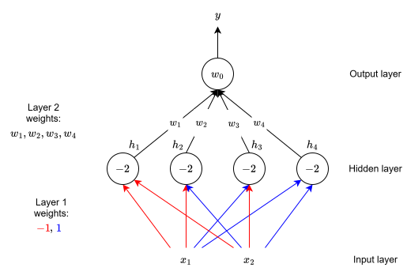
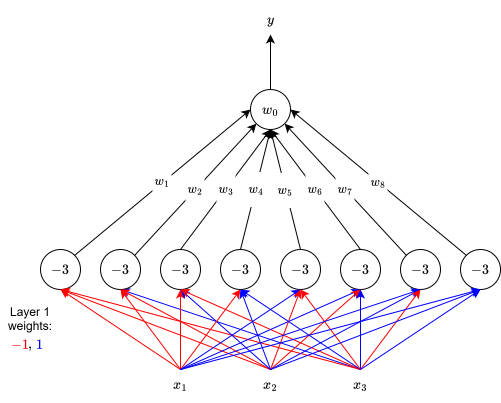

# Introduction

As we saw in the [perceptron blog post](../perceptron/index.qmd), a single perceptron cannot implement non-linearly separable functions. However, a network of perceptrons can. Here, by "network of perceptrons", we mean more than one perceptron. We will see how to implement *any* Boolean function using a network of perceptrons. Such a network is also called **Multilayer Perceptron (MLP)**. This will be an illustrative proof as opposed to a rigorous mathematical one.

# Representation Power of an MLP

Let us consider a binary output ($\in \{0, 1\}$), two binary inputs ($\in \{-1, 1\}$), and four perceptrons. Each of the two inputs is connected to all four perceptrons with specified weights. The bias of each hidden layer perceptron is $-2$, i.e., each hidden layer perceptron fires (gives a non-zero output) only if the weighted sum of its inputs is $\geq 2$. Have a look at @fig-network-of-perceptrons.

{#fig-network-of-perceptrons fig-align="center" width=80% .invert}

The red weights have a weight value of $-1$, whereas the blue weights have a weight value of $1$. We can see that each of the 4 perceptrons, shown in gray, are connected to an output perceptron by weights $w_1$, $w_2$, $w_3$, and $w_4$, which need to be learned. The bias of this output perceptron is $w_0$. Finally, the output of this output perceptron ($y$) is the output of this MLP. Please keep the following terminology in mind:

- The network shown in @fig-network-of-perceptrons consists of three layers:
  - The layer containing the inputs $x_1$ and $x_2$ is called the **input layer**,
  - the layer containing the four perceptrons is called the **hidden layer**,
  - and the final layer containing one output is called the **output layer**.
- The outputs of the four perceptrons in the hidden layer are denoted by $h_1$, $h_2$, $h_3$, and $h_4$.
- The red and blue edges are called the **layer 1 weights**; and $w_1$, $w_2$, $w_3$, and $w_4$ are called the **layer 2 weights**.

The claim is that this network can implement any Boolean function irrespective of whether the function is linearly separable or not. In other words, we can find $w_1$, $w_2$, $w_3$, and $w_4$ such that the truth table of any Boolean function can be represented by this network shown in @fig-network-of-perceptrons. More specifically, I mean the following. We know that

$$
\text{Number of Boolean functions} = 2^{2^{d}} = 2^{2^{2}} = 16.
$$

The claim is that we can implement each of these $16$ functions using this network by finding $16$ different combinations of layer 2 weights. To put it more simply, we can find $16$ configurations of these layer 2 weights, each configuration implementing one of these $16$ Boolean functions.

Let us understand what is happening. Notice that each perceptron in the hidden layer fires only for a specific input, i.e., no two hidden perceptrons fire for the same input. To understand this, focus on the following. The inputs are shown in @tbl-two-binary-inputs.

| $x_1$ | $x_2$ |
|:-----:|:-----:|
| $-1$  | $-1$  |
| $-1$  | $1$   |
| $1$   | $-1$  |
| $1$   | $1$   |

: Two binary inputs. {#tbl-two-binary-inputs style="width:30%; margin:auto;"}

We can write the perceptron equation for the perceptrons in the hidden layer as

$$
h_i =
\begin{cases}
  1, & \text{if $-2 + w_{i1} x_1 + w_{i2} x_2 \geq 0$},\\
  0, & \text{if $-2 + w_{i1} x_1 + w_{i2} x_2 < 0$},
\end{cases}
$$

i.e.,

$$
h_i =
\begin{cases}
  1, & \text{if $w_{i1} x_1 + w_{i2} x_2 \geq 2$},\\
  0, & \text{if $w_{i1} x_1 + w_{i2} x_2 < 2$}.
\end{cases}
$$ {#eq-perceptron_eqn_for_hidden_perceptrons}

Here, $w_{ij}$ denotes the $j$-th weight going inside the $i$-th perceptron of the hidden layer. As there are two inputs, $j \in \{1, 2\}$.

- First hidden perceptron ($i = 1$):
  - From @fig-network-of-perceptrons, we can see that both the weights for the two inputs going inside this perceptron are $-1$. In other words, $w_{11} = w_{12} = -1$. Substituting this in @eq-perceptron_eqn_for_hidden_perceptrons, we get

  $$
  h_1 =
  \begin{cases}
    1, & \text{if $- x_1 - x_2 \geq 2$},\\
    0, & \text{if $- x_1 - x_2 < 2$}.
  \end{cases}
  $$

  - Clearly, $h_1 = 1$ (i.e., the first hidden perceptron fires) only for the first input shown in @tbl-two-binary-inputs.

- Second hidden perceptron ($i = 2$):
  - From @fig-network-of-perceptrons, we can see that the weight for the first input going inside this perceptron is $-1$, whereas the weight for the second input going inside this perceptron is $1$. In other words, $w_{21} = -1$ and $w_{22} = 1$. Substituting this in @eq-perceptron_eqn_for_hidden_perceptrons, we get

  $$
  h_2 =
  \begin{cases}
    1, & \text{if $- x_1 + x_2 \geq 2$},\\
    0, & \text{if $- x_1 + x_2 < 2$}.
  \end{cases}
  $$

  - Clearly, $h_2 = 1$ (i.e., the second hidden perceptron fires) only for the second input shown in @tbl-two-binary-inputs.

- Third hidden perceptron ($i = 3$):
  - From @fig-network-of-perceptrons, we can see that the weight for the first input going inside this perceptron is $1$, whereas the weight for the second input going inside this perceptron is $-1$. In other words, $w_{31} = 1$ and $w_{32} = -1$. Substituting this in @eq-perceptron_eqn_for_hidden_perceptrons, we get

  $$
  h_3 =
  \begin{cases}
    1, & \text{if $x_1 - x_2 \geq 2$},\\
    0, & \text{if $x_1 - x_2 < 2$}.
  \end{cases}
  $$

  - Clearly, $h_3 = 1$ (i.e., the third hidden perceptron fires) only for the third input shown in @tbl-two-binary-inputs.

- Fourth hidden perceptron ($i = 4$):
  - From @fig-network-of-perceptrons, we can see that both the weights for the two inputs going inside this perceptron are $1$. In other words, $w_{41} = w_{42} = 1$. Substituting this in @eq-perceptron_eqn_for_hidden_perceptrons, we get

  $$
  h_4 =
  \begin{cases}
    1, & \text{if $x_1 + x_2 \geq 2$},\\
    0, & \text{if $x_1 + x_2 < 2$}.
  \end{cases}
  $$

  - Clearly, $h_4 = 1$ (i.e., the fourth hidden perceptron fires) only for the fourth input shown in @tbl-two-binary-inputs.

The following is the summary:

- First hidden perceptron fires only for the input $(-1, -1)$,
- second hidden perceptron fires only for the input $(-1, 1)$,
- third hidden perceptron fires only for the input $(1, -1)$,
- fourth hidden perceptron fires only for the input $(1, 1)$.

So, each hidden perceptron is specialized for a particular input, i.e., it only fires for that particular input.

Let us demonstrate this construction by implementing the XOR function (which is not linearly separable) using our network. @tbl-xor-hidden shows the output perceptron equation along with the XOR output, the inputs, and the outputs of the hidden perceptron.

| $x_1$ | $x_2$ | XOR | $h_1$ | $h_2$ | $h_3$ | $h_4$ |                Output Perceptron Equation                      |
|:-----:|:-----:|:---:|:-----:|:-----:|:-----:|:-----:|:--------------------------------------------------------------:|
| $-1$  | $-1$  | $0$ | $1$   | $0$   | $0$   | $0$   | $w_0 + w_1 h_1 + w_2 h_2 + w_3 h_3 + w_4 h_4 < 0$              |
| $-1$  | $1$   | $1$ | $0$   | $1$   | $0$   | $0$   | $w_0 + w_1 h_1 + w_2 h_2 + w_3 h_3 + w_4 h_4 \geq 0$           |
| $1$   | $-1$  | $1$ | $0$   | $0$   | $1$   | $0$   | $w_0 + w_1 h_1 + w_2 h_2 + w_3 h_3 + w_4 h_4 \geq 0$           |
| $1$   | $1$   | $0$ | $0$   | $0$   | $0$   | $1$   | $w_0 + w_1 h_1 + w_2 h_2 + w_3 h_3 + w_4 h_4 < 0$              |

: The XOR function output, two inputs, perceptron equation of the output perceptron, and the outputs of each hidden perceptron. {#tbl-xor-hidden style="width:80%; margin:auto;"}

Substituting the values of $h_i$ in the perceptron equations and solving them simultaneously, we get the following set of inequalities:

$$
\begin{align*}
  w_1 &< w_0,\\
  w_2 &\geq w_0,\\
  w_3 &\geq w_0,\\
  w_4 &< w_0.
\end{align*}
$$

We can see that there are no contradictions in this set of inequalities. In other words, we can find the values of the weights $w_1$, $w_2$, $w_3$, and $w_4$ such that this network implements the XOR function without any misclassifications. This became possible because each hidden perceptron fires for a particular input. Essentially, each weight $w_i$ is now responsible for one of the four possible inputs shown in @tbl-two-binary-inputs, and can be adjusted to get the desired output for that input.

This network can implement any other Boolean function too irrespective of whether it is linearly separable or not. Obviously, the set of inequalities will be different, but they won't be contradictory.

## More than Two Inputs

Now, what if we have three inputs, i.e., $d = 3$? We can again design an MLP that can implement any of the $2^{2^{3}} = 256$ Boolean functions. This network will have eight hidden perceptrons (@fig-3-input-network-of-perceptrons), as there are now a total of $2^3= 8$ possible inputs.

{#fig-3-input-network-of-perceptrons fig-align="center" width=80% .invert}

Again, each of these eight hidden perceptrons will fire for one particular input.

Let us generalize further. What if we have $n$ inputs? It is easy to see that for $n$ inputs, we will need $2^n$ perceptrons in the hidden layer, one for each of the $2^n$ possible inputs.

Thus, any Boolean function of $n$ inputs can be represented exactly by an MLP containing a single hidden layer with $2^n$ perceptrons and one output layer containing $1$ perceptron. This is the representation power of an MLP. However, the clear catch is that as $n$ increases, the number of perceptrons in the hidden layer increases exponentially.

Note that a network of $2^n + 1$ perceptrons is not necessary, but is sufficient. For instance, we have seen in the [McCulloch-Pitts neuron blog post](../mcculloch-pitts-neuron/index.qmd) that the AND function can be implemented with just a single perceptron.

# Acknowledgment

I have referred to the YouTube playlists [@iitm-deep-learning-playlist; @nptel-deep-learning-playlist] while writing this blog post.
