# Introduction

In the [sigmoid neuron](../sigmoid-neuron/index.qmd) blog post, we generalized a perceptron to have real inputs and a real output. We also discussed gradient descent, i.e., an algorithm to learn the weights, in a fair amount of detail. Now, we will discuss what a multilayer network of sigmoid neurons is capable of.

# Representation Power of Multilayer Network of Sigmoid Neurons

In the [MLP](../mlp/index.qmd) blog post, we saw the representation power of a multilayer network of perceptrons (MLP). We saw that an MLP with a single hidden layer can be used to represent *any Boolean function precisely* (i.e., no errors). We proved this statement by construction, i.e., by constructing a network where each perceptron in the hidden layer caters to one particular input.

An analogous statement in the context of a multilayer network of sigmoid neurons is the following. **A multilayer network of sigmoid neurons with a single hidden layer can be used to *approximate any continuous function* to *any desired precision***.

The phrase "any desired precision" mathematically means the following. Say we have a network whose output is $f(\mathbf{x})$ (where $\mathbf{x} \in \mathbb{R}^d$ is the input). And say the ground truth, i.e., the output of the true function, is $f_t(\mathbf{x})$. Being able to design a network to any desired precision means that the difference between the ground truth and the output of the designed network can be made arbitrarily small, i.e.,

$$
\begin{equation*}
  \left\lvert f_t (\mathbf{x}) - f (\mathbf{x}) \right\rvert < \epsilon,
\end{equation*}
$$

for any $\epsilon > 0$. Of course, just like in the case of MLP, the caveat is that if we try to decrease $\epsilon$ (i.e., increase the precision), the number of neurons in the hidden layer increases exponentially.

This is a very powerful statement, which says that using a network of neurons we can, in principle, approximate any complex function to any desired precision given enough neurons in the hidden layer. This is known as the **universal approximation theorem** which was given by @cybenko1989approximation. We will see an illustrative proof of this theorem that is inspired by chapter 4 of @nielsen2015neural.

## Illustrative Proof

Consider an arbitrary function that is shown in @fig-arbitrary_function.

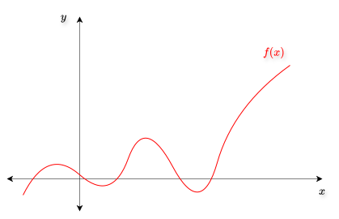{#fig-arbitrary_function fig-align="center" width=75% .invert}

If this is the true function, we want to know if we can come up with a network of neurons that can represent this arbitrary function to a certain desired degree of precision. What we can observe is that such an arbitrary function can be approximated using several "tower functions", as shown in @fig-arbitrary_function_approximated_using_towers.

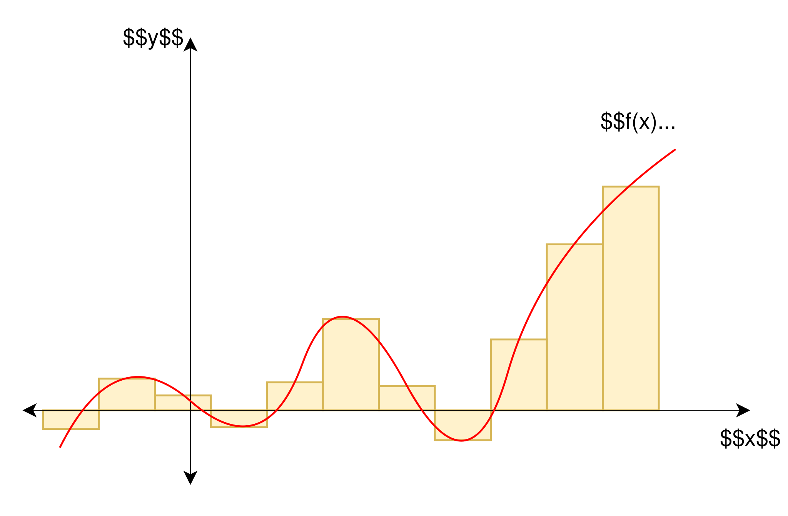{#fig-arbitrary_function_approximated_using_towers fig-align="center" width=75% .invert}

The *sum of all these towers* is the approximation of the original arbitrary function $f(x)$. We can see that if we decrease the width of these towers, their number will increase. And more the number of these thin towers, the better the approximation. So, to approximate any arbitrary function, we just need to know how to construct these towers, which are just rectangles with varying heights and positions along the $x$-axis. We can think of approximating this function $f(x)$ using a "tower maker" that creates the towers with the required height and position on the $x$-axis for each input $x$ and adds them all up, as shown in @fig-tower_maker.

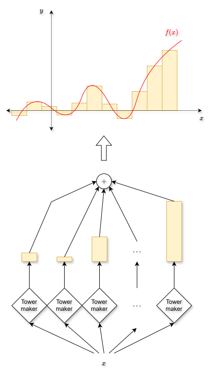{#fig-tower_maker fig-align="center" width=75% .invert}

So, we now just want to find what these "tower makers" are.

### Constructing the Tower Makers

Consider the network shown in @fig-tower_constructing_network.

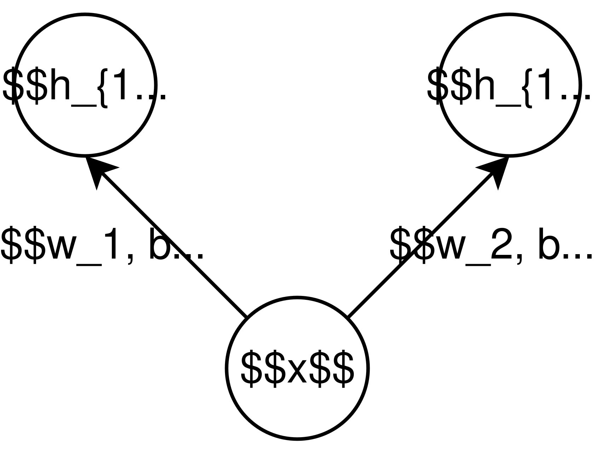{#fig-tower_constructing_network fig-align="center" width=30% .invert}

Here, $x$ is the input, and both the neurons shown are sigmoid neurons. $h_{11}$ is the output of the first neuron and $h_{12}$ is the output of the other. So, we have

$$
h_{11} = \frac{1}{1 + e^{-\left(w_1 x + b_1\right)}},
$$ {#eq-h_11}

and

$$
h_{12} = \frac{1}{1 + e^{-\left(w_2 x + b_2\right)}}.
$$ {#eq-h_12}

Further, let

$$
h_{21} = h_{11} - h_{12},
$$ {#eq-h_21}

which is the actual output of this network. The weight controls the steepness of the sigmoid curve whereas the bias controls the position of the curve on the $x$-axis. @fig-h_11 shows the sigmoid curve corresponding to $h_{11}$ (@eq-h_11) with $\left(w_1, b_1\right) = (100, 0)$, whereas @fig-h_12 shows the sigmoid curve corresponding to $h_{12}$ (@eq-h_12) with $\left(w_2, b_2\right) = (100, -30)$.

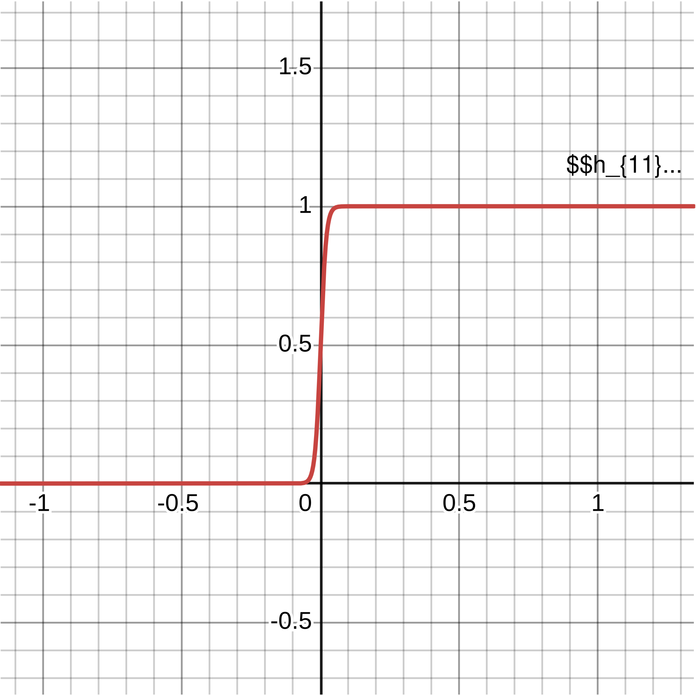{#fig-h_11 fig-align="center" width=45% .invert}

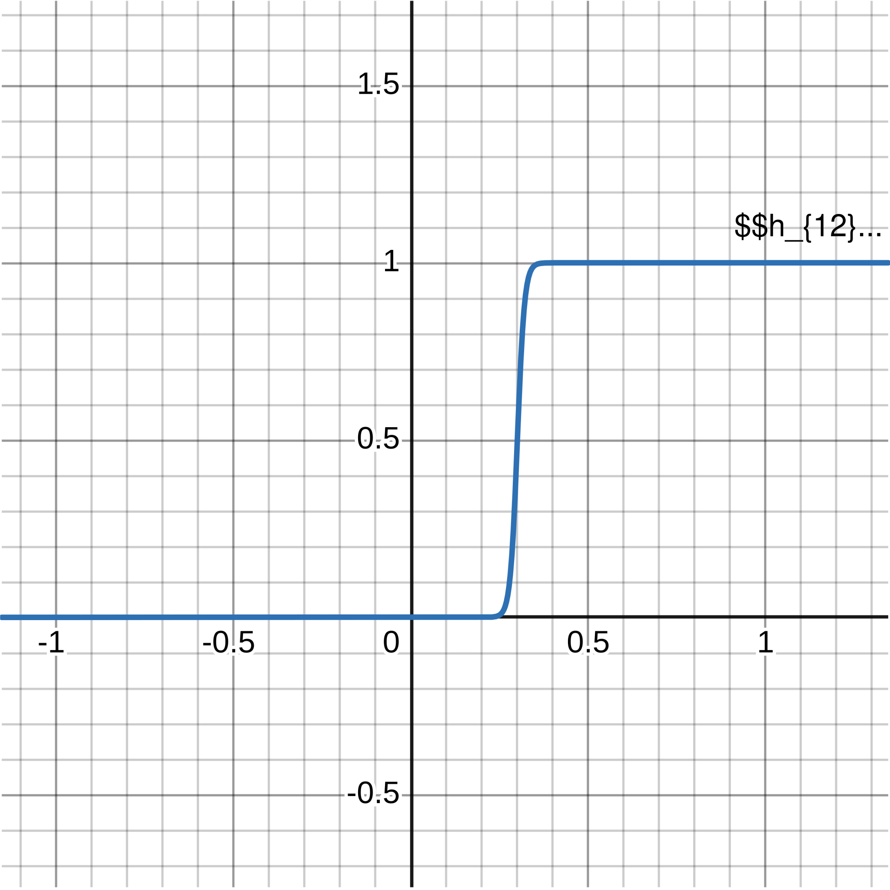{#fig-h_12 fig-align="center" width=45% .invert}

Subtracting the second from the first (as done in @eq-h_21), we actually get a single tower like function as shown in @fig-h_21.

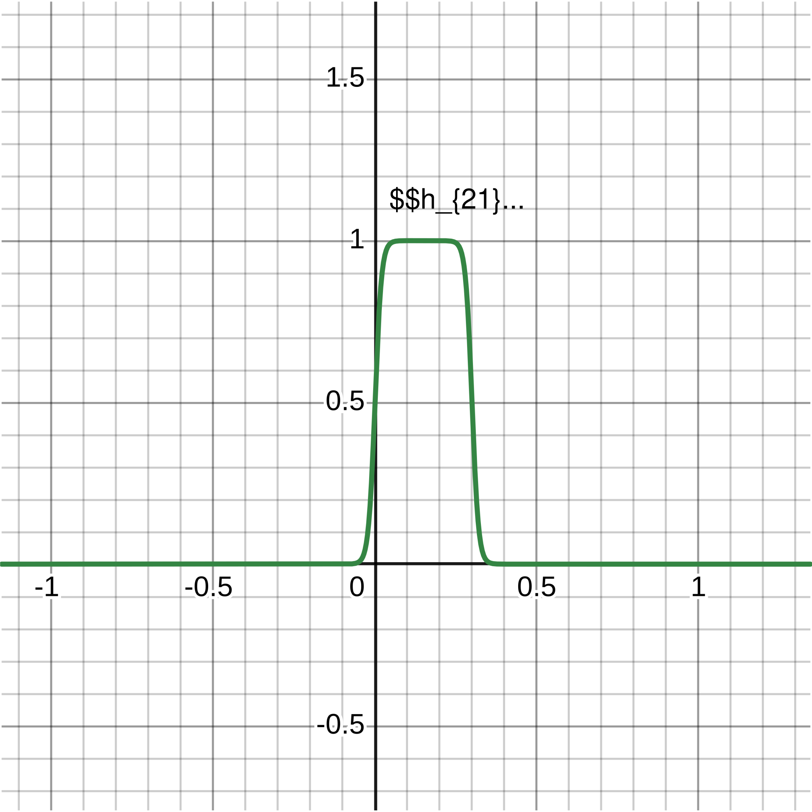{#fig-h_21 fig-align="center" width=45% .invert}

You can explore and play around with the values of the weights and biases using my Desmos graph [here](https://www.desmos.com/calculator/xnbiw4pm3m). So, the following is how we can construct a tower maker:

- Take two sigmoid neurons (functions).
- Set both of their weights as very high.
- Set sufficiently different values of their biases.
- Subtract the right shifted sigmoid function from the left shifted one.

This is the same as the network of sigmoid neurons shown in @fig-tower_maker_network.

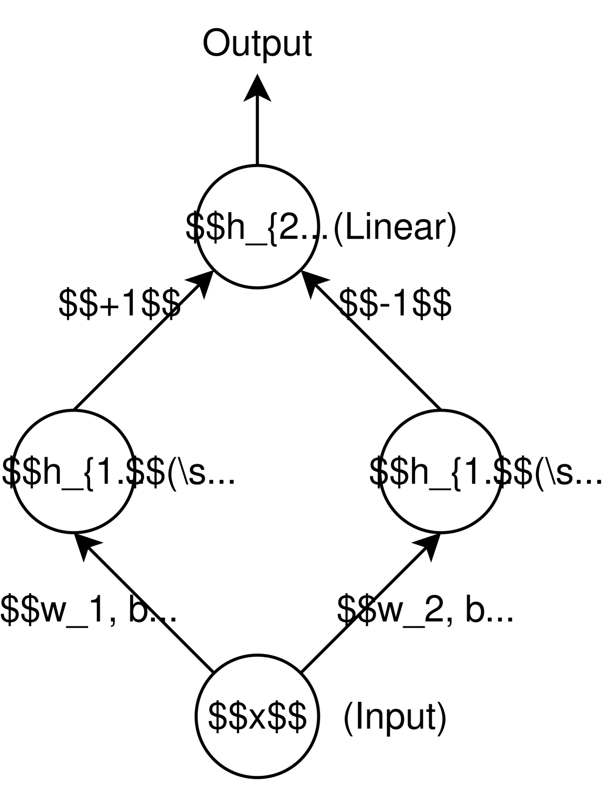{#fig-tower_maker_network fig-align="center" width=35% .invert}

The notation here is the following:

$$
\begin{align*}
  h_{ij} = \text{Output of the $j$-th neuron of the $i$-th layer}.
\end{align*}
$$

The activation function used for both the neurons in the hidden layer is sigmoid, whereas the activation function of the output neuron is linear. Notice how @eq-h_21 is implemented by keeping the weights of the output neuron as $+1$ and $-1$. To be precise, this network gives us

$$
h_{21} = \left(1\times h_{11}\right) + \left(-1\times h_{12}\right) = h_{11} - h_{12},
$$

which is the same as @eq-h_21.

#### More Than One Input

Now consider the situation in which we have two inputs, $x_1$ and $x_2$. @fig-2_d_eg shows what the data looks like.

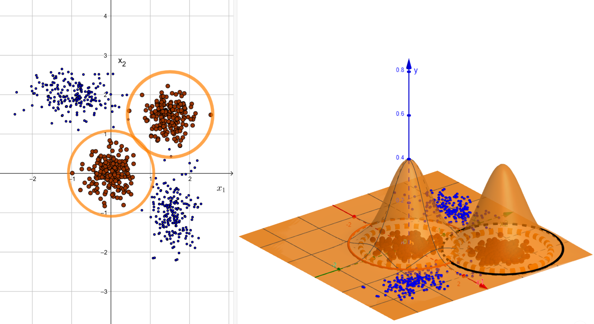{#fig-2_d_eg fig-align="center" width=100% .invert}

We want to construct a network that implements this function, or the decision boundary, that is shown in the right part of @fig-2_d_eg. This is the true function. We want to approximate it. Again, this can be approximated using 2D towers, analogous to the case with a single input. The sigmoid function with two inputs is given by

$$
f\left(x_1, x_2\right) = \frac{1}{1 + e^{-\left(w_1 x_1 + w_2 x_2 + b\right)}}.
$$ {#eq-sigmoid_with_two_inputs}

Again, the weights control the steepness of the sigmoid curve and the bias controls the movement of the sigmoid curve on the horizontal. This is very similar to the case with a single input. [Figure 10](#fig-2d_sigmoid_function) shows a 2D sigmoid function (@eq-sigmoid_with_two_inputs) with $w_1 = w_2 = 50$ (high weights) and $b=0$. You can play around with the values of the weights and the bias in [this Desmos graph](https://www.desmos.com/3d/vacj28mw50).

{#fig-2d_sigmoid_function fig-align="center" width=100% .invert}

Let us now try to construct a 2D tower. Consider the network shown in @fig-2d_tower_maker_network.

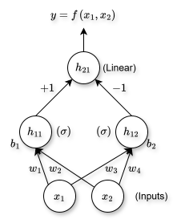{#fig-2d_tower_maker_network fig-align="center" width=35% .invert}

Here,

$$
h_{11} = \frac{1}{1 + e^{-\left(w_1 x_1 + w_2 x_2 + b_1\right)}},
$$

$$
h_{12} = \frac{1}{1 + e^{-\left(w_3 x_1 + w_4 x_2 + b_2\right)}},
$$

and

$$
h_{21} = \left(1\times h_{11}\right) + \left(-1 \times h_{12}\right).
$$

@fig-h_21_2d shows the output of this network for $w_1 = w_3 = 50$, $w_2 = w_4 = 0$, $b_1 = 74$, and $b_2 = -74$.

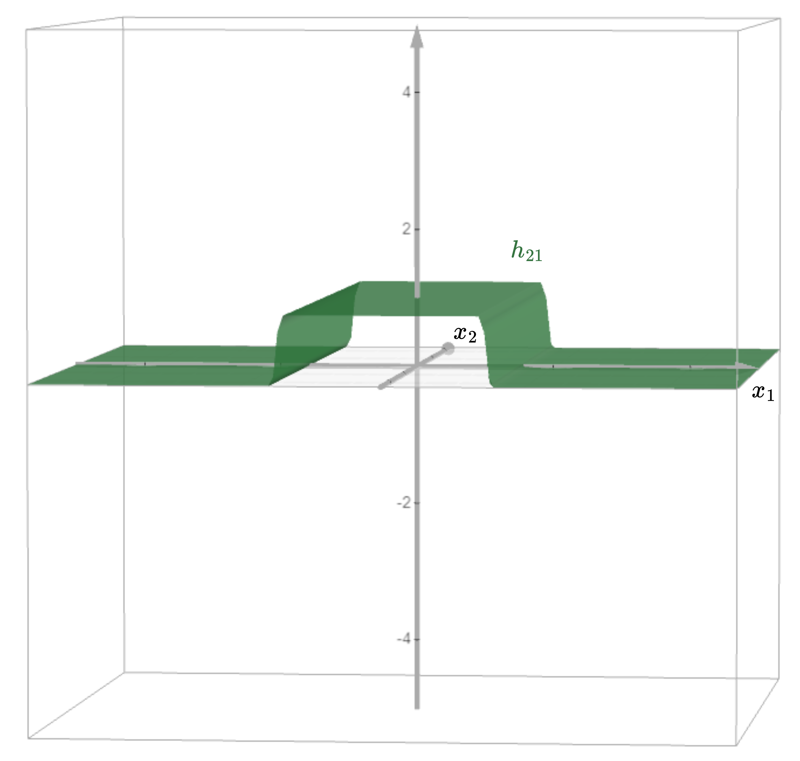{#fig-h_21_2d fig-align="center" width=85% .invert}

You can play around with the values of the weights and biases and form different towers in [this Desmos graph](https://www.desmos.com/3d/feaivw6bjy). However, notice that we do not get a proper tower with closed walls on all four sides. The tower we have got has two open walls along the $x_2$-axis. To solve this problem, let us put two such orthogonal open-walled towers on top of each other and add their output. This is shown in @fig-two_towers_perpendicular.

{#fig-two_towers_perpendicular fig-align="center" width=85% .invert}

This actually amounts to constructing a network shown in @fig-2d_tower_constructing_network_no_open_walls_without_final_threshold with $w_{11} = 200$, $w_{12} = 0$, $b_1 = 100$, $w_{21} = 200$, $w_{22} = 0$, $b_2 = -100$, $w_{31} = 0$, $w_{32} = 100$, $b_3 = 100$, $w_{41} = 0$, $w_{42} = 100$, and $b_4 = 2$.

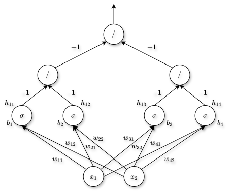{#fig-2d_tower_constructing_network_no_open_walls_without_final_threshold fig-align="center" width=75% .invert}

You can play around with the values of weights and biases to construct these towers in [this Desmos graph](https://www.desmos.com/3d/ku3f0jsd6k). However, there still are these unwanted tunnels along the $x_1$- and $x_2$-axes. To remove them, we can apply a threshold on top of this network such that we retain the output only if it is greater than $1$. This can be done by introducing a sigmoid neuron at the output of the network shown in @fig-2d_tower_constructing_network_no_open_walls_without_final_threshold. So, the final network now is shown in @fig-2d_tower_constructing_network_no_open_walls.

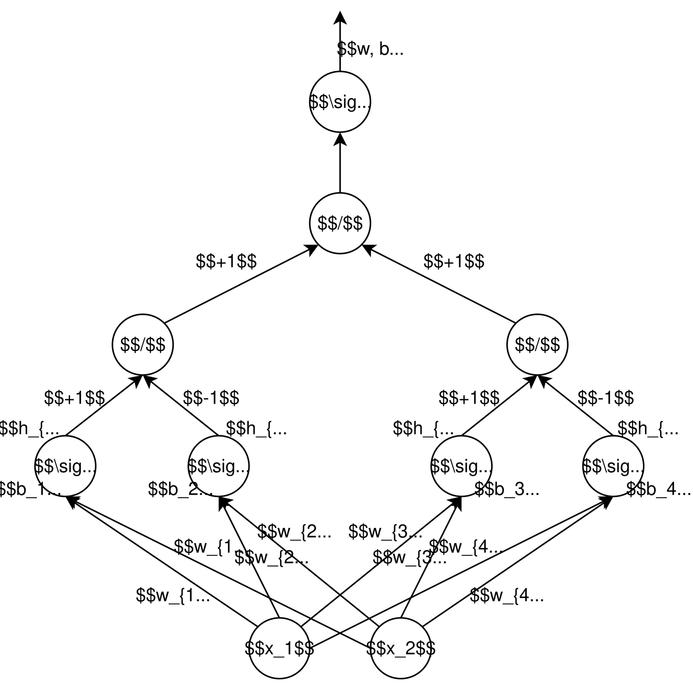{#fig-2d_tower_constructing_network_no_open_walls fig-align="center" width=75% .invert}

With $w = 50$ and $b = -100$ (along with the same values of other parameters used to construct the output shown in @fig-two_towers_perpendicular), the output given by this network is shown in @fig-final_tower.

{#fig-final_tower fig-align="center" width=85% .invert}

You can play around with the values of the parameters and check how the tower changes in [this Desmos graph](https://www.desmos.com/3d/nu1ekazahb). Finally, we have constructed a tower that is closed on all sides using the network shown in @fig-2d_tower_constructing_network_no_open_walls. This network is our tower maker in 2D. Finally, putting the towers constructed by this tower maker together, we can approximate the function shown in the right part of @fig-2_d_eg.

The same process generalizes for inputs with even higher dimensions. However, the number of neurons we need to construct these towers increases with the dimension of the input.

# Acknowledgment

I have referred to the YouTube playlists [@iitm-deep-learning-playlist; @nptel-deep-learning-playlist] while writing this blog post.
