This post is the first in a series of notes following Carnegie Mellon University's course 11-785, *Introduction to Deep Learning*, taught by Bhiksha Raj and Rita Singh [@cmu_11785_dl_youtube]. The plan for the series is to read like careful lecture notes: everything the lecture covers, in the order it covers it, with the derivations filled in, the diagrams redrawn, and the primary sources actually cited rather than gestured at.

Lecture one is a history lecture, and it is easy to mistake a history lecture for a warm-up. This one is not. By the end of it we will have stated, and mostly justified, three claims that the entire rest of the field is built on. The history is how those claims are earned.

# What is in the box?

Start with what these systems can do, because the capability is the thing that needs explaining.

The year everything changed was 2016. In that one year, four problems that had resisted decades of effort fell over in quick succession.

- **Speech recognition.** People had been working on automatic speech recognition since the 1950s. As late as 2015, asking your phone to transcribe a sentence was mostly a way of finding out what strange thing it would come up with instead. Then a speech recognition system reached parity with professional human transcribers on a standard conversational benchmark [@xiong2016achieving]. Not "approached". Parity.
- **Machine translation.** In early 2016, translating an English sentence into Spanish with an online translator and then translating it back was a party trick: what came out was usually not what went in, and often was not even related to what went in. Later that year Google switched its translation system over to a neural architecture [@wu2016google], and the output became good enough that professional translators started using it as a first draft.
- **Go.** We have long treated purely intellectual games as a proxy for intelligence, on the reasoning that they have no evolutionary purpose. There is a plausible story about why humans might be good at recognising faces or catching thrown objects. There is no such story about chess. So if a machine could beat a human at chess, surely the machine was thinking.
  
  Chess fell first, and the machine that did it has a local history worth knowing: the first computer to beat a grandmaster was **Deep Thought**, built at CMU on hardware originally designed for dynamic programming, which its authors realised could be repurposed for game-tree search. The team then moved to IBM and built Deep Blue, which beat Garry Kasparov in 1997 [@hsu2002behind]. By the mid-1990s chess was, in the relevant sense, done.
  
  Go was supposed to be different. The comparison usually quoted is that chess has on the order of $10^{120}$ possible games while Go has on the order of $10^{160}$ or more. The precise figures depend on exactly what you count, but the gap is the point: Go is not a little harder than chess, it is enormously harder. The received wisdom was that computers would not beat top human players at Go for another decade at least. In March 2016, AlphaGo beat Lee Sedol [@silver2016mastering]. Within a few years there were systems that learned to play at that level starting from self-play alone.

- **Image captioning.** Also in 2016, systems appeared that could look at a photograph and write a sentence about it [@vinyals2015show]. Shown a photograph, such a system would produce "a man in a black shirt is playing a guitar", and it would be right. At the time this seemed close to impossible.
  
  And that was a decade ago. Today you can hand a model a photograph of your room and get back a paragraph noting the water stains on the ceiling, the posters, the light fixture and air vent, the bed with someone lying on it, the general clutter, and a judgement that the water stains are the most concerning thing in the picture. You can hand a model a mathematical statement that appears in no textbook, phrased loosely, and more often than not get a proof.

Every one of these systems is a neural network. From the outside, each is a box: something goes in, something comes out.

```{mermaid}
%%| fig-align: center
%%| label: fig-black_boxes
%%| fig-cap: "Four tasks, four boxes. The same kind of machinery is inside all of them."
flowchart LR
    A1["Voice signal"] --> B1(["N.Net"]) --> C1["Transcription"]
    A2["Image"] --> B2(["N.Net"]) --> C2["Text caption"]
    A3["Game state"] --> B3(["N.Net"]) --> C3["Next move"]
    A4["Theorem"] --> B4(["N.Net"]) --> C4["Proof"]
```

So the question for this entire post, and the question the lecture opens with, is the obvious one:

> **What is in the box?**

Here is the route we are going to take to answer it. Each node is a question, and each arrow is the answer that forces the next question.

```{mermaid}
%%| fig-align: center
%%| label: fig-roadmap
%%| fig-cap: "The journey of this post. We start at the top and do not stop until we have earned the three claims at the bottom."
flowchart TD
    A["What is in the box?"] --> B["These are things brains do.<br/>So look at the brain"]
    B --> C["Associationism:<br/>the mind links things that co-occur"]
    C --> D["But where do the links live?<br/>Connectionism: in the connections"]
    D --> E["Then what is a single element?<br/>The McCulloch-Pitts unit"]
    E --> F["How does an element learn?<br/>Hebb, then Rosenblatt"]
    F --> G["One element is too weak.<br/>XOR is impossible"]
    G --> H["Network them:<br/>the multi-layer perceptron"]
    H --> I["Universal<br/>Boolean machine"]
    H --> J["Universal<br/>classifier"]
    H --> K["Universal function<br/>approximator"]
    I --> L["The box is an MLP"]
    J --> L
    K --> L

    style A fill:#1f6feb,stroke:#58a6ff,color:#fff
    style L fill:#1f6feb,stroke:#58a6ff,color:#fff
```

A note on how this post is built. Rather than switching examples every section, one small scenario runs through the whole thing: **a storm detector with two sensors**, one that sees the flash of lightning and one that hears the rumble of thunder. That example is not arbitrary. Lightning and thunder is the standard illustration of the very first theory of cognition, an idea some 2,400 years old, which means our concrete anchor and our first historical idea are the same object. We will follow it from "these two things go together" all the way to "a network can approximate any function you like".

# The magical capacity of humans

Everything in @fig-black_boxes is something a human can do. We learn. We solve problems. We recognise patterns. We create. We can sit still with no input at all and think, and produce an idea that was not there before. That list is worth emulating, which is exactly why people have tried to build machines that do it.

But if we want to emulate it, we should probably ask how the original works. And here the field runs immediately into a difficulty that Marvin Minsky put better than anyone:

> If the brain was simple enough to be understood, we would be too simple to understand it.

That has not stopped anyone from trying, and the trying goes back a long way.

## Associationism

The earliest model of human cognition is **associationism**, and its claim is a single sentence: we perform all of our inferences through associations, and those associations are learned from experience.

Take our storm. Every time you see a flash of lightning, a few seconds later you hear thunder. It happens again, and again, and again. Before long, something in you has linked the two: see the flash, and you brace for the noise. Hear the noise with no flash, and you conclude that lightning struck somewhere out of sight.

That is the whole idea. And notice how much of what we now call machine learning is exactly this: given an input, produce the output that has historically gone with it. Associationism is not a quaint precursor to the field. It is close to a description of it.

The idea is usually traced to Plato around 400 BC, and Aristotle gave it structure about fifty years later. In *On Memory and Reminiscence* [@aristotle_memory] he wrote:

> Hence, too, it is that we hunt through the mental train, excogitating from the present or some other, and from similar or contrary or coadjacent. Through this process reminiscence takes place.

Which, translated, is: we remember and we reason by association. Aristotle then set out four laws governing when associations form. They are genuinely a list, so here they are as one.

::: {.tbl tbl-colwidths="auto"}
| Law | What it says | Our storm |
|:---|:---|:---|
| **Contiguity** | Things that occur close together in space or time get linked | The flash and the rumble arrive seconds apart |
| **Frequency** | The more often two things co-occur, the stronger the link | Every storm strengthens the link a little |
| **Similarity** | If two things are similar, the thought of one triggers the other | A camera flash makes you flinch for a moment |
| **Contrast** | Seeing or recalling something may trigger its opposite | Thinking of a storm calls up a clear sky |

: Aristotle's four laws of association. {#tbl-aristotle_laws style="width:85%; margin:auto;"}
:::

Associationism then had a very long run. John Locke, David Hume, David Hartley, James Mill, John Stuart Mill, Alexander Bain and Ivan Pavlov all worked in this tradition, and the behaviourism of the early twentieth century is a direct descendant: behaviour is learned by repeatedly associating actions with feedback. The associationist theory of mental process is that there is essentially only one mental process, the ability to associate ideas. @tbl-timeline lays out the whole arc we are about to walk through, so that you can see where each name sits.

::: {.tbl tbl-colwidths="auto"}
| When | Who | What they contributed |
|:---|:---|:---|
| c. 400 BC | Plato | Associationism: inference works by association |
| c. 350 BC | Aristotle | The four laws of association (@tbl-aristotle_laws) |
| 1749 | David Hartley | Associations are physical vibrations in the brain |
| mid 1800s | microscopists | The brain is a mass of interconnected cells |
| 1873 | Alexander Bain | The information is *in the connections* |
| 1876 | David Ferrier | Further evidence for localised brain function |
| 1930 | Lawrence Kubie | Closed loops in the nervous system could explain memory |
| 1943 | McCulloch and Pitts | A neuron as a Boolean threshold unit |
| 1948 | Alan Turing | A-type and B-type unorganised machines |
| 1949 | Donald Hebb | A learning rule: neurons that fire together wire together |
| 1958 | Frank Rosenblatt | The perceptron, with a provably convergent learning rule |
| 1969 | Minsky and Papert | What single-layer networks provably cannot do |
| 1986 | Rumelhart, McClelland et al. | Parallel Distributed Processing |
| 2016 | many | Speech, translation, Go and captioning all fall |

: The idea, from Plato to the present. {#tbl-timeline style="width:90%; margin:auto;"}
:::

Associationism is a good theory of the mind. But it leaves one question wide open, and that question is where this post actually begins:

> **Where are the associations stored, and how?**

Because they have to be *somewhere*. If seeing lightning is going to make you expect thunder, something physical must have changed in you between the first storm and the hundredth. What changed, and where?

# Where the associations live

The first person to guess at a physical answer was **David Hartley**, in *Observations on Man* in 1749 [@hartley1749observations]. His proposal was that we receive input through vibrations, that these are carried to the brain, and that memories are themselves small vibrations, which he called *vibratiuncles*, in the same regions. Compound ideas are formed by connecting our memories to our current senses.

It is a remarkable guess for its time, and it is also wrong in its specifics, for the good reason that nobody in 1749 knew that neurons existed. That had to wait about a century.

## The brain turns out to be a network

By the middle of the 1800s, microscopy had improved enough to reveal what the brain is made of: a vast mass of interconnected cells, which we would later name neurons. Two facts stood out immediately.

- Many neurons connect *in* to each neuron.
- Each neuron connects *out* to many neurons.

In other words, the brain is a network. And once you know that, the storage question sharpens: if the associations are in there somewhere, and the thing is a network, then perhaps the associations are in the *wiring*.

## Bain: the information is in the connections

That is precisely the leap made by **Alexander Bain**, a Scottish philosopher, psychologist, mathematician, logician and linguist, in his 1873 book *Mind and Body: The Theories of Their Relation* [@bain1873mind].

Bain's claim is the founding claim of the field: **the information is in the connections.** Not in the cells, not in some separate memory store, but in which neuron is wired to which and how strongly.

If you think of artificial neural networks as a recent idea, it is worth sitting with the date. Bain published a computational model of a neural network in **1873**. We have had mathematical models of neural networks for over 150 years.

He did not just assert the idea, either. He drew networks. Here is one of his examples, redrawn: three inputs, three outputs, and a wiring pattern in which *different combinations of inputs produce different outputs*.

```{dot}
//| label: fig-bain_grouping
//| fig-cap: "Bain's neural grouping, redrawn. One fixed network; which output fires depends on which pair of inputs fires. This is the 1870s, and it is already the essential picture."
//| fig-width: 3.0
//| fig-height: 3.4
digraph BainGrouping {
    bgcolor="transparent"
    rankdir=LR
    node [fontcolor="#e6e6e6", style=filled, color="#e6e6e6", fillcolor="#333333", fontname="Helvetica", shape=circle, width=0.45]
    edge [color="#e6e6e6", fontcolor="#e6e6e6", fontname="Helvetica"]
    graph [fontcolor="#e6e6e6", fontname="Helvetica"]

    a [label="a"]
    b [label="b"]
    c [label="c"]
    x [label="x", fillcolor="#4a4a2a", color="#f1c40f", fontcolor="#f1c40f"]
    y [label="y", fillcolor="#4a4a2a", color="#f1c40f", fontcolor="#f1c40f"]
    z [label="z", fillcolor="#4a4a2a", color="#f1c40f", fontcolor="#f1c40f"]

    // The invisible edges only fix the vertical order within each column.
    { rank=same; a -> b -> c [style=invis] }
    { rank=same; x -> y -> z [style=invis] }

    a -> x
    b -> x
    a -> z
    c -> z
    b -> y
    c -> y
}
```

Read @fig-bain_grouping as a machine. If $a$ and $b$ fire together, $x$ fires. If $a$ and $c$ fire together, $z$ fires. If $b$ and $c$ fire together, $y$ fires. The network never changes. The inputs change, and the outputs change with them.

This seems almost too obvious to state now. In the 1870s it was considered nonsense, and Bain was mocked for it. It is worth remembering that when an idea is early enough, being right is not much protection.

Bain drew a second kind of figure too, in which the *intensity* and *persistence* of the input decide which output fires: a strong signal activates one output, a weak but sustained signal activates another. Hold on to that idea, because in about two sections we will meet a McCulloch-Pitts circuit that does exactly this, and produces a sensory illusion out of it.

## Bain's second idea: how the connections change

Bain also proposed a mechanism for learning, and the sentence is worth quoting exactly:

> When two impressions concur, or closely succeed one another, the nerve-currents find some bridge or place of continuity, better or worse, according to the abundance of nerve-matter available for the transition.

Strip away the Victorian phrasing and this says: when two things happen together, the path between them gets better. Depending on how things fire, connections are made stronger or weaker.

This is **Hebbian learning**, three quarters of a century before Hebb wrote it down, and roughly 140 years before anyone trained a network with it at scale. Bain was very early.

## Bain's doubts, and why he was wrong to have them

He was also, in the end, defeated by arithmetic. In 1873 Bain estimated that accounting for around 200,000 "acquisitions" would need on the order of one million neurons and five billion connections. By 1883 he had realised he had not accounted for partially formed associations, nor for the neurons involved in recall and learning itself, which pushes the requirement up enormously. By the end of his life in 1903 he had recanted the whole thing: the brain, he concluded, simply could not be big enough.

There is a Bertrand Russell line the lecture pairs with this, and it lands in an unusual direction here:

> The fundamental cause of the trouble is that in the modern world the stupid are cocksure while the intelligent are full of doubt.

Bain was full of doubt, and his doubt was the one part of his reasoning that was wrong. The brain is big enough, by an enormous margin. Modern counts put the human brain at roughly 86 billion neurons [@azevedo2009equal], with something on the order of 100 trillion connections between them. Bain thought he needed five billion connections and could not believe the brain had them. It has about twenty thousand times that many.

::: {.callout-note}
## What his contemporaries made of it

The *Nature* review of *Mind and Body*, published on 8 January 1874, gives a flavour of the reception [@nature1874bain]. The reviewer is broadly sympathetic, welcoming Bain's "application of scientific method to mental phenomena" and calling his doctrines "immeasurably nearer the truth than are the superstitions to which not only the uneducated, but also the great mass of the learned, are subject", and then complains at length that he has given too little prominence to inheritance and that there is "something wrong about Prof. Bain's celebrated theory of the Will". A warm review, in other words, that misses the part of the book we now consider foundational.
:::

The position Bain arrived at and then abandoned is called **connectionism**: the claim that mental computation is a property of the network of connections rather than of any individual element. The brain, on this view, is a connectionist machine, and Bain and Ferrier [@ferrier1876functions] are the usual citations for its arrival. Artificial neural networks are built to emulate exactly this structure: many simple elements, wired together, with the power of the model living in the wiring.

# Connectionist machines, and what they are not

Let us make the definition explicit, because everything downstream depends on it.

> A **connectionist machine** is a network of processing elements in which all world knowledge is stored in the connections between the elements.

Two clauses, and the second one is the load-bearing one. Not "some" knowledge. All of it.

## Why this is strange

The strangeness of that definition is easiest to see by comparison with the machine you are reading this on. Your phone and your laptop are **von Neumann machines** (more precisely, variants of the Princeton architecture): there is a central processing unit that does the computing, and there is a separate memory holding both the program and the data. The same physical processor performs completely different tasks purely by reading different instructions out of memory. That separation is why one small device can run a browser, a music player and a compiler, often at the same time.

A neural network does not work like this at all, as @fig-vonneumann_vs_connectionist makes plain.

```{mermaid}
%%| fig-align: center
%%| label: fig-vonneumann_vs_connectionist
%%| fig-cap: "Two architectures. On the left the program is data that the processor reads. On the right there is no separation: the program is the wiring."
%%{init: {"flowchart": {"subGraphTitleMargin": {"top": 10, "bottom": 26}}}}%%
flowchart TB
%% Two notes for anyone editing this diagram.
%% 1. subGraphTitleMargin.bottom pushes each subgraph's contents down. Without
%%    it, the two-line "Von Neumann / Princeton machine" title is drawn from
%%    the top of the box and its second line ends up behind "Processing unit".
%% 2. Mermaid lays disconnected subgraphs out in REVERSE declaration order, so
%%    NN is declared first in order to render on the RIGHT. Do not "tidy" this
%%    into narrative order: it would silently swap the two panels and make the
%%    caption's left/right wrong.
    subgraph NN["Connectionist machine"]
      direction TB
      N["Network of simple non-linear units<br/><br/>the program IS the connections<br/>the connections may also be the memory"]
    end
    subgraph VN["Von Neumann / Princeton machine"]
      direction TB
      P["Processing unit"] <--> M["Memory<br/>program + data"]
    end
```

::: {.tbl tbl-colwidths="auto"}
| | Von Neumann machine | Connectionist machine |
|:---|:---|:---|
| Where the program lives | In memory, as data | In the connections themselves |
| Where the data lives | In memory, alongside the program | In the connections too |
| To change the task | Load different instructions | Change the wiring |
| Processing and memory | Separate | Not separated at all |

: The two architectures side by side. {#tbl-architectures style="width:85%; margin:auto;"}
:::

There is a practical consequence that is easy to miss. If you actually built a neural network in silicon, every connection would be hardwired. Changing the program would mean fabricating a new chip. That is why, in practice, we do not build neural networks. We **emulate** them on ordinary von Neumann machines, precisely because those machines can be reprogrammed by editing memory. The irony is not lost on anyone: the architecture we find most powerful is the one we run in simulation on the architecture it is supposed to replace.

::: {.callout-tip collapse="true"}
## Sidebar: Turing's unorganised machines

The lecture slides carry one slide on this that is easy to skate past, and it deserves more than that, because it means the first *learnable* connectionist model predates the perceptron by a decade.

In an unpublished 1948 National Physical Laboratory report titled *Intelligent Machinery* [@turing1948intelligent], Alan Turing described what he called **unorganised machines**. Copeland and Proudfoot [@copeland1996turing] make the case that Turing was probably the first person to consider building computing machines out of simple neuron-like elements connected together largely at random.

An **A-type** machine is a network of two-input NAND units, wired at random, with their operation synchronised by a central clock. It has no learning mechanism of any kind: whatever it computes, it computes because of how the wires happened to fall.

A **B-type** machine is an A-type with one addition. Every connection between two units carries a **modifier**, a small two-state device spliced into the line. In one state the signal passes through unchanged. In the other, the output is pinned regardless of what arrives. Turing's proposal was that "learning" consists of applying what he called *appropriate interference, mimicking education*: figuring out how to set each modifier. Notably, that setting process is itself done by an A-type machine.

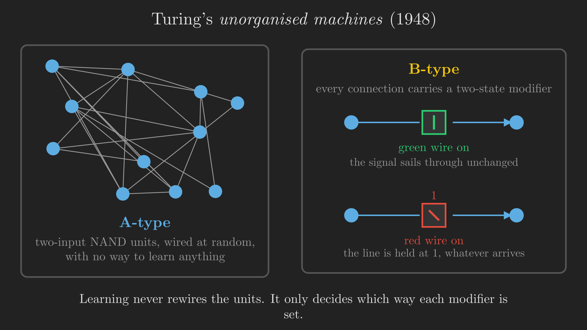{#fig-turing_b_type fig-align="center" width=100%}

Turing's claim was that with enough units, a B-type machine can be trained to do any job a Turing machine can do. This is a connectionist learning proposal, with a training procedure, in 1948, and it went almost entirely unnoticed because the report was not published at the time.
:::

::: {.callout-tip collapse="true"}
## Sidebar: what people mean when they say "connectionist"

Two later attempts to pin down the term are worth recording, because they show what the community eventually decided the essential ingredients were.

**Parallel Distributed Processing** [@rumelhart1986pdp], the two-volume work that defined the 1980s revival, lists eight requirements for a PDP system (here in the form quoted by @medler1998brief):

1. A set of processing units.
2. A state of activation.
3. An output function for each unit.
4. A pattern of connectivity among units.
5. A propagation rule for propagating patterns of activity through the network of connectivities.
6. An activation rule for combining the inputs impinging on a unit with the unit's current state, to produce a new activation level.
7. A learning rule whereby patterns of connectivity are modified by experience.
8. An environment within which the system must operate.

**Bechtel and Abrahamsen** [@bechtel1991connectionism] compress this to four:

1. The connectivity of units.
2. The activation function of units.
3. The nature of the learning procedure that modifies the connections between units.
4. How the network is interpreted semantically.

Compare either list against a modern network and you will find that only the last item on Bechtel and Abrahamsen's list is still genuinely open.
:::

:::: {.callout-important collapse="true"}
## Poll 1: check yourself

**Q1.** Who is the first person to propose connectionism?

(a) Aristotle  (b) Alexander Bain  (c) David Hartley  (d) Alan Turing

**Q2.** Roughly how many connections exist between neurons in the brain?

(a) 1 million  (b) 5 billion  (c) 80 billion  (d) 100 trillion

::: {.callout-note collapse="true"}
## Answers

**A1: (b) Alexander Bain**, in 1873. Hartley (1749) is the tempting wrong answer, and he genuinely did propose a physical substrate for memory, but he did not know about neurons and did not locate information in connections between them. Turing's connectionist work is real but comes 75 years after Bain.

**A2: (d) 100 trillion.** Option (c), 80 billion, is the approximate *neuron* count, not the connection count. That distinction is the whole point of connectionism: the neurons are not where the capacity is.
:::
::::

Let us take stock. We have a hypothesis about the architecture: a network of simple elements, with everything stored in the wiring. We have not said one word about what the elements actually are. That is the next question.

# The unit

To work out what a computational element should look like, we go back to the thing we are copying.

## A real neuron, briefly

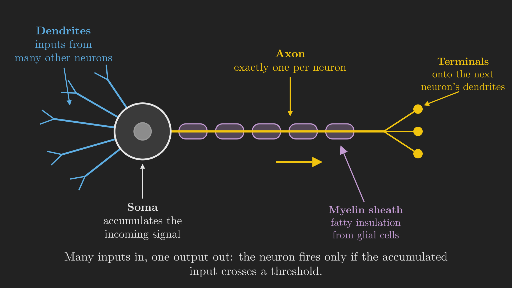{#fig-neuron_anatomy fig-align="center" width=100%}

Signals arrive through the **dendrites**, the many branching fibres on the input side, and accumulate in the **soma**, the cell body. If the accumulated signal is large enough, the neuron fires, and the resulting pulse travels out along the **axon**. The axon is wrapped in a **myelin sheath**, a fatty insulator formed by glial cells, which is what lets the pulse travel quickly, and it terminates in structures that connect onto the dendrites of other neurons.

Three details from @fig-neuron_anatomy matter for the rest of this post.

1. **Many inputs, one output.** A neuron has many dendrites but exactly one axon. Whatever it computes, it computes a single value and broadcasts it.
2. **Firing is thresholded.** Strictly, the outgoing signal is a pulse train whose frequency depends on the accumulated input. But an equivalent and far more convenient view is that if the accumulated input exceeds a threshold, the neuron fires.
3. **The interesting variation is in the connections.** Not in the cells.

There is a nice aside on the myelin. Someone did once take a piece of Einstein's brain and run the tests, and the finding was that he had about as many neurons as anyone else. What he had more of was glial cells: more fat in his head. Whatever you make of a sample size of one, being a fat head appears not to be an insult.

## McCulloch and Pitts, 1943

The first mathematical model of a neuron came from an unlikely pair. **Warren McCulloch** was a neurophysiologist at the University of Chicago. **Walter Pitts** was a homeless, self-taught logician who had turned up at his door. Together they wrote *A Logical Calculus of the Ideas Immanent in Nervous Activity* [@mcculloch1943logical], one of the foundational papers of the field. Pitts was twenty years old.

The paper is famously hard to read, and the lecture is candid about this. What it proposes, though, is clean: model the neurons of the brain, and the brain itself, as performing **propositional logic**, with each neuron evaluating the truth value of its input propositions. In effect, Boolean logic.

The model gives each neuron two kinds of incoming connection.

- An **excitatory synapse** transmits a weighted input to the neuron. These accumulate, and if the total exceeds the threshold, the neuron fires.
- An **inhibitory synapse** is not a negative weight. It is a veto. In the paper's own words, the activity of any inhibitory synapse *absolutely prevents* excitation of the neuron at that time, regardless of every other input.

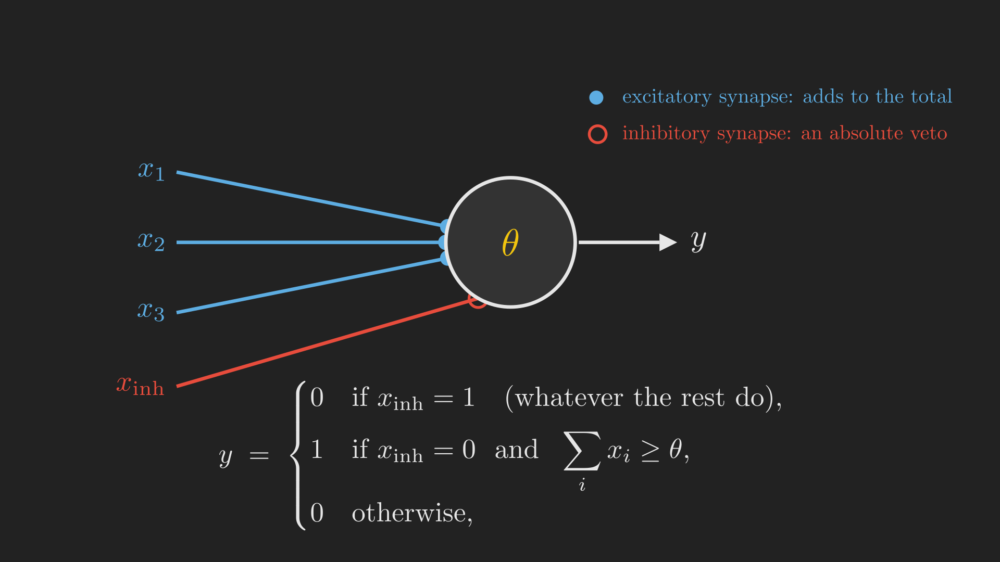{#fig-mcculloch_pitts_unit fig-align="center" width=100%}

Writing the rule out, with excitatory inputs $x_1, x_2, \dots, x_d \in \{0, 1\}$, a threshold $\theta$, and an inhibitory input $x_{\text{inh}} \in \{0, 1\}$:

$$
y =
\begin{cases}
0 & \text{if } x_{\text{inh}} = 1,\\
1 & \text{if } x_{\text{inh}} = 0 \text{ and } \sum_{i=1}^{d} x_i \geq \theta,\\
0 & \text{otherwise}.
\end{cases}
$$ {#eq-mcculloch_pitts}

That absolute veto in the first line of @eq-mcculloch_pitts is what distinguishes @eq-mcculloch_pitts from everything that comes later. Modern units have no such thing: a strongly negative weight can always be outvoted by enough positive input. In the 1943 model it cannot.

## Gates out of neurons

With @eq-mcculloch_pitts you can build logic gates, and the paper does. In its own convention, every neuron fires exactly when it receives **two** excitatory endings and **no** inhibitory ones, and you build different gates by choosing how many endings each source lands on its target.

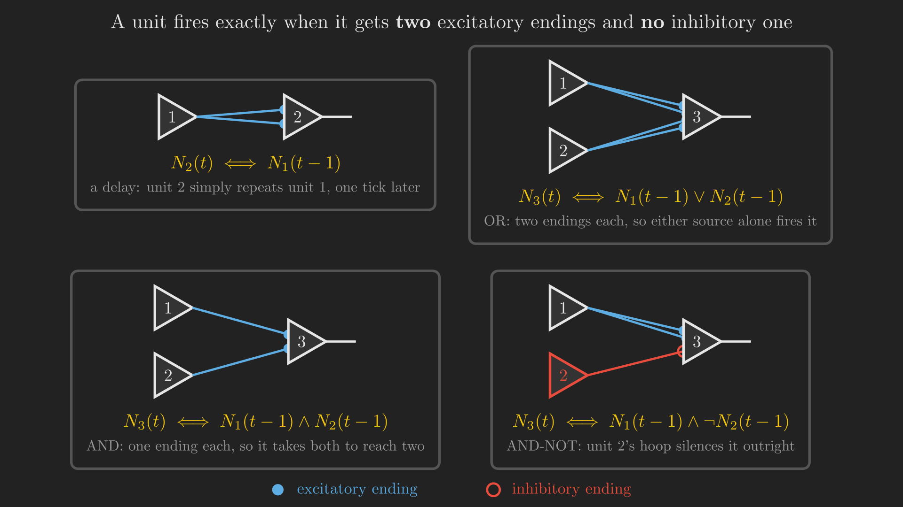{#fig-mcculloch_pitts_gates fig-align="center" width=100%}

Read @fig-mcculloch_pitts_gates one panel at a time.

- **Delay.** Neuron 1 sends *two* endings to neuron 2. One source is therefore enough, and neuron 2 simply repeats neuron 1 one tick later: $N_2(t) \iff N_1(t-1)$.
- **OR.** Neurons 1 and 2 each send two endings to neuron 3. Either source alone reaches the threshold of two, so $N_3(t) \iff N_1(t-1) \vee N_2(t-1)$.
- **AND.** Neurons 1 and 2 each send *one* ending. Now it takes both of them to reach two: $N_3(t) \iff N_1(t-1) \wedge N_2(t-1)$.
- **AND-NOT.** Neuron 1 sends two endings, and neuron 2 sends an inhibitory hoop. Neuron 1 alone is enough, unless neuron 2 fires, in which case nothing is: $N_3(t) \iff N_1(t-1) \wedge \neg N_2(t-1)$.

Notice that every one of these formulas relates the output at time $t$ to the inputs at time $t-1$. Each unit costs one tick. That is not incidental bookkeeping; it is what makes the next construction possible.

## An illusion, built from six units

Here is the part of the 1943 paper that convinces people it is not a toy.

Touch something very cold, very briefly, and your first sensation is one of *heat*. You have to keep your finger on it for a moment before the cold registers. This is a real and slightly disconcerting perceptual quirk, and McCulloch and Pitts showed that a small network of their units reproduces it exactly.

The circuit needs six units: a heat receptor, a cold receptor, a delay unit, a unit that the cold receptor can veto, and the two sensations. The wiring is:

- The cold receptor sends two endings to the **delay** unit, so the delay unit reports "cold, one tick ago".
- The cold receptor and the delay unit each send *one* ending to **cold sensation**, so cold sensation fires only when those two are firing at the same tick, which means cold now *and* cold a tick ago. Cold has to persist to register as cold.
- The delay unit sends two endings to the **vetoable** unit, and the cold receptor sends it an inhibitory hoop. So that unit fires when there was cold, and then it stopped: it is a detector for cold that has just ended.
- The heat receptor sends two endings to **heat sensation**, and so does the vetoable unit. Either route fires the heat sensation.

@fig-heat_illusion steps that circuit through both cases, one tick at a time.

::: {#fig-heat_illusion}


The heat illusion, stepped one tick at a time. Brief cold reaches the heat sensation; sustained cold vetoes that path and reaches the cold sensation instead. The firing pattern shown is simulated from the wiring rather than authored by hand.
:::

For a **brief** touch of cold, present at $t = 1$ only: the cold receptor fires at $t=1$, and the delay unit fires at $t = 2$. Those two are never firing at the same tick, so cold sensation never fires at all. Meanwhile the vetoable unit sees the delay unit firing at $t=2$ with no cold to veto it, and fires at $t=3$, which fires the heat sensation at $t=4$. **Brief cold feels hot.**

For **sustained** cold, on from $t = 1$ onwards: the cold receptor fires at every tick and the delay unit fires from $t = 2$, so from $t=2$ they *are* firing together, and cold sensation fires from $t = 3$. The vetoable unit, meanwhile, is silenced at every tick, because the cold receptor's hoop is active every tick. **Sustained cold feels cold, and the heat path never opens at all.**

The only difference between the two runs is how long the finger stayed. The circuit turns a difference in *duration* into a difference in *quality of sensation*. That is not a small thing for a model published in 1943.

## What else the model claimed, and what it lacked

Since any Boolean gate can be built (@fig-mcculloch_pitts_gates), any Boolean function can be composed out of them. McCulloch and Pitts also pointed out that networks containing **loops** can remember: a signal that circulates in a closed cycle is a stored bit. Lawrence Kubie had suggested as early as 1930 that closed loops in the central nervous system might be the mechanism of memory [@kubie1930theoretical]. We will come back to loops much later in the series, when we get to recurrent networks.

The paper attracted two serious criticisms, and the second is the one that matters here.

1. **They claimed more than they proved.** They said their nets could compute a small class of functions, and that if a tape were provided they would be equivalent to Turing machines, which is to say Turing complete. This is broadly right, but they did not prove it themselves.
2. **They gave no learning mechanism.** And this is the real gap. @eq-mcculloch_pitts tells you exactly how a network with the right thresholds and the right wiring will behave. It says nothing whatsoever about how the right thresholds and the right wiring would ever come to exist. Every connection is assumed, by some unspecified process, to already be correct.

Which brings us to the obvious question. If all the knowledge is in the connections, how do the connections get set?

# How a unit learns

The first concrete answer came from **Donald Hebb**, who arrived at neuroscience by an unusually indirect route. Before settling on a PhD, he had tried being a novelist, a farmer, a hobo and a schoolteacher. In 1949 he published *The Organization of Behavior* [@hebb1949organization], and in it a proposal that is now quoted in every textbook in the field:

> When an axon of cell A is near enough to excite a cell B and repeatedly or persistently takes part in firing it, some growth process or metabolic change takes place in one or both cells such that A's efficiency, as one of the cells firing B, is increased.

Which is usually compressed to: **neurons that fire together wire together.**

## The physical picture

Two neurons do not touch. The axon of the first ends in a bulb, sitting a small distance from the dendrite of the second. When a signal arrives at the bulb, chemicals are released across the gap, exciting the second cell. Hebb's proposal is about that bulb: every time an excitation of the first neuron successfully takes part in firing the second, the bulb grows slightly, and the connection strengthens.

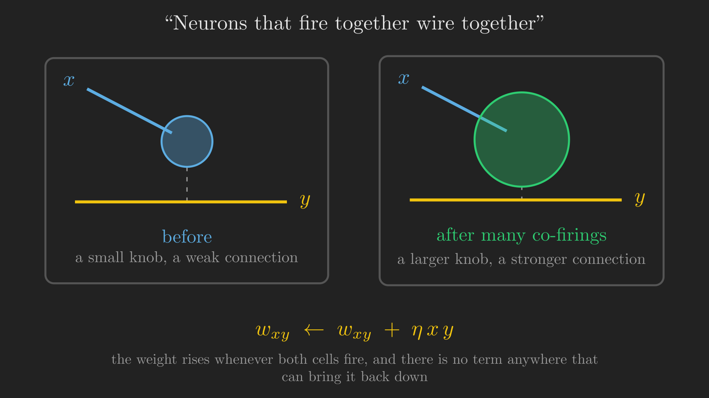{#fig-synaptic_knob fig-align="center" width=90%}

It is worth flagging one thing that @fig-synaptic_knob glosses over, and that the lecture flags too. Neuron B is not responding only to neuron A; it has an entire population of inputs. How, mechanistically, does the synapse from A "know" that it was one of the ones that helped? The honest answer is that the details are still debated. The rule is a model, and a good one, not a settled account.

## The rule as mathematics

Write $x$ for the firing of the input neuron and $y$ for the firing of the output neuron, both in $\{0, 1\}$, and $w_{xy}$ for the strength of the connection between them. Hebb's rule is

$$
w_{xy} \leftarrow w_{xy} + \eta\, x\, y,
$$ {#eq-hebb}

where $\eta > 0$ is a small learning rate. If both fire, the product $xy$ is 1 and the weight grows a little. If either is silent, the product is 0 and nothing happens.

::: {#alg-hebbian_learning}
<pre class="pseudocode">
\begin{algorithm}
\caption{Hebbian learning}
\begin{algorithmic}
\INPUT Learning rate $\eta > 0$
\OUTPUT Connection weights $w_{xy}$
\STATE Initialize $w_{xy} \leftarrow 0$ for every connected pair $(x, y)$
\WHILE{the network is receiving input}
    \STATE Observe the firing pattern of every neuron
    \FOR{every connected pair $(x, y)$}
        \STATE $w_{xy} \leftarrow w_{xy} + \eta\, x\, y$
    \ENDFOR
\ENDWHILE
\end{algorithmic}
\end{algorithm}
</pre>
:::

@eq-hebb is, without exaggeration, the great-grandparent of nearly every learning rule in machine learning. Even gradient descent, which we will spend a great deal of this series on, is recognisably a variant of it.

## Why it does not work on its own

Look hard at @alg-hebbian_learning and something should bother you. There is no line anywhere in it that makes a weight smaller.

Every co-firing adds. Nothing ever subtracts. And a stronger connection is more likely to succeed in firing its target, which produces more co-firing, which makes it stronger still. Weights grow without bound until they hit whatever physical ceiling exists, and then they sit there.

::: {#fig-hebbian_instability}


Three connections into one neuron, co-firing at three different rates. Early on the weights carry real information about which input matters. By the end they are identical, because they have all saturated, and the network has forgotten everything it appeared to be learning.
:::

@fig-hebbian_instability is the failure in one picture. At the start, the three weights are informative: the frequently co-firing input has the largest weight, the rare one the smallest. That ordering is exactly what we wanted the network to learn. But since nothing ever decreases, the frequent connection reaches the ceiling, then the occasional one, and eventually even the rare one. At that point all three weights are equal, and the neuron can no longer distinguish its inputs at all. The learning has erased itself.

Stated as a list, Hebbian learning is:

- **Fundamentally unstable.** Stronger connections reinforce themselves.
- **Uncompetitive.** There is no mechanism by which one connection growing costs another connection anything.
- **One-directional.** No reduction in weights is possible.
- **Unbounded.** Learning never converges to anything; it only saturates.

Later work added the missing ingredients. The best known is **Sanger's rule**, also called generalized Hebbian learning [@sanger1989optimal], which distributes an input's contribution across multiple outputs and subtracts off what has already been accounted for:

$$
w_{ij} \leftarrow w_{ij} + \eta\, y_j \left( x_i - \sum_{k \leq j} w_{ik}\, y_k \right).
$$ {#eq-sanger}

The bracketed term in @eq-sanger is the part that Hebb was missing: a quantity that can be negative, so a weight can shrink. Variants like this fixed the stability problem, but none of them satisfied what people actually wanted, for a reason that is easier to see once you have seen the alternative.

:::: {.callout-important collapse="true"}
## Poll 2: check yourself

Hebbian learning is...

(a) fundamentally stable, since stronger connections will enforce themselves
(b) fundamentally unstable, since there is no reduction in weights
(c) fundamentally stable, since learning is unbounded
(d) fundamentally unstable, since weights compete for adjustment

::: {.callout-note collapse="true"}
## Answer

**(b).** Note that (a) and (b) contain the same observation and draw opposite conclusions from it: self-reinforcement is precisely *why* it is unstable, not why it is stable. And (d) is wrong in its reason rather than its verdict: the problem is that weights do *not* compete. Competition is one of the things a repair like @eq-sanger has to add.
:::
::::

Here is the missing ingredient, and it is almost embarrassingly simple. In @eq-hebb, nowhere does the rule refer to what the neuron was *supposed* to output. There is no target. The rule reinforces whatever happens to happen. What if the update depended not on what the neuron did, but on how *wrong* it was?

# Rosenblatt's perceptron

That is the contribution of **Frank Rosenblatt**, a psychologist and logician who in 1958 published *The Perceptron: A Probabilistic Model for Information Storage and Organization in the Brain* [@rosenblatt1958perceptron]. He died young, in a boating accident in 1971.

## The original model, and the model we kept

Rosenblatt's actual proposal is a model of the visual system, and it is considerably richer than what we now call a perceptron. Groups of sensors on the retina (the S-units) combine onto cells in an association area $A_1$; groups of $A_1$ cells combine into a second association area $A_2$; and signals from $A_2$ combine into response cells $R$. Connections may be excitatory or inhibitory. There is even feedback from the response cells back to the association cells, which serves to make the outputs mutually exclusive.

What survived is a simplification of that: sensory units feed association units through a set of *fixed*, prespecified weights, and the association units feed the response units through *learnable* weights. @fig-rosenblatt_architecture puts the two side by side.

```{dot}
//| label: fig-rosenblatt_architecture
//| fig-cap: "Rosenblatt's 1958 model on the left, and the simplification that the field kept on the right. In the simplified version only the last set of weights is learned, which is why a modern 'perceptron' is a single trainable unit."
digraph Rosenblatt {
    bgcolor="transparent"
    rankdir=TB
    compound=true
    node [fontcolor="#e6e6e6", style=filled, color="#e6e6e6", fillcolor="#333333", fontname="Helvetica", shape=box, height=0.42]
    edge [color="#e6e6e6", fontcolor="#e6e6e6", fontname="Helvetica", fontsize=10]
    graph [fontcolor="#e6e6e6", fontname="Helvetica", fontsize=12]

    subgraph cluster_original {
        label="The 1958 model"
        color="#777777"
        fontcolor="#e6e6e6"
        style="dashed"
        S1 [label="S: retinal sensors"]
        A1 [label="A1: association area 1"]
        A2 [label="A2: association area 2"]
        R1 [label="R: response cells", fillcolor="#4a4a2a", color="#f1c40f", fontcolor="#f1c40f"]
        S1 -> A1
        A1 -> A2
        A2 -> R1
        R1 -> A2 [label="  feedback", style=dashed, constraint=false, color="#e74c3c", fontcolor="#e74c3c"]
        R1 -> A1 [label="  feedback", style=dashed, constraint=false, color="#e74c3c", fontcolor="#e74c3c"]
    }

    subgraph cluster_simplified {
        label="What we kept"
        color="#777777"
        fontcolor="#e6e6e6"
        style="dashed"
        S2 [label="S: sensory units"]
        A3 [label="A: association units"]
        R2 [label="R: response units", fillcolor="#4a4a2a", color="#f1c40f", fontcolor="#f1c40f"]
        S2 -> A3 [label="  fixed"]
        A3 -> R2 [label="  learnable", color="#2ecc71", fontcolor="#2ecc71"]
    }
}
```

The simplified unit on the right of @fig-rosenblatt_architecture is what the word "perceptron" now means: a number of inputs combined linearly and compared against a threshold. Electrical engineers know this as **threshold logic**, and it is powerful. With inputs $x_1, \dots, x_N$, weights $w_1, \dots, w_N$ and threshold $T$:

$$
y =
\begin{cases}
1 & \text{if } \displaystyle\sum_{i=1}^{N} w_i x_i - T \geq 0,\\
0 & \text{otherwise}.
\end{cases}
$$ {#eq-perceptron}

Compare @eq-perceptron against the McCulloch-Pitts rule @eq-mcculloch_pitts and two changes stand out. The inputs now carry **weights**, so different inputs can matter different amounts. And there is no absolute veto: inhibition, if you want it, is just a negative weight, which enough excitation can overcome.

## The gates, again

Threshold logic gives you Boolean gates immediately, and this time the weights make it easy to read off.

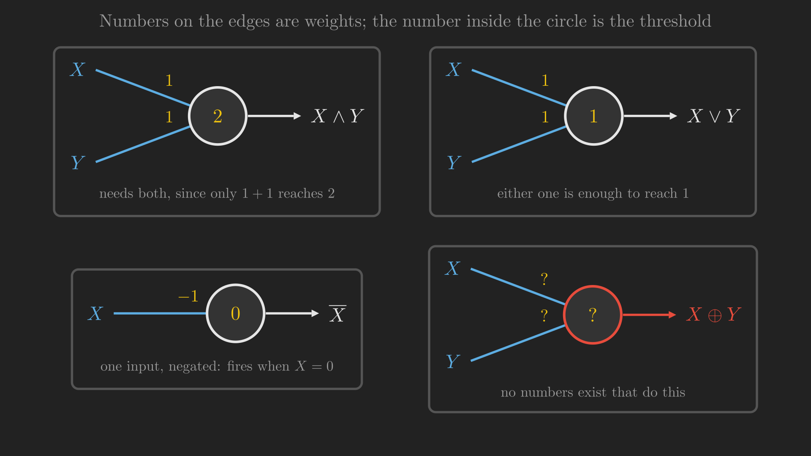{#fig-perceptron_gates fig-align="center" width=100%}

In the language of our storm detector, with $X$ = "flash seen" and $Y$ = "rumble heard":

- **AND** ($X \wedge Y$, "storm confirmed") uses weights $1, 1$ and threshold $2$. Only $1 + 1 = 2$ reaches the threshold, so it takes both sensors.
- **OR** ($X \vee Y$, "something happened") uses the same weights and threshold $1$. Either sensor alone is enough.
- **NOT** ($\overline{X}$, "no flash") uses a single input with weight $-1$ and threshold $0$. When $X = 0$ the sum is $0 \geq 0$ and it fires; when $X = 1$ the sum is $-1 < 0$ and it does not.

Same unit, same rule, three different functions, obtained purely by changing numbers. The fourth panel of @fig-perceptron_gates has question marks in it, and we will get to that shortly.

## The learning rule

Rosenblatt did not just give a model. He gave a rule for setting the weights, and this is where the story turns. Let $d(\vb{x})$ be the desired output for input $\vb{x}$ and $y(\vb{x})$ the output the perceptron actually produces. Then

$$
\vb{w} \leftarrow \vb{w} + \eta \left( d(\vb{x}) - y(\vb{x}) \right) \vb{x}.
$$ {#eq-perceptron_update}

Put @eq-perceptron_update next to @eq-hebb and the difference is a single factor.

:::: {.columns}
::: {.column width="48%"}
**Hebb (1949):**

$$
w_{xy} \leftarrow w_{xy} + \eta\, \underbrace{x\, y}_{\text{input} \times \text{output}}
$$
:::
::: {.column width="4%"}
:::
::: {.column width="48%"}
**Rosenblatt (1958):**

$$
\vb{w} \leftarrow \vb{w} + \eta\, \underbrace{\left( d(\vb{x}) - y(\vb{x}) \right) \vb{x}}_{\text{input} \times \text{error}}
$$
:::
::::

Hebb multiplies the input by the **output**. Rosenblatt multiplies the input by the **error**, the gap between what the unit should have said and what it did say. That one substitution fixes everything that was wrong with @eq-hebb:

- If the perceptron is **right**, then $d(\vb{x}) - y(\vb{x}) = 0$, the whole update term vanishes, and nothing changes. The rule is silent when it has nothing to correct.
- If the perceptron fires when it should not, the error is $-1$ and the weights move *down* along $\vb{x}$. Weights can now decrease, which is exactly what Hebb's rule could never do.
- If it stays silent when it should fire, the error is $+1$ and the weights move up along $\vb{x}$.

Because the update only ever happens on a mistake, the weights stop moving as soon as the unit is correct on everything. There is no runaway. This rule is also known as the **delta rule**, after the error term.

::: {#alg-perceptron_learning}
<pre class="pseudocode">
\begin{algorithm}
\caption{The perceptron learning rule}
\begin{algorithmic}
\INPUT Training pairs $\left(\vb{x}_1, d_1\right), \dots, \left(\vb{x}_n, d_n\right)$ with $d_i \in \{0, 1\}$; learning rate $\eta > 0$
\OUTPUT Weights $\vb{w}$, bias $b$
\STATE Initialize $\vb{w}$ and $b$ arbitrarily
\REPEAT
    \STATE $m \leftarrow 0$
    \FOR{$i = 1$ \TO $n$}
        \STATE $y_i \leftarrow 1$ if $\vb{w}^{\intercal} \vb{x}_i + b \geq 0$, else $0$
        \IF{$y_i \neq d_i$}
            \STATE $\vb{w} \leftarrow \vb{w} + \eta \left(d_i - y_i\right) \vb{x}_i$
            \STATE $b \leftarrow b + \eta \left(d_i - y_i\right)$
            \STATE $m \leftarrow m + 1$
        \ENDIF
    \ENDFOR
\UNTIL{$m = 0$}
\end{algorithmic}
\end{algorithm}
</pre>
:::

And Rosenblatt proved something about @alg-perceptron_learning that nobody had been able to prove about a learning rule before: **if the two classes are linearly separable, the rule converges to a perfect classifier in a finite number of updates.** Not "tends to improve". Converges, provably, in finite time. We will watch it run in @fig-perceptron_learning, once we have the geometric picture that makes "linearly separable" mean something.

## The hype

It is hard to overstate how this was received. The work was funded by the US Navy, and the press coverage in 1958 was extraordinary. The *New York Times* described the perceptron as [@nyt1958perceptron]:

> the embryo of an electronic computer that [the Navy] expects will be able to walk, talk, see, write, reproduce itself and be conscious of its existence.

The *Tulsa Oklahoma Times* went with the headline "Frankenstein Monster Designed by Navy That Thinks".

Underneath the hype was a specific technical error. It is roughly true of Rosenblatt's *full* model that it can represent any Boolean circuit and perform any logic, if you do not ask awkward questions about how large the circuit would need to be. People took that claim and applied it to the *simplified* model, the single threshold unit of @eq-perceptron. And that is false, in a way that is about to become very concrete.

# The wall

Go back to @fig-perceptron_gates and look at the fourth panel. We want a single unit that computes $X \oplus Y$, exclusive or: fire when exactly one of the two sensors fires.

This is not a contrived function. For our storm detector it is the most useful diagnostic there is. If both sensors fire, there is a storm. If neither fires, there is no storm. But if *exactly one* fires, then either you saw lightning with no thunder or heard thunder with no lightning, and something is wrong with your equipment. "Exactly one" is the fault condition, and it is XOR.

We want weights $w_1, w_2$ and a threshold $T$ such that

$$
y = 1 \iff w_1 x_1 + w_2 x_2 \geq T
$$

reproduces the XOR truth table. Write out what each row demands.

::: {.tbl tbl-colwidths="auto"}
| $x_1$ | $x_2$ | $x_1 \oplus x_2$ | What the unit must satisfy |
|:-----:|:-----:|:----------------:|:---|
| 0 | 0 | 0 | $0 < T$ |
| 1 | 0 | 1 | $w_1 \geq T$ |
| 0 | 1 | 1 | $w_2 \geq T$ |
| 1 | 1 | 0 | $w_1 + w_2 < T$ |

: The four constraints XOR places on a single threshold unit. {#tbl-xor_constraints style="width:75%; margin:auto;"}
:::

Now just add them up. From rows two and three of @tbl-xor_constraints, $w_1 \geq T$ and $w_2 \geq T$, so

$$
w_1 + w_2 \geq 2T.
$$

From row one, $T > 0$, so $2T > T$, and therefore

$$
w_1 + w_2 \geq 2T > T.
$$

But row four demands $w_1 + w_2 < T$. The two conclusions contradict each other. **No weights and no threshold exist.** Not "we have not found them yet": they do not exist, and four lines of arithmetic prove it.

This is the wall the first wave of perceptron research ran into. It is customary to credit, or blame, Marvin Minsky and Seymour Papert's 1969 book *Perceptrons* [@minsky1969introduction] for what happened next, and it is worth being precise about what they did and did not say.

::: {.callout-tip collapse="true"}
## Sidebar: what Minsky and Papert actually argued

The popular version of this story is that *Perceptrons* proved neural networks could not compute XOR, everyone believed it, and the field died for fifteen years. That is not quite right on any of the three counts.

What Minsky and Papert did was give a rigorous computational-geometry analysis of what *single-layer* threshold networks can and cannot represent, and what those limits cost in terms of the number and size of the units required. XOR is the smallest example of the limits, not the substance of the argument. The lecture is careful to say that they alluded to the weakness of individual elements rather than explicitly declaring the enterprise dead.

Their own retrospective is the clearest source. In the epilogue added to the expanded 1988 edition, titled "The New Connectionism" [@minsky1988perceptrons], they explain what they were actually after:

> When perceptron-like machines came on the scene, we found that in order to understand their capabilities we needed some new ideas. It was not enough simply to examine the machines themselves or the procedures used to make them learn. Instead, we had to find new ways to understand the problems they would be asked to solve. This is why our book turned out to be concerned less with perceptrons per se than with concepts that could help us see the relation between patterns and the types of parallel-machine architectures that might or might not be able to recognize them.

Their complaint, in other words, was that the field had a machine and no theory of what the machine was for. The 1988 epilogue then goes on to assess *Parallel Distributed Processing* [@rumelhart1986pdp] in the same spirit.

The funding collapse was real, and neural networks did spend a long stretch in the wilderness. But the cause was less a single book than the distance between what the 1958 headlines had promised and what the machines actually delivered. Rigorous criticism arriving on top of unmet expectations is what ends a funding cycle.
:::

So: individual elements are weak computational elements, and networking them is not optional. Which is a strange conclusion to have to reach, because the brain was never one unit. It is a massive interconnection of many simple units, and we knew that from the start. Let us do what the brain does.

# Networking them: universal Boolean machines

XOR is not a half-plane. But it *is* built out of things that are.

$$
X \oplus Y = \underbrace{\left( X \vee Y \right)}_{\text{at least one fired}} \wedge \underbrace{\left( \overline{X} \vee \overline{Y} \right)}_{\text{not both fired}}.
$$ {#eq-xor_decomposition}

Read @eq-xor_decomposition in storm-detector terms: exactly one sensor fired means at least one fired *and* they did not both fire. Both of those clauses are ordinary gates, and we already know how to build ordinary gates from single units. So build one unit for each clause, and feed both into a third unit that ANDs them.

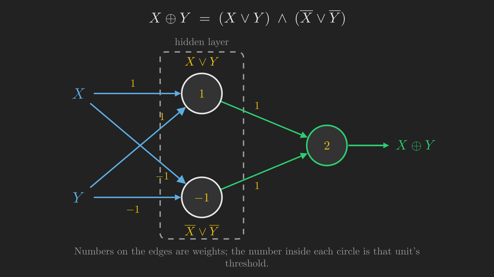{#fig-xor_mlp fig-align="center" width=100%}

Check @fig-xor_mlp by hand, because it takes ten seconds and it is worth the certainty.

- The top hidden unit has weights $1, 1$ and threshold $1$: it fires when $X + Y \geq 1$, which is $X \vee Y$.
- The bottom hidden unit has weights $-1, -1$ and threshold $-1$: it fires when $-X - Y \geq -1$, that is when $X + Y \leq 1$, which is true unless both fired. That is $\overline{X} \vee \overline{Y}$.
- The output unit has weights $1, 1$ and threshold $2$: it fires only when both hidden units fire.

Feed in $X = 1, Y = 1$: top fires, bottom does not, output sees $1 < 2$ and stays silent. Correct. Feed in $X = 1, Y = 0$: both hidden units fire, output sees $2 \geq 2$ and fires. Correct. The wall is gone.

## Hidden layers

The two units in the middle of @fig-xor_mlp deserve a name. We are not interested in their outputs for their own sake; we only care about the final answer. Units in that position are called **hidden units**, and the layer they form is a **hidden layer**.

The name is a little unfortunate. They are not hidden in any deep sense, and you can inspect them whenever you like. They are hidden only in the sense that nobody is asking them for an answer. A network with at least one hidden layer is a **multi-layer perceptron**, or MLP: many layers of perceptrons, each computing its values from the outputs of the layer beneath, with the final unit deriving its output from everything that happened below.

## The general recipe

XOR was one function. The claim we want is much stronger: *any* Boolean function, no matter how complicated, can be computed by an MLP. And the recipe that gets us there is entirely mechanical.

Take any Boolean function of any number of inputs. Write down its truth table. Look at every row where the function outputs 1, and write a conjunction that is true on exactly that row and nowhere else: for each input, use the plain letter if that input is 1 in the row, and the barred letter if it is 0. Then OR all those conjunctions together. This is the **disjunctive normal form**, and every Boolean function has one, because the construction is nothing more than an enumeration of the true rows.

Let us do it on a function that genuinely requires the machinery. Add a third sensor to our detector, a barometer that fires on a sudden pressure drop, and consider the function "exactly two of the three sensors fired". That is the ambiguous case worth flagging: not a clean storm signature, not a clean all-clear.

::: {.tbl tbl-colwidths="auto"}
| $X$ (flash) | $Y$ (rumble) | $Z$ (pressure) | $f$ | Conjunction for this row |
|:---:|:---:|:---:|:---:|:---|
| 0 | 0 | 0 | 0 | |
| 0 | 0 | 1 | 0 | |
| 0 | 1 | 0 | 0 | |
| 0 | 1 | 1 | **1** | $\overline{X} \wedge Y \wedge Z$ |
| 1 | 0 | 0 | 0 | |
| 1 | 0 | 1 | **1** | $X \wedge \overline{Y} \wedge Z$ |
| 1 | 1 | 0 | **1** | $X \wedge Y \wedge \overline{Z}$ |
| 1 | 1 | 1 | 0 | |

: "Exactly two of three" as a truth table. The three true rows give the three conjunctions. {#tbl-two_of_three style="width:80%; margin:auto;"}
:::

So from @tbl-two_of_three,

$$
f(X, Y, Z) = \left( X \wedge Y \wedge \overline{Z} \right) \vee \left( X \wedge \overline{Y} \wedge Z \right) \vee \left( \overline{X} \wedge Y \wedge Z \right).
$$ {#eq-two_of_three}

Before we build it, notice that this function is *not* something a single unit could do, and the proof runs exactly like the XOR one. Suppose weights $w_1, w_2, w_3$ and a threshold $T$ existed. The three firing rows demand

$$
w_1 + w_2 \geq T, \qquad w_1 + w_3 \geq T, \qquad w_2 + w_3 \geq T,
$$

and adding those three gives $2\left(w_1 + w_2 + w_3\right) \geq 3T$. But the row $(1,1,1)$ must stay silent, so $w_1 + w_2 + w_3 < T$, and therefore $2\left(w_1 + w_2 + w_3\right) < 2T$. Putting the two together,

$$
3T \leq 2\left(w_1 + w_2 + w_3\right) < 2T,
$$

which forces $T < 0$. Yet the row $(0,0,0)$ must stay silent too, and that demands $0 < T$. Contradiction. So @eq-two_of_three needs a hidden layer, exactly as XOR did.

Turning @eq-two_of_three into a network is now mechanical. Each conjunction becomes one unit: put weight $+1$ on each plain letter, weight $-1$ on each barred letter, and set the threshold to the number of plain letters. Then one final unit with all weights $1$ and threshold $1$ ORs them.

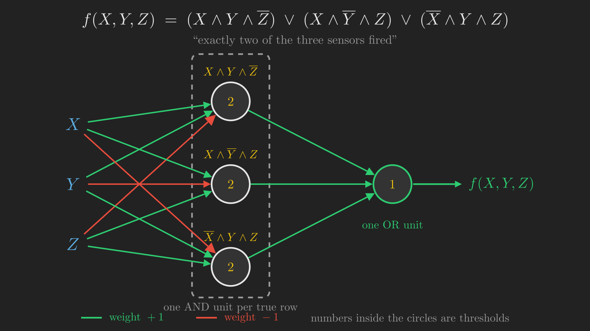{#fig-dnf_two_of_three fig-align="center" width=100%}

Verify the top unit of @fig-dnf_two_of_three: weights $+1, +1, -1$ and threshold $2$ means it fires when $X + Y - Z \geq 2$, which happens only at $X = 1, Y = 1, Z = 0$. That is exactly the conjunction $X \wedge Y \wedge \overline{Z}$ and nothing else.

Nothing in that construction was specific to this function or to three inputs. Every Boolean function has a truth table; every truth table gives a disjunctive normal form; every disjunctive normal form is one layer of AND units under one OR unit. Therefore:

> **MLPs are universal Boolean machines.** Give me any Boolean function, of any number of inputs, and I can build you an MLP that computes it.

Two honest caveats, both of which the lecture flags and defers.

1. **This says nothing about size.** The construction above uses one hidden unit per true row of the truth table, and a function of $d$ inputs has $2^d$ rows, any number of which may be true. For $d = 30$ that is up to a billion hidden units. The claim is that an MLP *exists*, not that it is practical. How the required size depends on the function, and how depth changes the answer, is the subject of the next lecture.
2. **This says nothing about learning.** We built the weights by hand, from a truth table we already had. Nobody has said how you would find them from data.

## Where we are

```{mermaid}
%%| fig-align: center
%%| label: fig-recap_boolean
%%| fig-cap: "Recap: we have the first of the three claims."
flowchart TD
    A["What is in the box?"] --> B["Connectionism"]
    B --> C["McCulloch-Pitts unit"]
    C --> D["Hebb, then Rosenblatt"]
    D --> E["XOR: one unit is not enough"]
    E --> F["The multi-layer perceptron"]
    F --> G["Universal<br/>Boolean machine"]
    F --> H["Universal classifier"]
    F --> I["Universal function<br/>approximator"]

    style G fill:#2ecc71,stroke:#2ecc71,color:#111
    style H fill:#333,stroke:#777,color:#aaa
    style I fill:#333,stroke:#777,color:#aaa
```

One claim down, two to go. But there is a problem with everything so far, and it is a big one: **our brains are not Boolean.** The signal arriving from your eyes is not a truth value; it is an intensity. Nor are our inferences Boolean. We estimate distances and durations and probabilities, not just yes and no.

So we need to handle two generalisations. First, real-valued *inputs* with Boolean outputs. Then real-valued outputs as well. Take them in that order.

# Real inputs: universal classifiers

Here is the good news: the perceptron already handles real-valued inputs, and we do not have to change a thing.

Look again at @eq-perceptron. The rule computes $\sum_i w_i x_i$ and compares it to $T$. Nothing in that expression requires $x_i \in \{0, 1\}$. Feed in the *brightness* of the flash and the *loudness* of the rumble instead of yes-or-no, and the arithmetic is identical. The unit still fires if the weighted input matches or exceeds the threshold.

## Affine, not linear

Before we look at what such a unit computes geometrically, it is worth rewriting it in the form the rest of the field uses. Move the threshold across the inequality by defining a **bias** $b = -T$. Then the firing condition $\sum_i w_i x_i \geq T$ becomes

$$
z = \sum_{i=1}^{N} w_i x_i + b = \vb{w}^{\intercal} \vb{x} + b \geq 0,
$$ {#eq-affine}

and the unit's output is $y = f(z)$ where $f$ is a threshold activation that returns 1 when $z \geq 0$ and 0 otherwise.

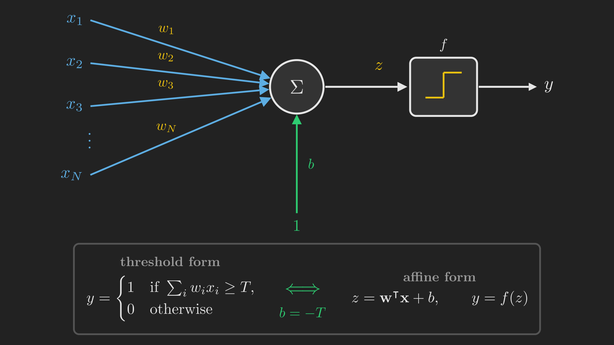{#fig-perceptron_unit fig-align="center" width=100%}

The function $\vb{w}^{\intercal} \vb{x} + b$ in @eq-affine is called an **affine** function of the inputs, and it is worth being careful about the distinction from a *linear* one, since the two words get used loosely.

:::: {.columns}
::: {.column width="48%"}
**Linear:**

$$
\sum_{i=1}^{N} w_i x_i = 0
$$

is a hyperplane that always passes through the origin.
:::
::: {.column width="4%"}
:::
::: {.column width="48%"}
**Affine:**

$$
\sum_{i=1}^{N} w_i x_i + b = 0
$$

is a hyperplane that can sit anywhere.
:::
::::

That constant $b$ is what buys the freedom to place the boundary anywhere, rather than pinning it to the origin, and we are about to need that freedom.

Splitting the unit into an affine part and an activation, as @fig-perceptron_unit does, looks like pure bookkeeping, and for now it is. But it has a consequence worth flagging early: once the unit is "an affine function followed by an activation", the activation becomes a component you can swap out. We will collect on that at the end of the post.

## What a perceptron computes: a hyperplane

Now the geometry. The unit outputs 1 on one side of the surface where $z = 0$, and 0 on the other. That surface, $\vb{w}^{\intercal} \vb{x} + b = 0$, is a **hyperplane**: a line in two dimensions, a plane in three, an $(N-1)$-dimensional surface in $\mathbb{R}^N$.

So a perceptron over real inputs is a **linear classifier**, and the whole of its behaviour is captured by where that hyperplane sits. Its parameters are just the weights (with the bias counted among them).

Which is exactly what makes "linearly separable" concrete, and lets us finally watch @alg-perceptron_learning do its work. Our two sensors now report real numbers, and each storm we have logged is a point in the plane.

::: {#fig-perceptron_learning}


@alg-perceptron_learning running on logged storms. The first few checks are shown one at a time, slowly enough to read: when the unit is already right the update term is zero and the boundary does not move, and when it is wrong the weights take one step along that input and the boundary swings. The remaining checks then run at speed, with nothing new to read, until a full pass produces no mistakes and the algorithm stops.
:::

Two things in @fig-perceptron_learning are worth naming, because they are properties of the algorithm rather than of this particular dataset.

First, **the rule does nothing when it is correct.** That is @eq-perceptron_update doing exactly what it says: when $d(\vb{x}) = y(\vb{x})$, the update term is zero.

Second, **it stops at the first line that works, not the best one.** The algorithm has no notion of a good separator, only of a correct one. It halts the instant a full pass produces no mistakes, so the line you end up with depends on the order the examples arrived in. Any of infinitely many lines would have satisfied it. This is a real limitation, and the search for the *best* separating hyperplane is a different story for a later post.

## Why XOR fails, seen properly

We proved algebraically, from the constraints in @tbl-xor_constraints, that XOR is impossible for one unit. Now we can see it.

The Boolean case is just the real case restricted to the four corners of the unit square. Put $(0,0)$, $(1,0)$, $(0,1)$ and $(1,1)$ in the plane, and each Boolean function is a demand about which corners fall on which side of a line.

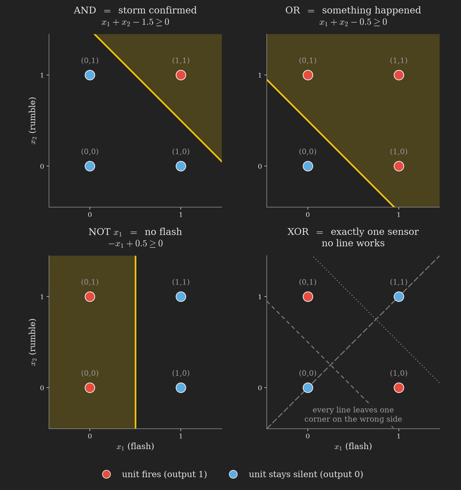{#fig-boolean_gates_unit_square fig-align="center" width=100%}

AND, OR and NOT in @fig-boolean_gates_unit_square are each a matter of sliding one line around. AND needs a line with only $(1,1)$ above it. OR needs one with only $(0,0)$ below it. NOT ignores one axis entirely and splits the square down the middle. Move the boundary, get a different gate.

XOR asks for something a line cannot give. Its two firing corners, $(1,0)$ and $(0,1)$, are *diagonally opposite*, and so are its two silent corners, $(0,0)$ and $(1,1)$. Any straight line you draw leaves one corner on the wrong side. The algebra of @tbl-xor_constraints and the picture of @fig-boolean_gates_unit_square are the same fact in two languages.

## Fencing off a region

Here is where it gets good. If one unit gives us a half-plane, what do several units give us?

Suppose we want a network that fires when the input lands inside a pentagon, and stays silent outside it. Foreshadowing the punchline so the construction is easy to follow: **a convex polygon is nothing but the AND of the half-planes cut by its own sides**, and we already know how to build an AND.

Take five units, one per side of the pentagon, each firing on the polygon's side of its own line. Every point in the plane now carries a number: how many of the five units are firing there. That count is 5 in exactly one place.

::: {#fig-pentagon_construction}


Five half-planes accumulating. Once all five are placed, each region of the plane carries a count of how many units fire there. The count reaches 5 only inside the pentagon, so a sixth unit that thresholds the count at 5 fires there and nowhere else.
:::

The sixth unit in @fig-pentagon_construction takes the five outputs $y_1, \dots, y_5$ with weights all equal to 1, and has threshold 5. It fires precisely when

$$
\sum_{i=1}^{5} y_i \geq 5,
$$ {#eq-pentagon_and}

which, since each $y_i \in \{0,1\}$, means all five are firing at once. That is an AND over five inputs, and @eq-pentagon_and is the whole network.

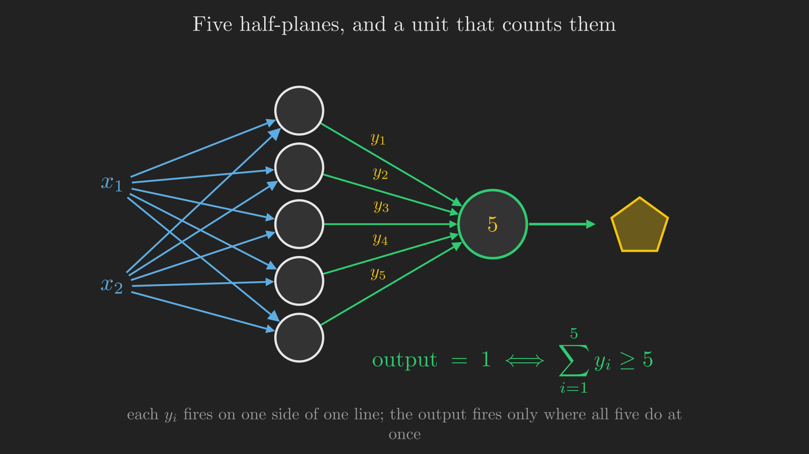{#fig-pentagon_network fig-align="center" width=100%}

Six units total, as @fig-pentagon_network shows, for a shape that no single unit could come close to.

And now it snowballs. Two disjoint pentagons? Build the pentagon subnetwork twice and OR the two outputs with one more unit, which requires a third layer. A region with a curved boundary? A curve is not a polygon, but it can be *approximated* by a union of small polygons as closely as you like, and a union is an OR.

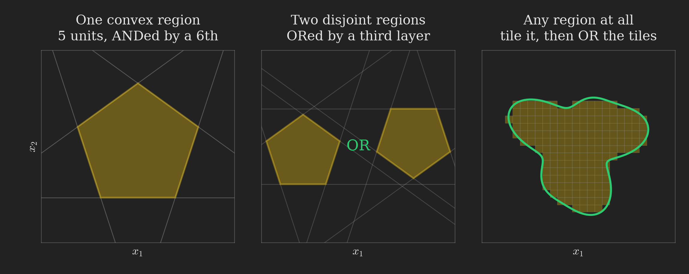{#fig-polytope_composition fig-align="center" width=100%}

The third panel of @fig-polytope_composition is the general case. Chop the region into little polytopes, build each one as an AND of half-planes, and OR the lot. Shrink the polytopes and the approximation improves without limit. There is nothing special about the pentagon; the construction works for any region you can tile, which is to say any region at all, provided you are willing to spend enough units.

## Which gives us the second claim

> **MLPs are universal classifiers.** Give me any decision boundary, and I can build you an MLP that captures it to arbitrary precision.

This is less abstract than it sounds. Classification *is* the problem of finding decision boundaries in high-dimensional space. An MNIST digit is a 28-by-28 greyscale image, which is 784 numbers, so every handwritten digit is a point in $\mathbb{R}^{784}$. Somewhere in that space is the region occupied by images that look like a 2. Building a "2 versus everything else" classifier means capturing the boundary of that region, and we have just shown that an MLP can capture any boundary at all.

As before, the claim is about what is *possible*. It says nothing about how many units the boundary needs, and nothing about how you would find the weights from data rather than by construction.

:::: {.callout-important collapse="true"}
## Poll 3: check yourself

How many threshold-activation perceptrons are needed in an MLP to model a **hexagonal** decision region over a two-dimensional input space?

(a) 6  (b) 7  (c) 12  (d) 13

::: {.callout-note collapse="true"}
## Answer

**(b) 7.** Six units, one per side of the hexagon, each firing on the hexagon's side of its own line. Then a seventh unit with all weights 1 and threshold 6, which fires only where all six are firing at once, exactly as @eq-pentagon_and did with 5.

The tempting wrong answer is (a) 6, from counting the sides and forgetting that something has to combine them. The half-plane units alone produce six separate outputs, not one decision.
:::
::::

## Where we are now

```{mermaid}
%%| fig-align: center
%%| label: fig-recap_classifier
%%| fig-cap: "Recap: two of the three claims are in hand."
flowchart TD
    A["What is in the box?"] --> B["Connectionism"]
    B --> C["McCulloch-Pitts unit"]
    C --> D["Hebb, then Rosenblatt"]
    D --> E["XOR: one unit is not enough"]
    E --> F["The multi-layer perceptron"]
    F --> G["Universal<br/>Boolean machine"]
    F --> H["Universal classifier"]
    F --> I["Universal function<br/>approximator"]

    style G fill:#2ecc71,stroke:#2ecc71,color:#111
    style H fill:#2ecc71,stroke:#2ecc71,color:#111
    style I fill:#333,stroke:#777,color:#aaa
```

We can take real numbers in. But we are still only producing yes or no. Our storm detector can tell you *whether* a storm is coming; it cannot yet tell you that it will arrive in eleven minutes. Can a network of these units compute a continuous-valued function?

# Real outputs: universal approximators

Yes, and the construction is a small delight. Let us do the scalar case, $y = f(x)$ with both $x$ and $y$ real, since everything generalises from there.

## A bump from three units

Take two threshold units. Give each a weight of 1 on the input $x$, and give the first a threshold $T_1$ and the second a threshold $T_2$, with $T_1 < T_2$ (which we may assume without loss of generality, since otherwise we just swap their names). Now sum the two outputs with weights $+1$ and $-1$.

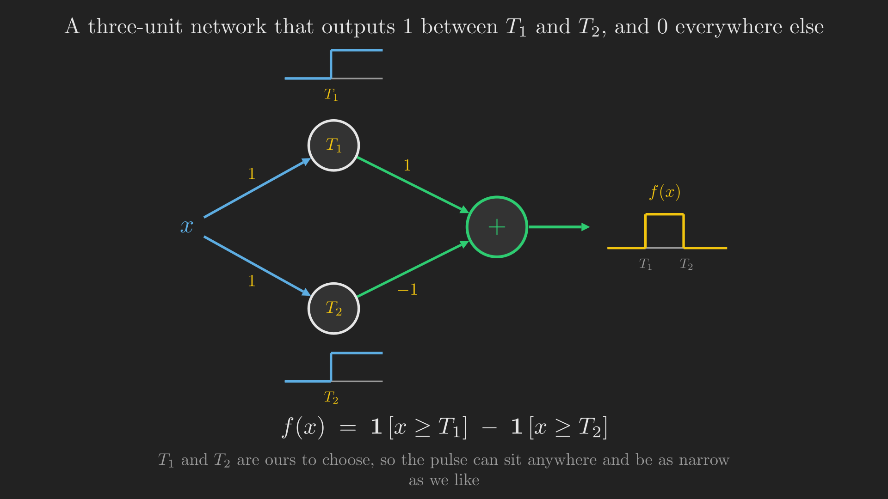{#fig-square_pulse_network fig-align="center" width=100%}

Walk @fig-square_pulse_network across the real line.

- For $x < T_1$: neither unit fires. The sum is $0 - 0 = 0$.
- For $T_1 \leq x < T_2$: the first unit fires, the second does not. The sum is $1 - 0 = 1$.
- For $x \geq T_2$: both fire, and the $+1$ and $-1$ cancel. The sum is $1 - 1 = 0$.

The result is a **square pulse**: height 1 between $T_1$ and $T_2$, and zero everywhere else. Three units. And since $T_1$ and $T_2$ are ours to choose, the pulse can sit anywhere on the line and be as narrow as we like.

## From bumps to anything

Once you can make a bump of any width, anywhere, scaled by any height, you can make anything.

Chop the domain into small intervals. On each interval build one pulse, and scale it by a value representative of the target function there: its average over the interval, or simply its value at the midpoint. Sum them all. What comes out is a staircase that hugs the function, and the accuracy is controlled entirely by how narrow you are willing to make the pulses.

::: {#fig-pulse_stacking}


Pulses stacking into an arbitrary function, then the pulse width halving twice. The worst-case error printed at each stage is measured, not asserted: it falls from 1.165 to 0.298 as the pulses narrow.
:::

The numbers in @fig-pulse_stacking are the point. Nothing about the target function was chosen to be convenient, and no amount of cleverness went into placing the pulses; the width shrank, and the error shrank with it. The relationship is not an accident: halving the width roughly halves how much the function can vary across a single pulse, which is what bounds the error.

One small accounting note. Building each pulse separately would cost two threshold units per pulse, but adjacent pulses share an edge, so $n$ pulses need only $n+1$ threshold units: pulse $k$ is (the step at $T_k$) minus (the step at $T_{k+1}$), and the output unit takes a weighted sum of all the steps. That is why @fig-pulse_stacking reports 33 threshold units for 32 pulses rather than 64.

So we can state the third claim.

> **MLPs are universal function approximators.** Name any function and any error tolerance $\epsilon > 0$, and I can build you an MLP whose output stays within $\epsilon$ of that function everywhere on a bounded domain.

Which finally closes the loop on our running example. Feed the storm detector a barometric pressure reading and it can now answer "eleven minutes", not just "yes". The output stopped being a verdict and became a number.

This generalises to functions of any number of inputs. Instead of one-dimensional pulses you build multi-dimensional ones, using the polytope construction from @fig-polytope_composition to fence off a small cell of the input space, and you assign each cell a height. The bookkeeping is heavier; the argument is identical. The details are for the next lecture.

::: {.callout-tip collapse="true"}
## Sidebar: capacity is not learnability

A question that comes up immediately, and it is a good one. That staircase is not differentiable at any of its edges. Does that not break everything?

No, and understanding why is worth a paragraph, because it clarifies what kind of claim we have actually been making.

Differentiability matters for **learning**. Gradient-based training needs to compute how the error changes as each weight changes, and that requires derivatives to exist. A staircase built from hard thresholds has a derivative of zero almost everywhere and no derivative at all at the edges, so gradient descent would have nothing to work with. This is a real problem, and it is one of the reasons the threshold activation was eventually replaced in practice.

But the claim in this post is about **capacity**: what functions the model is *able to represent*, given the right weights. That is a statement about the set of functions the architecture can express, and it does not care how you would find the weights. We built every network in this post by hand, from a truth table or a geometric picture. Not once did we train anything.

Capacity and learnability are different questions, and this lecture answers only the first. The rest of the series is largely about the second.
:::

## The activation was always a choice

We used the threshold activation throughout, for the good reason that it is the simplest thing to reason about, and everything above is possible with it. But @eq-affine separated the unit into an affine part and an activation part, and once you have done that, the activation is a free choice.

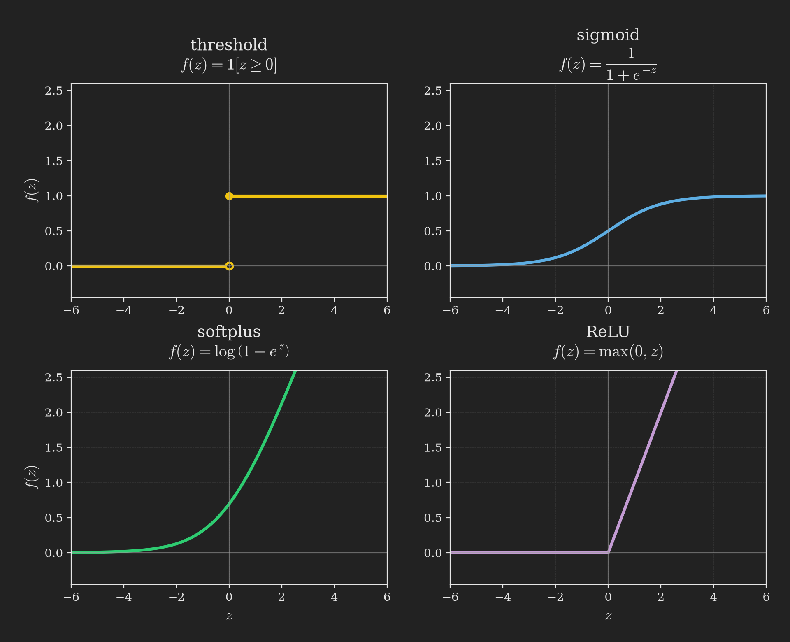{#fig-activation_functions fig-align="center" width=100%}

The **sigmoid** in @fig-activation_functions is a smooth version of the threshold, and being smooth it has derivatives everywhere, which is exactly what the sidebar above says we will need. **Softplus** and the **rectified linear unit** are the two that came to dominate practice. We will spend proper time on all three later in the series.

For now, one demonstration that the choice of activation is not cosmetic.

:::: {.callout-important collapse="true"}
## Poll 4: check yourself

How many neurons with a sinusoidal activation, $y = \sin(z)$, are required to model the scalar function $y = \cos(2x)$ **precisely** (not approximately)?

(a) 3  (b) $\lfloor \pi/2 \rfloor$ or $\lceil \pi/2 \rceil$  (c) infinite  (d) none of the above

::: {.callout-note collapse="true"}
## Answer

**(d) none of the above.** The answer is **one**.

The intuition that says "infinite" is imported from the threshold activation: to build $\cos(2x)$ out of square pulses you would need an unbounded number of them, since the staircase is only ever an approximation. But we are not using square pulses now. A sinusoidal unit computes $y = \sin\left(wx + b\right)$, and

$$
\cos(2x) = \sin\left(2x + \frac{\pi}{2}\right).
$$

So set $w = 2$ and $b = \pi/2$, and a single unit reproduces the target exactly, with zero error.

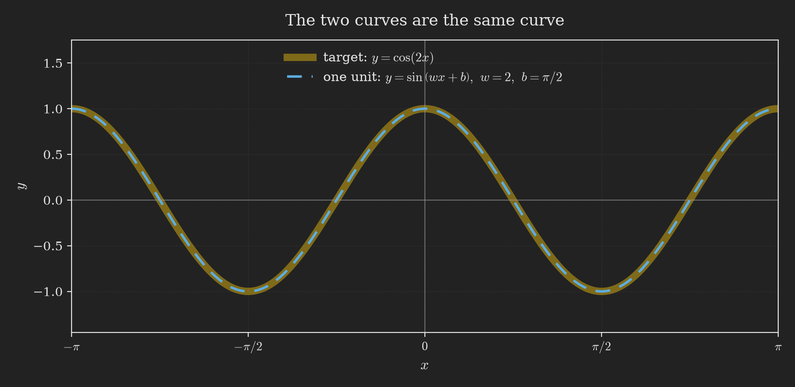{#fig-sinusoid_one_neuron fig-align="center" width=80%}

The lesson is that **how many units you need is a fact about the pairing of activation and target, not about the target alone.** Anything is possible with threshold activations, which is why they are the right choice for proving universality. But entire classes of activation exist that will do particular jobs for a fraction of the cost.
:::
::::

# Closing the loop

We opened with four boxes and one question. Let us go back to them.

Along the way we passed through Plato and Aristotle on association, Hartley's guess at a physical substrate, the discovery that the brain is a network, Bain's claim that the information is in the connections and his sad recantation of it, Turing's unorganised machines, McCulloch and Pitts' threshold unit and its logic and its illusions, Hebb's learning rule and its instability, Rosenblatt's perceptron and its provable convergence and its unfortunate press, the XOR wall, and finally the multi-layer perceptron. And we arrived at three claims.

::: {.tbl tbl-colwidths="auto"}
| Claim | What it means | Built from |
|:---|:---|:---|
| **Universal Boolean machine** | Any Boolean function, of any number of inputs, is computed by some MLP | Truth table $\to$ disjunctive normal form $\to$ ANDs under an OR (@fig-dnf_two_of_three) |
| **Universal classifier** | Any decision boundary is captured by some MLP, to arbitrary precision | Half-planes ANDed into polytopes, polytopes ORed into any region (@fig-polytope_composition) |
| **Universal function approximator** | Any function is approximated by some MLP, to any error you name | Two thresholds make a pulse, pulses tile the domain (@fig-pulse_stacking) |

: The three senses in which an MLP is universal. {#tbl-three_claims style="width:95%; margin:auto;"}
:::

And there is more that we have only gestured at. Allow **loops** in the network, so a unit's output can feed back as an input at the next time step, and the network can remember: Kubie proposed closed loops as the mechanism of memory in the central nervous system in 1930 [@kubie1930theoretical], and modern recurrent networks are that idea made precise. MLPs can also represent **probability distributions**, over integer, real and complex-valued domains, both prior distributions and posteriors conditioned on other variables. And once you can represent a distribution you can sample from it, which is how networks generate images and text and audio from distributions that are complicated or entirely unknown. All of that is later in the series.

So, finally: what is a neural network?

> **A neural network is a function.** Given an input, it computes layer by layer to produce an output. More generally, given one or more inputs, it predicts one or more outputs.

And that is the answer to the question we opened with, because each of the boxes in @fig-black_boxes was a function all along, as @fig-boxes_are_functions relabels them.

```{mermaid}
%%| fig-align: center
%%| label: fig-boxes_are_functions
%%| fig-cap: "The same four tasks. Each box was a function, and a network can be that function."
flowchart LR
    A1["Voice signal"] -->|"f: audio to text"| C1["Transcription"]
    A2["Image"] -->|"f: image to caption"| C2["Text caption"]
    A3["Game state"] -->|"f: state to move"| C3["Next move"]
    A4["Theorem"] -->|"f: statement to proof"| C4["Proof"]
```

Speech recognition is a function from a waveform to a string. Captioning is a function from an image to a sentence. Playing Go is a function from a board position to a move. @tbl-three_claims says that whatever those functions are, an MLP can in principle be them. That is what is in the box.

```{mermaid}
%%| fig-align: center
%%| label: fig-recap_final
%%| fig-cap: "The complete journey."
flowchart TD
    A["What is in the box?"] --> B["Connectionism"]
    B --> C["McCulloch-Pitts unit"]
    C --> D["Hebb, then Rosenblatt"]
    D --> E["XOR: one unit is not enough"]
    E --> F["The multi-layer perceptron"]
    F --> G["Universal<br/>Boolean machine"]
    F --> H["Universal classifier"]
    F --> I["Universal function<br/>approximator"]
    G --> J["The box is an MLP"]
    H --> J
    I --> J

    style G fill:#2ecc71,stroke:#2ecc71,color:#111
    style H fill:#2ecc71,stroke:#2ecc71,color:#111
    style I fill:#2ecc71,stroke:#2ecc71,color:#111
    style J fill:#1f6feb,stroke:#58a6ff,color:#fff
```

# What we have not answered

It would be dishonest to end without listing what this post carefully avoided, because in each case the omission is the subject of a later one.

**How big?** Every universality argument here is an existence proof, and every one of them is profligate. The disjunctive normal form construction wants one hidden unit per true row of the truth table. The polytope construction wants enough polytopes to approximate a curve. The pulse construction wants enough pulses to hit your error target. None of these tells you how the required size actually scales with the difficulty of the function, and that turns out to be where the question of **depth** lives: why deep networks are so much more efficient than wide shallow ones, and by how much. That is the next lecture.

**How do we find the weights?** Every network in this post was built by hand. The only learning rule we have that provably works is @alg-perceptron_learning, which applies to a single unit and only when the classes are linearly separable. How to train a network of many units, with a hidden layer whose targets nobody knows, is the central problem of the field, and it needs the differentiability we set aside in the sidebar above.

**Which activation?** We proved everything with the threshold, and then Poll 4 showed that the threshold can be spectacularly wasteful. Which activation to use, and why the field converged on the ones it did, is a topic of its own.

Next up: neural networks as universal approximators in more depth, and the question of depth in networks.
