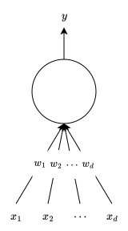
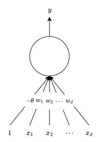
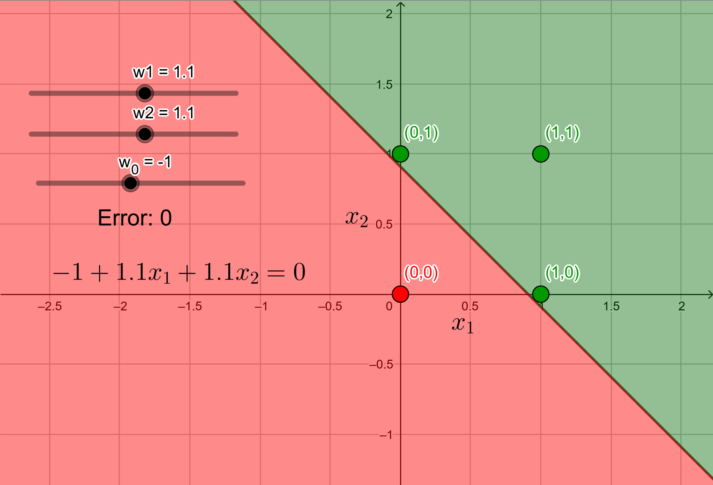
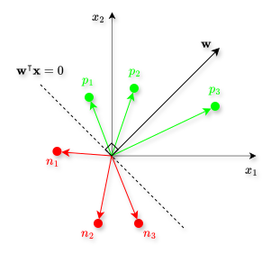
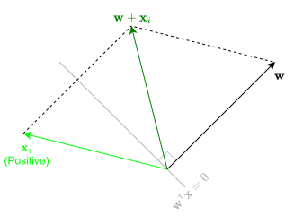
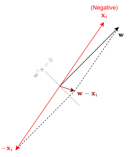
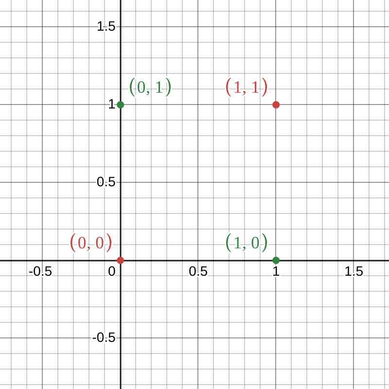

# Introduction

@rosenblatt1958perceptron proposed the classical perceptron model. It is a more general computational model than the McCulloch-Pitts neuron. The main difference is the introduction of numerical weights for inputs that capture their importance, and a mechanism for learning these weights. These inputs are also no longer limited to boolean values.

This classical perceptron was refined and carefully analyzed by @minsky1969introduction. Their model is referred to as the **perceptron**, which we will focus on.

# Working of a Perceptron

Consider that there are $d$ inputs $x_j$ (where $j \in \{1, 2, \dots, d\}$), and each of these inputs has a weight $w_j$ associated with them. @fig-general-perceptron-without-bias shows an illustration.

{#fig-general-perceptron-without-bias fig-align="center" width=30% .invert}

The logic for getting the output is similar to MP neuron:

$$
y = f\left(x_1, \dots, x_d\right) =
\begin{cases}
    1, & \text{if $w_1 x_1 + \cdots + w_d x_d \geq \theta$},\\
    0, & \text{if $w_1 x_1 + \cdots + w_d x_d < \theta$}.
\end{cases}
$$ {#eq-perceptron_equation_first}

However, notice the slight difference in the if conditions as compared to the MP neuron equation. Here, the weights play a role. We can rewrite this equation as

$$
y = f\left(x_1, \dots, x_d\right) =
\begin{cases}
    1, & \text{if $w_1 x_1 + \cdots + w_d x_d - \theta \geq 0$},\\
    0, & \text{if $w_1 x_1 + \cdots + w_d x_d - \theta < 0$}.
\end{cases}
$$ {#eq-perceptron_equation_first2}

A more acceptable convention is to club $\theta$ inside the summation by considering an extra *always-on* input $x_0 = 1$ with the corresponding weight $w_0 = -\theta$. This weight $w_0 = -\theta$ is called the **bias**. So, the general perceptron includes an extra input $x_0 = 1$ (always-on), whose weight is the bias $-\theta$. @fig-general-perceptron shows an illustration of the general perceptron.

{#fig-general-perceptron fig-align="center" width=40% .invert}

So, the perceptron equation becomes:

$$
y = f\left(x_0, x_1, \dots, x_d\right) =
\begin{cases}
    1, & \text{if $\sum_{j=0}^{d} w_j x_j \geq 0$},\\
    0, & \text{if $\sum_{j=0}^{d} w_j x_j < 0$}.
\end{cases}
$$ {#eq-perceptron_equation}

We can club all the inputs $x_j$ inside a single column vector $\mathbf{x}$ called the **input vector**, and club all the weights $w_j$ inside a single column vector $\mathbf{w}$ called the **weight vector**. This helps us rewrite @eq-perceptron_equation more succinctly using the transpose notation. In other words, using

$$
\sum_{j=0}^{d} w_j x_j =
\begin{bmatrix}
    w_1 & w_2 & \cdots & w_d
    \end{bmatrix}
    \begin{bmatrix}
    x_1\\
    x_2\\
    \vdots\\
    x_d
\end{bmatrix}
= \mathbf{w}^{\intercal}\mathbf{x},
$$

we can rewrite @eq-perceptron_equation as

$$
y = f (\mathbf{x}) =
\begin{cases}
    1, & \text{if $\mathbf{w}^{\intercal}\mathbf{x} \geq 0$},\\
    0, & \text{if $\mathbf{w}^{\intercal}\mathbf{x} < 0$}.
\end{cases}
$$ {#eq-perceptron_equation_transpose_notation}

So, @eq-perceptron_equation_first, @eq-perceptron_equation_first2, @eq-perceptron_equation, and @eq-perceptron_equation_transpose_notation are one and the same. They are all perceptron equations. Also, notice that $\mathbf{w}^{\intercal} \mathbf{x}$ is just the *dot product* of the vectors $\mathbf{w}$ and $\mathbf{x}$.

# Significance of Weights

The weights help us encode the importance of features. To understand this, consider a binary classification problem in which we want to predict whether a particular person will like a movie or not. For this, we will be given the data (also known as the training data) containing movies and their features along with a binary output variable indicating whether the person liked that movie or not. Say there are the following three binary features:

$$
\begin{align*}
  x_1 &= \texttt{isActorDamon}\\
  x_2 &= \texttt{isGenreThriller}\\
  x_3 &= \texttt{isDirectorNolan}
\end{align*}
$$

The binary output variable, obviously, is the following:

$$
\begin{align*}
  y = \texttt{didPersonLikeMovie}
\end{align*}
$$

Now, consider that this person is a Nolan fan, i.e., the person likes all movies directed by Nolan irrespective of the actor and the genre. If this is the case, then for the perceptron to be able to predict that this person will definitely like a movie directed by Nolan, it will need the value of $w_3$ to be high so that the sum in the if condition crosses $\theta$ (see @eq-perceptron_equation_first) even if the actor is not Damon (i.e., $\texttt{isActorDamon} = 0$) and the genre is not thriller (i.e., $\texttt{isGenreThriller} = 0$). In other words, the input $x_3 = \texttt{isDirectorNolan}$ needs to have a significantly higher importance as compared to the remaining inputs. This is how weights help us encode the importance of features.

# Significance of Bias

The bias helps us encode the prior or the prejudice. Let us understand this. Recall that in the perceptron equation (@eq-perceptron_equation), $w_0$ is called the bias as it represents the prior (or the prejudice). We can represent this equation in a simpler and more understandable format by substituting $w_0 = -\theta$ and $x_0 = 1$. Doing this, @eq-perceptron_equation becomes:

$$
y = f\left(x_1, \dots, x_d\right) =
\begin{cases}
    1, & \text{if $-\theta + w_1 x_1 + \cdots + w_d x_d \geq 0$},\\
    0, & \text{if $-\theta + w_1 x_1 + \cdots + w_d x_d < 0$}.
\end{cases}
$$ {#eq-perceptron_equation_bias_simplified}

So, a higher value of the threshold $\theta$ (or a high negative value of the bias $w_0 = -\theta$) means that the remaining summation of $w_1 x_1 + \cdots + w_d x_d$ will have to at least be equal to this high number so that the output is $1$. Again, consider the same movie example. @eq-perceptron_equation_bias_simplified for this example becomes

$$
y = f\left(x_1, \dots, x_d\right) =
\begin{cases}
    1, & \text{if $-\theta + w_1 x_1 + w_2 x_2 + w_3 x_3 \geq 0$},\\
    0, & \text{if $-\theta + w_1 x_1 + w_2 x_2 + w_3 x_3 < 0$}.
\end{cases}
$$

A person who likes all kinds of movies very easily will have a very low value of this threshold $\theta$. So, a perceptron trained on this person will learn a low value for $\theta$. In the simplified setup of this example, we may get $\theta = 0$ for this person. On the other hand, for a selective viewer who only likes thrillers starring Damon that are directed by Nolan, the threshold will be very high such that the prediction is $1$ only if all the three inputs are $1$. This is how the bias helps us encode the prior or the prejudice.

# Perceptron vs. McCulloch-Pitts Neuron

The McCulloch-Pitts (MP) neuron is the following:

$$
y =
\begin{cases}
1, & \text{if $\sum_{j=0}^{d} x_j \geq 0$},\\
0, & \text{if $\sum_{j=0}^{d} x_j < 0$}.
\end{cases}
$$

Whereas the perceptron equation is the following:

$$
y =
\begin{cases}
    1, & \text{if $\mathbf{w}^{\intercal} \mathbf{x} \geq 0$},\\
    0, & \text{if $\mathbf{w}^{\intercal} \mathbf{x} < 0$},
\end{cases}
=
\begin{cases}
    1, & \text{if $\sum_{j=0}^{d} w_j x_j \geq 0$},\\
    0, & \text{if $\sum_{j=0}^{d} w_j x_j < 0$}.
\end{cases}
$$

So, it is clear that just like in the case of MP neuron, the perceptron also separates the input space into two halves using a linear boundary whose equation is given by

$$
\mathbf{w}^{\intercal} \mathbf{x} = 0,
$$ {#eq-perceptron_boundary}

or

$$
w_1 x_1 + w_2 x_2 + \cdots + w_d x_d = 0.
$$ {#eq-perceptron_boundary2}

All the inputs that have an output of $1$ are on one side, and all the inputs that have an output of $0$ are on the other side. In other words, a single perceptron can only be used to implement linearly separable functions. The difference from MP neuron is the introduction of weights $w_j$ that can be learned, and that the inputs can be real valued.

Let us first revisit the OR function and see the boundary given by a perceptron. @tbl-or shows this function along with the perceptron equation for each input.

| $x_1$ | $x_2$ | OR  | Perceptron Equation                          |
|:-------:|:-------:|:---:|:--------------------------------------------:|
| $0$   | $0$   | $0$ | $w_0 + w_1 x_1 + w_2 x_2 < 0$             |
| $1$   | $0$   | $1$ | $w_0 + w_1 x_1 + w_2 x_2 \geq 0$          |
| $0$   | $1$   | $1$ | $w_0 + w_1 x_1 + w_2 x_2 \geq 0$          |
| $1$   | $1$   | $1$ | $w_0 + w_1 x_1 + w_2 x_2 \geq 0$          |

: The OR function for two inputs with the perceptron equation for each input. {#tbl-or style="width:50%; margin:auto;"}

After substituting the inputs, the four equations result in the following four inequalities:

$$
\begin{align*}
  w_0 + \left(w_1 \times 0\right) + \left(w_2 \times 0\right) &< 0,\\
  w_0 + \left(w_1 \times 0\right) + \left(w_2 \times 1\right) &\geq 0,\\
  w_0 + \left(w_1 \times 1\right) + \left(w_2 \times 0\right) &\geq 0,\\
  w_0 + \left(w_1 \times 1\right) + \left(w_2 \times 1\right) &\geq 0.
\end{align*}
$$

Solving these simultaneously, we get

$$
\begin{align*}
  w_0 &< 0,\\
  w_2 &\geq -w_0,\\
  w_1 &\geq -w_0,\\
  w_1 + w_2 &\geq -w_0.
\end{align*}
$$

This set of inequalities has infinite possible solutions, i.e., there are infinite combinations of the values of $w_0$, $w_1$, and $w_2$ that satisfy all the four above inequalities simultaneously. One particular solution is $w_0 = -1$, $w_1 = 1.1$, and $w_2 = 1.1$. So, the linear boundary we get using this solution, i.e., by substituting these values of $w_j$'s in @eq-perceptron_boundary2, is

$$
-1 + 1.1 x_1 + 1.1 x_2 = 0.
$$ {#eq-or_function_perceptron_boundary}

@fig-perceptron_or shows this boundary along with the input points and their output.

{#fig-perceptron_or fig-align="center" width=60% .invert}

The green region is the positive half-space of the boundary with green points indicating points with $y=1$, and the red region is the negative half-space of the boundary with red points indicating points with $y=0$. As mentioned before, there are infinite possible solutions, i.e., infinite linear boundaries that separate the red and the green points are possible. This is quite evident from the space between the red and the green points in this figure. We could have done the same for an MP neuron. The only difference would have been that we wouldn't have had $w_1$ and $w_2$, and would have had $\theta$ in place of $w_0$ which would have been the only parameter in the equation.

# Perceptron Learning Algorithm

So far, we have randomly selected the values of the weights that solve the inequalities given by the perceptron equation simultaneously. "Solving the inequalities" basically means finding the correct linear boundary such that all the inputs with output $1$ are on it or in its positive half-space, and all the inputs with output $0$ are in its negative half-space. In other words, there is no misclassified input (or no errors), and the output given by the actual function (which was the OR function in the previous example) matches exactly with the perceptron output. However, we need a more principled approach to find the value of these weights such that it creates a linear boundary without any error (or misclassifications). To reiterate, we are considering the number of misclassifications as the error. If there is one misclassified point, e.g., a point whose output given by the true function is $1$ but the output given by perceptron is $0$ (or vice versa), the error is $1$. So, we can think of error as a function of the weights. Changing the weights will change the linear boundary, which in turn can change the error.

Now, let us reconsider the problem of deciding whether a person will like a movie or not. Suppose we are given a list of $N$ movies and a label (class) associated with each movie telling us whether the person liked the movie or not. Further, suppose we represent each movie with $d$ features, some of which are boolean and some are real. For instance, say we have the following features:

$$
\begin{align*}
    x_1 &= \texttt{isActorDamon}\\
    x_2 &= \texttt{isGenreThriller}\\
    x_3 &= \texttt{isDirectorNolan}\\
    x_4 &= \texttt{IMDBRating}\\
    \vdots\\
    x_d &= \texttt{criticsRating}\\
\end{align*}
$$

Assuming that this data of $N$ movies with the above $d$ features is linearly separable, we want a perceptron to give us the equation of (or learn) the decision boundary. In other words, we want the perceptron to find, or **learn**, the values of the weights $w_0$, $w_1$, $\dots$, $w_d$ from the given data so that we can draw the decision boundary using @eq-perceptron_boundary. We will represent all the input features of some $i$-th movie (where $i \in \{1, 2, \dots, N\}$) inside a single input vector $\mathbf{x}_i$. Recall that all the weights are clubbed inside a single weight vector $\mathbf{w}$. Notice that the input vectors are different for each movie, hence the index $i$. However, the weight vector for all the movies is the same, hence no index for $\mathbf{w}$.

## Pseudocode

The perceptron learning algorithm pseudocode is shown below:

<!-- $$
\begin{aligned}
&(1)~\textbf{Input: } \left\{\left(\mathbf{x}_i, y_i\right)\right\}_{i=1}^n \text{, where } y_i \in \{0, 1\} \\\\
&(2)~\textbf{Initialize: } \mathbf{w} \sim \text{random} \\\\
&(3)~\textbf{Define: } \mathcal{P} \gets \left\{ \mathbf{x}_i \mid y_i = 1 \right\},\quad \mathcal{N} \gets \left\{ \mathbf{x}_i \mid y_i = 0 \right\} \\\\
&(4)~\textbf{Repeat until convergence:} \\\\
&(5)~\quad \text{Pick } \mathbf{x}_i \in \mathcal{P} \cup \mathcal{N} \text{ at random} \\\\
&(6)~\quad \text{If } \mathbf{x}_i \in \mathcal{P} \text{ and } \mathbf{w}^{\intercal} \mathbf{x}_i < 0 \\\\
&(7)~\qquad \mathbf{w} \gets \mathbf{w} + \mathbf{x}_i \\\\
&(8)~\quad \text{If } \mathbf{x}_i \in \mathcal{N} \text{ and } \mathbf{w}^{\intercal} \mathbf{x}_i \geq 0 \\\\
&(9)~\qquad \mathbf{w} \gets \mathbf{w} - \mathbf{x}_i
\end{aligned}
$$ -->

::: {#alg-perceptron}
<pre class="pseudocode">
\begin{algorithm}
\caption{Perceptron Learning Algorithm}
\begin{algorithmic}
\INPUT Training data $\left\{\left(\mathbf{x}_i, y_i\right)\right\}_{i=1}^N$ where $y_i \in \{0,1\}$
\OUTPUT A weight vector $\mathbf{w}$ that separates both classes (if data is linearly separable)

\STATE Initialize weights $\mathbf{w} \sim \text{random}$
\STATE Define positive set $\mathcal{P} \gets \left\{ \mathbf{x}_i \mid y_i = 1 \right\}$ 
\STATE Define negative set $\mathcal{N} \gets \left\{ \mathbf{x}_i \mid y_i = 0 \right\}$

\REPEAT
    \STATE Pick $\mathbf{x}_i \in \mathcal{P} \cup \mathcal{N}$ at random
    \IF{$\mathbf{x}_i \in \mathcal{P}$ \AND $\mathbf{w}^\intercal \mathbf{x}_i < 0$}
        \STATE $\mathbf{w} \gets \mathbf{w} + \mathbf{x}_i$
    \ENDIF
    \IF{$\mathbf{x}_i \in \mathcal{N}$ \AND $\mathbf{w}^\intercal \mathbf{x}_i \geq 0$}
        \STATE $\mathbf{w} \gets \mathbf{w} - \mathbf{x}_i$
    \ENDIF
\UNTIL{convergence}
\end{algorithmic}
\end{algorithm}
</pre>
:::

Note that "convergence" in this algorithm means that the values of the weights in the weight vector $\mathbf{w}$ are such that all the input vectors $\mathbf{x}_i$ are correctly classified by the perceptron boundary. This boundary is found by substituting this $\mathbf{w}$ in @eq-perceptron_boundary. Notice that the line numbers 6 and 9 in this algorithm correspond to misclassifications.

- Line 6
  - If $\mathbf{x}_i \in \mathcal{P}$ (i.e., if $\mathbf{x}_i$ is a positive point), then we should have had $\mathbf{w}^{\intercal} \mathbf{x}_i \geq 0$ as points with label $1$ lie on the boundary or in its positive half-space.
  - So, if the condition on this line is satisfied, then the input vector $\mathbf{x}_i$ is misclassified.
  - To correct this misclassification, the expression in line 7 is implemented that updates the value of $\mathbf{w}$.
  - More precisely, if a positive point $\mathbf{x}_i$ is misclassified, then the weight vector $\mathbf{w}$ is updated by adding that point to the weight vector.
- Line 9
  - If $\mathbf{x}_i \in \mathcal{N}$ (i.e., if $\mathbf{x}_i$ is a negative point), then we should have had $\mathbf{w}^{\intercal} \mathbf{x}_i < 0$ as points with label $0$ lie in the negative half-space of the boundary.
  - Again, if the condition on this line is satisfied, then the input vector $\mathbf{x}_i$ is misclassified.
  - Again, to correct this misclassification, the expression in line 10 is implemented that updates the value of $\mathbf{w}$.
  - And again, more precisely, if a negative point $\mathbf{x}_i$ is misclassified, then the weight vector $\mathbf{w}$ is updated by subtracting that point from the weight vector.

## Why Do These Weight Updates Work?

To understand why these weight updates work, we will have to dive into a bit of Linear Algebra and Geometry. Recall that once the correct weights $\mathbf{w}$ are learnt, we want to find the line (boundary) given by @eq-perceptron_boundary, i.e.,

$$
\mathbf{w}^{\intercal} \mathbf{x} = 0.
$$

This is the correct perceptron boundary (line) that correctly classifies all the points. It divides the input space into two halves. Trivially, any point $\mathbf{x}$ that lies on this line will satisfy this equation. Further, as $\mathbf{w}^{\intercal} \mathbf{x}$ is just the dot product, which is $0$, we can say that the angle $\alpha$ between the vectors $\mathbf{w}$ and a point $\mathbf{x}$ that lies on this line is $90^{\circ}$. This follows from the fact that the angle between the vectors $\mathbf{w}$ and $\mathbf{x}$ is given by

$$
\mathbf{w}^{\intercal} \mathbf{x} = \left\lvert\left\lvert \mathbf{w} \right\rvert\right\rvert \left\lvert\left\lvert \mathbf{x} \right\rvert\right\rvert \cos (\alpha),
$$

$$
\therefore \cos (\alpha) = \frac{\mathbf{w}^{\intercal} \mathbf{x}}{\left\lvert\left\lvert \mathbf{w} \right\rvert\right\rvert \left\lvert\left\lvert \mathbf{x} \right\rvert\right\rvert}.
$$ {#eq-angle_between_two_vectors}

Now as $\mathbf{w}^{\intercal} \mathbf{x} = 0$, substituting it in @eq-angle_between_two_vectors we get

$$
\cos (\alpha) = 0 \implies \alpha = 90^{\circ}.
$$

So, the weight vector $\mathbf{w}$ is always perpendicular to the decision boundary.

(**Note**: We are considering $\alpha$ to be the smallest possible angle between $\mathbf{w}$ and $\mathbf{x}$. So, $0^{\circ} \leq \alpha \leq 180^{\circ}$.)

Now, have a look at @fig-perceptron_why_weight_updates_work.

{#fig-perceptron_why_weight_updates_work fig-align="center" width=55% .invert}

We can see that all the positive points, i.e., points in the positive half-space of the boundary, make an *acute angle* with weight vector $\mathbf{w}$, whereas all the negative points, i.e., points in the negative half-space of the boundary, make an *obtuse angle* with weight vector $\mathbf{w}$. This is also clear from @eq-angle_between_two_vectors. For positive points, we have $\mathbf{w}^{\intercal} \mathbf{x} \geq 0$. So, this equation becomes

$$
\cos (\alpha) \geq 0 \implies \alpha \leq 90^{\circ}.
$$

Similarly, for negative points, we have $\mathbf{w}^{\intercal} \mathbf{x} < 0$. So, this equation becomes

$$
\cos (\alpha) < 0 \implies \alpha > 90^{\circ}.
$$

Now let us go back to the algorithm. Recall that if a positive point $\mathbf{x}_i$ was misclassified, it means that for this point $\mathbf{w}^{\intercal} \mathbf{x}_i < 0$. Substituting this in @eq-angle_between_two_vectors, we get

$$
\cos (\alpha) < 0 \implies \alpha > 90^{\circ}.
$$

So, for a misclassified positive point, the angle between the point and the weight vector is obtuse. However, for a positive point, we want this angle to be acute. Hence, adding the point to the weight vector will **pull** the weight vector towards the point, decreasing the angle between them. This is shown in @fig-weight_update_positive_point.

{#fig-weight_update_positive_point fig-align="center" width=55% .invert}

After a few iterations, the angle will become acute. Hence if a positive point is misclassified, the point is added to the weight vector.

Similarly, if a negative point $\mathbf{x}_i$ was misclassified, it means that for this point $\mathbf{w}^{\intercal} \mathbf{x}_i \geq 0$. Substituting this in @eq-angle_between_two_vectors, we get

$$
\cos (\alpha) \geq 0 \implies \alpha \leq 90^{\circ}.
$$

So, for a misclassified negative point, the angle between the point and the weight vector is acute. However, for a negative point, we want this angle to be obtuse. Hence, subtracting the point from the weight vector will **push** the weight vector away from the point, increasing the angle between them. This is shown in @fig-weight_update_negative_point.

{#fig-weight_update_negative_point fig-align="center" width=45% .invert}

After a few iterations, the angle will become obtuse. Hence if a negative point is misclassified, the point is subtracted from the weight vector.

# What if the Data is Not Linearly Separable?

So far, we have used perceptron only for linearly separable data. We have also seen that if the data is linearly separable, then perceptron will be able to classify all the points correctly. Let us now see what happens when the data is not linearly separable. As an example, consider the XOR function. @tbl-xor shows the XOR output and the perceptron equations.

| $x_1$ | $x_2$ | XOR | Perceptron Equation                          |
|:-----:|:-----:|:---:|:--------------------------------------------:|
| $0$   | $0$   | $0$ | $w_0 + w_1 x_1 + w_2 x_2 < 0$                |
| $1$   | $0$   | $1$ | $w_0 + w_1 x_1 + w_2 x_2 \geq 0$             |
| $0$   | $1$   | $1$ | $w_0 + w_1 x_1 + w_2 x_2 \geq 0$             |
| $1$   | $1$   | $0$ | $w_0 + w_1 x_1 + w_2 x_2 < 0$                |

: The XOR function for two inputs with the perceptron equation for each input. {#tbl-xor style="width:50%; margin:auto;"}

After substituting the inputs, the four equations result in the following four inequalities:

$$
\begin{align*}
  w_0 + \left(w_1 \times 0\right) + \left(w_2 \times 0\right) &< 0,\\
  w_0 + \left(w_1 \times 0\right) + \left(w_2 \times 1\right) &\geq 0,\\
  w_0 + \left(w_1 \times 1\right) + \left(w_2 \times 0\right) &\geq 0,\\
  w_0 + \left(w_1 \times 1\right) + \left(w_2 \times 1\right) &< 0.
\end{align*}
$$

Solving these simultaneously, we get

$$
\begin{align*}
  w_0 &< 0,\\
  w_2 &\geq -w_0,\\
  w_1 &\geq -w_0,\\
  w_1 + w_2 &< -w_0.
\end{align*}
$$

Clearly, these inequalities cannot be satisfied simultaneously as the last inequality contradicts the two inequalities before it. In other words, we cannot find a boundary (or a set of weights) such that all the positive points are on one side and all the negative points on the other side. @fig-xor shows the XOR function.

{#fig-xor fig-align="center" width=50% .invert}

Clearly, no line can be drawn such that the positive (green) points are on one side and the negative (red) points are on the other side. So, a single perceptron cannot implement a non-linearly separable function exactly. This is clearly a problem as most real world data are not linearly separable. However, a network of perceptrons can implement non-linearly separable functions. That is the topic for another blog post.

# Summary

- A **perceptron** is a fundamental binary classifier that computes a weighted sum of inputs and applies a threshold to decide the output.
- It generalizes the McCulloch-Pitts neuron by introducing **learnable weights** and a **bias** term, allowing greater flexibility and real-valued inputs.
- The **bias** shifts the decision boundary and reflects prior tendencies, while **weights** capture the importance of individual features.
- The perceptron forms a **linear decision boundary** (a hyperplane) that separates the input space into two halves.
- The **perceptron learning algorithm** adjusts weights iteratively based on misclassifications, and converges if the data is **linearly separable**.
- Geometrically, weight updates rotate the decision boundary by changing the angle between the weight vector and misclassified points.
- The perceptron fails on **non-linearly separable functions** like XOR, as no single hyperplane can separate the classes.
- Despite its limitations, the perceptron is historically significant. It laid the foundation for more powerful models like **multilayer perceptrons (MLPs)**.
- A **network of perceptrons** can solve non-linear problems, which will be the topic of another blog post.

# Acknowledgment

I have referred to the YouTube playlists [@iitm-deep-learning-playlist; @nptel-deep-learning-playlist] while writing this blog post.
