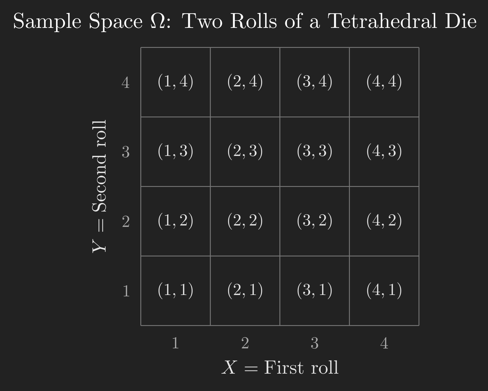
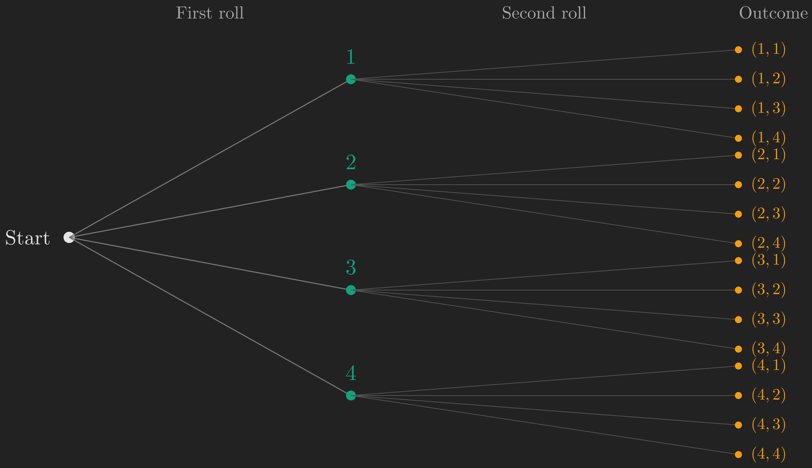
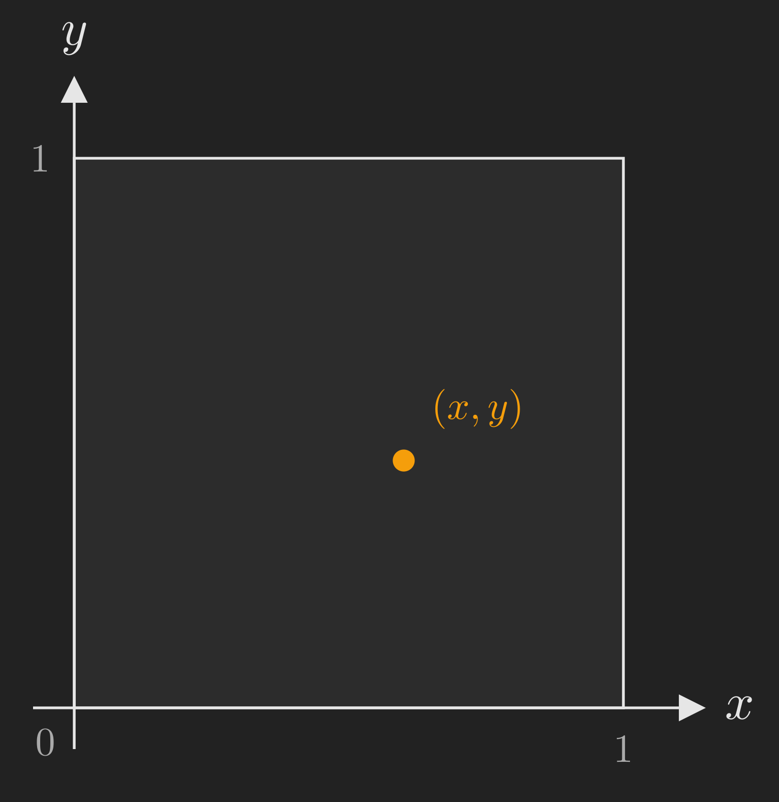
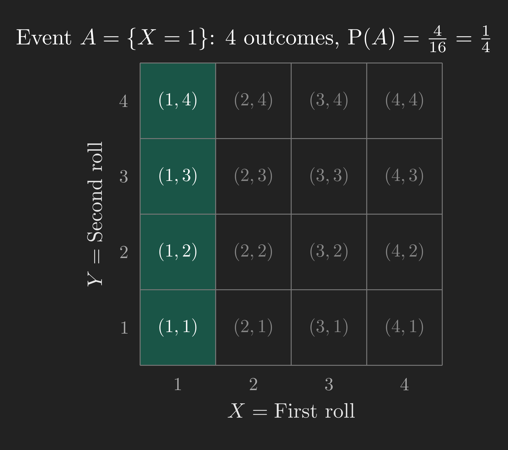
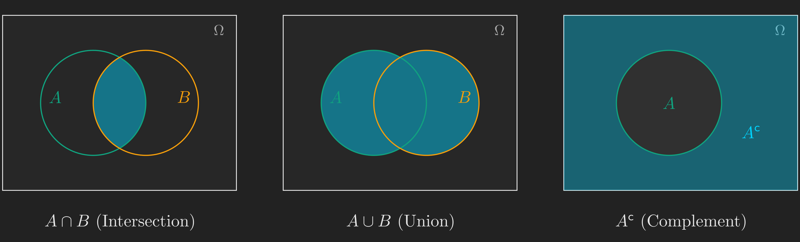
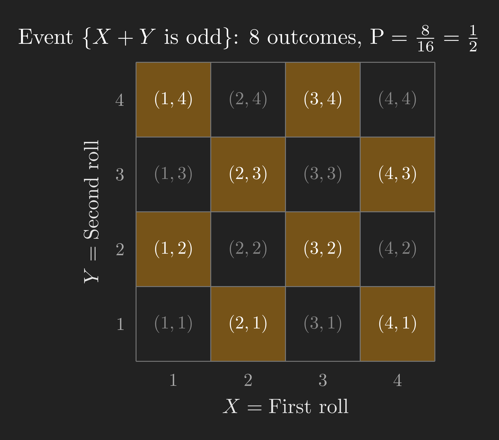
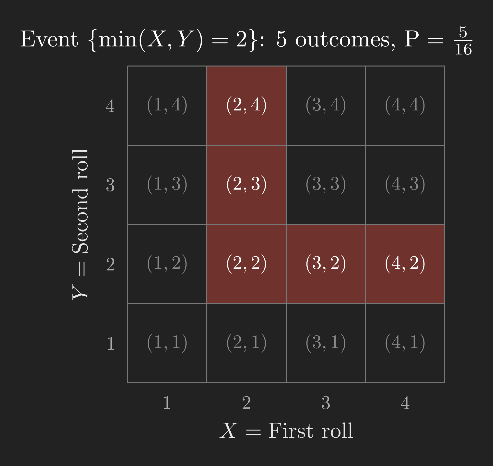
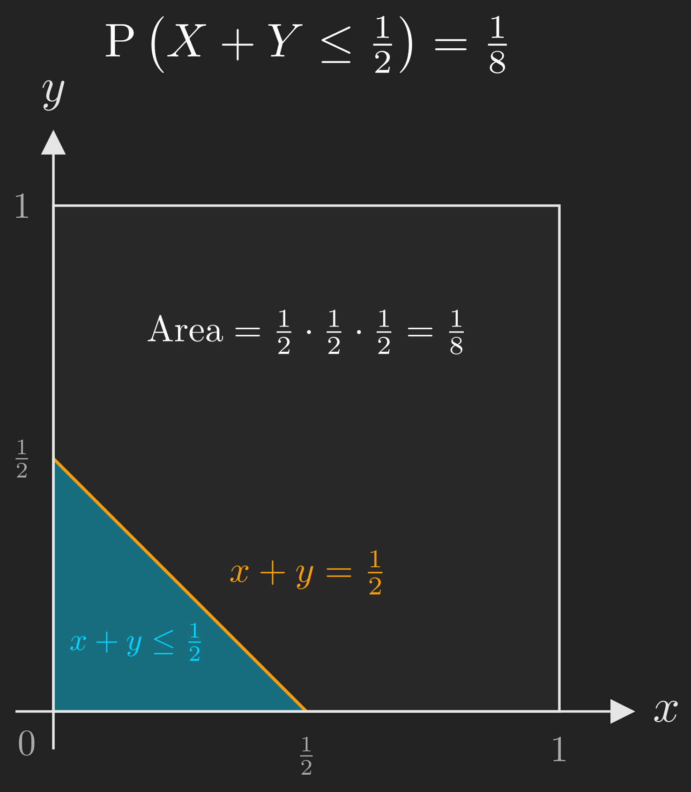

This is the first post in a series on probability and statistics, following the MIT OCW course *6.041 Probabilistic Systems Analysis and Applied Probability* [@probabilistic-systems-analysis-applied-probability-playlist] and its newer version *RES.6-012 Introduction to Probability* [@intro-to-probability-spring-2018-playlist]. The primary textbook for this series is @bertsekas2008introduction, and we will occasionally draw on @blitzstein2019introduction for supplementary perspectives. This post covers the material from Lecture 1 and Sections 1.1 and 1.2 of @bertsekas2008introduction.

# Introduction: Why Do We Need Probability?

Imagine you and a friend are trying to decide where to eat tonight. You have four restaurants in mind: a Thai place, a pizza joint, a sushi bar, and a burger spot. Neither of you can decide, so you grab a four-sided die (yes, they exist; think of a tetrahedron) and agree to let the roll decide.

You roll the die. Before it lands, a simple question pops into your head: *what are the chances I end up eating sushi tonight?*

This is a question about uncertainty. You do not know what the die will show, but you are not completely in the dark either. You know it must land on one of four faces. You know (assuming a fair die) that no face is more likely than another. And from those two pieces of knowledge alone, you can reason your way to an answer.

That, in a nutshell, is what probability theory gives us: a *systematic framework for reasoning about uncertainty*. The situations we care about might be far more complex than a dinner decision (think noise in a communication channel, fluctuations in a stock price, randomness in clinical trial outcomes), but the basic concepts and tools are always the same [@bertsekas2008introduction, Chapter 1]. As Prof. Tsitsiklis puts it in the opening lecture: you may see books titled "Probability for Engineers" or "Probability for Scientists," but what is inside them is exactly the same models, the same equations, the same ideas [@probabilistic-systems-analysis-applied-probability-playlist].

So, what does it take to set up this framework? By the end of this post, you will know the answer. It comes down to three ingredients: a **sample space** (what *can* happen), **events** (the questions we ask about what happened), and a **probability law** (how likely each event is). Let us see how these three pieces fit together.

# Our Roadmap

Here is the journey we are about to take.

```{mermaid}
%%| fig-align: center
flowchart TD
    A["Motivation:<br/>Why probability?"] --> B["The Sample Space:<br/>Listing all possibilities"]
    B --> C["Events:<br/>The questions we ask"]
    C --> D["Probability Axioms:<br/>Rules of the game"]
    D --> E["Discrete Uniform Law:<br/>Counting outcomes"]
    E --> F["Continuous Uniform Law:<br/>Probability as area"]
    F --> G["Countable Additivity:<br/>Infinite sample spaces"]
    G --> H["Wrap-Up:<br/>The three ingredients"]

    style A fill:#10a37f,color:#fff
```

We will start by defining the sample space and understanding what makes a good one. Then we will introduce events and the set operations that let us combine them. With those concepts in hand, we will state the probability axioms (the "rules of the game") and see what we can derive from them. Finally, we will put everything to work on concrete examples, both discrete and continuous, before closing with a glimpse at the subtlety that arises when sample spaces become infinite.

# The Sample Space: Listing All Possibilities

## What Is a Sample Space?

Every probability problem begins with an **experiment**: something happens, and the result is uncertain. It could be flipping a coin, rolling a die, measuring a patient's blood pressure, or throwing a dart at a board. The first step in building a probabilistic model is to write down a complete list of everything that *could* happen.

This list is called the **sample space**, and we denote it by $\Omega$ (the Greek capital letter omega). Formally, the sample space is a *set* whose elements are all the possible **outcomes** of the experiment.

For our restaurant die roll, the sample space is simply:

$$
\Omega = \left\{\text{Thai}, \text{Pizza}, \text{Sushi}, \text{Burger}\right\}.
$$

There are exactly two requirements that every sample space must satisfy [@bertsekas2008introduction, Section 1.1]:

1. **Mutually exclusive.** At the end of the experiment, exactly one outcome occurs. If the die lands on "Thai," it has not also landed on "Pizza." Two different outcomes cannot happen simultaneously.
2. **Collectively exhaustive.** The list covers every possibility. No matter what happens, the result is somewhere in $\Omega$. You have not forgotten any outcome.

In short, when the experiment is over, you should be able to point to *exactly one* element of $\Omega$ and say, "This is what happened."

## The Art of Choosing Granularity

Here is a subtlety that is easy to overlook. Consider a simpler experiment: flipping a single coin. The natural sample space is $\Omega = \left\{\text{Heads}, \text{Tails}\right\}$. But what if you are superstitious, and you believe that rain affects your coin? Then you *could* write down:

$$
\Omega = \left\{\text{Heads}, \text{Tails and raining}, \text{Tails and not raining}\right\}.
$$

This is a perfectly valid sample space. It is mutually exclusive and collectively exhaustive. But is it *useful*? Probably not, unless you genuinely believe rain influences coin flips. The lesson is that setting up a sample space involves an element of **modeling judgment**. You choose which details to include and which to leave out. As @bertsekas2008introduction [Section 1.1] puts it, the sample space should be at the "right" granularity for the problem at hand.

This is not unique to probability. In any scientific model, you keep the details that matter and discard the ones that do not. The coin-and-rain example is silly, but the principle shows up everywhere: an engineer modeling a communication channel must decide which sources of noise to include and which to ignore. The art lies in finding the right level of detail.

## Discrete Example: Two Rolls of a Tetrahedral Die

Now let us look at a richer example, the one that will carry us through most of this post. Instead of a six-sided die, we use a **tetrahedral die** (four faces, numbered 1 through 4). We roll it **twice**, and we treat this as a single experiment whose outcome is the pair of results from both rolls.

A crucial point: even though the experiment has two stages (first roll, second roll), we think of it as *one* experiment. The outcome is not just the first roll or the second roll; it is the pair. For example, if the first roll gives 2 and the second gives 3, the outcome is the ordered pair $\left(2, 3\right)$. And this is *different* from the outcome $\left(3, 2\right)$, where the 3 came first.

### The Grid Description

Since each roll has 4 possible results and the rolls are independent, there are $4 \times 4 = 16$ possible outcomes. We can lay them out on a grid, with the first roll ($X$) on the horizontal axis and the second roll ($Y$) on the vertical axis.

{#fig-tetrahedral_die_grid fig-align="center" width=70%}

Each cell in this grid represents exactly one outcome, and together the 16 cells make up the entire sample space $\Omega$. This satisfies our two requirements: the outcomes are mutually exclusive (if the result is $\left(2, 3\right)$, it is not $\left(1, 4\right)$), and they are collectively exhaustive (every possible pair of rolls is accounted for).

### The Tree Description

There is another way to describe the same sample space that is especially useful for experiments that unfold in stages. We can draw a **tree** (sometimes called a sequential description), where each branch represents a choice at a particular stage.

{#fig-sequential_tree fig-align="center" width=100%}

The first level of branches represents the result of the first roll. From each first-level branch, four more branches sprout, representing the result of the second roll. Each **leaf** (endpoint) of the tree corresponds to exactly one outcome. There are 16 leaves, matching the 16 cells in our grid.

A small note on language: we reserve the word "outcome" for the *overall* result of the experiment (the pair $\left(2, 3\right)$, for instance). The number 2 is the "result" of the first stage; the number 3 is the "result" of the second stage. They combine into one outcome.

The grid and the tree are two views of the same sample space. The grid is compact and makes it easy to identify subsets visually. The tree makes the sequential structure of the experiment explicit. Both are useful; which one you reach for depends on the question at hand.

## Continuous Example: The Dart on a Unit Square

Not every sample space is finite. Here is an experiment with infinitely many outcomes: you throw a dart at a square target with side length 1. You are a perfect shot, so the dart always lands somewhere inside the square, but *where* exactly is random.

The outcome of this experiment is the point $\left(x, y\right)$ where the dart lands, and both $x$ and $y$ are real numbers between 0 and 1. The sample space is:

$$
\Omega = \left\{\left(x, y\right) \mid 0 \leq x \leq 1,\ 0 \leq y \leq 1\right\}.
$$

{#fig-unit_square_sample_space fig-align="center" width=50%}

This is an infinite (uncountably infinite, in fact) sample space. Every single point in the square is a possible outcome. We will return to this example later when we discuss continuous probability laws, but for now, the important thing is that the concept of a sample space is flexible enough to handle both finite and infinite cases.

You might be wondering: if the sample space is infinite, how do we assign probabilities? After all, there are infinitely many points. The answer involves assigning probabilities not to individual points, but to *subsets* of the sample space. That brings us to our next topic.

# Events: The Questions We Ask

## What Is an Event?

Once we have a sample space, the natural next step is to ask questions about the outcome. Questions like: "Did the first roll come up 1?" or "Is the sum of the two rolls odd?" or "Did the dart land in the upper-left quarter of the board?"

Each such question carves out a **subset** of the sample space, consisting of all the outcomes for which the answer is "yes." In probability, we call these subsets **events**.

::: {.callout-note}
An **event** is a subset of the sample space $\Omega$. We say that event $A$ **occurred** if the actual outcome of the experiment is an element of $A$. If the outcome falls outside $A$, we say event $A$ **did not occur**.
:::

Let us make this concrete with our tetrahedral die example. Consider the event "the first roll is 1." This corresponds to the subset:

$$
A = \left\{\left(1, 1\right), \left(1, 2\right), \left(1, 3\right), \left(1, 4\right)\right\}.
$$

On our 4x4 grid, this is the entire first column. If the experiment's outcome happens to be $\left(1, 3\right)$, then event $A$ occurred. If the outcome is $\left(2, 4\right)$, then event $A$ did not occur.

{#fig-event_X_equals_1 fig-align="center" width=70%}

## Combining Events: Set Operations

Because events are sets, we can combine them using the standard set operations. These operations let us build complex events out of simpler ones.

**Intersection** ($A \cap B$): The event that *both* $A$ and $B$ occur. This is the set of outcomes that belong to both $A$ and $B$. In everyday language, $A \cap B$ is "$A$ *and* $B$."

**Union** ($A \cup B$): The event that $A$ or $B$ (or both) occur. This is the set of outcomes that belong to at least one of $A$ or $B$. In everyday language, $A \cup B$ is "$A$ *or* $B$."

**Complement** ($A^{\mathsf{c}}$): The event that $A$ does *not* occur. This is the set of outcomes in $\Omega$ that are not in $A$.

{#fig-set_operations fig-align="center" width=100%}

Two events are called **disjoint** (or **mutually exclusive**) if they have no outcomes in common, i.e., $A \cap B = \varnothing$ (the empty set). If $A$ is "the first roll is 1" and $B$ is "the first roll is 2," then $A$ and $B$ are disjoint because no outcome can have the first roll be both 1 and 2 simultaneously.

We now have the vocabulary to describe any question about our experiment. The next step is to assign numbers (probabilities) to these events in a way that makes sense. That is where the axioms come in.

# The Probability Axioms: Rules of the Game

## Why Axioms?

We want to assign a probability $\mathrm{P}\left(A\right)$ to every event $A$, representing how likely that event is to occur. But we cannot just assign any numbers we please. The assignments need to be *internally consistent*. For example, if event $A$ is a subset of event $B$ (every outcome in $A$ is also in $B$), then surely $\mathrm{P}\left(A\right)$ should be no larger than $\mathrm{P}\left(B\right)$.

Rather than listing every desirable property individually, mathematicians have distilled the requirements down to a small set of **axioms**: ground rules that every legitimate probability assignment must obey. Everything else can be *derived* from these axioms. There are only three of them.

## The Cream Cheese Analogy

Before we state the axioms formally, here is a helpful mental image (borrowed from the lecture [@probabilistic-systems-analysis-applied-probability-playlist]). Think of probability as **cream cheese spread on bread**. The sample space $\Omega$ is the slice of bread. You have exactly one pound of cream cheese (total probability = 1), and you spread it across the bread. The probability of an event $A$ is the amount of cream cheese sitting on top of the region $A$.

This analogy immediately makes three things intuitive:

1. The amount of cream cheese on any region is never negative. (You cannot have negative cream cheese.)
2. The total cream cheese on the entire slice is exactly one pound. (You used all of it, no more, no less.)
3. If two regions do not overlap, the total cream cheese on both regions combined is the sum of the cream cheese on each. (Cream cheese does not teleport.)

Those three intuitions are precisely the three axioms.

## The Three Axioms

Let $\Omega$ be a sample space, and let $\mathrm{P}\left(A\right)$ denote the probability assigned to an event $A \subseteq \Omega$. The axioms of probability are [@bertsekas2008introduction, Section 1.2]:

**Axiom 1 (Nonnegativity).** For every event $A$,

$$
\mathrm{P}\left(A\right) \geq 0.
$$ {#eq-axiom_nonnegativity}

**Axiom 2 (Normalization).** The probability of the entire sample space is 1:

$$
\mathrm{P}\left(\Omega\right) = 1.
$$ {#eq-axiom_normalization}

**Axiom 3 (Additivity).** If $A$ and $B$ are disjoint events ($A \cap B = \varnothing$), then:

$$
\mathrm{P}\left(A \cup B\right) = \mathrm{P}\left(A\right) + \mathrm{P}\left(B\right).
$$ {#eq-axiom_additivity}

That is it. Three rules. Every single result in probability theory, from Bayes' theorem to the law of large numbers, ultimately traces back to these three axioms. Let us see what we can squeeze out of them.

## A First Consequence: Probabilities Never Exceed 1

You might have noticed that the axioms say probabilities are non-negative (@eq-axiom_nonnegativity) and that the total is 1 (@eq-axiom_normalization), but they do not *explicitly* say that no individual probability can exceed 1. Is that a gap? No. We can *derive* it from the three axioms. Here is the argument, and it is a neat one because it uses all three.

Start with the second axiom:

$$
1 = \mathrm{P}\left(\Omega\right).
$$

Now, the sample space $\Omega$ can be split into any event $A$ and its complement $A^{\mathsf{c}}$. These two sets are disjoint (an outcome is either in $A$ or not), and together they cover all of $\Omega$:

$$
\Omega = A \cup A^{\mathsf{c}}.
$$

By the additivity axiom (@eq-axiom_additivity), since $A$ and $A^{\mathsf{c}}$ are disjoint:

$$
\mathrm{P}\left(\Omega\right) = \mathrm{P}\left(A\right) + \mathrm{P}\left(A^{\mathsf{c}}\right).
$$

Substituting $\mathrm{P}\left(\Omega\right) = 1$:

$$
\mathrm{P}\left(A\right) = 1 - \mathrm{P}\left(A^{\mathsf{c}}\right).
$$ {#eq-complement_rule}

By the nonnegativity axiom, $\mathrm{P}\left(A^{\mathsf{c}}\right) \geq 0$, so:

$$
\mathrm{P}\left(A\right) \leq 1.
$$

This is a small but satisfying result. It tells us that the axioms are not missing anything: the bound $\mathrm{P}\left(A\right) \leq 1$ is a logical consequence, not an extra assumption. Notice how the proof used all three axioms: normalization to set the total to 1, the complement decomposition plus additivity to split it, and nonnegativity to bound the result.

As a bonus, @eq-complement_rule (the **complement rule**) is itself a useful tool: if it is easier to compute the probability that something does *not* happen, you can subtract from 1 to get the probability that it does.

## Extending Additivity to More Than Two Events

The additivity axiom (@eq-axiom_additivity) is stated for two disjoint events. But what about three? Or ten? We can extend it by applying the axiom repeatedly.

Suppose $A$, $B$, and $C$ are pairwise disjoint (no two of them share an outcome). Then:

$$
\begin{align*}
\mathrm{P}\left(A \cup B \cup C\right) &= \mathrm{P}\left(\left(A \cup B\right) \cup C\right) \\
&= \mathrm{P}\left(A \cup B\right) + \mathrm{P}\left(C\right) \\
&= \mathrm{P}\left(A\right) + \mathrm{P}\left(B\right) + \mathrm{P}\left(C\right).
\end{align*}
$$

The trick is to group $A \cup B$ as a single set, note that it is disjoint from $C$, apply the axiom, and then apply it again to split $A \cup B$. You can repeat this as many times as you like. For any *finite* collection of pairwise disjoint events $A_1, A_2, \dots, A_n$:

$$
\mathrm{P}\left(A_1 \cup A_2 \cup \cdots \cup A_n\right) = \mathrm{P}\left(A_1\right) + \mathrm{P}\left(A_2\right) + \cdots + \mathrm{P}\left(A_n\right).
$$ {#eq-finite_additivity}

An important special case: if the sample space is finite and we have an event consisting of individual outcomes $s_1, s_2, \dots, s_k$, then:

$$
\mathrm{P}\left(\left\{s_1, s_2, \dots, s_k\right\}\right) = \mathrm{P}\left(s_1\right) + \mathrm{P}\left(s_2\right) + \cdots + \mathrm{P}\left(s_k\right).
$$

(Here we abuse notation slightly and write $\mathrm{P}\left(s_i\right)$ instead of the more formal $\mathrm{P}\left(\left\{s_i\right\}\right)$.)

This is exactly how we will compute probabilities in the next section: find the event we care about, identify the individual outcomes it contains, and add up their probabilities.

## Where We Stand

Let us take a breath and see where we are on our roadmap.

```{mermaid}
%%| fig-align: center
flowchart TD
    A["Motivation:<br/>Why probability?"] --> B["The Sample Space:<br/>Listing all possibilities"]
    B --> C["Events:<br/>The questions we ask"]
    C --> D["Probability Axioms:<br/>Rules of the game"]
    D --> E["Discrete Uniform Law:<br/>Counting outcomes"]
    E --> F["Continuous Uniform Law:<br/>Probability as area"]
    F --> G["Countable Additivity:<br/>Infinite sample spaces"]
    G --> H["Wrap-Up:<br/>The three ingredients"]

    style A fill:#555,color:#aaa
    style B fill:#555,color:#aaa
    style C fill:#555,color:#aaa
    style D fill:#10a37f,color:#fff
```

So far, we have set up the sample space (the list of all possible outcomes), defined events (the subsets we care about), and stated the probability axioms (the rules that every probability assignment must follow). We have also derived two useful consequences: the complement rule and finite additivity.

But we have not yet actually *computed* any probabilities. That is about to change. The axioms give us the rules; now we need a specific probability law to plug in. The simplest one is the discrete uniform law, where all outcomes are equally likely. That is exactly what we will tackle next.

# Putting the Axioms to Work: The Discrete Uniform Law

## All Outcomes Equally Likely

Let us return to our tetrahedral die example. We roll the die twice, giving us 16 possible outcomes. For a fair die, there is no reason to believe any outcome is more likely than any other. So we assign each outcome the same probability.

Since there are 16 outcomes and their probabilities must add up to 1 (by the normalization axiom), each outcome gets probability $\frac{1}{16}$.

This is an instance of the **discrete uniform law** [@bertsekas2008introduction, Section 1.2]: when the sample space has $N$ equally likely outcomes, and the event $A$ contains $n$ of them, the probability of $A$ is:

$$
\mathrm{P}\left(A\right) = \frac{n}{N} = \frac{\text{number of outcomes in } A}{\text{total number of outcomes in } \Omega}.
$$ {#eq-discrete_uniform_law}

Under the discrete uniform law, computing probabilities reduces to **counting**. How many outcomes are in my event of interest? How many are in the full sample space? Divide and you are done.

(You might be wondering: counting sounds easy, so why would we need more than half a sentence about it? For simple examples, counting *is* easy. But some counting problems are devilishly tricky, and a few weeks into a probability course, you may find yourself spending an entire lecture on systematic counting techniques. For now, we will stick to cases where the counting is straightforward.)

## Worked Examples on the 4x4 Grid

Let us compute some probabilities on our tetrahedral die sample space. For each example, the strategy is the same: (1) identify the event on the grid, (2) count the outcomes in it, and (3) divide by 16.

### Example 1: $\mathrm{P}\left(\left(X, Y\right) \text{ is } \left(1,1\right) \text{ or } \left(1,2\right)\right)$

The event consists of exactly two outcomes: $\left(1, 1\right)$ and $\left(1, 2\right)$. By @eq-finite_additivity:

$$
\mathrm{P}\left(\left\{\left(1,1\right), \left(1,2\right)\right\}\right) = \mathrm{P}\left(1,1\right) + \mathrm{P}\left(1,2\right) = \frac{1}{16} + \frac{1}{16} = \frac{2}{16} = \frac{1}{8}.
$$

### Example 2: $\mathrm{P}\left(X = 1\right)$

The event $\left\{X = 1\right\}$ is the set of all outcomes where the first roll is 1: $\left\{\left(1,1\right), \left(1,2\right), \left(1,3\right), \left(1,4\right)\right\}$. That is 4 outcomes, so:

$$
\mathrm{P}\left(X = 1\right) = \frac{4}{16} = \frac{1}{4}.
$$

On the grid, this is the entire first column (see @fig-event_X_equals_1).

### Example 3: $\mathrm{P}\left(X + Y \text{ is odd}\right)$

Which outcomes make $X + Y$ odd? The sum of two integers is odd precisely when one is even and the other is odd. On our grid, the outcomes where $X + Y$ is odd form a checkerboard pattern.

{#fig-event_X_plus_Y_odd fig-align="center" width=70%}

Counting the highlighted cells, we find 8 outcomes. So:

$$
\mathrm{P}\left(X + Y \text{ is odd}\right) = \frac{8}{16} = \frac{1}{2}.
$$

### Example 4: $\mathrm{P}\left(\min\left(X, Y\right) = 2\right)$

This one is trickier. We need the outcomes where the *smaller* of the two rolls is exactly 2. Let us think about this carefully.

The minimum is 2 if and only if both of the following hold: (a) at least one of $X$ or $Y$ equals 2, and (b) neither $X$ nor $Y$ is less than 2 (i.e., neither is 1). So we need both rolls to be at least 2, and at least one of them to be exactly 2.

On the grid, this means we are looking at the sub-grid where $X \geq 2$ and $Y \geq 2$ (a 3x3 block), but only the outcomes on the "border" where $X = 2$ or $Y = 2$. Those are:

$$
\left\{\left(2,2\right), \left(2,3\right), \left(2,4\right), \left(3,2\right), \left(4,2\right)\right\}.
$$

{#fig-event_min_equals_2 fig-align="center" width=70%}

That is 5 outcomes, so:

$$
\mathrm{P}\left(\min\left(X, Y\right) = 2\right) = \frac{5}{16}.
$$

Notice the value of working with a picture. The event $\left\{\min\left(X, Y\right) = 2\right\}$ is hard to reason about in your head, but once you see it on the grid, identifying the relevant outcomes becomes straightforward.

## The General Pattern

Every example followed the same three-step procedure:

1. **Set up** the sample space and the probability law.
2. **Identify** the event of interest on a diagram.
3. **Count** (or calculate) the probability using the law.

This procedure applies to any probability model, not just the discrete uniform law. The calculations might be harder (you might need calculus instead of counting), but the *logic* is always the same. That is the beauty of having a clean framework.

We have now seen how the discrete uniform law works. But what about continuous sample spaces, where outcomes are not discrete points but real numbers? Can we still assign probabilities by counting? No, we cannot, because there are infinitely (uncountably) many outcomes. We need a different approach.

# The Continuous Uniform Law: Probability as Area

Let us return to the dart-on-a-unit-square experiment (@fig-unit_square_sample_space). The sample space is the set of all points $\left(x, y\right)$ with $0 \leq x \leq 1$ and $0 \leq y \leq 1$. How should we assign probabilities?

If we have no reason to believe any region of the square is more likely to be hit than any other region of the same size, then a natural choice is the **continuous uniform law**: the probability of an event equals the **area** of the corresponding region. Two regions with equal area have equal probability. A region with twice the area has twice the probability.

Formally, for any event $A \subseteq \Omega$:

$$
\mathrm{P}\left(A\right) = \text{Area of } A.
$$

This is consistent with our axioms. The area of the entire square is 1 (normalization). Areas are non-negative (nonnegativity). And if two regions do not overlap, the total area is the sum of the individual areas (additivity).

## A Single Point Has Probability Zero

Here is an immediate (and initially surprising) consequence. What is the probability that the dart lands on *exactly* the point $\left(0.5, 0.3\right)$?

A single point has zero area. Therefore:

$$
\mathrm{P}\left(\left(X, Y\right) = \left(0.5, 0.3\right)\right) = 0.
$$

This is true for *any* single point in the square. The probability of hitting any one specific point to infinite precision is zero. This might feel strange ("How can something that is possible have probability zero?"), but it is a fundamental feature of continuous probability. An event with probability zero is not the same as an impossible event. It simply means that, in a precise mathematical sense, the "weight" of a single point is negligible compared to the continuum of all possible points.

(You might be wondering: if every single point has probability zero, and the square is made up of points, how does the total add up to 1? This is a deep question that connects to measure theory. The short answer is that you cannot add up uncountably many zeros to reconstruct the area. Probabilities in continuous spaces are assigned to *regions*, not to individual points. For this course, the practical takeaway is: in continuous models, always think in terms of regions and their areas, not individual outcomes.)

## Worked Example: $\mathrm{P}\left(X + Y \leq \frac{1}{2}\right)$

Suppose we want to find the probability that the sum of the two coordinates is at most $\frac{1}{2}$. The event of interest is:

$$
A = \left\{\left(x, y\right) \mid x + y \leq \frac{1}{2}\right\}.
$$

On the unit square, the line $x + y = \frac{1}{2}$ intercepts the $x$-axis at $\frac{1}{2}$ and the $y$-axis at $\frac{1}{2}$. The region below this line (within the square) is a right triangle with legs of length $\frac{1}{2}$.

{#fig-unit_square_triangle fig-align="center" width=50%}

The area of this triangle is:

$$
\mathrm{P}\left(X + Y \leq \frac{1}{2}\right) = \frac{1}{2} \times \frac{1}{2} \times \frac{1}{2} = \frac{1}{8}.
$$

Once again, the procedure is the same: identify the event on a picture, then compute its probability using the probability law (which, in this case, is area).

The calculations in this example were simple (the area of a triangle), but the same approach works for more complex regions. You might need to evaluate an integral instead of using a geometric formula, but the conceptual steps are identical.

# Beyond Finite: Countable Additivity

We have seen the axioms in action on finite sample spaces and continuous sample spaces. But there is a case we have not yet addressed: **countably infinite** sample spaces. This is where a subtle gap in our axioms reveals itself.

## The Coin-Flipping Experiment

Consider the following experiment: you flip a fair coin repeatedly until you get heads for the first time. The outcome is the number of flips it took. It might take 1 flip, or 2, or 10, or a million. There is no upper bound, so the sample space is:

$$
\Omega = \left\{1, 2, 3, \dots\right\}.
$$

Suppose someone tells us (and we will derive *why* in a later post) that the probability of needing exactly $n$ flips is:

$$
\mathrm{P}\left(n\right) = 2^{-n}, \quad n = 1, 2, 3, \dots
$$

So $\mathrm{P}\left(1\right) = \frac{1}{2}$, $\mathrm{P}\left(2\right) = \frac{1}{4}$, $\mathrm{P}\left(3\right) = \frac{1}{8}$, and so on, with the probabilities getting smaller and smaller but never reaching zero.

```{python}
#| label: fig-geometric_probabilities
#| fig-cap: "Probability distribution: $\\mathrm{P}(n) = 2^{-n}$. Even outcomes are highlighted in orange."
#| fig-align: center

import matplotlib.pyplot as plt
import numpy as np

plt.style.use('dark_background')

n_values = np.arange(1, 11)
probabilities = 2.0 ** (-n_values)

colors = ['#f59e0b' if n % 2 == 0 else '#10a37f' for n in n_values]

fig, ax = plt.subplots(figsize=(8, 4))
bars = ax.bar(n_values, probabilities, color=colors, edgecolor='white', linewidth=0.5)

ax.set_xlabel('$n$ (number of flips)', fontsize=12, color='#e6e6e6')
ax.set_ylabel('$P(n) = 2^{-n}$', fontsize=12, color='#e6e6e6')
ax.set_xticks(n_values)
ax.set_xticklabels(n_values, color='#e6e6e6')
ax.tick_params(colors='#e6e6e6')

ax.text(8.5, 0.35, 'Even outcomes', color='#f59e0b', fontsize=10, fontweight='bold')
ax.text(8.5, 0.30, 'Odd outcomes', color='#10a37f', fontsize=10, fontweight='bold')

for spine in ax.spines.values():
    spine.set_color('#555555')

plt.tight_layout()
plt.show()
```

Now, here is the question: what is the probability that the outcome is an **even** number?

## Why Finite Additivity Is Not Enough

Any reasonable person would write:

$$
\mathrm{P}\left(\left\{2, 4, 6, \dots\right\}\right) = \mathrm{P}\left(2\right) + \mathrm{P}\left(4\right) + \mathrm{P}\left(6\right) + \cdots = \frac{1}{2^2} + \frac{1}{2^4} + \frac{1}{2^6} + \cdots
$$

This is a geometric series with first term $\frac{1}{4}$ and common ratio $\frac{1}{4}$, so it sums to:

$$
\mathrm{P}\left(\text{outcome is even}\right) = \frac{1/4}{1 - 1/4} = \frac{1}{3}.
$$

But wait. Look at the step where we wrote the probability of the infinite union as the infinite sum of individual probabilities. Our additivity axiom (@eq-axiom_additivity) only guarantees this for *two* disjoint events. We extended it to *finitely many* disjoint events (@eq-finite_additivity), but the event $\left\{2, 4, 6, \dots\right\}$ is the union of *infinitely many* disjoint single-outcome events.

To justify this calculation, we need a stronger version of the additivity axiom.

## The Countable Additivity Axiom

We replace our third axiom with a more powerful version [@bertsekas2008introduction, Section 1.2]:

**Axiom 3 (Countable Additivity).** If $A_1, A_2, A_3, \dots$ is a *sequence* of disjoint events (meaning $A_i \cap A_j = \varnothing$ for all $i \neq j$), then:

$$
\mathrm{P}\left(A_1 \cup A_2 \cup A_3 \cup \cdots\right) = \mathrm{P}\left(A_1\right) + \mathrm{P}\left(A_2\right) + \mathrm{P}\left(A_3\right) + \cdots
$$ {#eq-countable_additivity}

The key word is "sequence": the events can be arranged as first, second, third, and so on (a countable collection). This axiom is strictly stronger than finite additivity; it permits us to add up infinitely many probabilities, which is exactly what we needed for the coin-flipping example.

(You might be wondering: does this mean we can always add up probabilities for any infinite collection of disjoint events? Only if the collection is *countable*, meaning the events can be listed as a sequence. For uncountable collections (like the individual points in the unit square), countable additivity does not apply. This is why, in the continuous case, we cannot reconstruct the probability of a region by adding up the probabilities of its individual points.)

With countable additivity in hand, our calculation of $\mathrm{P}\left(\text{outcome is even}\right) = \frac{1}{3}$ is fully justified.

# Wrapping Up: The Three Ingredients

Let us step back to the beginning. We started with a simple question about uncertainty (where will we eat tonight?), and we have now built the entire foundational framework for answering such questions rigorously.

```{mermaid}
%%| fig-align: center
flowchart LR
    A["Sample Space Ω<br/>All possible outcomes"] --> D["Probabilistic<br/>Model"]
    B["Events<br/>Subsets of Ω"] --> D
    C["Probability Law P<br/>Obeys the axioms"] --> D

    style D fill:#10a37f,color:#fff
```

Every probabilistic model consists of three ingredients:

1. **A sample space $\Omega$**: a set listing all possible outcomes of the experiment. The outcomes must be mutually exclusive and collectively exhaustive.
2. **A collection of events**: subsets of $\Omega$ to which we assign probabilities. We can combine events using set operations (union, intersection, complement).
3. **A probability law $\mathrm{P}$**: an assignment of a number $\mathrm{P}\left(A\right)$ to each event $A$, satisfying the three axioms (nonnegativity, normalization, and countable additivity).

With these three ingredients in place, we have a complete mathematical framework for reasoning about uncertainty. The rest of probability theory (conditional probability, independence, random variables, distributions, limit theorems) is built on top of this foundation.

Going back to our restaurant die roll: the sample space is $\Omega = \left\{1, 2, 3, 4\right\}$ (one face per restaurant), the event "we eat sushi" is the subset $\left\{3\right\}$ (say sushi is face 3), and under the discrete uniform law for a fair die, $\mathrm{P}\left(\text{sushi}\right) = \frac{1}{4}$. Simple, but built on solid ground.

In the next post, we will explore what happens when we gain partial information about the outcome, which leads us to **conditional probability** and the concept of **independence**. Stay tuned.
