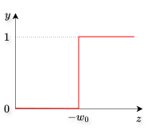
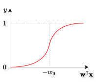
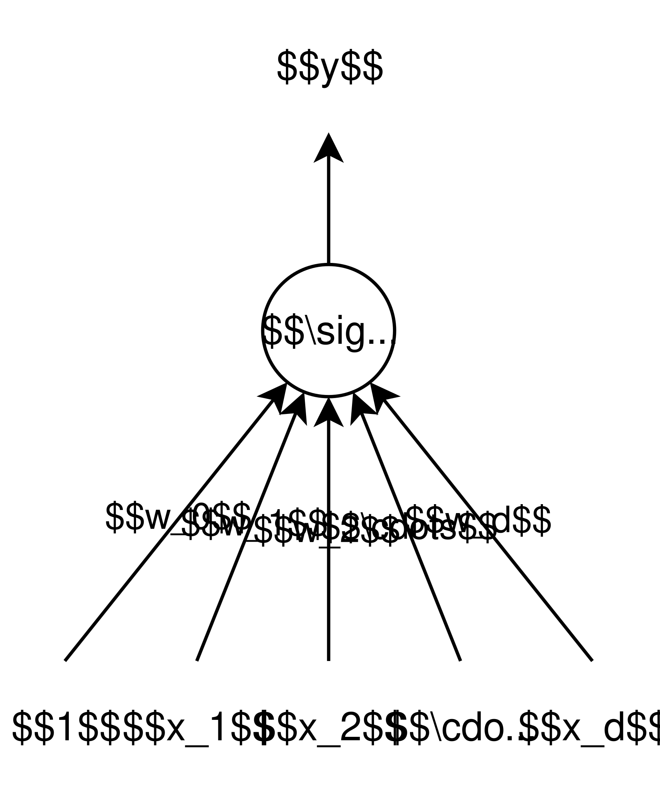
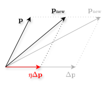
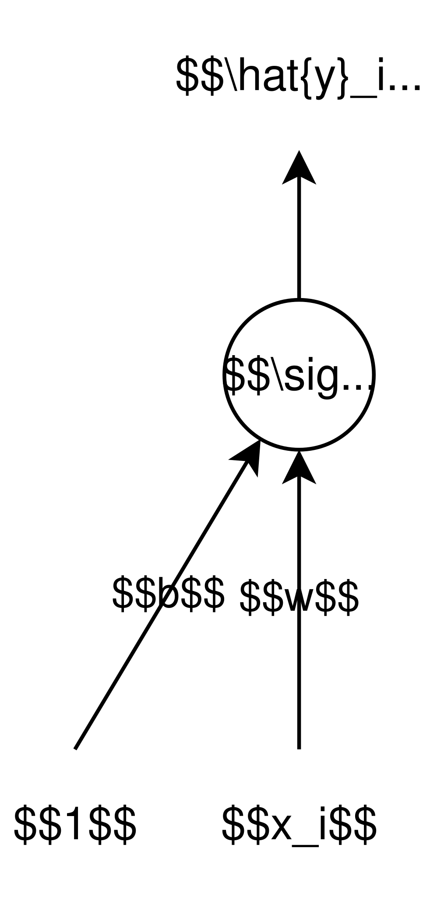

# Introduction

In [McCulloch-Pitts neuron](../mcculloch-pitts-neuron/index.qmd), [perceptron](../perceptron/index.qmd), and [MLP](../mlp/index.qmd) blog posts, we dealt only with implementing Boolean functions using Boolean inputs. In other words, we implemented functions of the form

$$
y = f \left(x_1, x_2, \dots, x_d\right) = f (\mathbf{x}),
$$

where $y \in \{0, 1\}$ and $x_1, x_2, \dots, x_d \in \{0, 1\}$ (or $\mathbf{x} \in \{0, 1\}^d$). We now want to generalize this and implement **real functions** with **real inputs**. In other words, we want to implement functions of the form

$$
y = f \left(x_1, x_2, \dots, x_d\right) = f (\mathbf{x}),
$$

where $y \in \mathbb{R}$ and $x_1, x_2, \dots, x_d \in \mathbb{R}$ (or $\mathbf{x} \in \mathbb{R}^d$). We want to see if we can have a network of neurons that can approximately represent such functions. However, we will not be able to do this using perceptrons as perceptrons, by definition, have Boolean inputs and outputs. We will need **sigmoid neurons**. We will discuss them in this blog post.

# Activation Functions

## Perceptron Activation Function

Recall that the perceptron equation is given by

$$
\begin{align*}
  y = f(\mathbf{x}) &=
  \begin{cases}
    1, & \text{if }\mathbf{w}^{\intercal} \mathbf{x} \geq 0,\\
    0, & \text{if }\mathbf{w}^{\intercal} \mathbf{x} < 0,
  \end{cases}\\
  &=
  \begin{cases}
    1, & \text{if }w_1 x_1 + w_2 x_2 + \cdots + w_d x_d \geq -w_0,\\
    0, & \text{if }w_1 x_1 + w_2 x_2 + \cdots + w_d x_d < -w_0.
  \end{cases}
\end{align*}
$$

Recall that $x_0 = 1$. Let us now denote the weighted sum of the inputs with $z$, i.e.,

$$
w_1 x_1 + w_2 x_2 + \cdots + w_d x_d = z.
$$

So, the perceptron equation becomes

$$
y = f(z) =
\begin{cases}
    1, & \text{if }z \geq -w_0,\\
    0, & \text{if }z < -w_0.
\end{cases}
$$ {#eq-perceptron_activation_function}

Thus, a perceptron fires (i.e., gives the output as $1$) if the weighted sum of its inputs ($z$) crosses the threshold of $-w_0$. This is like a step function which is shown in @fig-perceptron_activation_function.

{#fig-perceptron_activation_function fig-align="center" width=35% .invert}

This is called the **perceptron activation function**. It tells the functional form of the output of a perceptron. So, what happens inside a perceptron unit is the following:

- All the the inputs $x_j$ are weighted with weights $w_j$ (where $j \in \{1, 2, \dots, d\}$),
- These weighted inputs are aggregated in the following way:

  $$
  w_1 x_1 + w_2 x_2 + \cdots + w_d x_d = z,
  $$

- An activation function, which is the perceptron activation function (@eq-perceptron_activation_function), is applied on this aggregation.

This perceptron function is rather extreme. It says that the output instantaneously becomes $1$ when the weighted sum of the input crosses $-w_0$. Clearly, it is not differentiable at $-w_0$.

## Sigmoid Activation Functions

Instead of using a step function as the activation function, which is rather extreme, we can use a function from the sigmoid family which are a lot smoother. One function is the **logistic function**, sometimes also called the **sigmoid function**. Its functional form is the following:

$$
y = \sigma\left(\mathbf{w}^{\intercal} \mathbf{x}\right) = \frac{1}{1 + e^{- \mathbf{w}^{\intercal} \mathbf{x}}} = \frac{1}{1 + e^{-\left(w_0 + w_1 x_1 + w_2 x_2 + \cdots + w_d x_d\right)}}.
$$ {#eq-sigmoid_activation_function}

@fig-logistic_activation_function shows the plot of this function.

{#fig-logistic_activation_function fig-align="center" width=35% .invert}

Clearly, this function is a lot smoother. Its output varies smoothly between $0$ and $1$, and there is no longer a sharp transition around the threshold $-w_0$. It is differentiable over its entire domain. Also, the output is now a real valued function that varies between $0$ and $1$, i.e., $y \in (0, 1)$. Hence, this output can now be interpreted as the probability of the ground truth being $1$.

Notice that the output (@eq-sigmoid_activation_function) can never be exactly $0$ or exactly $1$. It only tends to these quantities in the extremes of $\mathbf{w}^{\intercal} \mathbf{x}$, i.e.,

$$
\lim_{\mathbf{w}^{\intercal} \mathbf{x} \to -\infty} \left(\frac{1}{1 + e^{- \mathbf{w}^{\intercal} \mathbf{x}}}\right) = 0,
$$

and

$$
\lim_{\mathbf{w}^{\intercal} \mathbf{x} \to \infty} \left(\frac{1}{1 + e^{- \mathbf{w}^{\intercal} \mathbf{x}}}\right) = 1.
$$

Thus, the construction of a sigmoid neuron is almost identical to that of a perceptron, with the only difference being that the activation function is a function of the sigmoid family. Hence, the pictorial representation of a sigmoid neuron is same as that of the perceptron, however its output is given by @eq-sigmoid_activation_function. @fig-sigmoid_neuron shows the pictorial representation of a sigmoid neuron.

{#fig-sigmoid_neuron fig-align="center" width=35% .invert}

The $\sigma$ inside the node indicates that the activation function used on the aggregation of weighted inputs is the sigmoid activation function (@eq-sigmoid_activation_function).

# A Typical Supervised Machine Learning Setup

A typical supervised machine learning setup has the following components:

- **Data:** We are given some $n$ observations $\mathbf{x}_i$ and their corresponding outputs $y_i$, which we can denote as $\left\{\mathbf{x}_i, y_i\right\}_{i=1}^{n}$ (where $i \in \{1, 2, \dots, n\}$). Mostly, we have the situation in which $\mathbf{x}_i \in \mathbb{R}^d$ and $y_i \in \mathbb{R}$. In other words, each observation has $d$ real features and a real output. We can represent this data inside a matrix in the following way:

  $$
  \text{Data} =
    \left[
      \begin{matrix}
        \leftarrow & \mathbf{x}_1^{\intercal} & \rightarrow\\
        \leftarrow & \mathbf{x}_2^{\intercal} & \rightarrow\\
        \vdots & \vdots & \vdots\\
        \leftarrow & \mathbf{x}_n^{\intercal} & \rightarrow
      \end{matrix}
      \;
      \left|
        \;
        \begin{matrix}
          y_1\\
          y_2\\
          \vdots\\
          y_n\\
        \end{matrix}
      \right.
    \right] =
    \begin{bmatrix}
      x_{11} & x_{12} & \cdots & x_{1d} & y_1\\
      x_{21} & x_{22} & \cdots & x_{2d} & y_2\\
      \vdots & \vdots & \vdots & \ddots & \vdots\\
      x_{n1} & x_{n2} & \cdots & x_{nd} & y_n\\
    \end{bmatrix}.
  $$

- **Model and Parameters:** We have reasons to believe that for each observation the output depends on the input features, i.e., the output is a function of the input features. Let us write this **true** functional form as

  $$
  y = f_t (\mathbf{x}).
  $$

  However, this true function $f_t$ is unknown. Based upon some information, we will come up with an educated guess of the functional form of this true function that will have some **parameters**. Let us denote this educated guess as $f$ and the parameter vector as $\mathbf{p}$. The output of this educated guess is the **prediction** which is denoted as $\hat{y}$, and is given by

  $$
  \hat{y} = f(\mathbf{x}; \mathbf{p}).
  $$

  This guess, or approximation, of the true function between the inputs ($\mathbf{x}$) and the output ($y$) is called the **model**. The model can be the logistic function that we discussed above, or a linear function, or can take any other form. In case of the logistic function and the perceptron, the parameter vector $\mathbf{p}$ is the same as the weight vector $\mathbf{w}$. For example, the prediction in case of the sigmoid neuron is given by:

  $$
  \hat{y} = f(\mathbf{x}; \mathbf{w}) = \sigma\left(\mathbf{x}; \mathbf{w}\right) = \frac{1}{1 + e^{- \mathbf{w}^{\intercal} \mathbf{x}}}.
  $$

  The parameters $\mathbf{w}$ need to be learned from the data.

- **Learning Algorithm:** This is an algorithm that is used for learning the parameters $\mathbf{p}$ (or the weights $\mathbf{w}$) of the model. Examples are, the perceptron learning algorithm, gradient descent, etc.

- **Objective / Loss / Error Function:** This is a function that guides the learning algorithm to learn the parameters $\mathbf{p}$. Clearly, it should be a function of these parameters.

The learning algorithm should aim to **optimize** the objective function with respect to the parameters and find the parameters for which the loss function is optimum. For instance, if the objective function is the number of misclassifications, then the learning algorithm should aim to minimize it and find the parameters at this minimum (i.e., the minima). On the other hand, if the objective function is the number of correct classifications, then the learning algorithm should aim to maximize it and find the parameters at this maximum (i.e., the maxima).

## Movie Example

Consider the problem of predicting whether we would like a movie or not.

- **Data:** $\mathbf{x}_i$ are features of the $i$-th movie, and

  $$
  y_i =
  \begin{cases}
    1, & \text{if we liked movie $i$},\\
    0, & \text{if we did not like movie $i$}.
  \end{cases}
  $$

- **Model and Parameters:** We can model the probability that we like the movie using the logistic function, i.e.,
  
  $$
  \hat{y} = f(\mathbf{x}; \mathbf{w}) = \sigma(\mathbf{x}; \mathbf{w}) = \frac{1}{1 + e^{-\mathbf{w}^{\intercal}\mathbf{x}}}.
  $$

  The parameters are the weights $\mathbf{w}$.

- **Learning Algorithm:** Gradient descent, which we will discuss next.
- **Objective / Loss / Error Function:** One possibility is the sum of squared differences, i.e.,

  $$
  \mathscr{L}(\mathbf{w}) = \sum_{i=1}^{n} \left(\hat{y}_i - y_i\right)^2.
  $$

The learning algorithm should aim to find the parameters (weights) for which this loss (or the error) is minimum, i.e.,

$$
\min_{\mathbf{w}} \left[\mathscr{L}(\mathbf{w})\right] = \min_{\mathbf{w}} \left[\sum_{i=1}^{n} \left(\hat{y}_i - y_i\right)^2\right] = \min_{\mathbf{w}} \left[\sum_{i=1}^{n} \left(\frac{1}{1 + e^{-\mathbf{w}^{\intercal} \mathbf{x}_i} } - y_i\right)^2\right].
$$

# Gradient Descent

**Note:** I will now change the notation slightly and use the notation that is more commonly found in the literature. I will write $w_0$ as $b$. So, we have the following equality:

$$
\begin{align*}
  \mathbf{w}^{\intercal} \mathbf{x} &= w_0 x_0 + w_1 x_1 + \cdots + w_d x_d,\\
                                    &= w_0 + w_1 x_1 + w_2 x_2 + \cdots + w_d x_d,\\
                                    &= b + w_1 x_1 + w_2 x_2 + \cdots + w_d x_d.
\end{align*}
$$

So the parameters now are $\mathbf{w}$ (without $w_0$) and $b$, i.e.,

$$
\mathbf{w} =
\begin{bmatrix}
  w_1\\
  w_2\\
  \vdots\\
  w_d
\end{bmatrix}
\text{ and }
b.
$$

In this notation, what we want to do is the following:

$$
\min_{\mathbf{w}, b} \left[\mathscr{L}(\mathbf{w}, b)\right],
$$

i.e., find the values of the parameters $\mathbf{w}$ and $b$ for which the loss is the minimum. Gradient descent is a principled approach to find these optimum values of the parameters.

We first randomly initialize these parameters and put them in a vector $\mathbf{p}$, i.e.,

$$
\mathbf{p} =
\begin{bmatrix}
  \uparrow \\
  \mathbf{w}\\
  \downarrow \\
  b
\end{bmatrix} =
\begin{bmatrix}
  w_1\\
  w_2\\
  \vdots\\
  w_d\\
  b
\end{bmatrix}.
$$

As we want to change the value of these parameters, we will represent the vector of change in the parameters as

$$
\Delta \mathbf{p} =
\begin{bmatrix}
  \uparrow \\
  \Delta \mathbf{w}\\
  \downarrow \\
  \Delta b
\end{bmatrix} =
\begin{bmatrix}
  \Delta w_1\\
  \Delta w_2\\
  \vdots\\
  \Delta w_d\\
  \Delta b
\end{bmatrix}.
$$

We will change the parameter vector $\mathbf{p}$ by adding this vector of change in parameters, i.e., $\Delta \mathbf{p}$, to it. So, the new parameter vector $\mathbf{p}_{\text{new}}$ becomes

$$
\mathbf{p}_{\text{new}} = \mathbf{p} + \Delta \mathbf{p}.
$$

We want the error to decrease once the parameters are changed, i.e., when $\Delta \mathbf{p}$ is added to $\mathbf{p}$. This will move the new parameter vector $\mathbf{p}_{\text{new}}$ closer to $\Delta \mathbf{p}$. However, we will be a bit conservative and won't add the entire of $\Delta \mathbf{p}$ to $\mathbf{p}$. We will instead first multiply $\Delta \mathbf{p}$ with a small positive scalar $\eta$, known as the **learning rate**, and then add it to $\mathbf{p}$. So the new parameter vector actually is

$$
\mathbf{p}_{\text{new}} = \mathbf{p} + \eta \Delta \mathbf{p}.
$$ {#eq-gradient_descent_parameter_update_1}

@fig-gradient_descent_parameter_update_1 shows this update.

{#fig-gradient_descent_parameter_update_1 fig-align="center" width=35% .invert}

Now, what is the correct value of $\Delta \mathbf{p}$ that should be used? In other words, how should each of the parameters change such that the loss decreases? Answer comes from the Taylor series.

## Taylor Series Recap

Recall that Taylor series is a way of approximating any *continuously differentiable* function $\mathscr{L}(w)$ using polynomials of degree $n$. The higher this degree $n$, the better the approximation of $\mathscr{L}(w)$. This is good news because the loss functions we are dealing with are continuously differentiable.

Say we have a continuously differentiable function $\mathscr{L}(w)$ whose value is known at a point $w_0$, i.e., we know $\mathscr{L}\left(w_0\right)$. We want to know the direction along the $w$-axis in which $\mathscr{L}$ decreases. As we know the value of $\mathscr{L}$ at $w_0$, Taylor series helps us approximate the value of $\mathscr{L}$ in a *small neighborhood* around $w_0$. Taylor series says that given $\mathscr{L}\left(w_0\right)$, the value of the function $\mathscr{L}$ at a point $w$ which is in a small neighborhood around $w_0$ is given by:

$$
\mathscr{L}(w) = \mathscr{L}\left(w_0\right) + \frac{\mathscr{L}^{\prime} \left(w_0\right)}{1!} \left(w - w_0\right) + \frac{\mathscr{L}^{\prime \prime} \left(w_0\right)}{2!} \left(w - w_0\right)^2\\ + \frac{\mathscr{L}^{\prime \prime \prime} \left(w_0\right)}{3!} \left(w - w_0\right)^3 + \cdots
$$ {#eq-taylor_series}

In summation notation, this can be written as

$$
\mathscr{L}(w) = \sum_{n=0}^{\infty} \left( \frac{\mathscr{L}^{(n)} \left(w_0\right)}{n!} \left(w - w_0\right)^n \right).
$$ {#eq-taylor_series_summation_notation}

Here, $\mathscr{L}^{(n)} \left(w_0\right)$ denotes the $n$-th derivative of $\mathscr{L}$ evaluated at $w_0$. If we substitute $n = 1$ in @eq-taylor_series_summation_notation, we get a linear approximation of $\mathscr{L}$ in a small neighborhood around $w_0$. In other words, substituting $n = 1$ in @eq-taylor_series_summation_notation is the same as approximating $\mathscr{L}$ using a line in a small neighborhood around $w_0$. Similarly, if we substitute $n = 2$, we get a quadratic approximation of $\mathscr{L}$ in a small neighborhood around $w_0$. In other words, substituting $n = 2$ in @eq-taylor_series_summation_notation is the same as approximating $\mathscr{L}$ using a parabola in a small neighborhood around $w_0$. And so on. The higher the value of $n$, the better this approximation.

## Using Taylor Series to Find $\Delta \mathbf{p}$

Recall from @eq-gradient_descent_parameter_update_1 that we had

$$
\mathbf{p}_{\text{new}} = \mathbf{p} + \eta \Delta \mathbf{p}.
$$

Using (multivariate) Taylor series, we get

$$
\begin{align*}
  \mathscr{L}\left(\mathbf{p}_{\text{new}}\right) &= \mathscr{L}(\mathbf{p} + \eta \Delta \mathbf{p})\\
  &= \mathscr{L}(\mathbf{p}) + \frac{\eta}{1!} \left(\Delta \mathbf{p}\right)^{\intercal} \left(\nabla_{\mathbf{p}} \mathscr{L}(\mathbf{p})\right) + \frac{\eta^2}{2!} \left(\Delta \mathbf{p}\right)^{\intercal} \left(\nabla_{\mathbf{p}}^{2} \mathscr{L} (\mathbf{p}) \Delta \mathbf{p}\right) + \cdots
\end{align*}
$$

Here, $\nabla_{\mathbf{p}} \mathscr{L}(\mathbf{p})$ denotes the gradient of the loss function $\mathscr{L}$ with respect to the parameters $\mathbf{p}$, and $\nabla^2_{\mathbf{p}} \mathscr{L}(\mathbf{p})$ denotes the Hessian (or the gradient of the gradient) of the loss function $\mathscr{L}$ with respect to the parameters $\mathbf{p}$.

We know the loss at $\mathbf{p}$, i.e., $\mathscr{L}(\mathbf{p})$, and we want to find the loss at $\mathbf{p}_{\text{new}} = \mathbf{p} + \eta \Delta \mathbf{p}$, i.e., $\mathscr{L}\left(\mathbf{p}_{\text{new}}\right)$, such that the loss decreases after addition of $\eta \Delta \mathbf{p}$ to $\mathbf{p}$. Recall that $\eta$ is a small number, which means its higher powers will be even smaller. Hence, we will consider the linear approximation and ignore all the terms in this equation with higher powers of $\eta$. So, we get

$$
\mathscr{L}\left(\mathbf{p}_{\text{new}}\right) = \mathscr{L}(\mathbf{p}) + \eta \left(\Delta \mathbf{p}\right)^{\intercal} \left(\nabla_{\mathbf{p}} \mathscr{L}(\mathbf{p})\right).
$$ {#eq-loss_multivariate_taylor_series_linear_approx}

Now, we want to change the value of the parameters such that after this change the loss decreases. In other words, we want

$$
\mathscr{L}\left(\mathbf{p}_{\text{new}}\right) < \mathscr{L}(\mathbf{p}) \implies \mathscr{L}\left(\mathbf{p}_{\text{new}}\right) - \mathscr{L}(\mathbf{p}) < 0.
$$

Substituting this in @eq-loss_multivariate_taylor_series_linear_approx, we get

$$
\left(\Delta \mathbf{p}\right)^{\intercal} \left(\nabla_{\mathbf{p}} \mathscr{L}(\mathbf{p})\right) < 0.
$$ {#eq-grad_desc_condition_obtained_using_taylor_series}

In other words, if we want the loss to decrease, we need to change the parameters in such a way that the dot product of the vector with the change in parameters ($\Delta \mathbf{p}$) and the gradient of the loss with respect to the parameters ($\nabla_{\mathbf{p}} \mathscr{L}(\mathbf{p})$) is negative. Now, what are the bounds of this dot product? Let $\beta$ be the angle between these two vectors (i.e., between $\Delta \mathbf{p}$ and $\nabla_{\mathbf{p}} \mathscr{L}(\mathbf{p})$). We know that the dot product between them is given by

$$
\left(\Delta \mathbf{p}\right)^{\intercal} \left(\nabla_{\mathbf{p}} \mathscr{L}(\mathbf{p})\right) = \left\lvert\left\lvert \Delta \mathbf{p} \right\rvert\right\rvert \left\lvert\left\lvert \nabla_{\mathbf{p}} \mathscr{L}(\mathbf{p}) \right\rvert\right\rvert \cos (\beta),
$$

which means that

$$
\cos \left(\beta\right) = \frac{\left(\Delta \mathbf{p}\right)^{\intercal} \left(\nabla_{\mathbf{p}} \mathscr{L}(\mathbf{p})\right)}{\left\lvert\left\lvert \Delta \mathbf{p} \right\rvert\right\rvert \left\lvert\left\lvert \nabla_{\mathbf{p}} \mathscr{L}(\mathbf{p}) \right\rvert\right\rvert}.
$$ {#eq-gradient_desc_cos_beta}

Now, we know the bounds for cosine of an angle, i.e., we have

$$
-1 \leq \cos \left(\beta\right) \leq 1.
$$ {#eq-cosine_bounds}

Combining @eq-gradient_desc_cos_beta and @eq-cosine_bounds, we get

$$
-1 \leq \frac{\left(\Delta \mathbf{p}\right)^{\intercal} \left(\nabla_{\mathbf{p}} \mathscr{L}(\mathbf{p})\right)}{\left\lvert\left\lvert \Delta \mathbf{p} \right\rvert\right\rvert \left\lvert\left\lvert \nabla_{\mathbf{p}} \mathscr{L}(\mathbf{p}) \right\rvert\right\rvert} \leq 1.
$$

We can rewrite this to get

$$
- \left\lvert\left\lvert \Delta \mathbf{p} \right\rvert\right\rvert \left\lvert\left\lvert \nabla_{\mathbf{p}} \mathscr{L}(\mathbf{p}) \right\rvert\right\rvert \leq \left(\Delta \mathbf{p}\right)^{\intercal} \left(\nabla_{\mathbf{p}} \mathscr{L}(\mathbf{p})\right) \leq \left\lvert\left\lvert \Delta \mathbf{p} \right\rvert\right\rvert \left\lvert\left\lvert \nabla_{\mathbf{p}} \mathscr{L}(\mathbf{p}) \right\rvert\right\rvert.
$$

As seen from @eq-grad_desc_condition_obtained_using_taylor_series, we only care about the negative bound. So, we can write the above equation as

$$
- \left\lvert\left\lvert \Delta \mathbf{p} \right\rvert\right\rvert \left\lvert\left\lvert \nabla_{\mathbf{p}} \mathscr{L}(\mathbf{p}) \right\rvert\right\rvert \leq \left(\Delta \mathbf{p}\right)^{\intercal} \left(\nabla_{\mathbf{p}} \mathscr{L}(\mathbf{p})\right).
$$ {#eq-grad_desc_lower_bound}

Now, we want the quantity $\left(\Delta \mathbf{p}\right)^{\intercal} \left(\nabla_{\mathbf{p}} \mathscr{L}(\mathbf{p})\right)$ to be as low as possible since it represents the difference between the initial loss and the loss after changing the parameters (see @eq-loss_multivariate_taylor_series_linear_approx). As we want to decrease the loss, the larger this difference, the better. And as evident from @eq-grad_desc_lower_bound, the lowest this quantity can be is $- \left\lvert\left\lvert \Delta \mathbf{p} \right\rvert\right\rvert \left\lvert\left\lvert \nabla_{\mathbf{p}} \mathscr{L}(\mathbf{p}) \right\rvert\right\rvert$. Hence, we want

$$
\left(\Delta \mathbf{p}\right)^{\intercal} \left(\nabla_{\mathbf{p}} \mathscr{L}(\mathbf{p})\right) = - \left\lvert\left\lvert \Delta \mathbf{p} \right\rvert\right\rvert \left\lvert\left\lvert \nabla_{\mathbf{p}} \mathscr{L}(\mathbf{p}) \right\rvert\right\rvert.
$$

Putting this in @eq-gradient_desc_cos_beta, we get

$$
\cos \left(\beta\right) = \frac{- \left(\Delta \mathbf{p}\right)^{\intercal} \left(\nabla_{\mathbf{p}} \mathscr{L}(\mathbf{p})\right)}{\left(\Delta \mathbf{p}\right)^{\intercal} \left(\nabla_{\mathbf{p}} \mathscr{L}(\mathbf{p})\right)},
$$

$$
\therefore \cos \left(\beta\right) = -1,
$$

$$
\therefore \beta = 180^{\circ}.
$$

Recall that $\beta$ is the angle between the vectors $\Delta \mathbf{p}$ and $\nabla_{\mathbf{p}} \mathscr{L}(\mathbf{p})$, i.e., the vector of change in parameters and the gradient of the loss with respect to the parameters. So, we can conclude the following two equivalent points:

- To make sure that the loss after changing the parameters is as low as possible, we should make sure that we change the parameters is such that the vector of change in parameters and the gradient of the loss with respect to the parameters point in opposite directions.
- Making sure that the loss after change in parameters is as low as possible amounts to making sure that the vector of change in parameters is opposite to the direction of the gradient of the loss with respect to the parameters.

Hence the famous phrase in gradient descent, "move in the direction opposite to the gradient".

## Parameter Updation Rule

The updation rules for the parameters $\mathbf{w}$ and $b$ respectively are the following:

$$
\mathbf{w}_{t+1} = \mathbf{w}_t - \eta \left(\left.\nabla_{\mathbf{w}} \mathscr{L}(\mathbf{w}, b)\right\rvert_{\mathbf{w} = \mathbf{w}_t}\right),
$$ {#eq-update_rule_for_w}

$$
b_{t+1} = b_t - \eta \left(\left.\nabla_b \mathscr{L}(\mathbf{w}, b)\right\rvert_{b = b_t}\right).
$$ {#eq-update_rule_for_b}

Here, $\left.\nabla_{\mathbf{w}} \mathscr{L}(\mathbf{w}, b)\right\rvert_{\mathbf{w} = \mathbf{w}_t}$ is the gradient of the loss with respect to $\mathbf{w}$ at $\mathbf{w} = \mathbf{w}_t$, and $\left.\nabla_b \mathscr{L}(\mathbf{w}, b)\right\rvert_{b = b_t}$ is the gradient of the loss with respect to $b$ at $b = b_t$. In shorthand notation, these rules are sometimes written as:

$$
\mathbf{w}_{t+1} = \mathbf{w}_t - \eta \nabla \mathbf{w}_t,
$$ {#eq-update_rule_for_w_shorthand}

$$
b_{t+1} = b_t - \eta \nabla b_t,
$$ {#eq-update_rule_for_b_shorthand}

where $\nabla \mathbf{w}_t = \left.\nabla_{\mathbf{w}} \mathscr{L}(\mathbf{w}, b)\right\rvert_{\mathbf{w} = \mathbf{w}_t}$ and $\nabla b_t = \left.\nabla_b \mathscr{L}(\mathbf{w}, b)\right\rvert_{b = b_t}$.

We can combine all the parameters into a single vector $\mathbf{p}$ given by

$$
\mathbf{p} =
\begin{bmatrix}
  \uparrow \\
  \mathbf{w}\\
  \downarrow \\
  b
\end{bmatrix} =
\begin{bmatrix}
  w_1\\
  w_2\\
  \vdots\\
  w_d\\
  b
\end{bmatrix},
$$ {#eq-param_vector}

and combine @eq-update_rule_for_w and @eq-update_rule_for_b to get

$$
\mathbf{p}_{t+1} = \mathbf{p}_t - \eta \left(\left.\nabla_{\mathbf{p}} \mathscr{L}(\mathbf{p})\right\rvert_{\mathbf{p} = \mathbf{p}_t}\right).
$$ {#eq-update_rule_for_p}

Using the same shorthand notation, we can rewrite this @eq-update_rule_for_p as

$$
\mathbf{p}_{t+1} = \mathbf{p}_t - \eta \nabla \mathbf{p}_t,
$$ {#eq-update_rule_for_p_shorthand}

where $\nabla \mathbf{p}_t = \left.\nabla_{\mathbf{p}} \mathscr{L}(\mathbf{p})\right\rvert_{\mathbf{p} = \mathbf{p}_t}$.

So, we now have a more principled way of changing the parameters $\mathbf{p}$ such that the loss decreases as much as possible.

## Pseudocode

The gradient descent pseudocode is the following:

::: {#alg-gradient-descent}
<pre class="pseudocode">
\begin{algorithm}
\caption{Gradient Descent Algorithm}
\begin{algorithmic}
\INPUT Learning rate $\eta$, maximum iterations $T$
\OUTPUT Parameters $\mathbf{w}_T, b_T$

\STATE $t \gets 0$
\STATE Initialize $\mathbf{w}_0, b_0$ randomly
\WHILE{$t < T$}
    \STATE $\mathbf{w}_{t+1} \gets \mathbf{w}_t - \eta \nabla \mathbf{w}_t$
    \STATE $b_{t+1} \gets b_t - \eta \nabla b_t$
    \STATE $t \gets t + 1$
\ENDWHILE
\end{algorithmic}
\end{algorithm}
</pre>
:::

In Python, this can be written as the following:

```python
max_iterations = 1000
w = random()
b = random()
while max_iterations:
    w = w - eta*dw
    b = b - eta*db
    max_iterations -= 1
```

Now, we can use this algorithm to minimize the loss given that we have the values of $\nabla \mathbf{w}_t$ and $\nabla b_t$. By their definition, these values will be dependent on the loss function for the problem. Let us try to find these values for a toy network and use them to apply gradient descent to minimize the loss.

## Toy Network

Consider the toy network shown in @fig-toy_network.

{#fig-toy_network fig-align="center" width=20% .invert}

The gradient descent parameter update rules for this network, using @eq-update_rule_for_w_shorthand and @eq-update_rule_for_b_shorthand, are simply

$$
w_{t+1} = w_t - \eta \nabla w_t,
$$ {#eq-toy_network_update_rule_for_w_shorthand}

$$
b_{t+1} = b_t - \eta \nabla b_t.
$$ {#eq-toy_network_update_rule_for_b_shorthand}

Let us now find the values of $\nabla w_t$ and $\nabla b_t$.

We know that the output of this network (or the prediction) is given by the sigmoid function, i.e.,

$$
\hat{y}_i = f\left(x_i \right) = \frac{1}{1 + e^{-\left(w x_i + b\right)}}.
$$ {#eq-output_toy_network}

Differentiating this (i.e., @eq-output_toy_network) with respect to $w$, we get

$$
\begin{align*}
  \frac{\partial f\left(x_i\right)}{\partial w} &= \frac{\partial}{\partial w} \left(\frac{1}{1 + e^{-\left(w x_i + b\right)}}\right),\\
  &= \frac{-1}{\left(1 + e^{-\left(w x_i + b\right)}\right)^2} \frac{\partial}{\partial w} \left(1 + e^{-\left(w x_i + b\right)}\right),\\
  &= \frac{-1}{\left(1 + e^{-\left(w x_i + b\right)}\right)^2} \left(e^{-\left(w x_i + b\right)}\right) \frac{\partial}{\partial w} \left(- \left(w x_i + b\right)\right),\\
  &= \frac{-1}{1 + e^{-\left(w x_i + b\right)}} \frac{e^{-\left(w x_i + b\right)}}{1 + e^{\left(w x_i + b\right)}} \left(-x_i\right),\\
  &= \underbrace{\left(\frac{1}{1 + e^{-\left(w x_i + b\right)}}\right)}_{f\left(x_i\right)} \underbrace{\left(\frac{e^{-\left(w x_i + b\right)}}{1 + e^{\left(w x_i + b\right)}}\right)}_{1 - f\left(x_i\right)} \left(x_i\right),
\end{align*}
$$

$$
\therefore \frac{\partial f\left(x_i\right)}{\partial w} = f\left(x_i\right) \left(1 - f\left(x_i\right)\right) \left(x_i\right).
$$ {#eq-partial_f_hat_wrt_w}

Similarly, differentiating @eq-output_toy_network with respect to $b$, we get

$$
\begin{align*}
  \frac{\partial f\left(x_i\right)}{\partial b} &= \frac{\partial}{\partial b} \left(\frac{1}{1 + e^{-\left(w x_i + b\right)}}\right),\\
  &= \frac{-1}{\left(1 + e^{-\left(w x_i + b\right)}\right)^2} \frac{\partial}{\partial b} \left(1 + e^{-\left(w x_i + b\right)}\right),\\
  &= \frac{-1}{\left(1 + e^{-\left(w x_i + b\right)}\right)^2} \left(e^{-\left(w x_i + b\right)}\right) \frac{\partial}{\partial b} \left(- \left(w x_i + b\right)\right),\\
  &= \frac{-1}{1 + e^{-\left(w x_i + b\right)}} \frac{e^{-\left(w x_i + b\right)}}{1 + e^{\left(w x_i + b\right)}} \left(-1\right),\\
  &= \underbrace{\left(\frac{1}{1 + e^{-\left(w x_i + b\right)}}\right)}_{f\left(x_i\right)} \underbrace{\left(\frac{e^{-\left(w x_i + b\right)}}{1 + e^{\left(w x_i + b\right)}}\right)}_{1 - f\left(x_i\right)},
\end{align*}
$$

$$
\therefore \frac{\partial f\left(x_i\right)}{\partial b} = f\left(x_i\right) \left(1 - f\left(x_i\right)\right).
$$ {#eq-partial_f_hat_wrt_b}

Let us consider the loss in this toy network to be the squared difference loss, i.e.,

$$
\mathscr{L}(w, b) = \frac{1}{2} \sum_{i=1}^{n} \left(f\left(x_i\right) - y_i\right)^2.
$$ {#eq-toy_network_loss}

We know that $\nabla w_t$ is given by

$$
\begin{align*}
  \nabla w_t = \left. \nabla_w \mathscr{L}(w, b) \right\rvert_{w = w_t} = \left. \frac{\partial \mathscr{L}(w, b)}{\partial w} \right\rvert_{w = w_t}
\end{align*}
$$

Substituting @eq-toy_network_loss in this equation, we get

$$
\begin{align*}
  \nabla w_t = \frac{1}{2} \sum_{i=1}^{n} \left. \frac{\partial \left(f\left(x_i\right) - y_i\right)^2}{\partial w} \right\rvert_{w = w_t}
\end{align*}
$$

We can write this because the derivative of a sum is the sum of the individual derivatives. Solving this further, we get

$$
\nabla w_t = \frac{1}{2} \sum_{i=1}^{n} 2 \left(f\left(x_i\right) - y_i\right) \left. \frac{\partial f\left(x_i\right)}{\partial w} \right\rvert_{w = w_t}
$$

Substituting @eq-partial_f_hat_wrt_w in this, we get

$$
\nabla w_t = \sum_{i=1}^{n} \left(f\left(x_i\right) - y_i\right) f\left(x_i\right) \left(1 - f\left(x_i\right)\right) \left(x_i\right).
$$ {#eq-toy_network_nabla_w_t}

Similarly, we can find $\nabla b_t$ as

$$
\begin{align*}
  \nabla b_t = \left. \nabla_b \mathscr{L}(w, b) \right\rvert_{b = b_t} = \left. \frac{\partial \mathscr{L}(w, b)}{\partial b} \right\rvert_{b = b_t}
\end{align*}
$$

Substituting @eq-toy_network_loss in this equation, we get

$$
\begin{align*}
  \nabla b_t &= \frac{1}{2} \sum_{i=1}^{n} \left. \frac{\partial \left(f\left(x_i\right) - y_i\right)^2}{\partial b} \right\rvert_{b = b_t}\\
  &= \frac{1}{2} \sum_{i=1}^{n} 2 \left(f\left(x_i\right) - y_i\right) \left. \frac{\partial f\left(x_i\right)}{\partial b} \right\rvert_{b = b_t}
\end{align*}
$$

Substituting @eq-partial_f_hat_wrt_b in this, we get

$$
\nabla b_t = \sum_{i=1}^{n} \left(f\left(x_i\right) - y_i\right) f\left(x_i\right) \left(1 - f\left(x_i\right)\right).
$$ {#eq-toy_network_nabla_b_t}

So, we have now found $\nabla w_t$ (@eq-toy_network_nabla_w_t) and $\nabla b_t$ (@eq-toy_network_nabla_b_t). We can substitute these in the gradient descent parameter update rules (@eq-toy_network_update_rule_for_w_shorthand and @eq-toy_network_update_rule_for_b_shorthand) to get

$$
w_{t+1} = w_t - \eta \left( \sum_{i=1}^{n} \left(f\left(x_i\right) - y_i\right) f\left(x_i\right) \left(1 - f\left(x_i\right)\right) \left(x_i\right) \right),
$$ {#eq-toy_network_update_rule_for_w_shorthand_evaluated}

$$
b_{t+1} = b_t - \eta \left( \sum_{i=1}^{n} \left(f\left(x_i\right) - y_i\right) f\left(x_i\right) \left(1 - f\left(x_i\right)\right) \right).
$$ {#eq-toy_network_update_rule_for_b_shorthand_evaluated}

In Python, the gradient descent code for this toy network will look like the following:

```python
import numpy as np

# Considering n = 2
X = [0.5, 2.5]
Y = [0.2, 0.9]

def f(x, w, b):
    """
    Computes the output of a sigmoid neuron.

    Parameters:
    x (float): Input feature.
    w (float): Weight parameter.
    b (float): Bias parameter.

    Returns:
    float: Output of the sigmoid function applied to (w * x + b).
    """
    return 1 / (1 + np.exp(-(w*x + b)))

def error(w, b):
    """
    Computes the total squared error over the dataset.

    Parameters:
    w (float): Weight parameter.
    b (float): Bias parameter.

    Returns:
    float: Total error using squared loss: (1/2) * sum((f(x_i) - y_i)^2).
    """
    err = 0.0
    for x, y in zip(X, Y):
        fx = f(x, w, b)
        err += (fx - y)**2
    return 0.5*err

def grad_b(x, w, b, y):
    """
    Computes the gradient of the loss with respect to the bias (b).

    Parameters:
    x (float): Input feature.
    w (float): Weight parameter.
    b (float): Bias parameter.
    y (float): True label.

    Returns:
    float: Gradient of the squared loss with respect to b.
    """
    fx = f(x, w, b)
    return (fx - y)*fx*(1 - fx)

def grad_w(x, w, b, y):
    """
    Computes the gradient of the loss with respect to the weight (w).

    Parameters:
    x (float): Input feature.
    w (float): Weight parameter.
    b (float): Bias parameter.
    y (float): True label.

    Returns:
    float: Gradient of the squared loss with respect to w.
    """
    fx = f(x, w, b)
    return (fx - y)*fx*(1 - fx)*x

def do_gradient_descent():
    """
    Performs gradient descent to optimize the weight and bias parameters
    of a single sigmoid neuron using squared error loss on the dataset (X, Y).

    Uses:
    - Learning rate (eta) = 1.0
    - Initial values of w and b = -2
    - Number of epochs = 1000

    Returns:
    tuple: Final learned values of (w, b).
    """
    w, b, eta, max_epochs = -2, -2, 1.0, 1000

    for i in range(max_epochs):
        dw, db = 0, 0
        for x, y in zip(X, Y):
            dw += grad_w(x, w, b, y)
            db += grad_b(x, w, b, y)
        
        w = w - eta*dw
        b = b - eta*db
    
    return w, b
```

In the later blog posts, we will go into more detail on gradient descent and discuss some of its variants as well. For now, it suffices to know that we have an algorithm that lets us learn the best parameters, i.e., the parameters giving the lowest loss, of a sigmoid neuron. We will now in the next blog post see what a multilayer network of sigmoid neurons can do.

# Acknowledgment

I have referred to the YouTube playlists [@iitm-deep-learning-playlist; @nptel-deep-learning-playlist] while writing this blog post.
