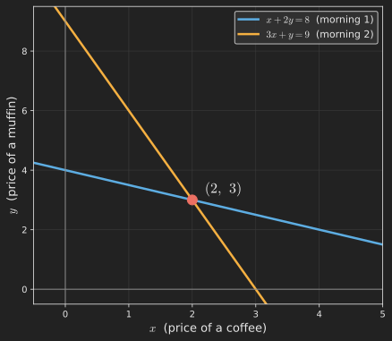
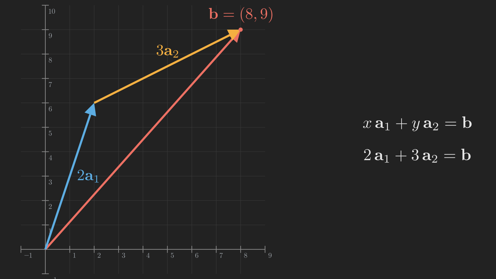

# Introduction

Welcome to the first post in a series that walks through linear algebra from the ground up. The series follows the legendary lecture course by Professor Gilbert Strang, MIT's 18.06 [@MIT18.06SCLinearAlgebra2011], and his textbook *Introduction to Linear Algebra* [@Strang2023IntroductionLinearAlgebra]. My goal is not to hand you a reference manual full of formulas, but to take you on a guided journey where each idea grows naturally out of the one before it. If you have ever felt that linear algebra was a bag of disconnected tricks, this series is my attempt to show you the single story running underneath all of it.

Let us start with something small and familiar.

Imagine you visit the same cafe two mornings in a row. On the first morning you buy 1 coffee and 2 muffins, and the bill comes to 8 dollars. On the second morning you buy 3 coffees and 1 muffin, and the bill comes to 9 dollars. Later you get curious: what is the price of a single coffee, and what is the price of a single muffin?

You do not know either price, so let us give them names. Let $x$ be the price of a coffee and $y$ be the price of a muffin. The two mornings translate into two equations:

$$
\begin{align*}
  x + 2y &= 8,\\
  3x + y &= 9.
\end{align*}
$$

This is a system of two linear equations in two unknowns. "Linear" because the unknowns $x$ and $y$ appear only on their own, never squared, multiplied together, or tucked inside a function. The whole of this first post is about a deceptively simple question: how do we find the $x$ and $y$ that satisfy both equations at once, and what is really going on when we do?

## The journey ahead

Here is the trail map for the entire series. We are standing at the very first stop, "Geometry". Do not worry about the later names yet; this map is here so that at every point you can see where we are and where we are going. I will bring it back, with our current location highlighted, at the start of every post.

```{mermaid}
%%| fig-align: center
flowchart LR
    subgraph ACT1["Act I: Solving Ax = b"]
        P1["1. Geometry"] --> P2["2. Elimination & LU"] --> P3["3. Column Space & Nullspace"] --> P4["4. Rank & Complete Solution"]
    end
    subgraph ACT2["Act II: Structure & Orthogonality"]
        P5["5. Basis & Four Subspaces"] --> P6["6. Graphs & Networks"] --> P7["7. Projections"] --> P8["8. Least Squares & QR"] --> P9["9. Determinants"]
    end
    subgraph ACT3["Act III: Eigenvalues & Beyond"]
        P10["10. Eigenvalues"] --> P11["11. Diagonalization & ODEs"] --> P12["12. Markov & Fourier"] --> P13["13. Positive Definite"] --> P14["14. Complex & FFT"] --> P15["15. Jordan Form"] --> P16["16. SVD"] --> P17["17. Transformations"] --> P18["18. Pseudoinverse"]
    end
    ACT1 --> ACT2 --> ACT3

    style P1 fill:#10a37f,color:#fff
```

For this post, the plan is short and concrete. We will solve our little cafe system in two completely different ways, the *row picture* and the *column picture*. The row picture is the one you probably met in school. The column picture is the one that, once it clicks, quietly reorganizes how you think about everything that follows.

# The beginner's move: the row picture

If you have solved a system like this before, your instinct is probably to draw a graph. Each equation, on its own, describes a straight line. Every point $\left(x, y\right)$ on that line is a pair of prices that would satisfy that one equation. So let us plot both lines and look for the place where they agree.

Rearranging each equation to the familiar "$y = \dots$" form makes them easy to plot:

$$
\begin{align*}
  x + 2y = 8 \quad &\Longrightarrow \quad y = 4 - \tfrac{1}{2}x,\\
  3x + y = 9 \quad &\Longrightarrow \quad y = 9 - 3x.
\end{align*}
$$

@fig-row_picture shows both lines.

{#fig-row_picture fig-align="center" width=75%}

The first line collects every $\left(x, y\right)$ consistent with the first morning; the second line collects every $\left(x, y\right)$ consistent with the second morning. A pair of prices that explains *both* mornings has to lie on *both* lines at once, and there is exactly one such place: where they cross. Reading it off the graph, the crossing point is

$$
\left(x, y\right) = \left(2, 3\right).
$$

So a coffee costs 2 dollars and a muffin costs 3 dollars. We can sanity check against the original bills: $2 + 2 \cdot 3 = 8$ for the first morning, and $3 \cdot 2 + 3 = 9$ for the second. Both check out.

This is the **row picture**: we take the equations one row at a time, draw each as a line (or, with three unknowns, a plane), and hunt for the point they all share. It is intuitive, and it is exactly how most of us first learn to solve systems.

But there is a second way to read the very same two equations, and it is going to be the more powerful of the two. Let me show you.

# The same equations, seen by columns

Watch what happens if, instead of reading the system row by row, we group the numbers into vertical stacks. Our system

$$
\begin{align*}
  x + 2y &= 8,\\
  3x + y &= 9,
\end{align*}
$$

can be rewritten by pulling the $x$ terms into one column, the $y$ terms into another, and the right-hand sides into a third:

$$
x
\begin{bmatrix} 1 \\ 3 \end{bmatrix}
+
y
\begin{bmatrix} 2 \\ 1 \end{bmatrix}
=
\begin{bmatrix} 8 \\ 9 \end{bmatrix}.
$$ {#eq-column_picture_equation}

Take a moment to confirm this says exactly the same thing as the two equations. The top entries read $x \cdot 1 + y \cdot 2 = 8$, and the bottom entries read $x \cdot 3 + y \cdot 1 = 9$. Nothing has changed except how we have grouped the numbers.

But the *meaning* has changed completely. We now have three vectors. Let us name them so we can talk about them:

$$
\vb{a}_1 = \begin{bmatrix} 1 \\ 3 \end{bmatrix}, \qquad
\vb{a}_2 = \begin{bmatrix} 2 \\ 1 \end{bmatrix}, \qquad
\vb{b} = \begin{bmatrix} 8 \\ 9 \end{bmatrix}.
$$

(Following the convention I will use throughout the series, vectors are written as lowercase bold letters like $\vb{a}_1$ and $\vb{b}$.) In this language, @eq-column_picture_equation becomes

$$
x\, \vb{a}_1 + y\, \vb{a}_2 = \vb{b}.
$$

Read that out loud: "some amount $x$ of the vector $\vb{a}_1$, plus some amount $y$ of the vector $\vb{a}_2$, should add up to the vector $\vb{b}$." We are no longer looking for where two lines cross. We are asking: **how much of each column vector do we combine to reach the target $\vb{b}$?** A weighted sum like this, where we scale each vector and add the results, is called a *linear combination*. It is the single most important operation in all of linear algebra, and we have just met it.

We already know the answer from the row picture: $x = 2$ and $y = 3$. Let us see it as a combination of columns:

$$
x\, \vb{a}_1 + y\, \vb{a}_2 =
2 \begin{bmatrix} 1 \\ 3 \end{bmatrix}
+ 3 \begin{bmatrix} 2 \\ 1 \end{bmatrix}
= \begin{bmatrix} 2 \\ 6 \end{bmatrix} + \begin{bmatrix} 6 \\ 3 \end{bmatrix}
= \begin{bmatrix} 8 \\ 9 \end{bmatrix}
= \vb{b}. \checkmark
$$

@fig-column_picture draws this. We start at the origin and lay down $2\vb{a}_1$ (two copies of $\vb{a}_1$). Then, starting from the tip of that arrow, we lay down $3\vb{a}_2$ (three copies of $\vb{a}_2$). Adding vectors tip to tail like this, we land exactly on $\vb{b}$.

{#fig-column_picture fig-align="center" width=80%}

Solving the system, in this picture, means finding the right amounts of each column so that their combination reaches $\vb{b}$. The animation below shows the construction building up: first the $2\vb{a}_1$ step from the origin, then the $3\vb{a}_2$ step landing us exactly on $\vb{b}$.



::: {.callout-note}
## Why bother with a second picture?

The row picture answers "where do the lines cross?" The column picture answers "what combination of these vectors reaches the target?" For two equations in two unknowns they feel interchangeable. But as we move to bigger systems and more abstract spaces, the row picture gets hard to draw and hard to reason about, while the column picture keeps paying dividends. Almost every big idea ahead, the column space, rank, the four fundamental subspaces, least squares, is the column picture grown up. It is worth getting comfortable with it now, while the example is this friendly.
:::

# Packaging it up: the equation $\vb{A}\vb{x} = \vb{b}$

We have two column vectors $\vb{a}_1$ and $\vb{a}_2$. It is natural to set them side by side into a single grid of numbers, which we call a *matrix* and write with an uppercase bold letter:

$$
\vb{A} =
\begin{bmatrix}
  \uparrow & \uparrow \\
  \vb{a}_1 & \vb{a}_2 \\
  \downarrow & \downarrow
\end{bmatrix}
=
\begin{bmatrix}
  1 & 2 \\
  3 & 1
\end{bmatrix}.
$$

Notice the columns of $\vb{A}$ are exactly the coefficient columns from our system: the first column holds the coffee coefficients, the second holds the muffin coefficients. If we also stack the unknowns into a vector $\vb{x} = \begin{bmatrix} x \\ y \end{bmatrix}$, then the whole system collapses into three symbols:

$$
\vb{A}\vb{x} = \vb{b}.
$$

This is the equation we will be staring at, in one form or another, for the entire series. But to read it correctly we need to agree on what it means to multiply a matrix $\vb{A}$ by a vector $\vb{x}$. The column picture tells us exactly what it should mean:

$$
\vb{A}\vb{x} =
\begin{bmatrix} 1 & 2 \\ 3 & 1 \end{bmatrix}
\begin{bmatrix} x \\ y \end{bmatrix}
= x \begin{bmatrix} 1 \\ 3 \end{bmatrix} + y \begin{bmatrix} 2 \\ 1 \end{bmatrix}.
$$

In words: **a matrix times a vector is a linear combination of the columns of the matrix, using the entries of the vector as the amounts.** You may have learned matrix-vector multiplication as a row-by-row dot-product recipe, and that recipe gives the same numbers. But the "combination of columns" view is the one to keep in your head, because it is what makes $\vb{A}\vb{x} = \vb{b}$ meaningful: solving it is finding the amounts $\vb{x}$ that combine matrix $\vb{A}$'s columns into $\vb{b}$.

# Stepping up to three dimensions and beyond

Our example had two equations and two unknowns, which is why everything lived in a flat, two-dimensional plane. What changes with three unknowns?

In the **row picture**, each equation in three unknowns is no longer a line but a flat plane floating in three-dimensional space. Three equations give three planes, and a solution is a point lying on all three at once. Often that is a single point, where the three planes meet like the corner of a room. The trouble is that drawing three planes and spotting their common point by eye is genuinely hard. The row picture starts to fight us.

In the **column picture**, almost nothing changes conceptually. We now have three column vectors living in three-dimensional space, and we ask the same question as before: what amounts $x$, $y$, $z$ combine the three columns into the target $\vb{b}$?

$$
x\, \vb{a}_1 + y\, \vb{a}_2 + z\, \vb{a}_3 = \vb{b}.
$$

That is the quiet power of the column picture: it reads the same whether we have 2 unknowns, 3 unknowns, or 500. For a general system of $m$ equations in $n$ unknowns, we collect the coefficient columns into an $m \times n$ matrix $\vb{A}$, stack the unknowns into $\vb{x}$, and write $\vb{A}\vb{x} = \vb{b}$. Solving it always means the same thing: find the combination of $\vb{A}$'s $n$ columns that produces $\vb{b}$.

# The question that drives the whole subject

The column picture lets us ask a question that the row picture hides. Forget our specific target $\vb{b}$ for a moment, and instead let the amounts $x$ and $y$ range over *all* possible values. As they do, the combination $x\, \vb{a}_1 + y\, \vb{a}_2$ sweeps out some set of reachable points. The natural question is: **which target vectors $\vb{b}$ can we reach?**

For our cafe matrix, the two columns

$$
\vb{a}_1 = \begin{bmatrix} 1 \\ 3 \end{bmatrix} \quad \text{and} \quad
\vb{a}_2 = \begin{bmatrix} 2 \\ 1 \end{bmatrix}
$$

point in genuinely different directions. By scaling and adding them, we can reach *any* point in the plane. Every possible $\vb{b}$ is reachable, and as it turns out, reachable in exactly one way. A matrix like this, whose columns let us reach everything with a unique recipe, is called **invertible**, or **nonsingular**.

The animation below makes this vivid. The dimmed arrows are our reference columns $\vb{a}_1$ and $\vb{a}_2$. As we vary the weights $x$ and $y$, watch the scaled vectors $x\, \vb{a}_1$ and $y\, \vb{a}_2$ add tip to tail to form the resultant $\vb{b}$, whose tip traces out a two-dimensional region. Because the two columns point in different directions, that region is the whole plane: every target is within reach.



Now imagine a different, unluckier matrix, one where the second column was just a multiple of the first, say $\vb{a}_2 = 2\vb{a}_1$, so both columns pointed along the same line. No matter how we scale and add two vectors stuck on one line, their combination never leaves that line. Most targets $\vb{b}$ would be unreachable, and the few that do lie on the line could be reached in infinitely many ways. Such a matrix is called **singular**. The columns are, in a sense we will make precise later, redundant.

Sweeping the weights now tells a very different story. However we choose $x$ and $y$, the combination stays pinned to a single line through the origin, so any target $\vb{b}$ off that line (like the one marked with a cross) can never be reached.



That single question, which vectors $\vb{b}$ can the columns of $\vb{A}$ reach, is the seed of an enormous amount of what follows. When we give the set of all reachable combinations a name (the *column space*), count how many genuinely independent directions the columns provide (the *rank*), and organize the leftover structure (the *four fundamental subspaces*), we are just answering this question in ever sharper form. We met it here, in a story about coffee and muffins.

# Where we are, and where we go next

Let us take stock. We started with a tiny everyday puzzle and found two ways to see it:

- The **row picture** reads the system one equation at a time, as lines (or planes) whose crossing point is the solution.
- The **column picture** reads the system as a single request: combine the columns of $\vb{A}$, in the right amounts $\vb{x}$, to build the target $\vb{b}$. This is the meaning of $\vb{A}\vb{x} = \vb{b}$, and it is the view we will carry forward.

We also found, hiding inside the column picture, the question that organizes the entire subject: which targets can the columns reach, and when is the recipe unique?

There is one loose end, though. We solved our $2 \times 2$ system by *drawing a graph and reading off the crossing point*. That is fine for two equations, but imagine ten equations in ten unknowns. There is no graph paper for that, and eyeballing is hopeless. We need a systematic, mechanical procedure that solves any system, no matter how large, without relying on a picture. That procedure is **elimination**, and it hides a beautiful surprise: the act of solving a system is secretly the act of *factoring* its matrix. That is where we go in the next post.

If you would like a faster, machine-learning-flavored tour of these ideas before we get there, you can also peek at my earlier overview, [Linear Algebra for Machine Learning](../linear-algebra-for-ml/index.qmd). This series, by contrast, is the slow and thorough climb.
