# Project Planning

## Problem Statement

### Business Context

Consider that we are an influencer management company seeking to expand our network by attracting more influencers to join our platform. Due to a limited marketing budget, traditional advertising channels are not viable for us. To overcome this, we aim to offer a solution that addresses a significant pain point for influencers, thereby encouraging them to engage with our company.

### Business Problem

#### Need to Attract More Influencers


- Objective:
    - Increase our influencer clientele to enhance our service offerings to brands and stay competitive.
- Challenge:
    - Limited marketing budget restricts our ability to reach and engage potential influencer clients through conventional means.

#### Identifying Influencer Pain Point

- Understanding Influencer Challenges:
    - To effectively attract influencers, we need to understand and address the key challenges they face.
- Research Insight:
    - Influencers, especially those with large followings, struggle with managing and interpreting the vast amount of feedback they receive via comments on their content.

#### Big Influencers Face Issues with Comments Analysis

- Volume of Comments:
    - High-profile influencers receive thousands of comments on their videos, making manual analysis impractical.
- Time Constraints:
    - Influencers often lack the time to sift through comments to extract meaningful insights.
- Impact on Content Strategy:
    - Without efficient comment analysis, influencers miss opportunities to understand audience sentiment, address concerns, and tailor their content effectively.

## Our Solution

To directly address the significant pain point faced by big influencers—managing and interpreting vast amounts of comments data—we present the "Influencer Insights" Chrome extension. This tool is designed to empower influencers by providing in-depth analysis of their YouTube video comments, helping them make data-driven decisions to enhance their content and engagement strategies.

### Key Features of the Extension

#### Sentiment Analysis of Comments

- Real-Time Sentiment Classification:
    - The extension performs real-time analysis of all comments on a YouTube video, classifying each as positive, neutral, or negative.
- Sentiment Distribution Visualization:
    - Displays the overall sentiment distribution with intuitive graphs or charts (e.g., pie charts or bar graphs showing percentages like 70% positive, 20% neutral, 10% negative).
- Detailed Sentiment Insights:
    - Allows users to drill down into each sentiment category to read specific comments classified under it.
- Trend Tracking:
    - Monitors how sentiment changes over time, helping influencers identify how different content affects audience perception.

#### Additional Comments Analysis Features

- Word Cloud Visualization:
    - Generates a word cloud showcasing the most frequently used words and phrases in the comments.
    - Helps quickly identify trending topics, keywords, or recurring themes.
- Average Comment Length:
    - Calculates and displays the average length of comments, indicating the depth of audience engagement.
- Export Data Functionality:
    - Enables users to export analysis reports and visualizations in various formats (e.g., PDF, CSV) for further use or sharing with team members.

## Challenges

### Data

The first problem any data science project faces is about the data. There are various problems that we can face in this project. Some are as follows.

#### Availability

The problem we are solving is a supervised machine learning problem. So, we need a supervised dataset such that we have the comment and its associated label, i.e., whether the sentiment of the comment is positive, negative, or neutral. Obviously, finding this data is a challenge. One option is to use the [YouTube Data API](https://developers.google.com/youtube/v3/docs/comments), but this will only get us the comments and not the associated labels. Fortunately, there is a dataset available online on Hugging Face. [This is the link](https://huggingface.co/datasets/AmaanP314/youtube-comment-sentiment) to the data. Along with the comment and its associated sentiment (positive, neutral, and negative), there are also other attributes of the comments available, e.g., number of likes, number of replies, etc.

#### Lack of General Kind of Dataset

We cannot get a universal dataset that is representative of all types of content on YouTube. This means that our model won't generalize well on all types of YouTube videos.

#### Multi-Language Comments

YouTube comments can have many languages, and the prevalence of these languages is also varying. Some comments have multiple languages too. Further, some comments use English script for typing other languages, e.g., using English to type Hindi words. So, it is quite difficult to train a model for all languages.

#### Spam and Bot Comments

Identifying and removing such meaningless comments from training the model is difficult. Such comments can bias the model and worsen its accuracy.

#### Slang, Emoji, and Informal Comments

Understanding the sentiment of such comments is a challenge.

#### Sarcastic Comments

It is easy for humans to understand sarcastic comments because they already know the context. However, the same is very difficult for a model to learn. Hence, such comments are also a problem during training.

#### Evolving Language Usage

Language evolves with each generation. There are many terms that were introduced by Generation Z (Gen-Z) that were not used before. So, comments by Gen-Z users will be different from users from other generations. This is also known as data drift. Modeling this behavior is difficult.

#### Privacy and Data Compliance

If you build a model using some data, you are always answerable to a company using your model. So, the source of the data is crucial.

### Building an Efficient Model

We can already see that building an efficient model, due to the considerations indicated in the previous subsection, is already challenging. On top of that, noise, variability, class imbalance, etc., can make it even more difficult to train an efficient model.

### Latency

Whenever someone opens a YouTube video, we want the extension to give results quickly. In other words, we want the latency of the model to be low. This again is a challenge given the complexity of the problem. We definitely would need to implement asynchronous programming.

### User Experience

We would need to make sure that the user experience is good. If it is bad, users will definitely avoid using the extension. Hence, we will need to design it accordingly.

## Workflow

The steps in the workflow of this project are:

1. Data collection,
2. Data preprocessing,
3. EDA,
4. Model building, hyperparameter tuning and evaluation alongside experiment tracking,
5. Building a DVC pipeline,
6. Registering the model,
7. Building the API using Flask,
8. Developing the Chrome extension,
9. Setting up CI/CD pipeline,
10. Testing,
11. Building the Docker image and pushing to ECR,
12. Deployment using AWS.

## Tools and Technologies

We will use the following tools and technologies in this project.

### Version Control and Collaboration

#### Git

- Purpose:
    - Distributed version control system for tracking changes in source code.
- Usage:
    - Manage codebase, track changes, and collaborate with team members.


#### GitHub

- Purpose:
    - Hosting service for Git repositories with collaboration features.
- Usage:
    - Store repositories, manage issues, pull requests, and facilitate team collaboration.

### Data Management and Versioning

#### DVC (Data Version Control)

- Purpose:
    - Version control system for tracking large datasets and machine learning models.
- Usage:
    - Version datasets and machine learning pipelines, enabling reproducibility and collaboration.

#### AWS S3 (Simple Storage Service)

- Purpose:
    - Scalable cloud storage service.
- Usage:
    - Store datasets, pre-processed data, and model artifacts tracked by DVC.

### Machine Learning and Experiment Tracking

#### Python

- Purpose:
    - Programming language for backend development and machine learning.

#### Machine Learning Libraries

- scikit-learn:
    - Purpose: Library for classical machine learning algorithms.
    - Usage: Implement baseline models and preprocessing techniques.

#### NLP Libraries

- NLTK (Natural Language Toolkit)
    - Purpose: Platform for building Python programs to work with human language data.
    - Usage: Tokenization, stemming, and other basic NLP tasks.
- spaCy:
    - Purpose: Industrial-strength NLP library.
    - Usage: Advanced NLP tasks like named entity recognition, part-of-speech tagging.

#### MLflow

- Purpose:
    - Platform for managing the ML lifecycle, including experimentation, reproducibility, deployment, and a central model registry.
- Usage:
    - Track experiments, log parameters, metrics, and artifacts; manage model versions.

#### MLflow Model Registry

- Purpose:
    - Component of MLflow for managing the full lifecycle of ML models.
- Usage:
    - Register models, manage model stages (e.g., staging, production), and collaborate on model development.

#### Optuna

- For Hyperparameter tuning.

### Continuous Integration / Continuous Delivery (CI/CD)

#### GitHub Actions

- Purpose:
    - Automation platform that enables CI/CD directly from GitHub repositories.
- Usage:
    - Automate testing, building, and deployment pipelines.
    - Trigger workflows on events like code commits or pull requests.

### Cloud Services and Infrastructure

#### AWS (Amazon Web Services)

- AWS EC2 (Elastic Compute Cloud):
    - Purpose: Scalable virtual servers in the cloud.
    - Usage: Host backend services, APIs, and model servers.
- AWS Auto Scaling Groups:
    - Purpose: Automatically adjust the number of EC2 instances to handle load changes.
    - Usage:
        - Ensure that the application scales out during demand spikes to maintain performance.
        - Scale in during low demand periods to reduce costs.
        - Maintain application availability by automatically adding or replacing instances as needed.
- AWS CodeDeploy:
    - Purpose: Deployment service that automates application deployments to various compute services like EC2, Lambda, and on-premises servers.
    - Usage:
        - Automate the deployment process of backend services and machine learning models to AWS EC2 instances or AWS Lambda.
        - Integrate with GitHub Actions to create a seamless CI/CD pipeline that deploys code changes automatically upon successful testing.
- AWS CloudWatch:
    - Purpose: Monitoring and observability service.
    - Usage: Monitor application logs, set up alerts, and track performance metrics.
- AWS IAM (Identity and Access Management):
    - Purpose: Securely manage access to AWS services.
    - Usage: Control access permissions for users and services.

### Programming Languages and Libraries

#### Python

- Purpose:
    - Backend development, data processing, machine learning.
- Usage:
    - Implement APIs, machine learning models, data pipelines.

#### JavaScript

- Purpose:
    - Frontend development, especially for web applications and browser extensions.
- Usage:
    - Develop the Chrome extension's user interface and functionality.

#### HTML and CSS

- Purpose:
    - Markup and styling languages for web content.
- Usage:
    - Structure and style the Chrome extension's interface.

#### Data Processing Libraries

- Pandas:
    - Purpose: Data manipulation and analysis.
    - Usage: Handle tabular data, preprocess datasets.
- NumPy:
    - Purpose: Fundamental package for scientific computing with Python.
    - Usage: Perform numerical operations, handle arrays.

### Frontend Development Tools

#### Chrome Extension APIs

- Purpose:
    - APIs provided by Chrome for building extensions.
- Usage:
    - Interact with browser features, modify web page content, manage extension behaviour.

#### Browser Developer Tools

- Purpose:
    - Built-in tools for debugging and testing web applications.
- Usage:
    - Inspect elements, debug JavaScript, monitor network activity.

#### Code Editors and IDEs

- Visual Studio Code:
    - Purpose: Source code editor.
    - Usage: Write and edit code for both frontend and backend development.

### Testing and Quality Assurance Tools

#### Testing Frameworks

- Pytest:
    - Purpose: Testing framework for Python.
    - Usage: Write and run unit tests for backend code and data processing scripts.
- Unittest:
    - Purpose: Built-in Python testing framework.
    - Usage: Write unit tests for Python code.
- Jest:
    - Purpose: JavaScript testing framework.
    - Usage: Write and run tests for JavaScript code in the Chrome extension.

### Project Management and Communication

#### Project Management Tools

- Jira:
    - Purpose: Issue and project tracking software.
    - Usage: Manage tasks, track progress, and coordinate team activities.

#### Communication Tools

- Slack:
    - Purpose: Team communication platform.
    - Usage: Facilitate real-time communication among team members.
- Microsoft Teams:
    - Purpose: Collaboration and communication platform.
    - Usage: Chat, meet, call, and collaborate in one place.

### DevOps and MLOps Tools

#### Docker

- Purpose:
    - Containerization platform.
- Usage:
    - Package applications and dependencies into containers for consistent deployment.

### Security and Compliance

#### SSL/TLS Certificates

- Purpose:
    - Secure communications over a computer network.
- Usage:
    - Encrypt data between users and backend services.

### Monitoring and Logging

#### Logging Tools

- AWS CloudWatch Logs:
    - Purpose: Monitor, store, and access log files.
    - Usage: Collect and monitor logs from AWS resources.

#### Monitoring Tools

- Prometheus (Optional)
    - Purpose: Open-source monitoring system.
    - Usage: Collect and store metrics, generate alerts.
- Grafana:
    - Purpose: Visualization and analytics software.
    - Usage: Create dashboards to visualize metrics.

### API Development and Testing

#### Frameworks

- Flask:
    - Purpose: Lightweight WSGI web application framework.
    - Usage: Build RESTful APIs for backend services.

#### API Testing Tools

- Postman:
    - Purpose: API development environment.
    - Usage: Design, test, and document APIs.

### Code Quality and Documentation

#### Code Linters and Formatters

- Pylint:
    - Purpose: Code analysis for Python.
    - Usage: Enforce coding standards, detect code smells.

#### Documentation Generation

- Sphinx
    - Purpose: Generate documentation from source code.
    - Usage: Create project documentation automatically.

### Additional Tools and Libraries

#### Visualization Libraries

- Matplotlib:
    - Purpose: Plotting library for Python.
    - Usage: Create static, animated, and interactive visualizations.
- Seaborn:
    - Purpose: Statistical data visualization.
    - Usage: Generate high-level interface for drawing attractive graphics.
- D3.js
    - Purpose: JavaScript library for producing dynamic, interactive data visualizations.
    - Usage: Create word clouds and other visual elements in the Chrome extension.

#### Data Serialization Formats

- JSON:
    - Purpose: Lightweight data interchange format.
    - Usage: Transfer data between frontend and backend services.

# EDA & Preprocessing

## Jupyter Notebook

[This is the Jupyter notebook](https://github.com/SushrutGaikwad/youtube-comment-intelligence/blob/main/notebooks/01_EDA.ipynb) in which EDA was performed.

## Introduction

Data preprocessing and EDA were performed in cycles. First, basic data preprocessing was done; then, based on the results, EDA was carried out, and this cycle was repeated.

## `df.info()`

The following is the output of the `info` method on the raw data:

```text
<class 'pandas.core.frame.DataFrame'>
RangeIndex: 1032225 entries, 0 to 1032224
Data columns (total 12 columns):
 #   Column           Non-Null Count    Dtype         
---  ------           --------------    -----         
 0   CommentID        1032225 non-null  object        
 1   VideoID          1032225 non-null  object        
 2   VideoTitle       1032225 non-null  object        
 3   AuthorName       1031594 non-null  object        
 4   AuthorChannelID  1032225 non-null  object        
 5   CommentText      1032225 non-null  object        
 6   Sentiment        1032225 non-null  object        
 7   Likes            1032225 non-null  int64         
 8   Replies          1032225 non-null  int64         
 9   PublishedAt      1032225 non-null  datetime64[ns]
 10  CountryCode      1032225 non-null  object        
 11  CategoryID       1032225 non-null  int64         
dtypes: datetime64[ns](1), int64(3), object(8)
memory usage: 94.5+ MB
```

As we can see, there are more than a million rows (or comments) in the data.

## Distribution of the Sentiments

It is crucial to figure out whether the data is balanced with respect to the label, which in our case is the column `Sentiment`. @fig-class_imbalance shows the distribution of this column.

{#fig-class_imbalance fig-align="center" width=100% .invert}

As we can see, the data is quite well balanced. So there is no need of using balancing techniques like SMOTE.

## Missing Values

The data contained a tiny amount (about 0.06%) in the column `AuthorName`. We could have dropped these values. But as the comments corresponding to these are not missing, we chose to keep them. However, as we went ahead with data preprocessing of the comments themselves, we found missing values in the form of empty strings. But again, this was a tiny fraction of the entire dataset. We kept on dropping these from the data.

## Duplicate Comments

There were about 366 duplicate comments in the data. As this number is tiny compared to the entire data, we only kept their first occurrence.

## Lowercase

For standardizing the comments, we converted them all to lowercase.

## Expanding Chat Acronyms

All the chat acronyms were exxpanded into their full forms and then again converted to lowercase using the following dictionary:

```python
acronyms = {
    'a3': 'Anytime, Anywhere, Anyplace',
    'adih': 'Another Day In Hell',
    'afk': 'Away From Keyboard',
    'afaik': 'As Far As I Know',
    'asap': 'As Soon As Possible',
    'asl': 'Age, Sex, Location',
    'bae': 'Before Anyone Else',
    'bak': 'Back At Keyboard',
    'bbl': 'Be Back Later',
    'bbs': 'Be Back Soon',
    'bfn': 'Bye For Now',
    'b4n': 'Bye For Now',
    'brb': 'Be Right Back',
    'bruh': 'Bro',
    'brt': 'Be Right There',
    'bsaaw': 'Big Smile And A Wink',
    'btw': 'By The Way',
    'bwl': 'Bursting With Laughter',
    'csl': "Can't Stop Laughing",
    'cu': 'See You',
    'cul8r': 'See You Later',
    'cya': 'See You',
    'dm': 'Direct Message',
    'faq': 'Frequently Asked Questions',
    'fc': 'Fingers Crossed',
    'fimh': 'Forever In My Heart',
    'fomo': 'Fear Of Missing Out',
    'fr': 'For Real',
    'fwiw': "For What It's Worth",
    'fyp': 'For You Page',
    'fyi': 'For Your Information',
    'g9': 'Genius',
    'gg': 'Good Game',
    'gmta': 'Great Minds Think Alike',
    'gn': 'Good Night',
    'goat': 'Greatest Of All Time',
    'gr8': 'Great!',
    'hbd': 'Happy Birthday',
    'ic': 'I See',
    'icq': 'I Seek You',
    'idc': "I Don't Care",
    'idk': "I Don't Know",
    'ifyp': 'I Feel Your Pain',
    'ilu': 'I Love You',
    'ily': 'I Love You',
    'imho': 'In My Honest/Humble Opinion',
    'imu': 'I Miss You',
    'imo': 'In My Opinion',
    'iow': 'In Other Words',
    'irl': 'In Real Life',
    'iykyk': 'If You Know, You Know',
    'jk': 'Just Kidding',
    'l8r': 'Later',
    'ldr': 'Long Distance Relationship',
    'lmk': 'Let Me Know',
    'lmao': 'Laughing My Ass Off',
    'lol': 'Laughing Out Loud',
    'ltns': 'Long Time No See',
    'm8': 'Mate',
    'mfw': 'My Face When',
    'mid': 'Mediocre',
    'mrw': 'My Reaction When',
    'mte': 'My Thoughts Exactly',
    'nvm': 'Never Mind',
    'nrn': 'No Reply Necessary',
    'npc': 'Non-Player Character',
    'oic': 'Oh I See',
    'op': 'Overpowered',
    'pov': 'Point Of View',
    'prt': 'Party',
    'prw': 'Parents Are Watching',
    'rofl': 'Rolling On The Floor Laughing',
    'roflol': 'Rolling On The Floor Laughing Out Loud',
    'rotflmao': 'Rolling On The Floor Laughing My Ass Off',
    'rn': 'Right Now',
    'sk8': 'Skate',
    'sus': 'Suspicious',
    'tbh': 'To Be Honest',
    'tfw': 'That Feeling When',
    'thx': 'Thank You',
    'tldr': "Too Long, Didn't Read",
    'tntl': 'Trying Not To Laugh',
    'ttfn': 'Ta-Ta For Now!',
    'ttyl': 'Talk To You Later',
    'u2': 'You Too',
    'u4e': 'Yours For Ever',
    'w8': 'Wait',
    'wb': 'Welcome Back',
    'wtf': 'What The Fuck',
    'wtg': 'Way To Go!',
    'wuf': 'Where Are You From?',
    'wyd': 'What You Doing?',
    'wywh': 'Wish You Were Here',
    'zzz': 'Sleeping, Bored, Tired'
}
```

This dictionary was derived from [this text file](https://github.com/rishabhverma17/sms_slang_translator/blob/master/slang.txt).

## Leading and Trailing Whitespaces

A very tiny fraction of comments had either a leading whitespace or a trailing white space or both. Again, to standardize all the comments, we removed these.

## URLs

URLs are generally not helpful in predicting the sentiment of a comment. So, we removed only the URL part of the comment and retained the remaining text.

## Newline and Tab Character

A significant amount of comments in the data consisted of either the newline character (`\n`) or the tab character (`\t`) or both. We replaced these characters with a simple whitespace character (`" "`).

## Emojis

Emojis are new ways of communicating thoughts. They do carry information about the comment's sentiment. To deal with them, we "demojized" the comments using the [`emoji` package](https://pypi.org/project/emoji/). In other words, we converted the emojis to their textual meanings in the comment to retain their sentiment.

## Word Count

We created a new column `word_count` that contains the number of words present in each comment. @fig-word_count_distribution shows the distribution of `word_count`.

{#fig-word_count_distribution fig-align="center" width=100% .invert}

As expected, we can see a huge right skew. In other words, the overwhelming majority of comments have less number of words and a tiny proportion have a lot of words.

### Word Count by Sentiment

@fig-word_count_distribution_by_sentiment shows the distribution of `word_count` by `Sentiment`.

{#fig-word_count_distribution_by_sentiment fig-align="center" width=100% .invert}

@fig-word_count_distribution_by_sentiment_zoomed_in shows a zoomed-in version of @fig-word_count_distribution_by_sentiment.

{#fig-word_count_distribution_by_sentiment_zoomed_in fig-align="center" width=100% .invert}

Roughly speaking, we can see that the neutral comments are least wordy, whereas the negative ones are the most wordy.

### Box Plot of Word Count

@fig-word_count_box_plot shows the box plot of `word_count`, whereas @fig-word_count_box_plot_by_sentiment shows the same for each `Sentiment`.

{#fig-word_count_box_plot fig-align="center" width=100% .invert}

{#fig-word_count_box_plot_by_sentiment fig-align="center" width=100% .invert}

As expected, `word_count` has a lot of outliers. This was also clear when we found that this column has a huge right skew in @fig-word_count_distribution. Further, this column has more or less similar outlier distribution for all the sentiments. However, the most extreme outlier belongs to the negative sentiment.

### Bar Plot of median Word Count by Sentiment

@fig-word_count_median_bar_plot_by_sentiment shows this bar plot.

{#fig-word_count_median_bar_plot_by_sentiment fig-align="center" width=100% .invert}

Again, we can see that typically neutral comments are the shortest, whereas the negative ones are the longest.

## Stop Words

Stop words are common grammatical words like "the", "a", "an", "is", "and", etc., that add little semantic meaning to a sentence. Hence, it is a good idea to filter them out during sentiment analysis. We used the `nltk` package to work with stop words.

### Number of Stop Words

We created a new column `num_of_stop_words` that contains the number of stop words in each comment. @fig-stopwords_distribution shows its distribution.

{#fig-stopwords_distribution fig-align="center" width=100% .invert}

As expected, it looks very similar to the distribution of `word_count` (@fig-word_count_distribution). It has a very heavy right skew.

### Stop Words by Sentiment

@fig-num_of_stop_words_distribution_by_sentiment shows the distribution of the number of stop words for each sentiment.

{#fig-num_of_stop_words_distribution_by_sentiment fig-align="center" width=100% .invert}

@fig-num_of_stop_words_distribution_by_sentiment_zoomed_in shows a zoomed-in version of the same.

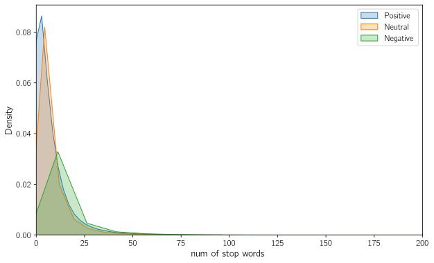{#fig-num_of_stop_words_distribution_by_sentiment_zoomed_in fig-align="center" width=100% .invert}

Again, the distribution is more or less similar to `word_count`.

### Bar Plot of median Stop Words by Sentiment

@fig-stopwords_median_bar_plot_by_sentiment shows this bar plot.

{#fig-stopwords_median_bar_plot_by_sentiment fig-align="center" width=100% .invert}

Again, this is very similar to `word_count` (@fig-word_count_median_bar_plot_by_sentiment).

### Most Common Stop Words

@fig-top-25_most_common_stop_words shows the top-25 most common stop words in the data.

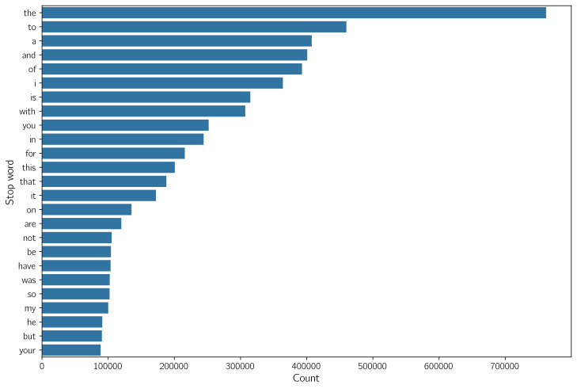{#fig-top-25_most_common_stop_words fig-align="center" width=100% .invert}

We can see that the word "not" is used quite a lot in the comments. This word can completely change the sentiment of a sentence. Hence, we didn't remove these stop words. Other stop words we did not remove are "but", "however", "no", and "yet".

## Characters

We created another column called `num_chars` that counts the number of characters each comment has. We expect this column to follow the same distribution as `word_count`. When we printed the value counts of all the characters present in the data, we found many non-English characters as well. As we currently are working with sentiment analysis of English comments, we removed them.

### Punctuations

Most of the punctuation marks have little to do with the sematic meaning of the sentence. However, exceptions are the exclamation mark and the question mark. So, we instead kept these two types of punctuations and removed the rest. Further, also replaced repeating exclamation marks or question marks with a single instance along with the text `"repeat"`. Finally, we also replaced `"..."` with `"ellipsis"`.

## Bigrams

Bigrams are a set of two consecutive words in the data. It is generally helpful to find the most common bigrams. @fig-top-25_most_common_bigrams shows the top-25 most repeating bigrams in the data.

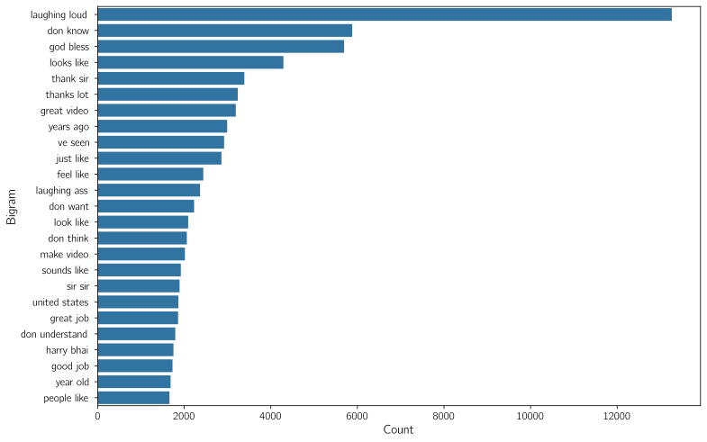{#fig-top-25_most_common_bigrams fig-align="center" width=100% .invert}

It seems like the most frequent bigrams do not indicate a clear pattern about the type of comments present in the data, or the type of videos these comments are taken from.

## Trigrams

As the name suggests, trigrams are a set of three consecutive words in the data.

@fig-top-25_most_common_trigrams shows the top-25 most repeating bigrams in the data.

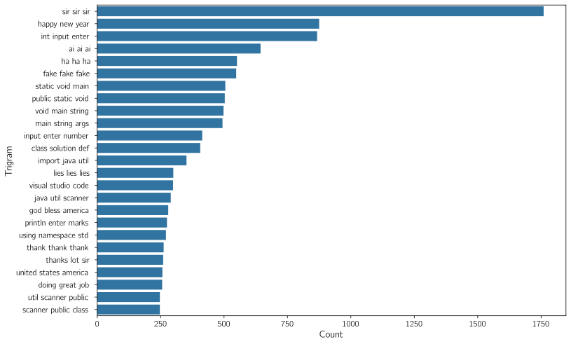{#fig-top-25_most_common_trigrams fig-align="center" width=100% .invert}

Looking at the most common trigrams, it seems like coding tutorial videos make up a significant chunk of the videos from where these comments are taken from.

## Lemmatization

Lemmatization is the process of reducing words to their base form by analyzing their context and meaning. For example, "running", "ran", and "runs" become "run". This improves text classification accuracy. All the words in the comments were reduced down to their root using the `WordNetLemmatizer` class in the `stem` module of the `nltk` library.

## Word Clouds

Word clouds are useful visual tools that help visualize the prevalence of words in the data.

### Word Cloud for All Comments

@fig-word_cloud_all shows the word cloud for all the comments in the data.

{#fig-word_cloud_all fig-align="center" width=100% .invert}

### Word Cloud for Positive Comments

@fig-word_cloud_positive shows the word cloud for positive comments in the data.

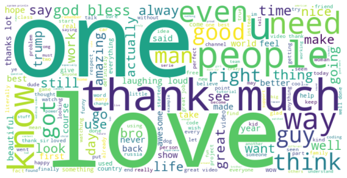{#fig-word_cloud_positive fig-align="center" width=100% .invert}

### Word Cloud for Neutral Comments

@fig-word_cloud_neutral shows the word cloud for neutral comments in the data.

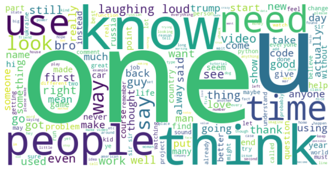{#fig-word_cloud_neutral fig-align="center" width=100% .invert}

### Word Cloud for Negative Comments

@fig-word_cloud_negative shows the word cloud for negative comments in the data.

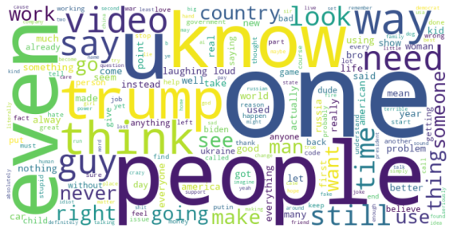{#fig-word_cloud_negative fig-align="center" width=100% .invert}

From these word clouds, it seems like the comments in the data are fairly random. There is no specific topic that is over represented.

## Most Frequent Words

@fig-20_most_frequent_words shows the top-20 most frequent words in the data.

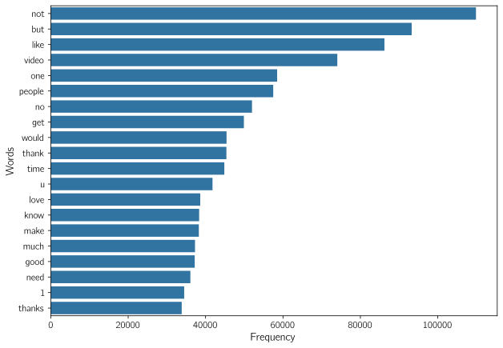{#fig-20_most_frequent_words fig-align="center" width=100% .invert}

### Most Frequent Words by Sentiment

@fig-20_most_frequent_words_by_sentiment shows the top-20 most frequent words in the data by sentiment.

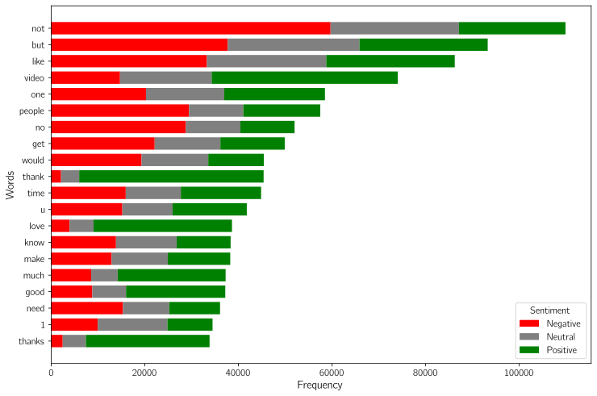{#fig-20_most_frequent_words_by_sentiment fig-align="center" width=100% .invert}

It does look like positive words like "love", "thank", etc., are appearing more in positive comments, whereas negative words like "no", "not", etc., are appearing in negative comments. This is expected.

# Training a Baseline Model

## Jupyter Notebook

[This is the Jupyter notebook](https://github.com/SushrutGaikwad/youtube-comment-intelligence/blob/main/notebooks/02_training_a_baseline_model.ipynb) in which baseline training and evaluation was performed.

## Introduction

We will now create a baseline model for sentiment analysis. Creating such a model is helpful because it is the simplest model possible that helps us get a benchmark performance that can be compared to future models that are more complex. We will also set up an MLflow tracking server on DagsHub that will help track all the experiments and evaluate various models. It will also help improve the baseline model's performance using techniques like hyperparameter tuning. This will further help plan the future experiments.

## Preprocessing

Firstly, during EDA we observed that most columns in the data were not predictive of the sentiment. So, for now, we will only work with two columns, i.e., `CommentText` and `Sentiment`. Further, we will use the same preprocessing steps that we used during EDA. Namely, we will carry out the following preprocessing steps:

1. Drop duplicates,
2. Convert comments to lowercase,
3. Strip leading and trailing whitespaces,
4. Remove URLs,
5. Remove newline and tab characters,
6. Demojize comments,
7. Clean punctuations,
8. Remove non-English characters,
9. Clean stop words,
10. Lemmatize,
11. Remove empty comments.

## Training-Validation-Test Split

We will now perform the Training-Validation-Test split. For this, we will consider a random 15% of the entire data as the test set. Out of the remaining 85%, we pick 15% as the validation set and the remaining as the training set. Doing this split before any kind of feature engineering and model training is crucial to avoid data leakage.

## Feature Engineering (Vectorization)

As this is just a Baseline model, we will perform the simple technique of bag of words to numerically encode all the comments using scikit-learn's `CountVectorizer` class. For now, we will use `max_features=10_000`. We will train this vectorizer on the training set and use it on the validation and the test sets.

## Baseline Model

We will use the random forest classification model as the baseline as it gives good results out of the box. The hyperparameters used are the following:

```python
RandomForestClassifier(
    n_estimators=200,
    max_depth=15,
    random_state=42,
    n_jobs=-1
)
```

## Logging on MLflow

The `CountVectorizer` and the `RandomForestClassifier` were put in a scikit-learn `Pipeline`, trained on the training set, and evaluated on the test set. This pipeline was logged on MLflow along with some other useful parameters, metrics, and the confusion matrix.

## Results

@tbl-rf_baseline_classification_report shows the classification report generated using this trained baseline random forest pipeline.

::: {.tbl tbl-colwidths="auto"}
| Class      | Precision | Recall | F1-score | Support |
|-----------:|----------:|-------:|---------:|--------:|
| Negative   | 0.5985    | 0.5563 | 0.5766   | 51,478  |
| Neutral    | 0.5094    | 0.6343 | 0.5650   | 50,694  |
| Positive   | 0.7197    | 0.5961 | 0.6521   | 51,233  |
| **Accuracy** |          |        | **0.5954** | **153,405** |
| **Macro Avg** | 0.6092 | 0.5956 | 0.5979 | 153,405 |
| **Weighted Avg** | 0.6095 | 0.5954 | 0.5980 | 153,405 |

: Classification report for the baseline random forest classifier. {#tbl-rf_baseline_classification_report style="width:70%; margin:auto;"}
:::

We can see that the accuracy obtained is about 59.54%. We need to improve this. Further, @fig-confusion_matrix_baseline_rf shows the confusion matrix.

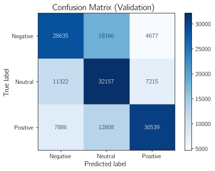{#fig-confusion_matrix_baseline_rf fig-align="center" width=70% .invert}

# Improving the Baseline Model

We can take the following steps to improve the baseline model performance:

- Using a more complex model like XGBoost, LightGBM, deep learning, etc.
- Hyperparameter tuning using a Bayesian approach (Optuna) of complex models.
- Using ensemble models like `VotingClassifier` or `StackingRegressor` to combine multiple models.
- Using more complex feature engineering techniques, e.g., $n$-grams in conjunction with bag of words, TF-IDF, embeddings, using custom features like number of stop words, ratio of vowels to consonants, etc.
- Investigating the data further to get deeper insights.

## Implementation

We consider the validation F1 score and validation accuracy to compare models. And between these two metrics, we will give more preference to F1 score. Next, we carry out the following experiments:

- Experiment 1:
  - We will compare two feature engineering techniques: bag of words and TF-IDF.
  - Further, we will also compare unigram, bigram, and trigram results, keeping the value of the hyperparameter `max_features` fixed.
- Experiment 2:
  - Once the best feature engineering technique is found, we will find the best value of the hyperparameter `max_features`.
- Experiment 3:
  - We will try out many models on the data. They are: XGBoost, LightGBM, random forest, SVM, logistic regression, $k$-nearest neighbors, and naive Bayes.
  - Further, we will also perform some coarse hyperparameter tuning on all these models.
- Experiment 4:
  - Once we find the best performing algorithm from the previous experiment, we will perform a significantly finer hyperparameter tuning on this model.

### Experiment 1

This experiment was mainly to determine which feature engineering technique among bag of words and TF-IDF is better. The value of `max_features` was kept fixed at 10,000 for this experiment. @fig-exp_1_parallel_coordinates_plot shows the parallel coordinates plot obtained on MLFlow for this experiment.

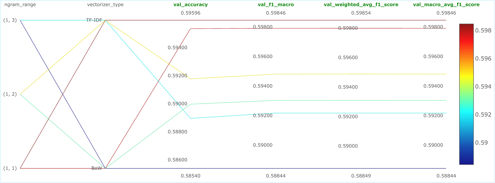{#fig-exp_1_parallel_coordinates_plot fig-align="center" width=100%}

We can clearly see that the best validation F1 score and validation accuracy is given by TF-IDF with trigrams. So, the best feature engineering technique observed in this experiment is TF-IDF.

#### Jupyter Notebook

This experiment was performed in [this Jupyter notebook](https://github.com/SushrutGaikwad/youtube-comment-intelligence/blob/main/notebooks/04_bow_vs_tfidf.ipynb).

### Experiment 2

This experiment was mainly to determine the value of the hyperparameter `max_features` that gives the best results considering TF-IDF with trigrams. The value of this hyperparameter was varied from 1,000 to 30,000 in steps of 1,000. @fig-exp_1_parallel_coordinates_plot shows the parallel coordinates plot obtained on MLFlow for this experiment.

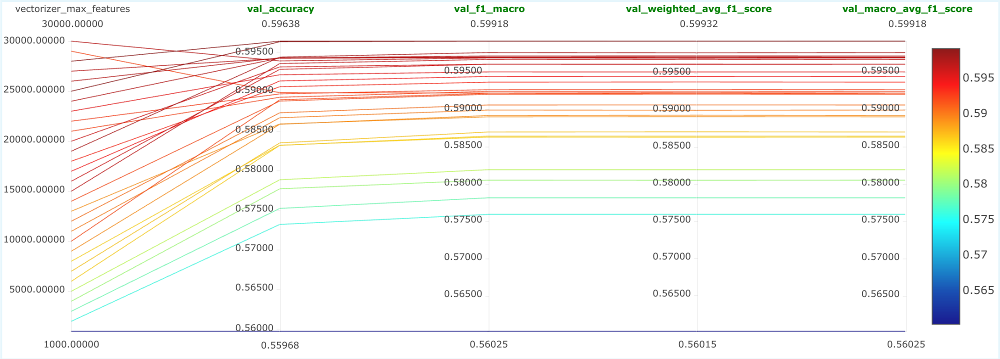{#fig-exp_1_parallel_coordinates_plot fig-align="center" width=100%}

Clearly, the validation metrics improve with higher number of `max_features`. We can sort of conclude that the best value of `max_features` is 25,000.

#### Jupyter Notebook

This experiment was performed in [this Jupyter notebook](https://github.com/SushrutGaikwad/youtube-comment-intelligence/blob/main/notebooks/05_tfidf_max_features.ipynb).

### Experiment 3

As mentioned earlier, we will try out 7 machine learning models on the best configuration learned so far. These models are: XGBoost, LightGBM, random forest, SVM, logistic regression, $k$-nearest neighbors, and naive Bayes. Further, we will also perform a coarse hyperparameter tuning on each of them using Optuna. We will log the best performing version of each of these models as a run on MLFlow. So, we will end up getting a total of 7 runs for this experiment.
