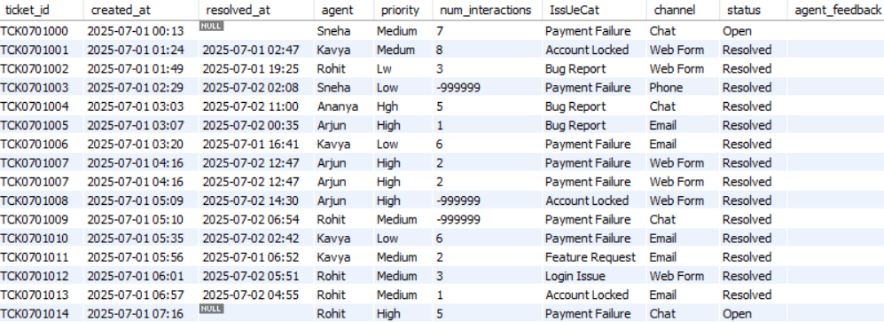
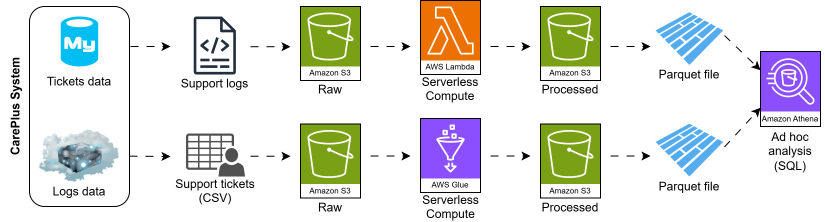
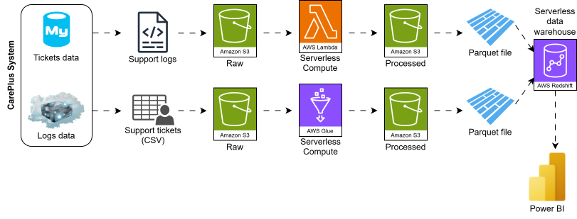
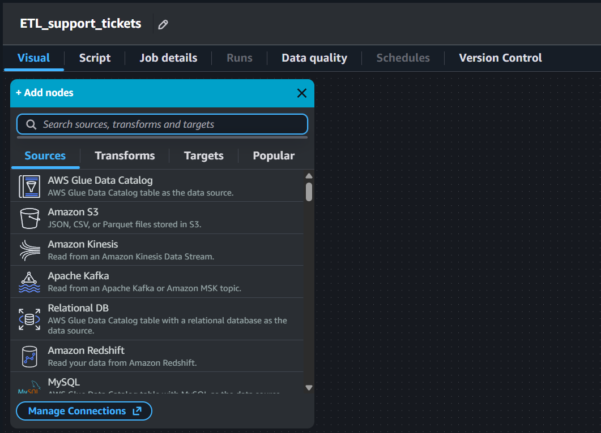
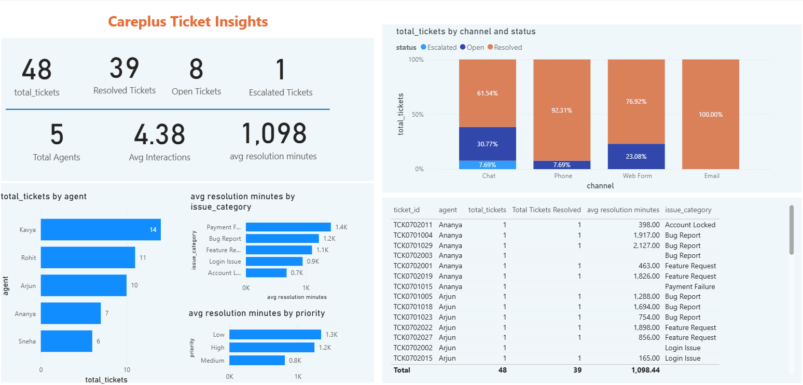
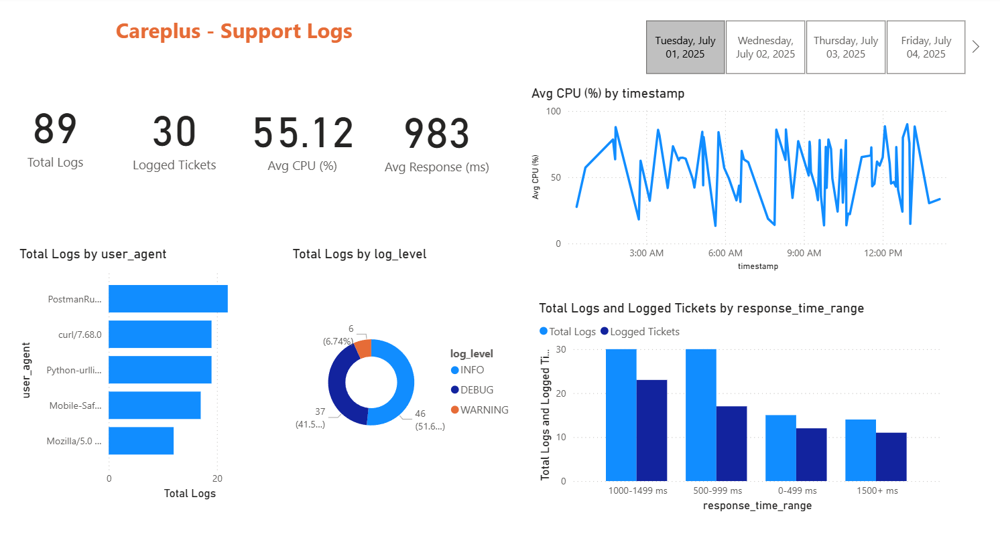

# GitHub Repository

You can check out the code in [this GitHub repository](https://github.com/SushrutGaikwad/customer-care-etl-pipeline).

## Tech Stack

- **Language:** Python  
- **Data Processing:** pandas  
- **Database (OLTP):** MySQL, SQLAlchemy  
- **Cloud Storage (Data Lake):** Amazon S3 (raw and processed zones)  
- **Serverless Compute:** AWS Lambda  
- **ETL Orchestration:** AWS Glue (Visual ETL and Script ETL), AWS Glue Crawlers  
- **Query Engine (Ad Hoc Analytics):** Amazon Athena (SQL over S3)  
- **Data Warehouse (OLAP):** Amazon Redshift (Serverless)  
- **File Format:** Parquet, CSV  
- **Logging and Observability:** Loguru  
- **BI and Dashboards:** Power BI  

# Problem Statement

In this project, we will assume that we are working for a customer care company. This is a BPO (Business Process Outsourcing) company that takes care of the customer care of other companies, e.g., Walmart, Target, etc. If a Walmart customer faces any problem, they contact their customer care and create what is known as an **issue**. These issues are tracked through a ticket. Further, Walmart would have outsourced their customer care to our company. Our company receives this ticket and the relevant information and one of the customer care agents of our company is assigned to this ticket. This agent will resolve the issue and the ticket will be closed. This daily ticket data is saved in the form of a structured table, i.e., each of these structured tables contains the ticket data generated during a particular day. The data corresponding to these tickets is shown in @fig-ticket_data_table.

{#fig-ticket_data_table fig-align="center" width=90% .invert}

The ticketing system also generates unstructured data in the form of software logs on servers. There are various software applications that generate these log files. These log files are huge text files, and hence unstructured. An example is the following:

```txt
2025-07-05 01:44:00 [DEBUG] careplus.support.GenericService - TicketID=TCK0705000 SessionID=sess_TCK0705000
IP=245.160.69.225 | ResponseTime=1621ms | CPU=75.2% | EventType=generic_event | Error=false
UserAgent="Mozilla/5.0 (Windows NT 10.0)"
Message=" event for TCK0705000"
Debug="ℹ️ Logged for monitoring"
TraceID=None
---
2025-07-05 01:47:00 [INFO] careplus.support.GenericService - TicketID=TCK0705000 SessionID=sess_TCK0705000
IP=247.117.70.214 | ResponseTime=909ms | CPU=61.91% | EventType=generic_event | Error=false
UserAgent="Python-urllib/3.9"
Message=" event for TCK0705000"
Debug="ℹ️ Logged for monitoring"
TraceID=None
---
2025-07-05 01:59:00 [INF0] careplus.support.GenericService - TicketID=TCK0705001 SessionID=sess_TCK0705001
IP=27.107.234.152 | ResponseTime=1108ms | CPU=24.5% | EventType=generic_event | Error=false
UserAgent="Mobile-Safari/537.36"
Message=" event for TCK0705001"
Debug="ℹ️ Logged for monitoring"
TraceID=None
---
```

Currently, the workflow is scattered into multiple databases and dashboards that is difficult to track and reproduce. There are multiple sources of truth, which is not a good idea. The goal of this project is to create a single source of truth (i.e., data source) using an ETL pipeline that can power multiple dashboards and can be used for various types of analytics.

# Pipeline Architecture

@fig-pipeline_architecture_ad_hoc shows the pipeline architecture that we will follow for doing some ad hoc analysis before creating the final data that will power the dashboards.

{#fig-pipeline_architecture_ad_hoc fig-align="center" width=100% .invert}

Our company has OLTP (Online Transaction Processing) type of databases. The ticket data is stored in MySQL and the log files are stored on some cloud server. We will take this data from this OLTP database and will transform it to OLAP (Online Analytical Processing). So, we will have the following two parallel branches:

- For support logs, we will:
    - Ingest logs from the cloud server into an AWS S3 bucket directory called `raw/`. We will be using this S3 bucket as our data lake.
    - Use AWS Lambda, which is a serverless compute, to do some data cleaning and transformation.
    - Save this transformed data in parquet format inside a directory called `processed/` in the same S3 bucket (data lake).

- For support tickets, we will:
    - Extract them in CSV format from the MySQL database.
    - Store these CSV files into the same S3 bucket but in a different `raw/` directory that corresponds to support tickets.
    - Use AWS Glue, which is another serverless compute, for doing data cleaning and transformation.
    - Save this transformed data in parquet format inside a different `processed/` directory that corresponds to support tickets in the same S3 bucket.

Once we have the cleaned and transformed data corresponding to both the support logs and the support tickets, we will use Amazon Athena for some ad hoc analysis. We will write SQL queries to do this.

However, to generate dashboards, we will save the cleaned and transformed data in Amazon Redshift, which is a serverless data warehouse. Finally, we will plug Power BI to this data warehouse to generate dashboards and insights. This is shown in @fig-pipeline_architecture_dashboard.

{#fig-pipeline_architecture_dashboard fig-align="center" width=100% .invert}

# AWS S3 Bucket Setup

We will go to AWS S3 page inside AWS console and simply create a general purpose bucket. Inside this bucket, we will create some nested directories. The directory structure is the same as mentioned in the [pipeline architecture](#pipeline-architecture):

```txt
s3-bucket-name/
├── support-logs/
│   ├── raw/
│   └── processed/
└── support-tickets/
    ├── raw/
    └── processed/
```

We will programmatically add raw data to the `raw` directories here. This is called data ingestion. However, we first need to create IAM user that will have the required permissions to do this.

## IAM User

We will now create a new IAM user with the [AmazonS3FullAccess](https://docs.aws.amazon.com/aws-managed-policy/latest/reference/AmazonS3FullAccess.html) policy. This will help us manage our S3 bucket. After creating this user, we will create an access key. This access key is what will help us connect to the S3 bucket from our local machine.

# Data Ingestion

## Support Tickets

You can check out the data ingestion code for support tickets data [here](https://github.com/SushrutGaikwad/careplus-etl-pipeline/blob/main/src/support_tickets/data_ingestion.py). This data ingestion layer is responsible for reliably extracting support ticket data from the MySQL database and landing it into the `support-tickets/raw/` directory of the Amazon S3 bucket for downstream processing. This stage is designed to be incremental, observable, and fault-tolerant, ensuring that data is ingested exactly once and that failures can be diagnosed easily.

At a high level, the ingestion process runs as a standalone Python script and performs five core tasks:

1. Load configuration and credentials.
2. Initialize structured logging.
3. Track ingestion state using a date tracker.
4. Incrementally extract data from MySQL.
5. Persist raw data into S3 and update state.

### Centralized Configuration and Environment Management

All runtime configuration is centralized in a dedicated configuration module called `config.py`. This includes database connection parameters, S3 storage locations, and the ingestion state file (date tracker). Sensitive information such as database passwords and AWS credentials are injected via environment variables loaded from a `.env` file.

This design keeps secrets out of version control and allows the same ingestion logic to run across environments (local development, staging, or production) without code changes.

### Logging and Observability with Loguru

The ingestion script uses Loguru for structured logging instead of print statements. At startup, the script dynamically resolves the project root and configures a log directory located at the top level of the repository. All logs produced by the support tickets ingestion flow are written to a dedicated log file under this directory.

Each log entry includes timestamps, log levels, function names, and line numbers, making it easy to trace execution flow and diagnose failures. Logs are rotated automatically based on file size, retained for a fixed period, and compressed to prevent uncontrolled disk growth. In addition to file logging, logs are also emitted to the console for real-time visibility during execution.

This logging strategy ensures that ingestion runs are fully observable and production-ready.

### Incremental Ingestion Using a Date Tracker

Rather than reprocessing the entire support tickets table on every run, the pipeline uses an incremental ingestion strategy driven by a date tracker file. This tracker stores the last successfully ingested date and lives alongside the ingestion code for the support tickets module.

When the script starts:

- It reads the last ingested date from the tracker file.
- Computes the next date to ingest by advancing one day.
- Uses this computed date as the ingestion boundary.

If the tracker file does not exist, the pipeline falls back to a predefined default start date. This makes the ingestion process deterministic and easy to bootstrap for historical data loads.

The tracker is updated only after a successful upload to S3, ensuring exactly-once semantics.

### Querying the Source Database

The pipeline connects to the MySQL database using SQLAlchemy, which provides a clean abstraction for database connectivity and integrates naturally with pandas.

Only records created on the target ingestion date are queried from the `support_tickets` table. This date-based filtering minimizes database load, reduces data transfer, and ensures predictable execution times regardless of table size.

The query results are loaded directly into a pandas DataFrame, making the data immediately ready for validation or serialization.

### Guardrails for Empty Data

Before proceeding with ingestion, the pipeline checks whether the query returned any records. If no data exists for the target date, the pipeline logs a warning and exits gracefully without uploading empty files or updating the tracker.

This safeguard prevents the creation of misleading artifacts in S3 and avoids advancing the ingestion state prematurely.

### Uploading Raw Data to Amazon S3

Once data is successfully extracted, it is uploaded to Amazon S3 in CSV format. The pipeline uses an in-memory buffer to serialize the DataFrame, avoiding intermediate files on disk.

Each file is written under a structured S3 prefix that represents the raw ingestion zone. The file naming convention includes the ingestion date, making it easy to trace when the data was extracted and to partition downstream processing jobs.

This raw zone serves as an immutable source of truth for subsequent transformation, validation, and analytics stages.

### State Update and Idempotency

After a successful upload to S3, the pipeline updates the date tracker with the newly ingested date. This update is the final step of the ingestion process and is deliberately performed last.

If the pipeline fails at any point before this update, the tracker remains unchanged, allowing the same date to be retried safely on the next run. This design provides natural idempotency and makes the pipeline resilient to transient failures such as network issues or temporary database outages.

### End-to-End Execution Flow

Putting everything together, a single ingestion run follows this sequence:

1. Initialize logging and load configuration.
2. Read the last ingested date from the tracker.
3. Compute the next date to ingest.
4. Query the database for that day’s records.
5. Exit early if no data is found.
6. Upload extracted data to S3.
7. Update the date tracker.
8. Log successful completion.

The ingestion script can be run manually, scheduled using cron, or orchestrated by a workflow manager in later stages of the pipeline.

### Execution Model and Scheduling Assumptions

Although the ingestion scripts are implemented as standalone Python programs, they are designed to simulate a production scenario where a scheduler triggers ingestion once per day.

In a real-world deployment, this ingestion layer would typically be executed by a scheduling system such as a cron job, workflow orchestrator, or managed service. Each scheduled run is responsible for ingesting only the data corresponding to a single day, based on the ingestion state stored in the date tracker.

This design keeps the ingestion logic simple and deterministic while accurately reflecting how data pipelines operate in production environments. Manual execution of the scripts in this project simulates the behavior of a daily scheduled job that continuously pushes new data into the Amazon S3 raw zone.

### Why This Design Works Well

This ingestion design prioritizes simplicity, correctness, and operational clarity. By using explicit state tracking, date-based partitioning, and structured logging, the pipeline avoids unnecessary complexity while still meeting production-grade requirements.

It establishes a clean and reliable foundation for the rest of the ETL pipeline, ensuring that downstream transformations and analytics operate on complete, traceable, and reproducible data.

## Support Logs

In addition to structured support ticket data stored in a relational database, the ETL Pipeline also ingests unstructured support logs generated daily by the system. You can find the data ingestion code for support logs [here](https://github.com/SushrutGaikwad/careplus-etl-pipeline/blob/main/src/support_logs/data_ingestion.py).

Unlike support tickets, which are extracted from MySQL, support logs already exist as day-wise log files on disk. The purpose of this ingestion layer is to reliably move these raw log files into Amazon S3, while preserving incremental guarantees, observability, and fault tolerance.

At a high level, the support logs ingestion process follows the same architectural principles as the support tickets ingestion, but adapts them to a file-based source rather than a database.

### Design Philosophy

The support logs ingestion pipeline is designed to:

- Ingest exactly one day’s log file per run.
- Avoid re-uploading previously ingested logs.
- Maintain a clear and auditable ingestion history.
- Fail safely without corrupting ingestion state.

Even though the data source differs, both ingestion pipelines follow a uniform execution pattern, making the overall ETL architecture consistent and easy to reason about.

### Logging and Observability

Just like the support tickets ingestion, the support logs ingestion script uses Loguru for structured logging. At startup, the script dynamically resolves the project root and configures a dedicated log file under the top-level `logs/` directory.

Each execution produces detailed logs that capture:

- The ingestion date being processed.
- The location of the raw log file on disk.
- Whether the file was found or missing.
- Upload success or failure.
- Date tracker updates.

Logs are rotated automatically, retained for a fixed duration, and compressed to ensure long-running ingestion does not result in uncontrolled log growth. This makes the ingestion process easy to monitor, debug, and audit over time.

### Incremental Ingestion Using a Date Tracker

To ensure incremental behavior, the support logs ingestion pipeline uses a date tracker file, similar to the one used for support tickets. This tracker records the last successfully ingested date and is stored alongside the ingestion code for the support logs module.

On each run:

- The script reads the last ingested date from the tracker.
- Computes the next date to ingest.
- Uses this date to determine which log file should be processed.

If the tracker file does not exist, the pipeline falls back to a predefined default start date, allowing historical log ingestion to be bootstrapped cleanly.

As with support tickets, the tracker is updated only after a successful upload, ensuring idempotent behavior.

### Locating the Raw Log File

Support logs are generated daily and stored locally in a directory containing day-wise log files. Each file follows a predictable naming convention that includes the date.

For the computed ingestion date, the pipeline constructs the expected file path and checks whether the log file exists. This explicit existence check acts as an important guardrail and prevents ingestion failures caused by missing or delayed log generation.

If the log file is not found, the pipeline logs a warning and safely exits without uploading anything or advancing the date tracker.

### Uploading Log Files to Amazon S3

When a valid log file is found, the pipeline uploads it to Amazon S3 under a structured raw-data prefix. The file is uploaded as-is, preserving the original log content without transformation.

Each uploaded log file is stored using a date-based naming convention, making it easy to trace when the logs were generated and ingested. This raw log zone serves as a durable and immutable source of truth for downstream parsing, indexing, or analytics workflows.

### Fault Tolerance and Idempotency

The support logs ingestion pipeline is designed to fail safely. If an error occurs at any stage before the upload completes, the date tracker remains unchanged. This ensures that the same date will be retried on the next execution, preventing both data loss and duplicate ingestion.

This design makes the pipeline resilient to common operational issues such as:

- Missing log files.
- Temporary AWS failures.
- Network interruptions.

### End-to-End Execution Flow

A single support logs ingestion run follows this sequence:

1. Initialize logging and load environment configuration.
2. Read the last ingested date from the tracker.
3. Compute the next date to ingest.
4. Locate the corresponding log file on disk.
5. Exit early if the log file is missing.
6. Upload the log file to Amazon S3.
7. Update the date tracker.
8. Log successful completion.

The script can be executed manually, scheduled via cron, or orchestrated by a workflow manager alongside the support tickets ingestion.

## Why Separate Pipelines for Tickets and Logs?

Although both pipelines follow the same architectural pattern, they are intentionally implemented as separate ingestion modules. This separation allows:

- Independent scheduling and retries.
- Independent failure handling.
- Clear ownership of ingestion logic per data source.
- Easier extension to new data sources in the future

Together, the support tickets and support logs ingestion pipelines form a robust and extensible foundation for the ETL Pipeline.

# Data Transformation

## Support Logs

### Local

We will first perform data transformation locally in a Jupyter notebook. You can access this notebook [here](https://github.com/SushrutGaikwad/careplus-etl-pipeline/blob/main/notebooks/support_logs_data_transformation_local.ipynb).

System logs are inherently unstructured: they are written for humans and machines to read, not for direct analytical use. Even when logs follow a consistent template, they still arrive as raw text spread across multiple files. Before any meaningful analysis can happen, this data needs to be transformed into a structured format.

#### Consolidating Logs Across Multiple Files

The raw log data is stored as multiple day-wise files in a directory. Rather than processing each file independently, all log files are first read and combined into a single logical stream. Each file is appended sequentially while preserving record boundaries using a consistent delimiter.

This approach allows the entire log history to be treated as one dataset, which is essential for longitudinal analysis such as trend detection, performance monitoring, and anomaly identification.

#### Isolating Individual Log Events

Once all logs are combined, the data is split into individual log entries. Each entry corresponds to a single system event and contains multiple attributes such as timestamps, service metadata, performance metrics, and diagnostic messages.

At this stage, the data is still unstructured text, but each unit now represents exactly one event, which is a crucial prerequisite for structured parsing.

#### Parsing Log Fields Using a Formal Pattern

Each log entry follows a well-defined textual structure. To extract meaningful fields, a formal parsing pattern is applied to each entry. This pattern identifies and captures:

- Event timestamp.
- Log severity level.
- Service or component name.
- Ticket and session identifiers.
- Client IP address.
- Response time and CPU utilization.
- Event category and error flag.
- User agent string.
- Message and debug information.

Only entries that fully conform to this expected structure are retained. This ensures the resulting dataset is consistent and reliable.

#### Building a Structured Dataset

After parsing, each log entry is represented as a structured record with named fields. These records are assembled into a tabular dataset where each row corresponds to one log event and each column represents a specific attribute.

This transformation converts the logs from free-form text into a format suitable for statistical analysis, visualization, and downstream processing.

#### Removing Redundant Information

During inspection, certain fields were found to contain identical values across all records and did not contribute any analytical value. Such columns are removed to reduce noise and improve clarity in the dataset.

This step keeps the schema focused only on meaningful dimensions of the data.

#### Enforcing Correct Data Types

Raw log fields are initially interpreted as strings, but meaningful analysis requires appropriate data types. Key transformations include:

- Converting response times into numeric values.
- Casting CPU usage into floating-point values.
- Normalizing error flags into boolean values.
- Parsing timestamps into a proper datetime format with millisecond precision.

Explicit typing ensures correctness and prevents subtle bugs in downstream analysis.

#### Filtering Invalid Log Entries

Some log records contain invalid values, such as negative response times. These entries are filtered out to ensure the dataset reflects realistic system behavior and does not distort performance metrics.

This step is critical for maintaining data quality.

#### Normalizing Log Severity Levels

Due to inconsistencies in how log levels were recorded upstream, multiple malformed variants of standard log levels appear in the data. These variants are normalized into a consistent set of canonical values (e.g., INFO, DEBUG, WARNING, ERROR).

Standardizing categorical values improves grouping, aggregation, and visualization later in the pipeline.

#### Deduplicating Records

Finally, duplicate log entries are removed. This prevents repeated events from biasing analyses such as error rates, request counts, or performance summaries.

#### Outcome

After these transformations, the raw support logs are converted into a clean, structured, and analysis-ready dataset. This dataset forms the foundation for:

- Operational monitoring.
- Performance and latency analysis.
- Error tracking and root cause analysis.
- Feature generation for downstream analytics or machine learning.

By separating parsing, cleaning, and normalization into clear steps, the process remains transparent, reproducible, and easy to extend as log formats evolve.

### AWS Lambda

We now create a Lambda function that will carry out data transformation, i.e., the same steps we carried out in the Jupyter notebook.

#### Manual Trigger

We first create a Lambda function that carries out data transformation with our manual intervention. We use a Python 3.11 runtime, which is the same Python version of our environment.

##### Reading Log File from S3 Bucket

As a test, to read a particular log file from the S3 bucket, we put the following code in the `lambda_function.py` module:

```python
import json
import boto3

def read_log_file_from_s3(bucket, key):
    s3 = boto3.client("s3")
    response = s3.get_object(Bucket=bucket, Key=key)
    data = response["Body"].read().decode("utf-8")
    return data

def lambda_handler(event, context):
    bucket = "careplus-etl-pipeline-data"
    key = "support-logs/raw/support_logs_2025-07-01.log"

    raw_logs = read_log_file_from_s3(bucket=bucket, key=key)
    print(raw_logs)
```

This is supposed to print the content of one particular log file, namely `support_logs_2025-07-01.log`. To be able to run this, we first need give this Lambda function access to S3 by attaching the AmazonS3FullAccess policy.

Once this happens, we will put the same data transformation code that we used in the Jupyter notebook to transform the data. But first, as we need the pandas library in this code, we add a layer to the lambda function called AWSSDKPandas with the latest version. This will give the Lambda function access to the pandas library.

Finally, we put the following code in the IDE and test it:

```python
import io
import re
import json
import boto3
import pandas as pd
import pyarrow as pa
import pyarrow.parquet as pq

def read_log_file_from_s3(bucket, key):
    # Read raw logs from S3
    s3 = boto3.client("s3")
    response = s3.get_object(Bucket=bucket, Key=key)
    data = response["Body"].read().decode("utf-8")
    print(f"✅ Raw logs read from s3://{bucket}/{key}")
    return data

def save_parquet_to_s3(df, bucket, key):
    # Convert to parquet
    table = pa.Table.from_pandas(df, preserve_index=False)
    parquet_buffer = io.BytesIO()
    pq.write_table(table, parquet_buffer)

    # Write to S3
    s3 = boto3.client("s3")
    s3.put_object(Bucket=bucket, Key=key, Body=parquet_buffer.getvalue())
    print(f"✅ Parquet saved to s3://{bucket}/{key}")

def lambda_handler(event, context):
    bucket = "careplus-etl-pipeline-data"
    key = "support-logs/raw/support_logs_2025-07-01.log"

    # Get the raw logs from S3
    raw_logs = read_log_file_from_s3(bucket=bucket, key=key)

    # Split the logs by "---" delimiter
    lines = [line.strip() for line in raw_logs.split("---") if line.strip()]
    print(f"✅ Found {len(lines)} log lines")

    # Regex pattern to parse each log line
    log_pattern = re.compile(
        r'(?P<timestamp>\d{4}-\d{2}-\d{2} \d{2}:\d{2}:\d{2}) \[(?P<log_level>[A-Za-z0-9_]+)\] '
        r'(?P<component>[^\s]+) - TicketID=(?P<ticket_id>[^\s]+) SessionID=(?P<session_id>[^\s]+)\s*'
        r'IP=(?P<ip>.*?) \| ResponseTime=(?P<response_time>-?\d+)ms \| CPU=(?P<cpu>[\d.]+)% \| EventType=(?P<event_type>.*?) \| Error=(?P<error>\w+)\s*'
        r'UserAgent="(?P<user_agent>.*?)"\s*'
        r'Message="(?P<message>.*?)"\s*'
        r'Debug="(?P<debug>.*?)"\s*'
        r'TraceID=(?P<trace_id>.*)'
    )

    # Parse each line and extract fields
    parsed_lines = []

    for line in lines:
        match = log_pattern.search(line)
        if match:
            parsed_lines.append(match.groupdict())
    print(f"✅ Parsed {len(parsed_lines)} log lines")

    # Convert to DataFrame
    df = pd.DataFrame(parsed_lines)
    print(f"✅ Converted to DataFrame with shape {df.shape}")

    # Drop the trace_id column as it's not needed
    df.drop("trace_id", axis=1, inplace=True)
    print("✅ Dropped trace_id column")

    # Convert data types
    dtype = {
        "response_time": "int",
        "cpu": "float"
    }
    df = df.astype(dtype)

    df["error"] = df["error"].str.lower().map({"true": True, "false": False})
    df["timestamp"] = pd.to_datetime(
        df["timestamp"],
        format="%Y-%m-%d %H:%M:%S",
        errors="coerce"
    )
    df["timestamp"] = df["timestamp"].astype("datetime64[ms]")
    print("✅ Converted data types")

    # Filter out negative response times
    df = df[df.response_time>=0]
    print("✅ Filtered out negative response times")

    # Fix typos in log levels
    fix_log_level = {
        "INF0": "INFO",
        "DEBG": "DEBUG",
        "warnING": "WARNING",
        "EROR": "ERROR"
    }
    df["log_level"] = df["log_level"].replace(fix_log_level)
    print("✅ Fixed typos in log levels")

    # Remove duplicate rows
    df.drop_duplicates(inplace=True)
    print("✅ Removed duplicate rows")

    # Save to S3 as parquet
    output_key = "support-logs/processed/support_logs_2025-07-01.parquet"
    save_parquet_to_s3(df=df, bucket=bucket, key=output_key)
```

#### Automated Trigger

As we are working with a scenario in which the log data is ingested daily by a scheduling system, e.g., a cron job, workflow orchestrator, etc., we want the data transformation to be carried out automatically as soon as a new log file is ingested. In other words, we want to create this as an automated pipeline. The data transformation should be triggered when it senses that a new log file is ingested.

We first create a new Lambda function with Python 3.11 runtime, the AWSSDKPandas layer, and the attached AmazonS3FullAccess policy. The content in this function is the following:

```python
import io
import re
import json
import boto3
import pandas as pd
import pyarrow as pa
import pyarrow.parquet as pq

def read_log_file_from_s3(bucket, key):
    # Read raw logs from S3
    s3 = boto3.client("s3")
    response = s3.get_object(Bucket=bucket, Key=key)
    data = response["Body"].read().decode("utf-8")
    print(f"✅ Raw logs read from s3://{bucket}/{key}")
    return data

def save_parquet_to_s3(df, bucket, key):
    # Convert to parquet
    table = pa.Table.from_pandas(df, preserve_index=False)
    parquet_buffer = io.BytesIO()
    pq.write_table(table, parquet_buffer)

    # Write to S3
    s3 = boto3.client("s3")
    s3.put_object(Bucket=bucket, Key=key, Body=parquet_buffer.getvalue())
    print(f"✅ Parquet saved to s3://{bucket}/{key}")

def lambda_handler(event, context):
    # Get S3 bucket and key from the event
    record = event["Records"][0]
    bucket_name = record["s3"]["bucket"]["name"]
    input_key = record["s3"]["object"]["key"]

    # Get the raw logs from S3
    raw_logs = read_log_file_from_s3(bucket=bucket_name, key=input_key)

    # Split the logs by "---" delimiter
    lines = [line.strip() for line in raw_logs.split("---") if line.strip()]
    print(f"✅ Found {len(lines)} log lines")

    # Regex pattern to parse each log line
    log_pattern = re.compile(
        r'(?P<timestamp>\d{4}-\d{2}-\d{2} \d{2}:\d{2}:\d{2}) \[(?P<log_level>[A-Za-z0-9_]+)\] '
        r'(?P<component>[^\s]+) - TicketID=(?P<ticket_id>[^\s]+) SessionID=(?P<session_id>[^\s]+)\s*'
        r'IP=(?P<ip>.*?) \| ResponseTime=(?P<response_time>-?\d+)ms \| CPU=(?P<cpu>[\d.]+)% \| EventType=(?P<event_type>.*?) \| Error=(?P<error>\w+)\s*'
        r'UserAgent="(?P<user_agent>.*?)"\s*'
        r'Message="(?P<message>.*?)"\s*'
        r'Debug="(?P<debug>.*?)"\s*'
        r'TraceID=(?P<trace_id>.*)'
    )

    # Parse each line and extract fields
    parsed_lines = []

    for line in lines:
        match = log_pattern.search(line)
        if match:
            parsed_lines.append(match.groupdict())
    print(f"✅ Parsed {len(parsed_lines)} log lines")

    # Convert to DataFrame
    df = pd.DataFrame(parsed_lines)
    print(f"✅ Converted to DataFrame with shape {df.shape}")

    # Drop the trace_id column as it's not needed
    df.drop("trace_id", axis=1, inplace=True)
    print("✅ Dropped trace_id column")

    # Convert data types
    dtype = {
        "response_time": "int",
        "cpu": "float"
    }
    df = df.astype(dtype)

    df["error"] = df["error"].str.lower().map({"true": True, "false": False})
    df["timestamp"] = pd.to_datetime(
        df["timestamp"],
        format="%Y-%m-%d %H:%M:%S",
        errors="coerce"
    )
    df["timestamp"] = df["timestamp"].astype("datetime64[ms]")
    print("✅ Converted data types")

    # Filter out negative response times
    df = df[df.response_time>=0]
    print("✅ Filtered out negative response times")

    # Fix typos in log levels
    fix_log_level = {
        "INF0": "INFO",
        "DEBG": "DEBUG",
        "warnING": "WARNING",
        "EROR": "ERROR"
    }
    df["log_level"] = df["log_level"].replace(fix_log_level)
    print("✅ Fixed typos in log levels")

    # Remove duplicate rows
    df.drop_duplicates(inplace=True)
    print("✅ Removed duplicate rows")

    # Save to S3 as parquet
    match = re.search(r"support_logs_(\d{4}-\d{2}-\d{2})\.log", input_key)
    date_str = match.group(1) if match else "unknown"
    output_key = f"support-logs/processed/support_logs_{date_str}.parquet"
    save_parquet_to_s3(df=df, bucket=bucket_name, key=output_key)
```

To implement the trigger, we first open the properties of the S3 bucket and create an event notification. We also give the proper prefix as `support-logs/raw/`, suffix as `.log`, and the event type as "Put" as the trigger should only activate when a new raw log file is ingested. Further, we also select the newly created Lambda function so that this function is triggered after the ingestion.

## Support Tickets

Now we carry out the data transformation of support tickets using AWS Glue.

### IAM Role

We create a new IAM role with the AWS service as Glue. Further, we attach the policies AmazonS3FullAccess and AWSGlueServiceRole to this role. This role has access to AWS Glue and AWS S3, i.e., it can communicate between these two services.

### Manual Trigger - Visual ETL Using AWS Glue

AWS Glue allows us to build an ETL pipeline visually by just connecting nodes. Note that this is one of the ways to build an ETL pipeline using AWS Glue. AWS Glue broadly divides these nodes into 4 types: Sources, Transforms, Targets, and Popular. This is shown in @fig-AWS_Glue_visual_nodes.

{#fig-AWS_Glue_visual_nodes fig-align="center" width=90%}

#### Data Source - S3 Bucket

As the source of our ETL pipeline is an Amazon S3 bucket, we pick "Amazon S3" from the sources, put the complete S3 URI of the `raw/` directory inside the `support-tickets/` directory of the S3 bucket, and select the IAM role that we just created. Once this is done, we see a preview of the data present in this directory.

#### Change Schema

In the output schema of the data source node, we can see that all the columns have a data type of string, which is incorrect. We will now add a transformation connecting the data source node called "Change Schema". After doing this, we simply correct the data type of all the columns. Once this is done, we can see that the data types of all the columns are now correct in the output schema of this node.

#### Drop Null Fields

We can see in the data preview of the previous node that the column `agent_feedback` only null values in it. To drop this column, we will add another transformation called "Drop Null Fields" and tick the `Empty String ("" or '')` option as the null values in our data are actually empty strings.

#### Rename Field

We would like to rename some columns and give them more easily understandable names. This is done using the "Rename Field" transformation.

#### Filter

There are values like `-999999` in the `num_interactions` column, which are clearly invalid. We drop these values using the "Filter" transformation by adding the appropriate condition on this column.

#### SQL Query

There are multiple spellings of the categories in the column `priority`. We standardize them using a "SQL Query" transformation. We use the following SQL query:

```sql
SELECT *,
CASE
    WHEN priority = 'Lw' THEN 'Low'
    WHEN priority = 'Medum' THEN 'Medium'
    WHEN priority = 'Hgh' THEN 'High'
ELSE priority
END AS priority
FROM myDataSource;
```

#### Select Fields

As we carried out the data transformation steps, the order in which the columns appear are changed. We reorder these columns in the original order using the "Select Fields" data transformation node.

#### Data Target - S3 Bucket

As we want to save the transformed data to the `processed/` directory inside the `support-tickets/` directory, we will add an Amazon S3 data target node. We will put the complete S3 URI of the target directory and also select the format as parquet.

Once all these nodes are saved, simply clicking the "Run" button runs this complete ETL pipeline using AWS Glue. This is how we can run this pipeline manually.

### Automated Trigger - Script ETL Using AWS Glue

We first clone the original visual ETL that we created for manual trigger and open it in the script mode to edit the script. We will trigger the AWS Glue script using a AWS Lambda.

#### AWS Lambda Function

We create a new AWS Lambda function that will be used to trigger the automated ETL script with Python 3.11 runtime. Further, we also attach the AmazonS3FullAccess and the AWSGlueServiceRole policies to the role corresponding to this function so that it can communicate between these two AWS services. The code in this Lambda function is the following:

```python
import json
import boto3

glue = boto3.client("glue")

def lambda_handler(event, context):
    bucket = event["Records"][0]["s3"]["bucket"]["name"]
    input_key = event["Records"][0]["s3"]["object"]["key"]
    
    s3_input_path = f"s3://{bucket}/{input_key}"

    print(f"Triggering Glue job with input: {s3_input_path}")

    glue.start_job_run(
        JobName="automate_ETL_support_tickets",
        Arguments={
            "--input_file_path": s3_input_path
        }
    )
```

After this, we also change the hard-coded input path in the automated Glue ETL job script to the string `"input_file_path"` to match the same name in the above Lambda function.

Next, we create a new event notification for the S3 bucket with prefix as the path of the `raw/` directory inside the `support-tickets/` directory, the suffix as .csv as our data files are in the CSV format, the event type as "Put", and the destination as Lambda function and pick the lambda function that we just created. This will trigger the automated Lambda function (which will run the AWS Glue script) once any CSV file is ingested into the `support-tickets/raw/` directory.

# Ad Hoc Analysis

Before loading the data into a data warehouse like Amazon Redshift, we may want to carry out some ad hoc analysis of the data. Amazon Athena helps us to do this. It is a service that lets you run standard SQL queries to analyze data directly in S3. It is serverless, i.e., no infrastructure to manage. It works out of the box with parquet, CSV, JSON, etc., type of files.

Before running queries using Athena, we first create a new directory in the same S3 bucket on the top level for Athena results. Once this is done, we create a new database using the following query:

```sql
CREATE DATABASE careplus_db;
```

This creates an empty database called `careplus_db`. To create tables in it, we use the AWS Glue Crawler. We also choose the data source as the `support-logs/processed/` directory inside the S3 bucket, create and select a new AWSGlueService IAM role, select the target database as `careplus_db`, with some table name prefix, and an on demand crawler schedule. Once the crawler is created, we run it. This will create a new table in `careplus_db` containing the data from the `support-logs/processed/` directory of the S3 bucket. We do the same for the support tickets data which is present inside the `support-tickets/processed/` directory of the S3 bucket. This creates a table corresponding to the support tickets data in `careplus_db`.

## SQL Queries

### Support Tickets

Recall that the table corresponding to support tickets has the following columns:

- `ticket_id`,
- `created_at`,
- `resolved_at`,
- `agent`,
- `priority`,
- `num_interactions`,
- `issue_category`,
- `channel`,
- `status`.

#### Number of Tickets per Channel

To find this, we run the following query:

```sql
SELECT channel, COUNT(*) AS ticket_count
FROM support_tickets_processed
GROUP BY channel
ORDER BY ticket_count DESC;
```

#### Number of Tickets per Status

To find this, we run the following query:

```sql
SELECT status, COUNT(*) AS ticket_count
FROM support_tickets_processed
GROUP BY status
ORDER BY ticket_count DESC;
```

#### Number of Tickets per Agent

To find this, we run the following query:

```sql
SELECT agent, COUNT(*) AS ticket_count
FROM support_tickets_processed
GROUP BY agent
ORDER BY ticket_count DESC;
```

#### Tickets Trend

To find this, we run the following query:

```sql
SELECT
    DATE(created_at) AS day,
    COUNT(*) AS tickets_created
FROM support_tickets_processed
GROUP BY DATE(created_at)
ORDER BY day;
```

### Support Logs

Recall that the table corresponding to support logs has the following columns:

- `timestamp`,
- `log_level`,
- `component`,
- `ticket_id`,
- `session_id`,
- `ip`,
- `response_time`,
- `cpu`,
- `event_type`,
- `error`,
- `user_agent`,
- `message`,
- `debug`.

#### Number of Logs in the DEBUG level

To find this, we run the following query:

```sql
SELECT COUNT(*) AS debug_event_count
FROM support_logs_processed
WHERE log_level = 'DEBUG';
```

#### Number of Logs per Log Level

To find this, we run the following query:

```sql
SELECT log_level, COUNT(*) AS log_count
FROM support_logs_processed
GROUP BY log_level
ORDER BY log_count DESC;
```

#### Average CPU usage per Agent

To find this, we run the following query:

```sql
SELECT user_agent, AVG(cpu) AS avg_cpu_usage
FROM support_logs_processed
GROUP BY user_agent
ORDER BY avg_cpu_usage DESC;
```

# Loading Data to Data Warehouse

We use Amazon Redshift as the data warehouse as it is designed for OLAP. It is also a serverless fully managed service which handles backups and scaling provisioning automatically. It uses columnar storage to optimize analytical workflows. It uses massively parallel processing (MPP), which means that it will break down queries and distribute them across multiple nodes for faster performance. So, it gives great performance due columnar storage as well as distributed computing. It can query data in S3 and integrate with AWS Data Lake. It can easily scale up to petabytes of data by adding more nodes to the cluster.

## Configuring Amazon Redshift

We use the free trial of Redshift. In the process of configuring, we also create an IAM role. Next, we click on "Query data" to open the Redshift query editor. We create a connection that help us to start writing SQL queries.

## Bringing Data into Redshift

We run the following command to create a new database:

```sql
CREATE DATABASE careplus_db;
```

### Support Logs

Next, we create table for support logs with the appropriate schema using the following command:

```sql
CREATE TABLE public.support_logs (
    timestamp       TIMESTAMP,
    log_level       VARCHAR(20),
    component       VARCHAR(100),
    ticket_id       VARCHAR(50),
    session_id      VARCHAR(50),
    ip              VARCHAR(45),
    response_time   BIGINT,
    cpu             DOUBLE PRECISION,
    event_type      VARCHAR(50),
    error           BOOLEAN,
    user_agent      VARCHAR(300),
    message         VARCHAR(1000),
    debug           VARCHAR(1000)
);
```

Next, we insert some records in this table. To do this, we copy the data from S3 bucket using the following command:

```sql
COPY public.support_logs
FROM 's3 URI of processed dir inside support-logs dir of the bucket'
IAM_ROLE 'ARN of the Redshift IAM role'
FORMAT AS PARQUET
REGION 'us-east-2';
```

### Support Tickets

We now carry out the same steps to bring in the support tickets data.

```sql
CREATE TABLE public.support_tickets (
    ticket_id           VARCHAR(50),
    created_at          TIMESTAMP,
    resolved_at         TIMESTAMP,
    agent               VARCHAR(100),
    priority            VARCHAR(20),
    num_interactions    BIGINT,
    issue_category      VARCHAR(100),
    channel             VARCHAR(50),
    status              VARCHAR(20)
);

COPY public.support_tickets
FROM 's3 URI of processed dir inside support-tickets dir of the bucket'
IAM_ROLE 'ARN of the Redshift IAM role'
FORMAT AS PARQUET
REGION 'us-east-2';
```

# Power BI Dashboard

We now connect a Power BI blank report with Amazon Redshift using the Amazon Redshift connector. We get the server name from the endpoing of the Redshift workgroup. Further, we add admin credentials, i.e., the username and password, in the namespace. Next, we enable the public access of the workgroup as we want to connect the cloud from out local computer. Further, we also add a new inbound rule to the VPC security group. We make the type as Custom TCP with the port range as the port of the Redshift server and the source as "Anywhere-IPv4". Once this is done, we connect the Power BI blank report with the Amazon Redshift server by using the same credentials that we added. Doing this establishes the connection and we can now access the support tickets as well as the support logs data on Redshift. Next, we select both these tables and click on "Transform Data" button and select "Import". This pulls the data into a Power Query Editor. As the data is already clean as we have already performed ETL, we click on "Close & Apply".

Next, we build a simple Power BI dashboards showing some basic KPIs for both data, e.g., total logs, logged tickets, average CPU utilization, total tickets, open tickets, etc. @fig-support_tickets_dashboard_eg and @fig-support_logs_dashboard_eg show the dashboards for support tickets and support logs respectively.

{#fig-support_tickets_dashboard_eg fig-align="center" width=100%}

{#fig-support_logs_dashboard_eg fig-align="center" width=100%}

Once we connect the dashboard with Redshift, they update in real time as the data updates.

# Automated Incremental Data Load to Redshift

## Support Logs

Recall that we used the following script to load the support logs data from the S3 bucket to Redshift:

```sql
COPY public.support_logs
FROM 's3 URI of processed dir inside support-logs dir of the bucket'
IAM_ROLE 'ARN of the Redshift IAM role'
FORMAT AS PARQUET
REGION 'us-east-2';
```

Now this loads the entire data from the S3 bucket to Redshift. However, we want only the latest data that has been uploaded (most probably by a cron job) to Redshift. To do this, we again use a Lambda function with a Python 3.12 runtime. We will be needing the `psycopg2` library for which we need to create a custom layer to attach to this Lambda function. We upload the ZIP file corresponding to Python 3.12 from [this](https://github.com/kvssankar/aws-lambda-psycopg2) repository. We attach the required permissions (i.e., the AmazonS3FullAccess policy) to the corresponding IAM role that helps this function communicate with the S3 service.

Next, we use the following code in the Lambda function:

```python
import psycopg2

# Redshift serverless compute
REDSHIFT_HOST = 'your Redshift server name'
REDSHIFT_PORT = 'your Redshift server port'
REDSHIFT_DATABASE = 'careplus_db'
REDSHIFT_USER = 'your username'
REDSHIFT_PASSWORD = 'your password'
REDSHIFT_TABLE = 'public.support_logs'
IAM_ROLE = 'The Redshift IAM role ARN'

def lambda_handler(event, context):
    record = event['Records'][0]
    bucket_name = record['s3']['bucket']['name']
    input_key = record['s3']['object']['key']
    s3_input_path = f's3://{bucket_name}/{input_key}'

    print(f"Triggered by '{s3_input_path}'")

    # Connect to Redshift using psycopg2
    conn = psycopg2.connect(
        host=REDSHIFT_HOST,
        port=REDSHIFT_PORT,
        database=REDSHIFT_DATABASE,
        user=REDSHIFT_USER,
        password=REDSHIFT_PASSWORD
    )

    cursor = conn.cursor()

    copy_sql = f"""
    COPY {REDSHIFT_TABLE}
    FROM '{s3_input_path}'
    IAM_ROLE '{IAM_ROLE}'
    FORMAT AS PARQUET
    REGION 'us-east-2';
    """

    # Execute the COPY command
    cursor.execute(copy_sql)

    # Commit the changes
    conn.commit()

    # Log success
    print(f"Data successfully copied from '{s3_input_path}' to '{REDSHIFT_TABLE}'")

    # Close the cursor and the connection
    cursor.close()
    conn.close()
```

Next, we also add a new event notification to the S3 bucket with the prefix as `support-logs/processed`, the suffix as `.parquet`, the event type as "Put", and the Lambda function as the same that we selected for this purpose.

## Support Tickets

Again, recall that we used the following script to load the support tickets data from S3 to Redshift:

```sql
CREATE TABLE public.support_tickets (
    ticket_id           VARCHAR(50),
    created_at          TIMESTAMP,
    resolved_at         TIMESTAMP,
    agent               VARCHAR(100),
    priority            VARCHAR(20),
    num_interactions    BIGINT,
    issue_category      VARCHAR(100),
    channel             VARCHAR(50),
    status              VARCHAR(20)
);

COPY public.support_tickets
FROM 's3 URI of processed dir inside support-tickets dir of the bucket'
IAM_ROLE 'ARN of the Redshift IAM role'
FORMAT AS PARQUET
REGION 'us-east-2';
```

Again, this loads the entire data from the S3 bucket to Redshift. However, we want only the latest data that has been uploaded (most probably by a cron job) to Redshift. To do this, we again use a Lambda function with a Python 3.12 runtime. We will be needing the `psycopg2` library for which we need to create a custom layer to attach to this Lambda function. We upload the ZIP file corresponding to Python 3.12 from [this](https://github.com/kvssankar/aws-lambda-psycopg2) repository. We attach the required permissions (i.e., the AmazonS3FullAccess policy) to the corresponding IAM role that helps this function communicate with the S3 service.

Next, we use the following code in the Lambda function:

```python
import psycopg2

REDSHIFT_HOST = 'your Redshift server name'
REDSHIFT_PORT = 'your Redshift server port'
REDSHIFT_DATABASE = 'careplus_db'
REDSHIFT_USER = 'your username'
REDSHIFT_PASSWORD = 'your password'
REDSHIFT_TABLE = 'public.support_tickets'
IAM_ROLE = 'The Redshift IAM role ARN'

def lambda_handler(event, context):
    record = event["Records"][0]
    bucket_name = record["s3"]["bucket"]["name"]
    input_key = record["s3"]["object"]["key"]

    s3_input_path = f"s3://{bucket_name}/{input_key}"
    print(f"Triggered by '{s3_input_path}'")

    conn = psycopg2.connect(
        host=REDSHIFT_HOST,
        port=REDSHIFT_PORT,
        dbname=REDSHIFT_DATABASE,
        user=REDSHIFT_USER,
        password=REDSHIFT_PASSWORD,
    )

    with conn.cursor() as cursor:
        copy_sql = f"""
        COPY {REDSHIFT_TABLE}
        FROM '{s3_input_path}'
        IAM_ROLE '{IAM_ROLE}'
        FORMAT AS PARQUET
        REGION 'us-east-2';
        """
        cursor.execute(copy_sql)
        conn.commit()

    print(f"Data successfully copied from '{s3_input_path}' to '{REDSHIFT_TABLE}'")

    conn.close()
```

This finally finishes the entire ETL pipeline which is now automated. As the raw data is uploaded in the S3 bucket when the cron job runs, the entire pipeline is executed and the Power BI dashboard is updated.
