# Introduction

## Problem Statement

This is a regression problem statement that aims to predict the time it takes (in minutes) for a food delivery given input feature about the rider, vehicle they own, weather conditions, traffic conditions, location of the restaurant and delivery, etc.

## Data

The food delivery data is available on [Kaggle](https://www.kaggle.com/datasets/gauravmalik26/food-delivery-dataset). @tbl-data_description shows the entire description of the data.

::: {.tbl tbl-colwidths="auto"}
| Column | Description |
|:------:|:------------|
| `ID` | Unique identifier for each delivery record. |
| `Delivery_person_ID` | Unique identifier for the delivery person. |
| `Delivery_person_Age` | Age of the delivery person. |
| `Delivery_person_Ratings` | Average customer ratings received by the delivery person. |
| `Restaurant_latitude` | Latitude coordinate of the restaurant. |
| `Restaurant_longitude` | Longitude coordinate of the restaurant. |
| `Delivery_location_latitude` | Latitude coordinate of the delivery location. |
| `Delivery_location_longitude` | Longitude coordinate of the delivery location. |
| `Order_Date` | Date on which the order was placed. |
| `Time_Orderd` | Time at which the order was placed. |
| `Time_Order_picked` | Time at which the order was picked up by the delivery person. |
| `Weatherconditions` | Weather conditions during the delivery: `conditions Fog`, `conditions Stormy`, `conditions Cloudy`, `conditions Sandstorms`, `conditions Windy`, `conditions Sunny`. |
| `Road_traffic_density` | Traffic condition on the delivery route: `Low`, `Medium`, `High`, `Jam`. |
| `Vehicle_condition` | Condition of the delivery person's vehicle: `0` = Best, `1` = Good, `2` = Fair, `3` = Worst. |
| `Type_of_order` | Type of food item ordered: `Snack`, `Meal`, `Drinks`, `Buffet`. |
| `Type_of_vehicle` | Type of vehicle used by the delivery person: `bicycle`, `scooter`, `motorcycle`, `electric_scooter`. |
| `multiple_deliveries` | Number of extra deliveries handled in the same trip: `0`, `1`, `2`, `3`. |
| `Festival` | Whether the order was placed during a festival: `Yes` = Festival day, `No` = Non-festival day. |
| `City` | Classification of the city where the order was placed: `Urban`, `Semi-Urban`, `Metropolitian`. |
| `Time_taken(min)` | Total time taken for the delivery in minutes. |

: Data description. {#tbl-data_description style="width:70%; margin:auto;"}
:::

As we can see, the data has roughly the following types of input features:

- Related to the ride and rider:
  - `Delivery_person_Age`
  - `Delivery_person_Ratings`
  - `Vehicle_condition`
  - `multiple_deliveries`
  - `City`
- Related to events:
  - `Weatherconditions`
  - `Road_traffic_density`
  - `Festival`
- Related to location:
  - `Restaurant_latitude`
  - `Restaurant_longitude`
  - `Delivery_location_latitude`
  - `Delivery_location_longitude`
- Related to the order:
  - `Order_Date`
  - `Time_Order_picked`
  - `Type_of_order`

## Business Use Case

Today, many companies, like Swiggy, DoorDash, Uber Eats, Zomato, etc., provide online delivery of food items from various restaurants and kitchens. In this competitive market, on-time delivery is crucial for customer satisfaction, retention, and operational efficiency. All of these directly affect the top line of the company. Hence, companies want to optimize delivery time predictions to improve customer experience by providing accurate estimated time of arrival (ETA) of the deliveries and to manage resources efficiently. Accurate prediction of ETA can also allow businesses to:

1. **Improve Delivery Efficiency:** Identifying factors that slow down deliveries enables better resource allocation, such as more reliable scheduling for delivery personnel.
2. **Enhance Customer Satisfaction:** Reliable ETAs can improve the experience of the customer by reducing uncertainty of the waiting time. This will also reduce the chances of delivery cancellation.
3. **Optimize Operational Costs:** If the model can predict scenarios with longer delays, additional resources like more riders or prioritizing some orders can be allocated.

## How Machine Learning Helps?

### Enhanced Customer Experience

- **Customer Satisfaction and Retention:** Delivering on promised ETAs is critical to customer satisfaction. When customers know exactly when their order will arrive, they can plan accordingly, reducing their anxiety over wait times. Reliable ETAs mean customers aren't left guessing or feeling frustrated, which increases trust and brand loyalty. A happy customer is more likely to become a repeat customer, directly impacting revenue growth through increased retention.
- **Improved Transparency:** Clear, accurate ETAs improve transparency, a factor increasingly valued by customers. If a delay is predicted due to conditions like traffic or weather, proactive updates to ETAs reassure customers that they are informed. This builds trust and creates a positive brand image, especially important in a crowded food delivery market.
- **Reduced Customer Support Load:** Accurate predictions minimize delays and the subsequent customer service calls and complaints that typically follow. Fewer service interactions reduce operational costs associated with customer support, allowing the business to reinvest these resources into growth initiatives or new customer service features, like a rewards program or app improvements.

### Operational Efficiency for Delivery Management

- **Better Resource Utilization:** With predictive insights on delivery times, the dispatch team can plan routes and schedules more effectively, avoiding high-traffic times or preparing for weather disruptions. For instance, if peak traffic density is predicted, drivers could be assigned specific zones, ensuring they can make more deliveries in a shorter timeframe. This reduces idle times, maximizes the time each driver spends on productive tasks, and makes the fleet more efficient overall.
- **Dynamic Allocation:** When anticipated delays are flagged in advance, dispatch teams can make real-time decisions, such as reassigning drivers, adjusting routes, or rescheduling specific deliveries to ensure on-time arrivals for high-priority orders. This adaptability in resource management ensures smoother operations and helps the business consistently meet or exceed delivery expectations, even during busy or challenging periods.
- **Operational Scalability:** As the business grows, knowing the expected delivery times allows for planning more delivery zones or micro-fulfillment centers in strategic locations. This can help scale operations smoothly, ensuring the business meets increased demand without overburdening resources.

### Financial Optimization

- **Cost Control through Efficiency:** Accurate delivery time predictions enable better route planning, which reduces fuel costs, overtime pay, and wear on vehicles. This kind of operational efficiency keeps delivery costs manageable and reduces the cost-per-delivery, which has a direct impact on profitability.
- **Minimized Compensation Costs:** Predicting delays allows the business to manage customer expectations in advance, avoiding the need for compensations (e.g., refunds, discounts on next orders) due to late deliveries. Lowering such costs contributes to higher profit margins.
- **Increased Customer Lifetime Value (CLV):** A happy customer who receives reliable ETAs is more likely to order again and again. Over time, this leads to increased customer lifetime value, as each repeat order adds to revenue without the acquisition cost associated with new customers.

### Strategic Decision-Making

- **Peak and Off-Peak Planning:** The model can identify patterns related to demand peaks, like specific times, holidays, or weather conditions that impact delivery time. This information allows the business to prepare, such as increasing driver availability during expected peaks and adjusting promotions or delivery charges in response to anticipated conditions. Properly managing high-demand periods ensures smooth service and maintains customer satisfaction during peak times.
- **Operational Flexibility:** When data highlights challenging delivery periods, such as during festivals or high-traffic hours, businesses can implement strategies like surge pricing or limit orders to high-capacity areas only. This flexibility helps avoid bottlenecks, ensuring that resources are stretched only to manageable levels.
- **Data-Driven Expansion Plans:** Insights from delivery time predictions guide strategic planning for geographic expansion or new fulfillment centers. If certain locations consistently show high delivery times, it might signal a need for a local hub to streamline deliveries, improving service without straining existing resources.

### Summary

#### Overall

- Increase customer satisfaction as customers can plan using the ETA of their orders.
- Increases customer trust in company. Clear, accurate ETAs improve transparency, a factor increasingly valued by customers. If a delay is predicted due to conditions like traffic or weather, proactive updates to ETAs reassure customers that they are informed.
- Accurate time predictions reduces chances of cancelled orders.
- Increased transparency can help in lower customer service calls which eases up traffic of complaints those are time related.
- The dispatch team for riders can plan routes and manpower accordingly to serve customers on time.
- They can focus on hotspots in the city which have increased orders at certain time of day, month, year.
- Can help company implement surge pricing in extreme weather or congestion events.

#### Riders

- Riders can plan pickups and deliveries accordingly.
- They have a foresight of time taken for delivery so can manage multiple orders along the same route.
- Can help in route planning in case of traffic congestions.
- Can do faster deliveries and limit wait times to increase number of deliveries per day which increases their earning potential.
- Drivers do not have to rush or do risky driving during high rush hours as their delivery times are in synchrony with the on ground situation which gives them peace of mind and reduces the chances of unnecessary cancellations and do not impact their ratings.
- Can opt for other providers when demand is less to increase their earnings.
- Can tackle multiple deliveries.

#### Restaurants

- They can prioritize their orders if delivery times are available.
- They can manage staff to balance out between in house orders vs home deliveries.
- They can prioritize their orders if delivery times are available.
- They can manage staff to balance out between in house orders vs. home deliveries.
- They can scale up staff and resources during events of increased demands.
- Company can also leverage discounts and coupons to increase demand during off peak hours which results in continuous revenue generation.

## What Metrics to Use?

There are two metrics well suited for this problem: root mean squared error (RMSE) and mean absolute error (MAE). These are the most appropriate metrics for most regression problems. An added advantage of using these for our problem is that since our stakeholders are the customers, riders, and the restaurants, we want the unit of the metrics to be the same as the output (which is time in minutes). These two metrics satisfy this property.

Say there are a total of $n$ observations in the training data. Further, say the ground truths of these observations are denoted by $y_1$, $y_2$, ..., $y_n$; whereas their predicted counterparts are denoted by $\hat{y}_1$, $\hat{y}_2$, ..., $\hat{y}_n$. Then, RMSE is given by

$$
\text{RMSE} = \sqrt{\frac{1}{n} \sum_{i=1}^{n} \left(y_i - \hat{y}_i\right)^2},
$$ {#eq-rmse}

and MAE is given by

$$
\text{MAE} = \frac{1}{n} \sum_{i=1}^{n} \left\lvert y_i - \hat{y}_i \right\rvert.
$$ {#eq-mae}

Now the issue with our data is that due to certain events like extreme weather, holidays, traffic conditions, etc., the delivery time increases significantly and the points become outliers. Hence we want to use a metric that is robust to outliers. As RMSE squares the difference between the ground truth and the corresponding predictions, it penalizes the outliers, making the model give incorrect predictions even for non-outlier points. Hence, we will stick to MAE, which is more robust to outliers as it does not square the difference between the ground truth and the corresponding predictions.

## Improvements in Business

Let us now see how creating this model will improve business metrics.

### Customer Satisfaction Score (CSAT)

- **Impact:** With accurate ETAs, customers feel more informed and are less likely to experience frustration from delays or inaccurate delivery windows.
- **Measurement:** Customer satisfaction surveys or ratings post-delivery. A rise in CSAT often indicates positive customer experiences.

### Customer Retention Rate

- **Impact:** Satisfied customers are more likely to reorder, especially if the delivery experience meets or exceeds expectations consistently.
- **Measurement:** Percentage of customers who continue ordering after their initial experiences. Improved ETAs help build customer trust and encourage repeat business.

### Average Order Value (AOV)

- **Impact:** When customers trust the delivery process, they may place larger or more frequent orders, especially during promotions or peak times.
- **Measurement:** Monitoring trends in order value over time can indicate that enhanced delivery service is encouraging higher spending.

### Delivery Success Rate

- **Impact:** Reduced late deliveries and minimized cancellation rates can increase the proportion of successful deliveries.
- **Measurement:** Percentage of orders successfully delivered within the promised time frame. Lowering cancellation rates or delays directly impacts delivery success.

### Operational Efficiency Metrics

- **Driver Utilization Rate:** Predictive ETAs allow for better routing and delivery clustering, optimizing each driver's workload.
- **Delivery per Hour:** Accurate predictions reduce idle time and allow drivers to complete more orders per shift.
- **Cost per Delivery:** Fewer delays and optimized routing reduce fuel costs, time on the road, and labour costs per delivery.

### Customer Support Cost

- **Impact:** Fewer customers will call support for delivery updates if they have a reliable ETA. This reduces operational costs tied to customer service.
- **Measurement:** Reduced volume of time-related inquiries and complaints means lower customer support costs, indicating a positive impact from reliable delivery predictions.

### Order Cancellation Rate

- **Impact:** With accurate ETAs, customers are less likely to cancel orders due to long or uncertain wait times.
- **Measurement:** The percentage of orders cancelled by customers can drop with improved delivery time accuracy.

## Flow of the Project

The rough flow of this project will be the following:

1. Detailed EDA:
     - Check for missing values and duplicates,
     - Check for multicollinearity,
     - Check for correlation,
     - Check the distribution of variables,
     - Check the distribution of the target,
     - Check for the presence of outliers in the target,
     - Feature selection.
2. Experimentation:
     - Finding the best model using Optuna,
     - Tuning the hyperparameters of the best model using Optuna.
3. MLOps:
     - Experiment tracking using MLFLow,
     - Creating a DVC pipeline,
     - Containerization using Docker.

Our goal will be to make an API service that serves our machine learning model. We will create an app that will hit this API service, which will predict the delivery time and give it back to the app. The API service will get input data from multiple sources. For instance, it will get get some data from the rider, like rider's location, rider's vehicle type, rider's rating; some data from the customer like delivery location, etc. We can also get other data, like weather, traffic, etc., from some other APIs.

We will use FastAPI to build this API service and test it through Swagger. We will containerize this app using Docker, use continuous integration (CI) for testing, and use continuous delivery (CD) for deployment on AWS. We will use an auto-scaling group of EC2 instances along with a load balancer for deployment. Once it is deployed, we will hit this service using Postman and stress test the load balancer and check if it is able to handle all the traffic properly and if the auto-scaling groups are performing correctly.

# Data Cleaning

The data is already messy. So the first this messy data was cleaned to perform EDA, and based on this EDA, further data cleaning was performed. So data cleaning and EDA was carried out recursively and iteratively. Further, we also developed some new features. Let's go through it one by one.

## Basic Data Exploration

Basic data exploration refers to loading the data and just observing a few rows from it. The columns present in the data are mentioned in @tbl-data_description. Some notable observations are the following:

- The data has 45,593 rows and 20 columns.
- The entries in the `Delivery_person_ID` are of the form `"INDORES13DEL02"`, `"BANGRES18DEL02"`, `"COIMBRES13DEL02"`, `"CHENRES12DEL01"`, etc. We can see that the first 4 characters stand for the city in which the rider is delivering the food. So, we can build a new feature for city using this column.
- Next, we have 4 location columns corresponding to the latitude and longitude coordinates of the restaurant and the delivery location. Using them we can find the distance between the restaurant and the delivery location which may help predict the delivery time.
- Next, we have a column called `Order_Date`. Using this we can build multiple features, e.g, day of week, whether it is a weekend or not, etc., which can help predict the delivery time.
- Next, we have two time columns, namely, `Time_Orderd` and `Time_Order_picked`. By finding their difference, we can find the time it took for the rider to pick the order up. This may again be a useful feature.
- Next, we have a column called `Weatherconditions` that has values like `"conditions Sunny"`, `"conditions Stormy"`, etc. We can clearly see the redundant substring `"conditions "` in the entries, which can be cleaned.
- Finally, the target column `Time_taken(min)` has entries like `"(min) 24"`, `"(min) 33"`, etc. The two problems here are the fact that it is a string, and the redundant substring of `"(min) "` attached to it as prefix. Both these problems need to be fixed.

At first glance, the following features may have some predictive power to predict the delivery time:

- `Delivery_person_Ratings`: A rider with higher rating may deliver the food sooner as compared to the a rider with lower rating.
- Latitude and longitude coordinates for the restaurant and delivery location: A delivery involving food from a restaurant that is farther away from the delivery location may take longer as compared to a delivery involving food from a restaurant that is closer.
- `Order_Date`: A delivery ordered on weekends may take lesser time due to lower traffic as compared to a delivery ordered on weekdays.
- `Time_Ordered` and `Time_Order_picked`: A delivery in which the rider takes longer time to pick up from the restaurant may take longer to deliver.
- `Weatherconditions`: Extreme weather events, e.g., stormy, sandstorms, etc., may result in longer delivery times.
- `Road_traffic_density`: Higher road traffic may imply longer delivery times.
- `Vehicle_condition`: A better vehicle may take lesser time for delivery.
- `Type_of_vehicle`: Vehicles like bicycle may result in longer deliveries.
- `multiple_deliveries`: Orders in which riders deliver multiple deliveries in a single trip may take longer to get delivered.
- `Festival`: Orders on a festival may take longer to get delivered as more people order outside food during festivals.
- `City`: Food ordered in more developed cities with extensive road network may take lesser time to get delivered.

All these are just speculations right now. We will verify them during EDA. There are also issues with the data types of some columns. To be precise, the columns `Delivery_person_Age`, `Delivery_person_Ratings`, `Vehicle_condition`, `multiple_deliveries`, and `Time_taken(min)` are of the type `object`. We will have to change them to numerical type. We also need to change the data type of all the datetime columns to `datetime` as they are currently of type `object`.

## Missing Values and Stripping Whitespaces

At first glance, we simply run the following code:

```python
df.isna().sum()
```

The result suggested that there are no missing values in the data. However, after inspecting the data closely by having a closer look at a random sample of 50 rows of the data using the code

```python
df.sample(50)
```

we realised that there are missing values, but they are included in some other format. For instance, missing values in the column `Delivery_person_Age` (which is currently of the type `object`) has missing values denoted using the string `"NaN "`. The same is the situation with the columns `Delivery_person_Ratings`, datetime columns, `Weatherconditions`, etc. Further, having a look at these individual values also showed that many of the entries in the columns of `object` datatype have leading and trailing whitespaces. So, we first removed these whitespaces using the following code:

```python
object_type_columns = df.select_dtypes(include=["object"]).columns
df[object_type_columns] = df[object_type_columns].map(lambda x: x.strip() if isinstance(x, str) else x)
```

Next, we replaced all the strings `"NaN"` with `np.nan`.

```python
df[object_type_columns] = df[object_type_columns].map(lambda x: np.nan if isinstance(x, str) and "NaN" in x else x)
```

Next, running the code

```python
df.isna().sum()
```

gave us the output shown in @tbl-missing_values.

::: {.tbl tbl-colwidths="auto"}
| Column | # missing values |
|:------:|-----------------:|
| `ID` | 0 |
| `Delivery_person_ID` | 0 |
| `Delivery_person_Age` | 1854 |
| `Delivery_person_Ratings` | 1908 |
| `Restaurant_latitude` | 0 |
| `Restaurant_longitude` | 0 |
| `Delivery_location_latitude` | 0 |
| `Delivery_location_longitude` | 0 |
| `Order_Date` | 0 |
| `Time_Orderd` | 1731 |
| `Time_Order_picked` | 0 |
| `Weatherconditions` | 616 |
| `Road_traffic_density` | 601 |
| `Vehicle_condition` | 0 |
| `Type_of_order` | 0 |
| `Type_of_vehicle` | 0 |
| `multiple_deliveries` | 993 |
| `Festival` | 228 |
| `City` | 1200 |
| `Time_taken(min)` | 0 |

: Number of missing values in each column. {#tbl-missing_values style="width:50%; margin:auto;"}
:::

The total number of missing values in the data is 9,131. Note that this is not the number of rows with missing values, but the number of missing values in the data.

### Visualizing Missing Values

We now visualize the missing values using the `missingno` library.

#### Matrix of Missing Values

The matrix of missing values is shown in @fig-missing_values_matrix.

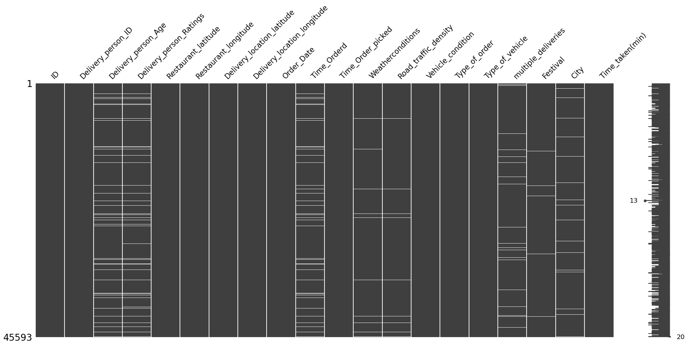{#fig-missing_values_matrix fig-align="center" width=100% .invert}

#### Count of Missing Values

The bar plot of the count of missing values is shown in @fig-count_of_missing_values.

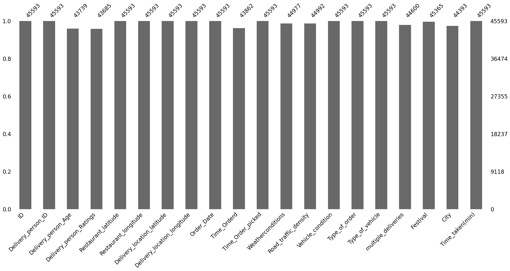{#fig-count_of_missing_values fig-align="center" width=100% .invert}

#### Correlation of Missingness

The correlation heat map of missing values that indicates whether the missingness is correlated or not is shown in @fig-correlation_of_missing_values.

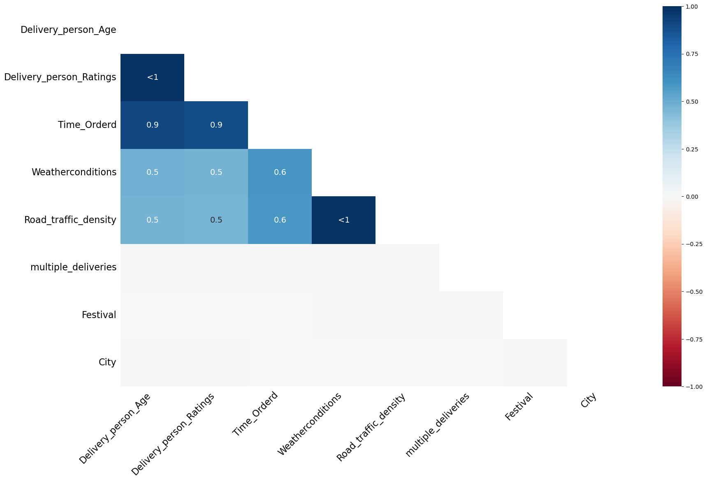{#fig-correlation_of_missing_values fig-align="center" width=100% .invert}

#### Dendrogram of Missing Values

The dendrogram of missing values is shown in @fig-dendrogram_of_missing_values.

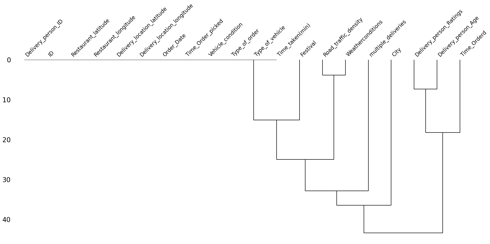{#fig-dendrogram_of_missing_values fig-align="center" width=100% .invert}

#### Observations

The observations from visualizing the missing values are the following:

- The missingness in the delivery person related columns, i.e., `Delivery_person_Age` and `Delivery_person_Ratings`, is highly correlated.
- The missingness in the `Time_Ordered` column is also highly correlated with the missingness of the delivery person columns. This might be due to some network error where the system was unable to log the delivery person details and the time of order.
- The missingness of the `Road_traffic_density` column is also highly correlated with the missingness of the `Weatherconditions` column.
- The missingness of the `Road_traffic_density` column is also highly correlated with the missingness of the delivery person columns. This might be because the road traffic density may be recorded using the delivery person's phone. We need to investigate more on this.
- Clearly, the values are missing not at random.

After running the following code

```python
pct = (df.isna().any(axis=1).sum() / df.shape[0]) * 100
print(f"{round(pct, 2)}% rows in the data have missing values.")
```

we get that there are about 9.27% of the rows in the data have missing values.

## Basic Data Cleaning

### Stripping Leading and Trailing Whitespaces

We have already mentioned about this. But just for completeness, I will repeat it here. Most values in the columns of the `object` datatype have a leading or a trailing whitespace. We removed them using the following code:

```python
object_type_columns = df.select_dtypes(include=["object"]).columns
df[object_type_columns] = df[object_type_columns].map(lambda x: x.strip() if isinstance(x, str) else x)
```

### Converting String Encoded NaN values to Actual NaN values

As mentioned earlier, the missing values in the columns of the `object` datatype are encoded in the string representation of `"NaN"`. We convert it to `np.nan` using the following code:

```python
df[object_type_columns] = df[object_type_columns].map(lambda x: np.nan if isinstance(x, str) and "NaN" in x else x)
```

### Renaming the Columns

The column names are too verbose. We rename them to have more succinct and meaningful names using the following function:

```python
def change_column_names(df: pd.DataFrame):
    rename_mapping = {
        "delivery_person_id": "rider_id",
        "delivery_person_age": "age",
        "delivery_person_ratings": "ratings",
        "delivery_location_latitude": "delivery_latitude",
        "delivery_location_longitude": "delivery_longitude",
        "time_orderd": "order_time",
        "time_order_picked": "order_picked_time",
        "weatherconditions": "weather",
        "road_traffic_density": "traffic",
        "city": "city_type",
        "time_taken(min)": "time_taken"
    }
    df = df.rename(str.lower, axis=1).rename(rename_mapping, axis=1)
    return df

df = change_column_names(df)
```

### Removing Duplicates

We check if the data has any duplicate rows using the following code:

```python
df.duplicated().sum()
```

Fortunately, there are no duplicate rows in the data. If there were, we would have just kept their first occurrence.

## Column-wise Data Cleaning

We will now discuss what data cleaning steps should be applied on each of the columns. At the end, we will create a function that applies all these steps on the data one by one.

### `id`

This column is of the `object` datatype, and is actually unique for each row. We found this by running the following code:

```python
print(f"The number of unique IDs are {df['id'].nunique()}, and the number of rows are {rows}.")
```

and we got the following output:

```txt
The number of unique IDs are 45593, and the number of rows are 45593.
```

So, we can simply drop this column as it will have no predictive power.

### `rider_id`

This column is of the `object` datatype. We ran the following code to check the number of unique values in this column:

```python
print(f"The number of unique rider IDs are {df['rider_id'].nunique()}, and the number of rows are {rows}.")
```

The output we got is

```txt
The number of unique rider IDs are 1320, and the number of rows are 45593.
```

This means that there are 1,320 unique riders in the data.

The first few `rider_id` values are the following: `"INDORES13DEL02"`, `"BANGRES18DEL02"`, `"COIMBRES13DEL02"`, `"CHENRES12DEL01"`, etc. Clearly, the substring that comes before `"RES..."` stands for the city name of the riders. So, we can create a new column called `city_name` by splitting the `rider_id` column on `"RES"` in the following way:

```python
df["rider_id"].str.split("RES").str.get(0).rename("city_name")
```

### `age`

This column right now is of the `object` datatype. We first convert it to `float` datatype using the following code:

```python
df["age"] = df["age"].astype("float")
```

Next, running the `describe` function on it gives us the following output:

```txt
count    43739.000000
mean        29.567137
std          5.815155
min         15.000000
25%         25.000000
50%         30.000000
75%         35.000000
max         50.000000
Name: age, dtype: float64
```

We can see that the youngest rider is of age 15, which is concerning. We can investigate further the type of transport they are using.

#### Boxplot

@fig-age_boxplot shows the boxplot of this column `age`.

{#fig-age_boxplot fig-align="center" width=70% .invert}

We can see that the distribution looks slightly right-skewed with no outliers.

#### Minors

We will now investigate all the riders that are minors, i.e., riders younger than 18 years of age. We create a subset (that contains minors) of our original data using the following code:

```python
minors = df.loc[df["age"] < 18]
```

There are a total of 38 observations in the data corresponding to minors. Viewing these observations showed us some concerning points, which are the following:

- All the data corresponding to minors have missing values in the columns `order_time`, `order_picked_time`, `weather`, and `traffic`.
- Some values in the column corresponding to latitude and longitude had negative values, which does not make sense as India is above the equator and to the east of the prime meridian.
- The rating of all minor riders is the worst, i.e., `1`.
- The condition of vehicles they use is the worst, i.e., `3`.
- All the minor riders are aged 15, which is below the permissible age to drive a vehicle.

Right now, it seems like removing this data makes more sense and is also easier than fixing it. This is because they have many missing values and faulty data. As these are just 38 rows in the original data, removing them won't affect the performance of the model significantly.

### `ratings`

We first change the datatype of this column from `object` to `float`. Next, running the `describe` function on this column gives the following output:

```txt
count    43685.000000
mean         4.633780
std          0.334716
min          1.000000
25%          4.500000
50%          4.700000
75%          4.900000
max          6.000000
```

Further, @fig-ratings_boxplot shows the boxplot of this column.

{#fig-ratings_boxplot fig-align="center" width=70% .invert}

#### Observations

- Minors have 1-star ratings, which, looking at the box plot, seem like anomalies.
- The 6-star ratings are not possible. Hence, these are also anomalies.
- Both these ratings need to be investigated. If the data is problematic, then fixing or removing these rows are our options.

#### Six-Star Ratings

We created a subset of the data with six-star rating using the following code:

```python
six_star_ratings = df.loc[df["ratings"] == 6]
```

There are a total of 53 such rows. Observing these rows, we saw that they also suffer from the same problems that the rows corresponding to the minors did, i.e., some of the latitude and longitude coordinates being negative, and all values missing in the columns `order_time`, `weather`, and `traffic`. We need to remove such rows.

### Location Columns

The location columns are `restaurant_latitude`, `restaurant_longitude`, `delivery_latitude`, and `delivery_longitude`. The datatype of all these columns is already correct, i.e., `float`. We now run the `describe` function on only these location columns. The output we get is shown in @tbl-location_stats.

::: {.tbl tbl-colwidths="auto"}
| Statistic | Restaurant Latitude | Restaurant Longitude | Delivery Latitude | Delivery Longitude |
|:---------:|:-------------------:|:--------------------:|:-----------------:|:------------------:|
| **count** | 45593.000000 | 45593.000000 | 45593.000000 | 45593.000000 |
| **mean** | 17.017729 | 70.231332 | 17.465186 | 70.845702 |
| **std** | 8.185109 | 22.883647 | 7.335122 | 21.118812 |
| **min** | -30.905562 | -88.366217 | 0.010000 | 0.010000 |
| **25%** | 12.933284 | 73.170000 | 12.988453 | 73.280000 |
| **50%** | 18.546947 | 75.898497 | 18.633934 | 76.002574 |
| **75%** | 22.728163 | 78.044095 | 22.785049 | 78.107044 |
| **max** | 30.914057 | 88.433452 | 31.054057 | 88.563452 |

: Summary statistics for the location columns. {#tbl-location_stats style="width:100%; margin:auto;"}
:::

To visualize this distribution better, we plot the box plot of the location columns which is shown in @fig-location_boxplot.

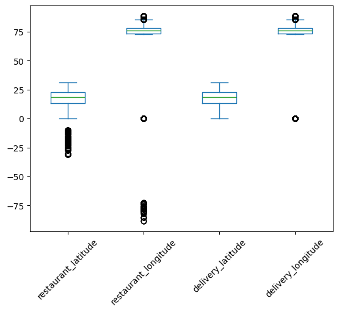{#fig-location_boxplot fig-align="center" width=70% .invert}

As India lies to the north of the equator between 6° 44' N to 35° 30' N, and between 68° 7' E to 97° 25' E, the valid values of latitudes and longitudes are only the ones that fall in this range. So, there are some faulty values of latitudes and longitudes in the data. We can see that only the values near the minimum are faulty. The maximum values already lie in the required range. So, we form a subset of the data with these incorrect coordinates using the following code:

```python
lower_bound_lat = 6.44
lower_bound_long = 68.70

incorrect_locations = df.loc[
    (df['restaurant_latitude'] < lower_bound_lat) |
    (df['restaurant_longitude'] < lower_bound_long) |
    (df['delivery_latitude'] < lower_bound_lat) |
    (df['delivery_longitude'] < lower_bound_long)
]
```

We now plot the boxplot of these incorrect location coordinates, which is shown in @fig-incorrect_coordinates_boxplot.

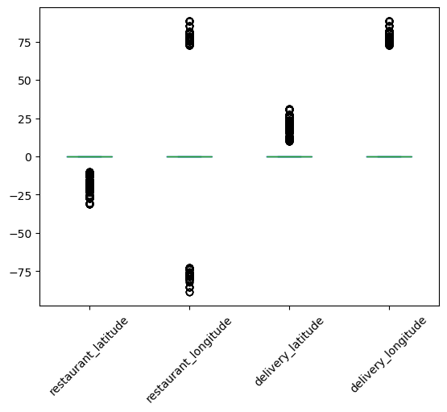{#fig-incorrect_coordinates_boxplot fig-align="center" width=70% .invert}

Looking at this box plot, it seems that the negative values may be incorrect only because of their signs. If they were positive, they would lie in the required range. There are also zeros in these columns. One way of handling the zeros is to replace them with `np.nan`, and then impute them with advanced imputation techniques that use the remaining columns.

#### Fixing Incorrect Location Columns

We will fix the incorrect location columns by just taking their absolute values. This will convert all the negative coordinates to positive. This will make sure that they lie in the proper latitude and longitude bounds of India. The boxplot of the location columns after taking the absolute value is shown in @fig-location_boxplot_after_absolute.

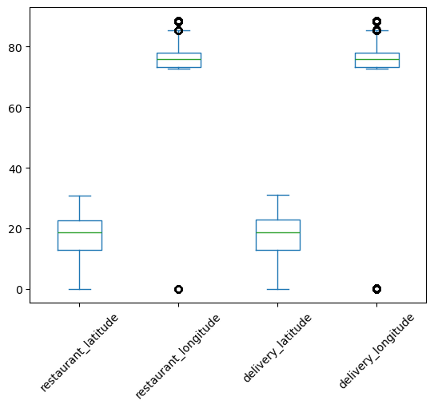{#fig-location_boxplot_after_absolute fig-align="center" width=70% .invert}

This looks good. Next, we also replace the zeros with `np.nan`. These zeros also lie outside the geographical bound of India.

We create the following common function that fixes all the latitude and longitude columns:

```python
def clean_lat_lon(df: pd.DataFrame, threshold=1):
    df = df.copy()
    location_columns = df.columns[4:8]
    df[location_columns] = df[location_columns].abs()
    df[location_columns] = df[location_columns].map(lambda x: x if x >= threshold else np.nan)
    return df
```

As we replaced the zeros with `np.nan`'s, this introduces 3,640 new missing values in the data.

#### Creating `distance` using Location Columns

We create a new column called `distance` using these location columns. This stands for the (haversine) distance between the restaurant and the delivery location. We use the following function to create this column:

```python
def calculate_haversine_distance(df):
    location_columns = location_subset.columns.tolist()
    lat1 = df[location_columns[0]]
    lon1 = df[location_columns[1]]
    lat2 = df[location_columns[2]]
    lon2 = df[location_columns[3]]

    lon1, lat1, lon2, lat2 = map(np.radians, [lon1, lat1, lon2, lat2])

    dlon = lon2 - lon1
    dlat = lat2 - lat1

    a = np.sin(dlat/2.0)**2 + np.cos(lat1) * np.cos(lat2) * np.sin(dlon/2.0)**2

    c = 2 * np.arcsin(np.sqrt(a))

    distance = 6371 * c

    return (
      df.assign(
        distance = distance
      )
    )
```

Once we create this `distance` column, we will drop the latitude and longitude columns as they have missing values and there is no way of imputing them since we also have information about cities available. We can, however, impute the `distance` column using some advanced imputation techniques that uses the other columns.

### `order_date`

This column is of the datatype `object`. We first convert it to the `datetime` format using the following code:

```python
df["order_date"] = pd.to_datetime(df["order_date"], dayfirst=True)
```

As seen earlier, this column fortunately does not have any missing values. Next, we use the following function to create new `datetime` features using this column:

```python
def extract_datetime_features(series: pd.Series):
    date_col = pd.to_datetime(series, dayfirst=True)
    data = {
        "day": date_col.dt.day,
        "month": date_col.dt.month,
        "year": date_col.dt.year,
        "day_of_week": date_col.dt.day_name(),
        "is_weekend": date_col.dt.day_name().isin(["Saturday", "Sunday"]).astype(int)
    }
    df = pd.DataFrame(data)
    return df
```

This gives us five new features, which are the following:

- `day`: This is the day of the month.
- `year`: This denotes the year.
- `month`: This is the month (numerical).
- `day_of_week`: This is a `string`, e.g., `"Monday"`.
- `is_weekend`: This is a Boolean column which is `1` if the day is a weekend, and `0` if it isn't.

We notice that the starting date in the data is `2022-02-11` and the end date is `2022-04-06`. So the year is the same for all the rows. Hence, we will drop the `year` column later.

### `order_time` and `order_picked_time`

We first drop the string `"NaN"`, then convert both these columns to `datetime`, and finally extract the feature called `time_of_day` that contains the strings `"morning"`, `"afternoon"`, `"evening"`, and `"night"`, using the following function:

```python
def extract_time_of_day(series: pd.Series):
    hr = pd.to_datetime(series, format="%H:%M:%S", errors="coerce").dt.hour
    condlist = [
        (hr.between(6, 12, inclusive="left")),
        (hr.between(12, 17, inclusive="left")),
        (hr.between(17, 20, inclusive="left")),
        (hr.between(20, 24, inclusive="left")),
    ]
    choicelist = ["morning", "afternoon", "evening", "night"]
    default = "after_midnight"
    time_of_day_info = pd.Series(np.select(condlist, choicelist, default=default), index=series.index)
    return time_of_day_info.where(series.notna(), np.nan)
```

Further, we also extract the features `pickup_time_minutes` by subtracting the values in `order_time` from the values in `order_picked_time` in minutes, and `order_time_hour`.

### `weather`

The `datatype` of this column is `object`, which is fine. To find the type of weathers available, we run the following code:

```python
df["weather"].value_counts()
```

The output we get is the following:

```txt
weather
conditions Fog           7654
conditions Stormy        7586
conditions Cloudy        7536
conditions Sandstorms    7495
conditions Windy         7422
conditions Sunny         7284
conditions NaN            616
Name: count, dtype: int64
```

We remove the redundant substring `"conditions "` from these values and replace the string `"NaN"` with `np.nan` using the following code:

```python
df["weather"] = df["weather"].str.replace("conditions ", "")
df["weather"].replace("NaN", np.nan).isna().sum()
```

### `traffic`

The `datatype` of this column is `object`, which is fine. Running the following code:

```python
df["traffic"].value_counts()
```

gives the following output:

```txt
traffic
Low       15477
Jam       14143
Medium    10947
High       4425
NaN         601
Name: count, dtype: int64
```

Again, we replace the string `"NaN"` with `np.nan`.

### `vehicle_condition`

The `datatype` of this column is `integer`, which is fine. Doing `value_counts` on it gives

```txt
vehicle_condition
2    15034
1    15030
0    15009
3      520
Name: count, dtype: int64
```

This column already seems clean.

### `type_of_order`

This is an `object`, which is fine. Doing `value_counts` on it gives us

```txt
type_of_order
Snack     11533
Meal      11458
Drinks    11322
Buffet    11280
Name: count, dtype: int64
```

This column also already seems clean.

### `type_of_vehicle`

This is an `object`, which is fine. Doing `value_counts` on it gives

```txt
type_of_vehicle
motorcycle          26435
scooter             15276
electric_scooter     3814
bicycle                68
Name: count, dtype: int64
```

We can see that there are very few instances of bicycles.

### `multiple_deliveries`

This is an `object`, which is incorrect. It should have been an integer. Before converting it to integer, we do `value_counts` on it to get

```txt
multiple_deliveries
1      28159
0      14095
2       1985
NaN      993
3        361
Name: count, dtype: int64
```

Next, we convert the string `"NaN"` to `np.nan` and convert the `datatype` to `float`.

### `festival`

This is an `object`, which is fine. Doing `value_counts` on it gives:

```txt
festival
No     44469
Yes      896
NaN      228
Name: count, dtype: int64
```

Again, we replace `"NaN"` with `np.nan`.

### `city_type`

This is an `object`, which is fine. Doing `value_counts` on it gives:

```txt
city_type
Metropolitian    34093
Urban            10136
NaN               1200
Semi-Urban         164
Name: count, dtype: int64
```

Again, we convert `"NaN"` to `np.nan`.

### `time_taken` (The Target)

This is an `object`, which is incorrect. It consists of values like `"(min) 24"`, `"(min) 33"`, etc. We remove the redundant substring of `"(min) "` from it and convert it to `integer` using the following code:

```python
df["time_taken"] = df["time_taken"].str.replace("(min) ", "").astype(int)
```

## Function for Data Cleaning

Now, we will create a single function which performs this entire data cleaning on the raw data. We need to carry out the following steps:

1. Remove the trailing spaces from all the `object`-type columns.
2. Make all the values in the `object`-type columns lower case.
3. Change the string `"NaN"` and `"conditions NaN"` to actual `np.nan`.
4. Shorten all the column names and change them also to lower case.
5. As you go ahead with cleaning each column, change its data type to the appropriate one if applicable.
6. Drop the column `id`.
7. Drop the rows corresponding to minors.
8. Drop the rows corresponding to 6-star ratings.
9. Create a new column called `city_name`.
10. Take absolute value of all the location columns.
11. Replace the values of the locations below the threshold (1) with `np.nan`.
12. Calculate haversine distance using the location columns and save it in a new column named `distance`.
13. Calculate a binned version of this `distance` and call it `distance_type`.
14. Convert all the appropriate `object`-type columns to `datetime`.
15. Create the columns `order_day`, `order_month`, `order_day_of_week`, `is_weekend`, `pickup_time_minutes`, `order_time_hour`, and `order_time_of_day`.
16. Remove `"(min) "` from all the entries of the target `time_taken`, and then convert it to integer.

The function is the following:

```python
def clean_data(df: pd.DataFrame):
    df = df.copy()

    # Removing trailing spaces from all the object-type columns
    object_type_cols = df.select_dtypes(include=['object']).columns
    for col in object_type_cols:
        df[col] = df[col].str.strip()

    # Changing all the values to lower case
    for col in object_type_cols:
        if col not in ["Delivery_person_ID"]:
            df[col] = df[col].str.lower()

    # Changing the string `"nan"` and `"conditions nan"` to `np.nan`
    df[object_type_cols] = df[object_type_cols].map(lambda x: np.nan if isinstance(x, str) and "nan" in x else x)

    # Shortening the column names and changing them to lower case
    rename_mapping = {
        "delivery_person_id": "rider_id",
        "delivery_person_age": "age",
        "delivery_person_ratings": "ratings",
        "delivery_location_latitude": "delivery_latitude",
        "delivery_location_longitude": "delivery_longitude",
        "time_orderd": "order_time",
        "time_order_picked": "order_picked_time",
        "weatherconditions": "weather",
        "road_traffic_density": "traffic",
        "city": "city_type",
        "time_taken(min)": "time_taken"
    }
    df = df.rename(str.lower, axis=1).rename(rename_mapping, axis=1)

    # Dropping the column `id`
    df.drop(columns=["id"], inplace=True)

    # Dropping minors

    ## First converting the `age` column to numeric
    df["age"] = df["age"].astype("float")
    minors = df.loc[df["age"] < 18]
    minors_idxs = minors.index
    df.drop(minors_idxs, inplace=True)

    # Dropping 6-star ratings

    ## First converting the `ratings` column to numeric
    df["ratings"] = df["ratings"].astype(float)
    six_star_ratings = df.loc[df["ratings"] == 6]
    six_star_ratings_idxs = six_star_ratings.index
    df.drop(six_star_ratings_idxs, inplace=True)

    # Creating a new column `city_name` using the column `rider_id`
    df["city_name"] = df["rider_id"].str.split("RES").str.get(0)

    # Cleaning location columns
    location_columns = df.columns[3:7]
    df[location_columns] = df[location_columns].abs()
    df[location_columns] = df[location_columns].map(lambda x: x if x >= 1 else np.nan)

    # Creating a new column called `distance` (haversine distance)
    lat1 = df[location_columns[0]]
    lon1 = df[location_columns[1]]
    lat2 = df[location_columns[2]]
    lon2 = df[location_columns[3]]

    lon1, lat1, lon2, lat2 = map(np.radians, [lon1, lat1, lon2, lat2])

    dlon = lon2 - lon1
    dlat = lat2 - lat1

    a = np.sin(dlat/2.0)**2 + np.cos(lat1) * np.cos(lat2) * np.sin(dlon/2.0)**2

    c = 2 * np.arcsin(np.sqrt(a))

    distance = 6371 * c

    df["distance"] = distance

    bins = [0, 5, 10, 15, np.inf]
    labels = ["short", "medium", "long", "very_long"]
    df["distance_type"] = pd.cut(df["distance"], bins=bins, right=False, labels=labels)

    # Cleaning the datetime related columns
    df["order_date"] = pd.to_datetime(df["order_date"], dayfirst=True)
    df["order_day"] = df["order_date"].dt.day
    df["order_month"] = df["order_date"].dt.month
    df["order_day_of_week"] = df["order_date"].dt.day_name().str.lower()
    df["order_day_is_weekend"] = df["order_day_of_week"].isin(["saturday", "sunday"]).astype(int)

    df["order_time"] = pd.to_datetime(df["order_time"], format="%H:%M:%S", errors="coerce")
    df["order_picked_time"] = pd.to_datetime(df["order_picked_time"], format="%H:%M:%S")
    df["pickup_time_minutes"] = ((df["order_picked_time"] - df["order_time"]).dt.seconds) / 60
    
    df["order_time_hour"] = df["order_time"].dt.hour
    condlist = [
        (df["order_time_hour"].between(6, 12, inclusive="left")),
        (df["order_time_hour"].between(12, 17, inclusive="left")),
        (df["order_time_hour"].between(17, 20, inclusive="left")),
        (df["order_time_hour"].between(20, 24, inclusive="left")),
    ]
    choicelist = ["morning", "afternoon", "evening", "night"]
    default = "after_midnight"
    time_of_day_info = pd.Series(np.select(condlist, choicelist, default=default), index=df["order_time"].index)
    # order_time_of_day = np.select(condlist=condlist, choicelist=choicelist, default=default)
    df["order_time_of_day"] = time_of_day_info.where(df["order_time"].notna(), np.nan)
    df.drop(columns=["order_time", "order_picked_time"], inplace=True)

    # Cleaning the `weather` column
    df["weather"] = df["weather"].str.replace("conditions ", "")

    # Changing dtype of `multiple_deliveries`
    df["multiple_deliveries"] = df["multiple_deliveries"].astype(float)

    # Cleaning the target column `time_taken`
    df["time_taken"] = df["time_taken"].str.replace("(min) ", "").astype(int)
    return df
```

This function takes in the raw data as input and returns the cleaned data.

## Missing Values after Data Cleaning

@fig-missing_values_matrix_clean_data, @fig-count_of_missing_values_clean_data, and @fig-correlation_of_missing_values_clean_data show the missing values matrix, missing value count, and the missing value correlation.

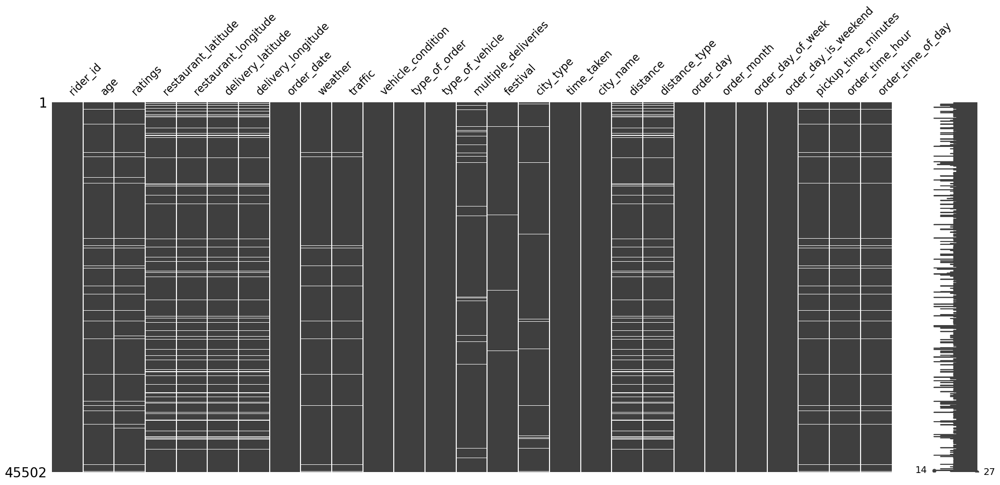{#fig-missing_values_matrix_clean_data fig-align="center" width=100% .invert}

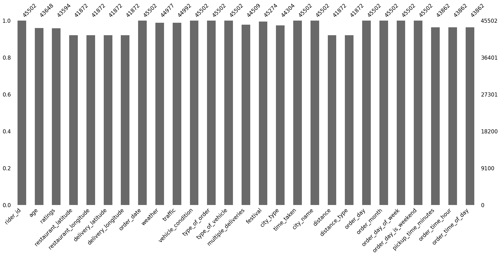{#fig-count_of_missing_values_clean_data fig-align="center" width=100% .invert}

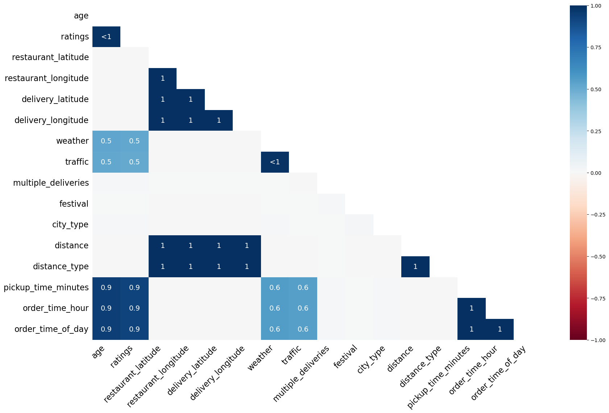{#fig-correlation_of_missing_values_clean_data fig-align="center" width=100% .invert}

Again, the missing values clearly are missing not at random. There is extremely high correlation in their missingness.

## Jupyter Notebook

The entire data cleaning was performed in [this Jupyter notebook](https://github.com/SushrutGaikwad/swiggy-delivery-time-prediction/blob/main/notebooks/data_cleaning.ipynb).

# EDA

The main problems that we aim to solve while doing EDA are the following:

- Feature selection,
- Missing data imputation.

We will first clean the raw data using the function `clean_data` that we built in the data cleaning stage, and then carry out EDA on this cleaned data.

## Jupyter Notebook

The entire EDA was carried out in [this Jupyter notebook](https://github.com/SushrutGaikwad/swiggy-delivery-time-prediction/blob/main/notebooks/EDA.ipynb).

## Functions to Perform Analysis

I have created some functions that will perform analysis of a numerical variable, analysis of a categorical and a numerical variable, analysis of a categorical variables, multivariate analysis, $\chi^2$ test (using `chi2_contingency` from `scipy.stats`), ANOVA test (using `f_oneway` from `scipy.stats`), and normality test (using `jarque_bera` from `scipy.stats`). These functions are the following:

```python
def numerical_analysis(data: pd.DataFrame, col_name: str, cat_col=None, bins="auto"):
    # create the figure
    fig = plt.figure(figsize=(15, 10))
    # generate the layout
    grid = GridSpec(nrows=2, ncols=2, figure=fig)
    # set subplots
    ax1 = fig.add_subplot(grid[0, 0])
    ax2 = fig.add_subplot(grid[0, 1])
    ax3 = fig.add_subplot(grid[1, :])
    # kdeplot
    sns.kdeplot(data=data, x=col_name, hue=cat_col, ax=ax1)
    # boxplot
    sns.boxplot(data=data, x=col_name, hue=cat_col, ax=ax2)
    # histogram
    sns.histplot(data=data, x=col_name, bins=bins, hue=cat_col, kde=True, ax=ax3)
    plt.tight_layout()
    plt.show();


def categorical_numerical_analysis(data: pd.DataFrame, cat_col, num_col):
    fig, (ax1, ax2) = plt.subplots(2, 2, figsize=(15, 7.5))
    # barplot
    sns.barplot(data=data, x=cat_col, y=num_col, ax=ax1[0])
    # boxplot
    sns.boxplot(data=data, x=cat_col, y=num_col, ax=ax1[1])
    # violinplot
    sns.violinplot(data=data, x=cat_col, y=num_col, ax=ax2[0])
    # stripplot
    sns.stripplot(data=data, x=cat_col, y=num_col, ax=ax2[1])
    plt.tight_layout()
    plt.show();


def categorical_analysis(data: pd.DataFrame, col_name):
    dic = {
        "Count": data[col_name].value_counts(),
        "Percentage": data[col_name].value_counts(normalize=True).mul(100).round(2).astype("str").add("%")
    }
    df = pd.DataFrame(dic)
    display(df)
    print("#" * 150)
    unique_categories = data[col_name].unique().tolist()
    no_of_categories = data[col_name].nunique()
    print(f"\nThe unique categories in the column '{col_name}' are {unique_categories}.", end="\n\n")
    print("#" * 150)
    print(f"\nThe number of categories in the column '{col_name}' are {no_of_categories}.", end="\n\n")
    sns.countplot(data=data, x=col_name)
    plt.xticks(rotation=45)
    plt.show();


def multivariate_analysis(data: pd.DataFrame, num_col, cat_col_1, cat_col_2):
    fig, (ax1, ax2) = plt.subplots(2, 2, figsize=(15, 7.5))
    # barplot
    sns.barplot(data=data, x=cat_col_1, y=num_col, hue=cat_col_2, ax=ax1[0])
    # boxplot
    sns.boxplot(data=data, x=cat_col_1, y=num_col, hue=cat_col_2, gap=0.1, ax=ax1[1])
    # violin plot
    sns.violinplot(data=data, x=cat_col_1, y=num_col, hue=cat_col_2, gap=0.1, ax=ax2[0])
    # strip plot
    sns.stripplot(data=data, x=cat_col_1, y=num_col, hue=cat_col_2, dodge=True, ax=ax2[1])
    plt.tight_layout()
    plt.show();


def chi2_test(data: pd.DataFrame, col1, col2, alpha=0.05):
    data = data.loc[:, [col1, col2]].dropna()
    # contingency table
    contingency_table = pd.crosstab(data[col1], data[col2])
    # chi2 test
    _, p_val, _, _ = chi2_contingency(contingency_table)
    print(f"p-value: {p_val}.")
    if p_val <= alpha:
        print(f"Reject H0. The data indicates significant association between '{col1}' and '{col2}'.")
    else:
        print(f"Not enough evidence to reject H0. The data indicates no significant association between '{col1}' and '{col2}'.")


def anova_test(data: pd.DataFrame, num_col, cat_col, alpha=0.05):
    data = data.loc[:, [num_col, cat_col]].dropna()
    cat_group = data.groupby(cat_col)
    groups = [group[num_col].values for _, group in cat_group]
    f_statistic, p_val = f_oneway(*groups)
    print(f"p-value: {p_val}.")
    if p_val <= alpha:
        print(f"Reject H0. The data indicates significant relationship between '{num_col}' and '{cat_col}'.")
    else:
        print(f"Not enough evidence to reject H0. The data indicates no significant relationship between '{num_col}' and '{cat_col}'.")


def normality_test(data: pd.DataFrame, col_name, alpha=0.05):
    data = data[col_name]
    print("Jarque Bera test for normality:")
    _, p_val = jarque_bera(data)
    print(f"p-value: {p_val}.")
    if p_val <= alpha:
        print(f"Reject H0. The column '{col_name}' IS NOT normally distributed.")
    else:
        print(f"Not enough evidence to reject H0. The column '{col_name}' IS normally distributed.")
```

These functions do the following:

- `numerical_analysis` plots the kernel density estimation plot, the box plot, and the box plot of a given numerical variable,
- `categorical_numerical_analysis` plots a bar plot, the box plot, the violin plot, and the strip plot for a particular given pair of categorical and numerical variable
- `categorical_analysis` returns a `pandas.DataFrame` with the value counts and the percentage of each category, prints the name of unique categories, and plots a count plot of the categories
- `multivariate_analysis` pots a bar plot, box plot, violin plot, and a strip plot with all of them having the first categorical column on the horizontal axis, the numerical column in the vertical axis, and the color encoding as the second categorical column
- `chi2_test` performs the $\chi^2$ test between two categorical features to find if there is an association between them; `anova_test` performs the ANOVA test between a numerical column and a categorical column to check if they are associated
- `normality_test` performs the Jarque–Bera test to test whether a given numerical column is normally distributed.

## Column-wise EDA

### `time_taken` (Target)

Running `numerical_analysis` on the column `time_taken` (the target) gives us the plots shown in @fig-num_ana_target.

{#fig-num_ana_target fig-align="center" width=100% .invert}

We can observe the following:

- The target column is not fully continuous in nature.
- It shows dual modality with two peaks: one around the 17-18 mark, and the other around the 26-27 mark.
- It has very few extreme points. They cannot be thought of outliers as they are just extreme and rare. A delivery time of 50 mins. is possible in certain rare circumstances.

@fig-Q-Q_target shows the Q-Q plot of the target variable.

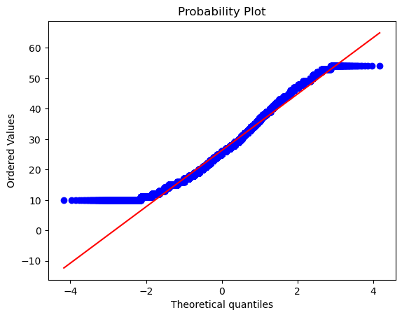{#fig-Q-Q_target fig-align="center" width=60% .invert}

The tails differ significantly from the normal distribution. Even running the `normality_test` function gave the output that this column, i.e., the target, is not normally distributed. We also found that all the observations for which the target column is high, the traffic condition is either high or jam, which is expected. However, we found that weather didn't affect this column much as the distribution of weather types were mostly uniformly distributed even for higher values of `time_taken`, i.e., the target. Further, we also found that deliveries that lake longer time also have larger distance associated with them, which is again expected.

#### Transforming `time_taken` using Yeo-Johnson Transformation

We tried using the Yeo-Johnson transformation on the column `time_taken` with the intention to make it more normal looking. @fig-num_ana_target_yjt shows the plot given by the `numerical_analysis` function on this column after the transformation.

{#fig-num_ana_target_yjt fig-align="center" width=100% .invert}

As we can see, the transformation did make it look more normal, however the `normality_test` function still categorized it as being not normal. But it is closer to a normal distribution than before taking the transformation. So, we will do this transformation on the target.

### `rider_id`

Our main reasoning behind keeping this column was to check whether it can be used to fill in the missing values in the columns `age` and `ratings`. However, after grouping the data by `rider_id` and then checking the `age` and the `ratings` column, we observed that there are many inconsistencies in this column. For instance, many rows have the same `rider_id` but different values of `age` and `ratings`. Hence, this column cannot be used to fill in the missing values in `age` and `ratings`. We will drop this column.

### `age`

@fig-num_ana_age shows the plots generated after running the `numerical_analysis` function on the column `age`.

{#fig-num_ana_age fig-align="center" width=100% .invert}

We can see that `age` seems to be nearly uniformly distributed between 20 to 39.

#### Relationship between `time_taken` (target) and `age`

@fig-scatter_time_taken_and_age shows a scatter plot between `time_taken` and `age`.

{#fig-scatter_time_taken_and_age fig-align="center" width=70% .invert}

We can see that `age` does not seem to affect the target `time_taken`. So the delivery time is not dependent on age of the delivery person. We can also see that `age` is a discrete numerical column.

#### Relationship between `time_taken`, `age`, and `type_of_vehicle`

@fig-scatter_time_taken_and_age_vehicle_condition shows a scatter plot between `time_taken` and `age` with hue as `vehicle_condition`.

{#fig-scatter_time_taken_and_age_vehicle_condition fig-align="center" width=80% .invert}

We can see that for higher values of `time_taken`, i.e., for longer deliveries, generally the vehicles with the best condition (0) are used.

#### Relationship between `age` and `type_of_vehicle`

@fig-stripplot_age_type_of_vehicle shows a strip plot between `age` and `type_of_vehicle`.

{#fig-stripplot_age_type_of_vehicle fig-align="center" width=70% .invert}

We can see that there is no preference of `type_of_vehicle` with `age`. The reason we do not seem to have any ages for bicycles may be because there are missing values in the `age` column whenever the `type_of_vehicle` is bicycle.

### `ratings`

@fig-num_ana_ratings shows the plots generated after running the `numerical_analysis` function on the column `ratings`.

{#fig-num_ana_ratings fig-align="center" width=100% .invert}

We can see that this column is left-skewed with most of the ratings as greater than 4.

#### Relationship between `time_taken` (target) and `ratings`

@fig-scatter_time_taken_and_ratings shows a scatter plot between `time_taken` and `ratings`.

{#fig-scatter_time_taken_and_ratings fig-align="center" width=70% .invert}

We can see that the riders with high `ratings` are preferred for longer deliveries. Further, riders with high `ratings` also get more orders. So, higher `ratings` will give riders more work, and hence more income.

#### Relationship between `vehicle_condition` and `ratings`

@fig-cat_num_ana_vehicle_condition_ratings shows the plots generated after running the `categorical_numerical_analysis` function with the categorical column as `vehicle_condition` and the numerical column as `ratings`.

{#fig-cat_num_ana_vehicle_condition_ratings fig-align="center" width=100% .invert}

We observe the following:

- We can see that the average `rating` seems to be very similar for the first three vehicle conditions.
- However, riders with the best `vehicle_condition` (0) have `ratings` of more than 3, whereas riders with the subsequent `vehicle_condition` also have `ratings` lower than 3.
- The worst `vehicle_condition` (3) has no data for `ratings`. This may be because customers may not want to rate riders with such vehicles.

#### Relationship between `type_of_vehicle` and `ratings`

@fig-cat_num_ana_type_of_vehicle_ratings shows the plots generated after running the `categorical_numerical_analysis` function with the categorical column as `type_of_vehicle` and the numerical column as `ratings`.

{#fig-cat_num_ana_type_of_vehicle_ratings fig-align="center" width=100% .invert}

We observe that:

- The mean ratings for all the `type_of_vehicle` (except bicycle) seem very similar, however the strip plot indicates that electric scooters mostly have higher `ratings` as compared to the other `type_of_vehicle`.
- Bicycles do not have `ratings` because there are `NaN` values in ratings if `type_of_vehicle` is bicycle.

#### Relationship between `festivals` and `ratings`

@fig-cat_num_ana_festival_ratings shows the plots generated after running the `categorical_numerical_analysis` function with the categorical column as `festival` and the numerical column as `ratings`.

{#fig-cat_num_ana_festival_ratings fig-align="center" width=100% .invert}

We can see that during `festival`s, the `ratings` generally go down.

### Location Columns

We use the location columns for delivery, i.e., `delivery_latitude` and `delivery_longitude`, to plot the locations on an interactive map to visualize where the deliveries are being done. We use `plotly.express` to do this. @fig-map_delivery_locations shows this plot.

{#fig-map_delivery_locations fig-align="center" width=100% .invert}

### `order_date` and Related Columns

The related columns are `order_date`, `order_day`, `order_month`, `order_day_of_week`, `order_day_is_weekend`, and `festival`

#### Relationship between `time_taken` (target) and `order_day_of_week`

@fig-cat_num_ana_order_day_of_week_time_taken shows the plots generated after running the `categorical_numerical_analysis` function with the categorical column as `order_day_of_week` and the numerical column as `time_taken`.

{#fig-cat_num_ana_order_day_of_week_time_taken fig-align="center" width=100% .invert}

We can see that on an average, delivery times are slightly lesser on Thursdays.

#### Relationship between `time_taken` (target) and `order_day_is_weekend`

@fig-cat_num_ana_order_day_is_weekend_time_taken shows the plots generated after running the `categorical_numerical_analysis` function with the categorical column as `order_day_is_weekend` and the numerical column as `time_taken`.

{#fig-cat_num_ana_order_day_is_weekend_time_taken fig-align="center" width=100% .invert}

The distribution looks very similar. So it doesn't look like `order_day_is_weekend` affects the target `time_taken`.

#### Relationship between `traffic` and `order_day_is_weekend`

After running the `chi2_test` function on these two columns, we found that there is not enough evidence in the data to suggest that there is any significant association between them.

#### Relationship between `time_taken` (target) and `festival`

@fig-cat_num_ana_festival_time_taken shows the plots generated after running the `categorical_numerical_analysis` function with the categorical column as `festival` and the numerical column as `time_taken`.

{#fig-cat_num_ana_festival_time_taken fig-align="center" width=100% .invert}

We observe the following:

- Clearly, if there is a `festival`, then the delivery time is longer on average.
- Also, the range of delivery times is shorter with lesser variation when there is a festival.

#### Relationship between `festival` and `traffic`

After running the `chi2_test` function on these two columns, we found that there is enough evidence in the data to suggest that there is a significant association between them. To view this difference, we created a pivot table which is shown in @tbl-festival_traffic_time.

::: {.tbl tbl-colwidths="auto"}
| Traffic Density | Festival: No | Festival: Yes |
|:---------------:|:------------:|:-------------:|
| `high` | 27.010373 | 45.826087 |
| `jam` | 30.538039 | 46.093651 |
| `low` | 21.284332 | 42.020000 |
| `medium` | 26.550288 | 43.715385 |

: Average delivery time (in minutes) across traffic conditions and festival days. {#tbl-festival_traffic_time style="width:60%; margin:auto;"}
:::

We can clearly see how `time_taken` increases with increase in `traffic` congestion. Also, it seems like during festivals the delivery always takes longer.

#### Relationship between `festival`, `order_day_is_weekend`, and `time_taken`

@fig-mult_ana_time_taken_order_day_is_weekend_festival shows the plots generated after running the `multivariate_analysis` function with the numerical column as `time_taken`, and the two categorical columns as `order_day_is_weekend` and `festival`.

{#fig-mult_ana_time_taken_order_day_is_weekend_festival fig-align="center" width=100% .invert}

We can see that it doesn't matter whether a `festival` falls on a weekend. The `time_taken` is similarly distributed in either case.

### `order_time` and Related Columns

The columns related to `order_time` are `order_time_hour`, `order_time_of_day`, and `pickup_time_minutes`.

#### Relationship between `order_time_of_day` and `time_taken` (target)

@fig-cat_num_ana_order_time_of_day_time_taken shows the plots generated after running the `categorical_numerical_analysis` function with the categorical column as `order_time_of_day` and the numerical column as `time_taken`.

{#fig-cat_num_ana_order_time_of_day_time_taken fig-align="center" width=100% .invert}

We can see that deliveries in the morning are the quickest whereas the deliveries in the evening are the longest. Running the function `anova_test` on these two columns also confirmed that the data indicates significant relationship between them. After using the `value_counts` function on the `order_time_of_day` column, we found that most orders are placed at 9 p.m. @fig-bar_order_time_hour_count shows a bar plot of this count.

{#fig-bar_order_time_hour_count fig-align="center" width=70% .invert}

Further, @fig-bar_order_time_of_day_count shows the same bar plot for the column `order_time_of_day`.

{#fig-bar_order_time_of_day_count fig-align="center" width=70% .invert}

### `pickup_time_minutes`

#### Relationship between `time_taken` (target) and `pickup_time_minutes`

@fig-scatter_time_taken_pickup_time_minutes shows a scatter plot between the target, i.e., `time_taken`, and `pickup_time_minutes`.

{#fig-scatter_time_taken_pickup_time_minutes fig-align="center" width=70% .invert}

We observe the following:

- So there is no relationship between `pickup_time_minutes` and `time_taken`.
- We can also see that `pickup_time_minutes` can be treated like an ordinal categorical column.

So, running the `categorical_analysis` funcdtion on this column gives us the bar plot of the count of values in this column, which is shown in @fig-bar_pickup_time_minutes_count.

{#fig-bar_pickup_time_minutes_count fig-align="center" width=70% .invert}

We can see that the three categories in `pickup_time_minutes` are almost equally distributed. Next, @fig-cat_num_ana_pickup_time_minutes_time_taken shows the plots generated after running the `categorical_numerical_analysis` function with categorical column as `pickup_time_minutes` and numerical column as `time_taken`.

{#fig-cat_num_ana_pickup_time_minutes_time_taken fig-align="center" width=100% .invert}

Here also we can see that the different categories in `pickup_time_minutes` have no relation with the target `time_taken`. This was also confirmed by running the `anova_test` function on these two columns.

### `traffic`

This is a categorical column. Running the function `categorical_analysis` on this column gives the bar plot of the count of its categories, which is shown in @fig-bar_traffic_count.

{#fig-bar_traffic_count fig-align="center" width=70% .invert}

Most of the times the traffic is either `low` or is `jam`.

#### Relationship between `traffic` and `city_type`, and `traffic` and `city_name`

Running the `chi2_test` function on `traffic` and `city_type` indicated a significant association between them. However, the same test on `traffic` and `city_name` indicated no significant association.

#### Relationship between `time_taken` (target) and `traffic`

@fig-cat_num_ana_traffic_time_taken shows the plots generated after running the `categorical_numerical_analysis` function with categorical column as `traffic` and numerical column as `time_taken`.

{#fig-cat_num_ana_traffic_time_taken fig-align="center" width=100% .invert}

Clearly, `time_taken` is lower when `traffic` has the least congestion, and vice versa. The association between these two variables was also confirmed after running the `anova_test` function on them.

#### Relationship between `time_taken` (target), `traffic`, and `type_of_vehicle`

@fig-mult_ana_time_taken_traffic_type_of_vehicle shows the plots generated after running the `multivariate_analysis` function with the numerical column as `time_taken`, and the two categorical columns as `traffic` and `type_of_vehicle`.

{#fig-mult_ana_time_taken_traffic_type_of_vehicle fig-align="center" width=100% .invert}

We can see that motorcycles take longer time as compared to scooters and electric scooters. Bicycle has no points due to it having missing values in the corresponding `traffic` column, maybe due to the fact that bicycle people do not use smart phones.

#### Relationship between `time_taken` (target), `traffic`, and `vehicle_condition`

@fig-mult_ana_time_taken_traffic_vehicle_condition shows the plots generated after running the `multivariate_analysis` function with the numerical column as `time_taken`, and the two categorical columns as `traffic` and `vehicle_condition`.

{#fig-mult_ana_time_taken_traffic_vehicle_condition fig-align="center" width=100% .invert}

We can see that vehicles with the best condition have longer `time_taken`. This may be because the vehicles with the best `vehicle_condition` are preferred for longer deliveries.

#### Relationship between `time_taken`, `festival`, and `vehicle_condition`

@fig-mult_ana_time_taken_festival_vehicle_condition shows the plots generated after running the `multivariate_analysis` function with the numerical column as `time_taken`, and the two categorical columns as `festival` and `vehicle_condition`.

{#fig-mult_ana_time_taken_festival_vehicle_condition fig-align="center" width=100% .invert}

We can see that during `festival`s the vehicles with the worst `vehicle_condition` take longer, maybe due to breakdowns. They are also getting less orders during festivals, as evident from the strip plot (bottom right).

### `multiple_deliveries`

This is like a categorical column.

#### Relationship between `multiple_deliveries` and `time_taken` (target)

@fig-cat_num_ana_multiple_deliveries_time_taken shows the plots generated after running the `categorical_numerical_analysis` function with the categorical column as `multiple_deliveries` and the numerical column as `time_taken`.

{#fig-cat_num_ana_multiple_deliveries_time_taken fig-align="center" width=100% .invert}

Clearly, more deliveries take longer time. This is also confirmed by running the `anova_test` function on `time_taken` and `multiple_deliveries`.

#### Relationship between `multiple_deliveries` and `distance`

@fig-cat_num_ana_multiple_deliveries_distance shows the plots generated after running the `categorical_numerical_analysis` function with the categorical column as `multiple_deliveries` and the numerical column as `distance`.

{#fig-cat_num_ana_multiple_deliveries_distance fig-align="center" width=100% .invert}

We can see that with more `multiple_deliveries`, the `distance` also increases.

### `weather`

This is a categorical column. Running the `categorical_analysis` function on this gives a bar plot of the count of categories that are shown in @fig-bar_weather_count.

{#fig-bar_weather_count fig-align="center" width=70% .invert}

We can see that the categories in `weather` are uniformly distributed. There is no imbalance.

#### Relationship between `time_taken` (target) and `weather`

@fig-cat_num_ana_weather_time_taken shows the plots generated after running the `categorical_numerical_analysis` function with the categorical column as `weather` and the numerical column as `time_taken`.

{#fig-cat_num_ana_weather_time_taken fig-align="center" width=100% .invert}

We can see that `time_taken` is higher for bad `weather`. The fact that they are associated was also confirmed after running the `anova_test` function on them.

#### Relationship between `weather` and `traffic`

Running the `chi2_test` function on them revealed no significant association between the two.

#### Relationship between `weather`, `traffic`, and `time_taken`

@fig-mult_ana_time_taken_weather_traffic shows the plots generated after running the `multivariate_analysis` function with the numerical column as `time_taken`, and the two categorical columns as `weather` and `traffic`.

{#fig-mult_ana_time_taken_weather_traffic fig-align="center" width=100% .invert}

We can see that `traffic` has a similar distribution with respect to `time_taken` in all `weather` conditions. So, `traffic` is a more important feature as compared to `weather` for predicting `time_taken` (target). @tbl-weather_traffic_time shows a pivot table of average value of these three columns.

::: {.tbl tbl-colwidths="auto"}
| Weather Condition | High Traffic | Jam Traffic | Low Traffic | Medium Traffic |
|:-----------------:|:------------:|:-----------:|:-----------:|:--------------:|
| `cloudy` | 28.940860 | 36.689655 | 22.208445 | 28.483134 |
| `fog` | 28.426546 | 36.806916 | 22.303427 | 28.044816 |
| `sandstorms` | 27.711840 | 30.018758 | 20.297049 | 27.738522 |
| `stormy` | 27.845839 | 29.850194 | 20.681734 | 27.680502 |
| `sunny` | 23.448980 | 23.082132 | 21.449293 | 20.195518 |
| `windy` | 26.972789 | 30.219056 | 20.665862 | 27.888769 |

: Average delivery time (in minutes) across traffic conditions and weather types. {#tbl-weather_traffic_time style="width:100%; margin:auto;"}
:::

### `vehicle_condition`

This is a categorical column. Running the `categorical_analysis` function on it gives the bar plot of count of the categories in this column which is shown in @fig-bar_vehicle_condition_count.

{#fig-bar_vehicle_condition_count fig-align="center" width=70% .invert}

We can see that the worst `vehicle_condition` (3) is rare. We will need to handle it.

#### Relationship between `time_taken` (target) and `vehicle_condition`

@fig-cat_num_ana_vehicle_condition_time_taken shows the plots generated after running the `categorical_numerical_analysis` function with the categorical column as `vehicle_condition` and the numerical column as `time_taken`.

{#fig-cat_num_ana_vehicle_condition_time_taken fig-align="center" width=100% .invert}

We can see that the vehicles with the best `vehicle_condition` take longer. This is because such vehicles are preferred for longer deliveries. Their association was also confirmed by running the `anova_test` function on the two.

### `type_of_vehicle`

This is a categorical column. Running the `categorical_analysis` function on it gives the bar plot of count of the categories in this column which is shown in @fig-bar_type_of_vehicle_count.

{#fig-bar_type_of_vehicle_count fig-align="center" width=70% .invert}

We can see that bicycles are extremely rare. We will have to handle it.

#### Relationship between `time_taken` (target) and `type_of_vehicle`

@fig-cat_num_ana_type_of_vehicle_time_taken shows the plots generated after running the `categorical_numerical_analysis` function with the categorical column as `type_of_vehicle` and the numerical column as `time_taken`.

{#fig-cat_num_ana_type_of_vehicle_time_taken fig-align="center" width=100% .invert}

We can see that motorcycles are preferred for longer deliveries.

#### Relationship between `vehicle_condition`, `type_of_vehicle`, and `time_taken` (target)

@fig-mult_ana_time_taken_vehicle_condition_type_of_vehicle shows the plots generated after running the `multivariate_analysis` function with the numerical column as `time_taken`, and the two categorical columns as `vehicle_condition` and `type_of_vehicle`.

{#fig-mult_ana_time_taken_vehicle_condition_type_of_vehicle fig-align="center" width=100% .invert}

We can observe the following:

- The best `vehicle_condition` only has motorcycles. The next best `vehicle_condition` has motorcycles and scooters; the next best has motorcycles, scooters, and electric scooters; and the worst `vehicle_condition` has all, i.e., motorcycles, scooters, electric scooters, and bicycles.
- The delivery times for motorcycles is the highest mostly because they are getting long distance deliveries.

#### Relationship between `type_of_vehicle` and `vehicle_condition`

Running the `chi2_test` function on these two columns indicated a significant association between them.

### `type_of_order`

This is a categorical column. Running the `categorical_analysis` function on it gives the bar plot of count of the categories in this column which is shown in @fig-bar_type_of_order_count.

{#fig-bar_type_of_order_count fig-align="center" width=70% .invert}

All the `type_of_order`s are mostly uniformly distributed.

#### Relationship between `time_taken` (target) and `type_of_order`

@fig-cat_num_ana_type_of_order_time_taken shows the plots generated after running the `categorical_numerical_analysis` function with the categorical column as `type_of_order` and the numerical column as `time_taken`.

{#fig-cat_num_ana_type_of_order_time_taken fig-align="center" width=100% .invert}

It looks like `type_of_order` does not affect `time_taken`. This was also confirmed after running the `anova_test` function on these two columns.

#### Relationship between `type_of_order` and `order_day_is_weekend`

@tbl-order_type_weekend shows the pivot table between these two columns.

::: {.tbl tbl-colwidths="auto"}
| Type of Order | Weekday (0) | Weekend (1) |
|:-------------:|:-----------:|:-----------:|
| `buffet` | 8238 | 3023 |
| `drinks` | 8130 | 3164 |
| `meal` | 8290 | 3145 |
| `snack` | 8337 | 3175 |

: Distribution of order types across weekdays and weekends. {#tbl-order_type_weekend style="width:50%; margin:auto;"}
:::

The proportions are more or less the same. So `type_of_order` doesn't seem to depend on `order_day_is_weekend`.

#### Relationship between `type_of_order` and `pickup_time_minutes`

Running the `chi2_test` function on these indicated no significant association.

#### Relationship between `type_of_order` and `ratings`

@fig-cat_num_ana_type_of_order_ratings shows the plots generated after running the `categorical_numerical_analysis` function with the categorical column as `type_of_order` and the numerical column as `ratings`.

{#fig-cat_num_ana_type_of_order_ratings fig-align="center" width=100% .invert}

It looks like `type_of_order` has no effect on `ratings`.

#### Relationship between `type_of_order` and `festival`

Running the `chi2_test` function on these two indicated no significant association.

### `city_name`

This is a categorical column. Running the function `categorical_analysis` on this column gives the bar plot of the count of its categories, which is shown in @fig-bar_city_name_count.

{#fig-bar_city_name_count fig-align="center" width=70% .invert}

#### Relationship between `time_taken` (target) and `city_name`

@fig-cat_num_ana_city_name_time_taken shows the plots generated after running the `categorical_numerical_analysis` function with the categorical column as `city_name` and the numerical column as `time_taken`.

{#fig-cat_num_ana_city_name_time_taken fig-align="center" width=100% .invert}

It looks like there is no significant effect of `city_name` on `time_taken`.

### `city_type`

This is a categorical column. Running the function `categorical_analysis` on this column gives the bar plot of the count of its categories, which is shown in @fig-bar_city_type_count.

{#fig-bar_city_type_count fig-align="center" width=70% .invert}

We can see that semi-urban `city_type` is extremely rare. We will need to handle it.

#### Relationship between `time_take` (target) and `city_type`

@fig-cat_num_ana_city_type_time_taken shows the plots generated after running the `categorical_numerical_analysis` function with the categorical column as `city_type` and the numerical column as `time_taken`.

{#fig-cat_num_ana_city_type_time_taken fig-align="center" width=100% .invert}

Clearly, urban cities have the lowest `time_taken`, followed by metropolitian, and then semi-urban. The fact that they are associated was also confirmed by running the `anova_test` function on them.

#### Relationship between `ratings` and `city_type`

@fig-cat_num_ana_city_type_ratings shows the plots generated after running the `categorical_numerical_analysis` function with the categorical column as `city_type` and the numerical column as `ratings`.

{#fig-cat_num_ana_city_type_ratings fig-align="center" width=100% .invert}

We can see that there are no `ratings` below 3.5 in cities of semi-urban `city_type`.

#### Relationship between `time_taken` (target), `city_type`, and `type_of_vehicle`

@fig-mult_ana_time_taken_city_type_type_of_vehicle shows the plots generated after running the `multivariate_analysis` function with the numerical column as `time_taken`, and the two categorical columns as `city_type` and `type_of_vehicle`.

{#fig-mult_ana_time_taken_city_type_type_of_vehicle fig-align="center" width=100% .invert}

We can see that bicycles are not used in the cities with `city_type` as semi-urban.

### `distance`

This is a numerical column. Running `numerical_analysis` on the column `distance` gives us the plots shown in @fig-num_ana_distance.

{#fig-num_ana_distance fig-align="center" width=100% .invert}

We can see that the distribution is not normal.

#### Relationship between `time_taken` (target) and `distance`

@fig-scatter_time_taken_and_distance shows a scatter plot between `time_taken` and `distance`.

{#fig-scatter_time_taken_and_distance fig-align="center" width=70% .invert}

The values in the `distance` column also seem close to discrete. We also found that the correlation between `time_taken` and `distance` is about 0.32.

#### Relationship between `type_of_vehicle` and `distance`

@fig-cat_num_ana_type_of_vehicle_distance shows the plots generated after running the `categorical_numerical_analysis` function with the categorical column as `type_of_vehicle` and the numerical column as `distance`.

{#fig-cat_num_ana_type_of_vehicle_distance fig-align="center" width=100% .invert}

There doesn't seem to be any relationship.

#### Relationship between `distance` and `festival`

@fig-cat_num_ana_festival_distance shows the plots generated after running the `categorical_numerical_analysis` function with the categorical column as `festival` and the numerical column as `distance`.

{#fig-cat_num_ana_festival_distance fig-align="center" width=100% .invert}

We can see that riders cover larger distances during festivals.

# Building a Baseline Model

We will first create a baseline model by dropping all the missing values in the data. This will be a linear regression model. We will later compare it with the same linear regression model but with missing values imputed.

## Baseline Model with Missing Values Dropped

Here, we first simply use the same function to clean the data. Further, we also drop the unnecessary columns that we identified during the EDA to not have much predictive power to predict the target. These column are:

- `rider_id`
- `restaurant_latitude`
- `restaurant_longitude`
- `delivery_latitude`
- `delivery_longitude`
- `order_date`
- `order_time_hour`
- `order_day`

Next, we drop all the rows containing missing values, split the data into input features and the output, and finally split the data into training and test sets with 20% of the data in the test set.

### Data Preprocessing

We have the following numerical columns:

- `age`,
- `ratings`,
- `pickup_time_minutes`,
- `distance`,

the following nominal categorical columns:

- `weather`,
- `type_of_order`,
- `type_of_vehicle`,
- `festival`,
- `city_type`,
- `city_name`,
- `order_month`,
- `order_day_of_week`,
- `order_day_is_weekend`,
- `order_time_of_day`,

and the following ordinal categorical columns:

- `traffic`,
- `distance_type`.

Note that we also have the columns `multiple_deliveries` and `vehicle_condition` which are already encoded correctly. So we won't perform any data preprocessing on them. Now, we use simple one-hot encoding for the nominal categorical column, and ordinal encoding for the ordered categorical column. For `traffic`, the ordinal encoding is done with the following order:

```python
traffic_order = ['low', 'medium', 'high', 'jam']
```

and for `distance_type` it is done using the following order:

```python
distance_type_order = ['short', 'medium', 'long', 'very_long']
```

Next, we build a preprocessor using scikit-learn's `ColumnTransformer`. The code for that is the following:

```python
preprocessor = ColumnTransformer(
    transformers=[
        ("scaler", MinMaxScaler(), num_cols),
        ("nominal_encoder", OneHotEncoder(drop="first", handle_unknown="ignore", sparse_output=False), nominal_cat_cols),
        ("ordinal_encoder", OrdinalEncoder(categories=[traffic_order, distance_type_order]), ordinal_cat_cols)
    ],
    remainder="passthrough",
    n_jobs=-1,
    force_int_remainder_cols=False,
    verbose_feature_names_out=False,
)
```

Notice that before encoding we are using the `MinMaxScaler` transformation on the columns. We train this `preprocessor` object on the training data and use it to transform the training as well as test sets.

#### Transforming the Target `time_taken`

As seen during the EDA, the Yeo-Johnson transformation makes the column `time_taken` (the target) become more normal. Hence, we train a `PowerTransformer` object with the Yeo-Johnson method on the training output and transform the training and the test outputs.

### Model

Training a linear regression model on this data with missing values dropped gives us the error metrics shown in @tbl-model_performance_nan_dropped.

::: {.tbl tbl-colwidths="auto"}
| Metric | Training Set | Test Set |
|:------:|:------------:|:--------:|
| MAE | 4.67 mins. | 4.73 mins. |
| R^2^ | 0.60 | 0.60 |

: Model performance metrics on training and test datasets with missing values dropped. {#tbl-model_performance_nan_dropped style="width:65%; margin:auto;"}
:::

## Baseline Model with Missing Values Imputed

We will follow the same data cleaning and preprocessing steps, however this time we will also impute the missing values. For imputing the missing values, we will need to check if simple imputation methods, like the mean or median imputation, will work by comparing the distribution of the column before and after imputation. If the distribution is more or less the same, we will stick with these simple techinques. Otherwise, we will use complex imputation techniques, like $k$-NN imputation.

The columns that have missing values are the following:

- `age`,
- `ratings`,
- `weather`,
- `traffic`,
- `multiple_deliveries`,
- `festival`,
- `city_type`,
- `distance`,
- `distance_type`,
- `pickup_time_minutes`,
- `order_time_of_day`.

### `age`

The distribution of `age` before and after median imputation is shown in @fig-age_before_after_imputation.

{#fig-age_before_after_imputation fig-align="center" width=70% .invert}

The distribution of `age` has changed significantly. We should use advanced imputation techniques like $k$-NN imputation.

### `ratings`

The distribution of `ratings` before and after median imputation is shown in @fig-ratings_before_after_imputation.

{#fig-ratings_before_after_imputation fig-align="center" width=70% .invert}

Again, the distribution has changed.

### `weather`

The count plot of the categories in `weather` is shown in @fig-countplot_weather.

{#fig-countplot_weather fig-align="center" width=70% .invert}

No category in `weather` is dominating. Hence, we cannot impute using the most frequent (or mode) category. It will change the distribution significantly. So, we will instead use a missing indicator column and impute the missing values using the string `"missing"`.

### `traffic`

The count plot of the categories in `traffic` is shown in @fig-countplot_traffic.

{#fig-countplot_traffic fig-align="center" width=70% .invert}

There are two `traffic` categories that are dominating, `low` and `jam`. Hence, we cannot use the most frequent category (or mode) imputation. So we will again have to use a missing indicator.

### `multiple_deliveries`

The count plot of the categories in `multiple_deliveries` is shown in @fig-countplot_multiple_deliveries.

{#fig-countplot_multiple_deliveries fig-align="center" width=70% .invert}

`multiple_deliveries` has a clear dominating category. So, we can impute it using its mode. The count plot after imputation is shown in @fig-countplot_multiple_deliveries_after_imputation.

{#fig-countplot_multiple_deliveries_after_imputation fig-align="center" width=70% .invert}

### `festival`

The count plot of the categories in `festival` is shown in @fig-countplot_festival.

{#fig-countplot_festival fig-align="center" width=70% .invert}

`festival` has an overwhelmingly dominating category. Hence we can use mode imputation. The count plot after imputation stays almost the same.

### `city_type`

The count plot of the categories in `city_type` is shown in @fig-countplot_city_type.

{#fig-countplot_city_type fig-align="center" width=70% .invert}

`city_type` has an overwhelmingly dominating category. Hence we can use mode imputation. The count plot after imputation stays almost the same.

### `pickup_time_minutes`

The distribution of `pickup_time_minutes` before and after median imputation is shown in @fig-pickup_time_minutes_before_after_imputation.

{#fig-pickup_time_minutes_before_after_imputation fig-align="center" width=70% .invert}

The distribution has changed. We will need to use $k$-NN imputation.

### `order_time_of_day`

The count plot of the categories in `order_time_of_day` is shown in @fig-countplot_order_time_of_day.

{#fig-countplot_order_time_of_day fig-align="center" width=70% .invert}

There is no category that is overwhelmingly dominating. So we will have to use a missing indicator column and a fill value of `"missing"`.

### `distance`

The distribution of `distance` before and after median imputation is shown in @fig-distance_before_after_imputation.

{#fig-distance_before_after_imputation fig-align="center" width=70% .invert}

As the distribution has changed substantially, we should use advanced imputation methods.

### `distance_type`

The count plot of the categories in `distance_type` is shown in @fig-countplot_distance_type.

{#fig-countplot_distance_type fig-align="center" width=70% .invert}

There is no category that is overwhelmingly dominating. So we will have to use a missing indicator column and a fill value of `"missing"`.

### Creating a Model Pipeline

We will use mode imputation to fill the missing values in the columns

- `multiple_deliveries`,
- `festival`,
- `city_type`,

and use a missing indicator with a fill value of `"missing"` in the columns

- `weather`,
- `type_of_order`,
- `type_of_vehicle`,
- `city_name`,
- `order_month`,
- `order_day_of_week`,
- `order_day_is_weekend`,
- `order_time_of_day`,

and use $k$-NN imputation for the remaining columns. We will now create one more `ColumnTransformer` object for simple imputation (mode imputation and missing indicator).

```python
simple_imputer = ColumnTransformer(
    transformers=[
        ("mode_imputer", SimpleImputer(strategy="most_frequent"), features_to_fill_mode),
        ("missing_ind", SimpleImputer(strategy="constant", fill_value="missing"), features_to_fill_missing_ind)
    ],
    remainder="passthrough",
    n_jobs=-1,
    force_int_remainder_cols=False,
    verbose_feature_names_out=False
)
```

Further, we will also create a `KNNImputer` object.

```python
knn_imputer = KNNImputer(n_neighbors=5)
```

Next, we will combine all these transformers into a single scikit-learn `Pipeline`.

```python
preprocessing_pipeline = Pipeline(
    steps=[
        ("simple_imputer", simple_imputer),
        ("preprocessor", preprocessor),
        ("knn_imputer", knn_imputer)
    ]
)
```

Finally, we will add this pipeline inside another pipeline that also consists of the linear regression model.

```python
lr = LinearRegression()

model_pipeline = Pipeline(
    steps=[
        ("preprocessor", preprocessing_pipeline),
        ("model", lr)
    ]
)
```

The error metrics obtained on the data using this pipeline are shown in @tbl-model_performance_nan_dropped.

::: {.tbl tbl-colwidths="auto"}
| Metric | Training Set | Test Set |
|:------:|:------------:|:--------:|
| MAE | 4.82 mins. | 4.85 mins. |
| R^2^ | 0.58 | 0.58 |

: Model performance metrics on training and test datasets with missing values imputed. {#tbl-model_performance_nan_imputed style="width:65%; margin:auto;"}
:::

Comparing @tbl-model_performance_nan_dropped and @tbl-model_performance_nan_imputed, we can see that dropping the missing values gives a model with better performance as compared imputing them.

#### Trying Random Forest Model in the Model Pipeline

We also tried random forest model in the pipeline with missing value imputation.

```python
rf = RandomForestRegressor(random_state=42, n_jobs=-1)

model_pipeline = Pipeline(
    steps=[
        ("preprocessor", preprocessing_pipeline),
        ("model", rf)
    ]
)
```

The error metrics obtained on the data using this pipeline are shown in @tbl-rf_model_performance_nan_dropped.

::: {.tbl tbl-colwidths="auto"}
| Metric | Training Set | Test Set |
|:------:|:------------:|:--------:|
| MAE | 1.22 mins. | 3.28 mins. |
| R^2^ | 0.97 | 0.80 |

: Random Forest model performance metrics on training and test datasets with missing values imputed. {#tbl-rf_model_performance_nan_dropped style="width:65%; margin:auto;"}
:::

We can see that the random forest model performs way better than the baseline linear regression model. However, it also overfits more.

## Jupyter Notebook

The baseline model was built in [this Jupyter notebook](https://github.com/SushrutGaikwad/swiggy-delivery-time-prediction/blob/main/notebooks/baseline_model.ipynb).

# Experimentation

We have used MLFlow to log experiments and their results. The tracking server is set up on DagsHub. The experiments we performed are the following:

1. Compare a random forest model with imputing missing values vs. dropping missing values.
2. Train a random forest model with missing value imputation and adding missing indicator columns.
3. Train the following regressors and their parameters (using the Optuna library) on the best configuration obtained from the previous two experiments and select two best models:
     - Random forest,
     - Gradient boosting,
     - XGBoost,
     - LightGBM,
     - $k$-Nearest neighbors,
     - SVM.
4. Carry out detailed hyperparameter tuning of the first model obtained in the previous experiment.
5. Carry out detailed hyperparameter tuning of the second model obtained in the experiment 3.
6. Train a stacking regressor, i.e., a meta estimator, using the two best models obtained in the previous two experiments as base estimators. We chose multiple meta estimators
7. Carry out detailed hyperparameter tuning of the stacking regressor with the best meta estimator.

Let us now discuss the results of each experiment.

## Experiment 1: Drop vs. Impute `NaN`'s

The results are shown in @tbl-model_performance_rf_nan_compare.

::: {.tbl tbl-colwidths="auto"}
| Metric | Training Set (Dropped `NaN`s) | Test Set (Dropped `NaN`s) | Training Set (Imputed `NaN`s) | Test Set (Imputed `NaN`s) |
|:------:|:----------------------------:|:-------------------------:|:-----------------------------:|:--------------------------:|
| MAE | 1.14 mins. | 3.12 mins. | 1.22 mins. | 3.28 mins. |
| R^2^ | 0.98 | 0.83 | 0.97 | 0.80 |

: Random Forest model performance comparison with missing values dropped vs. imputed. {#tbl-model_performance_rf_nan_compare style="width:100%; margin:auto;"}
:::

The parallel coordinates plot obtained on MLFlow for this experiment is shown in @fig-mlflow_exp1.

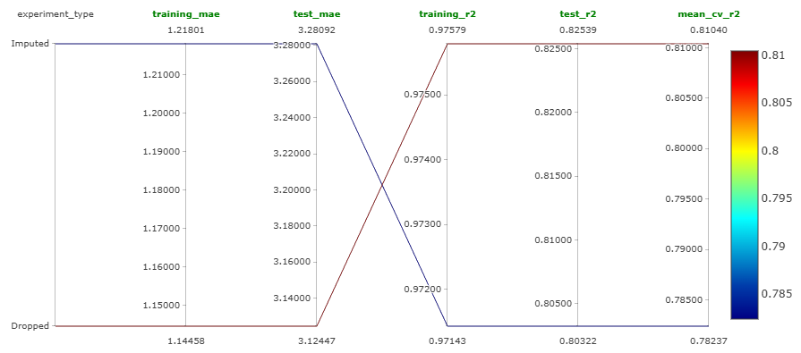{#fig-mlflow_exp1 fig-align="center" width=100%}

We can see that the model performs better when the missing values are dropped. However the common result is that the model is overfitting in both situations. But we now know that dropping the missing values is the way to go.

### Jupyter Notebook

This experiment was performed in [this Jupyter notebook](https://github.com/SushrutGaikwad/swiggy-delivery-time-prediction/blob/main/notebooks/Exp_1_drop_vs_impute.ipynb).

## Experiment 2: Adding Missing Indicator Columns

This is very simply done by adding the Boolean parameter of

```python
add_indicator = True
```

inside the `SimpleImputer` object while defining it. The result obtained in this experiment are shown in @tbl-model_performance_missing_indicator.

::: {.tbl tbl-colwidths="auto"}
| Metric | Training Set | Test Set |
|:------:|:------------:|:--------:|
| MAE | 1.21 mins. | 3.26 mins. |
| R^2^ | 0.97 | 0.81 |

: Random Forest model performance metrics on training and test datasets with added missing indicator columns. {#tbl-model_performance_missing_indicator style="width:65%; margin:auto;"}
:::

Comparing @tbl-model_performance_rf_nan_compare and @tbl-model_performance_missing_indicator, we can see that adding missing indicator columns barely made any difference. @fig-mlflow_exp2 shows the parallel coordinates plot that compares adding missing indicator columns vs. not adding them while imputing missing values.

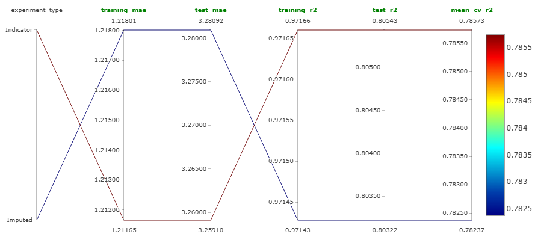{#fig-mlflow_exp2 fig-align="center" width=100%}

So, from experiments 1 and 2, we can conclude that dropping the missing values is the best strategy.

### Jupyter Notebook

This experiment was performed in [this Jupyter notebook](https://github.com/SushrutGaikwad/swiggy-delivery-time-prediction/blob/main/notebooks/Exp_2_adding_missing_indicator.ipynb).

## Experiment 3: Model Selection

As mentioned before, we trained the following models:

- Random forest,
- Gradient boosting,
- XGBoost,
- LightGBM,
- $k$-Nearest neighbors,
- SVM,

using Optuna that carries out Bayesian optimization. The best performing model is LightGBM. The results are shown in @tbl-lightgbm_model_performance.

::: {.tbl tbl-colwidths="auto"}
| Metric | Training Set | Test Set |
|:------:|:------------:|:--------:|
| MAE | 2.82 mins. | 3.05 mins. |
| R^2^ | 0.86 | 0.84 |

: Model performance metrics on training and test datasets for the LightGBM model. {#tbl-lightgbm_model_performance style="width:65%; margin:auto;"}
:::

We can see that this model not only performs well on the test set as compared to random forest, but also has less overfitting. The second best model we got was random forest.

### Jupyter Notebook

This experiment was performed in [this Jupyter notebook](https://github.com/SushrutGaikwad/swiggy-delivery-time-prediction/blob/main/notebooks/Exp_3_model_selection.ipynb).

## Experiment 4: Detailed Hyperparameter Tuning of LightGBM

We carried detailed hyperparameter tuning of the LightGBM model using Optuna (Bayesian optimization). The hyperparameters we tuned are the following:

- `n_estimators`,
- `max_depth`,
- `learning_rate`,
- `subsample`,
- `min_child_weight`,
- `min_split_gain`,
- `reg_lambda`.

Further, we also logged the best performing LightGBM model on MLFlow. The optimization history plot of this experiment is shown in @fig-lightgbm_optimization_history.

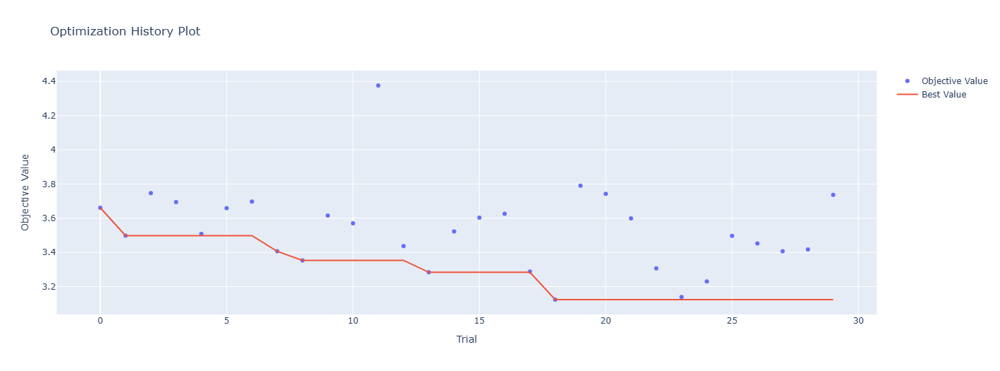{#fig-lightgbm_optimization_history fig-align="center" width=100%}

The hyperparameter importances plot is shown in @fig-lightgbm_hyperparameter_importances.

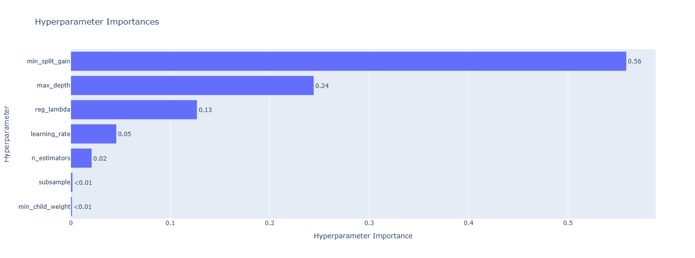{#fig-lightgbm_hyperparameter_importances fig-align="center" width=100%}

### Jupyter Notebook

This experiment was performed in [this Jupyter notebook](https://github.com/SushrutGaikwad/swiggy-delivery-time-prediction/blob/main/notebooks/Exp_4_LGBM_HP_tuning.ipynb).

## Experiment 5: Detailed Hyperparameter Tuning of Random Forest

We carried detailed hyperparameter tuning of the random forest model using Optuna (Bayesian optimization). The hyperparameters we tuned are the following:

- `n_estimators`,
- `max_depth`,
- `max_features`,
- `min_samples_split`,
- `min_samples_leaf`,
- `max_samples`.

Further, we also logged the best performing random forest model on MLFlow. The optimization history plot of this experiment is shown in @fig-rf_optimization_history.

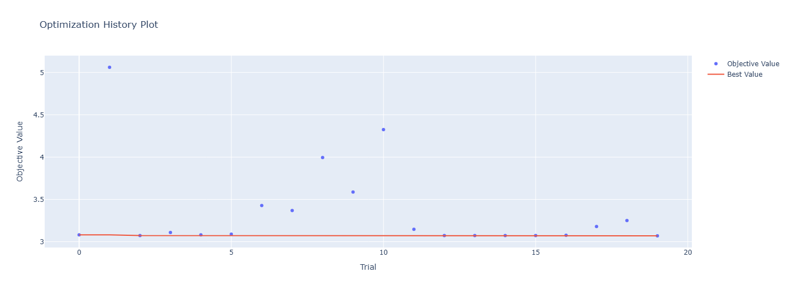{#fig-rf_optimization_history fig-align="center" width=100%}

The hyperparameter importances plot is shown in @fig-rf_hyperparameter_importances.

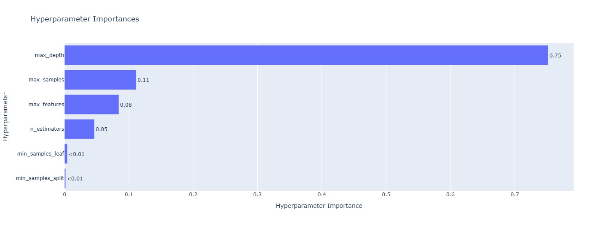{#fig-rf_hyperparameter_importances fig-align="center" width=100%}

### Jupyter Notebook

This experiment was performed in [this Jupyter notebook](https://github.com/SushrutGaikwad/swiggy-delivery-time-prediction/blob/main/notebooks/Exp_5_RF_HP_tuning.ipynb).

## Experiment 6: Meta Regressor

We tried three meta models: linear regression, $k$-nearest neighbors, and decision tree. The base estimators used were the best models that we got in the previous two experiments. This hyperparameter tuning to find the best meta model was also done using Optuna. This is just a basic coarse hyperparameter tuning. Detailed one is carried out in the next experiment. We found that the best meta model is linear regression.

### Jupyter Notebook

This experiment was performed in [this Jupyter notebook](https://github.com/SushrutGaikwad/swiggy-delivery-time-prediction/blob/main/notebooks/Exp_6_stacking_regressor_HP_tuning.ipynb).

## Experiment 7: Final Regressor

The best meta regressor found in the previous experiment was linear regression. As linear regression does not have any hyperparameters to tune, we created the final regressor in this experiment using base estimators as the best models found in experiments 4 and 5. We also logged this final regressor model on MLFlow.

### Jupyter Notebook

This experiment was performed in [this Jupyter notebook](https://github.com/SushrutGaikwad/swiggy-delivery-time-prediction/blob/main/notebooks/Exp_7_final_regressor.ipynb).

# Building the DVC Pipeline

Let us discuss the stages that will be incorporated in the DVC pipeline. All these stages were implemented in complete modular fashion with classes and objects. Also, the DVC remote was set as an Amazon S3 bucket.

## Stages in the DVC Pipeline

### Data Cleaning

The functionality of this stage is almost the same as that of the `clean_data` function that we created when we cleaned the data before doing EDA. This stage does the following:

- Removes trailing spaces from each entry in the observations,
- Converts all the entries to lowercase,
- Replaces the string `"NaN"` to `np.nan`,
- Renames columns to more succinct and meaningful names,
- Drops all the ID related columns,
- Drops all the rows corresponding to minors, i.e., riders below the age of 18,
- Drops all the rows corresponding to a rating of 6,
- Creates a new feature for the name of the city,
- Cleans location columns (latitude and longitude columns),
- Computes haversine distance using the location columns,
- Bins the distances,
- Cleans datetime columns,
- Cleans the `weather` column,
- Converts the datatype of `multiple_deliveries` column to `float`
- Transforms the target (`time_taken`) using the Yeo-Johnson transformation,
- Drops unnecessary columns.

Once all these steps are carried out, the cleaned data is saved. All these steps are implemented in the `data_cleaning.py` module, which can be checked out [here](https://github.com/SushrutGaikwad/swiggy-delivery-time-prediction/blob/main/swiggy_delivery_time_prediction/data/data_cleaning.py).

### Training-Test Split

This stage simply does the following:

- Loads the cleaned data that was saved after running the previous stage,
- Loads the parameters (from the `params.yaml` file) needed for creating the training-test split (e.g., `test_size`, `random_state`),
- Splits the cleaned data into training and test sets,
- Saves these sets.

All these steps are implemented in the `training_test_split.py` module, which can be checked out [here](https://github.com/SushrutGaikwad/swiggy-delivery-time-prediction/blob/main/swiggy_delivery_time_prediction/data/training_test_split.py).

### Data Preprocessing

This stage carries out the following steps:

- Loads the training and test sets that were saved after running the previous stage,
- Drops missing values from both these sets,
- Forms the input-output (`X_train`, `y_train`, `X_test`, `y_test`) split,
- Creates a scikit-learn's `ColumnTransformer` object containing steps for min-max scaling, and categorical encoding,
- Trains this object on the training set,
- Transforms the training and test sets using the trained `ColumnTransformer` object,
- Joins transformed `X_train` and `y_train` to form the training data, and similarly forms the test data,
- Saves the transformed training and test data,
- Saves the trained `ColumnTransformer` object.

All these steps are implemented in the `data_preprocessing.py` module, which can be checked out [here](https://github.com/SushrutGaikwad/swiggy-delivery-time-prediction/blob/main/swiggy_delivery_time_prediction/features/data_preprocessing.py).

### Model Training

This stage carries out the following steps:

- Loads the transformed training data that was saved after running the previous stage,
- Forms the input-output (`X_train`, `y_train`) split of this transformed training data,
- Reads the tuned hyperparameters (from the `params.yaml`) of both the models (LightGBM and random forest),
- Creates a `StackingRegressor` model with linear regression as the meta estimator and the tuned LightGBM and tuned random forest as the base estimators,
- Trains this `StackingRegressor` model and the Yeo-Johnson transformer on the training data,
- Saves this trained model and the trained transformer.

All these steps are implemented in the `model_training.py` module, which can be checked out [here](https://github.com/SushrutGaikwad/swiggy-delivery-time-prediction/blob/main/swiggy_delivery_time_prediction/models/model_training.py).

### Model Evaluation

This stage carries out the following steps:

- Loads the transformed training and test data that was saved after running the data preprocessing stage,
- Input-output splits them both (i.e., forms `X_train`, `y_train`, `X_test`, `y_test`),
- Loads the trained model that was saved after running the previous stage,
- Makes prediction on the `X_train` and `X_test` (i.e., gets the training and test predictions),
- Compares the predictions with the ground truths and calculates the following metrics:
  - Training MAE,
  - Test MAE,
  - Training $R^2$,
  - Test $R^2$,
  - Average of the cross-validated MAE.
- Logs the individual cross-validated MAE, data (training and test) as the input, model, and artifacts like the stacking regressor, preprocessor and the Yeo-Johnson transformer on MLFlow,
- Logs the information of the trained model in a JSON file. This file contains the ID, path, and the name of the model. Using this information, this model can be registered in MLFlow model registry (which is the next stage).

All these steps are implemented in the `model_evaluation.py` module, which can be checked out [here](https://github.com/SushrutGaikwad/swiggy-delivery-time-prediction/blob/main/swiggy_delivery_time_prediction/models/model_evaluation.py).

### Model Registration

This stage carries out the following steps:

- Loads the JSON file containing the information of the trained model which was saved after running the previous stage,
- Using this information, it registers the model on MLFlow model registry,
- Transition the stage of the model to "Staging".

All these steps are implemented in the `model_registration.py` module, which can be checked out [here](https://github.com/SushrutGaikwad/swiggy-delivery-time-prediction/blob/main/swiggy_delivery_time_prediction/models/model_registration.py).

## `dvc.yaml`

All these stages in the DVC pipeline are connected through the `dvc.yaml` file, which can be checked out [here](https://github.com/SushrutGaikwad/swiggy-delivery-time-prediction/blob/main/dvc.yaml). Running the following command in the terminal from the root directory (i.e., the directory where `dvc.yaml` file is present) will run this pipeline:

```bash
dvc repro
```

<!-- TODO: [Figure ..](#) shows a basic DAG of the pipeline. -->

# Building the API

The API is created using FastAPI. The steps carried out are the following:

- Cleans the data,
- Loads the JSON file containing the model information,
- Loads the preprocessor object,
- Loads the latest model,
- Builds a scikit-learn `Pipeline` with the preprocessor and the model,
- Makes predictions using the pipeline.

The app has the following two endpoints:

- `"/"`: This is a basic welcome page.
- `"/predict"`: This makes the predictions on the given data using the pipeline.

The code for this is in the `app.py` module, which can be checked out [here](https://github.com/SushrutGaikwad/swiggy-delivery-time-prediction/blob/main/app.py). The API can be manually tested using the Swagger UI that is comes with FastAPI.

## Locally Testing the API

The API was locally tested by creating a new Python script `sample_predictions.py`. This script loads a random row from the raw data and gives it as input to the `"/predict"` endpoint of the API and prints the ground truth and the prediction. This script can be checked out [here](https://github.com/SushrutGaikwad/swiggy-delivery-time-prediction/blob/main/scripts/sample_predictions.py).

# Model Testing

The following tests are performed on the model:

- **Model Loading:**
  - Testing whether the registered model is loading correctly.
- **Model Performance:**
  - Testing whether the performance of this model is good.

Once the model passes both these tests, it will be promoted from the "Staging" stage to the "Production" stage. Later, we will include both these tests as a part of continuous integration (CI) using GitHub actions.

## Model Loading

As mentioned earlier, this test makes sure that the registered model correctly loads from the MLFlow model registry. The following steps are carried out:

- Loads the JSON file containing the latest model information,
- Gets the latest model from the model registry using this information and a given stage,
- Performs a parameterized test that checks whether the registered model loads correctly.

The code for this is in the `test_model_registration.py` module inside the `tests` directory, which can be checked out [here](https://github.com/SushrutGaikwad/swiggy-delivery-time-prediction/blob/main/tests/test_model_registration.py).

## Model Performance

Again, as mentioned earlier, this test makes sure that the performance of the registered model is good. This is done by making sure that the test MAE is below a certain threshold. The steps carried out are the following:

- Loads the JSON file containing the latest model information,
- Gets the latest model from the model registry using this information and a given stage,
- Loads the preprocessor,
- Creates a scikit-learn `Pipeline` using the preprocessor and the loaded model,
- Loads the test data,
- Makes predictions using the pipeline,
- Calculate the test MAE,
- Performs a parameterize test and check whether this test MAE is below the threshold (which is right now kept at 5 mins.).

The code for this is in the `test_model_performance.py` module inside the `tests` directory, which can be checked out [here](https://github.com/SushrutGaikwad/swiggy-delivery-time-prediction/blob/main/tests/test_model_performance.py).

# Continuous Integration (CI)

We automate the tests that are performed so far using CI on a GitHub runner using GitHub actions. This is done by creating a workflow file called `ci_cd.yaml` (the name can be anything) inside the `workflows` directory, which is in turn placed inside the `.github` directory of the project root. This workflow file consists of all the instructions that the GitHub runner follow to carry out these tests. Once all these tests are passed, we promote the model from the "Staging" stage to the "Production" stage. This promotion is done using the `promote_model_to_production.py` module, which can be checked out [here](https://github.com/SushrutGaikwad/swiggy-delivery-time-prediction/blob/main/scripts/promote_model_to_production.py).

The current content of the `ci_cd.yaml` workflow file is the following:
```yaml
name: CI-CD

on: push

jobs:
  CI-CD:
    runs-on: ubuntu-latest
    steps:
      - name: Code checkout
        uses: actions/checkout@v4
      
      - name: Setup Python
        uses: actions/setup-python@v5
        with:
          python-version: '3.12'
          cache: 'pip'

      - name: Cache pip dependencies
        uses: actions/cache@v3
        with:
          path: ~/.cache/pip
          key: ${{ runner.os }}-pip-${{ hashFiles('**/requirements-dev.txt') }}
          restore-keys: |
            ${{ runner.os }}-pip-
      
      - name: Install packages
        run: |
          python -m pip install --upgrade pip
          pip install -r requirements-dev.txt
    
      - name: Configure AWS credentials
        uses: aws-actions/configure-aws-credentials@v4
        with:
          aws-access-key-id: ${{ secrets.AWS_ACCESS_KEY_ID }}
          aws-secret-access-key: ${{ secrets.AWS_SECRET_ACCESS_KEY }}
          aws-region: us-east-2
      
      - name: DVC pull
        run: |
          dvc pull
      
      - name: Test model registration
        env:
          DAGSHUB_USER_TOKEN: ${{ secrets.DAGSHUB_TOKEN }}
        run: |
          pytest tests/test_model_registration.py
      
      - name: Test model performance
        env:
          DAGSHUB_USER_TOKEN: ${{ secrets.DAGSHUB_TOKEN }}
        run: |
          pytest tests/test_model_performance.py
      
      - name: Promote model
        if: success()
        env:
          DAGSHUB_USER_TOKEN: ${{ secrets.DAGSHUB_TOKEN }}
        run: |
          python scripts/promote_model_to_production.py
``

The explanation is the following:

- **Workflow Name and Trigger**
  
  ```yaml
  name: CI-CD

  on: push
  ```

  - **Name:** The workflow is named CI-CD.
  - **Trigger:** It runs every time code is pushed to the repository.

- **Job Definition**

  ```yaml
  jobs:
    CI-CD:
      runs-on: ubuntu-latest
  ```

  - Defines a **single job** also named `CI-CD`.
  - This job will run on the **latest Ubuntu runner** provided by GitHub.

- **Step 1: Checkout Repository**

  ```yaml
  - name: Code checkout
    uses: actions/checkout@v4
  ```

  - **Checks out** the latest version of the repository so the runner has access to your code.

- **Step 2: Set Up Python**

  ```yaml
  - name: Setup Python
    uses: actions/setup-python@v5
    with:
      python-version: '3.12'
      cache: 'pip'
  ```

  - **Installs Python 3.12** on the runner.
  - **Enables caching for pip** to speed up future runs.

- **Step 3: Cache pip Dependencies**

  ```yaml
  - name: Cache pip dependencies
    uses: actions/cache@v3
    with:
      path: ~/.cache/pip
      key: ${{ runner.os }}-pip-${{ hashFiles('**/requirements-dev.txt') }}
      restore-keys: |
        ${{ runner.os }}-pip-
  ```

  - Uses caching to **store downloaded Python packages** between workflow runs.
  - This reduces time and bandwidth if `requirements-dev.txt` hasn't changed.

- **Step 4: Install Python Packages**

  ```yaml
  - name: Install packages
    run: |
      python -m pip install --upgrade pip
      pip install -r requirements-dev.txt
  ```

  - **Upgrades pip** to the latest version.
  - Installs all the **development dependencies** listed in `requirements-dev.txt`.

- **Step 5: Configure AWS Credentials**

  ```yaml
  - name: Configure AWS credentials
    uses: aws-actions/configure-aws-credentials@v4
    with:
      aws-access-key-id: ${{ secrets.AWS_ACCESS_KEY_ID }}
      aws-secret-access-key: ${{ secrets.AWS_SECRET_ACCESS_KEY }}
      aws-region: us-east-2
  ```

  - Uses GitHub secrets to **authenticate with AWS**.
  - Enables access to AWS services like S3 or ECR (used by DVC in this case).

- **Step 6: Pull Data and Models using DVC**

  ```yaml
  - name: DVC pull
    run: |
      dvc pull
  ```

  - Runs `dvc pull` to **download data**, **models**, or **other tracked artifacts** from DVC remote storage.

- **Step 7: Test Model Registration**

  ```yaml
  - name: Test model registration
    env:
      DAGSHUB_USER_TOKEN: ${{ secrets.DAGSHUB_TOKEN }}
    run: |
      pytest tests/test_model_registration.py
  ```

  - Runs the test located in `tests/test_model_registration.py`.
  - This tests verifies whether the model loads successfully from the model registry.
  - Uses a **DagsHub token** for authenticated interaction.

- **Step 8: Test Model Performance**

  ```yaml
  - name: Test model performance
    env:
      DAGSHUB_USER_TOKEN: ${{ secrets.DAGSHUB_TOKEN }}
    run: |
      pytest tests/test_model_performance.py
  ```

  - Runs the test located in `tests/test_model_performance.py`.
  - This test verifies that the performance of the model is good.

- **Step 9: Promote Model to Production**

  ```yaml
  - name: Promote model
    if: success()
    env:
      DAGSHUB_USER_TOKEN: ${{ secrets.DAGSHUB_TOKEN }}
    run: |
      python scripts/promote_model_to_production.py
  ```

  - If **all previous steps succeed**, the script `promote_model_to_production.py` is executed.
  - It **promotes the model to production stage**.

# Containerizing the API using Docker
