# Abstract

The rapid expansion of e-commerce, along with the increase in online web and mobile applications has led to generation of huge amounts of data. This has skyrocketed the need for efficient data storage, retrieval, and management. We aim to create a robust database application for the Olist store, which is a Brazilian e-commerce store, to manage customer information, product catalogues, order processing, and customer reviews.

## Tech Stack

- **Database Systems:** PostgreSQL (data loading, schema design, constraints), SQLite (lightweight deployment)
- **Querying & Optimization:** SQL, indexing, `EXPLAIN` / query plan analysis
- **Data Ingestion & ETL:** CSV → DB pipelines (`COPY` in PostgreSQL, `pandas` + `sqlite3` for SQLite)
- **Backend / Scripting:** Python (`sqlite3`, `pandas`)
- **App / UI:** Streamlit (interactive SQL query runner)
- **Modeling & Design:** E/R modeling (Lucidchart), normalization (BCNF, functional dependencies)
- **Tooling:** Git/GitHub (version control), Kaggle (dataset source)

# Introduction

This project analyzes the Brazilian e-commerce public dataset by Olist, available on [Kaggle](https://www.kaggle.com/datasets/olistbr/brazilian-ecommerce). The dataset contains information on about 100,000 orders from 2016 to 2018, encompassing multiple dimensions of e-commerce operations including order status, pricing, payments, customer locations, and product reviews. We obtained this dataset to explore marketplace dynamics and optimize e-commerce strategies. Our analysis focuses on solving marketplace problems by examining key metrics such as order volumes, popular product categories, and customer behavior. We will use SQL queries to investigate sales trends, seller performance, and customer satisfaction. This real-world dataset provides an interesting use case for understanding the complexities of managing a multi-seller e-commerce platform and deriving actionable insights for business improvement.

We downloaded this dataset in csv format on the local machine and then imported it into a PostgreSQL database. We created a database schema called `RAW` to store the data in a structured manner using the `INSERT` statements provided in the following `insert_stmt.sql` file.

```sql
-- Insert data into customers table
COPY "RAW".customers(customer_id, customer_unique_id, customer_zip_code_prefix, customer_city, customer_state)
FROM 'C:\Users\sushrut\Desktop\Others\4_DMQL\olist\olist_customers_dataset.csv'
DELIMITER ',' CSV HEADER;

-- Insert data into products table
COPY "RAW".products(product_id, product_category_name, product_name_length, product_description_length, product_photos_qty, product_weight_g, product_length_cm, product_height_cm, product_width_cm)
FROM 'C:\Users\sushrut\Desktop\Others\4_DMQL\olist\olist_products_dataset.csv'
DELIMITER ',' CSV HEADER;

-- Insert data into sellers table
COPY "RAW".sellers (seller_id, seller_zip_code_prefix, seller_city, seller_state)
FROM 'C:\Users\sushrut\Desktop\Others\4_DMQL\olist\olist_sellers_dataset.csv'
WITH (FORMAT CSV, HEADER true, DELIMITER ',');

-- Insert data into orders table
COPY "RAW".orders (order_id, customer_id, order_status, order_purchase_timestamp, order_approved_at, order_delivered_carrier_date, order_delivered_customer_date, order_estimated_delivery_date)
FROM 'C:\Users\sushrut\Desktop\Others\4_DMQL\olist\olist_orders_dataset.csv'
WITH (FORMAT CSV, HEADER true, DELIMITER ',');

-- Insert data into order_items table
COPY "RAW".order_items (order_id, order_item_id, product_id, seller_id, shipping_limit_date, price, freight_value)
FROM 'C:\Users\sushrut\Desktop\Others\4_DMQL\olist\olist_order_items_dataset.csv'
WITH (FORMAT CSV, HEADER true, DELIMITER ',');

-- Insert data into order_payments table
COPY "RAW".order_payments (order_id, payment_sequential, payment_type, payment_installments, payment_value)
FROM 'C:\Users\sushrut\Desktop\Others\4_DMQL\olist\olist_order_payments_dataset.csv'
WITH (FORMAT CSV, HEADER true, DELIMITER ',');

-- Insert data into order_reviews table (there are duplicates and hence, few extra steps)
CREATE TEMP TABLE temp_order_reviews (LIKE "RAW".order_reviews);

-- Copy data into the temporary table
COPY temp_order_reviews (review_id, order_id, review_score, review_comment_title, review_comment_message, review_creation_date, review_answer_timestamp)
FROM 'C:\Users\sushrut\Desktop\Others\4_DMQL\olist\olist_order_reviews_dataset.csv'
WITH (FORMAT CSV, HEADER true, DELIMITER ',');

-- Insert data from temporary table to the main table, ignoring duplicates
INSERT INTO "RAW".order_reviews
SELECT * FROM temp_order_reviews
ON CONFLICT (review_id) DO NOTHING;

DROP TABLE temp_order_reviews;

COPY "RAW".geolocation (geolocation_zip_code_prefix, geolocation_lat, geolocation_lng, geolocation_city, geolocation_state)
FROM 'C:\Users\sushrut\Desktop\Others\4_DMQL\olist\olist_geolocation_dataset.csv'
WITH (FORMAT CSV, HEADER true, DELIMITER ',');

COPY "NYC_TAXI_DB"."RAW".product_categories 
(product_category_name, product_category_name_english)
FROM 'C:\Users\sushrut\Desktop\Others\4_DMQL\olist\product_category_name_translation.csv'
DELIMITER ',' CSV HEADER;
```

# Problem Statement

The e-commerce industry faces critical challenges in managing marketplace dynamics:

- Monitoring Seller Performance
    - Marketplaces must track and evaluate seller metrics to maintain quality standards, build customer trust, and uphold platform reputation.
- Strategic Market Expansion
    - Data-driven insights are crucial for identifying new market opportunities, understanding regional preferences, and guiding expansion strategies.
- Customer Complaint and Refund Management
    - Efficient handling of issues is vital for customer retention, requiring streamlined processes for complaints and refunds.
- Real-Time Reporting for Decision-Making
    - Instant access to sales trends, inventory levels, and customer behavior data is essential for informed, timely decisions in the fast-paced e-commerce environment.

Our database solution addresses these challenges by providing a comprehensive framework to capture, analyze, and report on crucial marketplace data, enabling effective management of seller relationships, strategic growth, and operational excellence. We plan to deliver a structured database that supports complex queries, data visualization, and business intelligence tools to empower Olist with actionable insights for marketplace optimization.

## Why Not Excel?

There are several reasons as to why we cannot use a simple Excel file for this data. Some of them are:

- Any real life e-commerce dataset is constantly updating. So, the number of rows in the file can grow indefinitely. Whereas, an Excel sheet has a row limit of 1,048,576.
- Databases can handle millions of rows efficiently. However, if the Excel file gets huge, the program becomes slow and is more likely to crash.
- SQL queries that work on a database are optimized for retrieving, filtering, and aggregating large datasets quickly. Doing the same on an Excel file is inefficient.
- Normalization in a database eliminates redundancy and inconsistency in the data. This is not possible in an Excel file.
- Multiple users can read and write to a database at the same time with no conflicts or overwrites. Doing this in an Excel file will lead to overwrites and data corruption.

# Target Users

There are several target users that can benefit from this database. Some of them are:

- **Business Users & Decision Makers:** They can use the database for business performance analysis like tracking sales, revenue, etc., over time; work on market expansion strategies by identifying the high-demand locations; improve inventory management by identifying high-demand products, and more.
- **Data Scientists & Analysts:** They can carry out advanced data analytics by running complex SQL queries. For example, they can analyse customer behavior using segmentation, forecast sales and predict future demand. They can also use the data to make interactive dashbords using PowerBI, Tableau, etc.
- **Customer Support Teams:** They can track orders to find order status and delivery updates for prompt response to customer inquiries; analyse customer reviews using sentiment analysis to improve customer satisfaction, and more.

## Administrator

A database administrator (DBA) with domain expertise in e-commerce can administer the database. They will have key responsibilities like:

- Installing, configuring, and optimizing the database.
- Creating schemas, tables, and relationships.
- Defining roles and permissions for different types of users, and restricting access of sensitive data.
- Monitoring the database performance and optimizing queries.
- Scheduling automated backups and replication.
- Securing the database from SQL injections.
- Scale the database as the data grows.

# E/R Diagram

The E/R diagram for the database is shown in @fig-ERD_1_cr.

{#fig-ERD_1_cr fig-align="center" width=100% .invert}

[This is the link](https://lucid.app/lucidchart/22f25238-bd93-4923-af3a-b8dba1448f0a/edit?viewport_loc=-9744%2C-4258%2C5178%2C2255%2C0_0&invitationId=inv_1f21f0cf-64d9-4c3b-94f5-70112f266f5b) to this E/R diagram on LucidChart.

## Relationships in the E/R Diagram

### `customers` to `orders`

- One-to-Many relationship.
- A customer can have many orders, but each order belongs to one customer.
- Relationship: `customer_id` in `orders` references `customer_id` in `customers`.

### `orders` to `order_items`

- One-to-Many relationship.
- An order can have many order items, but each order item belongs to one order.
- Relationship: `order_id` in `order_items` references `order_id` in `orders`.

### `products` to `order_items`

- One-to-Many relationship.
- A product can be in many order items, but each order item refers to one product.
- Relationship: `product_id` in `order_items` references `product_id` in `products`.

### `sellers` to `order_items`

- One-to-Many relationship.
- A seller can have many order items, but each order item is from one seller.
- Relationship: `seller_id` in `order_items` references `seller_id` in `sellers`.

### `orders` to `order_payments`

- One-to-Many relationship.
- An order can have multiple payments, but each payment belongs to one order.
- Relationship: `order_id` in `order_payments` references `order_id` in `orders`.

### `orders` to `order_review`

- One-to-Many relationship.
- An order can have multiple reviews, but each review belongs to one order.
- Relationship: `order_id` in `order_reviews` references `order_id` in `orders`.

### `products` to `product_categories`

- Many-to-One relationship.
- Many products can belong to one category.
- Relationship: product_category_name` in products` references product_category_name` in product_categories`.

### `geolocation`

- This table doesn't have direct relationships with other tables through foreign keys.
- However, it can be conceptually related to `customers` and `sellers` through zip code prefixes.

# Database Details

The name of the database is `OLIST_ECOMMERCE_DB`. It has one schema called `RAW`, and 9 tables namely `customers`, `products`, `sellers`, `orders`, `order_items`, `order_payments`, `order_reviews`, `geolocation`, and `product_categories`. We have uploaded the following files as a part of our submission which contains the SQL queries we used to create the database schema and insert data into the tables:

- `table_ddl.sql`: This file contains the SQL queries to create the tables in the database.
- `insert_stmt.sql`: This file contains the SQL queries to insert data into the tables.
- `alter.sql`: This file contains the SQL queries to alter tables with different conditions.
- `update.sql`: This file contains the SQL queries to update the tables with different conditions.
- `delete.sql`: This file contains the SQL queries to delete tables.
- `Four_SQL_queries.sql`: This file contains four advanced SQL queries that we have designed to extract useful information from the database.

Let us discuss how each of the tables will be updated and the actions to be taken on any foreign key when the primary key is deleted.

## Table `customers`

The detailed description of each attribute of this table is shown in @tbl-customers.

::: {.tbl tbl-colwidths="auto"}
| Attribute | Key Type | Description | Null / Default | FK Action |
|:---------:|:--------:|:------------|:--------------:|:---------:|
| `customer_id` | PK | Unique identifier for each customer | Not null, no default | N/A |
| `customer_unique_id` | – | Another unique identifier for the customer | Nullable, no default | N/A |
| `customer_zip_code_prefix` | – | First few digits of the customer's zip code | Nullable, no default | N/A |
| `customer_city` | – | City where the customer resides | Nullable, no default | N/A |
| `customer_state` | – | State where the customer resides | Nullable, no default | N/A |

: The `customers` table. {#tbl-customers style="width:100%; margin:auto;"}
:::

This table has one foreign key called `customer_id`, which is unique for every row in this table. As there is no foreign key in this table, there is no foreign key action as well.

The following are update scenarios for this table:

- **New Entries:** Added when new customers register on the platform.
- **Updates:** Customer information may be updated by customers themselves through their account settings or by customer service representatives.
- **Frequency:** Continuous, as new customers join and existing customers update their information.

## Table `products`

The detailed description of each attribute of this table is shown in @tbl-products.

::: {.tbl tbl-colwidths="auto"}
| Attribute | Key Type | Description | Null / Default | FK Action |
|:---------:|:--------:|:------------|:--------------:|:---------:|
| `product_id` | PK | Unique identifier for each product | Not null, no default | N/A |
| `product_category_name` | FK | Name of the product category | Nullable, no default | `SET NULL` |
| `product_name_length` | – | Length of the product name | Nullable, no default | N/A |
| `product_description_length` | – | Length of the product description | Nullable, no default | N/A |
| `product_photos_qty` | – | Number of photos for the product | Nullable, no default | N/A |
| `product_weight_g` | – | Weight of the product in grams | Nullable, no default | N/A |
| `product_length_cm` | – | Length of the product in centimeters | Nullable, no default | N/A |
| `product_height_cm` | – | Height of the product in centimeters | Nullable, no default | N/A |
| `product_width_cm` | – | Width of the product in centimeters | Nullable, no default | N/A |

: The `products` table. {#tbl-products style="width:100%; margin:auto;"}
:::

This table has one foreign key called `product_category_name`, which is a reference to the `product_categories` table. The foreign key action is `SET NULL`, which means that if the primary key in the `product_categories` table is deleted, the corresponding foreign key in this table will be set to `NULL`.

The following are the update scenarios for this table:

- **New Entries:** Added when new products are introduced to the catalog.
- **Updates:** Product details may be updated by sellers or administrators to reflect changes in price, description, or availability.
- **Frequency:** Regular updates, potentially daily or even more frequently in a large e-commerce system.

## Table `sellers`

The detailed description of each attribute of this table is shown in @tbl-sellers.

::: {.tbl tbl-colwidths="auto"}
| Attribute | Key Type | Description | Null / Default | FK Action |
|:---------:|:--------:|:------------|:--------------:|:---------:|
| `seller_id` | PK | Unique identifier for each seller | Not null, no default | N/A |
| `seller_zip_code_prefix` | – | First few digits of the seller's zip code | Nullable, no default | N/A |
| `seller_city` | – | City where the seller is located | Nullable, no default | N/A |
| `seller_state` | – | State where the seller is located | Nullable, no default | N/A |

: The `sellers` table. {#tbl-sellers style="width:100%; margin:auto;"}
:::

This table has no foreign keys, so there are no foreign key actions.

The following are the update scenarios for this table:

- **New Entries:** Added when new sellers register on the platform
- **Updates:** Seller information may be updated by sellers themselves or by platform administrators.
- **Frequency:** Less frequent than customers or products, but still ongoing as new sellers join.

## Table `orders`

The detailed description of each attribute of this table is shown in @tbl-orders.

::: {.tbl tbl-colwidths="auto"}
| Attribute | Key Type | Description | Null / Default | FK Action |
|:---------:|:--------:|:------------|:--------------:|:---------:|
| `order_id` | PK | Unique identifier for each order | Not null, no default | N/A |
| `customer_id` | FK | ID of the customer who placed the order | Nullable, no default | `SET NULL` |
| `order_status` | – | Current status of the order | Nullable, no default | N/A |
| `order_purchase_timestamp` | – | When the order was placed | Nullable, no default | N/A |
| `order_approved_at` | – | When the order was approved | Nullable, no default | N/A |
| `order_delivered_carrier_date` | – | When the order was handed to the carrier | Nullable, no default | N/A |
| `order_delivered_customer_date` | – | When the order was delivered to the customer | Nullable, no default | N/A |
| `order_estimated_delivery_date` | – | Estimated delivery date | Nullable, no default | N/A |

: The `orders` table. {#tbl-orders style="width:100%; margin:auto;"}
:::

This table has one foreign key called `customer_id`, which is a reference to the `customers` table. The foreign key action is `SET NULL`, which means that if the primary key in the `customers` table is deleted, the corresponding foreign key in this table will be set to `NULL`.

The following are the update scenarios for this table:

- **New Entries:** Created when customers place new orders.
- **Updates:** Order status is updated as the order progresses (e.g., from `processing' to `shipped' to `delivered').
- **Frequency:** Continuous, with new orders being placed and existing orders being updated regularly.

## Table `order_items`

The detailed description of each attribute of this table is shown in @tbl-order_items.

::: {.tbl tbl-colwidths="auto"}
| Attribute | Key Type | Description | Null / Default | FK Action |
|:---------:|:--------:|:------------|:--------------:|:---------:|
| `order_id` | PK, FK | ID of the order | Not null, no default | `SET NULL` |
| `order_item_id` | PK | ID of the item within the order | Not null, no default | N/A |
| `product_id` | FK | ID of the product | Nullable, no default | `SET NULL` |
| `seller_id` | FK | ID of the seller | Nullable, no default | `SET NULL` |
| `shipping_limit_date` | – | Shipping deadline | Nullable, no default | N/A |
| `price` | – | Price of the item | Nullable, no default | N/A |
| `freight_value` | – | Freight cost for the item | Nullable, no default | N/A |

: The `order_items` table. {#tbl-order_items style="width:100%; margin:auto;"}
:::

This table has two foreign keys called `product_id` and `seller_id`, which are references to the `products` and `sellers` tables respectively. The foreign key action is `SET NULL`, which means that if the primary key in the `products` or `sellers` table is deleted, the corresponding foreign key in this table will be set to `NULL`.

The following are the update scenarios for this table:

- **New Entries:** Added simultaneously with new orders, detailing each item in the order.
- **Updates:** Rarely updated after creation, except perhaps in case of order modifications or corrections.
- **Frequency:** As frequent as new orders are placed.

## Table `order_payments`

The detailed description of each attribute of this table is shown in @tbl-order_payments.

::: {.tbl tbl-colwidths="auto"}
| Attribute | Key Type | Description | Null / Default | FK Action |
|:---------:|:--------:|:------------|:--------------:|:---------:|
| `order_id` | PK, FK | ID of the order | Not null, no default | `SET NULL` |
| `payment_sequential` | PK | Sequential number of the payment | Not null, no default | N/A |
| `payment_type` | – | Type of payment | Nullable, no default | N/A |
| `payment_installments` | – | Number of installments | Nullable, no default | N/A |
| `payment_value` | – | Value of the payment | Nullable, no default | N/A |

: The `order_payments` table. {#tbl-order_payments style="width:100%; margin:auto;"}
:::

This table has one foreign key called `order_id`, which is a reference to the `orders` table. The foreign key action is `SET NULL`, which means that if the primary key in the `orders` table is deleted, the corresponding foreign key in this table will be set to `NULL`.

The following are the update scenarios for this table:

- **New Entries:** Created when payments are made for orders.
- **Updates:** Might be updated if payment status changes (e.g., payment declined, refunded).
- **Frequency:** Typically created once per order, with potential updates as needed.

## Table `order_reviews`

The detailed description of each attribute of this table is shown in @tbl-order_reviews.

::: {.tbl tbl-colwidths="auto"}
| Attribute | Key Type | Description | Null / Default | FK Action |
|:---------:|:--------:|:------------|:--------------:|:---------:|
| `review_id` | PK | Unique identifier for each review | Not null, no default | N/A |
| `order_id` | FK | ID of the order being reviewed | Nullable, no default | `SET NULL` |
| `review_score` | – | Score given in the review | Nullable, no default | N/A |
| `review_comment_title` | – | Title of the review comment | Nullable, no default | N/A |
| `review_comment_message` | – | Full text of the review comment | Nullable, no default | N/A |
| `review_creation_date` | – | When the review was created | Nullable, no default | N/A |
| `review_answer_timestamp` | – | When the review was answered | Nullable, no default | N/A |

: The `order_reviews` table. {#tbl-order_reviews style="width:100%; margin:auto;"}
:::

This table has one foreign key called `order_id`, which is a reference to the `orders` table. The foreign key action is `SET NULL`, which means that if the primary key in the `orders` table is deleted, the corresponding foreign key in this table will be set to `NULL`.

The following are the update scenarios for this table:

- **New Entries:** Added when customers submit reviews for their orders.
- **Updates:** Might be updated if customers edit their reviews or if sellers respond.
- **Frequency:** Less frequent than orders, as not all customers leave reviews.

## Table `geolocation`

The detailed description of each attribute of this table is shown in @tbl-geolocation.

::: {.tbl tbl-colwidths="auto"}
| Attribute | Key Type | Description | Null / Default | FK Action |
|:---------:|:--------:|:------------|:--------------:|:---------:|
| `geolocation_zip_code_prefix` | – | Zip code prefix | Nullable, no default | N/A |
| `geolocation_lat` | – | Latitude | Nullable, no default | N/A |
| `geolocation_lng` | – | Longitude | Nullable, no default | N/A |
| `geolocation_city` | – | City name | Nullable, no default | N/A |
| `geolocation_state` | – | State in two-letter code format | Nullable, no default | N/A |

: The `geolocation` table. {#tbl-geolocation style="width:100%; margin:auto;"}
:::

This table has no foreign keys, so there are no foreign key actions.

The following are the update scenarios for this table:

- **New Entries:** Typically bulk-loaded from geographical data providers.
- **Updates:** Periodically updated to reflect changes in geographical information.
- **Frequency:** Less frequent, perhaps quarterly or annually, depending on the data provider.

## Table `product_categories`

The detailed description of each attribute of this table is shown in @tbl-product_categories.

::: {.tbl tbl-colwidths="auto"}
| Attribute | Key Type | Description | Null / Default | FK Action |
|:---------:|:--------:|:------------|:--------------:|:---------:|
| `product_category_name` | PK | Name of the product category | Not null, no default | N/A |
| `product_category_name_english` | – | English translation of the category name | Nullable, no default | N/A |

: The `product_categories` table. {#tbl-product_categories style="width:100%; margin:auto;"}
:::

This table has no foreign keys, so there are no foreign key actions.

The following are the update scenarios for this table:

- **New Entries:** Added when new product categories are created.
- **Updates:** Infrequent updates to category names or translations.
- **Frequency:** Relatively static, with occasional updates as the product catalogue evolves.

One peculiar thing that is evident from the E/R diagram (@fig-ERD_1_cr) and also from the geolocation table (@tbl-geolocation) is that this table neither has a primary key nor any foreign keys. This is because the `geolocation` table serves as a reference table. It contains geographical information that can be linked to other tables conceptually, rather than through strict database relationships. By using the zip code prefix as a common field, the `geolocation` data can be flexibly linked to both customers and sellers without enforcing strict referential integrity. This allows for more dynamic querying and analysis. The `geolocation` table contains a comprehensive list of locations, including those that may not currently be associated with any customer or seller. This also ensures that the data is available for future use or expansion.

# Four Basic SQL Queries

## Using `GROUP BY` and `ORDER BY`

This query finds the top-5 product categories by total sales amount.

```sql
SELECT
    pc.product_category_name_english,
    COUNT(oi.order_id) AS total_orders,
    SUM(oi.price) AS total_sales
FROM
    "RAW".order_items oi
JOIN
    "RAW".products p ON oi.product_id = p.product_id
JOIN
    "RAW".product_categories pc ON p.product_category_name = pc.product_category_name
GROUP BY
    pc.product_category_name_english
ORDER BY
    total_sales DESC
LIMIT 5;
```

The output of this query is shown in @fig-q1.

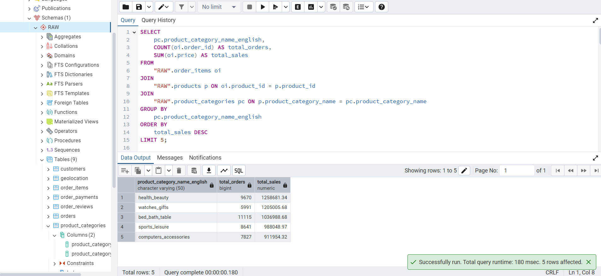{#fig-q1 fig-align="center" width=100% .invert}

## Using `GROUP BY` and `HAVING`

This query finds customers who have made purchases above the average order value, i.e., valued customers.

```sql
SELECT
    c.customer_id,
    c.customer_city,
    c.customer_state,
    COUNT(o.order_id) AS order_count,
    AVG(op.payment_value) AS avg_order_value
FROM
    "RAW".customers c
JOIN
    "RAW".orders o ON c.customer_id = o.customer_id
JOIN
    "RAW".order_payments op ON o.order_id = op.order_id
GROUP BY
    c.customer_id, c.customer_city, c.customer_state
HAVING
    AVG(op.payment_value) > (
        SELECT AVG(payment_value)
        FROM "RAW".order_payments
    )
ORDER BY
    avg_order_value DESC;
```

The output of this query is shown in @fig-q2.

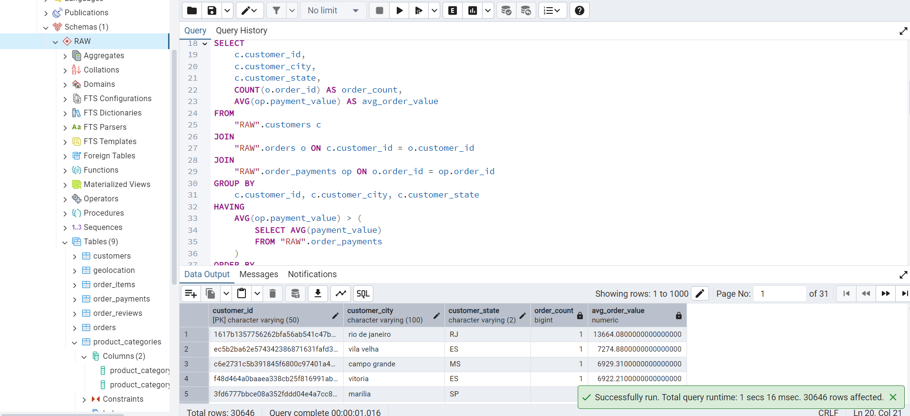{#fig-q2 fig-align="center" width=100% .invert}

## Using `CASE` and `AVG`

This query analyzes order delivery performance by calculating the percentage of orders delivered on time and the average delivery time.

```sql
SELECT
    EXTRACT(YEAR FROM o.order_purchase_timestamp) AS year,
    EXTRACT(MONTH FROM o.order_purchase_timestamp) AS month,
    COUNT(o.order_id) AS total_orders,
    AVG(
        CASE
            WHEN o.order_delivered_customer_date <= o.order_estimated_delivery_date THEN 1
            ELSE 0
        END
    ) * 100 AS on_time_delivery_percentage,
    AVG(
        EXTRACT(DAY FROM (o.order_delivered_customer_date - o.order_purchase_timestamp))
    ) AS avg_delivery_days
FROM
    "RAW".orders o
WHERE
    o.order_status = 'delivered'
GROUP BY
    year, month
ORDER BY
    year, month;
```

The output of this query is shown in @fig-q3.

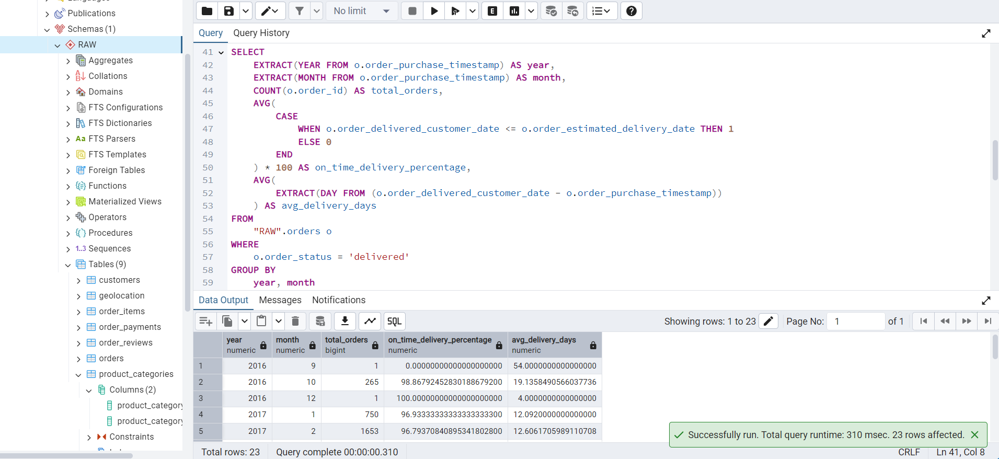{#fig-q3 fig-align="center" width=100% .invert}

## Using `WITH` and `PERCENT_RANK`

This query categorizes sellers based on their total sales volume and calculates the average sales percentile for each category.

```sql
WITH seller_sales AS (
    SELECT 
        s.seller_id,
        s.seller_city,
        s.seller_state,
        SUM(oi.price) AS total_sales
    FROM 
        "RAW".sellers s
    JOIN 
        "RAW".order_items oi ON s.seller_id = oi.seller_id
    GROUP BY 
        s.seller_id, s.seller_city, s.seller_state
),
sales_categories AS (
    SELECT 
        seller_id,
        seller_city,
        seller_state,
        total_sales,
        CASE 
            WHEN total_sales >= 10000 THEN 'High Volume'
            WHEN total_sales >= 5000 THEN 'Medium Volume'
            ELSE 'Low Volume'
        END AS sales_category,
        PERCENT_RANK() OVER (ORDER BY total_sales) AS sales_percentile
    FROM 
        seller_sales
)
SELECT 
    sc.sales_category,
    COUNT(sc.seller_id) AS seller_count,
    AVG(sc.total_sales) AS avg_sales,
    MIN(sc.total_sales) AS min_sales,
    MAX(sc.total_sales) AS max_sales,
    AVG(sc.sales_percentile) AS avg_percentile
FROM 
    sales_categories sc
GROUP BY 
    sc.sales_category
ORDER BY 
    avg_sales DESC;
```

The output of this query is shown in @fig-q4.

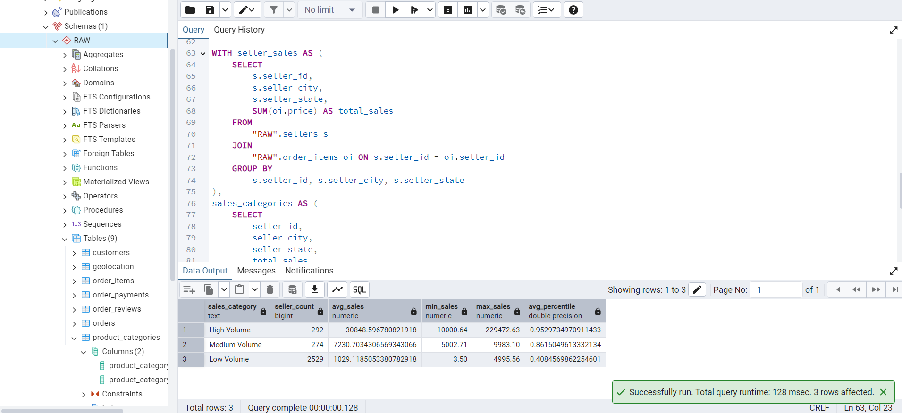{#fig-q4 fig-align="center" width=100% .invert}

# Global BCNF Verification

We analyzed all nine datasets. For each dataset, we identified the candidate keys and enumerated the functional dependencies using both the dataset documentation and the observed schema semantics.

Initially, we discovered that two relations, namely `geolocation` and `order_reviews`, did not satisfy the Boyce-Codd Normal Form (BCNF) because they lacked natural candidate keys due to the presence of duplicate records. To bring these relations into BCNF, we introduced surrogate primary keys: `geolocation_id` and `review_record_id`, respectively.

We verified that after the addition of these surrogate keys, *every non-trivial functional dependency has a left-hand side that is a superkey*. This satisfies the definition of Boyce-Codd Normal Form (BCNF), which states that a relation is in BCNF if, for every non-trivial functional dependency $X \to Y$, $X$ is a superkey.

After a thorough review of each relation, we found that:

- All attributes in every relation are fully functionally dependent on candidate keys.
- No partial dependencies or transitive dependencies exist.
- All relations satisfy the BCNF condition after introducing surrogate keys where necessary.

## Conclusion

*All nine relations are in BCNF after introducing surrogate primary keys for `geolocation` and `order_reviews`. No decomposition was required*. We now proceed to formally list the functional dependencies, candidate keys, and justifications for each dataset in the following subsections.

Since this milestone specifically requires ensuring that the functional dependencies are satisfied at the schema level, we will issue appropriate `ALTER TABLE` commands in our SQL scripts. These commands will:

- Add `NOT NULL` constraints on attributes that are functionally dependent on the candidate keys.
- Introduce surrogate primary keys (`geolocation_id` and `review_record_id`) for the `geolocation` and `order_reviews` tables, respectively.
- Drop any earlier primary keys if necessary and redefine the correct primary key structure.

This ensures that the relational schemas accurately preserve the specified functional dependencies, thereby fully satisfying the BCNF requirements.

## `customers`

### Functional Dependencies

$$
\begin{multline*}
    \texttt{customer\_id} \to \texttt{customer\_unique\_id}, \texttt{customer\_zip\_code\_prefix}, \texttt{customer\_city},\\ \texttt{customer\_state}
\end{multline*}
$$

### Candidate Keys

The candidate key is: `customer_id`.

### Justification

Each `customer_id` is a unique platform-generated identifier corresponding to a customer session or order history. It uniquely determines the customer's identity and location. Although `customer_unique_id` identifies a real-world individual, it is not unique in the data and therefore not a candidate key. Since all attributes are fully functionally dependent on the superkey `customer_id`, this relation is in BCNF.

## `geolocation`

### Functional Dependencies

$$
\begin{multline*}
    \texttt{geolocation\_id} \to \texttt{geolocation\_zip\_code\_prefix}, \texttt{geolocation\_lat}, \texttt{geolocation\_lng}, \\\texttt{geolocation\_city}, \texttt{geolocation\_state}
\end{multline*}
$$

### Candidate Keys

The candidate key is: `geolocation_id`.

### Justification

Although the combination of `geolocation_zip_code_prefix`, `geolocation_lat`, and `geolocation_lng` was initially assumed to be a candidate key, duplicate entries exist in the dataset. Therefore, a surrogate key `geolocation_id` was introduced to uniquely identify each row. All other attributes are now fully functionally dependent on the primary key `geolocation_id`, and there are no partial or transitive dependencies. Hence, the relation is now in BCNF.

## `order_items`

### Functional Dependencies

$$
\begin{multline*}
    (\texttt{order\_id}, \texttt{order\_item\_id}) \to \texttt{product\_id}, \texttt{seller\_id}, \texttt{shipping\_limit\_date}, \texttt{price}, \\\texttt{freight\_value}
\end{multline*}
$$

### Candidate Keys

The candidate key is: (`order_id`, `order_item_id`).

### Justification

Each row in this table represents a specific item within an order. While an order may contain multiple items, the combination of `order_id` and `order_item_id` uniquely identifies each item in the order. All other attributes depend entirely on this composite key. There are no partial or transitive dependencies. Hence, this relation is in BCNF.

## `order_payments`

### Functional Dependencies

$$
\begin{multline*}
    (\texttt{order\_id}, \texttt{payment\_sequential}) \to \texttt{payment\_type}, \texttt{payment\_installments}, \\\texttt{payment\_value}
\end{multline*}
$$

### Candidate Keys

The candidate key is: (`order_id`, `payment_sequential`).

### Justification

Each order may involve multiple payment entries, indexed by `payment_sequential`. The combination of `order_id` and `payment_sequential` uniquely identifies each such payment record. All remaining attributes are functionally dependent on this composite key. There are no partial or transitive dependencies. Thus, this relation is in BCNF.

## `order_reviews`

### Functional Dependencies

$$
\begin{multline*}
    \texttt{review\_record\_id} \to \texttt{review\_id}, \texttt{order\_id}, \texttt{review\_score}, \texttt{review\_comment\_title}, \\\texttt{review\_comment\_message}, \texttt{review\_creation\_date}, \\\texttt{review\_answer\_timestamp}
\end{multline*}
$$

### Candidate Keys

The candidate key is: `review_record_id`.

### Justification

The attribute `review_id` was initially assumed to uniquely identify each review, but duplicate values were found in the dataset. To bring the relation into BCNF, a surrogate key `review_record_id` was introduced. Now, each row is uniquely identified by `review_record_id`, and all other attributes are fully functionally dependent on it. There are no partial or transitive dependencies, so the relation is now in BCNF.

## `orders`

### Functional Dependencies

$$
\begin{multline*}
    \texttt{order\_id} \to \texttt{customer\_id}, \texttt{order\_status}, \texttt{order\_purchase\_timestamp}, \\\texttt{order\_approved\_at}, \texttt{order\_delivered\_carrier\_date}, \\\texttt{order\_delivered\_customer\_date}, \texttt{order\_estimated\_delivery\_date}
\end{multline*}
$$

### Candidate Keys

The candidate key is: `order_id`.

### Justification

Each row in this table corresponds to a unique order placed by a customer. The `order_id` uniquely identifies the order and determines all other attributes, including customer ID, order status, and timestamps. Since all non-prime attributes are fully functionally dependent on the superkey `order_id`, and there are no partial or transitive dependencies, this relation is in BCNF.

## `products`

### Functional Dependencies

$$
\begin{multline*}
    \texttt{product\_id} \to \texttt{product\_category\_name}, \texttt{product\_name\_length},
    \\\texttt{product\_description\_length}, \texttt{product\_photos\_qty}, \\\texttt{product\_weight\_g}, \texttt{product\_length\_cm}, \\\texttt{product\_height\_cm}, \texttt{product\_width\_cm}
\end{multline*}
$$

### Candidate Keys

The candidate key is: `product_id`.

### Justification

Each row in this table represents a unique product identified by `product_id`. All other attributes, including category, textual and visual description lengths, and physical dimensions, are fully functionally dependent on the product ID. There are no partial or transitive dependencies. Hence, the relation is in BCNF.

## `sellers`

### Functional Dependencies

$$
\texttt{seller\_id} \to \texttt{seller\_zip\_code\_prefix}, \texttt{seller\_city}, \texttt{seller\_state}
$$

### Candidate Keys

The candidate key is: `seller_id`.

### Justification

Each row in this table represents a unique seller identified by `seller_id`. The seller's location, including zip code prefix, city, and state, is fully functionally dependent on this identifier. All attributes are atomic, and no partial or transitive dependencies exist. Hence, the relation is in BCNF.

## `product_category_name_translation`

### Functional Dependencies

$$
\texttt{product\_category\_name} \to \texttt{product\_category\_name\_english}
$$

### Candidate Keys

The candidate key is: `product_category_name`.

### Justification

Each row in this table maps a Portuguese product category name to its English equivalent. Since each `product_category_name` has exactly one English translation, and this attribute fully determines the value of `product_category_name_english`, the relation satisfies the condition for BCNF.

# Finalizing the E/R Diagram

As we have added two surrogate keys in the tables `geolocation` and `order_reviews` to ensure BCNF applicability, the E/R diagram will reflect this change. @fig-ERD_cr shows the updated E/R diagram ([LucidChart URL](https://lucid.app/lucidchart/22f25238-bd93-4923-af3a-b8dba1448f0a/edit?beaconFlowId=C85C0E7417BDB0E4&invitationId=inv_1f21f0cf-64d9-4c3b-94f5-70112f266f5b&page=0_0#)).

{#fig-ERD_cr fig-align="center" width=100% .invert}

## Constraints

@tbl-relationship_constraints shows the relationship constraints in the database.

::: {.tbl tbl-colwidths="auto"}
| Relationship | Type | Explanation | Validation |
|:------------|:----:|:------------|:-----------|
| `customers` → `orders` | One-to-Many | A customer can place multiple orders. | `customer_id` appears in both `customers` and `orders`. |
| `orders` → `order_items` | One-to-Many | Each order can have multiple items. | `order_id` is present in both tables, e.g., `00010242fe8...`. |
| `products` → `order_items` | One-to-Many | A product can appear in many order items. | `product_id` like `4244733e06...` shows up in multiple items. |
| `sellers` → `order_items` | One-to-Many | A seller can fulfill many order items. | `seller_id` like `48436dade1...` maps to multiple rows. |
| `orders` → `order_payments` | One-to-Many | One order can have multiple payments. | Confirmed with different `payment_sequential` values for the same `order_id`. |
| `orders` → `order_reviews` | One-to-Many | One order can have multiple review updates. | The same `order_id` appears in multiple review rows. |
| `products` → `product_categories` | Many-to-One | Each product belongs to one category. | `product_category_name` maps to `product_category_name_english`. |
| `geolocation` (reference table) | Conceptual (by zip) | Relates by `zip_code_prefix` to both `customers` and `sellers`. | Zip codes like `01046` appear in both `geolocation` and `customers`. |

: Relationship constraints in the database. {#tbl-relationship_constraints style="width:100%; margin:auto;"}
:::

The E/R diagram is accurately aligned with the dataset structure. All entity relationships and keys (primary keys, foreign keys) reflect how the data is organized. We have also chosen to make `geolocation` a loosely connected reference table using zip prefixes rather than enforcing foreign key constraints.

## Validating Constraints Using Real Data

### `customers`

```yaml
customer_id: "06b8999e2fba1a1fbc88172c00ba8bc7"
customer_unique_id: "861eff4711a542e4b93843c6dd7febb0"
customer_zip_code_prefix: "14409"
customer_city: franca
customer_state: SP
```

We have proper normalization of this table. The attribute `customer_unique_id` exists separately. Also, this table is related to the `geolocation` table via `zip_code_prefix`.

### `orders`

```yaml
order_id: "e481f51cbdc54678b7cc49136f2d6af7"
customer_id: "9ef432eb6251297304e76186b10a928d"
order_status: delivered
```

This links `customers` via `customer_id`. Other fields like `order_status` and the timestamp related fields align with the project schema.

### `order_items`

```yaml
order_id: "00010242fe8c5a6d1ba2dd792cb16214"
product_id: "4244733e06e7ecb4970a6e2683c13e61"
seller_id: "48436dade18ac8b2bce089ec2a041202"
```

We have handled the composite primary key (`order_id`, `order_item_id`) correctly. We confirmed that multiple `order_items` can be present for one `order`.

## Database Design Theory for Redundancies

We will check for redundancies and violations of normal forms (1NF, 2NF, 3NF) to apply database design principles. @tbl-redundancy_nf_violation_check summarizes this.

::: {.tbl tbl-colwidths="auto"}
| Table | PK | Attributes | Normalization | Redundancy Risk | Suggestion |
|:------|:--:|:-----------|:-------------:|:---------------|:-----------|
| `customers` | `customer_id` | `customer_unique_id`, `zip_code_prefix`, `city`, `state` | 1NF, 2NF, 3NF (possible transitive) | Repetition of `city` / `state` for the same `zip_code_prefix`. | Separate `zip_lookup` (`zip_code_prefix`, `city`, `state`). |
| `orders` | `order_id` | `customer_id`, `order_status`, timestamps | 1NF, 2NF, 3NF | None | None |
| `order_items` | (`order_id`, `order_item_id`) | `product_id`, `seller_id`, `price`, `freight_value`, `shipping_limit_date` | 1NF, 2NF, 3NF | None | None |
| `products` | `product_id` | `product_category_name`, `name`, `description`, weight, dimensions | 1NF, 2NF, 3NF | Would cause redundancy if category names were not separated | Already separated into the `product_categories` table. |
| `sellers` | `seller_id` | `zip_code_prefix`, `city`, `state` | 1NF, 2NF, 3NF (same as `customers`) | Repetition of `city` / `state` for the same `zip_code_prefix`. | Use the shared `zip_lookup` table with customers. |
| `order_payments` | (`order_id`, `payment_sequential`) | `payment_type`, `installments`, `value` | 1NF, 2NF, 3NF | None | None |
| `order_reviews` | `review_record_id` | `review_id`, `order_id`, `score`, `title`, `message`, `creation_date`, `answer_timestamp` | 1NF, 2NF, 3NF | None | None |

: Check for redundancies and violations of normal forms. {#tbl-redundancy_nf_violation_check style="width:100%; margin:auto;"}
:::

As you can see, some redundancies are still present in our system. However, for performance optimization and ease of querying, we chose to retain the `zip_code_prefix`, along with city and state, directly within the `customers` and `sellers` tables instead of normalizing them into a separate lookup table.

# Problems Handling the Large Data and Using Indexing

Yes, we did run into problems while handling the larger dataset, like slow query performance, especially joins and filters.

## Problem

As tables like order_items` and orders` grow into millions of rows, queries using `JOIN`, `GROUP BY`, and `ORDER BY` will become noticeably slower, especially without indexes.

## Examples

- Finding top product categories,
- Aggregating seller sales,
- Filtering delayed deliveries.

## Slow SQL Queries

### Joining Tables

```sql
SELECT
    o.order_id,
    o.order_status,
    o.order_purchase_timestamp,
    c.customer_id,
    c.customer_city,
    c.customer_state,
    g.geolocation_lat,
    g.geolocation_lng,
    oi.order_item_id,
    p.product_id,
    p.product_category_name,
    pc.product_category_name_english,
    s.seller_id,
    s.seller_city,
    s.seller_state,
    op.payment_type,
    op.payment_value,
    r.review_score,
    r.review_comment_message
FROM "RAW".orders o
JOIN "RAW".customers c ON o.customer_id = c.customer_id
LEFT JOIN "RAW".geolocation g ON c.customer_zip_code_prefix = g.geolocation_zip_code_prefix
JOIN "RAW".order_items oi ON o.order_id = oi.order_id
JOIN "RAW".products p ON oi.product_id = p.product_id
LEFT JOIN "RAW".product_categories pc ON p.product_category_name = pc.product_category_name
JOIN "RAW".sellers s ON oi.seller_id = s.seller_id
JOIN "RAW".order_payments op ON o.order_id = op.order_id
LEFT JOIN "RAW".order_reviews r ON o.order_id = r.order_id;
```

The result of this query is shown in @fig-sq_1_new.

{#fig-sq_1_new fig-align="center" width=100% .invert}

As we can see, this query takes 50 seconds to execute completely, which is rather time consuming. To solve this problem, we used indexing.

In database systems, the B-Tree index is the default and most commonly utilized indexing method. It is particularly effective for supporting range queries, sorting, and filtering operations involving conditions such as `=`, `<`, `>`, `BETWEEN`, and `ORDER BY`.

In contrast, the Hash index is specifically designed to optimize exact match queries that use the equality (`=`) operator. Although Hash indexes can provide faster performance than B-Tree indexes for pure equality lookups, they have significant limitations as they do not support range queries or sorting operations. Therefore, the choice between B-Tree and Hash indexing must consider the specific access patterns and query requirements of the application.

@fig-sq_1_new_after_indx shows the output of this query after indexing.

{#fig-sq_1_new_after_indx fig-align="center" width=100% .invert}

There is a marginal improvement. The reason for not a very substantial improvement may be the built in performance optimization of PostgreSQL. It may also be because the data we are using is reasonably simple.

We have uploaded a `indexing.sql` file in which we have provided the commands that we used for indexing.

```sql
-- Fast JOIN on order_id in order_items
CREATE INDEX idx_hash_order_items_order_id
ON "RAW".order_items USING hash(order_id);

-- Fast JOIN on order_id in order_payments
CREATE INDEX idx_hash_order_payments_order_id
ON "RAW".order_payments USING hash(order_id);

-- Filter on order_status = 'delivered'
CREATE INDEX idx_hash_orders_status
ON "RAW".orders USING hash(order_status);

-- B-TREE Indexes: for sorting, grouping, and join keys

-- Join & group on seller_id in order_items
CREATE INDEX idx_btree_order_items_seller_id
ON "RAW".order_items(seller_id);

-- Group on seller_state
CREATE INDEX idx_btree_sellers_state
ON "RAW".sellers(seller_state);

-- Support subquery from order_reviews
CREATE INDEX idx_btree_order_reviews_order_id
ON "RAW".order_reviews(order_id);

-- Support join from orders to order_items
CREATE INDEX idx_btree_orders_order_id
ON "RAW".orders(order_id);

-- Index payment_value for aggregation
CREATE INDEX idx_btree_order_payments_value
ON "RAW".order_payments(payment_value);
```

# Testing the Database Using More Than Eight Queries

We have designed two `INSERT` queries, two `DELETE` queries, two `UPDATE` queries, and four `SELECT` queries.

## `INSERT` Queries

### Insert a New Customer

The query is the following.

```sql
INSERT INTO "RAW".customers (
    customer_id,
    customer_unique_id,
    customer_zip_code_prefix,
    customer_city,
    customer_state
) VALUES (
    'new_cust_001',
    'unique_cust_999',
    '12345',
    'new city',
    'SP'
);
```

@fig-eq1 shows the output of this query.

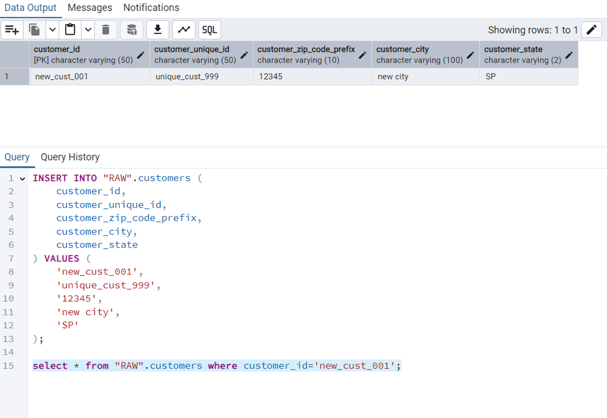{#fig-eq1 fig-align="center" width=90% .invert}

### Insert a New Product Category

The query is the following.

```sql
INSERT INTO "RAW".product_categories (
    product_category_name,
    product_category_name_english
) VALUES (
    'eletronicos_domesticos',
    'home_electronics'
);
```

@fig-eq2 shows the output of this query.

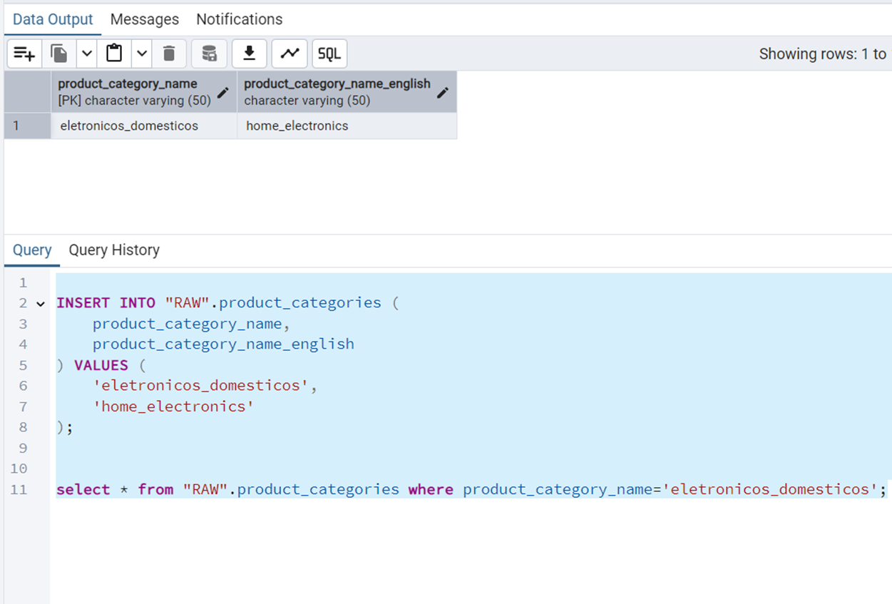{#fig-eq2 fig-align="center" width=90% .invert}

## `DELETE` Queries

### Delete a Specific Customer by their ID

The query is the following.

```sql
DELETE FROM "RAW".customers
WHERE customer_id = 'new_cust_001';
```

@fig-eq3 shows the output of this query

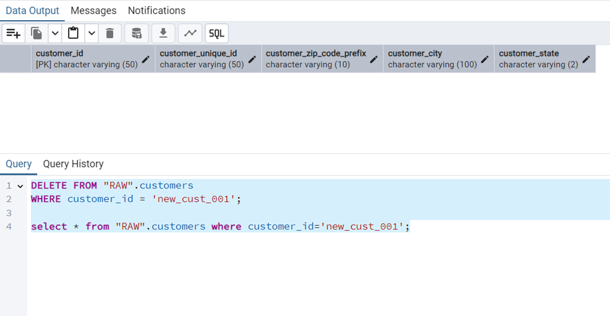{#fig-eq3 fig-align="center" width=90% .invert}

### Delete All Reviews with `NULL` Scores

Such queries can be used for data cleanup. The query is the following.

```sql
DELETE FROM "RAW".order_reviews
WHERE review_score IS NULL;
```

@fig-eq4 shows the output of this query

{#fig-eq4 fig-align="center" width=70% .invert}

## `UPDATE` Queries

### Update a Customer's City and State

The query is the following.

```sql
UPDATE "RAW".customers
SET customer_city = 'updated city',
    customer_state = 'RJ'
WHERE customer_id = 'new_cust_001';
```

@fig-eq5 shows the output of this query.

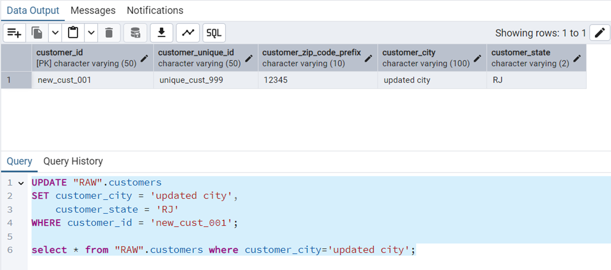{#fig-eq5 fig-align="center" width=90% .invert}

### Correcting a Product Category Name

The query is the following.

```sql
UPDATE "RAW".product_categories
SET product_category_name_english = 'home_electronics_and_appliances'
WHERE product_category_name = 'eletronicos_domesticos';
```

@fig-eq6 shows the output of this query.

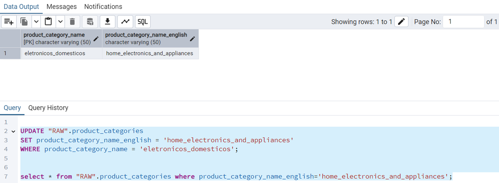{#fig-eq6 fig-align="center" width=100% .invert}

## `SELECT` Queries

### Top-5 Products by Revenue

We will use `JOIN` and `ORDER BY` in this query.

```sql
SELECT
    p.product_id,
    pc.product_category_name_english,
    SUM(oi.price) AS total_sales
FROM "RAW".order_items oi
JOIN "RAW".products p ON oi.product_id = p.product_id
JOIN "RAW".product_categories pc ON p.product_category_name = pc.product_category_name
GROUP BY p.product_id, pc.product_category_name_english
ORDER BY total_sales DESC
LIMIT 5;
```

@fig-eq7 shows the output of this query.

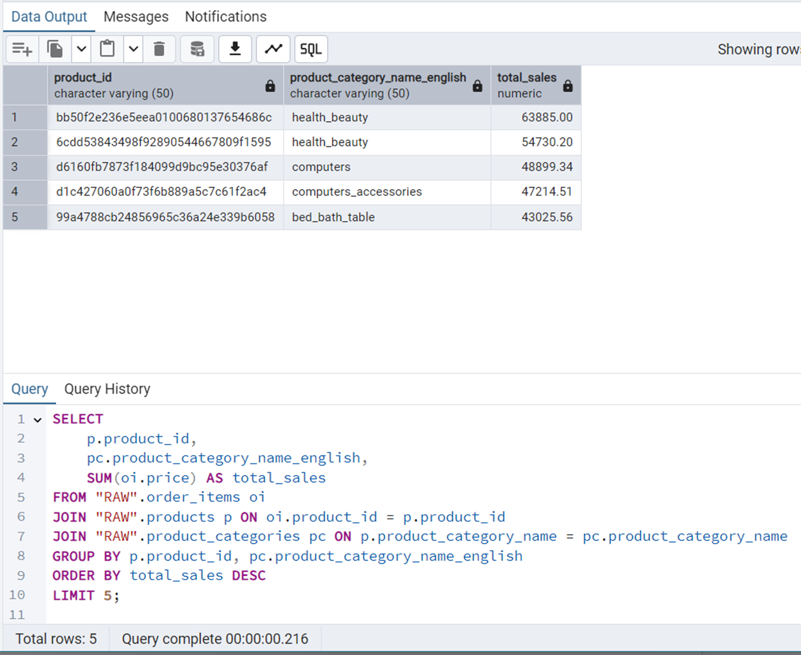{#fig-eq7 fig-align="center" width=70% .invert}

### Average Review Score Per Seller

We will use `GROUP BY` in this query.

```sql
SELECT
    s.seller_id,
    s.seller_city,
    AVG(r.review_score) AS avg_review_score
FROM "RAW".sellers s
JOIN "RAW".order_items oi ON s.seller_id = oi.seller_id
JOIN "RAW".orders o ON oi.order_id = o.order_id
JOIN "RAW".order_reviews r ON o.order_id = r.order_id
GROUP BY s.seller_id, s.seller_city
ORDER BY avg_review_score DESC;
```

@fig-eq8 shows the output of this query.

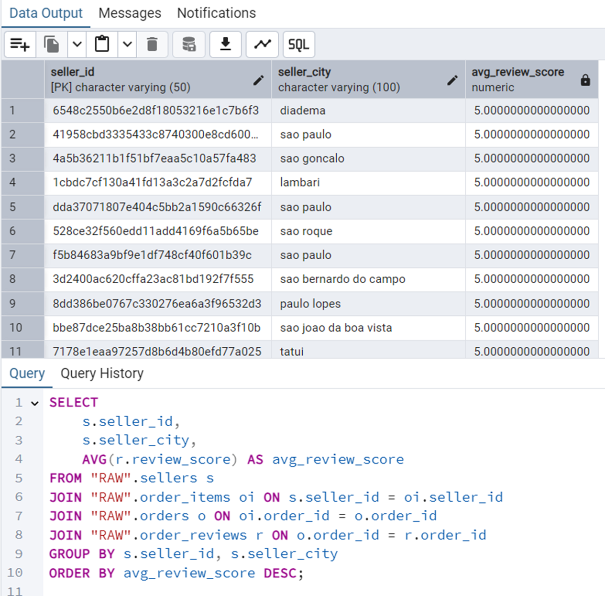{#fig-eq8 fig-align="center" width=60% .invert}

### Customers Who Spent More Than Average

We will use subquery here.

```sql
SELECT
    c.customer_id,
    AVG(op.payment_value) AS avg_spending
FROM "RAW".customers c
JOIN "RAW".orders o ON c.customer_id = o.customer_id
JOIN "RAW".order_payments op ON o.order_id = op.order_id
GROUP BY c.customer_id
HAVING AVG(op.payment_value) > (
    SELECT AVG(payment_value) FROM "RAW".order_payments
);
```

@fig-eq9 shows the output of this query.

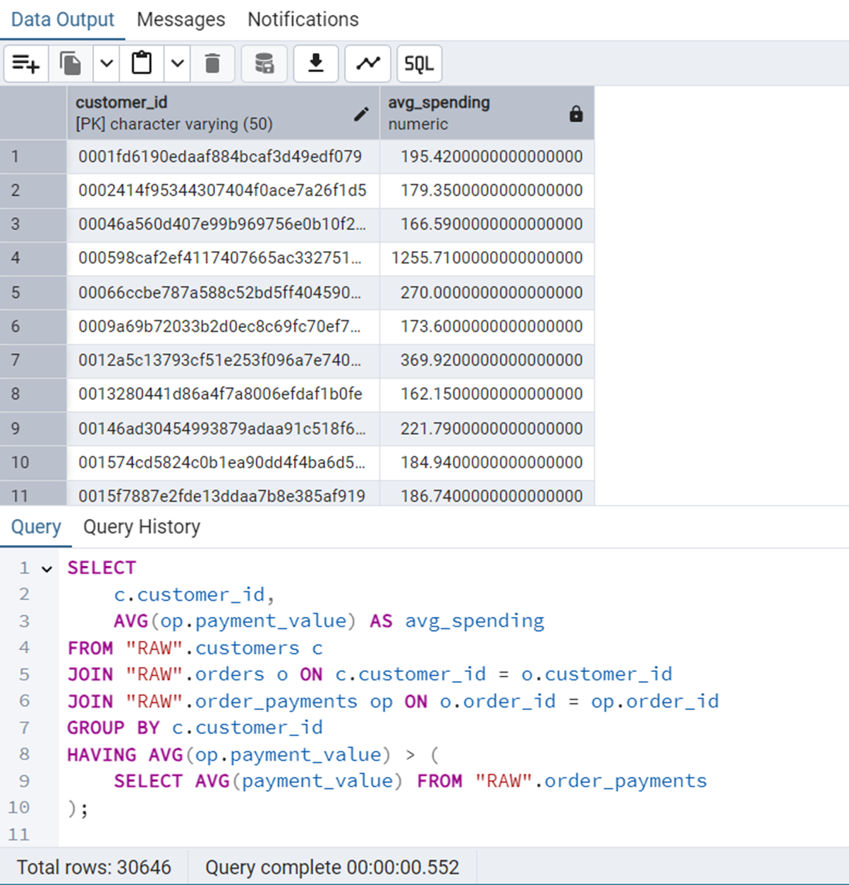{#fig-eq9 fig-align="center" width=60% .invert}

### Delivered Orders with Low Ratings

We will use nested `JOIN` along with `FILTER` in this query.

```sql
SELECT
    o.order_id,
    r.review_score,
    o.order_status,
    r.review_comment_message
FROM "RAW".orders o
JOIN "RAW".order_reviews r ON o.order_id = r.order_id
WHERE r.review_score <= 2 AND o.order_status = 'delivered'
ORDER BY r.review_score;
```

@fig-eq10 shows the output of this query.

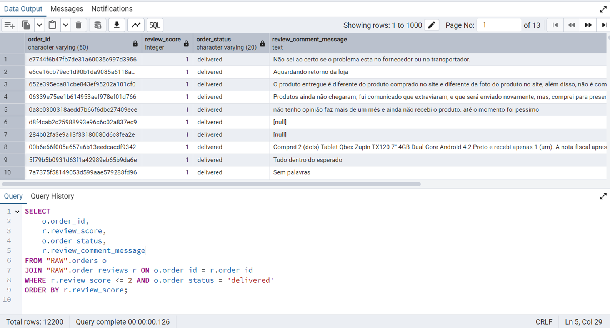{#fig-eq10 fig-align="center" width=100% .invert}

# Query Execution Analysis

Here, we will identify three problematic queries by showing their cost, and mention where the performance can be improved. However, note that our dataset is reasonably straightforward with more or less simple relations. Hence, not many complex queries take a lot of time to execute due to internal performance optimization in PostgreSQL. However, we will still mention some queries that are taking some time to finish.

## Identifying High-Value Sellers by State

This query can help in detecting underperformers.

```sql
SELECT
    s.seller_id,
    s.seller_state,
    COUNT(DISTINCT o.order_id) AS total_orders,
    SUM(oi.price + oi.freight_value) AS total_revenue,
    AVG(op.payment_value) AS avg_payment,
    PERCENT_RANK() OVER (PARTITION BY s.seller_state ORDER BY SUM(oi.price + oi.freight_value)) AS state_sales_percentile,
    (
        SELECT AVG(LENGTH(r.review_comment_message))
        FROM "RAW".order_reviews r
        WHERE r.order_id = o.order_id
    ) AS avg_review_length
FROM "RAW".sellers s
JOIN "RAW".order_items oi ON s.seller_id = oi.seller_id
JOIN "RAW".orders o ON o.order_id = oi.order_id
JOIN "RAW".order_payments op ON op.order_id = o.order_id
WHERE o.order_status = 'delivered'
GROUP BY s.seller_id, s.seller_state, o.order_id
ORDER BY total_revenue DESC;
```

@fig-pq1 shows the output of this query.

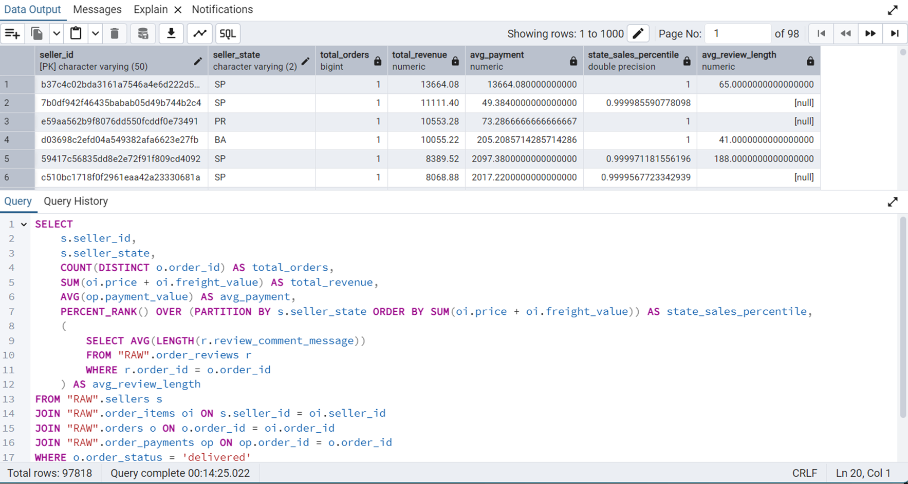{#fig-pq1 fig-align="center" width=100% .invert}

We can see that this query takes about 14.5 minutes to execute. The graphical and statistical output of the explain tool is shown in @fig-explain_plan_pq1 and @fig-pq1_e1 respectively.

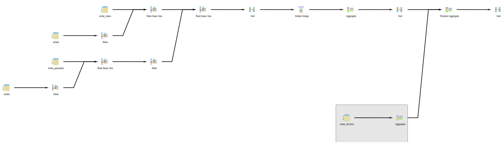{#fig-explain_plan_pq1 fig-align="center" width=100% .invert}

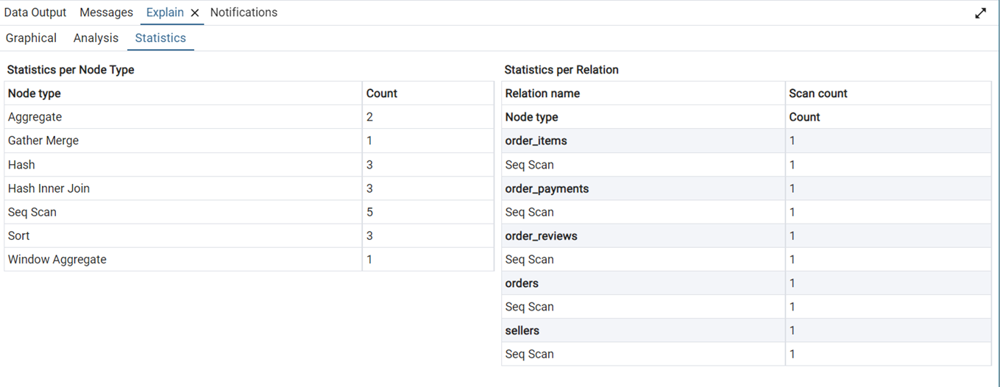{#fig-pq1_e1 fig-align="center" width=100% .invert}

The query uses `SUM()`, `AVG()`, or `COUNT()` on grouped data. PostgreSQL is using parallel workers and merging their results. Hash tables were built to support joins or groupings, efficient on medium to large datasets. PostgreSQL did full table scans on 5 tables. It had to sort rows---often happens with `ORDER BY`. We used a window function, like `PERCENT_RANK()` or `ROW_NUMBER()`.

## Overall Customer Satisfaction Per Seller

```sql
SELECT 
    s.seller_id,
    s.seller_city,
    (SELECT AVG(r.review_score) 
    FROM "RAW".order_items oi 
    JOIN "RAW".orders o ON oi.order_id = o.order_id
    JOIN "RAW".order_reviews r ON o.order_id = r.order_id
    WHERE oi.seller_id = s.seller_id
    ) AS avg_review_score
FROM "RAW".sellers s;
```

@fig-pq2 shows the output of this query.

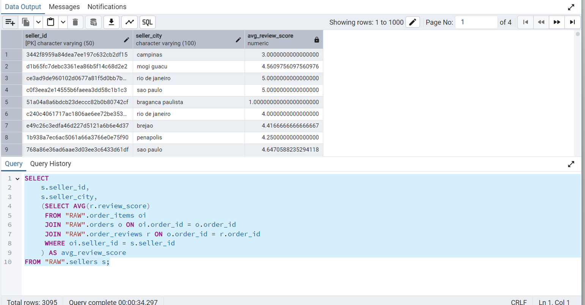{#fig-pq2 fig-align="center" width=100% .invert}

We can see that this query takes about 34 seconds to execute. The graphical and statistical output of the explain tool is shown in @fig-explain_plan_pq2 and @fig-pq2_e1 respectively.

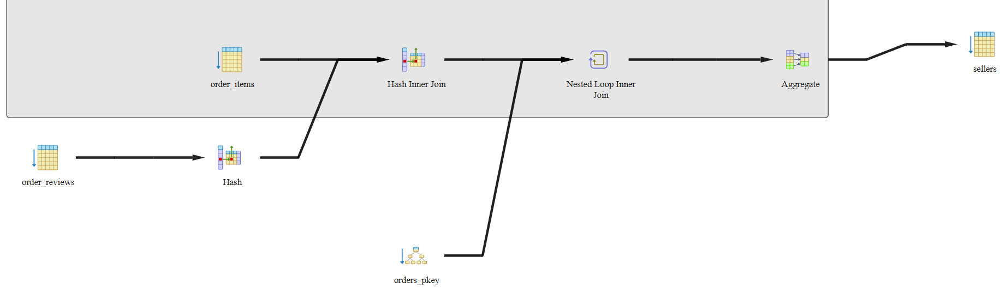{#fig-explain_plan_pq2 fig-align="center" width=100% .invert}

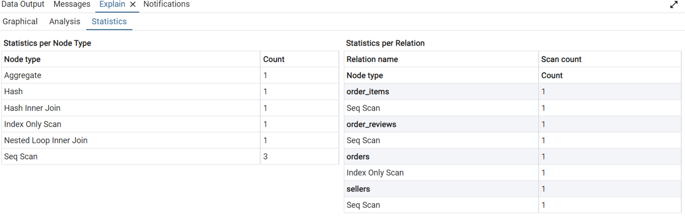{#fig-pq2_e1 fig-align="center" width=100% .invert}

## Each Customer's Average Payment Per Order

```sql
SELECT 
    c.customer_id,
    c.customer_city,
    (SELECT AVG(op.payment_value)
    FROM "RAW".orders o
    JOIN "RAW".order_payments op ON o.order_id = op.order_id
    WHERE o.customer_id = c.customer_id
    ) AS avg_order_payment
FROM "RAW".customers c;
```

@fig-pq3 shows the output of this query.

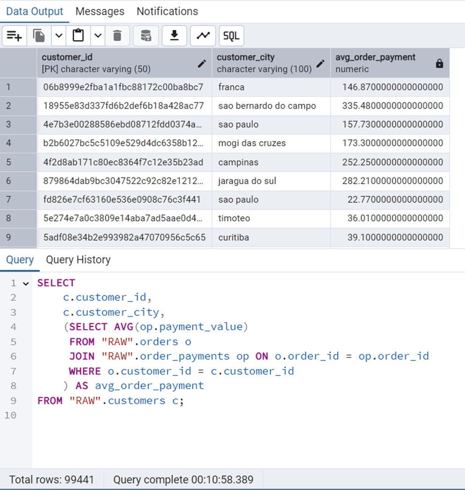{#fig-pq3 fig-align="center" width=60% .invert}

We can see that this query takes about 11 minutes to execute. The graphical and statistical output of the explain tool is shown in @fig-explain_plan_pq3 and @fig-pq3_e1 respectively.

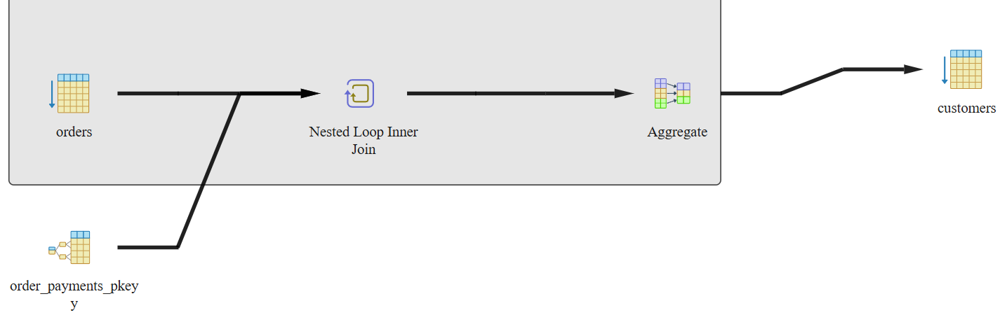{#fig-explain_plan_pq3 fig-align="center" width=100% .invert}

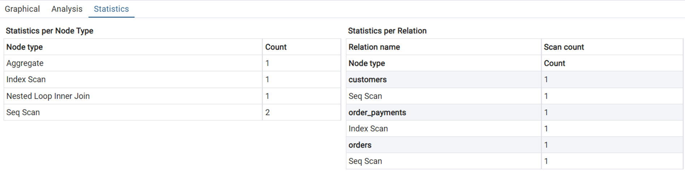{#fig-pq3_e1 fig-align="center" width=100% .invert}

The entire `customers` table was scanned row by row. Same for the `orders` table---no filtering/indexing, so full scan happens. The `order_payments` table uses an index for fast lookup on a filtered/joined column. We plan to resolve these queries using indexing. We are using B-tree and Hashing for this use case.

# Database Migration and Application Deployment

Initially, the Olist E-Commerce dataset was loaded and processed in a PostgreSQL database environment. Appropriate schema definitions, data insertions, and index creations were performed using PostgreSQL-specific SQL commands. This setup enabled efficient querying and local experimentation.

For the purpose of building a publicly accessible application, the database was migrated to SQLite. SQLite was chosen due to its lightweight, serverless architecture, making it ideal for simple web deployment without the overhead of managing a PostgreSQL server.

A Python script, `create_db.py`, was used to recreate the database schema and populate the tables directly from the provided CSV files.

```python
import os
import sqlite3
import pandas as pd

CSV_FOLDER_PATH = r"data"
DB_FILE = "olist.db"

# Connect to SQLite
conn = sqlite3.connect(DB_FILE)
cursor = conn.cursor()

# Enable foreign keys (optional)
cursor.execute("PRAGMA foreign_keys = ON;")

# -----------------------------
# Table creation DDLs for SQLite that incorporate the FDs
# -----------------------------
ddl = {
    "customers": """
        CREATE TABLE IF NOT EXISTS customers (
            customer_id TEXT PRIMARY KEY,
            customer_unique_id TEXT NOT NULL,
            customer_zip_code_prefix TEXT NOT NULL,
            customer_city TEXT NOT NULL,
            customer_state TEXT NOT NULL
        );
    """,
    "geolocation": """
        CREATE TABLE IF NOT EXISTS geolocation (
            geolocation_id INTEGER PRIMARY KEY AUTOINCREMENT,
            geolocation_zip_code_prefix TEXT NOT NULL,
            geolocation_lat REAL NOT NULL,
            geolocation_lng REAL NOT NULL,
            geolocation_city TEXT NOT NULL,
            geolocation_state TEXT NOT NULL
        );
    """,
    "orders": """
        CREATE TABLE IF NOT EXISTS orders (
            order_id TEXT PRIMARY KEY,
            customer_id TEXT NOT NULL,
            order_status TEXT NOT NULL,
            order_purchase_timestamp TEXT NOT NULL,
            order_approved_at TEXT,
            order_delivered_carrier_date TEXT,
            order_delivered_customer_date TEXT,
            order_estimated_delivery_date TEXT NOT NULL,
            FOREIGN KEY (customer_id) REFERENCES customers(customer_id)
        );
    """,
    "order_items": """
        CREATE TABLE IF NOT EXISTS order_items (
            order_id TEXT NOT NULL,
            order_item_id INTEGER NOT NULL,
            product_id TEXT NOT NULL,
            seller_id TEXT NOT NULL,
            shipping_limit_date TEXT NOT NULL,
            price REAL NOT NULL,
            freight_value REAL NOT NULL,
            PRIMARY KEY (order_id, order_item_id),
            FOREIGN KEY (order_id) REFERENCES orders(order_id),
            FOREIGN KEY (product_id) REFERENCES products(product_id),
            FOREIGN KEY (seller_id) REFERENCES sellers(seller_id)
        );
    """,
    "order_payments": """
        CREATE TABLE IF NOT EXISTS order_payments (
            order_id TEXT NOT NULL,
            payment_sequential INTEGER NOT NULL,
            payment_type TEXT NOT NULL,
            payment_installments INTEGER NOT NULL,
            payment_value REAL NOT NULL,
            PRIMARY KEY (order_id, payment_sequential),
            FOREIGN KEY (order_id) REFERENCES orders(order_id)
        );
    """,
    "order_reviews": """
        CREATE TABLE IF NOT EXISTS order_reviews (
            review_record_id INTEGER PRIMARY KEY AUTOINCREMENT,
            review_id TEXT,
            order_id TEXT NOT NULL,
            review_score INTEGER NOT NULL,
            review_comment_title TEXT,
            review_comment_message TEXT,
            review_creation_date TEXT NOT NULL,
            review_answer_timestamp TEXT NOT NULL,
            FOREIGN KEY (order_id) REFERENCES orders(order_id)
        );
    """,
    "products": """
        CREATE TABLE IF NOT EXISTS products (
            product_id TEXT PRIMARY KEY,
            product_category_name TEXT,
            product_name_lenght INTEGER,
            product_description_lenght INTEGER,
            product_photos_qty INTEGER,
            product_weight_g INTEGER,
            product_length_cm INTEGER,
            product_height_cm INTEGER,
            product_width_cm INTEGER
        );
    """,
    "sellers": """
        CREATE TABLE IF NOT EXISTS sellers (
            seller_id TEXT PRIMARY KEY,
            seller_zip_code_prefix TEXT NOT NULL,
            seller_city TEXT NOT NULL,
            seller_state TEXT NOT NULL
        );
    """,
    "product_categories": """
        CREATE TABLE IF NOT EXISTS product_categories (
            product_category_name TEXT PRIMARY KEY,
            product_category_name_english TEXT NOT NULL
        );
    """
}

# -----------------------------
# Create all tables
# -----------------------------
for table, statement in ddl.items():
    print(f"Creating table: {table}")
    cursor.execute(statement)
conn.commit()

# -----------------------------
# CSV to table mapping
# -----------------------------
csv_to_table = {
    "olist_customers_dataset.csv": "customers",
    "olist_products_dataset.csv": "products",
    "olist_sellers_dataset.csv": "sellers",
    "olist_orders_dataset.csv": "orders",
    "olist_order_items_dataset.csv": "order_items",
    "olist_order_payments_dataset.csv": "order_payments",
    "olist_order_reviews_dataset.csv": "order_reviews",
    "olist_geolocation_dataset.csv": "geolocation",
    "product_category_name_translation.csv": "product_categories"
}

# -----------------------------
# Simple direct loading of CSVs into tables
# -----------------------------
for csv_file, table_name in csv_to_table.items():
    path = os.path.join(CSV_FOLDER, csv_file)
    print(f"Inserting data into '{table_name}' from '{csv_file}'...")
    df = pd.read_csv(path)
    df.to_sql(table_name, conn, if_exists='append', index=False)

conn.close()
```

The indexing strategy originally implemented in PostgreSQL was appropriately adapted for SQLite using a second script, `index_db.py`.

```python
import os
import sqlite3
import pandas as pd

# Connect to your existing SQLite database
conn = sqlite3.connect("olist.db")
cursor = conn.cursor()

# Enable foreign keys
cursor.execute("PRAGMA foreign_keys = ON;")

# Index creation commands (translated from PostgreSQL to SQLite)
indexes = [
    # order_items.order_id
    """
    CREATE INDEX IF NOT EXISTS idx_order_items_order_id
    ON order_items(order_id);
    """,

    # order_payments.order_id
    """
    CREATE INDEX IF NOT EXISTS idx_order_payments_order_id
    ON order_payments(order_id);
    """,

    # orders.order_status
    """
    CREATE INDEX IF NOT EXISTS idx_orders_order_status
    ON orders(order_status);
    """,

    # order_items.seller_id
    """
    CREATE INDEX IF NOT EXISTS idx_order_items_seller_id
    ON order_items(seller_id);
    """,

    # sellers.seller_state
    """
    CREATE INDEX IF NOT EXISTS idx_sellers_seller_state
    ON sellers(seller_state);
    """,

    # order_reviews.order_id
    """
    CREATE INDEX IF NOT EXISTS idx_order_reviews_order_id
    ON order_reviews(order_id);
    """,

    # orders.order_id (already a primary key — no need, but harmless)
    """
    CREATE INDEX IF NOT EXISTS idx_orders_order_id
    ON orders(order_id);
    """,

    # order_payments.payment_value
    """
    CREATE INDEX IF NOT EXISTS idx_order_payments_payment_value
    ON order_payments(payment_value);
    """
]

# Execute all the index creation statements
for idx_stmt in indexes:
    cursor.execute(idx_stmt)

# Commit and close
conn.commit()
conn.close()
```

Specifically, while PostgreSQL allowed different indexing methods such as `hash` and `btree`, SQLite internally supports only `B-tree` indexing, which was uniformly applied.

Following database creation and indexing, a Streamlit application was developed to allow users to execute custom SQL queries on the database through an interactive web interface. The final application was deployed and made publicly accessible.
