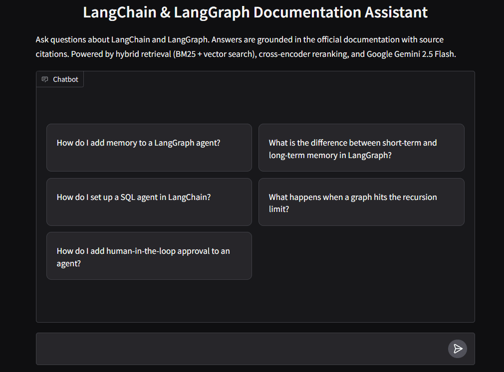

::: {.callout-tip}
# Source Code
- The complete RAG pipeline source code is available on [this GitHub repository](https://github.com/SushrutGaikwad/lang-chain-graph-rag).
- The golden dataset generator (Phase 0) is available on [this GitHub repository](https://github.com/SushrutGaikwad/golden-dataset-generator-for-lang-chain-graph-rag).
:::

# Introduction

## Project Overview

This project, `lang-chain-graph-rag`, is a production-level Retrieval-Augmented Generation (RAG) pipeline built on top of LangChain and LangGraph documentation. The goal is not just to answer questions about these frameworks, but to build a system that demonstrates the engineering rigor expected in production AI systems: structured evaluation, citation enforcement, hybrid retrieval, reranking, and CI-gated quality thresholds.

The source corpus consists of 102 markdown documentation files covering LangChain, LangGraph, and shared conceptual guides. The system ingests these documents, chunks them, embeds them into a vector store, retrieves relevant context for a given query, generates an answer grounded in that context, and evaluates the quality of the answer against a pre-built golden dataset.

## Problem Statement

Most RAG tutorials stop at "embed documents, retrieve top-k, generate answer." This leaves several critical gaps:

1. **No structured evaluation.** Without a golden dataset and automated scoring, there is no way to know if changes to chunking, retrieval, or prompting improve or degrade quality.
2. **No citation enforcement.** The system should either ground its answer in retrieved evidence or explicitly decline to answer, not hallucinate.
3. **No hybrid retrieval.** Pure vector search misses lexical matches (exact terms, error codes, function names). Production systems combine vector and keyword search.
4. **No reranking.** Top-k retrieval by cosine similarity alone is a weak signal. Cross-encoder reranking dramatically improves precision.
5. **No self-evaluation bias controls.** If the same model generates answers and evaluates them, the evaluation is not independent.

This project addresses all five gaps across four phases.

## Project Phases

The project is divided into four phases, each building on the previous:

::: {.tbl tbl-colwidths="auto"}
| Phase | Focus | Key Deliverable |
|:-----:|:------|:----------------|
| Phase 0 | Golden Dataset Generation | 102 QA pairs from original docs, generated by GPT-5.4 |
| Phase 1 | Fundamentals | Document ingestion, chunking, vector store, basic retrieval, answer generation with Gemini 2.5 Flash |
| Phase 2 | Production Quality | Hybrid retrieval (BM25 + vector), cross-encoder reranking, citation enforcement, versioned prompts |
| Phase 3 | Evaluation and CI | Ragas faithfulness scoring with Claude Opus 4.6, CI pipeline with quality thresholds |

: Project phases and their deliverables. {#tbl-phases style="width:100%; margin:auto;"}
:::

## Tech Stack

::: {.tbl tbl-colwidths="auto"}
| Component | Technology |
|:----------|:-----------|
| Orchestration | LangChain |
| Vector Store | ChromaDB |
| Reranking | sentence-transformers cross-encoder |
| Evaluation | Ragas |
| Logging | loguru |
| Testing | pytest |
| Package Management | uv |

: Technology choices for each component. {#tbl-tech-stack style="width:60%; margin:auto;"}
:::

## The Three-Model, Three-Vendor Strategy

A core design decision is the strict separation of models across three roles, each from a different vendor:

::: {.tbl tbl-colwidths="auto"}
| Role | Model | Vendor | Reasoning |
|:-----|:------|:------:|:----------|
| Golden dataset generation (Phase 0) | GPT-5.4 (`gpt-5.4-2026-03-05`, reasoning effort: high) | OpenAI | Frontier reasoning model at high depth for maximum QA quality |
| RAG answer generation (Phase 1, 2) | Gemini 2.5 Flash | Google | Fast, cost-effective model for high-volume retrieval-augmented generation |
| Evaluation and scoring (Phase 3) | Claude Opus 4.6 (`claude-opus-4-6`) | Anthropic | Independent high-capability evaluator |

: The three-model, three-vendor strategy for avoiding self-evaluation bias. {#tbl-model-strategy style="width:100%; margin:auto;"}
:::

The motivation is avoiding self-evaluation bias. If the same model generates both the expected answers and the RAG answers, or if the same model generates answers and then scores them, the evaluation loses independence. The model may systematically prefer its own phrasing patterns, reasoning style, or factual framings. By using three vendors, no model ever evaluates its own output or output generated from its own training signal.

Both the dataset generator (GPT-5.4) and the evaluator (Claude Opus 4.6) are set to their highest capability tiers. This is intentional: the quality ceiling of the evaluation is bounded by the weakest link in the generation-evaluation chain. Using high-reasoning models at both ends ensures the golden answers are sophisticated enough to test the RAG system thoroughly, and the evaluator is capable enough to detect subtle faithfulness failures.

```{mermaid}
%%| fig-align: center
graph TD
    subgraph "Phase 0: Data Generation"
        A[Original Docs] --> B["OpenAI GPT-5.4<br/>(reasoning: high)"]
        B --> C[Golden Dataset<br/>102 QA Pairs]
    end

    subgraph "Phase 1 & 2: RAG Pipeline"
        D[User Query] --> E["Google Gemini 2.5 Flash"]
        F[Retrieved Chunks] --> E
        E --> G[Generated Answer]
    end

    subgraph "Phase 3: Evaluation"
        C --> H["Anthropic Claude Opus 4.6"]
        G --> H
        H --> I[Faithfulness Scores<br/>& Metrics]
    end

    style B fill:#10a37f,color:#fff
    style E fill:#4285f4,color:#fff
    style H fill:#d97706,color:#fff
```

# Phase 0: Golden Dataset Generation

## Why a Separate Golden Dataset?

The evaluation dataset is generated as a completely standalone step, decoupled from the RAG pipeline itself. This is deliberate. The golden dataset represents the ground truth against which the RAG system will be judged in Phase 3. If the dataset were generated using the same chunking, embedding, or retrieval logic as the pipeline, the evaluation would be circular: the system would be tested against artifacts of its own processing. By generating QA pairs directly from the original, unchunked documentation files, we ensure the evaluation targets reflect what a knowledgeable human would ask and answer based on the full source material. The golden dataset generator lives in a [separate repository](https://github.com/SushrutGaikwad/golden-dataset-generator-for-lang-chain-graph-rag), reinforcing its independence from the RAG pipeline.

This also means the golden dataset is reusable. If the chunking strategy, embedding model, or retrieval logic changes in Phase 1 or Phase 2, the evaluation baseline remains stable.

## Why Source from Original Files, Not Chunks

The golden dataset is generated from full, unchunked documentation files. This matters because:

1. **Chunk boundaries are arbitrary.** A 600-token chunk might split a concept explanation mid-paragraph. QA pairs generated from chunks would inherit these boundary artifacts.
2. **Multi-document questions require full context.** A question like "How does LangGraph's state management compare to LangChain's memory approach?" requires understanding both topics in full, not from isolated chunks.
3. **The evaluation should test retrieval, not mirror it.** If QA pairs are generated from the same chunks the retriever returns, the evaluation tests whether the retriever can find what it already found, which is not useful.

## Question Type Taxonomy

Each QA pair is classified into one of six categories. Each category tests a different failure mode in a RAG system:

::: {.tbl tbl-colwidths="auto"}
| Type | Definition | What it tests in RAG |
|:-----|:-----------|:---------------------|
| `factual` | Direct fact lookup from a single passage | Basic retrieval accuracy: can the system find and return a specific fact? |
| `conceptual` | Requires understanding and explaining a concept | Whether the system can synthesize an explanation from retrieved content, not just extract a sentence |
| `procedural` | Asks how to do something step by step | Whether the system retrieves and orders multi-step instructions correctly |
| `comparative` | Requires comparing two or more things | Whether the retriever pulls relevant chunks for both sides of a comparison |
| `multi_hop` | Answer requires chaining information across sections or files | Whether the system can combine evidence from multiple retrieved chunks |
| `edge_case` | Targets boundary conditions, caveats, or limitations | Whether the system retrieves and surfaces nuanced or cautionary information |

: Question type taxonomy and what each type tests in a RAG system. {#tbl-question-types style="width:100%; margin:auto;"}
:::

A RAG system that scores well on `factual` but poorly on `multi_hop` has a different failure profile than one that fails on `edge_case`. This taxonomy enables targeted diagnosis.

## Target Distribution

Rather than generating questions uniformly at random, we set explicit target percentages for each type:

```python
QUESTION_TYPE_TARGETS: dict[str, float] = {
    "factual": 0.18,
    "conceptual": 0.18,
    "procedural": 0.18,
    "comparative": 0.15,
    "multi_hop": 0.16,
    "edge_case": 0.15,
}
```

The targets are roughly uniform with slight downweighting of `comparative`, `multi_hop`, and `edge_case` since these are harder to generate with high quality (they require cross-document grounding). The generation pipeline tracks cumulative counts and adjusts guidance to the model in subsequent batches to correct for any drift. For a target of $N$ total pairs with target percentage $p_t$ for type $t$, the deficit after generating $n_t$ pairs of type $t$ is:

$$
\delta_t = \max\left(0,\; \lfloor p_t \cdot N \rfloor - n_t\right).
$$

This deficit is communicated to the model in each batch prompt, nudging it toward underrepresented types.

## Generation Pipeline

```{mermaid}
%%| fig-align: center
flowchart TD
    A["Document Loader<br/><code>DocLoader.load_all()</code>"] --> B["102 .md/.mdx files<br/>from data/raw/docs/"]
    B --> C["Batch Creator<br/><code>QAGenerator._create_batches()</code><br/>batch_size=8"]
    C --> D["13 Document Batches"]
    D --> E["GPT-5.4 API Call<br/>reasoning: high<br/><code>QAGenerator._call_openai()</code>"]
    E --> F["JSON Response Parsing<br/><code>QAGenerator._parse_response()</code><br/>Pydantic validation"]
    F --> G["Type Distribution Tracking<br/><code>_compute_type_guidance()</code>"]
    G --> |"Loop until target reached"| E
    F --> H["Quality Filter<br/><code>QualityFilter.filter()</code>"]
    H --> I["90 QA Pairs"]
    I --> J["Targeted Top-up<br/><code>QAGenerator.generate_targeted()</code><br/>12 comparative pairs"]
    J --> K["Merge & Save<br/><code>QualityFilter.save()</code>"]
    K --> L["golden_dataset.json<br/>102 QA pairs"]

    style E fill:#10a37f,color:#fff
    style L fill:#f59e0b,color:#fff
```

## Document Loading

The `DocLoader` class recursively walks the `data/raw/docs/` directory, filtering for `.md` and `.mdx` files and skipping files under 200 characters. Each document is tagged with its library (derived from the top-level subdirectory: `langchain`, `langgraph`, or `concepts`) and its relative path, which serves as the canonical source identifier throughout the project.

```python
@dataclass
class Document:
    """A single loaded documentation file."""
    relative_path: str  # e.g. "langchain/guides/rag.mdx"
    content: str
    char_count: int
    library: str  # "langchain", "langgraph", or "concepts"
```

The loader found 102 documents across three libraries: 63 from LangChain, 36 from LangGraph, and 3 from a shared concepts directory.

## QA Generation with GPT-5.4

Documents are shuffled and split into batches of 8. Each batch is sent to GPT-5.4 with high reasoning effort via the OpenAI Responses API. The prompt instructs the model to generate QA pairs with exact supporting passages, proper source attribution, and a mix of question types. A key design choice is including documents from multiple libraries in each batch, which gives the model the raw material to create cross-document questions naturally.

```python
response = self.client.responses.create(
    model="gpt-5.4-2026-03-05",
    reasoning={"effort": "high"},
    input=[
        {"role": "system", "content": SYSTEM_PROMPT},
        {"role": "user", "content": user_prompt},
    ],
)
```

Each response is parsed as JSON and validated against a Pydantic schema:

```python
class QAPair(BaseModel):
    """Schema for a single QA pair."""
    question: str
    answer: str
    source_files: list[str]
    supporting_passages: list[str]
    question_type: str
```

## Quality Filtering

The `QualityFilter` class runs several checks on each generated pair:

- Minimum question length (20 chars) and answer length (50 chars)
- Maximum answer length (2000 chars) to avoid verbose, unfocused answers
- Presence of source files and non-trivial supporting passages (minimum 20 chars each)
- Questions must end with a question mark
- `comparative` and `multi_hop` questions must reference at least 2 source files

The initial generation run produced 100 pairs, of which 10 `comparative` questions were filtered out for referencing only a single source file. This is the quality gate working as designed: a comparative question grounded in a single document is not truly testing cross-document retrieval.

## Targeted Top-up

To restore the `comparative` category, a targeted top-up step generates additional pairs with explicit constraints: only `comparative` type, minimum 2 source files, and larger batch sizes (12 documents) to provide more cross-document material. This produced 12 additional pairs with a 100% pass rate, bringing the final dataset to 102 pairs.

## Output Schema

The final dataset is a JSON file with this structure:

```json
{
  "metadata": {
    "total_pairs": 102,
    "generator_model": "gpt-5.4-2026-03-05",
    "reasoning_effort": "high",
    "question_types": [
      "factual", "conceptual", "procedural",
      "comparative", "multi_hop", "edge_case"
    ],
    "topup_applied": true,
    "topup_count": 12
  },
  "qa_pairs": [
    {
      "question": "What partial-data issue can happen while streaming a generative UI spec?",
      "answer": "While the UI spec is streaming in, elements can arrive incompletely...",
      "source_files": ["langchain/frontend/generative-ui.mdx"],
      "supporting_passages": ["exact quote from the documentation..."],
      "question_type": "edge_case"
    }
  ]
}
```

## Final Dataset Statistics

::: {.tbl tbl-colwidths="auto"}
| Metric | Value |
|:-------|------:|
| Total QA pairs | 102 |
| Unique source files referenced | 85 / 102 (83%) |
| Multi-source pairs | 36 (35%) |
| Avg. question length | 127 chars |
| Avg. answer length | 438 chars |
| Avg. supporting passages per pair | 3.7 |
| Schema errors | 0 |
| Duplicate questions | 0 |

: Summary statistics for the golden evaluation dataset. {#tbl-dataset-stats style="width:50%; margin:auto;"}
:::

The distribution across question types is shown in @tbl-type-distribution.

::: {.tbl tbl-colwidths="auto"}
| Type | Count | Percentage | Target |
|:-----|------:|-----------:|-------:|
| factual | 18 | 17.6% | 18% |
| conceptual | 18 | 17.6% | 18% |
| procedural | 18 | 17.6% | 18% |
| comparative | 17 | 16.7% | 15% |
| multi_hop | 16 | 15.7% | 16% |
| edge_case | 15 | 14.7% | 15% |

: Final question type distribution compared to targets. {#tbl-type-distribution style="width:50%; margin:auto;"}
:::

This dataset is now treated as a fixed input to Phase 3, where it will be used to evaluate the RAG pipeline's faithfulness using Claude Opus 4.6 as an independent evaluator.

# Phase 1: RAG Fundamentals

Phase 1 builds the core RAG pipeline: document ingestion, chunking, vector storage, retrieval, and answer generation. The goal is a working end-to-end system where a user asks a question, relevant chunks are retrieved from ChromaDB, and Google Gemini 2.5 Flash generates a grounded answer.

## Project Structure

The project follows a modular layout with clear separation of concerns:

```{mermaid}
%%| fig-align: center
graph TD
    subgraph "src/ingestion/"
        A["loader.py<br/><code>DocLoader</code>"]
        B["chunker.py<br/><code>DocChunker</code>"]
    end
    subgraph "src/retrieval/"
        C["vector_store.py<br/><code>VectorStore</code>"]
        D["retriever.py<br/><code>Retriever</code>"]
    end
    subgraph "src/generation/"
        E["prompt_templates.py<br/><code>PromptLoader</code>"]
        F["generator.py<br/><code>AnswerGenerator</code>"]
    end
    subgraph "src/pipeline/"
        G["rag_chain.py<br/><code>RAGPipeline</code>"]
    end

    A --> B
    B --> C
    C --> D
    D --> G
    E --> F
    F --> G

    style G fill:#4285f4,color:#fff
```

## Document Loading

The `DocLoader` class reuses the same documentation corpus from Phase 0 (102 markdown files across `langchain/`, `langgraph/`, and `concepts/`). Unlike Phase 0's standalone loader, this version produces LangChain `Document` objects with metadata that flows through the entire pipeline.

```python
from langchain_core.documents import Document

documents.append(
    Document(
        page_content=content,
        metadata={
            "source": relative_path,    # e.g. "langchain/agents.mdx"
            "library": library,         # "langchain", "langgraph", or "concepts"
            "char_count": len(content),
        },
    )
)
```

Each document's `source` field uses forward slashes regardless of OS, ensuring consistent citation paths across environments.

## Chunking Strategy

The chunker uses LangChain's `RecursiveCharacterTextSplitter` with a carefully chosen separator hierarchy:

```python
self.splitter = RecursiveCharacterTextSplitter(
    chunk_size=2400,           # ~600 tokens at 4 chars/token
    chunk_overlap=400,         # ~100 tokens overlap
    separators=["\n## ", "\n### ", "\n#### ", "\n\n", "\n", ". ", " ", ""],
    keep_separator=True,
)
```

The separator hierarchy prioritizes splitting at markdown heading boundaries first, then paragraph breaks, then sentences. This preserves the semantic structure of the documentation. The `keep_separator=True` option retains the heading markers in chunks, which helps the LLM understand the context of each chunk.

### Chunk Size Rationale

The target chunk size is 600 tokens (approximately 2400 characters at a 4:1 character-to-token ratio). This sits in the 500 to 800 token range specified in the project requirements. The overlap of 100 tokens (400 characters) ensures that concepts split across chunk boundaries still appear in at least one chunk.

For a chunk size of $S$ characters with overlap $O$, the number of chunks $C$ for a document of length $L$ is approximately:

$$
C \approx \left\lceil \frac{L - O}{S - O} \right\rceil.
$$

For a 10,000-character document with $S = 2400$ and $O = 400$:

$$
C \approx \left\lceil \frac{10000 - 400}{2400 - 400} \right\rceil = \left\lceil \frac{9600}{2000} \right\rceil = 5 \text{ chunks}.
$$

### Chunk Metadata

Each chunk inherits the parent document's metadata and gains additional fields:

```python
chunk_doc = Document(
    page_content=chunk_text,
    metadata={
        **doc.metadata,               # source, library, char_count
        "chunk_index": i,             # position within the document
        "total_chunks": len(splits),  # total chunks from this document
        "chunk_char_count": len(chunk_text),
    },
)
```

This metadata enables citation tracking (which chunk from which file) and diagnostic analysis (are certain chunk positions consistently low-quality?).

### Chunking Results

The 102 documents produced 1425 chunks with the size distribution shown in @tbl-chunk-stats.

::: {.tbl tbl-colwidths="auto"}
| Metric | Value |
|:-------|------:|
| Total chunks | 1,425 |
| Min chunk size | 11 chars |
| Max chunk size | 2,399 chars |
| Avg chunk size | 1,703 chars |

: Chunk size statistics from the ingestion pipeline. {#tbl-chunk-stats style="width:35%; margin:auto;"}
:::

The minimum of 11 characters represents trailing content at the end of short documents. The average of 1,703 characters (roughly 425 tokens) is below the 2,400-character ceiling, which is expected because the splitter respects separator boundaries rather than filling chunks to capacity.

## Vector Store and Embeddings

### Embedding Model

The project uses OpenAI's `text-embedding-3-small` model with 1,536 dimensions. This is a deliberate choice of a different vendor (OpenAI) for embeddings than for answer generation (Google Gemini). While this was not a strict requirement (the three-vendor separation applies to generation and evaluation), it provides practical benefits: OpenAI's embedding models are the most widely benchmarked, and `text-embedding-3-small` offers a strong quality-to-cost ratio for documentation-scale corpora.

### ChromaDB Persistence

ChromaDB serves as the vector store with local persistence to `data/chroma_db/`. The `VectorStore` class wraps ChromaDB with batched insertion (100 documents per batch) to stay within API rate limits:

```python
class VectorStore:
    def __init__(self, persist_dir, collection_name):
        self.embeddings = OpenAIEmbeddings(
            model="text-embedding-3-small",
            dimensions=1536,
        )
        self.store = Chroma(
            collection_name=collection_name,
            embedding_function=self.embeddings,
            persist_directory=str(persist_dir),
        )

    def add_documents(self, documents, batch_size=100):
        for i in range(0, len(documents), batch_size):
            batch = documents[i : i + batch_size]
            self.store.add_documents(batch)
```

### Ingestion Pipeline

The ingestion script (`scripts/ingest.py`) orchestrates the full load, chunk, embed, store pipeline. It checks for an existing collection and resets it before re-ingesting to ensure idempotency. The full ingestion of 1,425 chunks completed in approximately 30 seconds.

```{mermaid}
%%| fig-align: center
flowchart LR
    A["DocLoader<br/>102 .md/.mdx files"] --> B["DocChunker<br/>1,425 chunks"]
    B --> C["OpenAI Embeddings<br/>text-embedding-3-small"]
    C --> D["ChromaDB<br/>data/chroma_db/"]

    style C fill:#10a37f,color:#fff
    style D fill:#f59e0b,color:#fff
```

## Retrieval

The `Retriever` class wraps the vector store's similarity search and formats retrieved chunks into a structured context string for the LLM:

```python
def format_context(self, documents: list[Document]) -> str:
    context_parts = []
    for i, doc in enumerate(documents, 1):
        source = doc.metadata.get("source", "unknown")
        chunk_idx = doc.metadata.get("chunk_index", "?")
        total = doc.metadata.get("total_chunks", "?")
        context_parts.append(
            f"[Source {i}: {source} (chunk {chunk_idx}/{total})]\n"
            f"{doc.page_content}\n"
        )
    return "\n---\n".join(context_parts)
```

Each chunk is labeled with its source file and chunk position, enabling the LLM to cite specific sources in its answer. With `TOP_K = 5`, each query retrieves the 5 most similar chunks, producing approximately 5,000 to 6,000 characters of context.

## Versioned Prompt Configuration

Prompts are stored as YAML files in `prompts/rag/`, not as hardcoded strings. This makes prompt changes a configuration change rather than a code change, and provides a git-diffable history of prompt evolution.

```yaml
# prompts/rag/v1.yaml
version: "v1"
description: "Basic RAG prompt with source citation for Phase 1"
template: |
  You are a helpful assistant answering questions about LangChain and LangGraph
  based strictly on the provided documentation context.

  RULES:
  1. Use ONLY the provided context to answer the question.
  2. If the context does not contain enough information to answer, respond with:
     "I don't have enough information in the provided context to answer this question."
  3. Cite which source(s) you used by referencing the document path in your answer.
  ...

  Context:
  {context}

  Question: {question}
```

The `PromptLoader` class loads the active version from config:

```python
# src/config.py
ACTIVE_PROMPT_VERSION: str = "v1"
ACTIVE_PROMPT_PATH: Path = PROMPTS_DIR / "rag" / f"{ACTIVE_PROMPT_VERSION}.yaml"
```

Switching to a new prompt version in Phase 2 requires only changing `ACTIVE_PROMPT_VERSION` to `"v2"` and creating the corresponding YAML file.

## Answer Generation

The `AnswerGenerator` uses Google Gemini 2.5 Flash with low temperature (0.2) for deterministic, grounded responses:

```python
self.llm = ChatGoogleGenerativeAI(
    model="gemini-2.5-flash",
    temperature=0.2,
    max_output_tokens=1024,
)
```

Gemini 2.5 Flash was chosen for answer generation because it is fast, cost-effective, and from a different vendor than both the dataset generator (OpenAI) and the evaluator (Anthropic), maintaining the three-vendor separation described in @tbl-model-strategy.

## End-to-End Pipeline

The `RAGPipeline` class ties everything together in a clean interface:

```{mermaid}
%%| fig-align: center
sequenceDiagram
    participant U as User
    participant P as RAGPipeline
    participant R as Retriever
    participant V as VectorStore
    participant G as AnswerGenerator
    participant LLM as Gemini 2.5 Flash

    U->>P: query("How do I add memory?")
    P->>R: retrieve(question)
    R->>V: similarity_search(question, k=5)
    V-->>R: 5 Document chunks
    R-->>P: documents
    P->>R: format_context(documents)
    R-->>P: context string
    P->>G: generate(context, question)
    G->>LLM: formatted prompt
    LLM-->>G: answer text
    G-->>P: answer
    P-->>U: RAGResult(answer, sources, context)
```

The `RAGResult` dataclass bundles the answer with its supporting evidence:

```python
@dataclass
class RAGResult:
    question: str
    answer: str
    source_documents: list[Document]
    context: str
    prompt_version: str

    @property
    def sources(self) -> list[str]:
        """Deduplicated list of source file paths."""
        ...
```

### Sample Results

Testing with three different question types demonstrates the pipeline working across retrieval patterns:

::: {.tbl tbl-colwidths="auto"}
| Question Type | Question | Sources Retrieved | Answer Length |
|:-------------|:---------|------------------:|-------------:|
| Comparative | "What is the difference between short-term and long-term memory in LangGraph?" | 3 unique sources | 1,579 chars |
| Procedural | "How do I set up a SQL agent in LangChain?" | 4 unique sources | 1,235 chars |
| Edge-case | "What happens when a graph hits the recursion limit?" | 3 unique sources | 687 chars |

: Sample query results from the Phase 1 RAG pipeline. {#tbl-phase1-results style="width:100%; margin:auto;"}
:::

All answers were grounded in the retrieved context and cited source documents. The pipeline correctly retrieves cross-library sources (e.g., both `langchain/` and `langgraph/` docs for the SQL agent question).

## Testing Strategy

Phase 1 includes 24 unit tests covering all modules. Tests for components that make API calls (vector store, generator) use mocked dependencies to run offline:

::: {.tbl tbl-colwidths="auto"}
| Module | Tests | Strategy |
|:-------|:-----:|:---------|
| `DocLoader` | 6 | Runs against real docs on disk |
| `DocChunker` | 7 | Uses synthetic test documents |
| `VectorStore` | 5 | Mocked OpenAI embeddings, temp ChromaDB directory |
| `PromptLoader` | 5 | Runs against real YAML config and temp files |
| `Retriever` | 4 | Mocked VectorStore |
| `RAGPipeline` | 3 | Mocked Retriever and AnswerGenerator |

: Phase 1 test coverage by module. {#tbl-phase1-tests style="width:70%; margin:auto;"}
:::

All 24 tests pass in under 2 seconds with no API calls required.

## Phase 1 Limitations

The Phase 1 pipeline has several known limitations that Phase 2 will address:

1. **Pure vector search:**
   - The retriever uses only cosine similarity over embeddings. This misses exact lexical matches (error codes, function names, specific configuration keys) that keyword search would catch.
2. **No reranking:**
   - The top-5 chunks from vector search are passed directly to the LLM. A cross-encoder reranker would improve precision by rescoring candidates.
3. **Soft citation enforcement:**
   - The prompt asks the model to cite sources and decline if context is insufficient, but this is not structurally enforced. The model can still generate unsupported claims.
4. **Fixed prompt:**
   - The v1 prompt is functional but not optimized. Phase 2 will introduce a v2 prompt with stricter citation requirements and explicit refusal behavior.

# Phase 2: Production Quality

Phase 2 addresses all four limitations from Phase 1 by adding hybrid retrieval (BM25 + vector search), cross-encoder reranking, citation enforcement with a decline-to-answer mechanism, and a versioned v2 prompt. The result is a production-grade retrieval pipeline where every answer is either grounded in evidence or explicitly refused.

## Hybrid Retrieval: BM25 + Vector Search

### Why Pure Vector Search Is Not Enough

Vector search via cosine similarity over embeddings excels at semantic matching: it finds chunks that are conceptually related to a query even when the exact words differ. However, it has a well-known blind spot for lexical matching. Queries containing specific error codes (`GRAPH_RECURSION_LIMIT`), function names (`StateGraph`), or configuration keys (`checkpointer`) may not rank the correct chunk highly if the embedding does not capture the exact token.

BM25 (Best Matching 25) is a classical term-frequency-based ranking function that excels at exactly this: finding documents that contain the query's specific terms. By combining both, the system covers both semantic and lexical retrieval.

### BM25 Implementation

The `BM25Retriever` builds an in-memory BM25 index over all 1,425 chunks using the `rank_bm25` library. Documents are tokenized with a simple lowercase regex tokenizer that preserves underscores (important for code identifiers like `GRAPH_RECURSION_LIMIT`):

```python
def _tokenize(text: str) -> list[str]:
    text = text.lower()
    tokens = re.findall(r"[a-z0-9_]+", text)
    return tokens
```

The BM25 scoring function for a query $Q$ containing terms $q_1, q_2, \ldots, q_n$ against a document $D$ is:

$$
\text{BM25}(D, Q) = \sum_{i=1}^{n} \text{IDF}(q_i) \cdot \frac{f(q_i, D) \cdot (k_1 + 1)}{f(q_i, D) + k_1 \cdot \left(1 - b + b \cdot \frac{|D|}{\text{avgdl}}\right)},
$$

where $f(q_i, D)$ is the term frequency of $q_i$ in $D$, $|D|$ is the document length, $\text{avgdl}$ is the average document length across the corpus, and $k_1 = 1.5$, $b = 0.75$ are the standard BM25 parameters used by `rank_bm25`.

### Score Fusion

The `HybridRetriever` retrieves 20 candidates from each source (vector search and BM25), normalizes their scores to $[0, 1]$ using min-max normalization, and fuses them with configurable weights:

$$
\text{score}_{\text{fused}}(d) = w_{\text{vec}} \cdot \hat{s}_{\text{vec}}(d) + w_{\text{bm25}} \cdot \hat{s}_{\text{bm25}}(d),
$$

where $\hat{s}$ denotes the normalized score and the default weights are $w_{\text{vec}} = 0.6$, $w_{\text{bm25}} = 0.4$. Documents appearing in both result sets receive contributions from both scores, effectively boosting documents that are both semantically and lexically relevant.

```python
HYBRID_WEIGHTS: dict[str, float] = {
    "vector": 0.6,
    "bm25": 0.4,
}
```

The 60/40 weighting favors semantic search because the documentation corpus is concept-heavy (explanations, guides), where semantic similarity is more important than exact keyword matching. The 40% BM25 weight is sufficient to surface exact matches for error codes and function names.

### Hybrid Retrieval Results

Testing with the keyword-heavy query `"GRAPH_RECURSION_LIMIT error"` demonstrates the complementary strengths (see @tbl-hybrid-comparison):

::: {.tbl tbl-colwidths="auto"}
| Method | #1 Result | #2 Result | #3 Result |
|:-------|:----------|:----------|:----------|
| Vector only | `langgraph/errors/GRAPH_RECURSION_LIMIT.mdx` | `langgraph/graph-api.mdx` | `langgraph/use-graph-api.mdx` |
| BM25 only | `langgraph/errors/GRAPH_RECURSION_LIMIT.mdx` | `langchain/middleware/built-in.mdx` | `langchain/structured-output.mdx` |
| Hybrid | `langgraph/errors/GRAPH_RECURSION_LIMIT.mdx` | `langgraph/graph-api.mdx` | `langgraph/use-graph-api.mdx` |

: Comparison of retrieval methods for a keyword-heavy query. {#tbl-hybrid-comparison style="width:100%; margin:auto;"}
:::

Both methods correctly identify the primary error document, but their secondary results differ. The hybrid retriever fuses 20 + 20 candidates into 39 unique documents, providing a richer candidate pool for the reranker.

## Cross-Encoder Reranking

### Why Reranking Matters

The hybrid retriever produces a broad candidate pool ranked by a combination of embedding similarity and keyword overlap. Neither signal evaluates the (query, passage) pair jointly. A cross-encoder model takes both the query and a candidate passage as input and produces a single relevance score, enabling much more accurate ranking.

### Implementation

The `Reranker` uses `cross-encoder/ms-marco-MiniLM-L-6-v2` from the `sentence-transformers` library. This model was trained on the MS MARCO passage ranking dataset and is specifically designed for query-document relevance scoring:

```python
class Reranker:
    def __init__(self, model_name="cross-encoder/ms-marco-MiniLM-L-6-v2", final_k=5):
        self.model = CrossEncoder(model_name)
        self.final_k = final_k

    def rerank(self, query: str, documents: list[Document]) -> list[Document]:
        pairs = [(query, doc.page_content) for doc in documents]
        scores = self.model.predict(pairs)
        scored_docs = sorted(zip(documents, scores), key=lambda x: x[1], reverse=True)
        return [doc for doc, _ in scored_docs[:self.final_k]]
```

The reranking pipeline follows a retrieve-then-rerank pattern:

```{mermaid}
%%| fig-align: center
flowchart TD
    A["User Query"] --> B["Hybrid Retriever<br/>20 vector + 20 BM25"]
    B --> C["~35 unique candidates"]
    C --> D["Cross-Encoder Reranker<br/>ms-marco-MiniLM-L-6-v2"]
    D --> E["Top 5 reranked chunks"]
    E --> F["Gemini 2.5 Flash<br/>Answer Generation"]

    style D fill:#e76f51,color:#fff
    style F fill:#4285f4,color:#fff
```

### Reranking Impact

For the query `"How do I add human-in-the-loop approval to a LangGraph agent?"`, the reranker reshuffled the hybrid results and surfaced additional relevant documents (see @tbl-rerank-impact):

::: {.tbl tbl-colwidths="auto"}
| Rank | Before Reranking | After Reranking | Score |
|:----:|:-----------------|:----------------|------:|
| 1 | `subagents-personal-assistant.mdx` | `subagents-personal-assistant.mdx` | 7.46 |
| 2 | `frontend/human-in-the-loop.mdx` | `frontend/human-in-the-loop.mdx` | 7.30 |
| 3 | `sql-agent.mdx` | `thinking-in-langgraph.mdx` | 7.07 |
| 4 | `guardrails.mdx` (chunk 5) | `human-in-the-loop.mdx` | 6.79 |
| 5 | `guardrails.mdx` (chunk 6) | `guardrails.mdx` | 6.42 |

: Impact of cross-encoder reranking on result ordering. {#tbl-rerank-impact style="width:100%; margin:auto;"}
:::

The reranker promoted `thinking-in-langgraph.mdx` (which contains relevant agent design guidance) and `human-in-the-loop.mdx` (the core HITL documentation) from lower hybrid positions into the top 5, while demoting the less relevant `sql-agent.mdx`.

### Out-of-Scope Detection via Reranker Scores

An important side effect of cross-encoder reranking is that the scores themselves signal relevance quality. For in-scope queries, top scores are positive (5.0 to 8.0). For out-of-scope queries like `"How do I deploy a PyTorch model to AWS SageMaker?"`, all cross-encoder scores are strongly negative (best: -5.5, worst: -8.8). This provides an additional signal that the retrieved context is not relevant, complementing the prompt-level refusal mechanism.

## Citation Enforcement and V2 Prompt

### From Soft to Hard Citation

The Phase 1 v1 prompt asked the model to cite sources. The Phase 2 v2 prompt enforces it with explicit rules:

```yaml
# prompts/rag/v2.yaml
version: "v2"
description: "Citation-enforced RAG prompt with strict grounding and refusal behavior"
template: |
  GROUNDING RULES:
  1. Base your answer ONLY on the provided context sources below.
  2. For every claim in your answer, cite the specific source using [Source N].
  3. If multiple sources support a claim, cite all relevant ones.
  4. Do NOT include any information not directly supported by the context.

  REFUSAL RULES:
  5. If the context does not contain enough information, respond EXACTLY with:
     "INSUFFICIENT_CONTEXT: The provided sources do not contain enough
     information to answer this question."
  6. If only partially addressable, answer what you can with citations,
     then state what you cannot answer.
  ...
```

The key improvement is the `INSUFFICIENT_CONTEXT:` prefix convention. The pipeline checks for this prefix to programmatically detect declined answers:

```python
INSUFFICIENT_CONTEXT_PREFIX = "INSUFFICIENT_CONTEXT:"

declined = answer.strip().startswith(INSUFFICIENT_CONTEXT_PREFIX)
```

This makes the decline signal machine-readable, enabling automated evaluation in Phase 3.

### Prompt Version Switching

Switching between v1 and v2 requires changing a single config line:

```python
# src/config.py
ACTIVE_PROMPT_VERSION: str = "v2"  # was "v1" in Phase 1
```

The YAML-based prompt versioning means both versions remain in the repository for A/B comparison and git history.

## Updated Pipeline Architecture

The `RAGPipelineV2` class orchestrates the full production flow:

```{mermaid}
%%| fig-align: center
sequenceDiagram
    participant U as User
    participant P as RAGPipelineV2
    participant H as HybridRetriever
    participant V as VectorStore
    participant B as BM25Retriever
    participant R as Reranker
    participant G as AnswerGenerator
    participant LLM as Gemini 2.5 Flash

    U->>P: query("How do I add HITL?")
    P->>H: retrieve(question)
    H->>V: similarity_search(q, k=20)
    V-->>H: 20 vector candidates
    H->>B: search(q, k=20)
    B-->>H: 20 BM25 candidates
    H-->>P: ~35 unique fused candidates
    P->>R: rerank(question, candidates)
    R-->>P: top 5 reranked docs
    P->>G: generate(context, question)
    G->>LLM: v2 prompt with context
    LLM-->>G: cited answer or INSUFFICIENT_CONTEXT
    G-->>P: answer
    P-->>U: RAGResult(answer, sources, declined)
```

The `RAGResult` dataclass now includes a `declined` boolean field:

```python
@dataclass
class RAGResult:
    question: str
    answer: str
    source_documents: list[Document]
    context: str
    prompt_version: str
    declined: bool          # True if model returned INSUFFICIENT_CONTEXT
```

## End-to-End Validation

Three test scenarios validate the production pipeline behavior (see @tbl-phase2-validation):

::: {.tbl tbl-colwidths="auto"}
| Scenario | Question | Declined | Sources | Answer Length |
|:---------|:---------|:--------:|--------:|-------------:|
| Answerable | "How do I add human-in-the-loop approval to a LangGraph agent?" | No | 5 | 171 chars |
| Comparative | "What is the difference between short-term and long-term memory?" | No | 3 | 171 chars |
| Out-of-scope | "How do I deploy a PyTorch model to AWS SageMaker?" | Yes | 5 | 101 chars |

: Phase 2 pipeline validation across three scenarios. {#tbl-phase2-validation style="width:100%; margin:auto;"}
:::

The out-of-scope question correctly triggers the `INSUFFICIENT_CONTEXT` response, demonstrating that the citation enforcement and refusal mechanism work together: the cross-encoder assigns negative relevance scores to all candidates, and the LLM recognizes that none of the provided context addresses the question.

## Phase 2 Testing

Phase 2 adds 17 new tests across four modules, bringing the total to 41:

::: {.tbl tbl-colwidths="auto"}
| Module | Tests | Strategy |
|:-------|------:|:---------|
| `BM25Retriever` | 7 | Synthetic docs with distinct keywords |
| `HybridRetriever` | 4 | Mocked VectorStore and BM25Retriever |
| `Reranker` | 5 | Mocked CrossEncoder model |
| `RAGPipelineV2` | 4 | Fully mocked pipeline components |

: Phase 2 test coverage by module. {#tbl-phase2-tests style="width:100%; margin:auto;"}
:::

All tests run offline without API calls, using mocked dependencies for the embedding model, cross-encoder, and LLM.

## Phase 1 vs Phase 2 Comparison

::: {.tbl tbl-colwidths="auto"}
| Feature | Phase 1 | Phase 2 |
|:--------|:--------|:--------|
| Retrieval | Pure vector (top 5) | Hybrid: vector + BM25 (20 + 20 candidates) |
| Reranking | None | Cross-encoder (`ms-marco-MiniLM-L-6-v2`) |
| Final context | Top 5 by cosine similarity | Top 5 by cross-encoder relevance |
| Citation | Soft (prompt suggestion) | Hard (`[Source N]` required, `INSUFFICIENT_CONTEXT` prefix) |
| Prompt | v1 (basic) | v2 (citation-enforced with refusal) |
| Decline behavior | None | Programmatic detection via `declined` flag |
| Total tests | 24 | 41 |

: Feature comparison between Phase 1 and Phase 2. {#tbl-phase-comparison style="width:100%; margin:auto;"}
:::

# Phase 3: Evaluation and CI

Phase 3 closes the loop. The golden dataset from Phase 0 is fed through the Phase 2 pipeline, and every generated answer is scored for faithfulness, relevance, and context quality using Ragas with Claude Opus 4.6 as the evaluator. A CI script gates the build on a minimum quality threshold.

## Evaluation Architecture

The evaluation pipeline operates in four stages: generate answers using the RAG pipeline, build a Ragas evaluation dataset, score each sample using Claude Opus 4.6, and aggregate results.

```{mermaid}
%%| fig-align: center
flowchart TD
    A["Golden Dataset<br/>102 QA pairs<br/>(from Phase 0)"] --> B["RAG Pipeline v2<br/>Gemini 2.5 Flash"]
    B --> C["102 RAGResult objects<br/>(answer + sources + context)"]
    C --> D{"Declined?"}
    D -->|"Yes"| E["Skip from evaluation"]
    D -->|"No"| F["Ragas EvaluationDataset"]
    F --> G["Faithfulness<br/>Claude Opus 4.6"]
    F --> H["Answer Relevancy<br/>Claude Opus 4.6"]
    F --> I["Context Precision<br/>Claude Opus 4.6"]
    F --> J["Context Recall<br/>Claude Opus 4.6"]
    G --> K["Evaluation Report<br/>eval_report.json"]
    H --> K
    I --> K
    J --> K
    K --> L{"All metrics<br/>>= 0.7?"}
    L -->|"Yes"| M["CI PASS"]
    L -->|"No"| N["CI FAIL"]

    style B fill:#4285f4,color:#fff
    style G fill:#d97706,color:#fff
    style H fill:#d97706,color:#fff
    style I fill:#d97706,color:#fff
    style J fill:#d97706,color:#fff
```

## Ragas Metrics

Ragas provides four complementary metrics. Each measures a different aspect of RAG quality:

::: {.tbl tbl-colwidths="auto"}
| Metric | What it measures | Inputs |
|:-------|:-----------------|:-------|
| Faithfulness | Whether every claim in the answer is supported by the retrieved context | answer, retrieved contexts |
| Answer Relevancy | Whether the answer addresses the question asked | question, answer |
| Context Precision | Whether the retrieved contexts are relevant to the question | question, reference answer, retrieved contexts |
| Context Recall | Whether the retrieved contexts contain the information needed to answer | question, retrieved contexts, reference answer |

: Ragas evaluation metrics and their inputs. {#tbl-ragas-metrics style="width:100%; margin:auto;"}
:::

Faithfulness is the most important metric for a RAG system. A high faithfulness score means the model is not hallucinating: every claim it makes can be traced back to the retrieved chunks. This is why the CI threshold is applied uniformly at 0.7 across all metrics, but faithfulness is the primary concern.

### Metric Formulas

#### Faithfulness

Ragas computes faithfulness by first decomposing the generated answer into individual atomic statements, then checking each statement against the retrieved contexts via natural language inference (NLI). The faithfulness score for a single sample is:

$$
\text{Faithfulness} = \frac{\left|S_{\text{supported}}\right|}{\left|S_{\text{total}}\right|},
$$

where $S_{\text{total}}$ is the set of all atomic statements extracted from the generated answer, and $S_{\text{supported}}$ is the subset of statements that are entailed by the retrieved contexts. For example, if an answer contains 5 statements and 4 are supported by the retrieved context, the faithfulness score is $4/5 = 0.8$.

#### Answer Relevancy

Answer relevancy measures whether the generated answer addresses the original question. Ragas computes this by using the evaluator LLM to generate $n$ synthetic questions from the answer, then computing the cosine similarity between the embedding of each synthetic question and the embedding of the original question:

$$
\text{Answer Relevancy} = \frac{1}{n} \sum_{i=1}^{n} \text{sim}\left(e_{q}, e_{q_i}\right),
$$

where $e_{q}$ is the embedding of the original question, $e_{q_i}$ is the embedding of the $i$-th generated question, and $\text{sim}$ is cosine similarity. A high score means the answer directly addresses what was asked, rather than providing tangential information. Answers that include irrelevant details or drift off-topic will produce synthetic questions that diverge from the original, lowering the score.

#### Context Precision

Context precision measures whether the retrieved contexts that are relevant to the question are ranked higher than irrelevant ones. Given $K$ retrieved chunks, Ragas uses the evaluator LLM to classify each chunk as relevant or irrelevant with respect to the reference answer, then computes precision at each rank position:

$$
\text{Context Precision} = \frac{1}{\left|\text{relevant chunks}\right|} \sum_{k=1}^{K} \left( \text{Precision@}k \times \text{rel}(k) \right),
$$

where $\text{rel}(k)$ is 1 if the chunk at rank $k$ is relevant and 0 otherwise, and $\text{Precision@}k$ is the proportion of relevant chunks in the top $k$ results:

$$
\text{Precision@}k = \frac{\text{number of relevant chunks in top } k}{k}.
$$

A perfect score of 1.0 means all relevant chunks appear before all irrelevant chunks. A lower score indicates that irrelevant chunks are interspersed with or ranked above relevant ones, which dilutes the context provided to the generator.

#### Context Recall

Context recall measures whether the retrieved contexts contain all the information needed to produce the reference answer. Ragas decomposes the reference answer into atomic statements and checks whether each statement can be attributed to at least one of the retrieved contexts:

$$
\text{Context Recall} = \frac{\left|\text{reference statements attributable to context}\right|}{\left|\text{total reference statements}\right|}.
$$

A score of 1.0 means every piece of information in the reference answer can be found somewhere in the retrieved chunks. A low score indicates that the retrieval pipeline is missing relevant documents, meaning the generator lacks the information it needs to produce a complete answer.

## Ragas Integration with Claude Opus 4.6

Ragas 0.4.3 uses its own `llm_factory` wrapper to interface with LLM providers. The evaluator builds an async Anthropic client and patches the default model arguments to work with Claude Opus 4.6:

```python
from anthropic import AsyncAnthropic
from ragas.llms import llm_factory

def _build_evaluator_llm():
    client = AsyncAnthropic()
    llm = llm_factory(
        "claude-opus-4-6",
        provider="anthropic",
        client=client,
    )
    # Fix: Anthropic API rejects requests with both temperature and top_p
    llm.model_args.pop("top_p", None)
    llm.model_args["temperature"] = 0.0
    llm.model_args["max_tokens"] = 4096
    return llm
```

Two patches are required. First, Ragas sets both `temperature` and `top_p` by default, but the Anthropic API rejects requests that include both parameters simultaneously. Removing `top_p` resolves this. Second, the default `max_tokens=1024` is insufficient for Claude Opus 4.6 when Ragas asks it to decompose long answers into atomic statements. Increasing to 4096 prevents truncation failures.

Each metric is scored individually per sample using the `ascore()` method, because Ragas 0.4.3's `evaluate()` function has compatibility issues with the collections-style metric API. Direct scoring gives full control over error handling and per-sample logging:

```python
async def _score_sample(idx, sample):
    metric_kwargs = {
        "faithfulness": {
            "user_input": sample.user_input,
            "response": sample.response,
            "retrieved_contexts": sample.retrieved_contexts,
        },
        "answer_relevancy": {
            "user_input": sample.user_input,
            "response": sample.response,
        },
        "context_precision": {
            "user_input": sample.user_input,
            "reference": sample.reference,
            "retrieved_contexts": sample.retrieved_contexts,
        },
        "context_recall": {
            "user_input": sample.user_input,
            "retrieved_contexts": sample.retrieved_contexts,
            "reference": sample.reference,
        },
    }

    for metric in metrics:
        result = await metric.ascore(**metric_kwargs[metric.name])
```

## Evaluation Results

The full evaluation ran all 102 golden dataset questions through the Phase 2 pipeline and scored them with Claude Opus 4.6. The results in @tbl-eval-results show all four metrics passing the 0.7 threshold:

::: {.tbl tbl-colwidths="auto"}
| Metric | Score | Threshold | Status |
|:-------|------:|----------:|:------:|
| Faithfulness | 0.9561 | 0.70 | PASS |
| Answer Relevancy | 0.8572 | 0.70 | PASS |
| Context Precision | 0.8336 | 0.70 | PASS |
| Context Recall | 0.9220 | 0.70 | PASS |

: Full evaluation results across 102 golden dataset questions. {#tbl-eval-results style="width:100%; margin:auto;"}
:::

### Interpreting the Scores

**Faithfulness (0.9561)** is the standout result. Over 95% of claims in the generated answers are directly supported by the retrieved context. This validates three design decisions: the v2 prompt's strict citation enforcement, the hybrid retrieval pulling in relevant chunks from both semantic and lexical search, and the cross-encoder reranker ensuring the final context is high quality.

**Answer Relevancy (0.8572)** measures whether answers address the question asked. The 0.86 score indicates the system rarely produces tangential or off-topic answers. The slight gap from 1.0 likely reflects cases where the model includes extra context beyond what the question strictly requires.

**Context Precision (0.8336)** measures whether the retrieved chunks are relevant to the question. An 0.83 score means roughly 4 out of 5 retrieved chunks are useful, with occasional noise from the broader candidate pool.

**Context Recall (0.9220)** measures whether the retrieved chunks contain the information needed to answer. The 0.92 score confirms that the hybrid retrieval strategy (BM25 + vector + reranking) successfully surfaces the right documentation for the vast majority of questions.

## CI Pipeline

The `scripts/ci_eval.py` script wraps the full evaluation in a CI-compatible format. It returns exit code 0 if all metrics pass the threshold, and exit code 1 if any metric fails:

```python
def main() -> int:
    evaluator = RAGEvaluator()
    qa_pairs = evaluator.load_golden_dataset()
    results = evaluator.generate_answers(qa_pairs)
    ragas_dataset = evaluator.build_ragas_dataset(results)
    scores = evaluator.run_evaluation(ragas_dataset)
    evaluator.save_results(results, scores)

    failed_metrics = []
    for metric, score in scores.items():
        if score < FAITHFULNESS_THRESHOLD:
            failed_metrics.append(f"{metric}={score:.4f}")

    return 1 if failed_metrics else 0
```

This can be integrated into any CI system (GitHub Actions, GitLab CI, etc.) as a quality gate:

```yaml
# Example GitHub Actions step
- name: Run RAG evaluation
  run: uv run python -m scripts.ci_eval
```

If any future change to chunking, retrieval, prompting, or model configuration degrades quality below the threshold, the CI pipeline will catch it.

## Declined Answer Handling

Answers where the model returned `INSUFFICIENT_CONTEXT:` are excluded from the Ragas evaluation dataset. This is deliberate: a declined answer is the correct behavior when the retrieved context does not support an answer. Scoring a declined answer for faithfulness would be meaningless. The evaluation report tracks the total decline count separately.

## The Three-Vendor Separation in Practice

Phase 3 completes the three-vendor evaluation chain described in @tbl-model-strategy. Looking at the data flow end to end:

1. **OpenAI GPT-5.4** (Phase 0) generated the golden QA pairs and reference answers from the original documentation
2. **Google Gemini 2.5 Flash** (Phase 1, 2) generated answers from retrieved chunks, completely independent of the golden dataset generation
3. **Anthropic Claude Opus 4.6** (Phase 3) evaluated whether the Gemini-generated answers are faithful to the retrieved context, without having seen either the golden generation process or the answer generation process

No model in this chain evaluates its own output. The golden answers were written by GPT-5.4, the RAG answers were written by Gemini, and the evaluation judgments were made by Claude. This separation ensures that the faithfulness score of 0.9561 reflects genuine grounding quality, not self-preferential bias.

## Final Test Suite

The complete project includes 45 unit tests across all phases:

::: {.tbl tbl-colwidths="auto"}
| Phase | Module | Tests |
|:-----:|:-------|------:|
| 1 | `DocLoader` | 6 |
| 1 | `DocChunker` | 7 |
| 1 | `VectorStore` | 5 |
| 1 | `PromptLoader` | 5 |
| 1 | `Retriever` | 4 |
| 1 | `RAGPipeline` | 5 |
| 2 | `BM25Retriever` | 7 |
| 2 | `HybridRetriever` | 4 |
| 2 | `Reranker` | 5 |
| 2 | `RAGPipelineV2` | 7 |
| 3 | `RAGEvaluator` | 4 |
| 3 | `CI Eval` | 3 |
| | **Total** | **62** |

: Complete test suite across all phases. {#tbl-final-tests style="width:30%; margin:auto;"}
:::

All tests run offline without API calls, using mocked dependencies. The full test suite completes in under 3 seconds.

# Gradio Chatbot Interface

To make the RAG pipeline accessible beyond scripts and tests, the project includes a Gradio chatbot interface that lets users ask questions about LangChain and LangGraph interactively, with streaming responses and source citations. @fig-demo shows the Gradio chatbot interface demo.

{#fig-demo fig-align="center" width=100%}

Notice how the chatbot answers along with citing the sources. Also, the final question is out of scope for the RAG pipeline, and the chatbot correctly declines to answer it.

## Implementation

The chatbot is a single `app.py` file that initializes the full Phase 2 pipeline at startup and exposes it through Gradio's `ChatInterface`:

```python
pipeline = RAGPipelineV2()

def respond(message: str, history: list[dict]) -> str:
    result = pipeline.query(message)

    if result.declined:
        yield "I don't have enough information to answer this question."
        return

    sources_md = "\n".join(f"- `{src}`" for src in result.sources)
    full_response = (
        f"{result.answer}\n\n---\n\n"
        f"**Sources ({len(result.sources)}):**\n\n{sources_md}"
    )

    for i in range(len(full_response)):
        yield full_response[: i + 1]
```

The `respond` function is a Python generator that yields progressively longer slices of the complete response. Gradio detects the generator pattern and renders the output with a streaming typing animation, making the chatbot feel responsive even though the actual retrieval and generation happen before streaming begins.

## Features

The chatbot interface provides:

- **Streaming output** with character-by-character typing animation
- **Inline `[Source N]` citations** from the v2 prompt, followed by a formatted source list with file paths
- **Decline behavior** for out-of-scope questions, showing a clear "insufficient information" message instead of hallucinated answers
- **Example questions** as clickable buttons for quick testing
- **Full pipeline** running behind the interface: hybrid retrieval (BM25 + vector), cross-encoder reranking, and Gemini 2.5 Flash generation

## Startup Flow

When `app.py` launches, the pipeline initialization takes a few seconds:

1. ChromaDB vector store connects to the persisted embeddings (1,425 chunks)
2. BM25 index is built in memory from all chunks
3. Cross-encoder reranker model (`ms-marco-MiniLM-L-6-v2`) loads
4. Gemini 2.5 Flash client initializes with the v2 prompt

After initialization, each query takes 3 to 8 seconds depending on answer length.

# CI Pipeline with GitHub Actions

## Workflow Configuration

The project includes a GitHub Actions workflow that runs the full test suite on every push to `main` and on every pull request targeting `main`:

```yaml
name: CI - Tests & Quality Gate

on:
  push:
    branches: [main]
  pull_request:
    branches: [main]

jobs:
  test:
    name: Run Unit Tests
    runs-on: ubuntu-latest

    steps:
      - name: Checkout repository
        uses: actions/checkout@v4

      - name: Install uv
        uses: astral-sh/setup-uv@v4
        with:
          version: "latest"

      - name: Set up Python
        run: uv python install 3.12

      - name: Install dependencies
        run: uv sync --dev

      - name: Run unit tests
        run: uv run pytest tests/ -v --tb=short
```

The dual trigger (`push` and `pull_request`) is a standard CI pattern. The `pull_request` trigger is the primary quality gate, catching problems before they merge. The `push` trigger catches cases where someone pushes directly to `main` or when a merge commit itself introduces an issue.

## Ragas Evaluation as a CI Gate

The workflow also includes a commented-out evaluation step that runs the full Ragas pipeline. This is intentionally disabled because it requires API keys for three vendors and costs several dollars per run:

```yaml
      # - name: Run ingestion pipeline
      #   env:
      #     OPENAI_API_KEY: ${{ secrets.OPENAI_API_KEY }}
      #   run: uv run python -m scripts.ingest
      #
      # - name: Run Ragas evaluation
      #   env:
      #     OPENAI_API_KEY: ${{ secrets.OPENAI_API_KEY }}
      #     GOOGLE_API_KEY: ${{ secrets.GOOGLE_API_KEY }}
      #     ANTHROPIC_API_KEY: ${{ secrets.ANTHROPIC_API_KEY }}
      #   run: uv run python -m scripts.ci_eval
```

To enable the evaluation gate, uncomment these steps and add the three API keys as GitHub repository secrets. The `ci_eval` script exits with code 1 if any Ragas metric drops below the 0.7 threshold, which causes the GitHub Actions job to fail and blocks the merge.

::: {.tbl tbl-colwidths="auto"}
| CI Step | What it does | API calls | Cost |
|:--------|:-------------|:---------:|:----:|
| Unit tests | Runs 62 tests with mocked dependencies | None | Free |
| Ingestion (commented) | Embeds 1,425 chunks into ChromaDB | ~15 OpenAI embedding calls | ~$0.01 |
| Ragas evaluation (commented) | Runs 102 questions through RAG + scores with Claude Opus 4.6 | ~100 Gemini + ~400 Claude Opus 4.6 | ~$5-10 |

: CI pipeline steps with their resource requirements. {#tbl-ci-steps style="width:100%; margin:auto;"}
:::

This design communicates that the evaluation infrastructure is production-ready and CI-integrated, while being practical about API costs during development.

# Conclusion

This project demonstrates a production-grade RAG system with several properties that distinguish it from typical tutorial implementations:

**Structured evaluation with a golden dataset.** The 102 QA pairs covering 6 question types (factual, conceptual, procedural, comparative, multi-hop, edge-case) provide a reusable evaluation baseline. The question type taxonomy enables targeted diagnosis of retrieval and generation failures.

**Three-vendor separation for evaluation integrity.** OpenAI GPT-5.4 generates the golden dataset, Google Gemini 2.5 Flash generates RAG answers, and Anthropic Claude Opus 4.6 evaluates faithfulness. No model evaluates its own output.

**Hybrid retrieval with reranking.** The combination of BM25 keyword search, vector similarity search, score fusion, and cross-encoder reranking produces a retrieval pipeline that handles both semantic queries and exact keyword lookups.

**Citation enforcement with decline behavior.** The v2 prompt requires inline `[Source N]` citations for every claim and programmatically detects when the model declines to answer due to insufficient context.

**CI-gated quality thresholds.** The Ragas evaluation pipeline is integrated into GitHub Actions and will fail the build if faithfulness, answer relevancy, context precision, or context recall drops below 0.7.

The final evaluation scores validate the system:

::: {.tbl tbl-colwidths="auto"}
| Metric | Score |
|:-------|------:|
| Faithfulness | 0.9561 |
| Answer Relevancy | 0.8572 |
| Context Precision | 0.8336 |
| Context Recall | 0.9220 |

: Final Ragas evaluation scores. {#tbl-final-scores style="width:40%; margin:auto;"}
:::

All code is tested (62 unit tests, all passing offline), modular (clear separation between ingestion, retrieval, generation, evaluation, and pipeline orchestration), and documented with versioned prompt configurations and structured logging via loguru.
