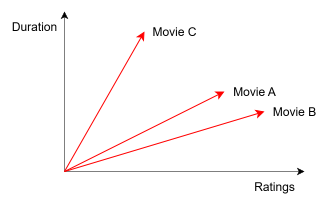
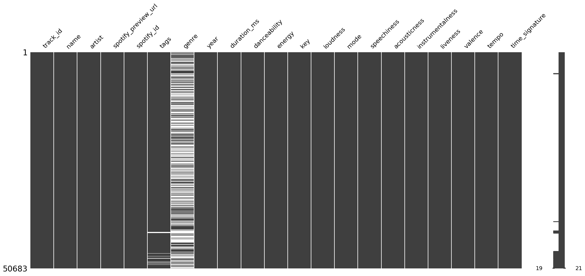
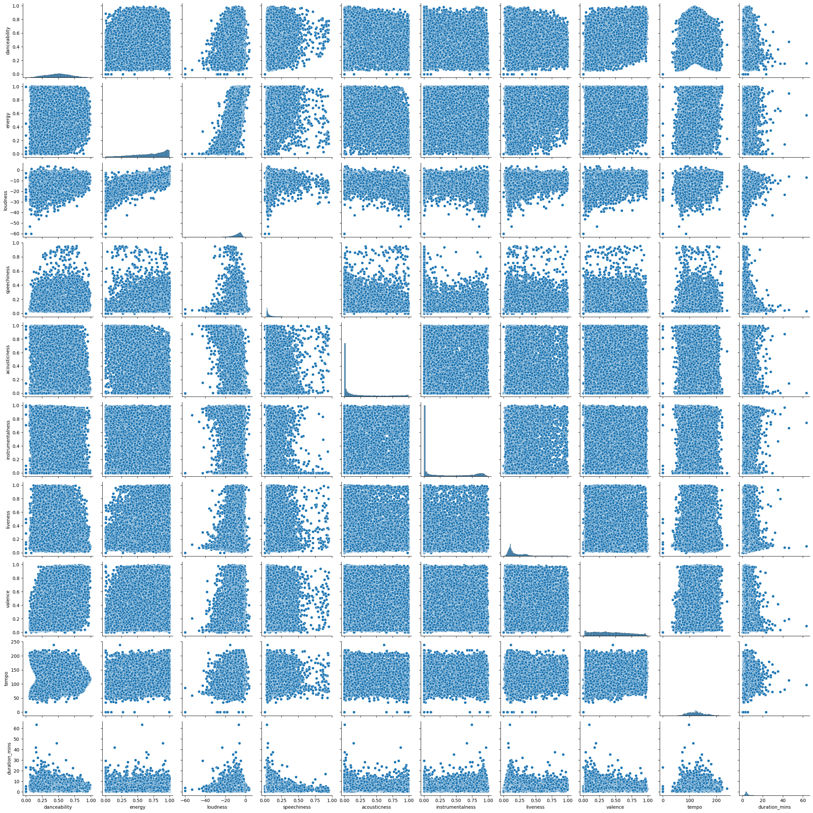

# Introduction

## What are Recommender Systems?

Recommender systems are algorithms that recommend content (e.g., books, movies, TV shows, etc.) to a user based on their preference and current behavior. Colloquially, a recommender system is like a user's friend who knows their taste, current behavior, and currently what is going on in their life. Based on this knowledge, this friend can recommend content to the user that the user can potentially find interesting. Note that the taste of the user is dynamic (i.e., it keeps changing). The friend takes into consideration user's current taste to give the best recommendations. The same is true with recommender systems.

Recommender systems are used in a variety of industries. Some of them are:

- Media Streaming: Netflix, Amazon Prime, YouTube, Spotify, etc.
- E-Commerce: Amazon, Flipkart, etc.
- Social Media: Facebook, Instagram, etc.

## Why Recommender Systems?

Let us take the example of movie streaming. Why not simply sort all the movies lexicographically and give it to the user? For instance, we can create web pages for all movies starting with the letter "A", next web page for all the movies starting with the letter "B", and so on. There are multiple problems with this approach. Some of the main ones are the following.

### The Need of User to be Extremely Specific

The user will have to know the exact movie they want to watch so that they can search for it and watch it. This is like the proverbial needle in a haystack problem.

### No Way to Search for Similar Content

Once the user watches the specific movie they want to watch, there is no way for them to search for a unknown movie which is similar to the movie they just watched. As these movies are similar, the user will potentially like it. This will increase the user's engagement with the streaming platform.

This is why recommender systems play a crucial role in today's industry.

## Types of Recommender Systems

We will discuss about recommender systems starting from the very basic to the relatively modern.

### Popularity-Based Recommender System

As the name suggests, this recommender system simply recommends the user the content that is the "most popular", e.g., highly rated, watched by most, currently trending, etc. It is so simple that we do not need any machine learning algorithm here. In the movie streaming platform context, we simply need a database that contains the movies along with their user ratings. So, providing recommendation in this system simply amounts to grouping by these ratings, sorting by the average rating in descending order, and displaying the top-$k$ (e.g., top-10) movies to the user. Further, instead of user ratings, we can also group by the revenue earned by the movie, or some other column. A simple filter, e.g., based on language, can also be applied by asking the user their preferred language.

#### Advantages

The advantages of this recommender system are the following:

- **Easy to implement:** As discussed, this system simply amounts to grouping by a particular column (e.g., user ratings, revenue earned, etc.) and display some top-$k$ movies in descending order of that column.
- **Easy to tackle cold-start problem:** The cold start problem in the movie streaming context is recommending movies to a new user. As this user is new, their taste, e.g., their past viewing history, is unknown. So recommending movies that this user likes is difficult. However if we are simply displaying the top-10 movies to all users, then this problem is easily solved.
- **Highly scalable:** No matter how much the movie catalogue or the user population increases, the logic still remains easy to implement.

#### Disadvantages

There are some serious disadvantages of this recommender system. Some of them are the following:

- **No personalized recommendations:** This system does not address the diversity in user taste. Just because most users have rated a movie highly doesn't mean that all users will like it.
- **Bias:** If there is a genuinely good movie on the streaming platform but it is seen by very few people, and rated by even fewer, then this movie will rank a lot lower on the scale as compared to a movie which is not that good but is seen by many and also rated by many due to starring a popular actor. So, such a system is biased against some niche but really good movies.
- **Lack of Diversity:** If a multilingual user selects that they prefer watching movies in English, then the system won't be able to recommend the user good movies in other languages.

### Content-Based Recommender System

A content-based recommender system recommends content to a user that is similar to the content that is already consumed by them.

#### Advantages

- **Recommends similar content:** As mentioned before, this system recommends content that is similar (with respect to the metadata) to the content already consumed by the user. This adds a personalized touch to the recommendation which increases user engagement.
- **Recommendations solely dependent on user habits:** For example, if a user watches a lot of data science related videos on YouTube, then they will be recommended more of such videos. If in future they start watching web development related videos, then the recommendations will now shift to web development related videos. So, the user habits determine the recommendations.

#### Disadvantages

- **Overspecialized recommendations:** Say a user studies the entire day by watching data science related videos on YouTube. However, when they unwind in the evening, they may want some entertainment (e.g., comedy). However, they won't be shown such content unless they search for it. The system cannot recommend content other than the content that the user is currently watching or have watched before. So, the recommendations the user gets are too specialized.
- **No diversity:** This is connected to the previous point. Overspecialization will lead to less diverse recommendations.
- **Cold start problem:** Whenever a new user joins the platform, the system won't know what to recommend as it does not know about the user's history and search habits.

#### Working of Content-Based Recommender System

Consider the example of movie streaming platform. Each row in the data has features of a particular movie. Say there are two features, namely ratings and duration. Consider the toy dataset shown in @tbl-movie_ratings_duration.

::: {.tbl tbl-colwidths="auto"}
| Movie name | Rating | Duration (hrs.) |
|:----------:|:------:|:---------------:|
| Movie A | 4 | 2 |
| Movie B | 5 | 1.5 |
| Movie C | 2 | 3.5 |

: Ratings and durations of movies. {#tbl-movie_ratings_duration style="width:50%; margin:auto;"}
:::

This can be viewed as vectors on a coordinate plane, as shown in @fig-movie_ratings_duration.

{#fig-movie_ratings_duration fig-align="center" width=50% .invert}

Just by looking at the figure, it is clear that Movie A and Movie B are closer to each other, and hence are more "similar" to each other. So if a user watches Movie A, we can recommend them Movie B. We will discuss how this "similarity" is calculated later.

### Collaborative Filtering

A collaborative filtering recommender system is based on user-item interation. To put it more simply, this recommender system is based on the usage and taste of other users that are similar to the users to whom we want to give recommendations. Collaborative filtering can be further divided into two types.

#### User-Based Collaborative Filtering

Consider the following movie streaming scenario. Say we have 5 users, $U_1$, $U_2$, ..., $U_5$, and 3 movies, $M_1$, $M_2$, and $M_3$. The ratings given by each user to each of the movies is indicated in @tbl-user_movie_matrix.

::: {.tbl tbl-colwidths="auto"}
|  | $M_1$ | $M_2$ | $M_3$ |
|:--:|:----:|:----:|:----:|
| $U_1$ | 3 | 4 | – |
| $U_2$ | – | 4 | – |
| $U_3$ | 2 | 5 | 4 |
| $U_4$ | – | – | – |
| $U_5$ | 3 | 3.5 | 2 |

: User–movie rating matrix. {#tbl-user_movie_matrix style="width:50%; margin:auto;"}
:::

Note that the "–" in the table indicates that the corresponding user didn't rate that particular movie. Now, say the platform wants to recommend movies to user $U_2$ who has just watched a single movie, i.e., $M_2$. To do this we follow the following steps:

- We will calculate the similarity of this user $U_2$ with all the other users.
- Select the user that is the most similar to $U_2$.
- Say $U_1$ is the user that is the most similar to $U_2$. We will recommend $U_2$ the movie that is not watched by them but is watched by $U_1$ and is also highly rated by $U_1$.

This movie is $M_1$. Hence, we will recommend the movie $M_1$ to the user $U_2$.

User-based collaborative filtering is used when the number of items is far greater than the number of users. Remember that in this type of collaborative filtering, each row in the matrix stands for a particular user.

#### Item-Based Collaborative Filtering

This is very similar to user-based collaborative filtering. The only difference is that there we found similarity between users, whereas here we find similarity between items. Say we have 4 items, $I_1$, $I_2$, ..., $I_4$, and 3 users $U_1$, $U_2$, and $U_3$. Consider the matrix shown in @tbl-user_item. This table indicates whether a particular item is liked by a user (using Boolean values).

::: {.tbl tbl-colwidths="auto"}
|  | $U_1$ | $U_2$ | $U_3$ |
|:--:|:----:|:----:|:----:|
| $I_1$ | 1 | 1 | 1 |
| $I_2$ | 1 | 1 | 0 |
| $I_3$ | 0 | 0 | 0 |
| $I_4$ | 0 | 0 | 1 |

: Binary user–item preference matrix. {#tbl-user_item style="width:50%; margin:auto;"}
:::

Now we calculate similarity between items. We can see that item $I_1$ is liked by users $U_1$, $U_2$, and $U_3$; item $I_2$ is liked by users $U_1$ and $U_2$; and item $I_4$ is liked by user $U_3$. We can see that items liked by user $U_2$ are also liked by user $U_1$. So, if right now someone is consuming item $I_2$, then they will be recommended item $I_1$ as it is similar to $I_2$. As we can see, the recommendations here are based on the similarity of items.

Item-based collaborative filtering is used when the number of users is far greater than the number of items. Remember that in this type of collaborative filtering, each row in the matrix stands for a particular item.

#### Advantages

- **Diversity:** This recommender system can expose a user to content they aren't exposed to yet, i.e., new content.
- **Better recommends as the data size increases:** In the context of a movie streaming platform, as the number of movies and number of users increase, the interaction between them will become richer, improving the recommendation system for all users.
- **Non-reliance on metadata:** This system does not rely on the metadata.

#### Disadvantages

- **Cold start problem:** For a new user would have watched very few, if any, movies. Similarly, very few users, if any, would have rated or watched a new movie. So, there won't be a lot of information on these new users and new movies. Hence, the recommendation system will have a hard time in giving recommendations.
- **Computationally expensive:** The number of steps carried out in giving recommendations using collaborative filtering is significantly more than other recommendation systems. Hence, it is computationally expensive.
- **Large datasets:** The item-user interaction matrix can be massive.

### Hybrid Recommendation System

A hybrid recommendation system combines multiple types of recommender systems into a single recommender system. In doing this, it eliminates the disadvantages of all of these recommendation systems and retains their advantages. By looking at the advantages of all the recommender systems we have discussed so far, it is clear that this will happen since for each recommender system there is another recommender system whose advantages address its disadvantages. We will work on a hybrid recommender system that combines content-based filtering with collaborative filtering.

#### Working of Hybrid Recommender System

There are multiple approaches used to build a hybrid recommender system. We will be using a weighted approach. Let $w_{\text{cb}}$ denote the weight of content-based filtering and $w_{\text{cf}}$ denote the weight of collaborative filtering. We will choose these weights such that

$$
w_{\text{cb}} + w_{\text{cf}} = 1
$$

These weights will be applied to the similarity scores.

#### Similarity Score

Similarity score can be calculated using various approaches. Distance-based similarity is very common. For instance, each movie will be a vector, and the distance (Euclidean, Manhattan, or cosine) between two movie vectors can be calculated. The lower this distance, the higher the similarity.

Another approach is using cosine similarity. We will be using this approach because of its two key advantages:

- It is immune to curse of dimensionality, i.e., no matter how high dimensional (i.e., a lot of features) the data is, this can be calculated easily.
- It is bounded between $-1$ to $1$.
  - $-1$ means highest dissimilarity,
  - $0$ means no similarity,
  - $1$ means highest similarity.

The cosine similarity between two vectors $\vb{v}_1$ and $\vb{v}_2$ is given by

$$
\cos\left(\theta\right) = \frac{\vb{v}_1^{\intercal} \vb{v}_2}{\left\lvert\left\lvert \vb{v}_1 \right\rvert\right\rvert \left\lvert\left\lvert \vb{v}_2 \right\rvert\right\rvert}
$$ {#eq-cosine_similarity}

Recall that the numerator, i.e., $\vb{v}_1^{\intercal} \vb{v}_2$, is nothing but the dot product between the vectors $\vb{v}_1$ and $\vb{v}_2$. So highest dissimilarity means that the vectors are at $180^{\circ}$ (or opposite) to each other, no similarity means that the vectors are at $90^{\circ}$ (or perpendicular) to each other, and highest similarity means the vectors are at $0^{\circ}$ (or parallel) to each other.

## Spotify Recommender System

We are replicating a scenario in which Spotify, which is a music streaming platform, is facing high customer churn rate. Spotify till now offers only popularity-based recommendations, i.e., music with the most play count. Due to the high churn rate, the platform is facing poor user engagement and poor user retention. They are switching to platforms that offer more personalized as well as a variety of recommendations. After quite a bit of brainstorming, it was decided that the currently used popularity-based recommender system will be replaced with a new hybrid recommender system such that the users get more personalized and a variety of recommendations. This should in turn help with the high customer churn rate as it will improve user engagement and retention.

From the Spotify database, we will use the following two datasets:

- **Songs dataset:** This has information about all the songs on Spotify, e.g., attributes, metadata, etc.
- **User-Song Interaction dataset:** This has information about how many times a particular user has played a particular song. This information is available for all users.

We will use the first dataset to build a content-based recommender system and the second to build a collaborative-filtering recommender system. Finally, we will combine both these systems to build a hybrid recommender system.

## Goal of the Project

As mentioned before, the goal of the project is to improve user engagement and user retention on Spotify by providing personalized and a variety of recommendations. We will be achieving this goal by building a hybrid recommender system.

## Data

The data is available on Kaggle, which can be checked out [here](https://www.kaggle.com/datasets/undefinenull/million-song-dataset-spotify-lastfm). The songs dataset that was mentioned is named as the "Music Info", which contains 50,683 songs (or tracks). The description of this data is shown in @tbl-data_description_music_info.

::: {.tbl tbl-colwidths="auto"}
| Column | Description |
|:------:|:------------|
| `track_id` | Unique identifier for each track (e.g., `TRIOREW128F424EAF0`). |
| `name` | Title of the song or track. |
| `artist` | Name of the primary performing artist or group. **Unique artists:** ≈ 8,300 |
| `spotify_preview_url` | Direct link to Spotify’s 30-second audio preview for the track. |
| `spotify_id` | Spotify’s unique identifier for the track (`spotify:track:` URI suffix). |
| `tags` | Variable-length, comma-separated listener tags describing genre, mood, era, etc. **Most frequent tags (top 10):** `rock`, `indie`, `electronic`, `alternative`, `pop`, `female_vocalists`, `alternative_rock`, `indie_rock`, `metal`, `classic_rock`. |
| `genre` | Broad genre label inferred from metadata (may be blank if unknown). **Categories (15):** `Blues`, `Country`, `Electronic`, `Folk`, `Jazz`, `Latin`, `Metal`, `New Age`, `Pop`, `Punk`, `Rap`, `Reggae`, `RnB`, `Rock`, `World`. |
| `year` | Calendar year the track was first released (range 1900–2022). |
| `duration_ms` | Total length of the track in milliseconds. |
| `danceability` | Spotify audio feature measuring how suitable the track is for dancing (0.0–1.0; higher = more danceable). |
| `energy` | Overall intensity and activity level of the track (0.0–1.0; higher = more energetic). |
| `key` | Estimated musical key using Pitch-Class notation (0 = C, 1 = C♯/D♭, …, 11 = B). **Categories (12):** `0`–`11`. |
| `loudness` | Average loudness of the track in decibels relative to full scale (dBFS; typically negative). |
| `mode` | Musical modality of the track. **Categories:** `1` = Major (≈ 63%), `0` = Minor (≈ 37%). |
| `speechiness` | Proportion of spoken words in the track (0.0–1.0; higher = more speech-like content). |
| `acousticness` | Likelihood that the track is acoustic (0.0–1.0; higher = more acoustic). |
| `instrumentalness` | Probability that the track contains no vocals (0.0–1.0; values > 0.5 suggest instrumental). |
| `liveness` | Probability the track was performed live (0.0–1.0; higher = greater live-audience presence). |
| `valence` | Musical positiveness conveyed by the track (0.0 = sad/angry, 1.0 = happy/cheerful). |
| `tempo` | Estimated overall tempo of the track in beats per minute (BPM). |
| `time_signature` | Estimated time signature expressed as beats per bar. **Categories:** `4` (≈ 89%), `3`, `5`, `1`, `0`. |

: Column-wise description of the “Music Info” dataset. {#tbl-data_description_music_info style="width:100%; margin:auto;"}
:::

Using this data, we will build the content-based filtering recommender system.

The user-song interaction dataset is named "User Listening History", which has 9,711,301 records. The description of this data is shown in @tbl-data_description_user_listening_history.

::: {.tbl tbl-colwidths="auto"}
| Column | Description |
|:------:|:------------|
| `track_id` | Unique identifier for each track (e.g., `TRIRLYL128F42539D1`). |
| `user_id` | SHA-1–like hexadecimal hash uniquely identifying a user (e.g., `b80344d063b5ccb3212f76538f3d9e43d87dca9e`). |
| `playcount` | Integer representing how many times the given user has listened to the track. |

: Column-wise description of the “User Listening History” dataset. {#tbl-data_description_user_listening_history style="width:100%; margin:auto;"}
:::

Using this, we will build the collaborative filtering recommender system. Further, we can also see that the songs dataset and the user-song interaction dataset has the column `track_id` in common. So they can be joined on this column.

## Improving Business Metrics

Spotify broadly has two sources of revenue as it has two types of users:

- **Revenue from free users:** Free users on Spotify are shown advertisements.
- **Revenue from subscribed users:** Subscribed users pay fees to Spotify to make their experience advertisement free.

### User Engagement

Once the users are provided with personalized and a variety of recommendations, user engagement with the platform will improve. This will, by definition, make the user listen to more songs. Free users will be shown an advertisement after they listen to a certain number of songs, which will generate revenue. If the user wants an advertisement free experience, they can subscribe. So, as the number of free users increase, the number of subscribed users will also increase. This will again generate revenue.

### Click-Through Rate (CTR)

This is closely tied with user engagement. If CTR increases, so will user engagement. If a user, while listening, is shown 10 recommendations, and they choose the next song based on these recommendations, then it is considered as 1 click. And we want the user to select the next song from these recommendations. When the user is presented with more personalized and a variety of recommendations, they will like it more, and the probability that they will pick one of the songs from the recommendations as their next song also increases.

### User Conversion

This is, again, linked to user engagement. If a free user is a regular user, they will be shown more advertisements. So, it is likely that they will buy a subscription plan. This is how free users can be converted to subscribed users. This will increase the users with subscription.

### Lower Churn Rate

If a user is provided with good recommendations, then they will choose to stick with the platform and renew the subscription. So, a good recommender system will also lower the churn rate.

## How to Achieve the Goal

The flow of the project will be the following:

- We will build a Streamlit application that takes in a song as input.
- Based on this song, we will recommend 10 similar songs to the user. In other words, we will implement content-based filtering.
- We will build a collaborative filtering system using the user-song interaction data. We will find 10 similar songs that the other users are listening to, and recommend it to the user. So, this will be a item-based collaborative filtering.
- We will combine both these recommender systems using the weighted approach to build a hybrid recommender system. We will use various methods to determine the weights.

### Challenges

There are two major challenges.

#### Data Size

The user-song interaction table consists of about 9.7 million rows, which is already massive. However, we will have to transform this into a song-user matrix using this data which has all the unique songs as the rows and all the unique users as the columns. In other words, the dimensions of this matrix are

$$
\text{Number of unique songs}\times \text{number of unique users}
$$

The number of unique songs in the data is about 30 thousand, and the number of unique users is about 1 million. So the total number of values in this interaction matrix is their multiplication, which is even more massive. The size of this data is in the 20s of GBs. We won't be able to load this in the RAM.

One approach to break the data into manageable chunks, and do the transformation on these chunks individually. To solve this issue, we will use the library [`Dask`](https://www.dask.org/).

#### Weights of the Hybrid Recommender Model

We want to determine the weights of the content-based filtering as well as the collaborative filtering recommenders so that we know how to combine them to form a hybrid recommender system. For instance, we would want the weights of the collaborative filtering system to be higher for a user who is using the platform since a longer time. Similarly, we want the weights of the content-based filtering system to be higher for a new user.

# Exploratory Data Analysis (EDA)

We will now perform a detailed EDA on both the datasets.

## Songs Dataset

As mentioned earlier, this data has 50,683 rows and 21 columns. The information about the columns is given in @tbl-data_description_music_info. We noticed that there are three columns, namely `track_id`, `spotify_preview_url`, and `spotify_id`, that have unique values for almost all the rows. We may drop these later.

### Missing Values

@fig-missing_values_matrix_songs_dataset shows the missing values matrix that helps us visualize how the missing values are distributed in the data.

{#fig-missing_values_matrix_songs_dataset fig-align="center" width=100% .invert}

Only two columns, `genre` and `tags`, have missing values. We can see that `genre` has a lot of missing values. In fact, the majority of values (about 56%) in `genre` are missing, and they are missing at random. Further, `tags` has a lot fewer missing values (only about 2%).

### Duplicates

We especially do not want duplicates in the data because the similarity score between duplicate songs will obviously be very high. We do not want duplicate songs as recommendations. Checking duplicates using the simple code

```python
df_songs.duplicated().any()
```

gives `False` as the output. So, at first glance, it looks like we are good. However, when we checked for all songs with duplicate names using the following code

```python
df_songs["name"].str.lower().duplicated().sum()
```

we found that a total of 815 songs had the same name. After printing these songs, we noticed that though the names are the same, the artists are different. So most of these songs are actually different.

To find duplicate songs in a better way, we added the condition that the songs are duplicates only if the values in the columns `spotify_preview_url`, `spotify_id`, `artist`, `year`, `duration_ms`, and `tempo` match. This is equivalent to running the following code.

```python
df_songs.duplicated(subset=["spotify_preview_url", "spotify_id", "artist", "year", "duration_ms", "tempo"]).sum()
```

This gave 9 duplicate rows. We printed them, verified that they indeed are duplicate songs, and dropped them.

### Column-wise Analysis

Firstly, for convenience and readability, we created a new column `duration_mins` using the column `duraction_ms` by running the following code:

```python
df_songs["duration_mins"] = df_songs["duration_ms"].div(1000).div(60)
```

Next, we saved all the categorical columns in a list `categorical_cols` using the following code:

```python
categorical_cols = df_songs.select_dtypes(include="object").columns
```

Next, we saved all the integer columns in a list `integer_cols` using the following code:

```python
integer_cols = df_songs.select_dtypes(include="int").columns
```

Finally, we saved all the continuous columns in a list `continuous_cols` using the following code:

```python
continuous_cols = df_songs.select_dtypes(include="float").columns
```

Further, we created the following function for categorical analysis on all the categorical columns:

```python
def categorical_analysis(df, columns, k_artists=15):
    for column in columns:
        print(f"The column '{column}' has {df[column].str.lower().nunique()} categories.")

        if column in ["artist", "genre"]:
            print(df[column].value_counts().head(k_artists))

        if column == "genre":
            print(f"The unique categories in the column '{column}' are: {df[column].dropna().unique()}")

        print("#" * 150, end="\n\n")
```

This function gives the number of categories in each categorical column, and prints the top-15 value counts of the `artist` and `genre` columns.

We also created a function to do numerical analysis on all numerical columns, which is the following:

```python
def numerical_analysis(df, columns):
    for column in columns:
        print(f"Numerical analysis for '{column}':", end="\n\n")
        print("Statistical summary:")
        print(df[column].describe(), end="\n\n")

        fig = plt.figure(figsize=(12, 4))
        plt.subplot(1, 2, 1)
        sns.histplot(df[column])
        plt.title(f"Histogram of '{column}'")

        plt.subplot(1, 2, 2)
        sns.boxplot(df[column])
        plt.title(f"Boxplot of '{column}'")
        plt.show();

        print("#" * 150, end="\n\n")

    print("Pairplot")
    sns.pairplot(df[columns])
    plt.show();
```

This function runs the `describe` method, plots a histogram and a box plot for each of the columns. At the end, it also plots a pair plot for all the columns.

#### All Categorical Columns

Running the function `categorical_analysis` on all the categorical columns, i.e., running the following code

```python
categorical_analysis(df_songs, categorical_cols)
```

gave us the following result:

```txt
The column 'track_id' has 50674 categories.
######################################################################################################################################################

The column 'name' has 49860 categories.
######################################################################################################################################################

The column 'artist' has 8317 categories.
artist
The Rolling Stones    132
Radiohead             110
Autechre              105
Tom Waits             100
Bob Dylan              98
The Cure               94
Metallica              85
Johnny Cash            84
Nine Inch Nails        83
Sonic Youth            81
Elliott Smith          76
Iron Maiden            76
In Flames              76
Boards of Canada       75
Mogwai                 75
Name: count, dtype: int64
######################################################################################################################################################

The column 'spotify_preview_url' has 50620 categories.
######################################################################################################################################################

The column 'spotify_id' has 50674 categories.
######################################################################################################################################################

The column 'tags' has 20054 categories.
######################################################################################################################################################

The column 'genre' has 15 categories.
genre
Rock          9965
Electronic    3710
Metal         2516
Pop           1145
Rap            820
Jazz           793
RnB            696
Reggae         691
Country        607
Punk           383
Folk           355
New Age        237
Blues          189
World          140
Latin          100
Name: count, dtype: int64
The unique categories in the column 'genre' are: ['RnB' 'Rock' 'Pop' 'Metal' 'Electronic' 'Jazz' 'Punk' 'Country' 'Folk'
 'Reggae' 'Rap' 'Blues' 'New Age' 'Latin' 'World']
######################################################################################################################################################
```

- The column `track_id` has all unique values.
- The `name` of some songs are the same, which is understandable as names of two different songs can be the same.
- These two columns also don't help much for recommendations, the `track_id` due to its uniqueness, and `name` due to the fact that matching names does not imply similar songs.
- The data consists of 8,317 `artist`s, which can be used for recommendations since if people like a song from a particular artist, they may also like some other song by the same artist.
- The column `spotify_preview_url` has almost all values as unique. We won't drop this column as it will be helpful in providing a preview audio of a song recommendation to users.
- The column `spotify_id` has all its values unique. Again, this column won't be helpful in giving recommendations due to its uniqueness.
- The column `tags` has multple tags for the same song. We can use this column to use some vectorization technique.
- The column `genre` has 15 categories. However this column also has about 56% of the values as missing.

#### `genre`

Recall that this column `genre` has a lot of missing values. @fig-countplot_genre shows the count plot of this column.

{#fig-countplot_genre fig-align="center" width=70% .invert}

To check if we can try to fill `genre` using the column `tags`, we grouped by `genre` and printed the `genre` and `tags` using the following code:

```python
genre_group = df_songs.groupby("genre")
genre_group[["genre", "tags"]].sample(3)
```

We saw that the same genre can have different tags. Also, genre and tags are interchangeable in the data. Hence, it is not possible to fill the missing values in `genre` using `tags`.

#### Non-English `name`

Using the following code

```python
df_songs.loc[df_songs.loc[:, "name"].str.contains("[^\d\w\s.?!':;-_(){},\.#-&/-]")]
```

we saw that there are about 39 rows for which the song name contains non-English characters. However, this is not a problem since we won't be using the name of the song for recommendation purpose.

#### Non-English `artist`

Using the following code

```python
df_songs.loc[df_songs.loc[:, "artist"].str.contains("[^\d\w\s.?!':;-_(){},\.#-&/-]")]
```

we saw that there are about 24 rows for which the artist name contains non-English characters. Again, this is not a problem as we will encode these later.

#### `tags`

Each row in the data has multiple values in the `tags` column. After adding all the tags in a set, we found that there are 100 unique tags in the entire data.

#### All Integer Columns

The integer columns we have are `year`, `duration_ms`, `key`, `mode`, and `time_signature`. Running the `describe` function on them gives the information shown in @tbl-integer_cols_summary.

::: {.tbl tbl-colwidths="auto"}
|  | year | duration_ms | key | mode | time_signature |
|:--:|:----:|:-----------:|:---:|:----:|:--------------:|
| **count** | 50,674 | 50,674 | 50,674 | 50,674 | 50,674 |
| **mean** | 2004.02 | 251,153.64 | 5.31 | 0.63 | 3.90 |
| **std** | 8.86 | 107,589.21 | 3.57 | 0.48 | 0.42 |
| **min** | 1900 | 1,439 | 0 | 0 | 0 |
| **25%** | 2001 | 192,733 | 2 | 0 | 4 |
| **50%** | 2006 | 234,933 | 5 | 1 | 4 |
| **75%** | 2009 | 288,183 | 9 | 1 | 4 |
| **max** | 2022 | 3,816,373 | 11 | 1 | 5 |

: Descriptive statistics for integer columns (values formatted for readability). {#tbl-integer_cols_summary style="width:100%; margin:auto;"}
:::

We can see that

- Most of the songs in the data seem to be after the year 2006.
- Most of the songs are in the time signature of 4.

Next, we ran the following code on the integer columns:

```python
for col in integer_cols:
    print(f"The column '{col}' has {df_songs[col].nunique()} unique values.")
```

The output we got is the following:

```txt
The column 'year' has 75 unique values.
The column 'duration_ms' has 24202 unique values.
The column 'key' has 12 unique values.
The column 'mode' has 2 unique values.
The column 'time_signature' has 5 unique values.
```

Next, we ran the following code on the integer columns:

```python
for col in integer_cols:
    print(f"The top category in the column '{col}' is:")
    print(f"{df_songs[col].value_counts().head(1)}", end="\n\n")
```

The output we got is the following:

```txt
The top category in the column 'year' is:
year
2007    4221
Name: count, dtype: int64

The top category in the column 'duration_ms' is:
duration_ms
214666    21
Name: count, dtype: int64

The top category in the column 'key' is:
key
9    5907
Name: count, dtype: int64

The top category in the column 'mode' is:
mode
1    31979
Name: count, dtype: int64

The top category in the column 'time_signature' is:
time_signature
4    44981
Name: count, dtype: int64
```

#### `year`

@fig-histogram_year shows the histogram of the column `year`.

{#fig-histogram_year fig-align="center" width=70% .invert}

We can see that most of the songs are from the 2000's.

#### `key`

@fig-barplot_value_counts_key shows the bar plot of the % value counts of the column `key`.

{#fig-barplot_value_counts_key fig-align="center" width=70% .invert}

The `key` distribution seems random. However, the least number of songs are in the `key` of `3`, i.e., D♯.

#### `mode`

@fig-countplot_mode shows the count plot of the column `mode`.

{#fig-countplot_mode fig-align="center" width=70% .invert}

We can see that most of the songs are in a major scale.

#### `time_signature`

@fig-countplot_time_signature shows the count plot of the column `time_signature`.

{#fig-countplot_time_signature fig-align="center" width=70% .invert}

We can see that the overwhelming majority of the songs hav a time signature of 4, and a very tiny fraction of songs have it as 0, 1, and 5.

#### `duration_mins`

@fig-histogram_duration_mins shows the histogram of the column `duration_mins`.

{#fig-histogram_duration_mins fig-align="center" width=70% .invert}

We can see that

- Vast majority of songs are between 1 to 10 minutes long.
- Duration has a long right tail, i.e., it is considerably right-skewed.
- This means that it has many outliers.

@fig-boxplot_duration_mins shows the box plot of this column.

{#fig-boxplot_duration_mins fig-align="center" width=70% .invert}

We can see that there is one song which is longer than 60 mins. We also printed this particular row. The song is legit.

#### All Continuous Columns

We ran the `numerical_analysis` function on all continuous columns using the following code:

```python
numerical_analysis(df_songs, continuous_cols)
```

The output we got is the following.

##### `danceability`

The output of the `describe` method on `danceability` is the following:

```txt
Statistical summary:
count    50674.000000
mean         0.493522
std          0.178833
min          0.000000
25%          0.364000
50%          0.497000
75%          0.621000
max          0.986000
Name: danceability, dtype: float64
```

Further, the histogram and the box plot is shown in @fig-histogram_and_boxplot_danceability.

{#fig-histogram_and_boxplot_danceability fig-align="center" width=100% .invert}

The distribution peaks at a `danceability` of 0.5, and seems symmetric.

##### `energy`

The output of the `describe` method on `energy` is the following:

```txt
Statistical summary:
count    50674.000000
mean         0.686507
std          0.251803
min          0.000000
25%          0.514000
50%          0.744000
75%          0.905000
max          1.000000
Name: energy, dtype: float64
```

Further, the histogram and the box plot is shown in @fig-histogram_and_boxplot_energy.

{#fig-histogram_and_boxplot_energy fig-align="center" width=100% .invert}

The distribution looks left skewed with most songs having a high amount of `energy`.

##### `loudness`

The output of the `describe` method on `loudness` is the following:

```txt
Statistical summary:
count    50674.000000
mean        -8.291007
std          4.548359
min        -60.000000
25%        -10.375000
50%         -7.199500
75%         -5.089000
max          3.642000
Name: loudness, dtype: float64
```

Further, the histogram and the box plot is shown in @fig-histogram_and_boxplot_loudness.

{#fig-histogram_and_boxplot_loudness fig-align="center" width=100% .invert}

The distribution is extremely left skewed with most songs having a high value of `loudness`. There are also some extreme values that have a very low value of `loudness`.

##### `speechiness`

The output of the `describe` method on `speechiness` is the following:

```txt
Statistical summary:
count    50674.000000
mean         0.076026
std          0.076012
min          0.000000
25%          0.035200
50%          0.048200
75%          0.083500
max          0.954000
Name: speechiness, dtype: float64
```

Further, the histogram and the box plot is shown in @fig-histogram_and_boxplot_speechiness.

{#fig-histogram_and_boxplot_speechiness fig-align="center" width=100% .invert}

The distribution is extremely right skewed with a lot of extreme values. Seems like our data has a lot of instrumental songs without any, or very less, vocals.

##### `acousticness`

The output of the `describe` method on `acousticness` is the following:

```txt
Statistical summary:
count    50674.000000
mean         0.213798
std          0.302839
min          0.000000
25%          0.001400
50%          0.039900
75%          0.340000
max          0.996000
Name: acousticness, dtype: float64
```

Further, the histogram and the box plot is shown in @fig-histogram_and_boxplot_acousticness.

{#fig-histogram_and_boxplot_acousticness fig-align="center" width=100% .invert}

The distribution is right skewed with extreme values. Looks like our data has most songs that are not acoustic.

##### `instrumentalness`

The output of the `describe` method on `instrumentalness` is the following:

```txt
Statistical summary:
count    50674.000000
mean         0.225299
std          0.337067
min          0.000000
25%          0.000018
50%          0.005630
75%          0.441000
max          0.999000
Name: instrumentalness, dtype: float64
```

Further, the histogram and the box plot is shown in @fig-histogram_and_boxplot_instrumentalness.

{#fig-histogram_and_boxplot_instrumentalness fig-align="center" width=100% .invert}

The distribution is right skewed. Most songs have low value of `instrumentalness`.

##### `liveness`

The output of the `describe` method on `liveness` is the following:

```txt
Statistical summary:
count    50674.000000
mean         0.215439
std          0.184708
min          0.000000
25%          0.098400
50%          0.138000
75%          0.289000
max          0.999000
Name: liveness, dtype: float64
```

Further, the histogram and the box plot is shown in @fig-histogram_and_boxplot_liveness.

{#fig-histogram_and_boxplot_liveness fig-align="center" width=100% .invert}

The distribution is a bit peculiar. It is bimodal with right skew. Most songs have low `liveness`, but there is a small peak at an intermediate value.

##### `valence`

The output of the `describe` method on `valence` is the following:

```txt
Statistical summary:
count    50674.000000
mean         0.433113
std          0.258767
min          0.000000
25%          0.214000
50%          0.405000
75%          0.634000
max          0.993000
Name: valence, dtype: float64
```

Further, the histogram and the box plot is shown in @fig-histogram_and_boxplot_valence.

{#fig-histogram_and_boxplot_valence fig-align="center" width=100% .invert}

The distribution looks close to uniform at for small values of `valence`, however it has a slight right skew at the end.

##### `tempo`

The output of the `describe` method on `tempo` is the following:

```txt
Statistical summary:
count    50674.000000
mean       123.508794
std         29.622349
min          0.000000
25%        100.682500
50%        121.989000
75%        141.642250
max        238.895000
Name: tempo, dtype: float64
```

Further, the histogram and the box plot is shown in @fig-histogram_and_boxplot_tempo.

{#fig-histogram_and_boxplot_tempo fig-align="center" width=100% .invert}

The distribution looks close to normal with extreme values in both directions.

##### `duration_mins`

The output of the `describe` method on `duration_mins` is the following:

```txt
Statistical summary:
count    50674.000000
mean         4.185893
std          1.793154
min          0.023983
25%          3.212217
50%          3.915550
75%          4.803046
max         63.606217
Name: duration_mins, dtype: float64
```

Further, the histogram and the box plot is shown in @fig-histogram_and_boxplot_duration_mins.

{#fig-histogram_and_boxplot_duration_mins fig-align="center" width=100% .invert}

We have already seen these two plots before (@fig-histogram_duration_mins and @fig-boxplot_duration_mins).

##### Pair Plot

The pair plot of all the continuous columns is shown in @fig-songs_data_pairplot.

{#fig-songs_data_pairplot fig-align="center" width=100% .invert}

We can see that `loudness` and `energy` are positively correlated, i.e., if one increases, the other increases too. The same is true for `danceability` and `loudness`. The other columns do not seem to have any relationship.

## User-Song Interaction Dataset

The description of this data is shown in @tbl-data_description_user_listening_history. Fortunately, there are no duplicates and missing values in this data. Further, we also found that the number of unique users in this data is 962,037, and the number of unique songs are 30,459. The number of unique songs in the songs data is 50,683. This means that there are about 20 thousand or so songs that the users in this dataset have never heard.

We figured out the `track_id`'s for the songs that were played the most by the users using the following code:

```python
df_users["track_id"].value_counts(sort=True).head(10)
```

Further, we viewed these songs in the songs dataset using the following code:

```python
top_10_most_played_songs = df_users["track_id"].value_counts(sort=True).head(10)
df_songs.loc[df_songs["track_id"].isin(top_10_most_played_songs.index.tolist()), :]
```

Further, we found the songs with the highest play count using the following code:

```python
df_users.groupby("track_id")["playcount"].agg("sum").sort_values(ascending=False)
```

We figured out that the songs that were played the most and the songs with the highest play count were almost the same. This was done using the following code:

```python
top_10_most_played_songs_playcounts = df_users.groupby("track_id")["playcount"].agg("sum").sort_values(ascending=False).head(10)
pd.concat([top_10_most_played_songs, top_10_most_played_songs_playcounts], axis=1)
```

The most diverse users were found using the following code:

```python
top_10_most_diverse_users = df_users.groupby("user_id")["track_id"].agg("count").sort_values(ascending=False).head(10)
```

These are the users that have played the most number of different songs. Further, we also found the most active users using the following code:

```python
top_10_most_active_users = df_users.groupby("user_id")["playcount"].agg("sum").sort_values(ascending=False).head(10)
```

These are the users that have the highest play count. Concatenating both these types of users using the following code

```python
pd.concat([top_10_most_diverse_users, top_10_most_active_users], axis=1)
```

we figured out that both these types of users are not the same. It looks like the most diverse users do not play the same song repeatedly, and hence have a relatively lower value of play count. Further, the most active users tend to play the same songs over and over again, making them have a high value of play count.

## Jupyter Notebook

The entire EDA was performed in a Jupyter notebook which can be checked out [here](https://github.com/SushrutGaikwad/spotify-recommender/blob/main/notebooks/01_EDA.ipynb).

# Content-Based Filtering Recommender System

As discussed before, we will first build a recommender system using content-based filtering. We will only be using the songs dataset here. In short, we will find the similarity matrix containing the similarity of each song with every other song. When the user plays a song, we will simply recommend the user the most similar songs to the song they have chosen to play.

## Flow

We have about 50 thousand songs in the songs dataset. However, the issue with the data is the following. 56% of values in the `genre` column are missing. It is also not possible to fill the values using the `tags` column. Hence, we will drop the `genre` column.

The flow is the following:

- Drop the duplicates,
- Drop the `genre` column as it has most of its values as missing,
- Fill the missing values in `tags` column with the value `"no tags"`,
- Convert all the text in the rows to lowercase,
- Get the data ready for content-based filtering:
  - Decide on the features based on which the similarity will be calculated. For instance, columns like `name`, ID-based columns, etc., are unique for every song. Hence, we will drop these so that they don't interfere while calculating the similarity. Specifically, we drop the columns `track_id`, `name`, `spotify_preview_url`, and `spotify_id`.
- Apply transformations on the data to vectorize (or numerically encode) it,
- Calculate the similarity using cosine similarity,
- Recommend the user top-$k$ most similar songs to what they are listening to right now.

## Building the System in Jupyter Notebook

We will first build the entire content-based filtering recommender system in a Jupyter notebook, and then copy the code to Python modules which will be later included as a part of a DVC pipeline. We follow the same steps as listed above.

### Data Transformation

The transformation techniques (encoding and scaling) and the respective columns they are applied on are listed in @tbl-transformation_techniques.

::: {.tbl tbl-colwidths="auto"}
| Transformation Technique | Applied Columns |
|:------------------------:|:----------------|
| Frequency Encoding | `year` |
| One-hot Encoding | `artist`, `time_signature`, `key` |
| TF-IDF | `tags` |
| Standard Scaling | `duration_ms`, `loudness`, `tempo` |
| Min-max Scaling | `danceability`, `energy`, `speechiness`, `acousticness`, `instrumentalness`, `liveness`, `valence` |

: Transformation techniques and the columns they are applied to. {#tbl-transformation_techniques style="width:80%; margin:auto;"}
:::

These were applied using `scikit-learn`'s `ColumnTransformer`. The code for this is the following:

```python
freq_enc_cols = ["year"]
ohe_cols = ["artist", "time_signature", "key"]
tfidf_col = "tags"
std_scaler_cols = ["duration_ms", "loudness", "tempo"]
min_max_scaler_cols = [
    "danceability",
    "energy",
    "speechiness",
    "acousticness",
    "instrumentalness",
    "liveness",
    "valence"
]

transformer = ColumnTransformer(
    transformers=[
        (
            "frequency_encoder",
            CountEncoder(normalize=True, return_df=True),
            freq_enc_cols
        ),
        ("one_hot_encoder", OneHotEncoder(handle_unknown="ignore"), ohe_cols),
        ("tfidf", TfidfVectorizer(max_features=85), tfidf_col),
        ("standard_scaler", StandardScaler(), std_scaler_cols),
        ("min_max_scaler", MinMaxScaler(), min_max_scaler_cols),
    ],
    remainder="passthrough",
    n_jobs=-1,
    force_int_remainder_cols=False,
)
```

This transformer was fitted on the data and was used to transform the same.

### Finding Most Similar Songs

We first pick the song "Whenever, Wherever" by the artist "Shakira" from the original data and consider it as the input. In other words, we will find the similarity of this song with all the songs in the data. We first pick the row corresponding to this song, transform it using the trained `ColumnTransformer` object defined above and find the cosine similarity using the function `cosine_similarity` from `scikit-learn`. This gives us a matrix of shape `(50674, 1)`, which is understandable as we have a total of 50,674 songs in the data, and this matrix consists of the similarity score of the song "Whenever, Wherever" with all the songs. Next, using the `argsort` function from `NumPy`, we find the indices of the songs that are the most similar, and print those rows from the data.

We also create a function that does this entire job, which is the following:

```python
def recommend(song_name, songs_data, transformed_data, k=10):
    song_row = songs_data.loc[songs_data["name"] == song_name, :]
    if song_row.empty:
        print(f"Song '{song_name}' is not present in the data.")
    else:
        song_index = song_row.index[0]
        print(f"Song index: {song_index}")
        input_vector = transformed_data[song_index].reshape(1, -1)
        similarity_scores = cosine_similarity(transformed_data, input_vector)
        print(f"similarity_scores.shape: {similarity_scores.shape}")
        top_k_most_similar_songs_idxs = np.argsort(similarity_scores.ravel())[::-1][1:][:k]
        print(f"Similarity scores of the {k} songs that are most similar to the song '{song_name}': {top_k_most_similar_songs_idxs}")
        top_k_most_similar_songs_name = songs_data.loc[top_k_most_similar_songs_idxs]
        top_k_most_similar_songs_list = top_k_most_similar_songs_name[["name", "artist", "spotify_preview_url"]].reset_index(drop=True)
        return top_k_most_similar_songs_list
```

### Jupyter Notebook

The Jupyter notebook in which all of this was done can be checked out [here](https://github.com/SushrutGaikwad/spotify-recommender/blob/main/notebooks/02_Content_Based_Filtering.ipynb).

## Building the System in a DVC Pipeline

The stages in the DVC pipeline are the following:

### Data Cleaning

The following steps are carried out in this stage:

- Loading the raw songs data,
- Dropping duplicates,
- Dropping unnecessary columns,
- Filling missing values,
- Converting entries in some columns to lowercase,
- Saving the cleaned data.

This is implemented in the `content_based_filtering/data_cleaning` module, which can be checked out [here](https://github.com/SushrutGaikwad/spotify-recommender/blob/main/spotify_recommender/content_based_filtering/data_cleaning.py).

### Data Preparation

The following steps are carried out in this stage:

- Loading the cleaned data that was saved in the previous stage,
- Dropping columns not needed to find similarity,
- Saving the prepared data.

This is implemented in the `content_based_filtering/data_preparation` module, which can be checked out [here](https://github.com/SushrutGaikwad/spotify-recommender/blob/main/spotify_recommender/content_based_filtering/data_preparation.py).

### Data Transformation

The following steps are carried out in this stage:

- Loading the prepared data that was saved in the previous stage,
- Creating the `ColumnTransformer` object to encode features,
- Training the `ColumnTransformer` object,
- Transforming the prepared data,
- Saving the transformed data and the trained `ColumnTransformer` object.

This is implemented in the `content_based_filtering/data_transformation` module, which can be checked out [here](https://github.com/SushrutGaikwad/spotify-recommender/blob/main/spotify_recommender/content_based_filtering/data_transformation.py).

### Recommendation using Content-Based Filtering

The following steps are carried out in this stage:

- Loading the cleaned data and the transformed data,
- Taking a song name from the cleaned data as input,
- Getting the corresponding row of this song from the transformed data,
- Finding the similarity score of this song (transformed) with all the songs (transformed),
- Finding and printing the top-$k$ most similar songs to this input song.

This is implemented in the `content_based_filtering/recommendation` module, which can be checked out [here](https://github.com/SushrutGaikwad/spotify-recommender/blob/main/spotify_recommender/content_based_filtering/recommendation.py).

### `dvc.yaml`

All these stages are combined in a DVC pipeline using `dvc.yaml` file, which can be checked out [here](https://github.com/SushrutGaikwad/spotify-recommender/blob/main/dvc.yaml). Running the command

```bash
dvc repro
```

from the root directory of the terminal, i.e., the directory which contains this `dvc.yaml` file, will run the DVC pipeline.

## Streamlit App

A Streamlit app was also built that gives recommendations based on content-based filtering. The app does the following:

- Loads the cleaned songs data,
- Loads the transformed (or vectorized) songs data,
- Takes the song name as input from the user and the number of recommendations the user wants,
- Gets recommendations using the `Recommender` object of the `content_based_filtering/recommendation` module,
- Displays the current song the user is listening to (i.e., the input song) and the recommendations.

This is implemented in the `app.py` module, which can be checked out [here](https://github.com/SushrutGaikwad/spotify-recommender/blob/main/app.py). Running the command

```bash
streamlit run app.py
```

starts the app.

# Collaborative Filtering Recommender System

Now, we will build a recommender system using only collaborative filtering by using the user-song interaction data. As the number of users (962,037) in the data is a lot more as compared to the number of items or songs (30,459), we will be building an item-based collaborative filtering system. In other words, we will create an item-user (song-user in this case) interaction matrix in which each row will correspond to a song and each column will correspond to a user. Further, each entry in this matrix will stand for the playcount, i.e., the number of times that particular song is played by the corresponding user. Next, we will choose a random song, i.e., a random row of this matrix, as the input song and find its similarity with all the songs in the matrix, i.e., all the rows. Finally, we will show the users the top-$k$ similar songs to this input song.

## Issue

There is an issue, which is the fact that if we create the item-user interaction matrix, then it will have a shape of $30459 \times 962037$, which means that it will have a whopping $29302684983$ (close to 30 billion) entries. Even if each entry takes 2 bytes of space, the total space needed to store this matrix will be 60 billion bytes, or 60 GBs. We do not have this much RAM to store this matrix. Further, this matrix will be sparse as almost all users will be such that they would have listened to only a tiny subset of these 30,459 songs.

This is a huge bottleneck. To solve this, we will use the Python library `Dask`. It is designed to work with large datasets using chunking. The operations on each chunk are performed in parallel.

### Why `Dask`?

`Dask` has many advantages. Some of them are the following:

- It is very similar to `pandas` and `NumPy`. More specifically, they have very similar methods. Hence learning is easy.
- It has support for parallel processing that use cores on a multi-core CPU or multiple clusters on platforms like Kubernetes.
- It handles big data by dividing it into manageable sized chunks.
- It has wrappers over many other frameworks like machine learning algorithms in `scikit-learn`, deep learning algorithms in `keras`/`torch`, boosting, etc. So, `Dask` works with all these algorithms by parallelizing their training on large datasets.

#### Working of `Dask`

`Dask` has multiple objects defined that are collectively called collections. We are only concerned with the `Dask.DataFrame` collection. There are also other collections like `Dask.Array`

`Dask` has the following three main components:

- **Client:** This is the component that interacts with the user. Whenever the user writes some `pandas`/`NumPy`-like code using `Dask`, the client converts the operations in the code into task graphs.
- **Scheduler:** The scheduler understands the task graph created by the client and checks which operations can be parallelized and assigns these tasks to the workers.
- **Worker:** These can be nodes on a cluster or cores on a multi-core CPU.

`Dask` stores these task graphs and does not execute the functions or transformations indicated in them unless the `compute` method is called. Once this method is called, the transformations are carried out parallely on the chunks.

## Flow

The flow of building the item-based collaborative filtering recommender system is the following:

- Convert the indices of the unique users and unique songs to integer,
- Creating the item-user (song-user) interaction matrix using `Dask`,
- Converting this matrix into a sparse matrix to save space,
- Calculate similarity using cosine similarity,
- Recommender the user top-$k$ most similar songs to what they are listening to right now.

## Building the System in Jupyter Notebook

Again, we will first build the entire item-based collaborative filtering recommender system in a Jupyter notebook, and then copy the code to Python modules which will be later included as a part of a DVC pipeline. We will follow the same steps as listed above.

### Creating the Item-User Interaction Matrix

Using the user-song interaction dataset, we have found all the unique tracks (or songs) by running the `unique` method on the `track_id` column. Next, we have filtered the songs dataset to get the details of these particular songs only. So, right now we have the songs dataset that contain information about the songs (i.e., their attributes like the artist name, danceability, liveness, etc.) and the user-song interaction dataset that contains the songs, the user ID, and the playcount. Both these dataset have information of the same common songs.

Next, we need to create the item-user interaction matrix. As mentioned before, each row of this matrix will correspond to a particular song (`track_id`), each column will correspond to a particular user (`user_id`), and each entry will be the number of times that song is played by the corresponding user (`playcount`). To save space, we need to encode the row and the column indices into integers. We do this using the `categorize` method of `Dask.DataFrame`. We will store these encoded indices in the user-song interaction data as new columns.

So, earlier this data had three columns, `track_id`, `user_id`, and `playcount` (see @tbl-data_description_user_listening_history). After creating these new indices as new columns, the data now has the columns `track_id`, `user_id`, `playcount`, `track_idx`, and `user_idx`. Now, we will group by the columns `track_idx` and `user_idx` and use the `sum` aggregate function on the `playcount` column. This will give us the information about which user has played which song for how many times. Using this we will create the item-user interaction matrix, which will be a sparse matrix.

### Jupyter Notebook

The Jupyter notebook in which all these steps were carried out can be checked out [here](https://github.com/SushrutGaikwad/spotify-recommender/blob/main/notebooks/03_Collaborative_Filtering.ipynb).

## Building the System in a DVC Pipeline

The new stages added in the DVC pipeline are the following:

### Data Filtering

The following steps are carried out in this stage:

- Loading the cleaned songs data and the user-song interaction data,
- Getting the unique track IDs from the user-song interaction data,
- Filtering the songs data to only include tracks present in the user-song interaction data.

This is implemented in the `collaborative_filtering/data_filtering` module, which can be checked out [here](https://github.com/SushrutGaikwad/spotify-recommender/blob/main/spotify_recommender/collaborative_filtering/data_filtering.py).

### Interaction Matrix

The following steps are carried out in this stage:

- Loading the user-song interaction data,
- Converting the `playcount` column to float,
- Creating the new integer indices as new columns for the user IDs and the track IDs,
- Saving the newly created track IDs,
- Creating the item-user interaction (sparse) matrix,
- Saving the item-user interaction matrix.

This is implemented in the `collaborative_filtering/interaction_matrix` module, which can be checked out [here](https://github.com/SushrutGaikwad/spotify-recommender/blob/main/spotify_recommender/collaborative_filtering/interaction_matrix.py).

### Recommendation using Collaborative Filtering

The following steps are carried out in this stage:

- Loading the filtered songs data, the track IDs (that were saved in the previous stage), and the interaction matrix (that was saved in the previous stage),
- Getting the input song and the input artist,
- Getting the index of this input song,
- Getting the corresponding row of this input song from the interaction matrix using the index,
- Calculating the similarity of the input song with all the songs,
- Getting the top-$k$ most similar songs to the input songs.

This is implemented in the `collaborative_filtering/recommendation` module, which can be checked out [here](https://github.com/SushrutGaikwad/spotify-recommender/blob/main/spotify_recommender/collaborative_filtering/recommendation.py).


### Updated `dvc.yaml`

All these new stages are added and combined in the same DVC pipeline using the same `dvc.yaml` file, which can be checked out [here](https://github.com/SushrutGaikwad/spotify-recommender/blob/main/dvc.yaml). Again, running the

```bash
dvc repro
```

command from the root directory of the terminal, i.e., the directory which contains this `dvc.yaml` file, will run the DVC pipeline.

## Streamlit App

We now make changes in the already existing `app.py` module to include collaborative filtering. For now, we will give the user the option to choose the recommendation method, i.e., content-based filtering or collaborative filtering. The steps for content-based filtering are the same as before. With respect to collaborative filtering, new steps are added in this module, which are the following

- Loading the cleaned songs data (this step is common between content-based and collaborative filtering),
- Loading the filtered songs data,
- Getting the collaborative filtering recommendations using the `Recommender` object from the `collaborative_filtering/recommendation` module.

The code for UI is the same as before. The updated `app.py` module can be checked out [here](https://github.com/SushrutGaikwad/spotify-recommender/blob/main/app.py). Running the command

```bash
streamlit run app.py
```

starts the app.

# Hybrid Recommender System

We will now combine the recommendations given by content-based and collaborative filtering recommender systems using a weighted approach. What gets weighted are the similarity scores of both these methods. Let $w_{\text{cb}}$ denote the weight of content-based filtering method and $w_{\text{cf}}$ denote the weight of collaborative filtering method. Then, the similarity scores of the hybrid recommender system are given by

$$
(\text{similarity scores})_{\text{hybrid}} = w_{\text{cb}} \times (\text{similarity scores})_{\text{cb}}+ w_{\text{cf}} \times (\text{similarity scores})_{\text{cf}},
$$ {#eq-hybrid_weighted_approach}

such that

$$
w_{\text{cb}} + w_{\text{cf}} = 1.
$$

A clear problem that is visible here is that if we use the original songs data to find similarity scores for content-based filtering system, we will get an array of shape $50683\times 1$. This is because there are 50,683 songs in that data. Further, for the collaborative filtering sytem, we have to use the filtered songs data, which has 30,459 songs. This means that the similarity scores array of shape $30459\times 1$ for the collaborative filtering system. As the dimensions of both these arrays do not match, we won't be able to use @eq-hybrid_weighted_approach. So, we will need to use the filtered songs data only to build the hybrid recommender system so that the linear combination of both the similarity scores arrays is possible. For now, we will keep the values of the weights as the following: $w_{\text{cb}} = 0.3$, and $w_{\text{cf}} = 0.7$. We will change these later and dynamically update the weights depending on the user. However, there are still two major problems in this system. Let us discuss them.

## Problems

### Mismatch in Index Positions

The index positions of the songs in the similarity scores array of content-based filtering and collaborative filtering do not match. Hence, directly taking the linear combination between them would be wrong. It would be like adding apples to oranges. The reason why this problem arises is because the ordering of rows in the filtered songs data used for content-based filtering is not the same as the order of the rows in the interaction matrix used for collaborative filtering. Recall that we built the interaction matrix by using the `categorize` method. This method assigns indices by first lexicographically sorting the column based on which the index is to be formed (which is the column `track_id` in our case). However, the filtered songs data used for content-based filtering is not sorted based on the `track_id` column.

#### Solution

The solution is simple. Before using the filtered songs data for content-based filtering, we will first sort it based on the column `track_id` and then transform it to calculate the similarity scores. This will make sure that the index order the similarity scores array for content-based filtering and the similarity scores array for collaborative filteirng are the same. This will allow us to take their linear combination.

### Difference in the Scale of Similarity Scores

The similarity scores of the content-based filtering system are significantly closer to $1$ as compared to collaborative filtering system. This is because the interaction matrix used in the latter is a sparse matrix. The cosine similarity between sparse vectors results in a smaller value as compared ot non-sparse vectors. This makes the recommender system biased for content-based filtering, which is a problem.

#### Solution

Again, the solution is simple. We will separately normalize (using min-max scaling) the similarity scores arrays before taking their linear combination.

## Building the System in a DVC Pipeline

Instead of building it in Jupyter notebook first, we will directly build it in a DVC pipeline. The new stages added in the DVC pipeline are the following:

### Feature Preparation

The following steps are carried out in this stage:

- Loading the collab-filtered songs CSV and sorting it by `track_id`,
- Loading the already-trained content-based filtering transformer,
- Transforming the sorted songs to produce a sparse feature matrix,
- Saving the sorted CSV and the aligned sparse feature matrix for hybrid use.

This is implemented in the `hybrid_recommendation/feature_preparation` module, which can be checked out [here](https://github.com/SushrutGaikwad/spotify-recommender/blob/main/spotify_recommender/hybrid_recommendation/feature_preparation.py).

### Recommendation using Hybrid Approach

The following steps are carried out in this stage:

- Loading the collaborative filtering universe (track IDs + interaction matrix) and the content-based filtering features aligned to the collab-filtered songs (sorted by `track_id`),
- Computing cosine similarities for both content-based filtering and collaborative filtering for the seed item,
- Normalizing each similarity vector (min-max) to mitigate scale differences,
- Reindexing collaborative filtering similarities to the songs DataFrame order, ensuring 1:1 alignment,
- Combining (element-wise) using weights $w_{\text{cb}}$ and $w_{\text{cf}}$, excludes the seed, and returns top-$k$.

This is implemented in the `hybrid_recommendation/recommendation` module, which can be checked out [here](https://github.com/SushrutGaikwad/spotify-recommender/blob/main/spotify_recommender/hybrid_recommendation/recommendation.py).

### Updated `dvc.yaml`

All these new stages are added and combined in the same DVC pipeline using the same `dvc.yaml` file, which can be checked out [here](https://github.com/SushrutGaikwad/spotify-recommender/blob/main/dvc.yaml). Again, running the

```bash
dvc repro
```

command from the root directory of the terminal, i.e., the directory which contains this `dvc.yaml` file, will run the DVC pipeline.

## Streamlit App

Another method for hybrid recommender system, called `handle_hybrid`, was added in the streamlit app code, i.e., in the `app.py` module. It uses the `recommend` method of the `Recommender` class from the `hybrid_recommendation/recommendation` module. In the UI, we also added a slider to choose the weight $w_{\text{cbf}}$. Once this weight is choosen by the user, it automatically selects the value for the weight $w_{\text{cf}}$ such that

$$
w_{\text{cbf}} + w_{\text{cf}} = 1.
$$

The updated `app.py` module can be checked out [here](https://github.com/SushrutGaikwad/spotify-recommender/blob/main/app.py). Running the command

```bash
streamlit run app.py
```

starts the app.

# Improving the Hybrid Recommender System

There are some problems with our recommender system. Let us discuss them one by one.

## Cold Start Problem

To understand this problem better, let us recall what we have done with respect to the data so far. When we built the content-based filtering system, we considered the songs data which contained attributes of 50,683 songs. When we built the collaborative filtering system, we considered the user-song interaction data which contained 30,459 unique songs. Finally, when we built the hybrid recommender system, we considered only these 30,459 songs that are common between the songs data and the user-song interaction data as we could not apply collaborative filtering on the remaining 20,224 songs since we did not have their playcounts. However, this is not a very good idea as it accounts to a significant proportion of all the songs we have.

To solve this problem, we will do the following. We will consider these 20,224 songs to be new songs that no user has listened to yet. So if a user searches for a song among these, we won't be able to give them any recommendation using the collaborative filtering component of the hybrid recommendation system. This is called the cold start problem. This problem arises when a user searches for a new song that no one has listened to before.

To solve this problem, we will do the following. If a user searches for a song that is present in the 30,459 common songs between both the datasets, then we will use the hybrid recommendation model to give them recommendations. However if they search for a song among the 20,224 new songs in the data that no one has listened to before, we will only use content-based filtering to provide recommendations.

## Repeated Loading of Data

This is a problem with our Streamlit code. Every time the "Get Recommendations!" button is clicked, the data is loaded again, which is inefficient. To solve this problem, we will be saving the data in `streamlit.session_state` such that the data is cached. Now, the data is only loaded once when the app is started and stored in `streamlit.session_state`. When the "Get Recommendations!" button is clicked, only the similarity score is calculated and the recommendations based on this score are displayed. This significantly improves the speed of our application.

Both of these problems were addressed and fixed in the latest `app.py` code.

# Evaluation Metrics

There are some advanced metrics that can be used to evaluate recommender systems. However, since we do not have labeled data (i.e., data about whether the given recommendations were useful to the user), we won't be able to use them. But we will still discuss them.

## Precision@$k$

Precision@$k$ is given by

$$
\mathrm{Precision@}k = \frac{\text{Number of relevant items in top-$k$}}{k}.
$$ {#eq-precision_at_k}

For instance, say the number of recommendations given to a user are $3$ (i.e., $k = 3$), and the following are the ground truth and the prediction:

- Ground truth: Item 1, Item 2, Item 4.
- Prediction: Item 2, Item 4, Item 5.

We can see that items 2 and 4 are common. These are the relevant items. So, precision@$3$, using @eq-precision_at_k, is given by

$$
\mathrm{Precision@}k = \frac{2}{3}.
$$

Precision can be thought of as the accuracy, or quality, of the recommendations.

## Recall@$k$

Recall@$k$ is given by

$$
\mathrm{Recall@}k = \frac{\text{Number of relevant items in top-$k$}}{\text{Total number of relevant items}}.
$$ {#eq-recall_at_k}

# Model-Based Recommender System

We will briefly talk about model-based recommender systems. These recommender systems are generally applied using collaborative filtering. A popular method is using singular value decomposition (SVD).

## Singular Value Decomposition (SVD)

Recall that the user-song interaction data had the columns `track_id`, `user_id`, and `playcount`. It basically had the information about how many times a particular user played a particular song. Now what happens in SVD is that we take the unique values in `track_id` and build latent features. These latent features are hidden features about the tracks. SVD gives the following decomposition of the data:

$$
\vb{U} \vb{\Sigma} \vb{V}^{\intercal}
$$

Here, the matrix $\vb{U}$ has the rows as the `track_id` values and the columns as its latent features. The rows of the matrix $\vb{V}$ has rows as the `user_id` values, and the columns will be the latent features. Finally, the matrix $\vb{\Sigma}$ is a diagonal matrix, where the values on the diagonal will tell us the importance of the latent features. It tells us which `user_id` and `track_id` pair is more relevant based on which we can carry out the prediction.

The prediction works in the following way. The item-user interaction matrix, which in our case is the song-user interaction matrix, is sparse. The rows in this matrix correspond to songs and the columns correspond to users. Each entry corresponds to how many times that particular user has played that particular song. In collaborative filtering, we have to recommend those songs to a particular user that they haven't played yet based on the similarity of either songs or users. The model focuses on the songs that the user has not played yet and predicts their playcount. It finally recommends those songs to the user that has the highest value of this prediction. So, the model actually converts the sparse interaction matrix into a dense matrix by making predictions.

The metrics used are the same as the ones used in regression problems, like mean absolute error, mean squared error, root mean squared error, etc. We can train the model to improve these metrics.

# Towards Deployment

We want to deploy the Streamlit app. This app needs the following data:

- Songs data,
- Transformed (or encoded) version of the songs data,
- The array of track IDs,
- Interaction matrix,
- Filtered songs data,
- Transformed version of the filtered songs data.

All these datasets are being tracked using DVC. The flow for the future steps leading to deployment are the following:

- Continuous Integration (CI):
  - We will run the app on a GitHub runner and perform certain tests.
- Continuous Delivery (CD):
  - We will containerize the app into a Docker container by creating a Docker image.
  - We will push this Docker image to Amazon ECR.
  - We will pull this image and run the app on a single Amazon EC2 instance. We will do this manually.
- Deployment:
  - We will use CodeDeploy to deploy the app using the blue/green deployment strategy.
  - We will do this by creating an auto-scaling group with a minimum capacity of 2 and a maximum capacity of 5. This will also be the deployment group.

We will be using the version of the Docker image to keep track of the versions of app in deployment. These versions will be mentioned in the tags and will be maintained on ECR.

# Continuous Integration (CI)

Our data is already tracked by DVC. We will now simply create a workflow file and add the following steps in it:

- Code checkout:
  - This step will copy the code on the GitHub repository on to the GitHub runner.
- Installing Python and required libraries:
  - This step will install Python and all the libraries required to run the app.
- Authenticate using AWS S3:
  - This step will help the runner authenticate with AWS S3 so that it can communicate with the S3 bucket where the required data is stored.
- Pulling the data on to the runner from S3:
  - This step will pull all the data required by the app to run from S3 on to the runner.
- Starting the app on the runner:
  - We will now start the Streamlit app on the runner.
- Test the endpoint:
  - Once the app starts, we will test whether we are able to access the endpoint of this app.

## Workflow File

We will now create a new file `ci-cd.yaml` inside the `.github/workflows` directory in the root directory of the project. This file will contain all the commands and instructions to run the code and tests on the GitHub runner. This file contains the following code:

```yaml
name: CI-CD

on: push

jobs:
  CI-CD:
    runs-on: ubuntu-latest
    steps:
      - name: Code Checkout
        uses: actions/checkout@v4

      - name: Setup Python
        uses: actions/setup-python@v5
        with:
          python-version: '3.12.0'
          cache: 'pip'

      - name: Install Packages
        run: |
          python -m pip install --upgrade pip
          pip install -r requirements.txt

      - name: Configure AWS Credentials
        uses: aws-actions/configure-aws-credentials@v4
        with:
          aws-access-key-id: ${{ secrets.AWS_ACCESS_KEY_ID }}
          aws-secret-access-key: ${{ secrets.AWS_SECRET_ACCESS_KEY }}
          aws-region: us-east-2

      - name: DVC Pull
        run: |
          dvc pull

      - name: Run Appllication
        run: |
          nohup streamlit run app.py --server.port 8000 &
          sleep 30 

      - name: Test App
        run: |
          pytest tests/test_app.py
      
      - name: Stop Streamlit app
        run: |
          pkill -f "streamlit run"
```

Before pushing this code onto the GitHub repository to run this on the runner, we will create two secrets, `AWS_ACCESS_KEY_ID` and `AWS_SECRET_ACCESS_KEY`, inside the repository.

## Test

We will carry out a simple test of checking whether the home page of the app is loading or not. This is in the `tests/test_app.py` module, which can be found [here](https://github.com/SushrutGaikwad/spotify-recommender/tree/main/tests/test_app.py). The simple code in this module is th efollowing:

```python
import requests
import time

APP_URL = "http://localhost:8000"


# Getting the status code
def get_app_status(url):
    response = requests.get(url)
    status_code = response.status_code
    return status_code


# Testing for the app home page loading
def test_app_loading():
    # Waiting for the app to load
    time.sleep(60)
    status_code = get_app_status(APP_URL)
    assert status_code == 200, "Unable to load Streamlit App"
    print("Streamlit App Loaded Successfully")
```

It simply checks whether the app is loading correctly by checking whether the status code is 200 or not. Once this test is carried out and is successful, the streamlit app is closed and the CI workflow ends.

# Continuous Delivery

## Creating the Docker Image

We will now create a Docker image of our app, run it locally, and test it. To create the Docker image, we create a `Dockerfile` in the project root that contains instructions on how to do so. The instructions in it will be the following:

- Installing Python:
  - We don't actually install Python. Instead, we use an image of Python that is already present on DockerHub. This will be the base image.
- Setting the working directory:
  - This is the directory, or the root folder, relative to which all the paths in the Docker image are defined.
- Copying the requirements file:
  - This amounts to copying all requirements file that contains all the packages needed to run the Streamlit app.
  - We will also run the `pip install requirements.txt` command once the file is copied.
- Copying the required datasets:
  - This amounts to copying all the datasets that will be used by the Streamlit app to make predictions.
- Copying the required Python modules:
  - This step will copy all the Python modules required to run the app.
- Exposing a port:
  - Now a port will be exposed that will be used to communicate with the app. This port will be `8000`.
- Running the Streamlit app:
  - This will be the command that will run the Streamlit app.

All these steps are translated inside the Dockerfile in the following way:

```Dockerfile
FROM python:3.12

WORKDIR /app

COPY requirements-dev.txt .
RUN pip install -r requirements-dev.txt

COPY data/interim/Music_Info_cleaned.csv            data/interim/
COPY data/interim/collab_filtered_songs.csv         data/interim/
COPY data/interim/collab_filtered_songs_sorted.csv  data/interim/
COPY data/processed/Music_Info_cleaned_transformed_CBF.npz data/processed/
COPY data/processed/collab_track_ids.npy            data/processed/
COPY data/processed/collab_interaction_matrix.npz   data/processed/
COPY data/processed/hybrid_transformed_cbf.npz      data/processed/

COPY spotify_recommender/__init__.py                               spotify_recommender/
COPY spotify_recommender/config.py                                 spotify_recommender/
COPY spotify_recommender/content_based_filtering/__init__.py       spotify_recommender/content_based_filtering/
COPY spotify_recommender/content_based_filtering/recommendation.py spotify_recommender/content_based_filtering/
COPY spotify_recommender/collaborative_filtering/__init__.py       spotify_recommender/collaborative_filtering/
COPY spotify_recommender/collaborative_filtering/recommendation.py spotify_recommender/collaborative_filtering/
COPY spotify_recommender/hybrid_recommendation/__init__.py         spotify_recommender/hybrid_recommendation/
COPY spotify_recommender/hybrid_recommendation/recommendation.py   spotify_recommender/hybrid_recommendation/

COPY app.py .

EXPOSE 8000
CMD ["streamlit", "run", "app.py", "--server.port", "8000", "--server.address", "0.0.0.0"]
```

This will result in the following structure of the working directory inside the container:

```txt
/               # Root of the container
├─ app/         # Working directory
│  ├─ data/
│  │  ├─ interim/
│  │  │  ├─ collab_filtered_songs.csv
│  │  │  ├─ collab_filtered_songs_sorted.csv
│  │  │  ├─ Music_Info_cleaned.csv
│  │  ├─ processed/
│  │  │  ├─ collab_interaction_matrix.npz
│  │  │  ├─ collab_track_ids.npy
│  │  │  ├─ hybrid_transformed_cbf.npz
│  │  │  ├─ Music_Info_cleaned_transformed_CBF.npz
│  ├─ spotify_recommender/
│  │  ├─ collaborative_filtering/
│  │  │  ├─ recommendation.py
│  │  ├─ content_based_filtering/
│  │  │  ├─ recommendation.py
│  │  ├─ hybrid_recommendation/
│  │  │  ├─ recommendation.py
│  │  ├─ config.py
│  ├─ app.py
```

Now, running the command

```bash
docker build -t spotify_recommender:v0.1.0 .
```

builds this Docker image. Notice how we carrying out versioning using the tags. Once the image is built, running the command

```bash
docker run --name spotify_recommender -d -p 8000:8000 spotify_recommender:v0.1.0
```

runs the docker container. We ran the container and checked that it was working correctly.

## Pushing the Image to Amazon ECR

We will now build, tag, and push the image to Amazon ECR using the GitHub runner. We will use the same `ci-cd.yaml` workflow file to do this.

We first create a new repository on Amazon ECR and then add the following new steps in this workflow file:

```yaml
      - name: Configure AWS Credentials
        uses: aws-actions/configure-aws-credentials@v4
        with:
          aws-access-key-id: ${{ secrets.AWS_ACCESS_KEY_ID }}
          aws-secret-access-key: ${{ secrets.AWS_SECRET_ACCESS_KEY }}
          aws-region: us-east-2
      
      - name: Log in to Amazon ECR
        id: login-ecr
        uses: aws-actions/amazon-ecr-login@v2
      
      - name: Build, Tag, and Push Docker Image to Amazon ECR
        env:
          REGISTRY: ${{ steps.login-ecr.outputs.registry }}
          REPOSITORY: ${{ secrets.ECR_REPOSITORY_URI }}
          IMAGE_TAG: latest
        run: |
          docker build -t $REGISTRY/$REPOSITORY:$IMAGE_TAG .
          docker push $REGISTRY/$REPOSITORY:$IMAGE_TAG
```

Once we push the code to GitHub, this workflow is triggered and the image is pushed to Amazon ECR. Once the image was pushed, we also manually pulled the image onto our local machine and checked if it was running correctly.

# Deployment on AWS

## Manual Deployment on a Single EC2 Instance

Now we will use the image on ECR and launch it manually on a single Amazon EC2 instance. We will follow these steps:

1. Launch the EC2 instance.
2. Install Docker in the instance.
3. Install AWS CLI version 2.
4. Authenticate with AWS using the command `aws configure`.
5. Connect the Docker service with ECR.
6. Pull the image on the EC2 instance.
7. Run the container on the EC2 instance.

### Steps 1 to 3

Before launching the EC2 instance, we need to create an IAM role that will handle the communication between ECR and the EC2 instance. This role will help pull the image that is right now on ECR. The trusted entity type for this role is AWS service, and the use case is EC2. The permissions policy added to this role is the AmazonEC2ContainerRegistryFullAccess.

Now, we will manually launch an EC2 instance. This will be a t2.micro instance with Ubuntu and the appropriate rules in the security group. Once we connect to this instance and open the terminal, we run the following commands in it:

```bash
sudo apt-get update -y

sudo apt-get install -y docker.io

sudo systemctl start docker
sudo systemctl enable docker

sudo usermod -aG docker ubuntu

sudo apt-get install -y unzip curl

curl "https://awscli.amazonaws.com/awscli-exe-linux-x86_64.zip" -o "/home/ubuntu/awscliv2.zip"
unzip -o /home/ubuntu/awscliv2.zip -d /home/ubuntu/
sudo /home/ubuntu/aws/install

rm -rf /home/ubuntu/awscliv2.zip /home/ubuntu/aws
```

These commands do the following:

- Update the package lists.
- Install Docker.
- Start and enable Docker service.
- Add "ubuntu" user to the "docker" group to run Docker commands without `sudo`.
- Install necessary utilities.
- Download and install AWS CLI version 2.
- Clean up the AWS CLI installation files.

### Authentication with AWS

Now, we will simply run the

```bash
aws configure
```

command and enter the required keys to authenticate with AWS.

### Authenticating and Connecting the Docker service with ECR

This simply amounts to running the first push command of the repository on present on the ECR.

### Pulling the image on the EC2 instance

This simply amounts to running the last push command of the ECR repository (the one with `docker push...`), with `push` replaced by `pull`. We will also rename the image using the `docker tag` command to the shorter name "spotify_recommender" and add the tag "latest" to it.

### Running the container on the EC2 instance

We will run the container using the following command:

```bash
docker run -d --name spotify_recommender -p 8000:8000 spotify_recommender:latest
```

### Accessing the Container

By visiting on the public IP with the port `8000`, we confirmed that the container was running correctly and the recommendations were correct.

## Automated Deployment

Till now we have done manual deployment on an EC2 instance. We will now automate this process and also take care of scaling the workflow using an auto-scaling group that will have a load balancer attached to it. This auto-scaling group automatically starts new EC2 instances once a target threshold is crossed. We will set the desired capacity to 1, maximum capacity to 3, and the minimum capacity to 1.

To ensure reproducibility of the instances, we will use a launch template inside which all installation commands, permissions, hardware, etc., will be mentioned. So, any new EC2 instance launched by the auto-scaling group will be launched based on this launch template.

Also, while updating the versions, we cannot stop the instances, create a new instance with the updated version, and then launch it. This will lead to downtimes. Further, if the new deployment has some errors, bugs, etc., we want to be able to roll back to the earlier deployment.

We can achieve all of the above using AWS CodeDeploy. We will do the deployment in the following two phases:

- Phase 1:
  - We will deploy the same version that we manually deployed on a single EC2 instance.
- Phase 2:
  - We will make some updates and update this version.

### Phase 1

As mentioned before, we will create an auto-scaling group with a load balancer attached to it. The desired capacity will be 1, maximum capacity will be 3, and the minimum capacity will be 1. The load balancer will scale up or down the number of EC2 instances based on the traffic. We will set the target tracking policy metric as CPU utilization.

We will first create a launch template which will have the instructions to do the following:

- Attach permissions to each EC2 instance that will be launched. The permissions are the following:
  - Connect the EC2 instance with ECR so that it can pull the image.
  - Connect to S3, as the deployment file will be present in an S3 bucket.
  - Talk to the CodeDeploy service.
- Install CodeDeploy agent on each EC2 instance.

Once the CodeDeploy agent is installed on each EC2 instance, it will be in constant contact with the CodeDeploy service and checks whether a new deployment is triggered or not. Once a new deployment is triggered, it brings in all the necessary files on to the EC2 instance and starts running the commands in those files.

The CodeDeploy agent is also in contact with the load balancer for which it will need a service role called the CodeDeploy service role.

As mentioned before, the deployment strategy we will use is the blue/green deployment strategy. Here, we have two environments: blue environment, and the green environment. The blue environment is the original environment, whereas the green environment is the replacement environment. In this situation, say we have 3 EC2 instances running the old version. When a new version is deployed, 3 new clone EC2 instances are created, which will constitute the replacement environment. This replacement environment will have the new version deployed on them. Once this is done, the load balancer will shift the traffic from the old environment (blue environment) to the new replacement environment (green environment). This helps greatly in terms of errors and roll back mechanisms. As the old environment is always available (only the traffic is shifted to the new environment), we can easily roll back it if the new environment has problems. Also, the users face no downtime in this strategy. However, the disadvantage is cost and hardware. So, we will terminate the instances in the blue environment once the green environment is working correctly.

#### Creating IAM Roles

We will create a role which will have the following three permissions policies attached:

- The AmazonEC2RoleforAWSCodeDeploy policy which provides EC2 access to S3 bucket to download revision (the deployment zip file). This role is needed by CodeDeploy agent on EC2 instances,
- the AmazonS3ReadOnlyAccess policy which provides read only access to all buckets via the AWS management console, and
- the AmazonEC2ContainerRegistryFullAccess policy which provides administrative access to Amazon ECR resources.

#### Creating the Launch Template

We create a launch template with auto-scaling guidance. The OS is Ubuntu with t2.micro. We will also include the appropriate key pair and security group. Further, we will also attached the IAM role we created. Finally, we will add the following script that will run on all the EC2 instances launched by this launch template. This script installs the CodeDeploy agent on all these EC2 instances.

```bash
#!/bin/bash

# Update packages
sudo apt update -y

# Install ruby required for CodeDeploy
sudo apt install ruby-full -y

# Get additional packages
sudo apt install wget -y
cd /home/ubuntu

# Import the agent
wget https://aws-codedeploy-us-east-2.s3.us-east-2.amazonaws.com/latest/install

# Install the agent
chmod +x ./install
sudo ./install auto

# Run the agent
sudo systemctl start codedeploy-agent
```

#### Creating the Auto Scaling Group

We create the auto scaling group with the same launch template that we created. We select two availability zones with the distribution as balanced best effort. We attach a new application load balancer with the load balancer scheme as internet-facing. It will listen at the port 80 with the HTTP protocol and a target group. We also enable the health checks on elastic load balancing. Further, we set the desired capacity as 1, minimum as 1, and maximum as 3. We will also choose a target tracking scaling policy with the metric type as average CPU utilization with a target value of 50. In other words, whenever the average CPU utilization of the auto scaling group goes above 50%, a new EC2 instance will be launched. This will keep happening till the maximum capacity is reached. Further, we also enable group metrics collection within CloudWatch.

#### Creating the Application on CodeDeploy

We now create a CodeDeploy application with compute platform as EC2. Further, we will attach the auto scaling group we created as a deployment group. Further, we will create a new IAM role with trusted entity type as an AWS service, and use case as CodeDeploy. The permissions policy attached to this role is the AWSCodeDeployRole which provides CodeDeploy service access to expand tags and interact with Auto Scaling on your behalf. We will attach this role to the CodeDeploy application. The deployment type will be blue/green. This replaces the instances in the deployment group with new instances and deploys the latest application revision to them. After instances in the replacement environment are registered with a load balancer, instances from the original environment are deregistered and can be terminated. We also attach the same auto scaling group here that will be used to create the new deployment. We also choose that the instances of the blue environment be terminated after 1 hr of a successful green deployment. Further, we also attach the target group we created.

#### Creating the Deployment S3 Bucket

We now create a new S3 bucket for deployment that will contain all the necessary files for deployment. The files will be automatically pushed onto this bucket by the GitHub runner.

#### Application Specification File

We create an `appspec.yml` file that contains instructions about where to copy the files in the EC2 instance, and hooks which are nothing but the stages in the deployment. We add two hooks: `BeforeInstall` and `ApplicationStart`. In the first hook, we install various dependencies for the application that will be contained in the `install_dependencies.sh` file, and in the last hook we will start Docker using the `start_docker.sh` file. The content in this application specification file is the following:

```yml
version: 0.0
os: linux
files:
  - source: /
    destination: /home/ubuntu/app
hooks:
  BeforeInstall:
    - location: deploy/scripts/install_dependencies.sh
      timeout: 300
      runas: ubuntu
  ApplicationStart:
    - location: deploy/scripts/start_docker.sh
      timeout: 300
      runas: ubuntu
```

The content in the `install_dependencies.sh` file is the following:

```sh
#!/bin/bash

# Ensure that the script runs in non-interactive mode
export DEBIAN_FRONTEND=noninteractive

# Update the package lists
sudo apt-get update -y

# Install Docker
sudo apt-get install -y docker.io

# Start and enable Docker service
sudo systemctl start docker
sudo systemctl enable docker

# Install necessary utilities
sudo apt-get install -y unzip curl

# Download and install AWS CLI
curl "https://awscli.amazonaws.com/awscli-exe-linux-x86_64.zip" -o "/home/ubuntu/awscliv2.zip"
unzip -o /home/ubuntu/awscliv2.zip -d /home/ubuntu/
sudo /home/ubuntu/aws/install

# Add 'ubuntu' user to the 'docker' group to run Docker commands without 'sudo'
sudo usermod -aG docker ubuntu

# Clean up the AWS CLI installation files
rm -rf /home/ubuntu/awscliv2.zip /home/ubuntu/aws
```

This is very similar to the script we used while manually launching the EC2 instance. Further, the content in `start_docker.sh` file is the following:

```sh
#!/bin/bash
# Log everything to start_docker.log
exec > /home/ubuntu/start_docker.log 2>&1

echo "Logging in to ECR..."
aws ecr get-login-password --region us-east-2 | docker login --username AWS --password-stdin 872515288060.dkr.ecr.us-east-2.amazonaws.com

echo "Pulling Docker image..."
docker pull 872515288060.dkr.ecr.us-east-2.amazonaws.com/spotify_recommender:latest

echo "Checking for existing container..."
if [ "$(docker ps -q -f name=spotify_recommender)" ]; then
    echo "Stopping existing container..."
    docker stop spotify_recommender
fi

if [ "$(docker ps -aq -f name=spotify_recommender)" ]; then
    echo "Removing existing container..."
    docker rm spotify_recommender
fi

echo "Starting new container..."
docker run -d -p 8000:8000 --name spotify_recommender 872515288060.dkr.ecr.us-east-2.amazonaws.com/spotify_recommender:latest

echo "Container started successfully."
```

These are the push commands of the ECR repository.

#### Adding Deployment Steps in the Workflow File

We add the following new steps in the `ci-cd.yaml` workflow file:

```yaml
      - name: ZIP Files for Deployment
        if: success()
        run: |
          zip -r deployment.zip appspec.yml deploy/scripts/install_dependencies.sh deploy/scripts/start_docker.sh
      
      - name: Upload ZIP to S3
        if: success()
        run: |
          aws s3 cp deployment.zip s3://spotify-recommender-deployment/deployment.zip
      
      - name: Deploy to AWS CodeDeploy
        if: success()
        run: |
          aws configure set aws_access_key_id ${{ secrets.AWS_ACCESS_KEY_ID }}
          aws configure set aws_secret_access_key ${{ secrets.AWS_SECRET_ACCESS_KEY }}
          aws deploy create-deployment \
          --application-name spotify_recommender \
          --deployment-config-name CodeDeployDefault.AllAtOnce \
          --deployment-group-name spotify_recommender_deployment_group \
          --s3-location bucket=spotify-recommender-deployment,key=deployment.zip,bundleType=zip \
          --file-exists-behavior OVERWRITE \
          --region us-east-2
```
