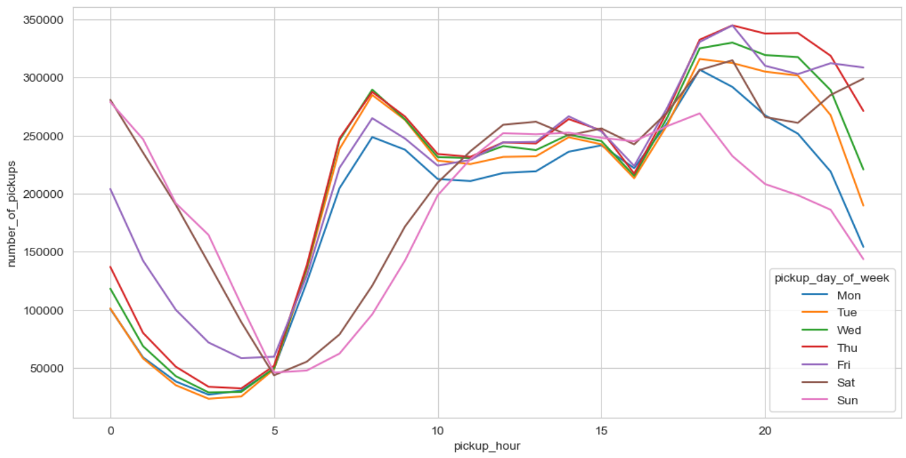
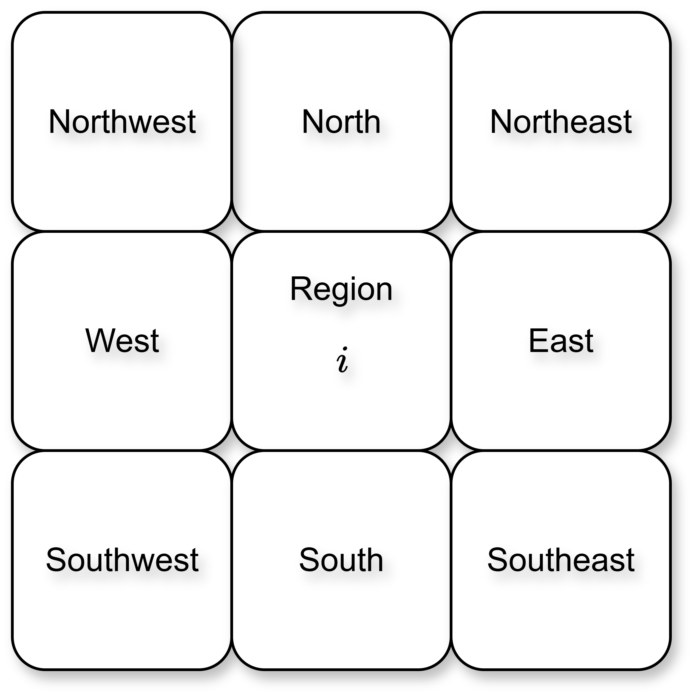
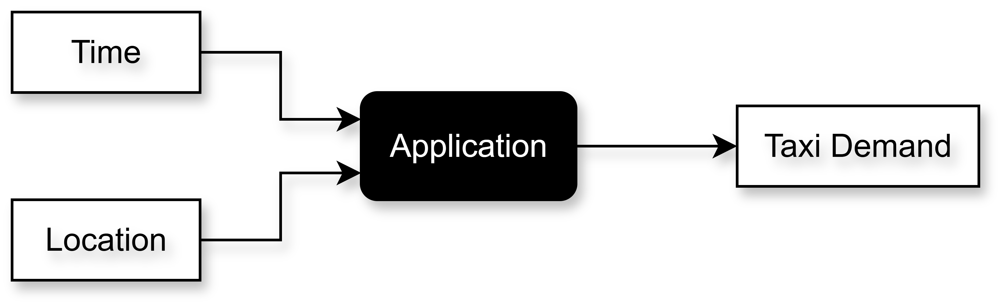

# Problem Statement

I will be working with the taxi data from the NYC Taxi & Limousine Commission. Each row of this data has information on a particular taxi booking. More information about this is given in the EDA notebook. I would like to predict the **demand** of taxis given a particular location (latitude and longitude pair) and a particular time. In other words, I am interested in predicting the number of people that would want to book a taxi at a particular location and at a particular time. A basic flowchart is shown in @fig-basic_model_flowchart.

{#fig-basic_model_flowchart fig-align="center" width=55% .invert}

For example, consider the location of the JFK airport and the time of 8:00 p.m. I want to build a system that if given these two inputs, i.e., JFK airport and 8:00 p.m., it will predict the number of pickups that will be required in the next time interval of say 15 minutes.

# Business Understanding

If such a system is built for a ride-sharing company, like Uber, how will it help them? Let us stick to the example of Uber. The drivers of Uber cabs are not Uber employees. Uber calls them "Driver Partners" as the vehicles are owned by them, not Uber. Whenever a ride is successful, Uber shares the revenue generated from the ride with its driver partners. These driver partners can use the Uber driving app whenever they want. They can also use apps from other ride-sharing companies.

Now, if a system is built that can increase driver earnings, it will lead to an increase in the profitability of Uber too. So, the system that I plan on building is for the drivers. This can be a smartphone app. Once any driver logs into this app, it can use the location and time information from their phone to predict the demand for cabs in that particular region and its surrounding regions (I have divided the NYC map into regions using clustering, more on this later) in the next time interval. This will help the driver navigate to the regions having higher demand, increasing the chances of getting a ride, and subsequently increasing their income.

## How It Impacts Business?

Consider that a ride-sharing company, like Uber, develops this app. As the drivers can now navigate to regions with higher predicted demand, they will be able to finish a greater number of rides in a day. This will indirectly also increase Uber's revenue. The drivers will also trust Uber more and would want to work with them due to this feature. As the drivers navigate to the regions with higher demand, price surges will be significantly reduced, leading to an increase in customer trust in Uber. Balancing the higher demand would also lead to shorter waiting times for both drivers and customers, leading to fewer ride cancellations. This will reduce the likelihood of the customer switching to other ride-sharing companies. So, this feature provides an advantage to Uber over its competitors.

# Data

The data is available on [Kaggle](https://www.kaggle.com/datasets/elemento/nyc-yellow-taxi-trip-data), which is almost identical to the original data freely available on the [NYC Taxi & Limousine Commission website](https://www.nyc.gov/site/tlc/about/tlc-trip-record-data.page). As this only has yellow taxi information, I will only work with these taxis. The data is for three months, from January to March 2016. @tbl-data_attributes shows information about the attributes in this data.

::: {.tbl tbl-colwidths="auto"}
| Field Name | Description |
|:----------:|:------------|
| `VendorID` | A code indicating the TPEP provider that provided the record. `1` = Creative Mobile Technologies; `2` = VeriFone Inc. |
| `tpep_pickup_datetime` | The date and time when the meter was engaged. |
| `tpep_dropoff_datetime` | The date and time when the meter was disengaged. |
| `Passenger_count` | The number of passengers in the vehicle (driver-entered value). |
| `Trip_distance` | The elapsed trip distance in miles reported by the taximeter. |
| `Pickup_longitude` | Longitude where the meter was engaged. |
| `Pickup_latitude` | Latitude where the meter was engaged. |
| `RateCodeID` | The final rate code in effect at the end of the trip. `1` = Standard rate; `2` = JFK; `3` = Newark; `4` = Nassau or Westchester; `5` = Negotiated fare; `6` = Group ride. |
| `Store_and_fwd_flag` | Indicates whether the trip record was stored in vehicle memory before transmission due to lack of connectivity. `Y` = store and forward trip; `N` = not a store and forward trip. |
| `Dropoff_longitude` | Longitude where the meter was disengaged. |
| `Dropoff_latitude` | Latitude where the meter was disengaged. |
| `Payment_type` | Numeric code indicating payment method. `1` = Credit card; `2` = Cash; `3` = No charge; `4` = Dispute; `5` = Unknown; `6` = Voided trip. |
| `Fare_amount` | The time-and-distance fare calculated by the meter. |
| `Extra` | Miscellaneous extras and surcharges, including rush hour and overnight charges. |
| `MTA_tax` | $0.50 MTA tax automatically triggered based on the metered rate. |
| `Improvement_surcharge` | $0.30 improvement surcharge assessed at flag drop (introduced in 2015). |
| `Tip_amount` | Tip amount (automatically populated for credit card tips; cash tips not included). |
| `Tolls_amount` | Total amount of all tolls paid during the trip. |
| `Total_amount` | Total amount charged to passengers (excluding cash tips). |

: Data Attributes. {#tbl-data_attributes style="width:100%; margin:auto;"}
:::

# Aim

As I have mentioned before, I aim to build a system that takes as input the location and time of the driver and predicts the cab demand, i.e., the number of pickups, in the corresponding and its neighboring regions in the next time interval. This is a machine learning regression problem. Each row in the data tells us information about a particular pickup.

## Dividing Map into Regions

As $\left(\text{latitude}, \text{longitude}\right) \in \mathbb{R}^{2}$, i.e., latitude and longitude both can take infinite possible real values, I cannot predict the demand for each ordered pair. I will have to divide the map into regions and predict the demand for this particular region and its neighboring regions in the next time interval.

## Forecasting

The demand would have certain patterns. For instance, the demand could depend on the time of the day, day of the week, etc. The demand would be higher on the weekday mornings in the residential regions, and weekday evenings in the regions having offices. Similarly, demand would be higher in the evenings of weekends in regions having clubs, restaurants, theaters, etc. So, there will be a time series plot of the number of pickups (i.e., number of pickups vs. time) for each region. So, for each region, the machine learning model has to forecast this demand in the next time interval using the historical demand. In other words, this is a forecasting problem.

Further, I also want to select an appropriate time interval. Forecasting the demand in the next 1 minute will not give the driver sufficient time to travel to the region with the highest demand. On the other hand, forecasting it in the next hour would be too long. A time interval of 15 minutes could be sufficient.

# Achieving the Aim

## Finding Regions to Divide the Map

After plotting the heatmap of the number of pickups on the latitude vs. longitude scatter plot, regions with higher and lower demand would clearly be visible. To do this division more systematically, I will use unsupervised machine learning methods, particularly clustering.

## Forecasting

For each region, I will use time series analysis to prepare the historical data to train the machine learning model.

## Evaluation

I will use the mean absolute percentage error (MAPE) to evaluate the model. Let $y_t$ denote ground truth at time $t$, and $\hat{y}_t$ denote the corresponding predicted value. Let there be a total of $n$ rows in the data (i.e., $n$ time points). Using this notation, MAPE is given by

$$
\mathrm{MAPE} = \frac{1}{n} \sum_{t = 1}^{n} \left|\frac{y_t - \hat{y}_t}{y_t}\right|\times 100\%
$$ {#eq-mape}

### Why MAPE?

Why am I going with MAPE and not an error metric like absolute error? Consider the scenario in @tbl-ae_vs_mape.

::: {.tbl tbl-colwidths="auto"}
| $y_t$ | $\hat{y}_t$ | Absolute error | MAPE |
|:----:|:-----------:|:--------------:|:----:|
| $100$ | $105$ | $5$ | $5\%$ |
| $10$ | $15$ | $5$ | $50\%$ |

: Absolute error vs. MAPE. {#tbl-ae_vs_mape style="width:50%; margin:auto;"}
:::

I have used @eq-mape to calculate the MAPE. Clearly, MAPE is a better metric for demand forecast/prediction. A demand prediction of $105$ against an actual demand of $100$ better by an order of magnitude as compared to a demand prediction of $15$ against an actual demand of $10$. According to absolute error, both these cases will have the same error. On the other hand, MAPE correctly recognizes the difference and penalizes such large error predictions.

# Project Flow

The expected project flow is the following:

- Exploratory data analysis (EDA):
  - The size of the data is too large for the memory to load it entirely at the same time. Hence, I will use [`Dask`](https://www.dask.org/) to divide the data into chunks to perform the EDA.
  - The main tasks that I want to investigate while performing EDA are the following:
    - Dividing NYC into regions,
    - Dividing the time axis into 15 minute intervals.
- Feature selection:
  - To forecast the demand, I do not need all the features in the data. I will only use the features that can predict the demand to train the model. I will identify these features while performing EDA. If required, I can again perform EDA after feature selection.
- Divide map into regions:
  - I will divide the NYC map into regions using unsupervised learning techniques, particularly clustering. I will use $k$-means clustering to break the NYC map into regions as this clustering technique also gives the centroids for each cluster. These centroids will uniquely distinguish regions which would help calculate the regions that are closer to the region in which the driver is currently present.
- Time series analysis:
  - I need historical time series data for the number of pickups in a particular region. I will use time series techniques to prepare the data for training.
- Training and evaluating the models.
- Tuning the hyperparameters of the best model to get the best performance.
- Using this final model, I will plot a graph in the app that shows the predicted demand given the location and time information. It will be a [Streamlit](https://streamlit.io/) app which takes in location and time interval. I will plot a graph for this particular location and time interval which will have NYC broken into regions and will have demand for each region.

# Using `Dask`

`Dask` is a Python package which helps in handling large datasets. It is good at handling out-of-memory data. For example, if the size of the data is 10 GB, whereas the memory (RAM) of the system is 8 GB, then the entire data cannot be loaded into the memory all at once. One way to solve this issue is to break the data into chunks, say of 512 MB each. This can be done using Pandas. However, operating on these chunks using Pandas is cumbersome as it is not designed to work with such operations. `Dask` solves this problem. As the taxi data is also huge, I will need to use `Dask`.

The two modules that I will be particularly using with my project are [`Dask DataFrame`](https://docs.dask.org/en/stable/dataframe.html) and [`Dask Array`](https://docs.dask.org/en/stable/array.html). `Dask DataFrame` is very similar to [`Pandas DataFrame`](https://pandas.pydata.org/docs/reference/api/pandas.DataFrame.html) and `Dask Array` is very similar to [`NumPy Array`](https://numpy.org/doc/stable/reference/generated/numpy.array.html). Hence, learning `Dask` is easy. The biggest advantage of `Dask` is that it handles all the chunking operations automatically. Further, it can parallelize operations on each CPU core, and then aggregate all these operations to give the final result.

## Working of `Dask`

`Dask` stores all the computations in a computation graph called **Task Graph**. Whenever we load a large dataset inside a `Dask DataFrame`, it won't actually be loaded in the memory. It will store its metadata, e.g., number of columns, data type of each column, arrangement of indices, etc. This metadata is what is displayed whenever the loaded dataframe is printed.

```python
import dask.dataframe as dd
data_path = "..."
df = dd.read_csv(data_path)
# This prints the metadata
```

Next, `Dask` divides `df` into chunks automatically. It will know how many chunks would be needed. This is saved in the variable `npartitions`. Say there are 10 partitions. Now, say I want to perform `value_counts` on a categorical column.

```python
df["column_name"].value_counts()
```

`Dask` performs this in the following way.

- First, the following code
  ```python
  df["column_name"]
  ```
  will be run on all the 10 chunks, giving this column from all the chunks.
- The `value_counts` method is applied on each individual chunks.
- Once `value_counts` is calculated on all the chunks, they are combined or aggregated, and it will return a `Series` (just like how `value_counts` returns a `Series` in `Pandas`).

As each chunk is performing the same sequential operation, each of these chunk operations can be parallelized. This reduces memory footprint. Note that more sequential operations can be added, like adding a `sum` over `value_counts`. So, many operations can be chained together. This will be reflected on the task graph.

## The `compute` Method

There is a special method in `Dask` called `compute`. Unless this method is called, the task graph is not executed. Once this method is called, all the chained operations are executed on all the chunks in parallel and without any out-of-memory problems.

## Things to Avoid

The `compute` method should not be run many times as it is computationally heavy. It is advisable to keep chaining the operations and updating the task graph till the desired output. Also, `Dask` strongly recommends using `Pandas` if the data can be loaded in memory. So, it is not advisable to use `Dask` just for the sake of it.

# EDA

The detailed EDA is done in [this Jupyter notebook](https://github.com/SushrutGaikwad/taxi-demand-prediction/blob/main/notebooks/01_EDA.ipynb).

## Important Columns

In EDA, I observed that all the date-time related columns are extremely important when it comes to predicting the number of pickups. This finding is best summarized in the plot shown in @fig-no_of_pickups_vs_pickup_hr.

{#fig-no_of_pickups_vs_pickup_hr fig-align="center" width=100% .invert}

Any other columns that are not relevant to demand prediction would be dropped.

## Outliers

I also observed that the location-based columns, distance-based columns, and fare had outliers with unreasonably huge values. These outliers may be connected with each other as the distance is calculated using the location columns, and the fare is calculated using the distance. I need to remove these outliers so that I can properly divide NYC into regions.

## Recollection of the Main Tasks

Recall that the tasks that I need to finish are:

- Break the NYC map into regions,
- Generate historical data for pickups for reach region in the map.

Let us do these tasks one by one.

# Breaking NYC Map into Regions

As mentioned earlier, I will break the NYC map into regions using $k$-means clustering. Some considerations before doing this are the following.

## Considerations

- The data has outliers, especially in the location-based columns. And these outliers are extreme. They are most likely erroneous values and need to be treated before forming the regions.
- The average time for traveling 1 mile in NYC is around 10-15 minutes during peak hours. I do not want the driver to travel a lot when they want to migrate to a region with higher demand. So, I want to divide the regions in such a way that the proximity of the neighboring regions to the region where the driver currently is, is around 1 mile. More specifically, the center of the driver's region is about 1 mile away from the centers of the neighboring regions. This will make sure that the driver is able to travel to one of the neighboring regions with higher demand within the 15 minute time interval (as the demand prediction will be for the next 15 minute time interval). At the same time, I also do not want to divide the map into too many regions. So, the number of regions should be optimum.

### Number of Neighboring Regions

As there are $8$ directions: north, northeast, east, southeast, south, southwest, west, and northwest, I will divide the map into regions in such a way that the distance of each region from its nearest $8$ neighbors is around $1$ to $1.5$ miles. @fig-8_neighbors shows a visualization of these $8$ neighbors for a region $i$.

{#fig-8_neighbors fig-align="center" width=40% .invert}

## Plan of Attack

I will solve this task by breaking it down into the following two parts: removing the outliers, and using $k$-means clustering.

### Removing Outliers

As mentioned earlier, outliers are in the location-based columns (4 columns), the distance-based column, and the fare column. And these outliers are most probably related to each other as distance is calculated using the location, and fare is calculated using the distance. As I do not have the exact coordinate values to fill these in, I will simply remove these outliers. This is allowed as there are very few of these outlier observations in the data. Techniques like capping won't work because doing that will concentrate the outliers on the edge of the map, which is wrong.

After removing the outliers, I will consider only the pickup columns. These will be two columns that correspond to pickup latitude and pickup longitude. So, each row will correspond to a pickup point on the NYC map. Hence, these two pickup columns will be used to form the regions by using $k$-means clustering. I will save this dataset.

### Using $k$-Means Clustering

Using $k$-means clustering (using some reasonable value of $k$), I will form clusters. In other words, this will divide the NYC map into regions. However, there are some problems here:

- I will need to find the optimal value of $k$.
- The dataset is huge. As this algorithm finds the distance of each point from every other point, using this algorithm in its vanilla form will be extremely computationally heavy.

To solve the second problem, I will use a variant of $k$-means clustering called the mini-batch $k$-means clustering. This algorithm does not compute the pairwise distance between all points, but only a random batch of points. Hence, this is a lot more computationally fast as compared to the vanilla $k$-means clustering, with a slight hit on the accuracy. The centroids that this algorithm will return will become the region centers.

Now, this algorithm cannot be implemented using `Dask`. Hence, I will use `Pandas` by using its `chunksize` parameter. After this, I will implement mini-batch $k$-means clustering by using the `partial_fit` method on each chunk. This method iterates over each chunk, and the model is trained partially and sequentially on all the chunks one by one. Once this is done, we will get the final trained model that will give the centroids (region centers). All the points that are closest to a particular region center will belong to that region.

Now, how to decide the value of $k$? Recall that I want the regions to be such that the distance between a particular region and its immediate neighbors should be around 1 mile. For this, I will loop through different values of $k$. Obviously, I will get $k$ centroids (or regions) for each value of $k$. I will select the value of $k$ for which the distance of each centroid from all its neighboring centroids is about 1 mile. More precisely, I will do the following:

- I will iterate over the values of $k$. Say, during a particular iteration, $k=10$.
  - I will get $10$ centroids, i.e., $10$ regions.
  - I will create a distance matrix of these $10$ regions. This will be a $10\times 10$ matrix which contains the distance of each region from all the other regions. Note that the $i$-th row of this matrix gives the distance of the $i$-th region from all the other regions. So, we can immediately see that the diagonal elements of this matrix will be all $0$'s as the distance of each region from itself is $0$.
  - Next, I will sort all the rows of this matrix in ascending order. This gives the distance of each region $i$ from all the other regions in ascending order.
  - For each row, I will calculate the average of the $8$ elements in this row from element $2$ to element $9$ (not element $1$ to element $8$ because element $1$ will always be zero). I will do this for each row. I am considering the length of this window over which I am taking the average as $8$ because each region has $8$ neighbors.
  - If this average is between $1$ and $1.5$ miles, I will flag the region to be a good region.

I will select that value of $k$ for which I get the maximum number of good regions.

## Jupyter Notebooks

- Removing outliers: I have removed the outliers in [this Jupyter notebook](https://github.com/SushrutGaikwad/taxi-demand-prediction/blob/main/notebooks/02_removing_outliers.ipynb).
- Breaking NYC map into regions: The best value of $k$ I got was $30$. So, I divided the NYC map into $30$ regions in [this Jupyter notebook](https://github.com/SushrutGaikwad/taxi-demand-prediction/blob/main/notebooks/03_breaking_NYC_into_regions.ipynb).

# Generating Historical Data

Recall that each row in the data is one particular pickup. Using this, I will now generate historical data for each of the 30 regions. For every region, I will break the time axis into 15-minute intervals and calculate the number of pickups in each of these intervals. In other words, I will bin the time axis into 15-minute intervals and count the number of pickups that occurred in these intervals. This will generate time series data of the number of pickups for each region.

## Smoothing

Once the time series data is formed, we will also need to apply smoothing on it. This is because the number of pickups can fluctuate a lot in certain time intervals, which makes identifying the trend difficult. This will in turn make it difficult to predict the number of pickups in the next time interval with high accuracy. Smoothing the number of pickups will help smooth out these fluctuations. I will try two smoothing techniques: Moving average, and exponentially weighted moving average.

### Moving Average

In moving average (MA), a window size is picked. For instance, if the data has a daily temporal frequency, a window size of 3 days can be picked. @tbl-moving_avg illustrates this.

::: {.tbl tbl-colwidths="auto"}
| Day | Temperature (°C) | 3-Day MA (°C) |
|:---:|:----------------:|:-------------:|
| 1 | 20.0 | – |
| 2 | 22.5 | – |
| 3 | 21.0 | 21.17 |
| 4 | 23.0 | 22.17 |
| 5 | 24.5 | 22.83 |
| 6 | 25.0 | 24.17 |
| 7 | 23.5 | 24.33 |
| 8 | 22.0 | 23.50 |
| 9 | 21.5 | 22.33 |
| 10 | 20.0 | 21.17 |

: Daily temperature and its 3-day moving average. {#tbl-moving_avg style="width:60%; margin:auto;"}
:::

Clearly, the 3-day MA for the first two days cannot be calculated. Hence, these values will be missing. The MA is a smoother version of the original temperature. The larger the window size, the smoother the MA. This is because the larger window size means that the average is calculated over a larger number of points. Say, the window size is $w$. The MA of a variable $x$ at time $t$ is given by

$$
x_{t}^{(\text{MA})} =
\begin{cases}
    \dfrac{x_t + x_{t-1} + x_{t - 2} + \cdots + x_{t-(w-1)}}{w}, & \text{if }t \geq w,\\
    \text{None}, & \text{otherwise}.
\end{cases}
$$ {#eq-ma}

### Exponentially Weighted Moving Average

MA and exponentially weighted moving average (EWMA) differ in the following way. MA gives equal importance to all the observations, irrespective of how long in the past they appeared. So, recent observations and observations in the distant past are both given equal importance by MA. This is obvious because this is what a normal average function does. To see this, notice that we can write the first part of @eq-ma in the following way:

$$
\begin{align*}
    x_{t}^{(\text{MA})} &= \frac{x_t + x_{t-1} + x_{t - 2} + \cdots + x_{t-(w-1)}}{w}\\
    &= \left(\frac{1}{w}\right) x_t + \left(\frac{1}{w}\right) x_{t-1} + \cdots + \left(\frac{1}{w}\right) x_{t-(w-1)}
\end{align*}
$$

So, each observation gets an equal weight of $\frac{1}{w}$. However, this is not a very good idea. The recent observations should be given more weight as compared to the observations in the distant past. This issue is addressed by EWMA. Instead of finding the usual average, it finds the weighted average. It gives recent observations more weight as compared to the observations in the distant past. And this weight decays exponentially as the observations go further into the past. For example, if the weight decay at time $t-1$ is by the factor $d$ (where $d < 1$), then the weight decay at time $t-2$ the decay factor is $d^2$, at time $t-3$ the decay factor is $d^3$, and so on.

The EWMA of a variable $x$ at time $t$ is given by

$$
s_t = \alpha x_t + (1-\alpha)  s_{t-1},
$$

where $s_{t-1}$ is the EWMA of $x$ at time $t-1$, and $0\leq \alpha \leq 1$. So, this is like a recursion. Writing this equation by recursively substituting, we get

$$
\begin{align*}
    s_t &= \alpha x_t + (1-\alpha) s_{t-1}\\
    &= \alpha x_t + \alpha(1-\alpha)x_{t-1} + (1 - \alpha)^2 s_{t-2}\\
    &\vdots
\end{align*}
$$

Doing this all the way till $t=0$, we get

$$
s_t = \alpha \left[x_t + (1-\alpha) x_{t-1} + (1-\alpha)^2 x_{t-2} + \cdots + (1-\alpha)^{t-1} x_{1}\right] + (1-\alpha)^t x_0.
$$ {#eq-ewma}

I will rewrite this equation to visualize the weights easily.

$$
s_t = [\alpha] x_t + [\alpha (1-\alpha)]x_{t-1} + \left[\alpha(1-\alpha)^2\right]x_{t-2} + \cdots + \left[\alpha(1-\alpha)^{t-1}\right]x_{1} + [1-\alpha]^{t} x_0.
$$ {#eq-ewma2}

The weights are inside $[\:]$. Clearly, the weights are decaying exponentially. Further, it is also clear that a higher $\alpha$ (i.e., $\alpha \approx 1$) gives more weight to the current observation and less weight to the observations in the distant past, and vice versa. This means that a lower $\alpha$ (i.e., $\alpha \approx 0$) means higher smoothing, and vice versa. @tbl-ewma extends @tbl-moving_avg by including EWMA for $\alpha = 0.9$ and $\alpha = 0.5$.

::: {.tbl tbl-colwidths="auto"}
| Day | $T$ (°C) | 3-Day MA | EWMA ($\alpha = 0.9$) | EWMA ($\alpha = 0.5$) |
|:---:|:--------:|:--------:|:--------------------:|:--------------------:|
| 1 | 20.0 | – | 20.00 | 20.00 |
| 2 | 22.5 | – | 22.25 | 21.25 |
| 3 | 21.0 | 21.17 | 21.13 | 21.12 |
| 4 | 23.0 | 22.17 | 22.81 | 22.06 |
| 5 | 24.5 | 22.83 | 24.33 | 23.28 |
| 6 | 25.0 | 24.17 | 24.95 | 24.14 |
| 7 | 23.5 | 24.33 | 23.65 | 23.82 |
| 8 | 22.0 | 23.50 | 22.14 | 22.91 |
| 9 | 21.5 | 22.33 | 21.56 | 22.21 |
| 10 | 20.0 | 21.17 | 20.16 | 21.11 |

: Daily temperature, its 3-day moving average, and EWMA for $\alpha = 0.9$ and $\alpha = 0.5$. {#tbl-ewma style="width:90%; margin:auto;"}
:::

## Jupyter Notebook

I have generated historical data and implemented smoothing in [this Jupyter notebook](https://github.com/SushrutGaikwad/taxi-demand-prediction/blob/main/notebooks/04_generating_historical_data.ipynb). For smoothing, I used EWMA with $\alpha=0.4$. In other words, the final data now has two columns indicating demand, one which has the number of pickups in that time interval, and the second has the average number of pickups calculated in the corresponding time interval using EWMA with $\alpha=0.4$.

Now the reason I used $\alpha = 0.4$ is the following. If we are asked to find the EWMA for the last $n$ time steps, the $\alpha$ to be used is given by

$$
\alpha = \frac{2}{n+1}.
$$

I will be using $4$ lag features during training (discussed more about this in the next section). Putting this in the above equation, we get

$$
\alpha = \frac{2}{4+1} = \frac{2}{5} = 0.4.
$$

Not using this formula to find $\alpha$ would result in the following problem. If I choose $\alpha = 0.9$, it means that the EWMA value takes into consideration that was way back in the past. However, since I will only consider 4 lag features, EWMA value with $\alpha = 0.9$ would lead to data leakage.

# Training a Baseline Model

I will now train a baseline model on the data, which will be a linear regression model. Our final data after the last step has four columns: `tpep_pickup_datetime`, `region`, `total_pickups`, and `avg_pickups`. The target column is `total_pickups` which we want to predict given a region and a time interval.

I will now add four more features (columns) to this data, which will be the lag features. These four lag features will have information about the true demand for the previous four time intervals. In other words, the model will predict the demand at a time $t$ given the demands in time intervals $t-1$, $t-2$, $t-3$, and $t-4$. So, if the aim is to predict the demand in the time interval of 8:00 p.m. to 8:15 p.m. ($t$), the model will need the actual demand in the time intervals 7:45 p.m. to 8:00 p.m. ($t-1$), 7:30 p.m. to 7:45 p.m. ($t-2$), 7:15 p.m. to 7:30 p.m. ($t-3$), and 7:00 p.m. to 7:15 p.m. ($t-4$). In other words, the model is using the true demand in the previous 1 hour to predict the demand in the next time interval.

## Train-Test Split

As this is time series data, the train-test split cannot be random. @tbl-train_data shows how the data will look like.

::: {.tbl tbl-colwidths="auto"}
| $\boldsymbol{d_{t-4}}$ | $\boldsymbol{d_{t-3}}$ | $\boldsymbol{d_{t-2}}$ | $\boldsymbol{d_{t-1}}$ | $\boldsymbol{d_t}$ | **Region** | **Avg. pickups** | **Day of week** |
|:---------------------:|:---------------------:|:---------------------:|:---------------------:|:----------------:|:----------:|:---------------:|:---------------:|
| $\cdots$ | $\cdots$ | $\cdots$ | $\cdots$ | $\cdots$ | $\cdots$ | $\cdots$ | $\cdots$ |
| $\vdots$ | $\vdots$ | $\vdots$ | $\vdots$ | $\vdots$ | $\vdots$ | $\vdots$ | $\vdots$ |
| $\cdots$ | $\cdots$ | $\cdots$ | $\cdots$ | $\cdots$ | $\cdots$ | $\cdots$ | $\cdots$ |

: Structure of the training data. {#tbl-train_data style="width:100%; margin:auto;"}
:::

In this table, $d_t$ represents the demand (i.e., number of pickups) at time $t$. Note that I have included the feature for the day of the week because I found during EDA that this is the most important feature that affects demand. Now, to train-test split a time series data, the split has to be done taking into consideration the time axis. The data I have is for three months: January 2016, February 2016, and March 2016. I will use the data of the first two months for training, and the last month for validation.

## Jupyter Notebook

I have trained the baseline model (linear regression) in [this Jupyter notebook](https://github.com/SushrutGaikwad/taxi-demand-prediction/blob/main/notebooks/05_training_baseline_model.ipynb). The training and test MAPEs are 8.78% and 7.93% respectively.

# Model Selection & Hyperparameter Tuning

I will carry out Bayesian optimization using [Optuna](https://optuna.org/). Using this framework, I will train multiple models on the training data and evaluate them on the test data. Further, I will also tune the hyperparameters of these models using the same framework. As usual, I will select the model and its hyperparameter configuration that gives the lowest MAPE on the test data.

## Experiment Tracking

A particular hyperparameter configuration of a model is an experiment. I will track all these experiments, for multiple models, on [MLFlow](https://mlflow.org/) whose remote server will be set on [DagsHub](https://dagshub.com/). Once I find the best model, I will register it on the [MLFlow model registry](https://mlflow.org/docs/latest/model-registry/).

## Jupyter Notebook

[This is the Jupyter notebook](https://github.com/SushrutGaikwad/taxi-demand-prediction/blob/main/notebooks/06_model_selection_hyp_tuning.ipynb) in which I have implemented model selection and hyperparameter tuning. The best performing model is linear regression with a test MAPE of about 7.93%.

# Building the DVC Pipeline

I will now build a [DVC](https://dvc.org/) pipeline that will carry out all the steps that I have been carrying out in Jupyter notebooks till now. I will also track the data and model artifacts using DVC. @fig-pipeline_flowchart shows a flowchart of all the steps that I have taken.

{#fig-pipeline_flowchart fig-align="center" width=100% .invert}

## Detailed Steps in the Pipeline

The steps are the following:

1. Concatenate the January 2016, February 2016, and March 2016 data.
2. Remove the outliers from the location, fare, and distance columns.
3. Drop unnecessary columns.
4. Save and version control this data (without outliers and unnecessary columns) using DVC.
5. Forming regions:
    1. Using the pickup latitude and pickup longitude columns, create a location subset.
    2. First train a [`StandardScaler`](https://scikit-learn.org/stable/modules/generated/sklearn.preprocessing.StandardScaler.html) object on the data, and then using the scaled data train a [`MiniBatchKMeans`](https://scikit-learn.org/stable/modules/generated/sklearn.cluster.MiniBatchKMeans.html) object on this data.
    3. Save and version control both these objects using DVC.
    4. Add the region information to the data using the `MiniBatchKMeans` object.
6. Dividing the time axis of the regions into 15-minute intervals:
    1. Resample the data to have a 15-minute temporal resolution by using the `count` aggregation. Do this for each region by grouping.
    2. Calculate the average pickup for each time interval for each region using EWMA.
    3. Add four lag features corresponding to $t-1$, $t-2$, $t-3$, and $t-4$; and add a feature corresponding to day of week.
    4. Split the data into training and test sets such that the training data consists of the months January and February, and the test data consists of the month March.
    5. Save and version control these datasets using DVC.
    6. Train the linear regression model with the best hyperparameters on the training set and evaluate on the test set.
    7. Save and version control the encoder and model objects using DVC.
    8. Log the model, its parameters, and metrics using MLFlow.
    9. Register the model on MLFlow and update the model stage to staging/development.

I have implemented all these steps in the following Python modules:

- [`data_ingestion.py`](https://github.com/SushrutGaikwad/taxi-demand-prediction/blob/main/taxi_demand_prediction/data_ingestion.py): Steps given in pointers 1 to 4 are implemented in this module.
- [`extract_features.py`](https://github.com/SushrutGaikwad/taxi-demand-prediction/blob/main/taxi_demand_prediction/extract_features.py): The steps corresponding to clustering and resampling are implemented in this module.
- [`feature_engineering.py`](https://github.com/SushrutGaikwad/taxi-demand-prediction/blob/main/taxi_demand_prediction/feature_engineering.py): The steps corresponding to engineering lag and datetime features, and train-test split are implemented in this module.
- [`model_training.py`](https://github.com/SushrutGaikwad/taxi-demand-prediction/blob/main/taxi_demand_prediction/model_training.py): The steps corresponding to encoding and linear regression training are implemented in this module.
- [`model_evaluation.py`](https://github.com/SushrutGaikwad/taxi-demand-prediction/blob/main/taxi_demand_prediction/model_evaluation.py): The steps corresponding to logging the parameters, metrics, datasets, and model to MLFlow, and saving the run information are implemented in this module.
- [`model_registration.py`](https://github.com/SushrutGaikwad/taxi-demand-prediction/blob/main/taxi_demand_prediction/model_registration.py): The steps corresponding to registering and transitioning the stage of the model are implemented in this module.

I have connected all these modules appropriately using a DVC pipeline. This is done using a [`dvc.yaml`](https://github.com/SushrutGaikwad/taxi-demand-prediction/blob/main/dvc.yaml) file.

## DVC Remote

I have set an Amazon S3 bucket as the DVC remote to save and version control the data, model, and all the artifacts.

# Building the Streamlit Application

I will now build a Streamlit app that takes the time and location information as input and predicts the taxi demand. This is nothing but what @fig-basic_model_flowchart illustrated. @fig-application_flow shows this figure again, just in the context of an app.

{#fig-application_flow fig-align="center" width=55% .invert}

Recall that I am building this app for drivers. So, this can be a mobile phone app that can take in the time and location information very easily. However, for this project, I will manually input both this information. Once the app has this information, a map will be displayed that will show the demand (color-coded) in different regions of NYC in the next time interval. Seeing this, the driver will be able to make an informed decision about which region to navigate to so that they can get customers more easily.

## Plotting Regions on a Map

To plot regions on a map, I will select a random sample of $500$ observations from each of the $30$ regions. So, the total samples will have $500\times 30 = 15000$ observations. I will use my trained `MiniBatchKMeans` object to cluster these observations and use them to indicate regions on the map. I will not use this sample for any other purpose.

## Predictions

As mentioned earlier, the test data is from March 2016. I will take the date and time (interval) input from the user, making sure that the input is from March 2016 only. Using this input, I will filter and consider only those observations from the test data that correspond to this particular input.

For instance, if the date input is March 20th 2016 and the time input is 4:11 p.m., I will first convert the time to an interval, which will be the 4:00 p.m. to 4:15 p.m. interval. Next, I will consider only those observations from the test data that correspond to the date of March 20th 2016 and the time interval of 4:00 p.m. to 4:15 p.m. This will give data with $30$ rows as there are $30$ clusters, and there will be observations in each of these $30$ clusters that correspond to this input. The columns in this data will be the same as indicated in @tbl-train_data. Notice that this data will also contain the target column $d_t$. I will remove this target which will give me the input data with $30$ rows that I can give to the model for predictions after standardizing it using the trained `StandardScaler` object. This will give me $30$ predictions which will be the predicted demand in the next time interval for all the $30$ regions. I will show these predictions to the driver on a map using color-coding.

### Predictions for Only Neighboring Regions

NYC is a huge city. The driver definitely won't be able to travel to each region with a higher demand. So, I will also include this feature in the app that the driver can, if they choose to, only view the demand for the regions that are neighboring to the region that they are in.

I will implement this in the following way. Using the current latitude and longitude coordinates (for now, I will randomly select a latitude and longitude pair to mimic this behavior) of the driver, I will find the distance of the driver from each of the centroids (i.e., the regions) found by the trained `MiniBatchKMeans` object. The region with the shortest distance is the region the driver currently is in, and the next $8$ regions with the shortest distances are the neighbors. I will predict the demand only in these $9$ regions and plot only those on the map. However, if for some reason the current coordinates of the driver are unavailable, I will forecast and show the demand for all the 30 regions.

## Code

- I have created the data for plotting in [this Jupyter notebook](https://github.com/SushrutGaikwad/taxi-demand-prediction/blob/main/notebooks/07_plot_map.ipynb).
- [`app.py`](https://github.com/SushrutGaikwad/taxi-demand-prediction/blob/main/app.py): This module contains the code for the Streamlit app.

# Continuous Integration

I will perform some tests in the continuous integration (CI) workflow.

## Tests

I will perform the following two tests:

- **Model Loading**: This will test whether the model is loading properly from the MLFlow model registry. I implemented this test in the [`test_model_registry.py`](https://github.com/SushrutGaikwad/taxi-demand-prediction/blob/main/tests/test_model_registry.py) module.
- **Model Performance**: This will test whether the model is performing better than the threshold of 10% MAPE on the training as well as the test data. In other words, the model should have an MAPE value of $\leq 0.1$. I implemented this test in the [`test_model_performance.py`](https://github.com/SushrutGaikwad/taxi-demand-prediction/blob/main/tests/test_model_performance.py) module.

I hav written these tests using the [`pytest`](https://docs.pytest.org/en/stable/) library. Once the model passes both these tests, I will promote it to the production stage. Note that before these tests are done, the model is in the staging (or development) stage. I have integrated the tests and the code to promote the model to production in the CI pipeline using GitHub Actions. I added this CI workflow in the [`ci_cd.yaml`](https://github.com/SushrutGaikwad/taxi-demand-prediction/blob/main/.github/workflows/ci_cd.yaml) file.

# Continuous Delivery

In the continuous delivery (CD) workflow, I will containerize the Streamlit app using [Docker](https://www.docker.com/) and create an image. After this, I will push this image to the [Amazon Elastic Container Registry (ECR)](https://aws.amazon.com/ecr/). I will also update my `app.py` module to use the model in production. Earlier, I was using the locally saved model. [Here is the `Dockerfile`](https://github.com/SushrutGaikwad/taxi-demand-prediction/blob/main/Dockerfile) I wrote for creating the image. I also updated my `ci_cd.yaml` by adding the CD workflow.

# Deployment

I will deploy the image of my Streamlit app which is on ECR on an auto-scaling group of EC2 instances using [Amazon CodeDeploy](https://aws.amazon.com/codedeploy/). For the auto-scaling group, I will consider the minimum capacity as 1, desired capacity as 2, and the maximum capacity also as 2. So, I will use a total of 2 EC2 instances, and a load balancer which will balance the traffic on these two instances smartly and automatically. In other words, the auto-scaling group of these 2 EC2 instances will be the target group of the load balancer.

Once this is done, I will build an app on the CodeDeploy service. I will set the deployment group as the same auto-scaling group. I will also create a launch template for the auto-scaling group, which is basically a template or a set of rules based on which a new EC2 instance starts. I will mention in this launch template that whenever a new EC2 instance starts, it should have the CodeDeploy agent installed. It is this agent that connects the EC2 instance with the CodeDeploy service. I will create a `appspec.yaml` file which has instructions that tells the CodeDeploy service how to do the deployment. This file will also contain hooks, which are the stages of deployment. Any custom commands/scripts can be run on any of these stages. Using this, I will install Docker and AWS CLI on each EC2 instance, and pull the image of the Streamlit app which is on the ECR repository onto each of these instances. Once this is done, I will run the container on these instances. I will also define different roles and attach various policies to them so that all these services are able to properly communicate with each other.

## Roles

### EC2 CodeDeploy Role

This role is defined for the EC2 service. This role will allow EC2 instances to call AWS services on my behalf. The policies attached to this role are the following:

- [AmazonEC2ContainerRegistryReadOnly](https://docs.aws.amazon.com/aws-managed-policy/latest/reference/AmazonEC2ContainerRegistryReadOnly.html):
  - This policy provides read-only access to Amazon EC2 Container Registry repositories.
- [AmazonEC2RoleForAWSCodeDeploy](https://docs.aws.amazon.com/aws-managed-policy/latest/reference/AmazonEC2RoleforAWSCodeDeploy.html):
  - This policy provides EC2 access to S3 bucket to download revision. This role is needed by the CodeDeploy agent on EC2 instances.
- [AmazonS3ReadOnlyAccess](https://docs.aws.amazon.com/aws-managed-policy/latest/reference/AmazonS3ReadOnlyAccess.html):
  - This policy provides read only access to all buckets via the AWS Management Console.


### CodeDeploy Service Role

This role is defined for the CodeDeploy service. This role will allow CodeDeploy to call AWS services, such as Auto Scaling, on my behalf. The policy attached to this role is the following:

- [AWSCodeDeployRole](https://docs.aws.amazon.com/aws-managed-policy/latest/reference/AWSCodeDeployRole.html):
  - This policy provides CodeDeploy service access to expand tags and interact with Auto Scaling on my behalf.


## Launch Template for the Auto Scaling Group

I want the CodeDeploy agent to be installed on each EC2 instance that starts. I will use a launch template to make sure this happens.

```bash
#!/bin/bash

# Update packages
sudo apt update -y

# Install ruby required for CodeDeploy
sudo apt install ruby-full -y

# Get additional packages
sudo apt install wget -y
cd /home/ubuntu

# Import the agent
wget https://aws-codedeploy-us-east-2.s3.us-east-2.amazonaws.com/latest/install

# Install the agent
chmod +x ./install
sudo ./install auto

# Run the agent
sudo systemctl start codedeploy-agent
```

## Auto Scaling Group

I will now create an auto scaling group that will automatically scale the EC2 instances depending on the traffic. I will also attach an internet-facing application load balancer to this group. As mentioned earlier, I will set the desired capacity to 2, minimum desired capacity to 1, and the maximum desired capacity to 2. This will be done using a target tracking scaling policy with the metric being the average CPU utilization with the target value being 70. So, whenever the average CPU utilization exceeds 70, a new EC2 instance will start.
