# Project Planning

## Problem Statement

### Business Context

Consider that we are an influencer management company seeking to expand our network by attracting more influencers to join our platform. Due to a limited marketing budget, traditional advertising channels are not viable for us. To overcome this, we aim to offer a solution that addresses a significant pain point for influencers, thereby encouraging them to engage with our company.

### Business Problem

#### Need to Attract More Influencers


- Objective:
    - Increase our influencer clientele to enhance our service offerings to brands and stay competitive.
- Challenge:
    - Limited marketing budget restricts our ability to reach and engage potential influencer clients through conventional means.

#### Identifying Influencer Pain Point

- Understanding Influencer Challenges:
    - To effectively attract influencers, we need to understand and address the key challenges they face.
- Research Insight:
    - Influencers, especially those with large followings, struggle with managing and interpreting the vast amount of feedback they receive via comments on their content.

#### Big Influencers Face Issues with Comments Analysis

- Volume of Comments:
    - High-profile influencers receive thousands of comments on their videos, making manual analysis impractical.
- Time Constraints:
    - Influencers often lack the time to sift through comments to extract meaningful insights.
- Impact on Content Strategy:
    - Without efficient comment analysis, influencers miss opportunities to understand audience sentiment, address concerns, and tailor their content effectively.

## Our Solution

To directly address the significant pain point faced by big influencers—managing and interpreting vast amounts of comments data—we present the "Influencer Insights" Chrome extension. This tool is designed to empower influencers by providing in-depth analysis of their YouTube video comments, helping them make data-driven decisions to enhance their content and engagement strategies.

### Key Features of the Extension

#### Sentiment Analysis of Comments

- Real-Time Sentiment Classification:
    - The extension performs real-time analysis of all comments on a YouTube video, classifying each as positive, neutral, or negative.
- Sentiment Distribution Visualization:
    - Displays the overall sentiment distribution with intuitive graphs or charts (e.g., pie charts or bar graphs showing percentages like 70% positive, 20% neutral, 10% negative).
- Detailed Sentiment Insights:
    - Allows users to drill down into each sentiment category to read specific comments classified under it.
- Trend Tracking:
    - Monitors how sentiment changes over time, helping influencers identify how different content affects audience perception.

#### Additional Comments Analysis Features

- Word Cloud Visualization:
    - Generates a word cloud showcasing the most frequently used words and phrases in the comments.
    - Helps quickly identify trending topics, keywords, or recurring themes.
- Average Comment Length:
    - Calculates and displays the average length of comments, indicating the depth of audience engagement.
- Export Data Functionality:
    - Enables users to export analysis reports and visualizations in various formats (e.g., PDF, CSV) for further use or sharing with team members.

## Challenges

### Data

The first problem any data science project faces is about the data. There are various problems that we can face in this project. Some are as follows.

#### Availability

The problem we are solving is a supervised machine learning problem. So, we need a supervised dataset such that we have the comment and its associated label, i.e., whether the sentiment of the comment is positive, negative, or neutral. Obviously, finding this data is a challenge. One option is to use the [YouTube Data API](https://developers.google.com/youtube/v3/docs/comments), but this will only get us the comments and not the associated labels. There is no readily available data for YouTube comments with their associated sentiment label. So, we will be using the Reddit data from [Kaggle](https://www.kaggle.com/datasets/cosmos98/twitter-and-reddit-sentimental-analysis-dataset). This Kaggle dataset also contains Twitter data which we won't use because during EDA I discovered that it is highly political. On the other hand, Reddit data is comparatively less political. Hence, a model trained on the Reddit data will be able to generalize better.

#### Lack of General Kind of Dataset

We cannot get a universal dataset that is representative of all types of content on YouTube. This means that our model won't generalize well on all types of YouTube videos.

#### Multi-Language Comments

YouTube comments can have many languages, and the prevalence of these languages is also varying. Some comments have multiple languages too. Further, some comments use English script for typing other languages, e.g., using English to type Hindi words. So, it is quite difficult to train a model for all languages.

#### Spam and Bot Comments

Identifying and removing such meaningless comments from training the model is difficult. Such comments can bias the model and worsen its accuracy.

#### Slang, Emoji, and Informal Comments

Understanding the sentiment of such comments is a challenge.

#### Sarcastic Comments

It is easy for humans to understand sarcastic comments because they already know the context. However, the same is very difficult for a model to learn. Hence, such comments are also a problem during training.

#### Evolving Language Usage

Language evolves with each generation. There are many terms that were introduced by Generation Z (Gen-Z) that were not used before. So, comments by Gen-Z users will be different from users from other generations. This is also known as data drift. Modeling this behavior is difficult.

#### Privacy and Data Compliance

If you build a model using some data, you are always answerable to a company using your model. So, the source of the data is crucial.

### Building an Efficient Model

We can already see that building an efficient model, due to the considerations indicated in the previous subsection, is already challenging. On top of that, noise, variability, class imbalance, etc., can make it even more difficult to train an efficient model.

### Latency

Whenever someone opens a YouTube video, we want the extension to give results quickly. In other words, we want the latency of the model to be low. This again is a challenge given the complexity of the problem. We definitely would need to implement asynchronous programming.

### User Experience

We would need to make sure that the user experience is good. If it is bad, users will definitely avoid using the extension. Hence, we will need to design it accordingly.

## Workflow

The steps in the workflow of this project are:

1. Data collection,
2. Data preprocessing,
3. EDA,
4. Model building, hyperparameter tuning and evaluation alongside experiment tracking,
5. Building a DVC pipeline,
6. Registering the model,
7. Building the API using Flask,
8. Developing the Chrome extension,
9. Setting up CI/CD pipeline,
10. Testing,
11. Building the Docker image and pushing to ECR,
12. Deployment using AWS.

## Tools and Technologies

We will use the following tools and technologies in this project.

### Version Control and Collaboration

#### Git

- Purpose:
    - Distributed version control system for tracking changes in source code.
- Usage:
    - Manage codebase, track changes, and collaborate with team members.


#### GitHub

- Purpose:
    - Hosting service for Git repositories with collaboration features.
- Usage:
    - Store repositories, manage issues, pull requests, and facilitate team collaboration.

### Data Management and Versioning

#### DVC (Data Version Control)

- Purpose:
    - Version control system for tracking large datasets and machine learning models.
- Usage:
    - Version datasets and machine learning pipelines, enabling reproducibility and collaboration.

#### AWS S3 (Simple Storage Service)

- Purpose:
    - Scalable cloud storage service.
- Usage:
    - Store datasets, pre-processed data, and model artifacts tracked by DVC.

### Machine Learning and Experiment Tracking

#### Python

- Purpose:
    - Programming language for backend development and machine learning.

#### Machine Learning Libraries

- scikit-learn:
    - Purpose: Library for classical machine learning algorithms.
    - Usage: Implement baseline models and preprocessing techniques.

#### NLP Libraries

- NLTK (Natural Language Toolkit)
    - Purpose: Platform for building Python programs to work with human language data.
    - Usage: Tokenization, stemming, and other basic NLP tasks.
- spaCy:
    - Purpose: Industrial-strength NLP library.
    - Usage: Advanced NLP tasks like named entity recognition, part-of-speech tagging.

#### MLFlow

- Purpose:
    - Platform for managing the ML lifecycle, including experimentation, reproducibility, deployment, and a central model registry.
- Usage:
    - Track experiments, log parameters, metrics, and artifacts; manage model versions.

#### MLFlow Model Registry

- Purpose:
    - Component of MLflow for managing the full lifecycle of ML models.
- Usage:
    - Register models, manage model stages (e.g., staging, production), and collaborate on model development.

#### Optuna

- For Hyperparameter tuning.

### Continuous Integration / Continuous Delivery (CI/CD)

#### GitHub Actions

- Purpose:
    - Automation platform that enables CI/CD directly from GitHub repositories.
- Usage:
    - Automate testing, building, and deployment pipelines.
    - Trigger workflows on events like code commits or pull requests.

### Cloud Services and Infrastructure

#### AWS (Amazon Web Services)

- AWS EC2 (Elastic Compute Cloud):
    - Purpose: Scalable virtual servers in the cloud.
    - Usage: Host backend services, APIs, and model servers.
- AWS Auto Scaling Groups:
    - Purpose: Automatically adjust the number of EC2 instances to handle load changes.
    - Usage:
        - Ensure that the application scales out during demand spikes to maintain performance.
        - Scale in during low demand periods to reduce costs.
        - Maintain application availability by automatically adding or replacing instances as needed.
- AWS CodeDeploy:
    - Purpose: Deployment service that automates application deployments to various compute services like EC2, Lambda, and on-premises servers.
    - Usage:
        - Automate the deployment process of backend services and machine learning models to AWS EC2 instances or AWS Lambda.
        - Integrate with GitHub Actions to create a seamless CI/CD pipeline that deploys code changes automatically upon successful testing.
- AWS CloudWatch:
    - Purpose: Monitoring and observability service.
    - Usage: Monitor application logs, set up alerts, and track performance metrics.
- AWS IAM (Identity and Access Management):
    - Purpose: Securely manage access to AWS services.
    - Usage: Control access permissions for users and services.

### Programming Languages and Libraries

#### Python

- Purpose:
    - Backend development, data processing, machine learning.
- Usage:
    - Implement APIs, machine learning models, data pipelines.

#### JavaScript

- Purpose:
    - Frontend development, especially for web applications and browser extensions.
- Usage:
    - Develop the Chrome extension's user interface and functionality.

#### HTML and CSS

- Purpose:
    - Markup and styling languages for web content.
- Usage:
    - Structure and style the Chrome extension's interface.

#### Data Processing Libraries

- Pandas:
    - Purpose: Data manipulation and analysis.
    - Usage: Handle tabular data, preprocess datasets.
- NumPy:
    - Purpose: Fundamental package for scientific computing with Python.
    - Usage: Perform numerical operations, handle arrays.

### Frontend Development Tools

#### Chrome Extension APIs

- Purpose:
    - APIs provided by Chrome for building extensions.
- Usage:
    - Interact with browser features, modify web page content, manage extension behaviour.

#### Browser Developer Tools

- Purpose:
    - Built-in tools for debugging and testing web applications.
- Usage:
    - Inspect elements, debug JavaScript, monitor network activity.

#### Code Editors and IDEs

- Visual Studio Code:
    - Purpose: Source code editor.
    - Usage: Write and edit code for both frontend and backend development.

### Testing and Quality Assurance Tools

#### Testing Frameworks

- Pytest:
    - Purpose: Testing framework for Python.
    - Usage: Write and run unit tests for backend code and data processing scripts.
- Unittest:
    - Purpose: Built-in Python testing framework.
    - Usage: Write unit tests for Python code.
- Jest:
    - Purpose: JavaScript testing framework.
    - Usage: Write and run tests for JavaScript code in the Chrome extension.

### Project Management and Communication

#### Project Management Tools

- Jira:
    - Purpose: Issue and project tracking software.
    - Usage: Manage tasks, track progress, and coordinate team activities.

#### Communication Tools

- Slack:
    - Purpose: Team communication platform.
    - Usage: Facilitate real-time communication among team members.
- Microsoft Teams:
    - Purpose: Collaboration and communication platform.
    - Usage: Chat, meet, call, and collaborate in one place.

### DevOps and MLOps Tools

#### Docker

- Purpose:
    - Containerization platform.
- Usage:
    - Package applications and dependencies into containers for consistent deployment.

### Security and Compliance

#### SSL/TLS Certificates

- Purpose:
    - Secure communications over a computer network.
- Usage:
    - Encrypt data between users and backend services.

### Monitoring and Logging

#### Logging Tools

- AWS CloudWatch Logs:
    - Purpose: Monitor, store, and access log files.
    - Usage: Collect and monitor logs from AWS resources.

#### Monitoring Tools

- Prometheus (Optional)
    - Purpose: Open-source monitoring system.
    - Usage: Collect and store metrics, generate alerts.
- Grafana:
    - Purpose: Visualization and analytics software.
    - Usage: Create dashboards to visualize metrics.

### API Development and Testing

#### Frameworks

- Flask:
    - Purpose: Lightweight WSGI web application framework.
    - Usage: Build RESTful APIs for backend services.

#### API Testing Tools

- Postman:
    - Purpose: API development environment.
    - Usage: Design, test, and document APIs.

### Code Quality and Documentation

#### Code Linters and Formatters

- Pylint:
    - Purpose: Code analysis for Python.
    - Usage: Enforce coding standards, detect code smells.

#### Documentation Generation

- Sphinx
    - Purpose: Generate documentation from source code.
    - Usage: Create project documentation automatically.

### Additional Tools and Libraries

#### Visualization Libraries

- Matplotlib:
    - Purpose: Plotting library for Python.
    - Usage: Create static, animated, and interactive visualizations.
- Seaborn:
    - Purpose: Statistical data visualization.
    - Usage: Generate high-level interface for drawing attractive graphics.
- D3.js
    - Purpose: JavaScript library for producing dynamic, interactive data visualizations.
    - Usage: Create word clouds and other visual elements in the Chrome extension.

#### Data Serialization Formats

- JSON:
    - Purpose: Lightweight data interchange format.
    - Usage: Transfer data between frontend and backend services.

# EDA & Preprocessing

# EDA & Preprocessing

## Introduction

Data preprocessing and EDA were performed in cycles. First, basic data preprocessing was done; then, based on the results, EDA was carried out, and this cycle was repeated.

## Missing Values

### Explicit `NaN`s

Out of the 37,249 comments, only 100 contained explicit missing values (`NaN`). The sentiment associated with them was neutral. These were dropped without any problem, as their proportion was minuscule.

### Empty Comments

6 comments in the data were actually just a whitespace character. They were also dropped.

## Duplicates

350 comments were duplicates, which were again dropped without any issues.

## Converting Comments to Lowercase

It is important to convert all the words in the comments to lowercase because we do not want our model to distinguish between the words "This" and "this".

## Leading or Trailing Whitespaces

32,266 comments in the data had leading or trailing whitespaces, which is a massive proportion of the whole. Hence, these whitespaces were removed by using the `strip` method.

## Comments with URLs

As URLs are not helpful in doing sentiment analysis, they should be removed from the comments. However, on checking using a regular expression, we found that there were no URLs present in the data.

## Newline and Tab Characters

These characters were replaced using a whitespace in all the comments.

## Class Imbalance

The column corresponding to the sentiment of the comment is `category`, which has the following three values:

- `-1`: For negative comments,
- `0`: For neutral comments,
- `+1`: For positive comments.

The class imbalance was visualized using a count plot, which is shown in

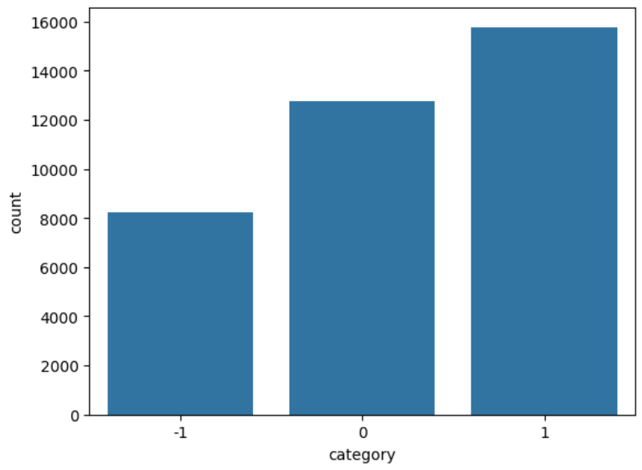{#fig-class_imbalance fig-align="center" width=65% .invert}

We found that 43% of the comments had positive sentiment, 35% had neutral sentiment, and 22% had negative sentiment.

## Creating a Column for Word Count

We created a column called `word_count` which consists of the number of words in each comment. The aim was to investigate whether the length of the comment had any predictive power about its sentiment.

### Distribution of Word Count

@fig-word_count_distribution shows the distribution of the word count.

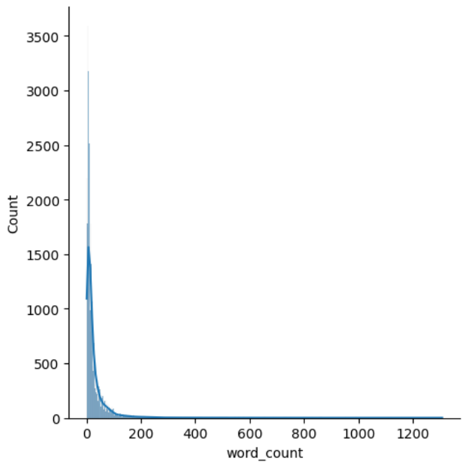{#fig-word_count_distribution fig-align="center" width=60% .invert}

Clearly, it has a huge right skew. The overwhelming majority of comments have very few words, but there is a small proportion of comments with a huge amount of words.

### Distribution of Word Count By Sentiment

@fig-word_count_distribution_by_sentiment shows the distribution of word count for each sentiment.

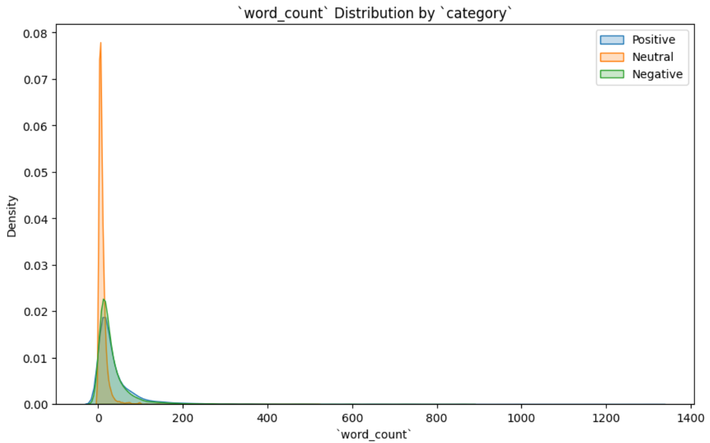{#fig-word_count_distribution_by_sentiment fig-align="center" width=80% .invert}

We can see the following:

- Neutral comments: These comments seem to have very few words and their distribution is largely concentrated around shorter comments.
- Positive comments: The word count of these comments have a wider spread, indicating that longer comments are more common in comments with a positive sentiment.
- Negative comments: These comments have a distribution similar to positive comments.

### Box Plot of Word Count By Sentiment

@fig-boxplot_of_word_count_by_sentiment shows the box plot of word count for each sentiment.

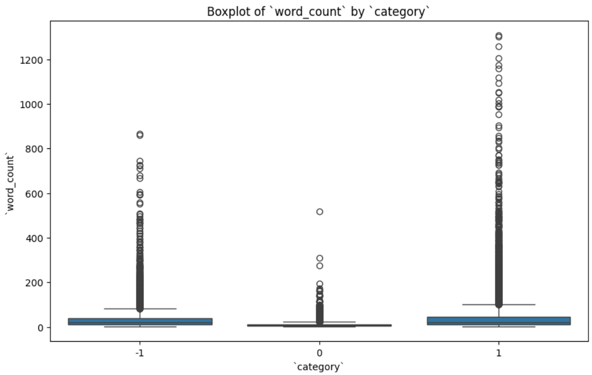{#fig-boxplot_of_word_count_by_sentiment fig-align="center" width=80% .invert}

We can see that positive and negative comments have more outliers as compared to neutral comments. This was also clear when we saw the plot in @fig-word_count_distribution_by_sentiment. Some more observations are the following:

- Neutral comments: The median `word_count` for these comments is the lowest, with a tighter IQR. This suggests that neutral comments are generally shorter.
- Positive comments: The median `word_count` for these comments is relatively high, and there are several outliers with longer comments. This indicates that positive comments tend to be more verbose.
- Negative comments: The `word_count` distribution of these comments is similar to the positive comments, but with a slightly lower median and fewer extreme outliers.

### Bar Plot of Median Word Count By Sentiment

@fig-barplot_median_wordcount_by_sentiment shows a bar plot of the median word count for each sentiment.

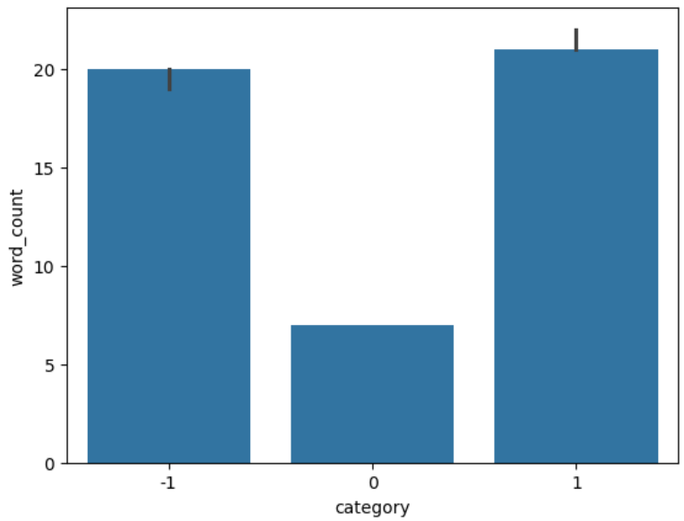{#fig-barplot_median_wordcount_by_sentiment fig-align="center" width=60% .invert}

Again, the bar plot corroborates the fact that the distribution of neutral comments is different as compared to positive and negative comments.

## Creating a Column for Stop Words

Using the `nltk` library, a new column called `num_of_stop_words` was created for each comment.

### Distribution of Stop Words

@fig-distribution_of_stop_words shows the distribution of stop words in the data.

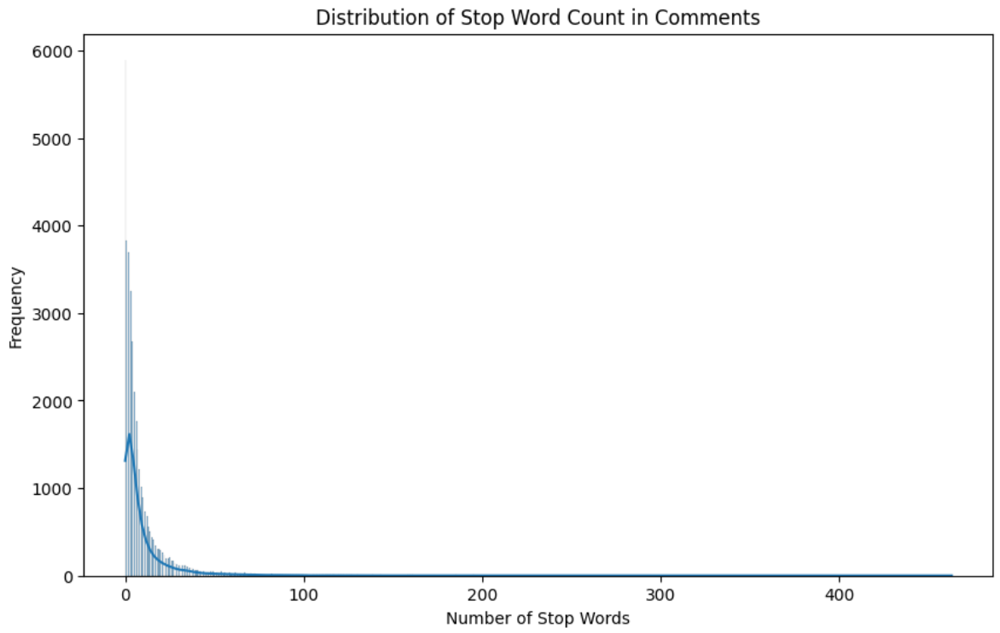{#fig-distribution_of_stop_words fig-align="center" width=80% .invert}

This distribution also has a huge right skew, just like the column `word_count`

### Distribution of Stop Words By Sentiment

@fig-distribution_of_stop_words_by_sentiments shows the distribution of stop words by sentiments.

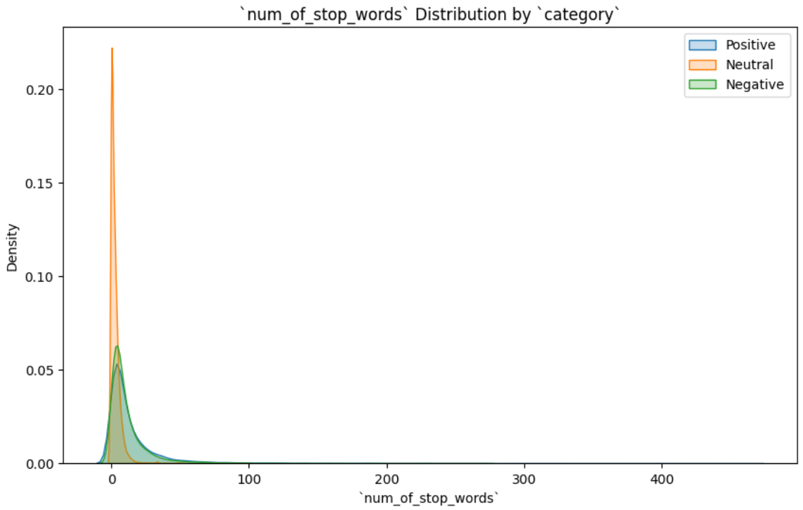{#fig-distribution_of_stop_words_by_sentiments fig-align="center" width=80% .invert}

Again, very similar behavior as the column `word_count`.

### Bar Plot of Median of Stop Words By Sentiment

@fig-barplot_median_stopwords_by_sentiment shows a bar plot of the median of stop words for each sentiment.

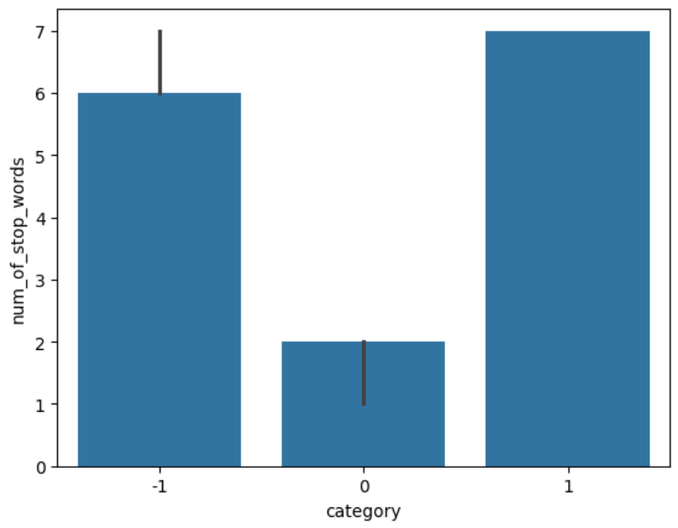{#fig-barplot_median_stopwords_by_sentiment fig-align="center" width=60% .invert}

Again, the behavior is very similar to the column `word_count`.

### Top-25 Most Common Stop Words

@fig-top_25_stopwords shows the top-25 most common stop words in the data.

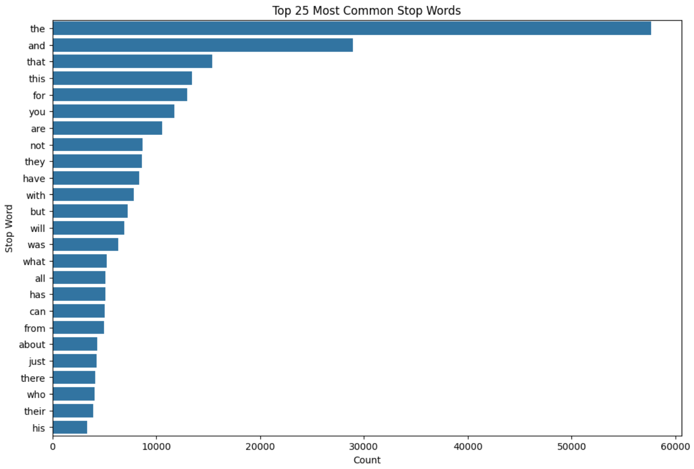{#fig-top_25_stopwords fig-align="center" width=100% .invert}

We can see that the word "not" is used quite a lot in the comments. This word can completely change the sentiment of a sentence. The words "but", "however", "no", "yet", etc., also have the same effect. These may also be present in the comments.

### Removing Stop Words

As mentioned in the previous sub-section, there are stop words like "not" in the data that can completely reverse the sentiment of the sentence. Hence, retaining such stop words is crucial, which is exactly what was done. The stop words in the data were removed using the set of all English stop words available in the library `nltk`, except the stop words "not", "but", "however", "no", and "yet".

## Creating a column for Number of Characters

A new column called `num_chars` was created that counted the number of characters of the respective comment. Here, it was seen that the data consisted of many non-English special characters. These characters were removed using a regular expression pattern.

## Checking Punctuations

It turned out that the data already had all the punctuation characters removed.

## Most Common Bigrams and Trigrams

@fig-most_common_bigrams and @fig-most_common_trigrams show the top-25 most common bigrams and trigrams in the data, respectively.

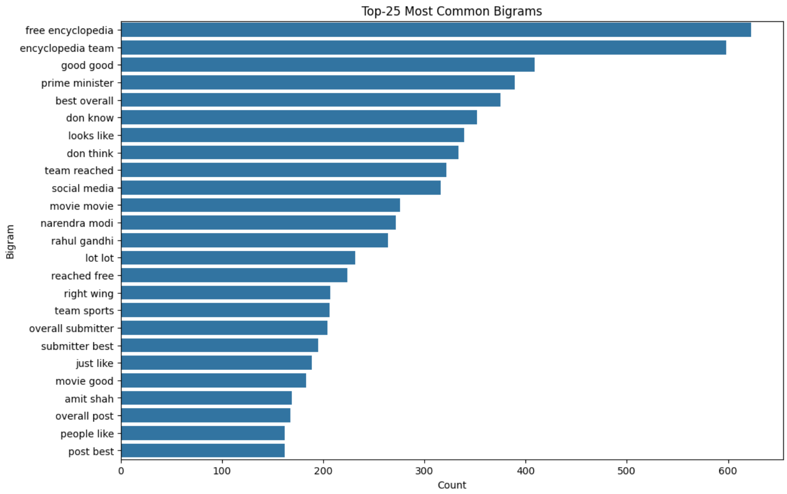{#fig-most_common_bigrams fig-align="center" width=100% .invert}

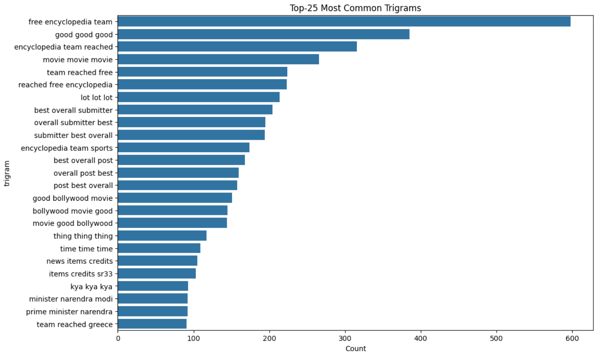{#fig-most_common_trigrams fig-align="center" width=100% .invert}

## Lemmatization

All the words were converted to their root form using the `WordNetLemmatizer` class in the `stem` module of the package `nltk`.

## Word Clouds

Word clouds are very helpful tools that help visualize the prevalence of words in the data in a visual manner.

### Word Cloud for the Entire Data

@fig-word_cloud_full shows the word cloud plot for the entire data.

{#fig-word_cloud_full fig-align="center" width=80% .invert}

### Word Cloud for Positive Comments

@fig-word_cloud_positive shows the word cloud plot for the positive comments.

{#fig-word_cloud_positive fig-align="center" width=80% .invert}

### Word Cloud for Neutral Comments

@fig-word_cloud_neutral shows the word cloud plot for the neutral comments.

{#fig-word_cloud_neutral fig-align="center" width=80% .invert}

### Word Cloud for Negative Comments

@fig-word_cloud_negative shows the word cloud plot for the negative comments.

{#fig-word_cloud_negative fig-align="center" width=80% .invert}

From the word cloud plots, it looks like the types of words are more or less the same irrespective of the sentiment of the comment.

## Most Frequent Words

@fig-most_frequent_words shows the top-20 most frequent words in the data.

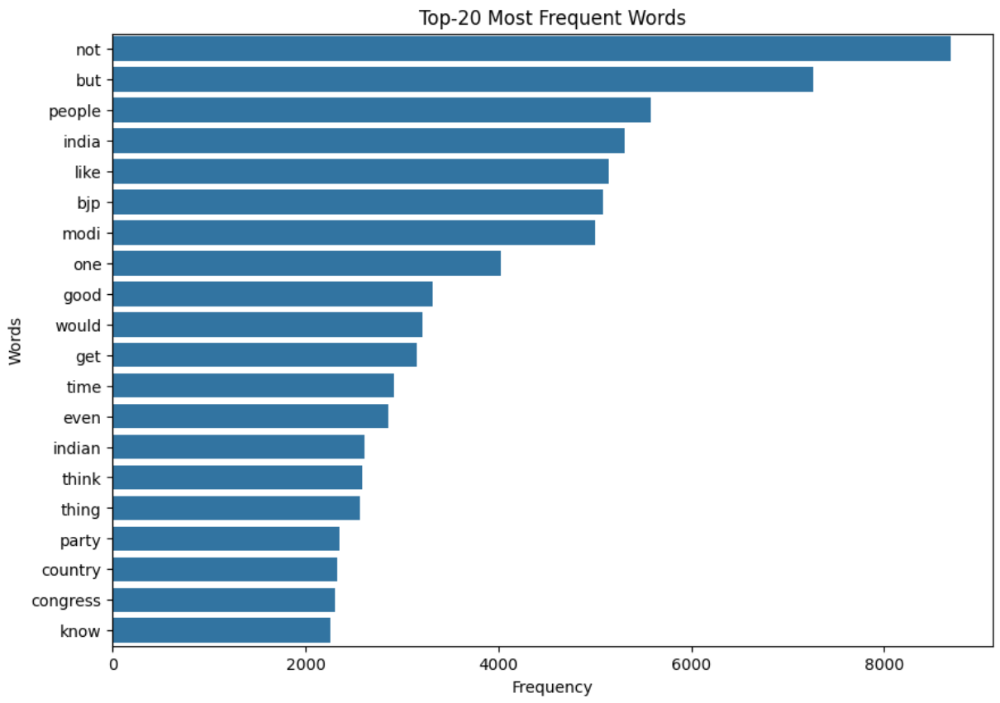{#fig-most_frequent_words fig-align="center" width=100% .invert}

### Most Frequent Words By Sentiment

@fig-most_frequent_words_by_sentiment shows the top-20 most frequent words in the data for each sentiment.

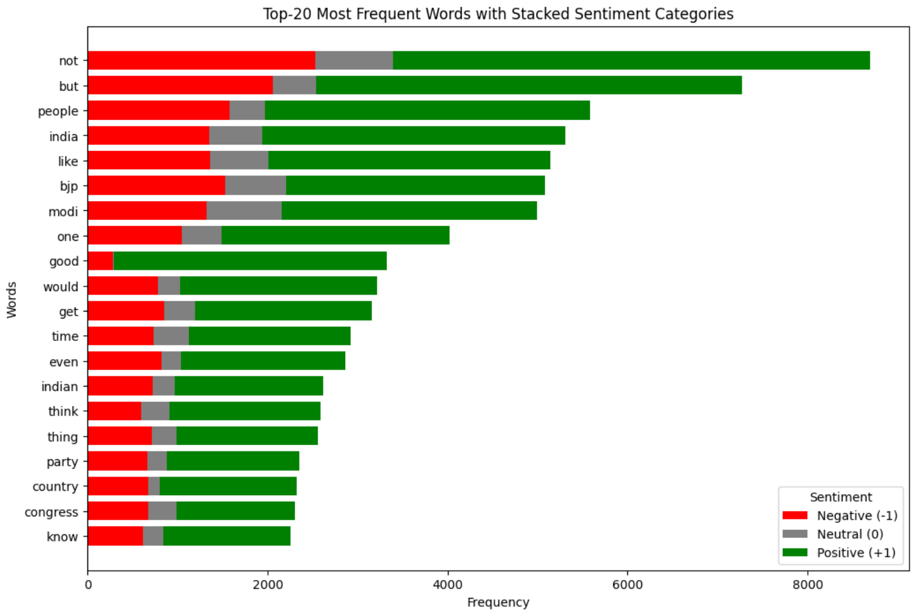{#fig-most_frequent_words_by_sentiment fig-align="center" width=100% .invert}

It looks like the distribution of the most frequent words in the data is more or less the same irrespective of the sentiment of the comment. This was also apparent by looking at the word cloud plots. Further, it seems like there are a lot of political comments. So, the model may perform better on political videos as compared to others.

## Jupyter Notebook

[This is the Jupyter notebook](https://github.com/SushrutGaikwad/youtube-comments-analyzer/blob/main/notebooks/01_EDA.ipynb) in which EDA was performed.

# Training a Baseline Model

## Introduction

We will now create a baseline model for sentiment analysis. Creating such a model is helpful because it is the simplest model possible that helps us get a benchmark performance that can be compared to future models that are more complex. We will also set up an MLFlow tracking server on DagsHub that will help track all the experiments and evaluate various models. It will also help improve the baseline model's performance using techniques like hyperparameter tuning. This will further help plan the future experiments.

## Creating a GitHub Repository

The local directory was created using the [Cookiecutter Data Science template](https://cookiecutter-data-science.drivendata.org/). A new Python environment was created inside this directory using the following command:

```bash
conda create -p venv python=3.11 -y
```

After activating this environment, all the required libraries were mentioned in the `requirements.txt` file and were installed using the following command:

```bash
pip install -r requirements.txt
```

Git was initialized in this directory, and it was pushed to a new GitHub repository.

## Creating a DagsHub Repository

A DagsHub repository was created by simply connecting the GitHub repository.

## Preprocessing

The same preprocessing that was performed during EDA was performed on the data.

## Feature Engineering

As this is just a baseline model, the simple feature engineering technique of bag of words using the `CountVectorizer` class from scikit-learn was performed.

## Baseline Model

Random forest was used as the baseline model as it is known for giving good results out of the box.

## Experiment Tracking

Experiments were tracked on MLFlow server. Metrics like accuracy, precision, recall, etc., on the test data were logged for combinations of the following hyperparameters: `max_features` of `CountVectorizer`, and `n_estimators` and `max_depth` of `RandomForestClassifier`. Further, a heat map of the confusion matrix, the model, and the data were also logged on MLFlow.

## Results

The best test accuracy obtained was around 65%. This needs to be improved. @tbl-rf_baseline_classification_report shows the classification report of this model.

::: {.tbl tbl-colwidths="auto"}
| Class      | Precision | Recall | F1-score | Support |
|-----------:|----------:|-------:|---------:|--------:|
| -1         | 1.00      | 0.02   | 0.03     | 1650    |
| 0          | 0.66      | 0.85   | 0.74     | 2555    |
| 1          | 0.64      | 0.82   | 0.72     | 3154    |
| **Accuracy** |         |        | **0.65** | **7359** |
| **Macro Avg** | 0.77   | 0.56   | 0.49     | 7359    |
| **Weighted Avg** | 0.73 | 0.65  | 0.57     | 7359    |

: Classification report for the baseline random forest classifier. {#tbl-rf_baseline_classification_report style="width:70%; margin:auto;"}
:::

Further, @fig-baseline_confusion_matrix shows the heat map of the confusion matrix.

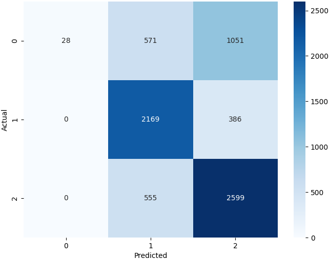{#fig-baseline_confusion_matrix fig-align="center" width=80% .invert}

The precision and recall scores of neutral and positive comments are decent, which has also translated to good corresponding F1-scores. However, the recall for negative comments is terrible. We know that recall is given by

$$
\begin{equation*}
    \text{Recall} = \frac{\text{True positives}}{\text{True positives} + \text{false negatives}}
\end{equation*}
$$

So, a recall score of $\approx 0$ implies that the model was unable to correctly classify negative comments as negative. In other words, very few negative comments were classified as negative by the model. This is also clear from the confusion matrix (@fig-baseline_confusion_matrix). The model has correctly classified only $28$ negative comments out of a total of $1650$ negative comments. And,

$$
\text{Recall of negative comments} = \frac{28}{28+571+1051} = \frac{28}{1650} \approx 0.02
$$

On the other hand, precision is given by

$$
\text{Precision} = \frac{\text{True positives}}{\text{True positives} + \text{false positives}}
$$

So, we get

$$
\text{Precision of negative comments} = \frac{28}{28+0+0} = 1
$$

So, the model is performing extremely poorly on the negative comments. We need to improve this.

One reason this may be attributed to can be the imbalance. The data has a lesser number of negative comments as compared to neutral and positive ones. This is clear from the "Support" column shown in @tbl-rf_baseline_classification_report. So, this is the direction we need to head to.

## Jupyter Notebook

Baseline model training was implemented in [this Jupyter notebook](https://github.com/SushrutGaikwad/youtube-comments-analyzer/blob/main/notebooks/02_training_a_baseline_model.ipynb).

# Improving the Baseline Model

## Discussion

### Handling Class Imbalance

To reiterate, the normalized value counts in terms of percentage identified during EDA are the following:

- Positive comments: 43%
- Neutral comments: 35%
- Negative comments: 22%

The reason for getting poor performance, especially for the negative comments, can be attributed to this class imbalance.

There are various methods to address this imbalance, e.g., over-sampling, under-sampling, SMOTE, etc. We will try all these. If there is any parameter in a model corresponding to the weight of a class, we will try tweaking that.

### Using a More Complex Model

Using complex models like XGBoost, LightGBM, deep learning, etc., can improve the results, especially if applied after handling class imbalance.

### Hyperparameter Tuning

Hyperparameter tuning using a Bayesian approach (by using Optuna) of more complex models can improve results significantly.

### Use of Ensembling

We can use `VotingClassifier` or `StackingClassifier` and combine multiple models to improve the performance.

### Feature Engineering

We used a very basic bag of words technique for the baseline model. We can use n-grams in conjunction with bag of words to improve results. We can also use embeddings like Word2vec. We can also use custom features like the number of stop words, the ratio of vowels to consonants, etc., to see if they improve the performance.

### Data Preprocessing

Investigating the data deeper may give us more insights about it, which in turn may help improve the model's performance.

## Implementation

- Experiment 1:
    -  Here, we will compare two feature engineering techniques: bag of words and TF-IDF.
    -  Further, we will also compare unigram, bigram, and trigram results, keeping the value of the hyperparameter `max_features` fixed.
- Experiment 2:
    -  Once the best feature engineering technique is found, we will find the best value of the hyperparameter `max_features`.
- Experiment 3:
    -  Here, we will apply various techniques to handle the data imbalance.
    -  We will try under-sampling, ADASYN, SMOTE, SMOTE with ENN, and using class weights.
- Experiment 4:
    -  Here, we will try out many models on the data. They are: XGBoost, LightGBM, random forest, SVM, logistic regression, $k$-nearest neighbors, and naive Bayes.
    -  Further, we will also perform some coarse hyperparameter tuning on all these models.
- Experiment 5:
    -  Here, once we find the best performing algorithm from the previous experiment, we will perform a significantly finer hyperparameter tuning on this model.

### Experiment 1

This experiment was mainly to determine which feature engineering technique among bag of words and TF-IDF is better. The value of `max_features` was kept fixed at 5,000 for this experiment. @fig-exp_1_pcp shows the parallel coordinates plot obtained on MLFlow for this experiment.

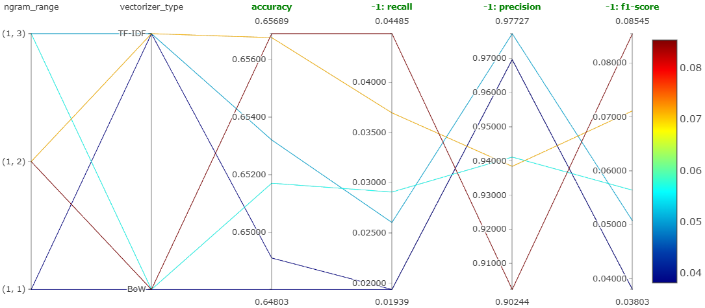{#fig-exp_1_pcp fig-align="center" width=100%}

We can clearly see that the best accuracy and the best recall for negative comments correspond to the combination of bigram with bag of words. So, the best feature engineering technique observed in this experiment is bag of words with bigrams.

#### Jupyter Notebook

This experiment was performed in [this Jupyter notebook](https://github.com/SushrutGaikwad/youtube-comments-analyzer/blob/main/notebooks/04_bow_vs_tf-idf.ipynb).

### Experiment 2

This experiment was mainly to determine the value of the hyperparameter `max_features` that gives the best results considering bag of words with bigrams. The value of this hyperparameter was varied from 1,000 to 10,000 in steps of 1,000. @fig-exp_2_pcp shows the parallel coordinates plot obtained on MLFlow for this experiment.

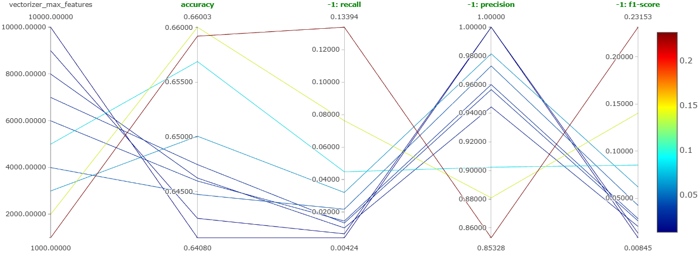{#fig-exp_2_pcp fig-align="center" width=100%}

We can clearly see that the accuracy is higher for lower values of `max_features`. The same is true for the recall of negative comments. Also, we can see that the recall value is now substantially improved as compared to the previous experiments. Hence, we can conclude that the best value of `max_features` is 1,000.

#### Jupyter Notebook

This experiment was performed in [this Jupyter notebook](https://github.com/SushrutGaikwad/youtube-comments-analyzer/blob/main/notebooks/05_bow_bigrams_max_features.ipynb).

### Experiment 3

The main aim of this experiment was to determine which balancing technique gives the best model performance. As mentioned earlier, the techniques tried were under-sampling, ADASYN, SMOTE, SMOTE with ENN, and using class weights in random forest. @fig-exp_3_pcp_-1, @fig-exp_3_pcp_0, and @fig-exp_3_pcp_1 show the parallel coordinates plot obtained on MLFlow for this experiment corresponding to the negative comments, neutral comments, and positive comments, respectively.

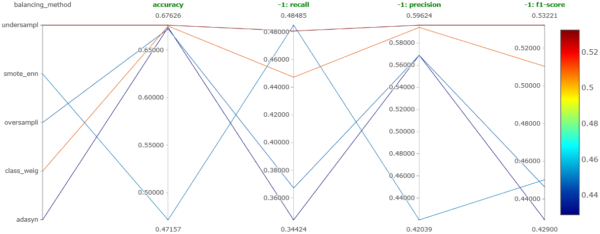{#fig-exp_3_pcp_-1 fig-align="center" width=100%}

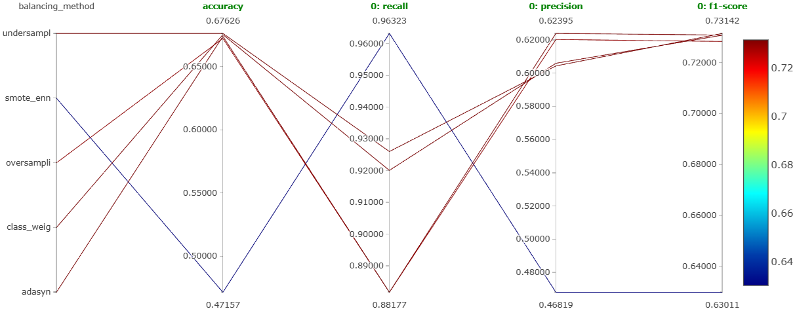{#fig-exp_3_pcp_0 fig-align="center" width=100%}

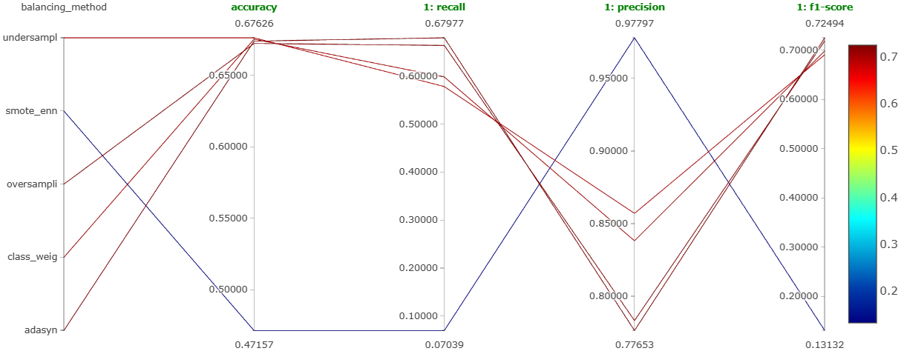{#fig-exp_3_pcp_1 fig-align="center" width=100%}

We can clearly see that the under-sampling method is performing the best for all types of comments. It is giving the most balanced performance.

#### Jupyter Notebook

This experiment was performed in [this Jupyter notebook](https://github.com/SushrutGaikwad/youtube-comments-analyzer/blob/main/notebooks/06_handling_imbalanced_data.ipynb).

Now, using the best configuration that we have discovered till now, i.e., bag of words with bigrams, 1000 features, and under-sampling, we will do hyperparameter tuning for all the machine learning models using Optuna.

### Experiment 4

As mentioned earlier, we will try out 7 machine learning models on the best configuration learned so far. These models are: XGBoost, LightGBM, random forest, SVM, logistic regression, $k$-nearest neighbors, and naive Bayes. Further, we will also perform a coarse hyperparameter tuning on each of them using Optuna. We will log the best performing version of each of these models as a run on MLFlow. So, we will end up getting a total of 7 runs for this experiment. @fig-exp_4_pcp_negative, @fig-exp_4_pcp_neutral, and @fig-exp_4_pcp_positive show the parallel coordinates plot obtained on MLFlow for this experiment corresponding to the negative comments, neutral comments, and positive comments, respectively.

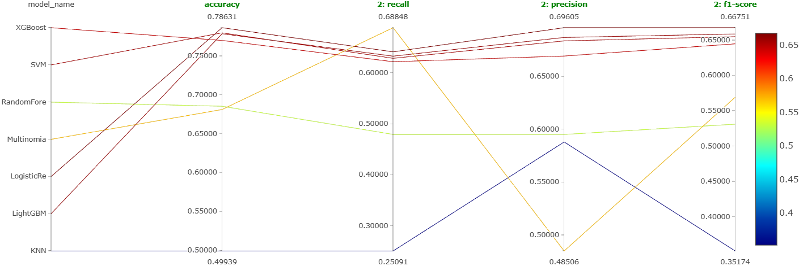{#fig-exp_4_pcp_negative fig-align="center" width=100%}

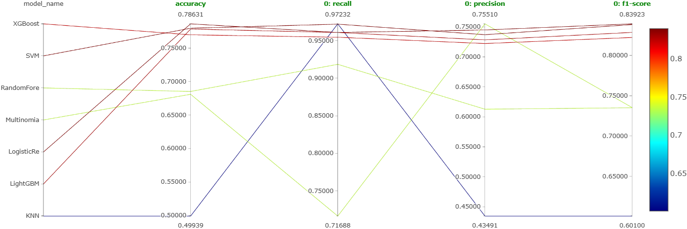{#fig-exp_4_pcp_neutral fig-align="center" width=100%}

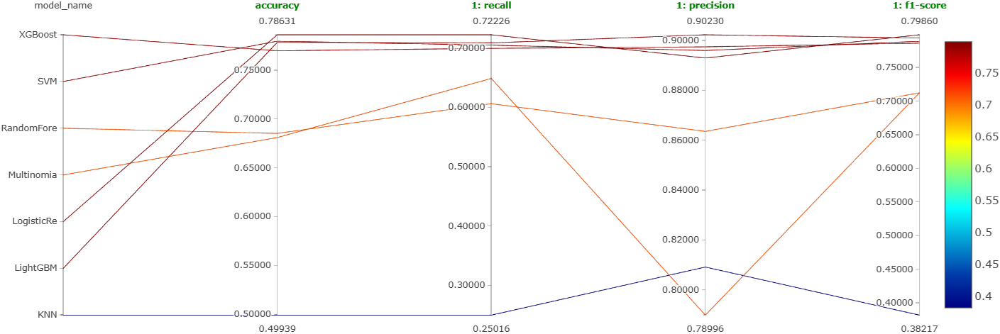{#fig-exp_4_pcp_positive fig-align="center" width=100%}

From these figures, it is clear that the most reliable and consistent performers are XGBoost, SVM, logistic regression, and LightGBM. This is shown even more clearly in @fig-exp_4_pcp_combined.

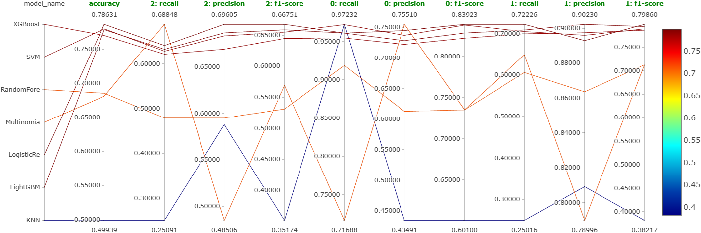{#fig-exp_4_pcp_combined fig-align="center" width=100%}

It is not clear which one to choose among them. So, we will instead perform an extensive and finer hyperparameter tuning on all 4 of these.

#### Jupyter Notebooks

This experiment was performed in the following Jupyter notebooks:

- [XGBoost notebook](https://github.com/SushrutGaikwad/youtube-comments-analyzer/blob/main/notebooks/07_xgboost_hpt.ipynb),
- [LightGBM notebook](https://github.com/SushrutGaikwad/youtube-comments-analyzer/blob/main/notebooks/08_lightgbm_hpt.ipynb),
- [SVM notebook](https://github.com/SushrutGaikwad/youtube-comments-analyzer/blob/main/notebooks/09_svm_hpt.ipynb),
- [Logistic regression notebook](https://github.com/SushrutGaikwad/youtube-comments-analyzer/blob/main/notebooks/10_log_reg_hpt.ipynb),
- [KNN notebook](https://github.com/SushrutGaikwad/youtube-comments-analyzer/blob/main/notebooks/11_knn_hpt.ipynb),
- [Naive Bayes notebook](https://github.com/SushrutGaikwad/youtube-comments-analyzer/blob/main/notebooks/12_naive_bayes_hpt.ipynb),
- [Random forest notebook](https://github.com/SushrutGaikwad/youtube-comments-analyzer/blob/main/notebooks/13_random_forest_hpt.ipynb).

### Experiment 5

As mentioned earlier, we will now perform detailed hyperparameter tuning of LightGBM, XGBoost, SVM, and logistic regression. @fig-exp_5_pcp_combined shows the parallel coordinates plot obtained on MLFlow for this experiment.

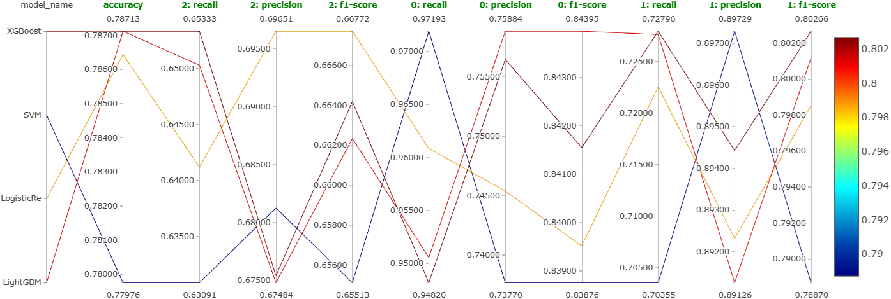{#fig-exp_5_pcp_combined fig-align="center" width=100%}

Again, even after extensive hyperparameter tuning, there is no clear winner. So, it looks like choosing any model among these four would work. We will choose LightGBM. We also plotted the hyperparameter importances for LightGBM using Optuna. @fig-lightgbm_hp_imp shows this plot.

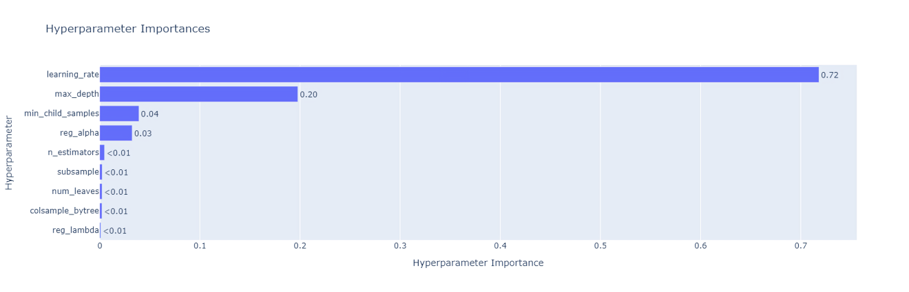{#fig-lightgbm_hp_imp fig-align="center" width=100%}

We can see that the top-3 most important hyperparameters are `learning_rate`, `max_depth`, and `min_child_samples`.

Note that the accuracy we have is less than even 80%. We need to improve it further.

#### Jupyter Notebooks

This experiment was performed in the following Jupyter notebooks:

- [LightGBM](https://github.com/SushrutGaikwad/youtube-comments-analyzer/blob/main/notebooks/14_lightgbm_detailed_hpt.ipynb)
- [XGBoost](https://github.com/SushrutGaikwad/youtube-comments-analyzer/blob/main/notebooks/15_xgboost_detailed_hpt.ipynb)
- [SVM](https://github.com/SushrutGaikwad/youtube-comments-analyzer/blob/main/notebooks/16_svm_detailed_hpt.ipynb)
- [Logistic regression](https://github.com/SushrutGaikwad/youtube-comments-analyzer/blob/main/notebooks/17_log_reg_detailed_hpt.ipynb)

# Improving the LightGBM Model

## Techniques Used

We will try the following techniques to improve the model performance:

- Balancing data using the `class_weight` parameter,
- Word2vec,
- Creating custom features, e.g., average word length, etc.
- Ensemble learning (stacking).

## Balancing Using `class_weight`

In the `LightGBMClassifier` implementation, the following two parameters can be provided if the data is imbalanced: `is_unbalance = True` and `class_weight = "balanced"`. Using this setting will assign weights to all the classes appropriately according to their imbalance. Doing this, we can skip the undersampling step and directly train the model.

### Jupyter Notebook

This was implemented in [this Jupyter notebook](https://github.com/SushrutGaikwad/youtube-comments-analyzer/blob/main/notebooks/18_lightgbm_class_weights.ipynb).

## Using Word2Vec

Word2Vec is a technique that is used to create vector representations of words. It is a feature engineering technique very commonly used in NLP. We used it with a `vector_size}` of 300, a `window` of 5, and we used the skip-gram model. Further, undersampling was used to balance the data.

### Jupyter Notebook

This was implemented in [this Jupyter notebook](https://github.com/SushrutGaikwad/youtube-comments-analyzer/blob/main/notebooks/19_lightgbm_word2vec.ipynb).

## Creating Custom Features

Firstly, we created the following 6 new custom features from the raw data:

- `comment_length`: This represents the number of characters in a comment.
- `word_count`: This represents the number of words in a comment.
- `avg_word_length`: This represents the average word length in a comment.
- `unique_word_count`: This represents the count of words that are unique in a comment.
- `lexical_diversity`: This represents the diversity of words used in a comment.
- `pos_count`: This represents the number of parts of speech used in the comment.

Further, more features were also created using the `spaCy` library. For instance, we created the proportion of each type of parts of speech like adjectives, verbs, etc. Some proportions were turning out to be NaN's possibly due to zeros in the denominator. These were filled using 0's. Finally, undersampling was used to balance the data.

### Jupyter Notebook

This was implemented in [this Jupyter notebook](https://github.com/SushrutGaikwad/youtube-comments-analyzer/blob/main/notebooks/20_lightgbm_custom_features.ipynb).

## Stacking Classifier

Here, we tried using ensemble learning. We had discovered earlier that four models, namely, XGBoost, SVM, LightGBM, and logistic regression had almost identical performance. @fig-exp_4_pcp_combined indicated this. So the plan was to use all these four models as base learners and use a meta-learner on top of them to form a stacking classifier. We used $k$-nearest neighbors model as the meta-learner. Further, undersampling was used to balance the data.

### Jupyter Notebook

This was implemented in [this Jupyter notebook](https://github.com/SushrutGaikwad/youtube-comments-analyzer/blob/main/notebooks/21_stacking.ipynb).

## Comparison of the Results

Extensive hyperparameter tuning using Optuna was also done on all the models built using these 4 techniques, and the best version of them was logged on MLFlow. @fig-improvement_techniques_pcp shows the parallel coordinates plot obtained on MLFlow for all four improvement techniques we tried.

{#fig-improvement_techniques_pcp fig-align="center" width=100%}

The observations are the following:

- Word2vec:
    - This technique has the worst performance. Hence, we won't use this as our final model.
- Stacking:
    - This resulted in relatively decent performance.
    - However, as 4 models are used in this ensemble, the latency is bad. Hence, we won't use this as our final model too.
- Custom features:
    - Using custom features gave us good results.
    - However, we needed to use undersampling to balance the classes.
    - Also, the recall for the negative comments (indicated with "2" on the plot) is not that great.
- Using `class_weight`:
    - This gave us the best results without needing to balance the data.
    - The recall for the negative comments is also good.
    - So, we may want to finalize this.

# Building the DVC Pipeline

## Recap

We have already created the project directory using the cookiecutter data science template, initialized Git in it, and pushed it to a GitHub repository.

## Stages in the DVC Pipeline

### Data Ingestion

The raw data is kept in an Amazon S3 bucket. We will carry out the following steps in this stage:

1. Fetch the raw data from the S3 bucket.
2. Carry out the following basic data cleaning tasks:
  - Drop the missing values,
  - Drop the duplicates,
  - Remove the empty comments.
3. Split the data into training and test sets.
4. Save the training and test sets in the "`data/raw`" directory.

This is implemented in the [`data_ingestion.py`](https://github.com/SushrutGaikwad/youtube-comments-analyzer/blob/main/youtube_comments_analyzer/data_ingestion.py) module.

### Data Preprocessing

We will carry out the following steps in this stage:

1. Fetch the training and test data from the "`data/raw`" directory.
2. Carry out the following preprocessing steps on these data:
  - Convert the words into lowercase,
  - Remove URL from the comments,
  - Remove stop words except a few important ones,
  - Lemmatize the comments.
3. Save both the preprocessed data in the "`data/interim`" directory.

This is implemented in the [`data_preprocessing.py`](https://github.com/SushrutGaikwad/youtube-comments-analyzer/blob/main/youtube_comments_analyzer/data_preprocessing.py) module.

### Feature Engineering

We will carry out the following steps in this stage:

1. Fetch both the processed data from the "`data/interim`" directory.
2. Train a `CountVectorizer` (bag of words) object on the training data with bigrams and `max_features` as 1,000.
3. Transform the training as well as the test data using this trained vectorizer.
4. Save the transformed training and test sets in the "`data/processed`" directory.
5. Save this vectorizer as a pickle file in the "`models`" directory.

This is implemented in the [`feature_engineering.py`](https://github.com/SushrutGaikwad/youtube-comments-analyzer/blob/main/youtube_comments_analyzer/feature_engineering.py) module.

### Model Training

We will carry out the following steps in this stage:

1. Fetch the transformed training and test data from the "`data/processed`" directory.
2. Train a `LGBMClassifier` model on the training data using the best parameters that we found out using hyperparameter tuning.
3. Save this model as a pickle file in the "`models`" directory.

This is implemented in the [`model_training.py`](https://github.com/SushrutGaikwad/youtube-comments-analyzer/blob/main/youtube_comments_analyzer/model_training.py) module.

### Model Evaluation

We will carry out the following steps in this stage:

1. Fetch the transformed test data from the "`data/processed`" directory.
2. Load the saved model from the "`models`" directory and make predictions on this transformed test data from the previous step.
3. Check the classification report.
4. Log all the pipeline parameters, model, vectorizer, classification report, etc., on MLFlow.
5. Create a JSON file that consists of the run ID of and the model path. This will be used to register the model.

This is implemented in the [`model_evaluation.py`](https://github.com/SushrutGaikwad/youtube-comments-analyzer/blob/main/youtube_comments_analyzer/model_evaluation.py) module.

### Model Registration

We will carry out the following steps in this stage:

1. Load the model information from the JSON file.
2. Register the model in MLFlow model registry.
3. Transition the model to the "Staging" stage.

This is implemented in the [`model_registration.py`](https://github.com/SushrutGaikwad/youtube-comments-analyzer/blob/main/youtube_comments_analyzer/model_registration.py) module. We can now fetch this model from the model registry and make predictions.

## Some Other Important Files

There are two important files.

### `dvc.yaml`

The [`dvc.yaml`](https://github.com/SushrutGaikwad/youtube-comments-analyzer/blob/main/dvc.yaml) file has the code to connect all the DVC pipeline stages that we defined.

### `params.yaml`

The [`params.yaml`](https://github.com/SushrutGaikwad/youtube-comments-analyzer/blob/main/params.yaml) file contains the values of all the parameters used in the project, e.g., the train-test ratio, model and vectorizer hyperparameters, etc.

# Backend Development Using FastAPI

## Introduction

The frontend of our application will be the Chrome extension, which will be built using HTML, CSS, and JavaScript. Once this extension is opened on any YouTube video, it will extract all the comments on it and send them to the backend. This backend will be an API built using FastAPI which can fetch the model stored in the model registry and make predictions on all the comments sent by the frontend. These predictions will then be sent back to the frontend, which will display them to the user.

## Architecture Overview

The backend is designed as a RESTful API using the FastAPI framework. It acts as a bridge between the frontend Chrome extension and the sentiment analysis model. The core responsibilities of the backend include:

- Receiving a list of YouTube comments via POST requests.
- Preprocessing the text data to normalize and clean the comments.
- Vectorizing the cleaned comments using a pre-trained CountVectorizer.
- Making predictions using a sentiment classification model registered in MLflow.
- Sending the predicted sentiments back as a JSON response.

## Preprocessing

Before making predictions, each comment undergoes the following preprocessing steps:

1. Convert all characters to lowercase.
2. Remove newline characters and non-alphanumeric symbols (except for punctuation).
3. Remove standard English stopwords while retaining important words such as "not", "but", "however", etc.
4. Lemmatize each word to reduce it to its base form.

Note that these are the same preprocessing steps that were carried out in the data preprocessing stage. The preprocessed comments are then passed to the vectorizer.

## Loading the Model and the Vectorizer

The backend loads the sentiment classifier and vectorizer during the API startup event. The model is fetched from the MLflow model registry hosted on DagsHub, and the vectorizer is loaded from a local file using Joblib. This ensures that the resources are initialized only once for efficiency.

## Prediction Endpoint

The main prediction endpoint is defined as `/predict`. It accepts a POST request with a JSON body containing a list of comments:

```json
{
  "comments": [
    "I love this video",
    "This was terrible and boring"
  ]
}
```

Each comment is preprocessed, transformed into a numerical feature vector, and then passed to the model for prediction. The response contains the original comment along with its predicted sentiment:

```json
[
  {"comment": "I love this video", "sentiment": 1},
  {"comment": "This was terrible and boring", "sentiment": 0}
]
```

## Error Handling

The API is designed with robust error handling to catch and report issues such as:

- Missing or improperly formatted input.
- Errors during preprocessing or vectorization.
- Model prediction failures due to schema mismatches or other issues.

In such cases, the API returns an appropriate HTTP status code and an explanatory error message.

## Application File

The entire code is implemented in the [`app.py`](https://github.com/SushrutGaikwad/youtube-comments-analyzer/blob/main/backend/app.py) file inside the `backend` directory.

# Frontend Development (Chrome Extension)

## Introduction

As mentioned earlier, we will use HTML, CSS, and JavaScript to create this extension. This extension will be made in stages, each stage successively implementing more features than the previous one. There are three files necessary to create a chrome extension: `manifest.json`, `popup.html`, and `popup.js`. Let us now discuss these stages one by one.

## A Basic Prototype

This was the very first working version of the extension. The goal here was simply to check if the extension can talk to the FastAPI backend and get a response from it.

We started with just two hard-coded comments: `"This is awesome!"` and `"This is the worst video"`. When the user clicks the button on the extension, one of these comments is randomly selected and sent to the backend. The backend then predicts the sentiment of that comment and sends the result back to the extension, which displays it.

The workflow is as follows:

- A button click triggers the function that randomly picks one of the two predefined comments.
- This selected comment is sent to the `/predict` endpoint of the backend using a simple `POST` request.
- The backend replies with the predicted sentiment.
- This prediction is shown on the extension so that the user can see the result.

This small prototype helped us confirm that everything is connected properly. The extension can make requests, the backend can respond, and the extension can display that response. You can find the code for this version in [`this commit`](https://github.com/SushrutGaikwad/youtube-comments-analyzer-frontend/tree/9a63078738978ccad7129939bb5822bf32a97678) of my GitHub repository.

## YouTube URL Checker

Starting from this stage, the extension can actually work with YouTube videos. The main idea here is to check whether the current tab is showing a valid YouTube video. If it is, then we extract and display the video ID. This YouTube video ID is important because we’ll later use it to fetch all the comments from that particular video. So, this step sets up the foundation for everything else that follows. The workflow is simple:

- As soon as the extension is opened, it looks at the URL of the current tab.
- If the URL is a YouTube video link, it prints the video ID.
- If it’s not a valid YouTube video link, it shows a message saying so.

This helped confirm that our extension is able to recognize and respond to YouTube pages properly. The code for this stage is available at [this commit](https://github.com/SushrutGaikwad/youtube-comments-analyzer-frontend/tree/cafd49520d43dcd260cc6c6dc5877a9867a75ccf) of my GitHub repository.

## Number of YouTube Comments

In this stage, we take things one step further. Now that the extension can detect whether the current tab is a YouTube video and extract its video ID, we use that ID to find out how many comments the video has. To do this, we make use of the [YouTube Data API Version 3](https://console.cloud.google.com/apis/library/youtube.googleapis.com?hl=en-GB). Once we get the video ID, we send a request to the API, asking for the statistics of that video which includes the total number of comments. The number is then shown directly on the extension. The workflow is as follows:

- The extension checks if the current tab is a valid YouTube video.
- If it is, the video ID is extracted and displayed.
- Using this ID, a request is made to the YouTube Data API to get the video’s statistics.
- If available, the total number of comments is fetched and displayed below the video ID.
- If something goes wrong or the data isn’t available, a suitable message is shown instead.

This helped confirm that the API key works, the extension can talk to the YouTube API, and we’re able to access real data from a live YouTube video. The code for this stage can be found on [this commit](https://github.com/SushrutGaikwad/youtube-comments-analyzer-frontend/tree/4968af1d1670665cdc99ab587c9304f67b20b184) of my GitHub repository.

## Sentiment Percentages

This stage involves making predictions on 100 comments and then displaying what percentage of them are positive, neutral, or negative. For example, when we visit a YouTube video and open the extension, it automatically sends the first 100 comments to the prediction API and gets back their sentiment values. It then calculates and shows the percentage of comments in each sentiment category. The workflow is as follows:

- Once the extension is opened, it first checks whether the current page is a valid YouTube video URL. If yes, it extracts the video ID.
- Next, the `fetchComments` function is called, which uses the YouTube Data API to fetch up to 100 comments from that video.
- These comments are then passed to the `getSentimentPredictions` function. This function sends them to the FastAPI backend, where the sentiment prediction model runs and returns the predicted labels for each comment.
- The predictions are then used to count how many comments fall into each category, i.e., positive (`"1"`), neutral (`"0"`), or negative (`"2"`).
- These counts are converted into percentages and displayed on the extension.

The implementation code for this stage can be found on [this commit](https://github.com/SushrutGaikwad/youtube-comments-analyzer-frontend/tree/3b6c772f65afadc7554fb16a5c9367534532838f) of my GitHub repository.

## Showing Top-25 Comments and Improving Cosmetics

This stage added two main things: first, the ability to show the top-25 comments on the video along with their predicted sentiments, and second, a visual improvement to the way the sentiment percentages and other results are displayed on the extension. The workflow is as follows:

- When the extension is opened on a YouTube video, it checks the URL and extracts the video ID.
- It then fetches up to 500 comments using the `fetchComments` function. This function keeps making API calls until either 500 comments are collected or there are no more comments left to fetch.
- These comments are sent to the backend using the `getSentimentPredictions` function, which returns the predicted sentiment for each comment.
- The extension calculates the percentage of positive, neutral, and negative comments based on these predictions.
- These percentages are now shown using colored boxes that are easier to read and look better visually.
- Finally, the top-25 comments are displayed on the extension, each one showing its position in the list and its predicted sentiment.

The layout is styled using CSS inside `popup.html`, which includes things like dark theme colors, section titles, and formatting for the sentiment boxes and comment list. The implementation code for this stage can be found on [this commit](https://github.com/SushrutGaikwad/youtube-comments-analyzer-frontend/tree/22efd424dab3e028ec8ee95513ecc2a36b63455f) of my GitHub repository.

## Displaying Pie Chart of Sentiment Proportions

We already were displaying the sentiment percentages. We now will display those percentages using a pie chart for better visualization. The plan is to generate a pie chart at the backend itself and then send it to the frontend. The changes are made in the FastAPI file where we added a new endpoint `/generate_chart` for generating this pie chart. On the frontend side, we change the `manifest.json` file as we are now sending images to it from the backend, the `popup.html` file as we need to make adjustments for this chart, and the `popup.js` file where we add this functionality to fetch this chart from the backend. The workflow now is as follows:

- The function `fetchComments` is run that takes in input the video ID and returns all the comments of the video of this video ID.
- The function `getSentimentPredictions` is now run that takes the comments and gives them to the `/predict` endpoint of the backend (FastAPI). The response is the predicted sentiments. This response is then returned by this `getSentimentPredictions` function.
- Next, we count the number of comments of each sentiment type.
- This sentiment count is sent as input to the `fetchAndDisplayChart` function. This function hits the endoint `/generate_chart` of the backend, which creates the pie chart and returns it back to the function. This chart is finally displayed by this `fetchAndDisplayChart` function.

## Displaying Word Cloud of the Comments

This is relatively simple as there is no machine learning involved. We will send all the comments from the frontend to the backend to a new endpoint `/generate_wordcloud`. This endpoint simply preprocesses all the comments and generates the word cloud using the `wordcloud` Python library. This word cloud is sent back to the frontend, which displays it on the extension. The `popup.html` is also changed to incorporate this word cloud. The workflow now is as follows:

- First, again, all the comments of a video are fetched using the function `fetchComments` using the video's ID.
- These comments are passed as input to the `fetchAndDisplayWordCloud` function. This function hits the `/generate_wordcloud` endpoint. All the comments are processed at this endpoint and a word cloud is generated using them.
- This word cloud is returned back to the `fetchAndDisplayWordCloud` function, which then displays it on the extension.

## Displaying Sentiment Trend with Time

This will be a monthly line chart that displays how the number of comments of each sentiment changes over time. For this, we made some changes in the frontend and the backend code. The workflow now is as follows:

- Recall that there was a function `fetchComments` that fetches all the comments of a YouTube video. We will changed this function such that it now returns the comments as well as the date-time at which each of those comments was posted.
- The comments and their corresponding date-time of posting is sent to the function `getSentimentPredictions`. It sends the comments and the date-time to a new endpoint `/predict_with_timestamps`. This new endpoint returns the same date-time (that was in the input) and the predicted sentiment of each of the comments.
- This date-time and the corresponding sentiment is now sent as input to the function `fetchAndDisplayTrendGraph`. This function hits the endpoint `/generate_trend_graph`. This endpoint generates the monthly plot of the number of comments of each sentiment, and sends it back to `fetchAndDisplayTrendGraph`, which then displays it on the extension.

## Displaying Some Useful Metrics

We will now display the following four metrics on the extension:

- Total number of comments,
- Number of unique commenters,
- Average words per comment,
- Average sentiment score out of 10.
  - The closer it is to 10, the more positive the sentiment, and vice versa.

All the changes are only in the frontend files. The workflow now is as follows:

- We can directly get the total number of comments on a video from the YouTube Data API. Similarly, we can easily find the number of unique commenters by putting all the authors of the comments inside a set. So, these two metrics are almost immediately available form the YouTube Data API.
- Average words per comment is also easily obtained by dividing the number of words in each comment with the total number of comments.
- To get the average sentiment score, we do the following. Say we get $c_{+}$ positive comments, $c_{-}$ negative comments, and $c_{0}$ neutral comments. The total number of comments are $c_{+} + c_{0} + c_{-}$. To find the average sentiment score, we do the following:
  $$
  \begin{align*}
      \text{Avg. sentiment score} &= \frac{1 c_{+} + 0 c_{0} + (-1) c_{-}}{\text{Total number of comments}} \times 10\\
      &= \frac{1 c_{+} + 0 c_{0} + (-1) c_{-}}{c_{+} + c_{0} + c_{-}} \times 10
  \end{align*}
  $$

- So, we first get the comments using `fetchComments`.
- Next, we get the sentiment predictions using `getSentimentPredictions`.
- Finally the average sentiment score is calculated and displayed on the extension.

## Final Frontend and Backend Code

The frontend code implementing all the functionality discussed till now can be found in [this commit](https://github.com/SushrutGaikwad/youtube-comments-analyzer-frontend/tree/95aee970442a7c242b12e0f73551479bd5088660) of my GitHub repository. The backend FastAPI code can be found in the [`app.py`](https://github.com/SushrutGaikwad/youtube-comments-analyzer/blob/main/backend/app.py) module.

# Continuous Integration (CI)

## Introduction

This is the first step in the Continuous Integration and Continuous Delivery (CI/CD) workflow. This workflow is crucial because whenever in the future we want to train a new model or make any changes in the application like change in the UI, we can simply make changes in the corresponding files (e.g., if we want to train a new model we can make changes in the `params.yaml` file) and this workflow makes sure that the updated application is deployed seamlessly without needing to create another deployment. In other words, CI/CD helps us in automating the deployment process. We will be using GitHub actions for implementing this workflow.

## Stages in CI

We will have the following stages in our CI workflow.

1. Running the DVC pipeline.
    - This will give us a model that will go in the MLFLow model registry in the "Staging" stage.
2. Testing the registered model. We will perform the following tests:
    - Checking if the model is correctly loading from the model registry.
    - Checking if the model signature is correct. In other words, the input and output of the model should be appropriate.
    - Checking the performance of the model.
      - The model will be promoted to the "Production" stage only if its performance metrics are greater than a threshold.
3. Promoting the model to the "Production" stage.
4. FastAPI testing.

Once this is done, we will containerize the API using Docker and then deploy it.

## Running the DVC Pipeline

### Creating the Workflow File

We will first create a new directory called `.github` in the root directory of the project, inside which we will create another directory called `workflows`. Inside this `workflows` directory, we will create the workflow file called `ci-cd.yaml`. This workflow file contains the instructions to carry out the entire CI/CD workflow. The first version of this workflow file is the following:

```yaml
name: CI/CD Pipeline

on: push

jobs:
  model-deployment:
    runs-on: ubuntu-latest

    steps:
      - name: Checkout Code
        uses: actions/checkout@v3
      
      - name: Set Up Python
        uses: actions/setup-python@v2
        with:
          python-version: '3.11'
      
      - name: Cache Pip Dependencies
        uses: actions/cache@v3
        with:
          path: ~/.cache/pip
          key: ${{ runner.os }}-pip-${{ hashFiles('requirements.txt') }}
          restore-keys: |
            ${{ runner.os }}-pip-
      
      - name: Install Dependencies
        run: |
          pip install --upgrade pip
          pip install -r requirements.txt
          pip install 'dvc[s3]'

      - name: Run DVC Pipeline
        env:
          AWS_ACCESS_KEY_ID: ${{ secrets.AWS_ACCESS_KEY_ID }}
          AWS_SECRET_ACCESS_KEY: ${{ secrets.AWS_SECRET_ACCESS_KEY }}
          AWS_DEFAULT_REGION: us-east-2
          RAW_DATA_S3_BUCKET_NAME: ${{ secrets.RAW_DATA_S3_BUCKET_NAME }}
          RAW_DATA_S3_KEY: ${{ secrets.RAW_DATA_S3_KEY }}
          DAGSHUB_USER_TOKEN: ${{ secrets.DAGSHUB_USER_TOKEN }}
        run: |
          dvc repro
```

Each command in this workflow does the following:

- Workflow Name:


  ```yaml
  name: CI/CD Pipeline
  ```
  
  
  This assigns a name to the workflow for easier identification on the GitHub Actions dashboard.

- Workflow Trigger:


  ```yaml
  on: push
  ```


  This means that the workflow every time a `push` event (code push) occurs in the repository.

- Operating System:


  ```yaml
  runs-on: ubuntu-latest
  ```


  This specifies the operating system (Ubuntu) on which the job will execute.

- Checkout Code:


  ```yaml
  - name: Checkout Code
    uses: actions/checkout@v3
  ```


  This uses the official `checkout` action to clone the repository into the workflow runner so the subsequent steps can access the codebase.

- Set Up Python:


  ```yaml
  - name: Set Up Python
    uses: actions/setup-python@v2
    with:
      python-version: '3.11'
  ```


  This sets up Python version 3.11 for use in the workflow.

- Cache Pip Dependencies


  ```yaml
  - name: Cache Pip Dependencies
    uses: actions/cache@v3
    with:
      path: ~/.cache/pip
      key: ${{ runner.os }}-pip-${{ hashFiles('requirements.txt') }}
      restore-keys: |
        ${{ runner.os }}-pip-
  ```


  This caches Python packages to speed up subsequent workflow runs. The cache key is based on the hash of the `requirements.txt` file.

- Install Dependencies


  ```yaml
  - name: Install Dependencies
    run: |
      pip install --upgrade pip
      pip install -r requirements.txt
      pip install 'dvc[s3]'
  ```


  This install Python dependencies from the `requirements.txt` file and then installs DVC with S3 support for handling data versioning and remote storage.

- Run DVC Pipeline


  ```yaml
  - name: Run DVC Pipeline
    env:
      AWS_ACCESS_KEY_ID: ${{ secrets.AWS_ACCESS_KEY_ID }}
      AWS_SECRET_ACCESS_KEY: ${{ secrets.AWS_SECRET_ACCESS_KEY }}
      AWS_DEFAULT_REGION: us-east-2
      RAW_DATA_S3_BUCKET_NAME: ${{ secrets.RAW_DATA_S3_BUCKET_NAME }}
      RAW_DATA_S3_KEY: ${{ secrets.RAW_DATA_S3_KEY }}
      DAGSHUB_USER_TOKEN: ${{ secrets.DAGSHUB_USER_TOKEN }}
    run: |
      dvc repro
  ```


  This runs the DVC pipeline using the `dvc repro` command. It uses GitHub Secrets to securely provide AWS credentials, S3 bucket info, and a DagsHub token. This step ensures that the latest version of the data and model pipeline is reproduced from the defined `.dvc` files, enabling reproducible and automated model training or data processing. Recall that running the pipeline registers a model on MLFlow in the "Staging" stage.

### A Small Problem

Note that once the DVC pipeline is run, some new files are generated and changes happen in the `dvc.lock` file. It is crucial to commit and push these changes on to GitHub and DVC remote. For this, we will use GitHub bot/agent to carry out these commits and pushes automatically after the pipeline is run. We update the workflow file in the following way.

```yaml
name: CI/CD Pipeline

on: push

jobs:
  model-deployment:
    runs-on: ubuntu-latest

    steps:
      - name: Checkout Code
        uses: actions/checkout@v3
      
      - name: Set Up Python
        uses: actions/setup-python@v2
        with:
          python-version: '3.11'
      
      - name: Cache Pip Dependencies
        uses: actions/cache@v3
        with:
          path: ~/.cache/pip
          key: ${{ runner.os }}-pip-${{ hashFiles('requirements.txt') }}
          restore-keys: |
            ${{ runner.os }}-pip-
      
      - name: Install Dependencies
        run: |
          pip install --upgrade pip
          pip install -r requirements.txt
          pip install 'dvc[s3]'

      - name: Run DVC Pipeline
        env:
          AWS_ACCESS_KEY_ID: ${{ secrets.AWS_ACCESS_KEY_ID }}
          AWS_SECRET_ACCESS_KEY: ${{ secrets.AWS_SECRET_ACCESS_KEY }}
          AWS_DEFAULT_REGION: us-east-2
          RAW_DATA_S3_BUCKET_NAME: ${{ secrets.RAW_DATA_S3_BUCKET_NAME }}
          RAW_DATA_S3_KEY: ${{ secrets.RAW_DATA_S3_KEY }}
          DAGSHUB_USER_TOKEN: ${{ secrets.DAGSHUB_USER_TOKEN }}
        run: |
          dvc repro
      
      - name: Push DVC-tracked Data to Remote
        env:
          AWS_ACCESS_KEY_ID: ${{ secrets.AWS_ACCESS_KEY_ID }}
          AWS_SECRET_ACCESS_KEY: ${{ secrets.AWS_SECRET_ACCESS_KEY }}
          AWS_DEFAULT_REGION: us-east-2
        run: |
          dvc push
      
      - name: Configure Git
        run: |
          git config --global user.name = "github-actions[bot]"
          git config --global user.email = "github-actions[bot]@users.noreply.github.com"
      
      - name: Add Changes to Git
        run: |
          git add .
      
      - name: Commit Changes
        if: ${{ github.actor != 'github-actions[bot]' }}
        run: |
          git commit -m "Automated commit of DVC outputs and updated code" || echo "No changes to commit"
      
      - name: Push Changes
        if: ${{ github.actor != 'github-actions[bot]' }}
        env:
          GITHUB_TOKEN: ${{ secrets.GITHUB_TOKEN }}
        run: |
          git push origin ${{ github.ref_name }}
```

The new steps do the following:

- Push DVC-tracked Data to Remote:


  ```yaml
  - name: Push DVC-tracked Data to Remote
    env:
      AWS_ACCESS_KEY_ID: ${{ secrets.AWS_ACCESS_KEY_ID }}
      AWS_SECRET_ACCESS_KEY: ${{ secrets.AWS_SECRET_ACCESS_KEY }}
      AWS_DEFAULT_REGION: us-east-2
    run: |
      dvc push
  ```


  After running `dvc repro`, this step uploads any newly generated or updated data artifacts (tracked by DVC) to the configured remote storage (which is S3 in our case). This that the pipeline's outputs are safely versioned and stored remotely for reproducibility and collaboration.

- Configure Git:


  ```yaml
  - name: Configure Git
    run: |
      git config --global user.name = "github-actions[bot]"
      git config --global user.email = "github-actions[bot]@users.noreply.github.com"
  ```


  This configures the Git user identity to allow GitHub Actions to make commits on behalf of the bot.

- Add Changes to Git:


  ```yaml
  - name: Add Changes to Git
    run: |
      git add .
  ```


  This adds all updated files (e.g., `.dvc` files, `dvc.lock`, metadata) to the Git staging area.

- Commit Changes:


  ```yaml
  - name: Commit Changes
    if: ${{ github.actor != 'github-actions[bot]' }}
    run: |
      git commit -m "Automated commit of DVC outputs and updated code" || echo "No changes to commit"
  ```


  This commits any detected changes to the repository. This also includes a condition to avoid infinite CI/CD loops by ensuring commits made by the `github-actions[bot]` itself do not trigger the workflow again.

- Push Changes:


  ```yaml
  - name: Push Changes
    if: ${{ github.actor != 'github-actions[bot]' }}
    env:
      GITHUB_TOKEN: ${{ secrets.GITHUB_TOKEN }}
    run: |
      git push origin ${{ github.ref_name }}
  ```


  This pushes the committed changes (if any) to the corresponding branch on GitHub. It uses the `GITHUB_TOKEN` for authentication.

Further, we also give the appropriate read and write permissions to the workflow from the repository settings.

## Model Testing

### Model Loading from Model Registry Test

This test is crucial as the API will use this model to make predictions. We implemented this test using the built-in `pytest` package. We created a directory called `tests` inside which we created a file called [`test_model_loading.py`](https://github.com/SushrutGaikwad/youtube-comments-analyzer/blob/main/tests/test_model_loading.py) that contains the code for this test. Further, we also add the following in the `ci-cd.yaml` workflow file:

```yaml
- name: Run Model Loading Test
  env:
    AWS_ACCESS_KEY_ID: ${{ secrets.AWS_ACCESS_KEY_ID }}
    AWS_SECRET_ACCESS_KEY: ${{ secrets.AWS_SECRET_ACCESS_KEY }}
    AWS_DEFAULT_REGION: us-east-2
    DAGSHUB_USER_TOKEN: ${{ secrets.DAGSHUB_USER_TOKEN }}
  run: |
    pytest -s tests/test_model_loading.py
```

### Model Signature Test

A critical failure in any machine learning system can be that due to some errors the model now expects an input of a different shape or gives an output of a different shape as compared to what was planned. This will crash the entire system. Hence, testing this before promoting the model to production is crucial.

This test happens in two steps. In the first step, signatures are added to the model while registering it to the model registry. In this signature, clear information about inputs and outputs is added. We have already done this in the `model_evaluation.py` module. In the second step, we give the model a test input (preprocessed) and test if its shape is the same as what is required. If it is, then the same is done for the output. We have added a new test file called [`test_model_signature.py`](https://github.com/SushrutGaikwad/youtube-comments-analyzer/blob/main/tests/test_model_signature.py) in the `tests` directory, in which we have implemented this test. Further, we also added the following new step in the `ci-cd.yaml` workflow file:

```yaml
- name: Run Model Signature Test
  env:
    AWS_ACCESS_KEY_ID: ${{ secrets.AWS_ACCESS_KEY_ID }}
    AWS_SECRET_ACCESS_KEY: ${{ secrets.AWS_SECRET_ACCESS_KEY }}
    AWS_DEFAULT_REGION: us-east-2
    DAGSHUB_USER_TOKEN: ${{ secrets.DAGSHUB_USER_TOKEN }}
  run: |
    pytest -s tests/test_model_signature.py
```

### Performance Test

Testing the performance of the model is also crucial because it is important that the new model (or a retrained model) has good performance. Otherwise we may end up deploying a model with poor performance in production. What is done is the following. We take a subset of the validation data and pass it as input to the model and calculate the performance metrics. Then, we make comparisons. The following two comparisons are possible:

- Comparing the metrics with the metrics given by the current model in production,
- Comparing the metrics with certain thresholds.

We are implementing the latter with an accuracy, precision, recall, and f1-score threshold of 0.75 each. We have, again, created a new test file called [`test_model_performance.py`](https://github.com/SushrutGaikwad/youtube-comments-analyzer/blob/main/tests/test_model_performance.py) in the `tests` directory, in which we have implemented this test. Further, we also added the following new step in the `ci-cd.yaml` workflow file:

```yaml
- name: Run Model Signature Test
  env:
    AWS_ACCESS_KEY_ID: ${{ secrets.AWS_ACCESS_KEY_ID }}
    AWS_SECRET_ACCESS_KEY: ${{ secrets.AWS_SECRET_ACCESS_KEY }}
    AWS_DEFAULT_REGION: us-east-2
    DAGSHUB_USER_TOKEN: ${{ secrets.DAGSHUB_USER_TOKEN }}
  run: |
    pytest -s tests/test_model_signature.py
```

## Promoting Model to Production

Note that the model will be promoted to the production stage only if it passes all the tests. Once this is done, we will change the stage of this model from "Staging" to "Production". If there already exists a model in the "Production" stage, then we will change its stage from "Production" to "Archived". The code for this is added in a new file called [`promote_model.py`](https://github.com/SushrutGaikwad/youtube-comments-analyzer/blob/main/scripts/promote_model.py) which is inside the `scripts` folder. Further, the following new step is added in the `ci-cd.yaml` workflow file:

```yaml
- name: Promote Model to Production
  if: success()
  env:
    AWS_ACCESS_KEY_ID: ${{ secrets.AWS_ACCESS_KEY_ID }}
    AWS_SECRET_ACCESS_KEY: ${{ secrets.AWS_SECRET_ACCESS_KEY }}
    AWS_DEFAULT_REGION: us-east-2
    DAGSHUB_USER_TOKEN: ${{ secrets.DAGSHUB_USER_TOKEN }}
  run: |
    python scripts/promote_model.py
```

The `if: success()` condition makes sure that this step is run only if all the previous steps have succeeded.

## FastAPI Testing

We will now test whether all the endpoints of the FastAPI are working correctly or not. In our [`app.py`](https://github.com/SushrutGaikwad/youtube-comments-analyzer/blob/main/backend/app.py) file, we have the following five endpoints:

- `/predict`,
- `/predict_with_timestamps`,
- `/generate_chart`,
- `/generate_wordcloud`,
- `/generate_trend_graph`.

We will again give dummy inputs to each of these endpoints and validate their outputs. The code for this test is in the [`test_fast_api.py`](https://github.com/SushrutGaikwad/youtube-comments-analyzer/blob/main/tests/test_fast_api.py) file. Further, the following three new steps are added in the `ci-cd.yaml` workflow file:

```yaml
- name: Start FastAPI App
  env:
    AWS_ACCESS_KEY_ID: ${{ secrets.AWS_ACCESS_KEY_ID }}
    AWS_SECRET_ACCESS_KEY: ${{ secrets.AWS_SECRET_ACCESS_KEY }}
    AWS_DEFAULT_REGION: us-east-2
    DAGSHUB_USER_TOKEN: ${{ secrets.DAGSHUB_USER_TOKEN }}
  run: |
    nohup uvicorn backend.app:app --host 0.0.0.0 --port 5000 --log-level info &

- name: Wait for FastAPI to be Ready
  run: |
    for i in {1..10}; do
      nc -z localhost 5000 && echo "FastAPI is up!" && exit 0
      echo "Waiting for FastAPI..." && sleep 3
    done
    echo "FastAPI server failed to start" && exit 1

- name: Test FastAPI
  run: |
    pytest -s tests/test_fast_api.py
```

The explanation of these steps is the following:

- Start FastAPI App:


  ```yaml
  - name: Start FastAPI App
    env:
      AWS_ACCESS_KEY_ID: ${{ secrets.AWS_ACCESS_KEY_ID }}
      AWS_SECRET_ACCESS_KEY: ${{ secrets.AWS_SECRET_ACCESS_KEY }}
      AWS_DEFAULT_REGION: us-east-2
      DAGSHUB_USER_TOKEN: ${{ secrets.DAGSHUB_USER_TOKEN }}
    run: |
      nohup uvicorn backend.app:app --host 0.0.0.0 --port 5000 --log-level info &
  ```


  This step launches the FastAPI application using uvicorn, specifying:
  
  - The app entry point as `backend.app:app`
  - Host as `0.0.0.0` and port `5000`
  - Background execution using `nohup` and `&` so the workflow can proceed without waiting

  Environment variables such as AWS credentials and the DagsHub token are also passed to ensure the app can access required resources like the model registry and S3-stored artifacts.

- Wait for FastAPI to be Ready:


  ```yaml
  - name: Wait for FastAPI to be Ready
    run: |
      for i in {1..10}; do
        nc -z localhost 5000 && echo "FastAPI is up!" && exit 0
        echo "Waiting for FastAPI..." && sleep 3
      done
      echo "FastAPI server failed to start" && exit 1
  ```


  Since the server starts in the background, this step ensures it is fully operational before testing begins. It uses a loop to repeatedly check if the server is listening on port `5000`:

  - If successful, the script exits early
  - If the server is not up within ~30 seconds, the workflow fails with an error message

- Test FastAPI:


  ```yaml
  - name: Test FastAPI
    run: |
      pytest -s tests/test_fast_api.py
  ```


  This step executes the automated test suite for the FastAPI endpoints using `pytest`. The test file contains POST requests to each API route (e.g., `/predict`, `/generate_chart`) and verifies:

  - Correct status codes
  - Proper response formats
  - Functionality of model-based endpoints

# Containerization

We will now containerize our model and the FastAPI application into a Docker container. We will then deploy this Docker container. We will save the FastAPI in the form of a Docker image on AWS Elastic Container Registry (ECR). Later, during deployment, we will fetch this image and deploy it on AWS EC2.

We will follow these steps:

- We will first build a Docker image locally and check if it is working correctly.
- Once this is done, we will push this image to AWS ECR and test it there.
- Once the previous step is successful, we will automate this workflow by putting it inside inside the `ci-cd.yaml` file.

## Building the Docker Image Locally

Before we build the image, we will generate a new `requirements.txt` file that is specific to the FastAPI application. We do not need all the libraries needed to run the entire project. If we use them all, then the Docker image size will become huge, which is not optimal. To generate this, we will simply copy-paste all the libraries that we have imported in the `app.py` file and put them inside this new `requirements.txt` file and place this file inside the `backend` directory.

<!-- To generate this new requirements file, we will use the library `pipreqs`. As our FastAPI application is present inside the `backend` directory, we will go into this directory and run the following command:

```bash
pipreqs . --force
``` -->

### Dockerfile

[`Dockerfile`](https://github.com/SushrutGaikwad/youtube-comments-analyzer/blob/main/Dockerfile) is the file that contains the instructions about how the Docker image should be built. We will create this file inside the root folder. The content of this file are the following:

```Dockerfile
FROM python:3.11-slim

# Set working directory inside the container to where app.py is located
WORKDIR /app/backend

# Install system dependencies
RUN apt-get update && apt-get install -y libgomp1

# Copy the entire project (or only what's needed)
COPY backend/ /app/backend/
COPY models/ /app/models/

# Install Python dependencies from backend/requirements.txt
RUN pip install -r requirements.txt

# Download NLTK assets
RUN python -m nltk.downloader stopwords wordnet

# Expose FastAPI port
EXPOSE 5000

# Start the FastAPI app
CMD [ "uvicorn", "app:app", "--host", "0.0.0.0", "--port", "5000" ]
```

The explanation is the following:

- First, the file uses the official lightweight Python 3.11 image as the base. The "slim" variant reduces the image size by excluding unnecessary tools and libraries. This is done by the following line:

  ```Dockerfile
  FROM python:3.11-slim
  ```

- Next, it sets the working directory inside the container to `/app/backend`, which is where `app.py` is located. All subsequent commands (e.g., copying files, installing packages) are executed relative to this path. This is done by the following line:

  ```Dockerfile
  WORKDIR /app/backend
  ```

- Next, it installs the `libgomp1` library, which is required by some machine learning packages (e.g., scikit-learn or LightGBM) that use OpenMP for parallel computation. This is done by the following line:

  ```Dockerfile
  RUN apt-get update && apt-get install -y libgomp1
  ```

- Next, it copies the contents of the local `backend/` directory (which includes `app.py`, `requirements.txt`, and source code) into the container's `/app/backend/` directory. Then it copies the `models/` directory (which contains the trained vectorizer and possibly other model artifacts) into `/app/models/`. This is done by the following lines:

  ```Dockerfile
  COPY backend/ /app/backend/
  COPY models/ /app/models/
  ```

- Next, it installs all Python dependencies listed in `requirements.txt` located in `/app/backend/`, including FastAPI, MLflow, pandas, wordcloud, and other packages needed for preprocessing, modeling, and visualization. This is done by the following line:

  ```Dockerfile
  RUN pip install -r requirements.txt
  ```

- Next, it downloads the required NLTK corpora (`stopwords` and `wordnet`) used for text preprocessing (e.g., stop word removal and lemmatization). These assets are cached inside the container so the app can use them at runtime. This is done by the following line:

  ```Dockerfile
  RUN python -m nltk.downloader stopwords wordnet
  ```

- Next, it declares that the container will listen on port 5000, which is where the FastAPI application will serve its endpoints. This is done by the following line:

  ```Dockerfile
  EXPOSE 5000
  ```

- Finally, it specifies the default command to run when the container starts:

  - Launches the FastAPI app using uvicorn,
  - `app:app` refers to the `app` object defined inside `app.py`,
  - `--host 0.0.0.0` allows access from outside the container,
  - `--port 5000` matches the exposed port for serving API requests.

  This is done by the following line:

  ```Dockerfile
  CMD [ "uvicorn", "app:app", "--host", "0.0.0.0", "--port", "5000" ]
  ```

### Building and Running the Docker Image

To build this Docker image, we will first start Docker desktop and then run the following command from the root directory of the project:

```bash
docker build -t sushrutgaikwad/youtube-comments-analyzer .
```

This command builds a Docker image from the current project directory(`.`) using the instructions defined in the `Dockerfile`.

- `docker build`: This is the Docker CLI command used to create an image from a set of instructions.
- `-t sushrutgaikwad/youtube-comments-analyzer`: The `-t` (or `--tag`) flag assigns a name and optionally a tag to the built image.
  - `sushrutgaikwad/youtube-comments-analyzer` is a custom image name that follows the format `username/repository`, suitable for pushing to DockerHub.
  - If no tag is specified (e.g., `:latest`), Docker defaults to `latest`.
- `.`: The build context is the current directory (which is the root directory), meaning Docker will look for the `Dockerfile` and all necessary files (e.g., `backend/`, `models/`, `requirements.txt`) within this directory to construct the image.

After running this command, a Docker image named `sushrutgaikwad/youtube-comments-analyzer:latest` will be available locally and ready to be run or pushed to a container registry such as DockerHub or AWS ECR.

Next we will run the Docker image using the following command:

```bash
docker run -p 8888:5000 -e AWS_ACCESS_KEY_ID=DUMMY_KEY -e AWS_SECRET_ACCESS_KEY=DUMMY_KEY -e DAGSHUB_USER_TOKEN=DUMMY_TOKEN sushrutgaikwad/youtube-comments-analyzer
```

This command does the following:

- `docker run`:
  - The primary Docker command to create and start a container from an image.
- `-p 8888:5000`:
  - Maps port `5000` inside the container (where the FastAPI app is listening) to port `8888` on the host machine. This means the API will be accessible at `http://localhost:8888` from the browser or any client on the host.
- `-e AWS_ACCESS_KEY_ID=DUMMY_KEY`, `-e AWS_SECRET_ACCESS_KEY=DUMMY_KEY`, `-e DAGSHUB_USER_TOKEN=DUMMY_TOKEN`:
  - These are environment variables passed into the container at runtime. `AWS_ACCESS_KEY_ID` and `AWS_SECRET_ACCESS_KEY` provide credentials to access private S3-compatible storage (e.g., for loading models or logs via MLflow). `DAGSHUB_USER_TOKEN` is used to authenticate with DagsHub, enabling secure MLflow tracking, artifact loading, or logging.
- `sushrutgaikwad/youtube-comments-analyzer`:
  - The name of the Docker image to run. This image contains your full FastAPI app environment, including dependencies, pre-downloaded NLTK resources, and startup commands defined in the `Dockerfile`.

So, we have locally built a Docker image.

## Pushing the Docker Image to AWS ECR

We will first create a private repository on ECR called `youtube-comments-analyzer`. Once we open this repository, we can directly view the four commands after clicking on the "View push commands" button. Using these commands, we will push our Docker image to this repository. Before running these commands, it is required to configure AWS CLI on your machine using:

```bash
aws configure
```

It will ask you to enter your access key ID, and secret access key. Once this is configured, we will run the commands one by one. The four commands do the following:

- Retrieve an authentication token and authenticate your Docker client to your registry. Use the AWS CLI:

  ```bash
  aws ecr get-login-password --region us-east-2 | docker login --username AWS --password-stdin 872515288060.dkr.ecr.us-east-2.amazonaws.com
  ```

- Build your Docker image using the following command. For information on building a Docker file from scratch see the instructions [here](https://docs.aws.amazon.com/AmazonECS/latest/developerguide/docker-basics.html). You can skip this step if your image is already built:

  ```bash
  docker build -t youtube-comments-analyzer .
  ```

- After the build completes, tag your image so you can push the image to this repository:

  ```bash
  docker tag youtube-comments-analyzer:latest 872515288060.dkr.ecr.us-east-2.amazonaws.com/youtube-comments-analyzer:latest
  ```

- Push this image to your newly created AWS repository.

  ```bash
  docker push 872515288060.dkr.ecr.us-east-2.amazonaws.com/youtube-comments-analyzer:latest
  ```

After this, we can pull this image again on our local machine and run to see if it is working. The pull command is the same as the push command (fourth command), except that it has "`pull`" in place of "`push`".

## Automating Containerization using GitHub Workflow

We will now automate this entire containerization process using the `ci-cd.yaml` workflow file. We will add the following new steps to it.

```yaml
- name: Log in to AWS ECR
  if: success()
  run: |
    aws configure set aws_access_key_id ${{ secrets.AWS_ACCESS_KEY_ID }}
    aws configure set aws_secret_access_key ${{ secrets.AWS_SECRET_ACCESS_KEY }}
    aws ecr get-login-password --region us-east-2 | docker login --username AWS --password-stdin 872515288060.dkr.ecr.us-east-2.amazonaws.com

- name: Build Docker Image
  if: success()
  run: |
    docker build -t youtube-comments-analyzer .

- name: Tag Docker Image
  if: success()
  run: |
    docker tag youtube-comments-analyzer:latest 872515288060.dkr.ecr.us-east-2.amazonaws.com/youtube-comments-analyzer:latest

- name: Push Docker Image to AWS ECR
  if: success()
  run: |
    docker push 872515288060.dkr.ecr.us-east-2.amazonaws.com/youtube-comments-analyzer:latest
```

These steps actually correspond to the 4 commands we saw after clicking on the "View push commands" button. Pushing this code will trigger this workflow and a new Docker image will be pushed to ECR.

# Deployment

We will now pull the image from AWS ECR and run it on AWS EC2. Again, we will automate this workflow by adding more steps in the `ci-cd.yaml` workflow file. We will create an auto scaling group of two EC2 instances on which we will run the Docker image. And we will use AWS CodeDeploy to use a rolling deployment strategy.

## Creating an Auto Scaling Group

### Creating a Launch Template

To create an auto scaling group, we first need a launch template. It is this launch template that has the instructions on how exactly each EC2 instance will be created, or launched. The EC2 instances in the auto scaling group will be communicating between two services: CodeDeploy and ECR. We need to create an IAM roll that facilitates this communication.

#### IAM Role

The trusted entity type for this role is AWS service and the use case is EC2. The following permission policies will be attached:

- [AmazonEC2ContainerRegistryReadOnly](https://docs.aws.amazon.com/aws-managed-policy/latest/reference/AmazonEC2ContainerRegistryReadOnly.html)
- [AmazonEC2RoleforAWSCodeDeploy](https://docs.aws.amazon.com/aws-managed-policy/latest/reference/AmazonEC2RoleforAWSCodeDeploy.html)

### CodeDeploy Agent

CodeDeploy uses an agent on the EC2 instances that handles the entire deployment process. The following script is added to the "User data" section while creating the auto scaling group that installs this agent.

```sh
#!/bin/bash

# Update the package list
sudo apt-get update -y

# Install Ruby (required by the CodeDeploy agent)
sudo apt-get install ruby -y

# Download the CodeDeploy agent installer from the correct region
wget https://aws-codedeploy-us-east-2.s3.us-east-2.amazonaws.com/latest/install

# Make the installer executable
chmod +x ./install

# Install the CodeDeploy agent
sudo ./install auto

# Start the CodeDeploy agent
sudo service codedeploy-agent start
```

### Creating an Auto Scaling Group

This auto scaling group will use the above created launch template to launch EC2 instances. We will select the availability zones, pick the distribution as "Balanced best effort". Next, we will select the option to attach our auto scaling group to a new load balancer, which will be an application load balancer and will be internet facing. We will also create a new target group, and turn on the elastic load balancing health checks. Next, we will choose the desired capacity of the group as 2, minimum desired capacity as 2, and the maximum desired capacity as 3. We will also select target tracking scaling policy with the metric as average CPU utilization, target value of 50, and instance warmup of 300 seconds. Using these settings, we launch our auto scaling group.

#### Checking if CodeDeploy Agent is Running on Instances

We will now check if the CodeDeploy agent is successfully running on our instances launched by the auto scaling group. To do this, we will simply connect to our instances and run the following command on each one of them:

```bash
sudo service codedeploy-agent status
```

## Creating a CodeDeploy Application

We will now create a CodeDeploy application using the EC2/On-premises compute platform.

### IAM Role

We need a service role that establishes communication between CodeDeploy and our auto scaling group. We will create this role, with trusted entity type as AWS service and use case as CodeDeploy. The [AWSCodeDeployRole](https://docs.aws.amazon.com/aws-managed-policy/latest/reference/AWSCodeDeployRole.html) permissions policy is already attached to this role.

### Creating a Deployment Group

Once the role is created, we will create a deployment group by going inside the CodeDeploy service on AWS inside which we will select this newly created service role. The deployment type we will select is "In-place". Next, in the environment configuration we will select "Amazon EC2 Auto Scaling groups" and pick the auto scaling group we created. Next, we select the deployment configuration as one at a time. Finally, we select application load balancer as the load balancer type, and pick the target group we created.

## Creating a Deployment

To create a deployment, we need the following three files:

- `appspec.yml`
- `install_dependencies.sh`
- `start_docker.sh`

The `appspec.yml` file needs the other two. We will create these files in the project and push it to GitHub. Next, we will run a workflow on GitHub that will zip these three files and store it on an AWS S3 bucket. Further, while creating the deployment, we will provide the address of this S3 bucket.

### `appspec.yml`

The [`appspec.yml`](https://github.com/SushrutGaikwad/youtube-comments-analyzer/blob/main/appspec.yml) file contains the following:

```yml
version: 0.0
os: linux
files:
  - source: /
    destination: /home/ubuntu/app
hooks:
  BeforeInstall:
    - location: deploy/scripts/install_dependencies.sh
      timeout: 300
      runas: ubuntu
  ApplicationStart:
    - location: deploy/scripts/start_docker.sh
      timeout: 300
      runas: ubuntu
```

This is a configuration file used by AWS CodeDeploy to manage and automate the deployment process. It defines how CodeDeploy should install, configure, and launch an application on a target instance. Below is a breakdown of the content of this file:

- The following line specifies the version of the AppSpec file format. `0.0` is used for EC2/On-Premises deployments (as opposed to 0.2 for Lambda or ECS).

  ```yml
  version: 0.0
  ```

- Next, the following line indicates that the target operating system for deployment is Linux.

  ```yml
  os: linux
  ```

- Next, the following lines instruct CodeDeploy to copy all files from the root of the application bundle (located in the S3 bucket or GitHub repository) to the `/home/ubuntu/app` directory on the EC2 instance.

  ```yml
  files:
    - source: /
      destination: /home/ubuntu/app
  ```

- Next, are the hooks.

  ```yml
  hooks:
    BeforeInstall:
      - location: deploy/scripts/install_dependencies.sh
        timeout: 300
        runas: ubuntu
    ApplicationStart:
      - location: deploy/scripts/start_docker.sh
        timeout: 300
        runas: ubuntu
  ```

  - The `BeforeInstall` lifecycle hook runs before the new version of the application is installed.
  - The script `install_dependencies.sh` is executed to install any required packages or perform setup tasks.
  - The script runs with a timeout of 300 seconds (5 minutes) and executes under the `ubuntu` user account.
  - The `ApplicationStart` lifecycle hook runs after the application files have been copied and installed.
  - The script `start_docker.sh` is executed to start the application using Docker.
  - This script also has a 5-minute timeout and runs as the `ubuntu` user.

### `install_dependencies.sh`

We first create a directory called `deploy/`, inside which we create another directory called `scripts/`. We create the [`install_dependencies.sh`](https://github.com/SushrutGaikwad/youtube-comments-analyzer/blob/main/deploy/scripts/install_dependencies.sh) file in this `scripts/` directory with the following content:

```sh
#!/bin/bash

# Ensure that the script runs in non-interactive mode
export DEBIAN_FRONTEND=noninteractive

# Update the package lists
sudo apt-get update -y

# Install Docker
sudo apt-get install -y docker.io

# Start and enable Docker service
sudo systemctl start docker
sudo systemctl enable docker

# Install necessary utilities
sudo apt-get install -y unzip curl

# Download and install AWS CLI
curl "https://awscli.amazonaws.com/awscli-exe-linux-x86_64.zip" -o "/home/ubuntu/awscliv2.zip"
unzip -o /home/ubuntu/awscliv2.zip -d /home/ubuntu/
sudo /home/ubuntu/aws/install

# Add 'ubuntu' user to the 'docker' group to run Docker commands without 'sudo'
sudo usermod -aG docker ubuntu

# Clean up the AWS CLI installation files
rm -rf /home/ubuntu/awscliv2.zip /home/ubuntu/aws
```

This script is executed during the `BeforeInstall` lifecycle hook of the AWS CodeDeploy process. Its primary purpose is to set up the required environment on the EC2 instance before the application is started.

### `start_docker.sh`

Next, we create the [`start_docker.sh`](https://github.com/SushrutGaikwad/youtube-comments-analyzer/blob/main/deploy/scripts/start_docker.sh) file in the same `scripts/` directory with the following content:

```sh
#!/bin/bash

# Log everything to start_docker.log
exec > /home/ubuntu/start_docker.log 2>&1

echo "Logging in to ECR..."
aws ecr get-login-password --region us-east-2 | docker login --username AWS --password-stdin 872515288060.dkr.ecr.us-east-2.amazonaws.com

echo "Pulling Docker image..."
docker pull 872515288060.dkr.ecr.us-east-2.amazonaws.com/youtube-comments-analyzer:latest

echo "Checking for existing container..."
if [ "$(docker ps -q -f name=youtube-comments-analyzer)" ]; then
    echo "Stopping existing container..."
    docker stop youtube-comments-analyzer
fi

if [ "$(docker ps -aq -f name=youtube-comments-analyzer)" ]; then
    echo "Removing existing container..."
    docker rm youtube-comments-analyzer
fi

echo "Starting new container..."
docker run -d -p 80:5000 --name youtube-comments-analyzer 872515288060.dkr.ecr.us-east-2.amazonaws.com/youtube-comments-analyzer:latest

echo "Container started successfully."
```

### GitHub Workflow

We will now update the `ci-cd.yaml` workflow file with the steps corresponding to zipping these files, storing them in an S3 bucket, and triggering the deployment. We will also create an S3 bucket for the same. The following are the new steps in the `ci-cd.yaml` workflow file:

```yaml
- name: Zip Files for Deployment
  if: success()
  run: |
    zip -r deployment.zip appspec.yml deploy/scripts/install_dependencies.sh deploy/scripts/start_docker.sh

- name: Upload Zip File to S3
  if: success()
  run: |
    aws s3 cp deployment.zip s3://yt-comments-analyzer-codedeploy-bucket/deployment.zip

- name: Deploy to AWS CodeDeploy
  if: success()
  run: |
    aws configure set aws_access_key_id ${{ secrets.AWS_ACCESS_KEY_ID }}
    aws configure set aws_secret_access_key ${{ secrets.AWS_SECRET_ACCESS_KEY }}
    aws deploy create-deployment \
      --application-name youtube-comments-analyzer \
      --deployment-config-name CodeDeployDefault.OneAtATime \
      --deployment-group-name youtube-comments-analyzer-deployment-group \
      --s3-location bucket=yt-comments-analyzer-codedeploy-bucket,key=deployment.zip,bundleType=zip \
      --file-exists-behavior OVERWRITE \
      --region us-east-2
```

The steps are quite self-explanatory.
